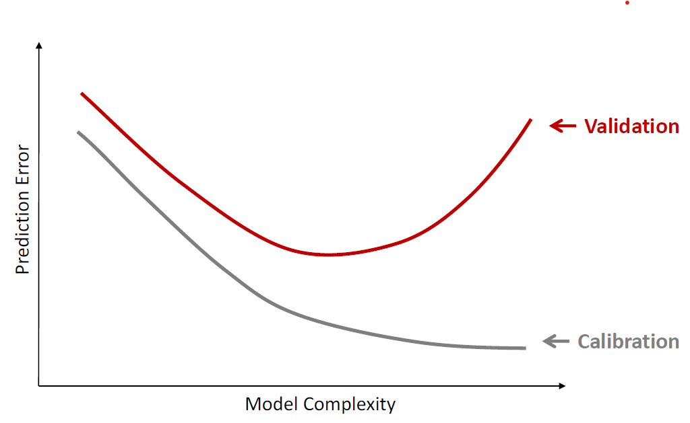
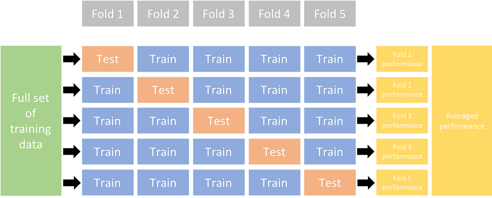
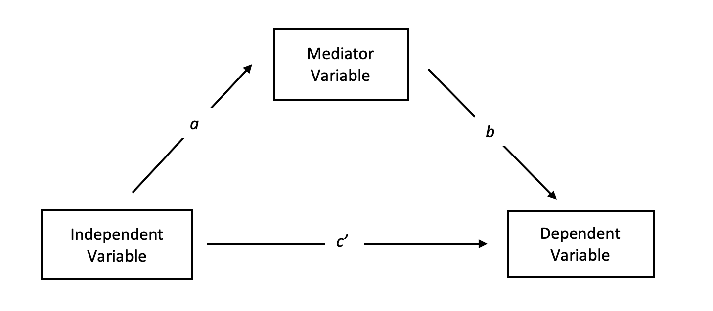
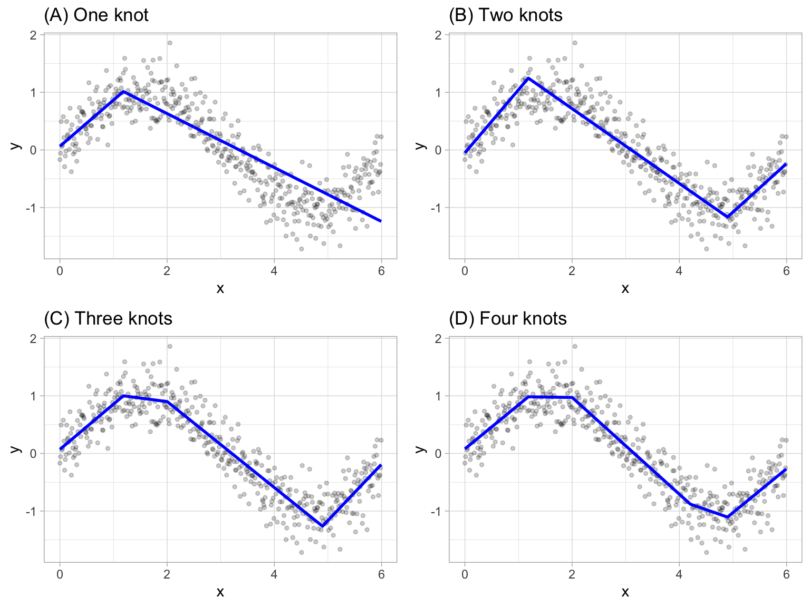
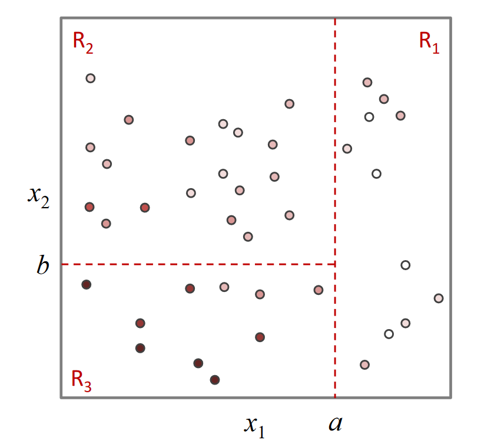
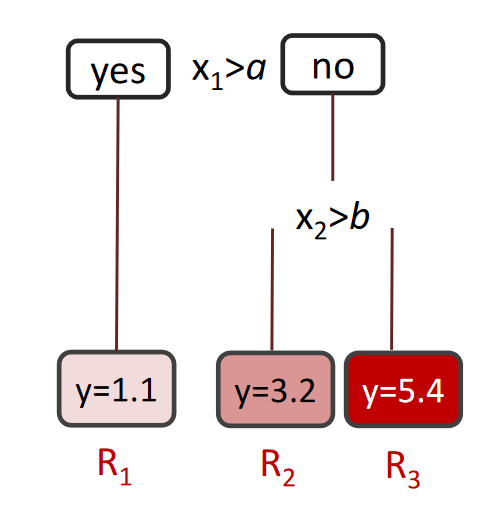

---
editor_options:
  markdown:
    wrap: 72
---

# Modelos de Regresión {#cap-regresion data-en="Regression Models"}

<div class="lang-es">

::: {.rmdnote}

**Para qué sirve esta unidad.** La regresión es la herramienta
cuantitativa más utilizada en marketing para describir relaciones entre
variables, evaluar el efecto de acciones comerciales y construir
pronósticos de demanda, ventas e ingresos. Comprender cómo especificar,
estimar y evaluar un modelo de regresión es un requisito transversal
para las unidades posteriores del curso.

**Habilidades previas requeridas.** Lectura de tablas, noción de
variable aleatoria, interpretación de gráficos, álgebra matricial
básica y manejo de porcentajes.

**Qué debería poder hacer el estudiante al terminar.**

-   Formular un modelo de regresión lineal con la notación de índices
    apropiada para un problema de marketing.
-   Estimar parámetros por OLS e interpretar coeficientes, signos y
    significancia.
-   Evaluar modelos con métricas de ajuste y predicción ($R^2$, RMSE,
    AIC, BIC).
-   Elegir entre especificaciones alternativas usando criterios
    cuantitativos y cualitativos.
-   Aplicar modelos de machine learning como alternativa a la regresión
    clásica.

**Conexión con ejercicios.** A lo largo del capítulo se incluyen
ejercicios guiados que permiten verificar la comprensión de cada
concepto a medida que se avanza.

:::

</div>

<div class="lang-en">

::: {.rmdnote}

**Purpose of this unit.** Regression is the most widely used
quantitative tool in marketing for describing relationships between
variables, evaluating the effect of commercial actions, and building
demand, sales, and revenue forecasts. Understanding how to specify,
estimate, and evaluate a regression model is a cross-cutting
prerequisite for the subsequent units of the course.

**Required prior skills.** Reading tables, notion of random variable,
graph interpretation, basic matrix algebra, and working with
percentages.

**What the student should be able to do upon completion.**

-   Formulate a linear regression model with the appropriate index
    notation for a marketing problem.
-   Estimate parameters via OLS and interpret coefficients, signs, and
    significance.
-   Evaluate models using fit and prediction metrics ($R^2$, RMSE,
    AIC, BIC).
-   Choose among alternative specifications using quantitative and
    qualitative criteria.
-   Apply machine learning models as an alternative to classical
    regression.

**Connection with exercises.** Throughout the chapter, guided exercises
are included to verify understanding of each concept as the reader
progresses.

:::

</div>

## Definiciones clave {data-en="Key Definitions"}

::: {.lang-es}

Antes de introducir la notación formal, conviene estabilizar el
vocabulario que se usará a lo largo de la unidad:

:::

::: {.lang-en}

Before introducing formal notation, it is useful to establish the
vocabulary that will be used throughout this unit:

:::

<div class="lang-es">

::: {.rmdnote}

**Definiciones clave**

-   *Regresión*: técnica estadística para estimar el valor esperado de
    una variable (dependiente) condicional en la realización de otras
    (independientes).
-   *Variable dependiente* ($y$): la cantidad que se desea explicar o
    predecir (ventas, ingresos, demanda).
-   *Variable explicativa* ($x$): una característica observable que
    puede influir en $y$ (precio, gasto publicitario, estacionalidad).
-   *Parámetro* ($\beta$): coeficiente del modelo que cuantifica la
    relación entre una variable explicativa y la variable dependiente.
-   *Coeficiente estimado* ($\hat{\beta}$): valor numérico obtenido al
    ajustar el modelo a los datos.
-   *Error* ($\varepsilon$): diferencia entre el valor observado y el
    valor predicho por el modelo.
-   *Pronóstico*: valor esperado de $y$ para un conjunto dado de
    variables explicativas.
-   *Causalidad vs. correlación*: un modelo de regresión mide
    correlación entre variables; afirmar causalidad requiere condiciones
    adicionales (experimentos, variables instrumentales, modelos
    estructurales).

:::

</div>

<div class="lang-en">

::: {.rmdnote}

**Key definitions**

-   *Regression*: a statistical technique for estimating the expected
    value of a variable (dependent) conditional on the realization of
    others (independent).
-   *Dependent variable* ($y$): the quantity to be explained or
    predicted (sales, revenue, demand).
-   *Explanatory variable* ($x$): an observable characteristic that may
    influence $y$ (price, advertising expenditure, seasonality).
-   *Parameter* ($\beta$): a model coefficient that quantifies the
    relationship between an explanatory variable and the dependent
    variable.
-   *Estimated coefficient* ($\hat{\beta}$): the numerical value
    obtained by fitting the model to the data.
-   *Error* ($\varepsilon$): the difference between the observed value
    and the value predicted by the model.
-   *Forecast*: the expected value of $y$ for a given set of
    explanatory variables.
-   *Causality vs. correlation*: a regression model measures correlation
    between variables; claiming causality requires additional conditions
    (experiments, instrumental variables, structural models).

:::

</div>

<div class="lang-es">

::: {.rmdnote}

**Ejercicio guiado.** ¿Cuál(es) es(son) la utilidad de un modelo de regresión?

i.  Permite medir correlación entre variables.
ii. Permite medir la magnitud de una relación causal.
iii. Permite determinar causalidad entre variables.
iv. Dependiendo de la especificación puede determinar causalidad o
    correlación, pero no ambas simultáneamente.

<details>
<summary>Ver solución</summary>
Respuestas correctas: i. y ii.
Permite medir correlación entre variables y la magnitud de una relación
causal.
</details>

:::

</div>

<div class="lang-en">

::: {.rmdnote}

**Guided exercise.** What is (are) the purpose(s) of a regression model?

i.  It allows measuring correlation between variables.
ii. It allows measuring the magnitude of a causal relationship.
iii. It allows determining causality between variables.
iv. Depending on the specification, it can determine causality or
    correlation, but not both simultaneously.

<details>
<summary>Show solution</summary>
Correct answers: i. and ii.
It allows measuring correlation between variables and the magnitude of a
causal relationship.
</details>

:::

</div>

## Conceptos básicos {data-en="Basic Concepts"}

::: {.lang-es}

Como bien ya se ha estudiado en otros cursos de la carrera de ingeniería
industrial, una *regresión* es una técnica para calcular el valor
esperado de una variable condicional en la realización de otras. Por
ejemplo:

-   ¿Cuál debería ser el precio de venta de una casa en la comuna de
    Providencia, con 4 dormitorios, 170 $m^2$ de superficie construida?
-   ¿Cuáles deberían ser las ventas de Leche semidescremada Nestlé en
    la última semana del mes de abril si el precio es \$723?
-   ¿Cuál debería ser el número de clientes que ve un aviso publicitario
    si se despliega en 4 programas durante 3 semanas y el rating
    promedio de los programas es 8.7 puntos?

:::

::: {.lang-en}

As studied in other courses in the industrial engineering curriculum,
a *regression* is a technique for computing the expected value of a
variable conditional on the realization of others. For example:

-   What should the sale price of a house in the Providencia
    district be, with 4 bedrooms and 170 $m^2$ of built area?
-   What should the weekly sales of Nestlé semi-skimmed milk be
    in the last week of April if the price is \$723?
-   How many customers should see an advertisement if it is
    displayed during 4 shows over 3 weeks and the average
    rating of the shows is 8.7 points?

:::

### Notación {data-en="Notation"}

::: {.lang-es}

En general se denota con $y$ al vector que representa todas las
variables dependientes en un único vector columna, mientras que
$\mathbf{X}$ representa la matriz que incluye todas las variables
independientes (esto incluye una columna de 1s si se desea incluir un
intercepto).

Es importante notar que:

-   Cada columna corresponde a una variable.
-   Cada fila corresponde a un caso.
-   Las dimensiones de las filas del vector $y$ y la matriz $\mathbf{X}$
    deben ser consistentes.
-   Todos los elementos de una misma fila deben tener los mismos
    índices.

Para estimar los parámetros de la recta de regresión se utilizan
diferentes métodos, siendo uno de los más populares el método de Mínimos
Cuadrados Ordinarios (OLS).

:::

::: {.lang-en}

In general, $y$ denotes the vector that represents all dependent
variables in a single column vector, while $\mathbf{X}$ represents
the matrix that includes all independent variables (this includes a
column of 1s if an intercept is desired).

It is important to note that:

-   Each column corresponds to a variable.
-   Each row corresponds to an observation.
-   The row dimensions of vector $y$ and matrix $\mathbf{X}$ must
    be consistent.
-   All elements in the same row must share the same indices.

To estimate the parameters of the regression line, different methods
are used, one of the most popular being Ordinary Least Squares (OLS).

:::

## Mínimos Cuadrados Ordinarios (OLS) y supuestos {data-en="Ordinary Least Squares (OLS) and Assumptions"}

::: {.lang-es}

OLS proporciona una estimación óptima de los parámetros de la recta de
regresión, al encontrar la recta que minimiza la suma de los cuadrados
de las diferencias entre los valores reales y los valores estimados de
la variable dependiente [@wooldridge2019; @greene2018]. Sin embargo,
para que este método sea un estimador adecuado de los parámetros, se
deben cumplir ciertos supuestos:

1.  Existe una *relación lineal* entre la variable dependiente y las
    variables independientes. Debido a esto, la relación entre las
    variables se puede modelar mediante una recta. Sin este supuesto,
    OLS no es apropiado y se debe recurrir a otros métodos.

2.  Los errores tienen una *distribución normal* y tienen una *media
    igual a cero*. Es decir, los errores son insesgados y distribuyen
    de forma simétrica alrededor del cero. Si los errores no siguen una
    distribución normal, los resultados de la regresión pueden no ser
    confiables.

3.  Los errores tienen una *varianza constante* (homocedasticidad). Esto
    significa que la varianza de los errores es la misma para todos los
    valores de las variables independientes. Si no se cumple este
    supuesto, los errores pueden estar influenciados por alguna variable
    independiente y los resultados pueden ser incorrectos.

4.  Los errores son *independientes entre sí*. Es decir, no están
    correlacionados con los errores de otra observación. Si los errores
    están correlacionados, la varianza de los coeficientes puede ser
    demasiado baja, lo que puede llevar a una sobreestimación de la
    significancia estadística.

5.  No existe *multicolinealidad* perfecta entre las variables
    independientes. La multicolinealidad perfecta se refiere a la
    existencia de una relación lineal exacta entre las variables
    independientes. Esto puede ocurrir cuando dos o más variables
    independientes están altamente correlacionadas. Si no se cumple este
    supuesto, los coeficientes estimados pueden no ser confiables y los
    resultados pueden ser incorrectos.

:::

::: {.lang-en}

OLS provides an optimal estimation of the regression line parameters
by finding the line that minimizes the sum of squared differences
between the actual and estimated values of the dependent variable
[@wooldridge2019; @greene2018]. However, for this method to be an
adequate estimator of the parameters, certain assumptions must hold:

1.  There is a *linear relationship* between the dependent variable
    and the independent variables. Because of this, the relationship
    between variables can be modeled by a straight line. Without this
    assumption, OLS is not appropriate and other methods must be used.

2.  The errors have a *normal distribution* and have a *mean equal to
    zero*. That is, the errors are unbiased and symmetrically
    distributed around zero. If the errors do not follow a normal
    distribution, the regression results may not be reliable.

3.  The errors have *constant variance* (homoscedasticity). This means
    that the variance of the errors is the same for all values of the
    independent variables. If this assumption is violated, the errors
    may be influenced by some independent variable and the results
    may be incorrect.

4.  The errors are *independent of each other*. That is, they are not
    correlated with errors from other observations. If errors are
    correlated, the variance of the coefficients may be too low,
    which can lead to an overestimation of statistical significance.

5.  There is no *perfect multicollinearity* among the independent
    variables. Perfect multicollinearity refers to the existence of an
    exact linear relationship among the independent variables. This can
    occur when two or more independent variables are highly correlated.
    If this assumption is violated, the estimated coefficients may not
    be reliable and the results may be incorrect.

:::

<div class="lang-es">

::: {.rmdwarning}

**Errores comunes cuando no se cumplen los supuestos de OLS.**

-   *Violación de linealidad*: el modelo no captura la verdadera
    relación entre las variables. Las predicciones serán sesgadas
    sistemáticamente. Se debe considerar transformaciones o modelos no
    lineales.
-   *Errores no normales*: los intervalos de confianza y los tests de
    hipótesis dejan de ser válidos. Con muestras grandes, el teorema
    central del límite puede mitigar el problema.
-   *Heterocedasticidad*: los errores estándar estimados son
    incorrectos, lo que invalida las pruebas de significancia. Se
    corrige con errores robustos o mínimos cuadrados generalizados.
-   *Autocorrelación*: los errores estándar subestiman la verdadera
    variabilidad, generando significancias espurias. Se recurre a
    modelos de series de tiempo o errores agrupados.
-   *Multicolinealidad*: los coeficientes individuales se vuelven
    inestables y difíciles de interpretar, aunque las predicciones del
    modelo pueden seguir siendo razonables.

:::

</div>

<div class="lang-en">

::: {.rmdwarning}

**Common errors when OLS assumptions are violated.**

-   *Linearity violation*: the model fails to capture the true
    relationship between variables. Predictions will be systematically
    biased. Transformations or nonlinear models should be considered.
-   *Non-normal errors*: confidence intervals and hypothesis tests are
    no longer valid. With large samples, the central limit theorem may
    mitigate the problem.
-   *Heteroscedasticity*: estimated standard errors are incorrect,
    invalidating significance tests. This is corrected with robust
    standard errors or generalized least squares.
-   *Autocorrelation*: standard errors underestimate the true
    variability, generating spurious significances. Time series models
    or clustered standard errors are used.
-   *Multicollinearity*: individual coefficients become unstable and
    difficult to interpret, although the model's predictions may remain
    reasonable.

:::

</div>

::: {.lang-es}

En general, se utiliza OLS porque proporciona una estimación óptima de
los parámetros de la recta de regresión, es decir, los valores que mejor
se ajustan a los datos. El método OLS minimiza la suma de los cuadrados
de las diferencias entre los valores reales y los valores estimados de
la variable dependiente. Esto se logra al encontrar los valores de los
parámetros de la recta que minimizan esta suma de cuadrados.

:::

::: {.lang-en}

In general, OLS is used because it provides an optimal estimation of
the regression line parameters, that is, the values that best fit the
data. The OLS method minimizes the sum of squared differences between
the actual and estimated values of the dependent variable. This is
achieved by finding the values of the line parameters that minimize
this sum of squares.

:::

### Estimación {data-en="Estimation"}

::: {.lang-es}

Considérese el problema de estimar los parámetros
$\beta_0, \beta_1, \ldots, \beta_n$ de la recta de regresión
$Y = \beta_0 + \beta_1 x_1 + \cdots + \beta_n x_n + \varepsilon$, donde
$\varepsilon$ es el término de error e $Y$ es la variable dependiente.
Queremos encontrar los valores de los parámetros
$\beta_0, \beta_1, \ldots, \beta_n$ que minimizan la suma de los
cuadrados de las diferencias entre los valores reales y los valores
estimados de $Y$.

La idea detrás del método de Mínimos Cuadrados Ordinarios (OLS) es
minimizar la función de pérdida
$S(\beta_0, \beta_1, \ldots, \beta_n) = \sum_{i=1}^N (Y_i - \beta_0 - \beta_1 x_{i1} - \cdots - \beta_n x_{in})^2$.
La solución de este problema de optimización se puede encontrar a través
del cálculo de las derivadas parciales de $S$ con respecto a cada uno de
los parámetros $\beta_j$, e igualar a cero. Esto lleva al siguiente
sistema de ecuaciones:

:::

::: {.lang-en}

Consider the problem of estimating the parameters
$\beta_0, \beta_1, \ldots, \beta_n$ of the regression line
$Y = \beta_0 + \beta_1 x_1 + \cdots + \beta_n x_n + \varepsilon$, where
$\varepsilon$ is the error term and $Y$ is the dependent variable.
We want to find the values of the parameters
$\beta_0, \beta_1, \ldots, \beta_n$ that minimize the sum of squared
differences between the actual and estimated values of $Y$.

The idea behind the Ordinary Least Squares (OLS) method is to minimize
the loss function
$S(\beta_0, \beta_1, \ldots, \beta_n) = \sum_{i=1}^N (Y_i - \beta_0 - \beta_1 x_{i1} - \cdots - \beta_n x_{in})^2$.
The solution to this optimization problem can be found by computing the
partial derivatives of $S$ with respect to each parameter $\beta_j$
and setting them equal to zero. This leads to the following system of
equations:

:::

$$\hat{\boldsymbol{\beta}}=(\mathbf{X}^T\mathbf{X})^{-1}\mathbf{X}^T\mathbf{y}
(\#eq:reg-ols)$$

::: {.lang-es}

donde $\mathbf{X}$ es la matriz de variables independientes, $\mathbf{y}$ es el
vector de la variable dependiente y $\hat{\boldsymbol{\beta}}$ es el vector de
estimadores de mínimos cuadrados.

La solución de este sistema entrega los valores de los parámetros
$\beta_0, \beta_1, \ldots, \beta_n$ que minimizan la función de pérdida
$S(\beta_0, \beta_1, \ldots, \beta_n)$. Estos valores se conocen como
los estimadores de mínimos cuadrados de los parámetros de la recta de
regresión.

:::

::: {.lang-en}

where $\mathbf{X}$ is the matrix of independent variables, $\mathbf{y}$ is the
dependent variable vector, and $\hat{\boldsymbol{\beta}}$ is the vector of
least squares estimators.

The solution to this system yields the values of the parameters
$\beta_0, \beta_1, \ldots, \beta_n$ that minimize the loss function
$S(\beta_0, \beta_1, \ldots, \beta_n)$. These values are known as the
least squares estimators of the regression line parameters.

:::

### Propiedades {data-en="Properties"}

::: {.lang-es}

Si se cumplen los supuestos anteriormente mencionados, mínimos cuadrados
ordinarios cumple con las siguientes propiedades:

1.  *Insesgadez*: Los estimadores de mínimos cuadrados son insesgados,
    lo que significa que, en promedio, su valor esperado es igual al
    verdadero valor del parámetro que se está estimando.

2.  *Eficiencia*: Entre todos los estimadores insesgados y lineales, los
    estimadores de mínimos cuadrados tienen la menor varianza posible.

3.  *Linealidad*: Los estimadores de mínimos cuadrados son lineales en
    la variable de respuesta $Y$.

4.  *Consistencia*: Con un tamaño de muestra lo suficientemente grande,
    los estimadores de mínimos cuadrados se acercan al verdadero valor
    del parámetro que se está estimando.

5.  El estimador máximo verosímil, para el caso lineal con errores
    normales, *coincide con el estimador de mínimos cuadrados*.

Según el teorema de Gauss-Markov, al cumplirse las propiedades de
*insesgadez*, *eficiencia* y *linealidad*, los estimadores de OLS
son *BLUE* (Best Linear Unbiased Estimators).

:::

::: {.lang-en}

If the previously mentioned assumptions hold, ordinary least squares
satisfies the following properties:

1.  *Unbiasedness*: The least squares estimators are unbiased, meaning
    that, on average, their expected value equals the true value of
    the parameter being estimated.

2.  *Efficiency*: Among all unbiased linear estimators, the least
    squares estimators have the smallest possible variance.

3.  *Linearity*: The least squares estimators are linear in the
    response variable $Y$.

4.  *Consistency*: With a sufficiently large sample size, the least
    squares estimators converge to the true value of the parameter
    being estimated.

5.  The maximum likelihood estimator, for the linear case with normal
    errors, *coincides with the least squares estimator*.

According to the Gauss-Markov theorem, when the properties of
*unbiasedness*, *efficiency*, and *linearity* hold, the OLS estimators
are *BLUE* (Best Linear Unbiased Estimators).

:::

<div class="lang-es">

::: {.rmdnote}

**Propiedades clave de OLS (resumen).**

-   **BLUE**: bajo los supuestos clásicos, OLS es el mejor estimador
    lineal insesgado (Gauss-Markov).
-   **Insesgadez**: $\mathbb{E}[\hat{\beta}] = \beta$.
-   **Eficiencia**: menor varianza entre estimadores lineales
    insesgados.
-   **Consistencia**: $\hat{\beta} \to \beta$ cuando $n \to \infty$.
-   **Equivalencia MV**: con errores normales, OLS coincide con máxima
    verosimilitud.

:::

</div>

<div class="lang-en">

::: {.rmdnote}

**Key properties of OLS (summary).**

-   **BLUE**: under the classical assumptions, OLS is the Best Linear
    Unbiased Estimator (Gauss-Markov).
-   **Unbiasedness**: $\mathbb{E}[\hat{\beta}] = \beta$.
-   **Efficiency**: lowest variance among linear unbiased estimators.
-   **Consistency**: $\hat{\beta} \to \beta$ as $n \to \infty$.
-   **ML equivalence**: with normal errors, OLS coincides with maximum
    likelihood.

:::

</div>

<div class="lang-es">

::: {.rmdnote}

**Ejemplo 1 (Conceptual).** Una cadena de supermercados desea entender
cómo el precio afecta las ventas semanales de un producto. Se propone el
modelo $\ln(Q_{st}) = \alpha_s + \beta \ln(P_{st}) + \varepsilon_{st}$,
donde $Q_{st}$ son las unidades vendidas en la tienda $s$ durante la
semana $t$, $P_{st}$ es el precio y $\alpha_s$ es un efecto fijo por
tienda.

-   *Especificación*: el modelo log-log implica que $\beta$ se
    interpreta como la elasticidad precio de la demanda.
-   *Estimación*: OLS entrega $\hat{\beta} = -1.8$ con error estándar
    $0.3$.
-   *Interpretación*: un aumento de 1% en el precio se asocia a una
    reducción de 1.8% en las ventas, controlando por diferencias entre
    tiendas.

:::

</div>

<div class="lang-en">

::: {.rmdnote}

**Example 1 (Conceptual).** A supermarket chain wants to understand how
price affects a product's weekly sales. The proposed model is
$\ln(Q_{st}) = \alpha_s + \beta \ln(P_{st}) + \varepsilon_{st}$, where
$Q_{st}$ is the number of units sold in store $s$ during week $t$,
$P_{st}$ is the price, and $\alpha_s$ is a store fixed effect.

-   *Specification*: the log-log model implies that $\beta$ is
    interpreted as the price elasticity of demand.
-   *Estimation*: OLS yields $\hat{\beta} = -1.8$ with standard error
    $0.3$.
-   *Interpretation*: a 1% increase in price is associated with a 1.8%
    decrease in sales, controlling for differences across stores.

:::

</div>

## Estrategias de Modelamiento {data-en="Modeling Strategies"}

### Arte vs. procedimiento {data-en="Art vs. Procedure"}

::: {.lang-es}

El debate entre el arte y el procedimiento en el campo de la
modelización y análisis de datos se ha intensificado en los últimos años
con el auge de la inteligencia artificial y el aprendizaje automático.
Los defensores del arte argumentan que la experiencia y la intuición del
analista son esenciales para identificar patrones y relaciones complejas
en los datos que no son evidentes a simple vista. Por otro lado, los
defensores del procedimiento insisten en que la aplicación rigurosa de
algoritmos y técnicas estadísticas es la única manera de garantizar la
validez y precisión del modelo.

Es importante tener en cuenta que el uso exclusivo de uno u otro enfoque
puede llevar a resultados subóptimos. Por ejemplo, un modelo construido
únicamente a través del arte puede ser difícil de replicar o explicar a
otros, lo que limita su utilidad práctica. Por otro lado, un modelo
construido únicamente a través del procedimiento puede pasar por alto
aspectos importantes de los datos que son evidentes para un experto en
el campo.

En la práctica, los analistas suelen combinar ambos enfoques para
construir modelos efectivos y útiles. Un aspecto clave en este proceso
es la exploración exhaustiva de los datos y la definición de una lista
de modelos candidatos, que pueden incluir diferentes técnicas de
modelización y selección de variables. Luego, se pueden utilizar
diversas métricas de ajuste y predicción para evaluar la calidad de cada
modelo y seleccionar el que mejor se ajuste a los datos y sea capaz de
hacer predicciones precisas.

:::

::: {.lang-en}

The debate between art and procedure in the field of modeling and data
analysis has intensified in recent years with the rise of artificial
intelligence and machine learning. Proponents of art argue that the
analyst's experience and intuition are essential for identifying
complex patterns and relationships in data that are not evident at
first glance. On the other hand, proponents of procedure insist that
the rigorous application of algorithms and statistical techniques is
the only way to ensure model validity and precision.

It is important to keep in mind that using only one or the other
approach may lead to suboptimal results. For example, a model built
exclusively through art may be difficult to replicate or explain to
others, which limits its practical usefulness. On the other hand, a
model built exclusively through procedure may overlook important
aspects of the data that are evident to a domain expert.

In practice, analysts typically combine both approaches to build
effective and useful models. A key aspect of this process is the
exhaustive exploration of data and the definition of a list of
candidate models, which may include different modeling techniques
and variable selection methods. Then, various fit and prediction
metrics can be used to evaluate the quality of each model and select
the one that best fits the data and is capable of making accurate
predictions.

:::

### Aprendizajes Preliminares {data-en="Preliminary Learnings"}

::: {.lang-es}

En el ámbito del modelado estadístico, existen innumerables modelos de
regresión, lo que hace imposible determinar cuál es el mejor en términos
absolutos. Una forma de abordar este problema es equilibrar la
complejidad del modelo con su capacidad explicativa.

Esto significa que el modelo debe ser lo suficientemente simple como
para ser fácilmente interpretable, pero lo suficientemente complejo como
para capturar todas las relaciones relevantes entre las variables.

Para seleccionar un modelo de regresión adecuado, es fundamental tener
conocimientos previos del negocio y realizar una exploración exhaustiva
de los datos antes de aplicar cualquier modelo. Esta exploración ex-ante
puede ayudar a identificar las variables más relevantes y las posibles
relaciones entre ellas. Es importante evaluar cómo se relacionan las
variables, qué variables tienen mayor dispersión y qué variables se
mantienen relativamente constantes.

Después de la exploración ex-ante, es necesario aplicar el modelo y
evaluar su rendimiento mediante la evaluación ex-post. Esto implica
evaluar el modelo en datos nuevos y comprobar si se comporta de manera
similar a cómo lo hizo en los datos de entrenamiento.

La siguiente lista organiza las decisiones clave:

:::

::: {.lang-en}

In the field of statistical modeling, there are countless regression
models, making it impossible to determine which is the best in absolute
terms. One way to address this problem is to balance model complexity
with its explanatory capacity.

This means that the model must be simple enough to be easily
interpretable, yet complex enough to capture all the relevant
relationships among the variables.

To select an appropriate regression model, it is essential to have prior
business knowledge and to conduct an exhaustive exploration of the data
before applying any model. This ex-ante exploration can help identify
the most relevant variables and the possible relationships among them.
It is important to assess how the variables relate to one another,
which variables display greater dispersion, and which variables remain
relatively constant.

After the ex-ante exploration, it is necessary to apply the model and
evaluate its performance through ex-post evaluation. This involves
assessing the model on new data and checking whether it behaves
similarly to how it did on the training data.

The following list organizes the key decisions:

:::

::: {.lang-es}

*1. Elegir nivel de agregación*

Uno de los aspectos clave del análisis de datos es determinar el nivel
adecuado de agregación para realizar el análisis. Por ejemplo, se puede
analizar las ventas de un producto en un supermercado por hora, día,
semana, mes o año. También se puede considerar el análisis de ventas por
SKU (código de identificación), marca, cadena o sala.

Es importante tener en cuenta que el problema de gestión puede imponer
restricciones al nivel de agregación mínimo. Por ejemplo, si un gerente
de una cadena de supermercados necesita tomar decisiones en tiempo real
sobre la reposición de un producto, es posible que necesite datos a
nivel de hora o día. En este caso, analizar las ventas a nivel de semana
o mes no sería útil.

En el análisis de ventas, a menudo se enfrenta un trade-off entre la
sensibilidad al precio y la programación de reposición. Si el análisis
se realiza a nivel de SKU, se puede obtener una comprensión más
detallada de cómo el precio afecta a las ventas. Sin embargo, si el
análisis se realiza a nivel de cadena o sala, se puede obtener una mejor
comprensión de los patrones de reposición.

Agregar los datos a un nivel de agregación más alto puede ser más fácil,
ya que se requiere menos detalle y se puede tener una visión más
general. Sin embargo, puede llevar a una pérdida de precisión por
underfitting. Por ejemplo, si se analiza las ventas a nivel de mes, se
puede perder información valiosa sobre patrones diarios o semanales. Por
otro lado, si la cantidad de datos es limitada, es posible que se
necesite mantener un nivel de agregación más alto para obtener un modelo
preciso. En este caso, reducir el nivel de agregación puede significar
la pérdida de información importante y la reducción de la precisión del
modelo por overfitting.

:::

::: {.lang-en}

*1. Choose the level of aggregation*

One of the key aspects of data analysis is determining the appropriate
level of aggregation for the analysis. For example, one can analyze
the sales of a product in a supermarket by hour, day, week, month, or
year. One can also consider analyzing sales by SKU (identification
code), brand, chain, or store.

It is important to note that the management problem may impose
constraints on the minimum aggregation level. For example, if a
supermarket chain manager needs to make real-time decisions about
product replenishment, hourly or daily data may be required. In that
case, analyzing sales at the weekly or monthly level would not be
useful.

In sales analysis, one often faces a trade-off between price
sensitivity and replenishment scheduling. If the analysis is conducted
at the SKU level, one can obtain a more detailed understanding of how
price affects sales. However, if the analysis is conducted at the chain
or store level, one can obtain a better understanding of replenishment
patterns.

Aggregating data to a higher level can be easier, since less detail is
required and a more general view can be obtained. However, it may lead
to a loss of precision due to underfitting. For example, if sales are
analyzed at the monthly level, valuable information about daily or
weekly patterns may be lost. On the other hand, if the amount of data
is limited, it may be necessary to keep a higher aggregation level in
order to obtain an accurate model. In that case, reducing the
aggregation level may imply the loss of important information and a
reduction in model accuracy due to overfitting.

:::

::: {.lang-es}

*2. Descomposición en múltiples regresiones*

La descomposición en múltiples regresiones es una técnica que permite
abordar problemas complejos y de alta dimensionalidad mediante la
partición del problema en componentes más pequeños y manejables. Este
enfoque puede adoptar diversas formas.

-   *Descomposición por índices:* Aunque en general es preferible
    utilizar una única regresión para analizar las relaciones entre las
    variables, en ciertas situaciones, como en casos de complejidad
    computacional elevada o cuando se abordan problemas con múltiples
    niveles de jerarquía, la descomposición por índices puede ser una
    solución adecuada. Esta técnica implica dividir el conjunto de datos
    en subconjuntos según algún criterio y ajustar modelos de regresión
    separados para cada subconjunto.

-   *Regresión lineal y modelos más complejos:* La regresión lineal es
    un enfoque simple y fácil de estimar que puede ser suficiente en
    muchos casos. Sin embargo, en situaciones donde las relaciones entre
    las variables no son lineales o donde se requiere una mayor
    flexibilidad en el modelado, se pueden justificar modelos más
    complejos, como regresiones polinómicas, regresiones no paramétricas
    o modelos de regresión con variables categóricas.

-   *Descomposición por componentes latentes:* En ciertos casos, la
    variable dependiente puede descomponerse de manera natural en
    componentes latentes, lo que facilita la interpretación de los
    resultados y la identificación de relaciones subyacentes entre las
    variables. Un ejemplo típico es la descomposición de las ventas en
    el número de compras y el número de unidades por compra. Al analizar
    estos componentes por separado, se puede obtener una comprensión más
    detallada de los factores que influyen en las ventas.

-   *Caso del cero inflado (zero inflated):* En algunas situaciones, se
    pueden observar una gran cantidad de ceros en los datos, lo que
    indica una distribución inflada en cero. En estos casos, se puede
    utilizar un modelo de regresión de ceros inflados que distingue
    entre dos procesos distintos: la incidencia de compra (probabilidad
    de que ocurra una compra) y el monto de compra (valor de la compra,
    condicional a que se haya realizado una compra). Este enfoque
    permite analizar de manera más efectiva los factores que afectan
    tanto la propensión a comprar como la cantidad gastada en las
    compras.

:::

::: {.lang-en}

*2. Decomposition into multiple regressions*

Decomposition into multiple regressions is a technique that allows
complex and high-dimensional problems to be addressed by partitioning
the problem into smaller, more manageable components. This approach
can take various forms.

-   *Decomposition by indices:* Although in general it is preferable to
    use a single regression to analyze the relationships among
    variables, in certain situations, such as cases of high
    computational complexity or when dealing with problems involving
    multiple levels of hierarchy, decomposition by indices may be an
    appropriate solution. This technique involves dividing the dataset
    into subsets according to some criterion and fitting separate
    regression models for each subset.

-   *Linear regression and more complex models:* Linear regression is a
    simple and easy-to-estimate approach that may be sufficient in many
    cases. However, in situations where relationships among variables
    are nonlinear or where greater modeling flexibility is required,
    more complex models may be justified, such as polynomial
    regressions, nonparametric regressions, or regression models with
    categorical variables.

-   *Decomposition by latent components:* In some cases, the dependent
    variable can be naturally decomposed into latent components, which
    facilitates interpretation of the results and the identification of
    underlying relationships among variables. A typical example is the
    decomposition of sales into the number of purchases and the number
    of units per purchase. By analyzing these components separately,
    one can obtain a more detailed understanding of the factors that
    influence sales.

-   *Zero-inflated case:* In some situations, one may observe a large
    number of zeros in the data, indicating a zero-inflated
    distribution. In these cases, a zero-inflated regression model can
    be used to distinguish between two different processes: purchase
    incidence (the probability that a purchase occurs) and purchase
    amount (the value of the purchase, conditional on a purchase having
    occurred). This approach allows a more effective analysis of the
    factors that affect both the propensity to buy and the amount spent
    on purchases.

:::

::: {.lang-es}

*3. Transformación de variables*

La transformación de variables es una técnica utilizada para mejorar la
interpretación y el ajuste del modelo. Esta técnica consiste en aplicar
funciones matemáticas a las variables con el objetivo de modificar su
distribución y hacer que el modelo sea más interpretable y
significativo.

Un ejemplo común de transformación de variables es el modelo doble log,
en el cual se aplican logaritmos a las variables dependientes e
independientes para transformar la relación no lineal en una relación
lineal. Esta técnica puede ser útil cuando se analizan datos que siguen
una distribución log-normal o cuando se busca interpretar los
coeficientes de manera logarítmica.

Es importante tener en cuenta que, aunque la transformación de variables
puede mejorar la bondad del ajuste y la precisión de las predicciones,
no siempre es necesario aplicarla. En algunos casos, las variables ya
están en una forma adecuada para el modelo y cualquier transformación
adicional podría reducir la interpretabilidad del modelo. Por lo tanto,
es importante tener una comprensión sólida de los datos y del problema a
resolver antes de aplicar cualquier transformación de variables.

:::

::: {.lang-en}

*3. Variable transformation*

Variable transformation is a technique used to improve model
interpretation and fit. This technique consists of applying
mathematical functions to variables in order to modify their
distribution and make the model more interpretable and meaningful.

A common example of variable transformation is the double-log model, in
which logarithms are applied to both dependent and independent
variables to transform the nonlinear relationship into a linear one.
This technique can be useful when analyzing data that follow a
log-normal distribution or when one seeks to interpret the coefficients
in logarithmic terms.

It is important to keep in mind that, although variable transformation
can improve goodness of fit and predictive accuracy, it is not always
necessary. In some cases, the variables are already in a form that is
appropriate for the model, and any additional transformation could
reduce interpretability. Therefore, it is important to have a solid
understanding of both the data and the problem before applying any
variable transformation.

:::

::: {.lang-es}

Table: (\#tab:reg-interpretacion) Interpretación de coeficientes según transformación de variables.

| *Modelo* | *Var. dependiente* | *Var. independiente* | *Interpretación* |
|----|----|----|----|
| Nivel-nivel | $Y$ | $X$ | $\Delta Y = \beta_1 \Delta X$ |
| Nivel-log | $Y$ | $\log(X)$ | $\Delta Y = \frac{\beta_1}{100}\% \Delta X$ |
| Log-nivel | $\log(Y)$ | $X$ | $\%\Delta Y = (100\beta_1)\Delta X$ |
| Log-log | $\log(Y)$ | $\log(X)$ | $\%\Delta Y = \beta_1 \%\Delta X$ |

:::

::: {.lang-en}

Table: (\#tab:reg-interpretacion) Coefficient interpretation by variable transformation.

| *Model* | *Dep. variable* | *Indep. variable* | *Interpretation* |
|----|----|----|----|
| Level-level | $Y$ | $X$ | $\Delta Y = \beta_1 \Delta X$ |
| Level-log | $Y$ | $\log(X)$ | $\Delta Y = \frac{\beta_1}{100}\% \Delta X$ |
| Log-level | $\log(Y)$ | $X$ | $\%\Delta Y = (100\beta_1)\Delta X$ |
| Log-log | $\log(Y)$ | $\log(X)$ | $\%\Delta Y = \beta_1 \%\Delta X$ |

:::

<div class="lang-es">

::: {.rmdnote}

**Ejemplo 2 (Interpretación de coeficientes).** Dado el modelo
$\ln(y) = \beta_0 + \beta_1 x_1 + \beta_2 \ln(x_2)$, la
interpretación correcta es:

-   Un aumento de una unidad en $x_1$ se asocia a un cambio de
    $(100 \cdot \beta_1)\%$ en $y$ (relación log-nivel).
-   Un aumento de 1% en $x_2$ se asocia a un cambio de $\beta_2\%$ en
    $y$ (relación log-log).

Nótese que un aumento de una unidad en $x_2$ *no* causa un aumento de
$\beta_2\%$ en $y$; esa lectura confunde la escala log-log con la
log-nivel.

:::

</div>

<div class="lang-en">

::: {.rmdnote}

**Example 2 (Coefficient interpretation).** Given the model
$\ln(y) = \beta_0 + \beta_1 x_1 + \beta_2 \ln(x_2)$, the correct
interpretation is:

-   A one-unit increase in $x_1$ is associated with a
    $(100 \cdot \beta_1)\%$ change in $y$ (log-level relationship).
-   A 1% increase in $x_2$ is associated with a $\beta_2\%$ change in
    $y$ (log-log relationship).

Note that a one-unit increase in $x_2$ does *not* cause a $\beta_2\%$
increase in $y$; that reading confuses the log-log scale with the
log-level scale.

:::

</div>

<div class="lang-es">

::: {.rmdnote}

**Ejercicio guiado.** Dado el modelo
$\ln(y)=\beta_{0}+\beta_{1}x_{1}+\beta_{2}\ln(x_{2})$, se puede
asegurar que:

a.  Un aumento de una unidad en $x_{1}$ causa un aumento de $\beta_{0}$
    unidades en $y$.
b.  Un aumento de una unidad en $x_{2}$ causa un aumento de
    $\beta_{2}$% unidades en $y$.
c.  Un aumento de un 1% en $x_{2}$ causa un aumento de $\beta_{2}$
    unidades en $y$.
d.  Un aumento de un 1% en $x_{2}$ causa un aumento de $\beta_{2}$%
    unidades en $y$.
e.  Ninguna de las anteriores.

<details>
<summary>Ver solución</summary>
Respuesta correcta: e.
Ninguna de las anteriores. Un aumento de 1% en $x_2$ causa un cambio de
$\beta_2/100$ en $\ln(y)$.
</details>

:::

</div>

<div class="lang-en">

::: {.rmdnote}

**Guided exercise.** Given the model
$\ln(y)=\beta_{0}+\beta_{1}x_{1}+\beta_{2}\ln(x_{2})$, one can assert
that:

a.  A one-unit increase in $x_{1}$ causes an increase of $\beta_{0}$
    units in $y$.
b.  A one-unit increase in $x_{2}$ causes an increase of
    $\beta_{2}$% units in $y$.
c.  A 1% increase in $x_{2}$ causes an increase of $\beta_{2}$
    units in $y$.
d.  A 1% increase in $x_{2}$ causes an increase of $\beta_{2}$%
    units in $y$.
e.  None of the above.

<details>
<summary>Show solution</summary>
Correct answer: e.
None of the above. A 1% increase in $x_2$ causes a change of
$\beta_2/100$ in $\ln(y)$.
</details>

:::

</div>

<div class="lang-es">

::: {.rmdnote}

**Ejercicio guiado.** ¿Cuál de las siguientes especificaciones NO permite capturar que las
diferencias en el comportamiento $y$ se van incrementando a medida que
aumenta la edad de los sujetos?

a.  $y=\beta_{0}+\sum_{i}\beta_{i}\text{Dummy}_{i},\quad i=\{\text{niños, jóvenes, adultos, ancianos}\}$
b.  $y=\beta_{0}+\beta_{1}\ln(\text{edad})$
c.  $y=\beta_{0}+\beta_{1}\text{edad}+\beta_{2}\text{edad}^{2}$
d.  $y=\beta_{0}+\beta_{1}\exp(\text{edad})$
e.  Ninguna de las anteriores.

<details>
<summary>Ver solución</summary>
Respuesta correcta: b.
$y=\beta_{0}+\beta_{1}\ln(\text{edad})$.
</details>

:::

</div>

<div class="lang-en">

::: {.rmdnote}

**Guided exercise.** Which of the following specifications does NOT allow capturing that
differences in the behavior of $y$ increase as the subjects' age
increases?

a.  $y=\beta_{0}+\sum_{i}\beta_{i}\text{Dummy}_{i},\quad i=\{\text{children, youth, adults, elderly}\}$
b.  $y=\beta_{0}+\beta_{1}\ln(\text{age})$
c.  $y=\beta_{0}+\beta_{1}\text{age}+\beta_{2}\text{age}^{2}$
d.  $y=\beta_{0}+\beta_{1}\exp(\text{age})$
e.  None of the above.

<details>
<summary>Show solution</summary>
Correct answer: b.
$y=\beta_{0}+\beta_{1}\ln(\text{age})$.
</details>

:::

</div>

::: {.lang-es}

*4. Selección de variables*

En el campo de la regresión, existen diferentes enfoques para la
selección de variables, incluyendo métodos automáticos y manuales. Uno
de los métodos automáticos más utilizados es la regresión paso a paso
(*stepwise regression*), que implica la iterativa agregación o
eliminación de variables en función de algún criterio de bondad de
ajuste.

En el enfoque forward de la regresión paso a paso, las variables se van
agregando al modelo una por una, comenzando con la variable que
proporciona el mejor ajuste según el criterio establecido. En cada
etapa, se evalúa si agregar una nueva variable mejora significativamente
el ajuste del modelo.

Por otro lado, en el enfoque backward de la regresión paso a paso,
todas las variables se incluyen inicialmente en el modelo y se van
eliminando una por una, comenzando con la variable que menos contribuye
al ajuste según el criterio establecido. En cada etapa, se evalúa si
eliminar una variable mejora significativamente el ajuste del modelo.

Otro enfoque de selección de variables es la penalización de uso de
parámetros no nulos al momento de minimizar la función de error. Dentro
de este enfoque se encuentra la regresión Ridge y LASSO (Least Absolute
Shrinkage and Selection Operator)

:::

::: {.lang-en}

*4. Variable selection*

In the field of regression, there are different approaches for variable
selection, including automatic and manual methods. One of the most
widely used automatic methods is *stepwise regression*, which involves
iteratively adding or removing variables based on some goodness-of-fit
criterion.

In the forward stepwise approach, variables are added to the model one
at a time, starting with the variable that provides the best fit
according to the selected criterion. At each stage, one evaluates
whether adding a new variable significantly improves model fit.

In the backward stepwise approach, all variables are initially included
in the model and then removed one by one, starting with the variable
that contributes the least to fit according to the selected criterion.
At each stage, one evaluates whether removing a variable significantly
improves model fit.

Another variable-selection approach is to penalize the use of nonzero
parameters when minimizing the loss function. This approach includes
Ridge regression and LASSO (Least Absolute Shrinkage and Selection
Operator)

:::

$$\text{Ridge: }\min_{\boldsymbol{\beta}} \sum_{i}\left(y_i - \beta_0 - \textstyle\sum_{j}\beta_{j}x_{ij}\right)^2
  + \lambda\sum_{j}\beta_{j}^2
(\#eq:reg-ridge)$$
$$\text{LASSO: }\min_{\boldsymbol{\beta}}\sum_{i}\left(y_i - \beta_0 - \textstyle\sum_{j}\beta_{j}x_{ij}\right)^2
  + \lambda\sum_{j}|\beta_{j}|
(\#eq:reg-lasso)$$

::: {.lang-es}

Aunque estos enfoques automáticos de selección de variables pueden ser
convenientes y ahorrar tiempo, es importante tener en cuenta algunas
limitaciones. En primer lugar, las implementaciones automáticas de
selección de variables no exploran todas las posibles combinaciones de
variables, lo que significa que podrían pasar por alto combinaciones
óptimas que un enfoque manual más exhaustivo podría descubrir.

Además, los resultados de la selección automática de variables pueden
generar conjuntos de variables poco intuitivos y difíciles de
interpretar. A veces, el algoritmo puede seleccionar variables que
tienen una relación estadística con la variable de respuesta, pero
carecen de una interpretación causal o intuitiva en el contexto del
problema.

Una alternativa es utilizar una mixtura entre métodos automáticos y
manuales, eligiendo aquellas variables que mejoran el modelo en ajuste y
que igualmente tienen un sentido interpretativo para la resolución de la
pregunta a responder.

:::

::: {.lang-en}

Although these automatic variable-selection approaches can be
convenient and save time, it is important to keep some limitations in
mind. First, automatic variable-selection implementations do not
explore all possible combinations of variables, meaning that they may
overlook optimal combinations that a more exhaustive manual approach
could discover.

In addition, the results of automatic variable selection may generate
sets of variables that are unintuitive and difficult to interpret. At
times, the algorithm may select variables that have a statistical
relationship with the response variable, but lack a causal or intuitive
interpretation in the context of the problem.

An alternative is to use a mixture of automatic and manual methods,
selecting those variables that improve model fit while also having an
interpretive meaning for answering the question of interest.

:::

::: {.lang-es}

Table: (\#tab:reg-seleccion) Criterios de selección de variables.

| *Criterio* | *Ventaja* | *Riesgo* |
|:--:|:--:|:--:|
| Stepwise (AIC/BIC) | Automatizable, rápido | No explora todas las combinaciones |
| LASSO | Selecciona y regulariza simultáneamente | Puede eliminar variables correlacionadas relevantes |
| Ridge | Reduce varianza de estimadores | No realiza selección de variables (mantiene todas) |
| Manual / experto | Interpretabilidad garantizada | Sesgo del analista, lento en alta dimensión |

:::

::: {.lang-en}

Table: (\#tab:reg-seleccion) Variable selection criteria.

| *Criterion* | *Advantage* | *Risk* |
|:--:|:--:|:--:|
| Stepwise (AIC/BIC) | Automated, fast | Does not explore all combinations |
| LASSO | Selects and regularizes simultaneously | May drop relevant correlated variables |
| Ridge | Reduces estimator variance | Does not perform variable selection (keeps all) |
| Manual / expert | Guaranteed interpretability | Analyst bias, slow in high dimensions |

:::

<div class="lang-es">

::: {.rmdnote}

**Ejercicio guiado.** ¿Cuál de las siguientes afirmaciones caracterizan adecuadamente a la
selección automática de variables para un modelo de regresión lineal?
(Puede seleccionar más de una opción):

i.  Vienen predefinidas en planillas de cálculo.
ii. Son siempre peores que selección manual.
iii. Sólo pueden aplicarse sobre el subconjunto de variables continuas.
iv. No consideran todos los modelos posibles.

<details>
<summary>Ver solución</summary>
Respuesta correcta: iv.
No consideran todos los modelos posibles.
</details>

:::

</div>

<div class="lang-en">

::: {.rmdnote}

**Guided exercise.** Which of the following statements adequately characterize automatic
variable selection for a linear regression model? (You may select more
than one option):

i.  They come predefined in spreadsheet software.
ii. They are always worse than manual selection.
iii. They can only be applied to the subset of continuous variables.
iv. They do not consider all possible models.

<details>
<summary>Show solution</summary>
Correct answer: iv.
They do not consider all possible models.
</details>

:::

</div>

::: {.lang-es}

*5. Selección de índices*

La selección de índices en el análisis de regresión es un proceso
discrecional que puede influir significativamente en la interpretación y
el rendimiento de los modelos. Para abordar este problema de manera
efectiva, se pueden seguir algunas pautas generales que ayuden a
identificar y justificar la inclusión de índices en el análisis.

Condiciones para Indexar un Parámetro Es recomendable considerar la
inclusión de un índice en un modelo de regresión si se cumplen las
siguientes tres condiciones:

a)  Relevancia para el problema de gestión: El índice debe ser
    importante para abordar el problema de gestión en cuestión,
    proporcionando una distinción significativa entre diferentes
    aspectos del problema.

b)  Diferencias en el comportamiento de la variable dependiente: La
    variable dependiente debe mostrar comportamientos distintos para
    cada índice, lo que sugiere que la desagregación aporta información
    adicional útil.

c)  Suficiencia de datos: Deben estar disponibles suficientes datos para
    estimar de manera confiable los parámetros desagregados. La falta de
    datos puede conducir a estimaciones poco fiables y a un mayor riesgo
    de sobreajuste.

d)  Índices y Variables Binarias: En el análisis de regresión, los
    índices pueden representarse mediante variables binarias, también
    conocidas como variables dummy. Estas variables toman el valor de 1
    cuando se cumple una condición específica (por ejemplo, si un
    producto pertenece a una categoría determinada) y 0 en caso
    contrario. Aunque la representación de índices mediante variables
    binarias es matemáticamente equivalente, la notación de índices
    suele ser más compacta y se prefiere en la mayoría de los casos.

:::

::: {.lang-en}

*5. Index selection*

Index selection in regression analysis is a discretionary process that
can significantly influence model interpretation and performance. To
address this problem effectively, one can follow some general
guidelines that help identify and justify the inclusion of indices in
the analysis.

Conditions for Indexing a Parameter It is advisable to consider the
inclusion of an index in a regression model if the following three
conditions are met:

a)  Relevance to the management problem: The index must be important
    for addressing the management problem at hand, providing a
    meaningful distinction among different aspects of the problem.

b)  Differences in the behavior of the dependent variable: The
    dependent variable should display different behaviors for each
    index, suggesting that disaggregation provides additional useful
    information.

c)  Sufficiency of data: Sufficient data must be available to reliably
    estimate the disaggregated parameters. A lack of data may lead to
    unreliable estimates and a higher risk of overfitting.

d)  Indices and Binary Variables: In regression analysis, indices can
    be represented by binary variables, also known as dummy variables.
    These variables take the value 1 when a specific condition is met
    (for example, if a product belongs to a certain category) and 0
    otherwise. Although representing indices through binary variables
    is mathematically equivalent, index notation is usually more
    compact and is preferred in most cases.

:::

<div class="lang-es">

::: {.rmdnote}

**Ejercicio guiado.** Se tiene el siguiente modelo lineal de venta de productos:

\[Q_{ist}=\theta_{s}+\mu_{is}P_{ist}+\gamma t+\varepsilon_{ist}\]

Donde $Q_{ist}$ es la cantidad vendida del producto $i$ en la tienda
$s$ en el año $t$ y $P_{ist}$ el precio. El set de datos contiene
registros para 5 productos y 5 tiendas entre 1960 y 2015. A partir de
esto, se puede afirmar que (puede elegir más de una opción):

i.  Transformar $\gamma t$ en $\gamma_{t}$ no influye en el modelo ya
    que son equivalentes.
ii. Transformar los coeficientes $\mu_{is}$ a $\mu_{i}+\mu_{s}$ implica
    calcular menos parámetros.
iii. El modelo no permite capturar comportamiento cíclico de la demanda.
iv. Los parámetros $\theta_{s}$ y $\mu_{is}$ no pueden estimarse
    simultáneamente.

<details>
<summary>Ver solución</summary>
Respuestas correctas: ii. y iii.
Transformar $\mu_{is}$ a $\mu_{i}+\mu_{s}$ reduce parámetros; el modelo
no permite capturar comportamiento cíclico de la demanda.
</details>

:::

</div>

<div class="lang-en">

::: {.rmdnote}

**Guided exercise.** Consider the following linear model for product sales:

\[Q_{ist}=\theta_{s}+\mu_{is}P_{ist}+\gamma t+\varepsilon_{ist}\]

Where $Q_{ist}$ is the quantity sold of product $i$ in store $s$ in
year $t$ and $P_{ist}$ is the price. The dataset contains records for
5 products and 5 stores between 1960 and 2015. Based on this, which of
the following can be asserted (you may select more than one option):

i.  Transforming $\gamma t$ into $\gamma_{t}$ does not affect the model
    since they are equivalent.
ii. Transforming the coefficients $\mu_{is}$ into $\mu_{i}+\mu_{s}$
    implies estimating fewer parameters.
iii. The model does not allow capturing cyclical demand behavior.
iv. The parameters $\theta_{s}$ and $\mu_{is}$ cannot be estimated
    simultaneously.

<details>
<summary>Show solution</summary>
Correct answers: ii. and iii.
Transforming $\mu_{is}$ into $\mu_{i}+\mu_{s}$ reduces the number of
parameters; the model does not allow capturing cyclical demand behavior.
</details>

:::

</div>

::: {.lang-es}

*6. Uso de jerarquías*

Una jerarquía aparece cuando un parámetro del modelo aparece como una
función de otros parámetros. Esta técnica es útil para detectar posibles
efectos de interacción entre las variables predictoras, permitiendo
escribir modelos más parsimoniosos. La inclusión de jerarquías debe
estar basada en una teoría clara o una justificación empírica.

:::

::: {.lang-en}

*6. Use of hierarchies*

A hierarchy arises when a model parameter appears as a function of
other parameters. This technique is useful for detecting possible
interaction effects among predictor variables, enabling the
specification of more parsimonious models. The inclusion of hierarchies
should be based on a clear theory or empirical justification.

:::

<div class="lang-es">

::: {.rmdnote}

**Resumen parcial: Estrategias de Modelamiento.**

Las decisiones clave al construir un modelo de regresión son:

1.  **Nivel de agregación**: balancear granularidad con disponibilidad
    de datos.
2.  **Descomposición**: separar el problema en submodelos cuando la
    estructura lo permita.
3.  **Transformaciones**: elegir la forma funcional que mejor represente
    la relación (nivel-nivel, log-log, etc.).
4.  **Selección de variables**: combinar métodos automáticos y juicio
    experto.
5.  **Selección de índices**: incluir efectos fijos cuando haya
    heterogeneidad relevante.
6.  **Jerarquías**: capturar interacciones entre variables de forma
    parsimoniosa.

:::

</div>

<div class="lang-en">

::: {.rmdnote}

**Partial summary: Modeling Strategies.**

The key decisions when building a regression model are:

1.  **Level of aggregation**: balance granularity with data
    availability.
2.  **Decomposition**: separate the problem into submodels when the
    structure allows it.
3.  **Transformations**: choose the functional form that best represents
    the relationship (level-level, log-log, etc.).
4.  **Variable selection**: combine automatic methods and expert
    judgment.
5.  **Index selection**: include fixed effects when relevant
    heterogeneity exists.
6.  **Hierarchies**: capture interactions between variables in a
    parsimonious manner.

:::

</div>

## Evaluación de modelos {data-en="Model Evaluation"}

::: {.lang-es}

La evaluación de modelos estadísticos es un proceso fundamental para
determinar la calidad y utilidad de los modelos, es decir, para
determinar si un modelo se ajusta adecuadamente a los datos y si es
útil para hacer predicciones o inferencias.

Es importante destacar que la evaluación de modelos estadísticos no es
un proceso estático y que puede requerir ajustes y modificaciones a
medida que se adquiere más información o se amplía el alcance del
modelo. Por lo tanto, es fundamental seguir actualizando y refinando los
modelos para asegurar su calidad y utilidad en la toma de decisiones
basadas en datos.

:::

::: {.lang-en}

The evaluation of statistical models is a fundamental process for
determining the quality and usefulness of models, that is, for
determining whether a model fits the data adequately and whether it
is useful for making predictions or inferences.

It is important to emphasize that statistical model evaluation is not a
static process and may require adjustments and modifications as more
information is acquired or as the scope of the model expands.
Therefore, it is essential to continue updating and refining models to
ensure their quality and usefulness in data-driven decision-making.

:::

### ¿Qué se busca en un modelo? {data-en="What Makes a Good Model?"}

::: {.lang-es}

Lo deseable en un modelo es que cualitativamente pueda contar una buena
historia --- proporcionar información útil para tomar decisiones --- y
que cuantitativamente ajuste bien a los datos, de tal manera que reduzca
el error de predicción y pueda generar un pronóstico creíble.

Con esto en mente, se busca un criterio bien definido para comparar
modelos y determinar si un modelo dado es suficientemente bueno.

La siguiente tabla resume las métricas más utilizadas:

:::

::: {.lang-en}

What is desirable in a model is that it can qualitatively tell a good
story --- provide useful information for decision-making --- and that
it quantitatively fits the data well, so that it reduces prediction
error and can generate a credible forecast.

With this in mind, we want a well-defined criterion for comparing
models and determining whether a given model is sufficiently good.

The following table summarizes the most commonly used metrics:

:::

::: {.lang-es}

Table: (\#tab:reg-metricas-resumen) Resumen de métricas de evaluación.

| *Métrica* | *Qué mide* | *Cuándo usarla* | *Riesgo si se usa sola* |
|:--:|:--:|:--:|:--:|
| $R^2$ | Varianza explicada | Comparar modelos con igual nº de variables | No explica la utilidad de las variables |
| $R^2_{adj}$ | Varianza explicada penalizada | Comparar modelos con distinto nº de variables | No penaliza fuertemente modelos complejos |
| RMSE | Error promedio en unidades de $y$ | Medir magnitud del error | Sensible a outliers |
| MAE | Error promedio absoluto | Medir error robusto a outliers | No penaliza errores grandes |
| MAPE | Error porcentual | Comparar entre escalas distintas | Indefinido si $y_i = 0$ |
| AIC | Ajuste penalizado por complejidad | Selección de modelos | Sólo relativo, no absoluto |
| BIC | Ajuste con penalización más fuerte | Selección con preferencia por parsimonia | Penalización puede ser excesiva con $n$ grande |

:::

::: {.lang-en}

Table: (\#tab:reg-metricas-resumen) Evaluation metrics summary.

| *Metric* | *What it measures* | *When to use it* | *Risk if used alone* |
|:--:|:--:|:--:|:--:|
| $R^2$ | Explained variance | Compare models with equal number of variables | Increases when adding variables |
| $R^2_{adj}$ | Penalized explained variance | Compare models with different number of variables | Does not strongly penalize complex models |
| RMSE | Average error in units of $y$ | Measure error magnitude | Sensitive to outliers |
| MAE | Mean absolute error | Measure error robust to outliers | Does not penalize large errors |
| MAPE | Percentage error | Compare across different scales | Undefined if $y_i = 0$ |
| AIC | Fit penalized by complexity | Model selection | Only relative, not absolute |
| BIC | Fit with stronger penalization | Selection with preference for parsimony | Penalization may be excessive with large $n$ |

:::

### Ajuste por métricas generales {data-en="General Metrics"}

::: {.lang-es}

Las siguientes métricas de ajuste se basan en reducir los errores de
predicción de los modelos. La tabla a continuación resume las métricas
más utilizadas:

Table: (\#tab:reg-metricas-formulas) Fórmulas de métricas de ajuste.

| *Métrica* | *Fórmula* | *Interpretación* | *Limitación* |
|:----------|:----------|:-----------------|:-------------|
| $R^2 \in [0,1]$ | $\frac{\sum (\hat{y}_i - \bar{y})^2}{\sum (y_i - \bar{y})^2}$ | Varianza de $y$ explicada | Aumenta al agregar variables |
| $R^2_{adj} \in (-\infty,1]$ | $1 - \frac{(1 - R^2)(n-1)}{n-k-1}$ | $R^2$ corregido por $k$ predictores | Puede ser negativo |
| MAE $\geq 0$ | $\frac{1}{n}\sum \lvert y_i - \hat{y}_i \rvert$ | Error absoluto promedio | No penaliza errores grandes |
| MAPE $\geq 0$ | $\frac{1}{n}\sum \left\lvert\frac{y_i - \hat{y}_i}{y_i}\right\rvert$ | Error porcentual | Indefinido si $y_i = 0$ |
| RMSE $\geq 0$ | $\sqrt{\frac{1}{n}\sum (y_i - \hat{y}_i)^2}$ | Error cuadrático medio | Sensible a valores atípicos |

:::

::: {.lang-en}

The following fit metrics are based on reducing model prediction errors.
The table below summarizes the most commonly used metrics:

Table: (\#tab:reg-metricas-formulas) Fit metric formulas.

| *Metric* | *Formula* | *Interpretation* | *Limitation* |
|:---------|:----------|:-----------------|:-------------|
| $R^2 \in [0,1]$ | $\frac{\sum (\hat{y}_i - \bar{y})^2}{\sum (y_i - \bar{y})^2}$ | Variance of $y$ explained | Increases with more variables |
| $R^2_{adj} \in (-\infty,1]$ | $1 - \frac{(1-R^2)(n-1)}{n-k-1}$ | $R^2$ adjusted for $k$ predictors | Can be negative |
| MAE $\geq 0$ | $\frac{1}{n}\sum \lvert y_i - \hat{y}_i \rvert$ | Mean absolute error | No penalty for large errors |
| MAPE $\geq 0$ | $\frac{1}{n}\sum \left\lvert\frac{y_i - \hat{y}_i}{y_i}\right\rvert$ | Percentage error | Undefined if $y_i = 0$ |
| RMSE $\geq 0$ | $\sqrt{\frac{1}{n}\sum (y_i - \hat{y}_i)^2}$ | Root mean squared error | Sensitive to outliers |

:::

<div class="lang-es">

::: {.rmdnote}

**Métricas de evaluación: cuándo usar cada una.**

-   Use **$R^2_{adj}$** (no $R^2$) cuando compare modelos con distinto
    número de variables.
-   Use **RMSE** cuando los errores grandes sean especialmente costosos.
-   Use **MAE** cuando quiera una métrica robusta a valores atípicos.
-   Use **MAPE** cuando necesite comparar errores entre variables de
    distinta escala.
-   Use **AIC/BIC** cuando quiera penalizar explícitamente la
    complejidad del modelo.

:::

</div>

<div class="lang-en">

::: {.rmdnote}

**Evaluation metrics: when to use each one.**

-   Use **$R^2_{adj}$** (not $R^2$) when comparing models with different
    numbers of variables.
-   Use **RMSE** when large errors are especially costly.
-   Use **MAE** when you need a metric robust to outliers.
-   Use **MAPE** when you need to compare errors across variables of
    different scales.
-   Use **AIC/BIC** when you want to explicitly penalize model
    complexity.

:::

</div>

### Ajuste basado en la probabilidad {data-en="Likelihood-Based Fit"}

::: {.lang-es}

También es posible darle una interpretación probabilística al ajuste. La idea central es elegir aquellos parámetros $\theta$ que maximicen la probabilidad de observar los datos que efectivamente se observaron. Esta probabilidad se cuantifica mediante la *función de verosimilitud*:

:::

::: {.lang-en}

It is also possible to give the fit a probabilistic interpretation. The central idea is to choose those parameters $\theta$ that maximize the probability of observing the data that were actually observed. This probability is quantified through the *likelihood function*:

:::

$$L(\theta | x_1, x_2, \ldots, x_n) = \prod_{i=1}^{n} f(x_i;\theta)
(\#eq:reg-likelihood)$$

::: {.lang-es}

donde $f(x_i;\theta)$ es la densidad (o probabilidad) de la observación $x_i$ evaluada en el vector de parámetros $\theta$. Dado que el producto de probabilidades puede resultar numéricamente inestable, se trabaja con el logaritmo de la verosimilitud (*log-likelihood*):

:::

::: {.lang-en}

where $f(x_i;\theta)$ is the density (or probability) of observation $x_i$ evaluated at the parameter vector $\theta$. Since the product of probabilities can be numerically unstable, the logarithm of the likelihood (*log-likelihood*) is used:

:::

$$\ell(\theta | \mathbf{x}) = \sum_{i=1}^{n} \log(f(x_i|\theta))
(\#eq:reg-loglik)$$

::: {.lang-es}

El estimador de máxima verosimilitud (EMV) es $\hat{\theta} = \arg\max_\theta \ell(\theta|\mathbf{x})$. A partir de la log-verosimilitud se construyen las siguientes métricas de ajuste:

1.  *Razón de verosimilitud* (pseudo $R^2$ de McFadden): compara la log-verosimilitud del modelo estimado $\ell(\hat{\boldsymbol{\beta}})$ con la del modelo nulo $\ell(\mathbf{0})$ (solo intercepto). Valores cercanos a 1 indican un buen ajuste relativo al modelo nulo:

:::

::: {.lang-en}

The maximum likelihood estimator (MLE) is $\hat{\theta} = \arg\max_\theta \ell(\theta|\mathbf{x})$. From the log-likelihood, the following fit metrics are constructed:

1.  *Likelihood ratio* (McFadden's pseudo $R^2$): compares the log-likelihood of the estimated model $\ell(\hat{\boldsymbol{\beta}})$ with that of the null model $\ell(\mathbf{0})$ (intercept only). Values close to 1 indicate a good fit relative to the null model:

:::

$$\rho = 1 - \frac{\ell(\hat{\boldsymbol{\beta}})}{\ell(\mathbf{0})}
(\#eq:reg-pseudor2)$$

::: {.lang-es}

2.  *Criterio de Información de Akaike* (AIC): penaliza la complejidad del modelo sumando $2k$, donde $k$ es el número de parámetros estimados. Un menor AIC indica un mejor balance entre ajuste y parsimonia. Su derivación se basa en minimizar la divergencia de Kullback-Leibler entre el modelo verdadero y el estimado [@tobar2024]:

:::

::: {.lang-en}

2.  *Akaike Information Criterion* (AIC): penalizes model complexity by adding $2k$, where $k$ is the number of estimated parameters. A lower AIC indicates a better balance between fit and parsimony. Its derivation is based on minimizing the Kullback-Leibler divergence between the true model and the estimated one [@tobar2024]:

:::

$$AIC = -2\ell(\hat{\boldsymbol{\beta}}) + 2k
(\#eq:reg-aic)$$

::: {.lang-es}

3.  *Criterio de Información Bayesiano* (BIC o criterio de Schwarz): similar al AIC, pero penaliza más fuertemente los modelos complejos al reemplazar $2k$ por $k\log(n)$, donde $n$ es el número de observaciones. Para muestras grandes ($n > e^2 \approx 7.4$), el BIC penaliza más que el AIC y tiende a seleccionar modelos más parsimoniosos [@tobar2024]:

:::

::: {.lang-en}

3.  *Bayesian Information Criterion* (BIC or Schwarz criterion): similar to AIC, but penalizes complex models more heavily by replacing $2k$ with $k\log(n)$, where $n$ is the number of observations. For large samples ($n > e^2 \approx 7.4$), BIC penalizes more than AIC and tends to select more parsimonious models [@tobar2024]:

:::

$$BIC = -2\ell(\hat{\boldsymbol{\beta}}) + k\log(n)
(\#eq:reg-bic)$$

### Errores dentro y fuera de la muestra {data-en="In-Sample and Out-of-Sample Errors"}

::: {.lang-es}

En general, se busca construir modelos que sean generalizables a datos no observados durante la estimación. Para ello se distingue entre el *error dentro de la muestra* (in-sample), calculado sobre los datos de entrenamiento, y el *error fuera de la muestra* (out-of-sample), evaluado sobre datos nuevos. Un modelo puede ajustar perfectamente los datos de entrenamiento (bajo error in-sample) pero fallar en datos nuevos si ha capturado ruido en lugar de la señal subyacente: este fenómeno se denomina *sobreajuste* (overfitting). Por el contrario, un modelo demasiado simple puede no capturar la estructura de los datos (*subajuste* o underfitting).

La tensión entre ajuste y generalización se formaliza mediante la **descomposición sesgo-varianza** [@tobar2024]. Sea $\hat{f}(\mathbf{x}|\mathcal{D})$ un estimador de la función verdadera $f(\mathbf{x})$, construido a partir de un conjunto de entrenamiento $\mathcal{D}$, y sea $y = f(\mathbf{x}) + \varepsilon$ con $\mathbb{E}(\varepsilon) = 0$ y $\text{Var}(\varepsilon) = \sigma^2$. El error cuadrático esperado de predicción se descompone en:

:::

::: {.lang-en}

In general, the goal is to build models that generalize to data not observed during estimation. A distinction is made between the *in-sample error*, computed on the training data, and the *out-of-sample error*, evaluated on new data. A model may fit the training data perfectly (low in-sample error) but fail on new data if it has captured noise instead of the underlying signal: this phenomenon is called *overfitting*. Conversely, a model that is too simple may fail to capture the data structure (*underfitting*).

The tension between fit and generalization is formalized through the **bias-variance decomposition** [@tobar2024]. Let $\hat{f}(\mathbf{x}|\mathcal{D})$ be an estimator of the true function $f(\mathbf{x})$, built from a training set $\mathcal{D}$, and let $y = f(\mathbf{x}) + \varepsilon$ with $\mathbb{E}(\varepsilon) = 0$ and $\text{Var}(\varepsilon) = \sigma^2$. The expected prediction squared error decomposes as:

:::

$$\mathbb{E}_{\mathcal{D}}\!\left[(y - \hat{f})^2\right]
= \underbrace{\text{Sesgo}^2(\hat{f})}_{\text{Bias}^2}
+ \underbrace{\text{Var}(\hat{f})}_{\text{Variance}}
+ \sigma^2
(\#eq:reg-biasvar)$$

::: {.lang-es}

donde:

-   **Sesgo** ($\text{Bias}(\hat{f}) = \mathbb{E}_{\mathcal{D}}[\hat{f}] - f$): mide cuán lejos está, en promedio, la predicción del valor verdadero. Un modelo muy simple (pocas variables, sin interacciones) tendrá alto sesgo.
-   **Varianza** ($\text{Var}(\hat{f}) = \mathbb{E}_{\mathcal{D}}\left[(\hat{f} - \mathbb{E}[\hat{f}])^2\right]$): mide cuánto cambia el estimador al variar la muestra de entrenamiento. Un modelo muy complejo (muchos parámetros) tendrá alta varianza.
-   $\sigma^2$: varianza irreducible del ruido, que no puede ser controlada por el modelo.

A medida que la complejidad del modelo aumenta, el sesgo disminuye pero la varianza crece, generando una curva convexa para el error total. El modelo óptimo se encuentra en el punto que minimiza esta suma, lo que justifica el uso de técnicas de validación para elegir la complejidad adecuada.

:::

::: {.lang-en}

where:

-   **Bias** ($\text{Bias}(\hat{f}) = \mathbb{E}_{\mathcal{D}}[\hat{f}] - f$): measures how far, on average, the prediction is from the true value. A very simple model (few variables, no interactions) will have high bias.
-   **Variance** ($\text{Var}(\hat{f}) = \mathbb{E}_{\mathcal{D}}\left[(\hat{f} - \mathbb{E}[\hat{f}])^2\right]$): measures how much the estimator changes when the training sample varies. A very complex model (many parameters) will have high variance.
-   $\sigma^2$: irreducible noise variance, which cannot be controlled by the model.

As model complexity increases, bias decreases but variance grows, generating a convex curve for the total error. The optimal model is found at the point that minimizes this sum, which justifies the use of validation techniques to choose the appropriate complexity.

:::

```{r fig-fitting, fig.cap="Error de calibración vs. predicción", out.width='50%', fig.align='center', echo=FALSE}

```

### División de datos {data-en="Data Splitting"}

::: {.lang-es}

Para evaluar la capacidad de generalización, el conjunto de datos $\mathcal{D}$ se divide en subconjuntos con roles diferenciados:

-   **Conjunto de entrenamiento** (*training set*): se utiliza para estimar los parámetros del modelo. Típicamente representa entre el 60% y el 80% de los datos.
-   **Conjunto de validación** (*validation set*): se emplea para calibrar hiperparámetros (por ejemplo, el grado de un polinomio o el parámetro de regularización $\rho$) y seleccionar entre modelos candidatos.
-   **Conjunto de prueba** (*test set*): se reserva para la evaluación final del modelo seleccionado. No debe utilizarse en ninguna decisión de modelamiento.

Una regla usual es destinar el 50% a entrenamiento y 25% a validación y test, respectivamente [@tobar2024]. La división debe realizarse *antes* de cualquier transformación que utilice información del conjunto completo (por ejemplo, estandarización), para evitar *data leakage*. En datos con estructura temporal, la división debe respetar el orden cronológico.

:::

::: {.lang-en}

To evaluate generalization capability, the dataset $\mathcal{D}$ is split into subsets with differentiated roles:

-   **Training set**: used to estimate the model parameters. Typically represents between 60% and 80% of the data.
-   **Validation set**: used to calibrate hyperparameters (e.g., the degree of a polynomial or the regularization parameter $\rho$) and select among candidate models.
-   **Test set**: reserved for the final evaluation of the selected model. It must not be used in any modeling decision.

A common rule is to allocate 50% for training and 25% each for validation and test [@tobar2024]. The split must be performed *before* any transformation that uses information from the full dataset (e.g., standardization), to avoid *data leakage*. For data with temporal structure, the split must respect chronological order.

:::

### Validación cruzada {data-en="Cross-Validation"}

::: {.lang-es}

La validación cruzada es una técnica que permite estimar el error de generalización de un modelo sin necesidad de reservar un conjunto de validación fijo [@tobar2024]. Existen dos familias principales:

**Validación cruzada exhaustiva:**

-   *Leave-$p$-out* (LpOCV): se dejan $p$ observaciones para validación y se entrena con las $n-p$ restantes. Se repite para todas las $\binom{n}{p}$ combinaciones posibles.
-   *Leave-one-out* (LOOCV): caso particular con $p=1$. Cada observación se usa una vez como validación mientras las demás entrenan el modelo. Es computacionalmente costoso ($n$ modelos), pero tiene bajo sesgo.

**Validación cruzada no exhaustiva:**

-   *$k$-fold*: el conjunto $\mathcal{D}$ se divide en $k$ grupos de igual tamaño. En cada iteración, uno de los $k$ grupos sirve de validación y los restantes $k-1$ de entrenamiento. Se repite $k$ veces (una por fold) y se promedian los errores. Valores típicos son $k=5$ o $k=10$.
-   *Monte Carlo CV*: se realizan particiones binarias aleatorias de $\mathcal{D}$ de forma repetida; en cada partición se entrena y evalúa el modelo.

El pipeline de validación cruzada opera así: (1) dividir $\mathcal{D}$ en $k$ folds; (2) para cada fold $j$, entrenar el modelo con los folds $\{1, \ldots, k\}\setminus\{j\}$; (3) evaluar el error en el fold $j$; (4) promediar los $k$ errores obtenidos. El hiperparámetro o modelo que minimice este promedio es el seleccionado.

:::

::: {.lang-en}

Cross-validation is a technique that estimates a model's generalization error without requiring a fixed validation set [@tobar2024]. There are two main families:

**Exhaustive cross-validation:**

-   *Leave-$p$-out* (LpOCV): $p$ observations are left for validation and the model is trained on the remaining $n-p$. This is repeated for all $\binom{n}{p}$ possible combinations.
-   *Leave-one-out* (LOOCV): special case with $p=1$. Each observation is used once for validation while the rest train the model. Computationally expensive ($n$ models), but has low bias.

**Non-exhaustive cross-validation:**

-   *$k$-fold*: dataset $\mathcal{D}$ is divided into $k$ equal-sized groups. In each iteration, one of the $k$ groups serves as validation and the remaining $k-1$ as training. Repeated $k$ times (one per fold) and errors are averaged. Typical values are $k=5$ or $k=10$.
-   *Monte Carlo CV*: random binary partitions of $\mathcal{D}$ are performed repeatedly; the model is trained and evaluated on each partition.

The cross-validation pipeline operates as follows: (1) split $\mathcal{D}$ into $k$ folds; (2) for each fold $j$, train the model on folds $\{1, \ldots, k\}\setminus\{j\}$; (3) evaluate the error on fold $j$; (4) average the $k$ errors obtained. The hyperparameter or model that minimizes this average is selected.

:::

```{r fig-cv, fig.cap="Ejemplo de validación cruzada", out.width='70%', fig.align='center', echo=FALSE}

```

<div class="lang-es">

::: {.rmdnote}

**Ejemplo 3 (Evaluación de modelos).** Se han estimado dos modelos para
predecir las ventas semanales de un producto. El Modelo A tiene
$R^2 = 0.85$, $RMSE_{train} = 120$ y $RMSE_{test} = 180$. El Modelo B
tiene $R^2 = 0.78$, $RMSE_{train} = 150$ y $RMSE_{test} = 160$.

Aunque el Modelo A tiene mejor ajuste en la muestra de entrenamiento,
la brecha entre $RMSE_{train}$ y $RMSE_{test}$ sugiere sobreajuste. El
Modelo B, con un ajuste más modesto pero mayor capacidad de
generalización, es preferible para pronóstico.

:::

</div>

<div class="lang-en">

::: {.rmdnote}

**Example 3 (Model evaluation).** Two models have been estimated to
predict a product's weekly sales. Model A has $R^2 = 0.85$,
$RMSE_{train} = 120$, and $RMSE_{test} = 180$. Model B has
$R^2 = 0.78$, $RMSE_{train} = 150$, and $RMSE_{test} = 160$.

Although Model A has a better fit on the training sample, the gap
between $RMSE_{train}$ and $RMSE_{test}$ suggests overfitting. Model B,
with a more modest fit but greater generalization ability, is preferable
for forecasting.

:::

</div>

### Test de hipótesis {data-en="Hypothesis Testing"}

::: {.lang-es}

Además de la evaluación del ajuste mediante métricas, los test de hipótesis permiten realizar inferencias estadísticas formales sobre los parámetros del modelo. La lógica general de un test es: (1) plantear una hipótesis nula $H_0$ y una alternativa $H_1$; (2) calcular un estadístico de prueba a partir de los datos; (3) comparar el estadístico con un valor crítico de su distribución bajo $H_0$ (o equivalentemente, calcular el *p-valor*); (4) rechazar $H_0$ si el estadístico supera el valor crítico al nivel de significancia $\alpha$ elegido.

A continuación se presentan los cuatro test más relevantes en el contexto de regresión:

**1. Test $t$ (significancia individual).** Evalúa si un coeficiente individual es significativamente distinto de cero:

:::

::: {.lang-en}

Beyond fit metrics, hypothesis tests allow formal statistical inferences about model parameters. The general logic of a test is: (1) state a null hypothesis $H_0$ and an alternative $H_1$; (2) compute a test statistic from the data; (3) compare the statistic with a critical value from its distribution under $H_0$ (or equivalently, compute the *p-value*); (4) reject $H_0$ if the statistic exceeds the critical value at the chosen significance level $\alpha$.

The four most relevant tests in the regression context are presented below:

**1. $t$-test (individual significance).** Evaluates whether an individual coefficient is significantly different from zero:

:::

\[H_0: \beta_j = 0 \quad\text{vs.}\quad H_1: \beta_j \neq 0\]

$$t_j = \frac{\hat{\beta}_j}{\text{se}(\hat{\beta}_j)} \sim t_{n-k-1}
(\#eq:reg-ttest)$$

::: {.lang-es}

donde $\text{se}(\hat{\beta}_j)$ es el error estándar del coeficiente. Se rechaza $H_0$ si $|t_j| > t_{\alpha/2, n-k-1}$. Un *p-valor* bajo (típicamente $< 0.05$) indica que la variable $x_j$ tiene un efecto estadísticamente significativo.

**2. Test $F$ (significancia conjunta).** Evalúa si un subconjunto de coeficientes es conjuntamente significativo, es decir, si el modelo completo explica significativamente más que el modelo restringido:

:::

::: {.lang-en}

where $\text{se}(\hat{\beta}_j)$ is the standard error of the coefficient. $H_0$ is rejected if $|t_j| > t_{\alpha/2, n-k-1}$. A low *p-value* (typically $< 0.05$) indicates that variable $x_j$ has a statistically significant effect.

**2. $F$-test (joint significance).** Evaluates whether a subset of coefficients is jointly significant, i.e., whether the full model explains significantly more than the restricted model:

:::

\[H_0: \beta_1 = \beta_2 = \cdots = \beta_k = 0\]

$$F = \frac{(SSR_R - SSR_{NR})/q}{SSR_{NR}/(n-k-1)} \sim F_{q,\, n-k-1}
(\#eq:reg-ftest)$$

::: {.lang-es}

donde $SSR_R$ y $SSR_{NR}$ son las sumas de residuos cuadrados del modelo restringido y no restringido, respectivamente, y $q$ es el número de restricciones. El test $F$ global (todos los coeficientes excepto el intercepto) es reportado por defecto en la mayoría de los software de regresión.

**3. Test de razón de verosimilitud (LR).** Compara dos modelos anidados mediante sus log-verosimilitudes. Si el modelo B es una versión restringida del modelo A (con $q$ restricciones):

:::

::: {.lang-en}

where $SSR_R$ and $SSR_{NR}$ are the residual sum of squares of the restricted and unrestricted models, respectively, and $q$ is the number of restrictions. The global $F$-test (all coefficients except the intercept) is reported by default in most regression software.

**3. Likelihood ratio (LR) test.** Compares two nested models through their log-likelihoods. If model B is a restricted version of model A (with $q$ restrictions):

:::

$$LR = 2(\ell_A - \ell_B) \sim \chi^2_q
(\#eq:reg-lrtest)$$

::: {.lang-es}

Se rechaza $H_0$ (el modelo restringido es adecuado) si $LR > \chi^2_{\alpha, q}$. Este test es especialmente útil para modelos estimados por máxima verosimilitud donde el test $F$ no es directamente aplicable (por ejemplo, logit, probit).

**4. Test $\chi^2$ (bondad de ajuste).** Evalúa si las predicciones del modelo se ajustan a los datos observados:

:::

::: {.lang-en}

$H_0$ (the restricted model is adequate) is rejected if $LR > \chi^2_{\alpha, q}$. This test is especially useful for models estimated by maximum likelihood where the $F$-test is not directly applicable (e.g., logit, probit).

**4. $\chi^2$ test (goodness of fit).** Evaluates whether the model predictions fit the observed data:

:::

$$\chi^2 = \sum_{i = 1}^{K} \frac{(y_i - \hat{y}_i)^2}{\hat{y}_i} \sim \chi^2_{K-1}
(\#eq:reg-chi2)$$

::: {.lang-es}

Se rechaza $H_0$ (el modelo describe correctamente los datos) si $\chi^2 > \chi^{2}_{K-1, \alpha}$. Es aplicable cuando la variable dependiente es discreta o cuando se agrupan las observaciones en categorías.

:::

::: {.lang-en}

$H_0$ (the model correctly describes the data) is rejected if $\chi^2 > \chi^{2}_{K-1, \alpha}$. It is applicable when the dependent variable is discrete or when observations are grouped into categories.

:::

## Usos y limitaciones del análisis de regresión {data-en="Uses and Limitations of Regression Analysis"}

### Aprendizaje de los parámetros {data-en="Parameter Learning"}

::: {.lang-es}

La principal fuente de aprendizaje que provee un modelo de regresión son
los coeficientes calculados, los cuales entregan información sobre el
efecto de las variables independientes sobre lo que se desea estudiar.
Las preguntas clave son:

-   ¿Poseen las variables del modelo el signo esperado?
-   ¿Son estadísticamente significativos?
-   ¿Es relevante la magnitud de su efecto?

Para responder a estas preguntas se hace necesario el uso de
herramientas estadísticas tales como *t-test* para evaluaciones
individuales o *F-test* para la evaluación de un conjunto de regresores.

:::

::: {.lang-en}

The main source of learning provided by a regression model is the
estimated coefficients, which provide information about the effect of
the independent variables on the quantity of interest. The key
questions are:

-   Do the model variables have the expected sign?
-   Are they statistically significant?
-   Is the magnitude of their effect relevant?

To answer these questions, it is necessary to use statistical tools
such as the *t-test* for individual evaluations or the *F-test* for
the evaluation of a set of regressors.

:::

### Interpretación de los coeficientes {data-en="Coefficient Interpretation"}

::: {.lang-es}

Teniendo en cuenta un modelo lineal simple definido por $y = 12 + 1.5x$. Es
lógico pensar que el efecto de $x$ sobre $y$ al incrementar en una
unidad es, en promedio, de $1.5$. Sin embargo, esta afirmación sería
correcta *sólo* en el caso de que se tengan buenas razones para creer
que $x$ tiene un *efecto causal* en $y$.

Es importante recordar que los modelos de regresión solo indican la
correlación entre las variables dependientes con las independientes,
pero no necesariamente una relación causal. Dentro de los fenómenos que
pueden explicar la correlación sin causalidad:

-   *Causalidad inversa*: $y$ causa $x$.
-   *Simultaneidad*: $y$ causa $x$ y $x$ causa $y$.
-   *Tercera variable*: $z$ causa $x$ e $y$.

:::

::: {.lang-en}

Consider a simple linear model defined by $y = 12 + 1.5x$. It is
logical to think that the effect of $x$ on $y$ when increasing by one
unit is, on average, $1.5$. However, this statement would be correct
*only* if there are good reasons to believe that $x$ has a *causal
effect* on $y$.

It is important to remember that regression models only indicate
correlation between the dependent and independent variables, but not
necessarily a causal relationship. Among the phenomena that can
explain correlation without causation:

-   *Reverse causality*: $y$ causes $x$.
-   *Simultaneity*: $y$ causes $x$ and $x$ causes $y$.
-   *Third variable*: $z$ causes both $x$ and $y$.

:::

<div class="lang-es">

::: {.rmdwarning}

**Correlación no es causalidad.** Un coeficiente $\hat{\beta}$
significativo indica que existe una asociación estadística entre $x$ e
$y$, pero no implica que cambiar $x$ provoque un cambio en $y$. Para
afirmar causalidad se requiere: (1) un diseño experimental controlado,
(2) variables instrumentales, o (3) un modelo estructural con supuestos
de identificación explícitos. Interpretar un coeficiente como efecto
causal sin estas condiciones es uno de los errores más frecuentes en
análisis de marketing.

:::

</div>

<div class="lang-en">

::: {.rmdwarning}

**Correlation is not causation.** A significant $\hat{\beta}$ coefficient
indicates that a statistical association exists between $x$ and $y$, but
it does not imply that changing $x$ causes a change in $y$. To claim
causality, one requires: (1) a controlled experimental design,
(2) instrumental variables, or (3) a structural model with explicit
identification assumptions. Interpreting a coefficient as a causal
effect without these conditions is one of the most common errors in
marketing analysis.

:::

</div>

::: {.lang-es}

Para investigar el mecanismo causal se puede recurrir al *análisis de
mediación*, que examina la relación entre una variable independiente y
una variable dependiente a través de una variable intermedia (mediador).

:::

::: {.lang-en}

To investigate the causal mechanism, one can use *mediation analysis*,
which examines the relationship between an independent variable and a
dependent variable through an intermediate variable (mediator).

:::

```{r fig-mediacion, fig.cap="Modelo de mediación", out.width='70%', fig.align='center', echo=FALSE}

```

::: {.lang-es}

Es importante no confundir el análisis de mediación con un efecto de
tercera variable. Si $z$ causa $x$ y a la vez $z$ causa $y$, estamos
bajo un escenario de tercera variable. Si $x$ causa $z$ y $z$ causa
$y$, entonces $z$ es una variable mediadora.

:::

::: {.lang-en}

It is important not to confuse mediation analysis with a third-variable
effect. If $z$ causes $x$ and also $z$ causes $y$, we are in a
third-variable scenario. If $x$ causes $z$ and $z$ causes $y$, then
$z$ is a mediating variable.

:::

### Pronósticos y errores de pronóstico {data-en="Forecasts and Forecast Errors"}

::: {.lang-es}

La principal razón de realizar buenas predicciones es la toma de
decisiones mediante la evaluación de resultados en diversos escenarios
posibles. Bajo el enfoque de regresión lineal, el pronóstico puntual
está dado por $\mathbb{E}[Y] = \boldsymbol{\beta}' \mathbf{X}$.

Si se utiliza una transformación funcional, la expresión del pronóstico
cambia. Para una regresión log-lineal:

:::

::: {.lang-en}

The main reason for making good predictions is decision-making through
the evaluation of outcomes under various possible scenarios. Under the
linear regression approach, the point forecast is given by
$\mathbb{E}[Y] = \boldsymbol{\beta}' \mathbf{X}$.

If a functional transformation is used, the forecast expression
changes. For a log-linear regression:

:::

$$\mathbb{E}[Y] = \exp\left(\boldsymbol{\beta}' \mathbf{X} + \tfrac{1}{2}S_{\varepsilon}^2\right)
(\#eq:reg-loglinear)$$

::: {.lang-es}

donde $S_{\varepsilon}^2$ es la varianza muestral de $\varepsilon$.

El error de pronóstico contiene dos componentes: errores residuales
(dispersión de los datos) y errores de muestra. El error estándar del
pronóstico para una nueva observación $\mathbf{x}_0$ se calcula como:

:::

::: {.lang-en}

where $S_{\varepsilon}^2$ is the sample variance of $\varepsilon$.

The forecast error contains two components: residual errors (data
dispersion) and sampling errors. The standard error of the forecast for
a new observation $\mathbf{x}_0$ is computed as:

:::

$$\text{sef}(\mathbf{x}_0) = s\sqrt{\mathbf{x}_0^T(\mathbf{X}^T\mathbf{X})^{-1}\mathbf{x}_0 + 1}
(\#eq:reg-sef)$$

::: {.lang-es}

A partir del error estándar del pronóstico se construyen intervalos de
predicción. Un intervalo de predicción al $(1-\alpha)\cdot 100\%$ de
confianza para una nueva observación se define como:

:::

::: {.lang-en}

From the standard error of the forecast, prediction intervals are
constructed. A $(1-\alpha)\cdot 100\%$ prediction interval for a new
observation is defined as:

:::

$$\hat{y}_0 \pm t_{\alpha/2,\, n-k-1} \cdot \text{sef}(\mathbf{x}_0)
(\#eq:reg-predinterval)$$

::: {.lang-es}

donde $t_{\alpha/2,\, n-k-1}$ es el cuantil de la distribución
$t$-Student con $n-k-1$ grados de libertad. Este intervalo es más
amplio que el intervalo de confianza de la media, porque incorpora la
incertidumbre adicional asociada a la variabilidad de una observación
individual. A medida que $\mathbf{x}_0$ se aleja de la media muestral
de los regresores, el intervalo de predicción se ensancha, reflejando
mayor incertidumbre en la extrapolación.

:::

::: {.lang-en}

where $t_{\alpha/2,\, n-k-1}$ is the quantile of the $t$-distribution
with $n-k-1$ degrees of freedom. This interval is wider than the
confidence interval for the mean, because it incorporates the
additional uncertainty associated with the variability of an individual
observation. As $\mathbf{x}_0$ moves farther from the sample mean of
the regressors, the prediction interval widens, reflecting greater
uncertainty in extrapolation.

:::

### Principios generales de pronóstico {data-en="General Forecasting Principles"}

::: {.lang-es}

1.  Incluir todas las variables que se esperan que contribuyan al
    pronóstico: A diferencia del enfoque anterior, no se está buscando
    el entendimiento de los parámetros sino predecir.
2.  Evaluar si algunas variables pueden ser agregadas para crear
    índices: Puede suceder que varias variables capturan un mismo
    fenómeno, y por ende causar ruido en la predicción. Para evitar
    esto, se puede construir una variable que las agrupe a todas en una
    sola componente.
3.  Para variables importantes agregar interacciones: Puede que exista
    un efecto conjunto no observado.

La evaluación de la inclusión de variables explicativas según su signo
esperado y significancia estadística sigue esta regla:

:::

::: {.lang-en}

1.  Include all variables expected to contribute to the forecast:
    unlike the previous approach, the goal here is not to understand
    the parameters but to predict.
2.  Evaluate whether some variables can be aggregated to create
    indices: several variables may capture the same phenomenon and
    therefore create noise in prediction. To avoid this, one can build
    a variable that groups them into a single component.
3.  For important variables, add interactions: there may be an
    unobserved joint effect.

The evaluation of whether to include explanatory variables based on
their expected sign and statistical significance follows this rule:

:::

::: {.lang-es}

Table: (\#tab:reg-signo-accion) Guía de decisión según signo y significancia.

| *Signo* | *Significativa* | *Acción* |
|:--:|:--:|:--:|
| Esperado | Sí | Mantener |
| Esperado | No | Mantener |
| Contrario | Sí | Revisar modelo, puede causar ruido |
| Contrario | No | Considerar más datos y/o variables |

:::

::: {.lang-en}

Table: (\#tab:reg-signo-accion) Decision guide by sign and significance.

| *Sign* | *Significant* | *Action* |
|:--:|:--:|:--:|
| Expected | Yes | Keep |
| Expected | No | Keep |
| Opposite | Yes | Review model, may cause noise |
| Opposite | No | Consider more data and/or variables |

:::

<div class="lang-es">

::: {.rmdnote}

**Ejercicio guiado.** Al evaluar la inclusión de una variable en base a su signo esperado y
significancia estadística, ¿cuál de los siguientes casos NO es una buena
recomendación para un modelo de pronóstico?

a.  Si el parámetro tiene el signo esperado y no es significativo:
    mantener.
b.  Si el parámetro no tiene el signo esperado y no es significativo:
    eliminar.
c.  Si el parámetro no tiene el signo esperado y es significativo:
    tratar de hacer ajustes al modelo o juntar más datos y variables.
d.  El parámetro tiene el signo esperado y es significativo: mantener.
e.  Ninguna de las anteriores.

<details>
<summary>Ver solución</summary>
Respuesta correcta: e.
Ninguna de las anteriores. Por ejemplo: si no tiene signo esperado y no
es significativo, la recomendación también puede ser mantener.
</details>

:::

</div>

<div class="lang-en">

::: {.rmdnote}

**Guided exercise.** When evaluating whether to include a variable based on its expected sign
and statistical significance, which of the following cases is NOT a good
recommendation for a forecasting model?

a.  If the parameter has the expected sign and is not significant:
    keep it.
b.  If the parameter does not have the expected sign and is not
    significant: remove it.
c.  If the parameter does not have the expected sign and is
    significant: try adjusting the model or gathering more data and
    variables.
d.  The parameter has the expected sign and is significant: keep it.
e.  None of the above.

<details>
<summary>Show solution</summary>
Correct answer: e.
None of the above. For example: if the parameter does not have the
expected sign and is not significant, the recommendation may also be to
keep it.
</details>

:::

</div>

### Modelos lineales generalizados {data-en="Generalized Linear Models"}

::: {.lang-es}

Los modelos lineales generalizados (GLM) extienden la regresión clásica
permitiendo que la variable dependiente siga distribuciones distintas de
la normal y que la relación con los predictores opere a través de una
función de enlace. Los parámetros se estiman típicamente por máxima
verosimilitud. Tres casos frecuentes en marketing son:

-   *Regresión de Poisson:* modela conteos no negativos (número de
    visitas a una tienda, cantidad de reclamos por mes). Asume que la
    media condicional es igual a la varianza; cuando esta condición no
    se cumple se recurre a extensiones como el modelo binomial negativo.
-   *Regresión logística:* modela proporciones o probabilidades de éxito
    (tasa de conversión, respuesta a una campaña). La función de enlace
    logit garantiza predicciones en el intervalo $[0,1]$.
-   *Mínimos cuadrados generalizados (GLS):* relaja el supuesto de
    errores i.i.d. del modelo clásico, permitiendo heterocedasticidad o
    correlación serial en los residuos. Es especialmente útil en datos
    de panel o series de tiempo.

:::

::: {.lang-en}

Generalized linear models (GLMs) extend classical regression by allowing
the dependent variable to follow distributions other than the normal and
by linking predictors to the response through a link function.
Parameters are typically estimated by maximum likelihood. Three cases
frequently encountered in marketing are:

-   *Poisson regression:* models non-negative counts (number of store
    visits, complaints per month). It assumes the conditional mean
    equals the variance; when this assumption fails, extensions such as
    the negative binomial model are used.
-   *Logistic regression:* models proportions or success probabilities
    (conversion rate, campaign response). The logit link function
    ensures predictions lie in the interval $[0,1]$.
-   *Generalized least squares (GLS):* relaxes the i.i.d. error
    assumption of the classical model, allowing heteroskedasticity or
    serial correlation in the residuals. It is especially useful for
    panel data or time series.

:::

<div class="lang-es">

::: {.rmdnote}

**Ejercicio guiado.** ¿Qué diferencia un modelo de regresión simple de un modelo de regresión
de Poisson? (Puede seleccionar más de una opción).

i.  La especificación de la distribución del término de error.
ii. Los métodos disponibles para estimar el modelo.
iii. La naturaleza de la variable dependiente.
iv. La posibilidad de realizar t-tests.

<details>
<summary>Ver solución</summary>
Respuestas correctas: i., ii. y iii.
La especificación de la distribución del error, los métodos disponibles
para estimar el modelo y la naturaleza de la variable dependiente.
</details>

:::

</div>

<div class="lang-en">

::: {.rmdnote}

**Guided exercise.** What distinguishes a simple regression model from a Poisson regression
model? (You may select more than one option).

i.  The specification of the error term distribution.
ii. The methods available to estimate the model.
iii. The nature of the dependent variable.
iv. The possibility of performing t-tests.

<details>
<summary>Show solution</summary>
Correct answers: i., ii., and iii.
The specification of the error distribution, the methods available
to estimate the model, and the nature of the dependent variable.
</details>

:::

</div>

## Alternativas de Machine Learning para la regresión {data-en="Machine Learning Alternatives for Regression"}

::: {.lang-es}

El aprendizaje automático (*machine learning*, ML) agrupa algoritmos que
aprenden patrones directamente de los datos sin requerir una
especificación funcional explícita por parte del analista
[@james2021; @hastie2009]. Si bien la regresión también aprende de los
datos, la necesidad de seleccionar variables, aplicar transformaciones y
verificar supuestos estadísticos la hace menos automática. Un
acercamiento más próximo a ML se da al utilizar técnicas como Ridge o
LASSO. En este curso se entenderá como ML cualquier modelo que pueda
aprender automáticamente sobre el conjunto de variables predictivas y
sus formas funcionales. A continuación se presentan las alternativas más
relevantes.

:::

::: {.lang-en}

Machine learning (ML) groups algorithms that learn patterns directly
from data without requiring an explicit functional specification from
the analyst [@james2021; @hastie2009]. Although regression also learns
from data, the need to select variables, apply transformations, and
verify statistical assumptions makes it less automatic. A closer
approximation to ML arises when using techniques such as Ridge or LASSO.
In this course, ML will be understood as any model that can
automatically learn about the set of predictive variables and their
functional forms. The most relevant alternatives are presented below.

:::

### Multivariate Adaptive Regression Splines (MARS) {data-en="Multivariate Adaptive Regression Splines (MARS)"}

::: {.lang-es}

MARS extiende OLS generando para cada variable independiente $x$ una
función bisagra (*hinge*)
$h(x, a) = \{ \max\{0, x-a\},  \max\{0, a-x\} \}$. De esta forma, un
modelo MARS genera una aproximación lineal por tramos:

:::

::: {.lang-en}

MARS extends OLS by generating for each independent variable $x$ a
hinge function
$h(x, a) = \{ \max\{0, x-a\},  \max\{0, a-x\} \}$. In this way, a
MARS model produces a piecewise linear approximation:

:::

\[\text{OLS: }y = \beta_0 + \beta_1 x\]
\[\text{MARS: }y = \gamma_0 + \gamma_1 \max\{0, x-a\} + \gamma_2 \max\{0, a-x\}\]

::: {.lang-es}

Además, MARS puede incluir multiplicaciones entre dos o más funciones
bisagras para diferentes predictores, capturando la interacción entre
estos. MARS busca secuencialmente el punto en el rango de $x$ donde dos
relaciones lineales diferentes logran un error más pequeño, y elimina
términos que provoquen una contribución marginal pequeña para evitar el
sobreajuste.

El algoritmo opera en dos fases: una fase de avance (*forward pass*),
donde se agregan términos de forma codiciosa (*greedy*), y una fase de
retroceso (*backward pass*), donde se podan los términos con menor
contribución según un criterio de validación cruzada generalizada (GCV).

Una ventaja importante de MARS es que detecta automáticamente no
linealidades sin necesidad de especificar la forma funcional a priori,
y cada término bisagra tiene un punto de corte identificable, lo que
mantiene la interpretabilidad del modelo. Sin embargo, dado que la
búsqueda es codiciosa, no se garantiza encontrar el óptimo global, y
el rendimiento puede deteriorarse en espacios de alta dimensionalidad.
MARS se aplica preferentemente sobre variables continuas; las
categóricas requieren codificación numérica previa.

:::

::: {.lang-en}

Additionally, MARS can include products of two or more hinge functions
for different predictors, capturing interactions between them. MARS
sequentially searches for the point in the range of $x$ where two
different linear relationships achieve a smaller error, and removes
terms that contribute marginally to avoid overfitting.

The algorithm operates in two phases: a forward pass, where terms are
added greedily, and a backward pass, where terms with the least
contribution are pruned according to a generalized cross-validation
(GCV) criterion.

An important advantage of MARS is that it automatically detects
non-linearities without requiring the functional form to be specified
a priori, and each hinge term has an identifiable cutpoint, preserving
model interpretability. However, since the search is greedy, it does
not guarantee finding the global optimum, and performance may
deteriorate in high-dimensional spaces. MARS is best suited for
continuous variables; categorical ones require prior numerical
encoding.

:::

```{r fig-mars, fig.cap="Regresión MARS para distinto número de bisagras", out.width='70%', fig.align='center', echo=FALSE}

```

### K Nearest Neighbors Regression (KNN) {data-en="K Nearest Neighbors Regression (KNN)"}

::: {.lang-es}

En la regresión con KNN, el objetivo es predecir un valor numérico
basándose en la similitud entre los puntos de datos. A diferencia de la
regresión lineal, KNN no realiza una aproximación paramétrica. Dado un
nuevo punto $\mathbf{x}_0$, el algoritmo identifica los $k$ puntos más
cercanos en el conjunto de entrenamiento y predice:

:::

::: {.lang-en}

In KNN regression, the goal is to predict a numerical value based on
similarity between data points. Unlike linear regression, KNN does not
make a parametric approximation. Given a new point $\mathbf{x}_0$, the
algorithm identifies the $k$ closest points in the training set and
predicts:

:::

$$\hat{y}_0 = \frac{1}{k}\sum_{i \in \mathcal{N}_k(\mathbf{x}_0)} y_i
(\#eq:reg-knn)$$

::: {.lang-es}

donde $\mathcal{N}_k(\mathbf{x}_0)$ es el conjunto de los $k$ vecinos
más cercanos a $\mathbf{x}_0$. Los hiperparámetros a ajustar son:

1.  *Vecinos más cercanos* ($k$): número de vecinos que se tomarán en
    cuenta para hacer una predicción. El valor de $k$ se calibra
    típicamente mediante validación cruzada.

2.  *Pesos*: la ponderación que recibe cada vecino (uniforme o
    proporcional a la cercanía).

3.  *Distancia*: la métrica utilizada (euclidiana, Manhattan, coseno,
    Mahalanobis).

Una ventaja del enfoque es que no requiere suponer una forma funcional
y resulta conceptualmente simple y flexible. Sin embargo, sufre la
maldición de la dimensionalidad: en espacios de alta dimensión, las
distancias entre puntos tienden a homogeneizarse y el algoritmo pierde
poder predictivo. Además, la predicción es lenta con conjuntos de datos
grandes (requiere calcular distancias a todos los puntos de
entrenamiento) y es sensible a variables irrelevantes que distorsionan
la métrica de distancia. KNN opera con variables numéricas (las
categóricas requieren codificación previa, por ejemplo *one-hot
encoding*) y es recomendable estandarizar las variables para que todas
contribuyan equitativamente a la métrica de distancia.

:::

::: {.lang-en}

where $\mathcal{N}_k(\mathbf{x}_0)$ is the set of the $k$ nearest
neighbors to $\mathbf{x}_0$. The hyperparameters to tune are:

1.  *Nearest neighbors* ($k$): the number of neighbors to consider
    when making a prediction. The value of $k$ is typically tuned via
    cross-validation.

2.  *Weights*: the weighting each neighbor receives (uniform or
    proportional to proximity).

3.  *Distance*: the metric used (Euclidean, Manhattan, cosine,
    Mahalanobis).

An advantage of this approach is that it requires no assumption about
functional form and is conceptually simple and flexible. However, it
suffers from the curse of dimensionality: in high-dimensional spaces,
distances between points tend to become homogeneous and the algorithm
loses predictive power. Moreover, prediction is slow with large
datasets (it requires computing distances to all training points)
and is sensitive to irrelevant variables that distort the distance
metric. KNN works with numeric variables (categorical ones require
prior encoding, e.g., one-hot encoding) and it is advisable to
standardize variables so that all contribute equally to
the distance metric.

:::

### Árboles de regresión {data-en="Regression Trees"}

::: {.lang-es}

Los árboles de regresión pertenecen a la familia de modelos de *función de base adaptativa* [@tobar2024], donde la predicción se expresa como $f(\mathbf{x}) = \sum_{k=1}^K w_k \phi_k(\mathbf{x})$ con funciones base $\phi_k$ que se adaptan a los datos. En el caso de un árbol, cada $\phi_k$ es una función indicadora de una región del espacio y $w_k$ es la media de $y$ en esa región.

El **algoritmo CART** (*Classification and Regression Trees*) construye el árbol de forma recursiva: en cada nodo, busca la variable $j$ y el punto de corte $t$ que dividen los datos en dos regiones $R_1 = \{(\mathbf{x}_i, y_i) : x_{ij} \leq t\}$ y $R_2 = \{(\mathbf{x}_i, y_i) : x_{ij} > t\}$, minimizando la suma de costos:

:::

::: {.lang-en}

Regression trees belong to the family of *adaptive basis function* models [@tobar2024], where the prediction is expressed as $f(\mathbf{x}) = \sum_{k=1}^K w_k \phi_k(\mathbf{x})$ with basis functions $\phi_k$ that adapt to the data. In the case of a tree, each $\phi_k$ is an indicator function for a region of the space and $w_k$ is the mean of $y$ in that region.

The **CART algorithm** (*Classification and Regression Trees*) builds the tree recursively: at each node, it searches for the variable $j$ and cutpoint $t$ that split the data into two regions $R_1 = \{(\mathbf{x}_i, y_i) : x_{ij} \leq t\}$ and $R_2 = \{(\mathbf{x}_i, y_i) : x_{ij} > t\}$, minimizing the sum of costs:

:::

$$\min_{j, t} \left\{ \sum_{i \in R_1}(y_i - \bar{y}_{R_1})^2 + \sum_{i \in R_2} (y_i - \bar{y}_{R_2})^2 \right\}
(\#eq:reg-cart)$$

::: {.lang-es}

Este procedimiento se aplica recursivamente hasta alcanzar un criterio de parada (profundidad máxima, número mínimo de observaciones en un nodo, o reducción de costo insuficiente).

El resultado es un modelo altamente interpretable, donde cada nodo tiene una regla de decisión explícita, y que detecta automáticamente interacciones y no linealidades. Además, los árboles manejan variables numéricas y categóricas de forma nativa. No obstante, su principal limitación es la alta varianza: pequeños cambios en los datos pueden alterar significativamente la estructura del árbol. La búsqueda voraz tampoco garantiza encontrar el árbol óptimo global (problema NP-completo), y sin restricciones de profundidad tienden al sobreajuste.

:::

::: {.lang-en}

This procedure is applied recursively until a stopping criterion is met (maximum depth, minimum number of observations in a node, or insufficient cost reduction).

The result is a highly interpretable model where each node has an explicit decision rule, and which automatically detects interactions and non-linearities. Trees also handle numeric and categorical variables natively. However, their main limitation is high variance: small changes in the data can significantly alter the tree structure. The greedy search does not guarantee finding the globally optimal tree (an NP-complete problem), and without depth constraints, trees tend to overfit.

:::

```{r fig-tree1, fig.cap="Región de ejemplo", out.width='40%', fig.align='center', echo=FALSE}

```

```{r fig-tree2, fig.cap="Árbol de ejemplo", out.width='20%', fig.align='center', echo=FALSE}

```

### Bagging y Random Forests {data-en="Bagging and Random Forests"}

::: {.lang-es}

Un problema central de los árboles de regresión es su alta varianza: pequeños cambios en los datos pueden producir árboles muy distintos. La técnica de *Bagging* (Bootstrap Aggregation) [@tobar2024] aborda este problema promediando múltiples modelos entrenados sobre muestras bootstrap:

1.  **Bootstrap**: se generan $B$ conjuntos de datos $\{\mathcal{D}^{(b)}\}_{b=1}^B$ mediante muestreo con reemplazo del conjunto original.
2.  **Entrenamiento independiente**: se ajusta un árbol profundo (sin poda) a cada muestra $\mathcal{D}^{(b)}$.
3.  **Agregación**: la predicción final es el promedio de los $B$ árboles:

:::

::: {.lang-en}

A central problem of regression trees is their high variance: small changes in the data can produce very different trees. The *Bagging* (Bootstrap Aggregation) technique [@tobar2024] addresses this by averaging multiple models trained on bootstrap samples:

1.  **Bootstrap**: $B$ datasets $\{\mathcal{D}^{(b)}\}_{b=1}^B$ are generated by sampling with replacement from the original dataset.
2.  **Independent training**: a deep tree (unpruned) is fitted to each sample $\mathcal{D}^{(b)}$.
3.  **Aggregation**: the final prediction is the average of the $B$ trees:

:::

$$\hat{f}_{bagging}(\mathbf{x}) = \frac{1}{B}\sum_{b=1}^B \hat{f}^{(b)}(\mathbf{x})
(\#eq:reg-bagging)$$

::: {.lang-es}

En la práctica, los $B$ árboles pueden estar correlacionados si una variable predictora es dominante (aparece siempre en el nodo raíz). El **Random Forest** resuelve esto introduciendo aleatoriedad adicional: en cada nodo de cada árbol, solo se consideran $m$ variables seleccionadas aleatoriamente (de las $p$ disponibles) para elegir el mejor corte. Esto *decorrelaciona* los árboles y reduce la varianza del promedio. Se recomienda típicamente $m \approx p/3$ para regresión y $m \approx \sqrt{p}$ para clasificación [@tobar2024].

Formalmente, si la correlación entre árboles es $\rho$ y cada uno tiene varianza $\sigma^2$, la varianza del bagging es $\rho\sigma^2 + \frac{1-\rho}{B}\sigma^2$. Al reducir $\rho$ mediante la selección aleatoria de variables, la varianza del ensamble disminuye.

El resultado es una reducción significativa de la varianza respecto a un solo árbol, con robustez a valores atípicos y sin necesidad de supuestos distribucionales. El modelo también permite estimar la importancia relativa de las variables y escala bien con el número de predictores. Al igual que los árboles, opera con variables numéricas y categóricas. Como contrapartida, el ensamble pierde la interpretabilidad del árbol individual (se convierte en un modelo de "caja negra") y tiene mayor costo computacional.

:::

::: {.lang-en}

In practice, the $B$ trees may be correlated if a dominant predictor always appears at the root node. **Random Forest** addresses this by introducing additional randomness: at each node of each tree, only $m$ randomly selected variables (from the $p$ available) are considered for the best split. This *decorrelates* the trees and reduces the variance of the average. Typically $m \approx p/3$ is recommended for regression and $m \approx \sqrt{p}$ for classification [@tobar2024].

Formally, if the correlation between trees is $\rho$ and each has variance $\sigma^2$, the bagging variance is $\rho\sigma^2 + \frac{1-\rho}{B}\sigma^2$. By reducing $\rho$ through random variable selection, the ensemble variance decreases.

The result is a significant variance reduction compared to a single tree, with robustness to outliers and no distributional assumptions required. The model also allows estimating relative variable importance and scales well with the number of predictors. Like trees, it works with both numeric and categorical variables. The trade-off is that the ensemble loses the interpretability of an individual tree (becoming a "black box" model) and has higher computational cost.

:::

## Resumen {data-en="Summary"}

<div class="lang-es">

::: {.rmdnote}

**Conceptos clave:** regresión, OLS, supuestos del modelo clásico, estimación, propiedades BLUE, transformaciones de variables, selección de variables (stepwise, LASSO, Ridge), selección de índices, jerarquías, descomposición sesgo-varianza, validación cruzada.

**Decisiones de modelamiento:** nivel de agregación, descomposición en submodelos, transformaciones funcionales, inclusión de efectos fijos, interacciones, elección entre parsimonia e interpretabilidad.

**Modelos de ML como alternativa:** MARS (aproximación lineal por tramos), KNN (basado en similitud), árboles de regresión (partición del espacio con CART), Random Forest (ensamble de árboles con bagging y selección aleatoria de variables).

**Errores comunes:**

-   Confundir correlación con causalidad al interpretar $\hat{\beta}$.
-   Extrapolar fuera del rango de los datos observados.
-   Ignorar multicolinealidad al incluir predictores redundantes.
-   Interpretar $\beta$ en escala log como si fuera escala nivel.
-   Usar $R^2$ para comparar modelos con distinto número de variables sin ajustar por complejidad.
-   No separar datos de entrenamiento y validación al evaluar modelos.

**Referencias principales:** @wooldridge2019, @james2021, @hastie2009, @tobar2024.

:::

</div>

<div class="lang-en">

::: {.rmdnote}

**Key concepts:** regression, OLS, classical model assumptions, estimation, BLUE properties, variable transformations, variable selection (stepwise, LASSO, Ridge), index selection, hierarchies, bias-variance decomposition, cross-validation.

**Modeling decisions:** level of aggregation, decomposition into submodels, functional transformations, inclusion of fixed effects, interactions, choice between parsimony and interpretability.

**ML models as alternatives:** MARS (piecewise linear approximation), KNN (similarity-based), regression trees (space partitioning with CART), Random Forest (tree ensemble with bagging and random variable selection).

**Common mistakes:**

-   Confusing correlation with causation when interpreting $\hat{\beta}$.
-   Extrapolating outside the range of observed data.
-   Ignoring multicollinearity when including redundant predictors.
-   Interpreting $\beta$ on a log scale as if it were on a level scale.
-   Using $R^2$ to compare models with different numbers of variables without adjusting for complexity.
-   Failing to separate training and validation data when evaluating models.

**Main references:** @wooldridge2019, @james2021, @hastie2009, @tobar2024.

:::

</div>

## Problemas {data-en="Problems"}

### Problema 1: Efecto de la pandemia en ventas {-}

::: {.lang-es}

Un reconocido grupo empresarial que manufactura productos de aseo y
limpieza le pide evaluar el impacto de la pandemia en sus ventas a
partir del registro obtenido por distintas tiendas distribuidas a lo
largo del país.

El foco del análisis es la variable $q_{ist}$, correspondiente al
número de unidades vendidas del producto $i$ en la tienda $s$ en el día
$t$. Junto a las ventas se cuenta con un vector de características
$z_{t}$ que describe cada día $t$, entre ellas $FDS_t$ (fin de semana)
y $FER_t$ (feriado). También se tiene el vector $x_{ist}$ con
características que varían según producto, tienda y día, entre ellas
$PRECIO_{ist}$ y $QUAR_{st}$ (si la comuna donde se encuentra la tienda
estaba en cuarentena).

:::

::: {.lang-en}

A well-known business group that manufactures cleaning and hygiene
products asks you to evaluate the impact of the pandemic on their sales
based on records obtained from various stores distributed throughout
the country.

The focus of the analysis is the variable $q_{ist}$, corresponding to
the number of units sold of product $i$ in store $s$ on day $t$.
Alongside sales, there is a vector of characteristics $z_{t}$ that
describes each day $t$, including $FDS_t$ (weekend) and $FER_t$
(holiday). There is also the vector $x_{ist}$ with characteristics
that vary by product, store, and day, including $PRECIO_{ist}$ (price)
and $QUAR_{st}$ (whether the municipality where the store is located
was under quarantine).

:::

::: {.lang-es}

1.  Formule un modelo de regresión lineal que capture los siguientes
    factores:

    a.  Existe un efecto fijo por producto y por tienda, es decir, la
        línea base de las ventas es distinta para cada producto
        dependiendo de la tienda.
    b.  Si un producto no se vende en un día dado es probable que haya un
        quiebre de stock, y si hay quiebre, es probable que el día
        siguiente siga quebrado.
    c.  El conjunto $\mathcal{PN}$ registra todos los productos de
        primera necesidad. Las cuarentenas no tienen efecto en los
        productos de primera necesidad.
    d.  El efecto de las cuarentenas puede ser distinto para las ventas
        de un día de semana con respecto a un fin de semana.
    e.  El nivel de progresión de las infecciones ($InfMV_{st}$) afecta
        el nivel de ventas.
    f.  El nivel de progresión de las infecciones afecta las ventas a
        través de cuánto han variado las infecciones con respecto a una
        semana atrás.

2.  Considere los siguientes dos modelos con los resultados resumidos en
    la tabla (parámetro y error estándar en paréntesis). ¿Cuál de los
    dos modelos recomendaría usar?

:::

::: {.lang-en}

1.  Formulate a linear regression model that captures the following
    factors:

    a.  There is a fixed effect by product and by store, i.e., the
        baseline sales level is different for each product depending
        on the store.
    b.  If a product is not sold on a given day, there is likely a
        stockout, and if there is a stockout, the following day is
        likely to remain out of stock.
    c.  The set $\mathcal{PN}$ records all essential goods. Quarantines
        have no effect on essential goods.
    d.  The effect of quarantines may differ for weekday sales compared
        to weekend sales.
    e.  The infection progression level ($InfMV_{st}$) affects the
        level of sales.
    f.  The infection progression level affects sales through how much
        infections have changed compared to one week ago.

2.  Consider the following two models with results summarized in the
    table (parameter and standard error in parentheses). Which of the
    two models would you recommend using?

:::

::: {.lang-es}

Table: (\#tab:reg-p1-m1m2) Comparación de modelos de regresión.

|              |      M1      |      M2      |
|:------------:|:------------:|:------------:|
|     ...      |     ...      |     ...      |
|     Quar     | -0.06 (0.02) | -0.07 (0.01) |
|     FER      | 0.11 (0.03)  | 0.12 (0.02)  |
|     FDS      | 0.14 (0.02)  | 0.13 (0.02)  |
|  Quar x FER  | 0.07 (0.02)  | 0.06 (0.03)  |
|  Quar x FDS  | 0.06 (0.03)  | 0.08 (0.01)  |
|     Npar     |      23      |      27      |
|    $R^2$     |     0.63     |     0.69     |
| $R_{adj.}^2$ |     0.62     |     0.61     |
|  RMSE train  |     0.34     |     0.33     |
|  RMSE test   |     0.34     |     0.38     |

:::

::: {.lang-en}

Table: (\#tab:reg-p1-m1m2) Regression model comparison.

|              |      M1      |      M2      |
|:------------:|:------------:|:------------:|
|     ...      |     ...      |     ...      |
|     Quar     | -0.06 (0.02) | -0.07 (0.01) |
|     FER      | 0.11 (0.03)  | 0.12 (0.02)  |
|     FDS      | 0.14 (0.02)  | 0.13 (0.02)  |
|  Quar x FER  | 0.07 (0.02)  | 0.06 (0.03)  |
|  Quar x FDS  | 0.06 (0.03)  | 0.08 (0.01)  |
|     Npar     |      23      |      27      |
|    $R^2$     |     0.63     |     0.69     |
| $R_{adj.}^2$ |     0.62     |     0.61     |
|  RMSE train  |     0.34     |     0.33     |
|  RMSE test   |     0.34     |     0.38     |

:::

::: {.lang-es}

3.  ¿Cómo describiría el rol de las cuarentenas en las ventas?

:::

::: {.lang-en}

3.  How would you describe the role of quarantines in sales?

:::

<details>
<summary>**Solución**</summary>

::: {.lang-es}

1.  Se agregan progresivamente un término adicional a la regresión:

:::

::: {.lang-en}

1.  Terms are progressively added to the regression:

:::

\[\begin{aligned}q_{ist} &= \alpha_{is} + \beta_1 \cdot \mathbf{1}_{[q_{ist-1}= 0]} + \beta_2 \cdot QUAR_{st} \times \mathbf{1}_{[i \notin \mathcal{PN}]} \\
&\quad + \beta_3 \cdot QUAR_{st} \times FDS_t + \beta_4 \cdot InfMV_{st} + \beta_5 \cdot (InfMV_{st} - InfMV_{st-7})
\end{aligned}\]

::: {.lang-es}

2.  El modelo 1 es mejor que el modelo 2 en casi todas las métricas
    relevantes, excepto en $R^2$. Esto se explica porque el modelo 2
    tiene más parámetros; el $R^2_{adj.}$ corrige este efecto. Además,
    el RMSE test del modelo 2 es mayor, sugiriendo sobreajuste.

3.  Las cuarentenas tienen un efecto negativo significativo en las ventas
    durante los días de semana. Sin embargo, este efecto se va a cero
    los fines de semana y es marginalmente positivo para feriados.

:::

::: {.lang-en}

2.  Model 1 is better than Model 2 on almost all relevant metrics,
    except for $R^2$. This is explained by Model 2 having more
    parameters; $R^2_{adj.}$ corrects for this effect. Additionally,
    the test RMSE of Model 2 is higher, suggesting overfitting.

3.  Quarantines have a significant negative effect on sales during
    weekdays. However, this effect goes to zero on weekends and is
    marginally positive for holidays.

:::

</details>


### Problema 2: Ventas de un cine {-}

::: {.lang-es}

Un cine pequeño quiere impulsar la venta de entradas para este verano.
Para ello, desea determinar las características de las películas que
provocan un mayor ingreso. Se dispone de un panel de datos con 3,800
funciones de 1,250 películas con las siguientes variables:

:::

::: {.lang-en}

A small movie theater wants to boost ticket sales for this summer. To
do so, it wants to determine the characteristics of films that generate
the highest revenue. A panel dataset with 3,800 screenings of 1,250
movies is available with the following variables:

:::

::: {.lang-es}

Table: (\#tab:reg-p2-variables) Descripción de variables del dataset de películas.

| Variable | Descripción | Media |
|:--:|:--:|:--:|
| IdFunción | Identificador de la función | - |
| Fecha | Fecha de la función | - |
| Hora | Hora de la función | - |
| Película | Nombre de la película | - |
| Duración | Duración [minutos] | 103.32 |
| Tipo | {Acción, Comedia, Romance, Drama, Terror} | - |
| Edad | {TE, TE+7, MA+14, MA+18} | - |
| Estudio | {Dis, WB, Para, Uni} | - |
| Presupuesto | Presupuesto [CLP] | 160,200,000 |
| Ingreso | Ingreso por entradas [CLP] | 714,500 |

:::

::: {.lang-en}

Table: (\#tab:reg-p2-variables) Movie dataset variable descriptions.

| Variable | Description | Mean |
|:--:|:--:|:--:|
| IdFunción (ScreeningID) | Screening identifier | - |
| Fecha (Date) | Screening date | - |
| Hora (Time) | Screening time | - |
| Película (Movie) | Movie title | - |
| Duración (Duration) | Duration [minutes] | 103.32 |
| Tipo (Type) | {Action, Comedy, Romance, Drama, Horror} | - |
| Edad (Age rating) | {TE, TE+7, MA+14, MA+18} | - |
| Estudio (Studio) | {Dis, WB, Para, Uni} | - |
| Presupuesto (Budget) | Budget [CLP] | 160,200,000 |
| Ingreso (Revenue) | Ticket revenue [CLP] | 714,500 |

:::

::: {.lang-es}

1.  Elija un nivel de agregación y transforme las variables de forma que
    puedan modelar el éxito total en ventas para cada película.

2.  El equipo escogió como variable dependiente el logaritmo de la suma
    de ingresos por película y generó dos modelos. A partir de los datos
    de la tabla, elija cuál modelo es mejor y entregue 3 argumentos.

:::

::: {.lang-en}

1.  Choose a level of aggregation and transform the variables so that
    they can model total sales success for each movie.

2.  The team chose the logarithm of the sum of revenues per movie as
    the dependent variable and generated two models. Based on the data
    in the table, choose which model is better and provide 3 arguments.

:::

::: {.lang-es}

Table: (\#tab:reg-p2-modelos) Resultados de comparación de modelos.

|   | M1 Coef. | M1 p-valor | M2 Coef. | M2 p-valor |
|:--:|:--:|:--:|:--:|:--:|
| Intercepto | -15.2 | 0.704 | 3.1 | 0.161 |
| Duración | -1.04 | 0.452 | -0.23 | 0.004 |
| log(Presupuesto) | 0.62 | 0.005 | 1.15 | 0.001 |
| Edad.TE | 4.5 | 0.058 | - | - |
| Edad.TE+7 | 6.71 | 0.020 | - | - |
| Edad.MA+14 | 5.16 | 0.017 | - | - |
| Edad.MA+18 | 4.04 | 0.009 | - | - |
| Tipo.Acción | - | - | 4.05 | 0.520 |
| Tipo.Comedia | - | - | 1.63 | 0.017 |
| Tipo.Romance | - | - | 2.11 | 0.110 |
| Tipo.Drama | - | - | -1.52 | 0.025 |
| Tipo.Terror | - | - | 6.72 | 0.001 |
| Estudio.Dis | 5.12 | 0.004 | - | - |
| Estudio.WB | 4.09 | 0.240 | - | - |
| Estudio.Uni | 3.14 | 0.104 | - | - |
| Estudio.Para | -0.63 | 0.186 | - | - |
| LL |  | -644 |  | -650 |
| AIC |  | 1,304 |  | 1,295 |
| BIC |  | 1,366 |  | 1,350 |

:::

::: {.lang-en}

Table: (\#tab:reg-p2-modelos) Model comparison results.

|   | M1 Coef. | M1 p-value | M2 Coef. | M2 p-value |
|:--:|:--:|:--:|:--:|:--:|
| Intercept | -15.2 | 0.704 | 3.1 | 0.161 |
| Duration | -1.04 | 0.452 | -0.23 | 0.004 |
| log(Budget) | 0.62 | 0.005 | 1.15 | 0.001 |
| Age.TE | 4.5 | 0.058 | - | - |
| Age.TE+7 | 6.71 | 0.020 | - | - |
| Age.MA+14 | 5.16 | 0.017 | - | - |
| Age.MA+18 | 4.04 | 0.009 | - | - |
| Type.Action | - | - | 4.05 | 0.520 |
| Type.Comedy | - | - | 1.63 | 0.017 |
| Type.Romance | - | - | 2.11 | 0.110 |
| Type.Drama | - | - | -1.52 | 0.025 |
| Type.Horror | - | - | 6.72 | 0.001 |
| Studio.Dis | 5.12 | 0.004 | - | - |
| Studio.WB | 4.09 | 0.240 | - | - |
| Studio.Uni | 3.14 | 0.104 | - | - |
| Studio.Para | -0.63 | 0.186 | - | - |
| LL |  | -644 |  | -650 |
| AIC |  | 1,304 |  | 1,295 |
| BIC |  | 1,366 |  | 1,350 |

:::

::: {.lang-es}

3.  Interprete los coeficientes de cada modelo. ¿Qué tipo de películas
    debería presentar el cine?

4.  Proponga un modelo que considere: (a) efecto marginal de
    Presupuesto, Duración, Edad, Tipo, Estudio y $NFun$; (b) interacción
    entre Estudio y Tipo; (c) el éxito de películas para niños
    (Edad $\in$ {TE, TE+7}) depende de su duración.

:::

::: {.lang-en}

3.  Interpret the coefficients of each model. What type of movies
    should the theater screen?

4.  Propose a model that considers: (a) marginal effect of Budget,
    Duration, Age rating, Type, Studio, and $NFun$; (b) interaction
    between Studio and Type; (c) the success of children's movies
    (Age $\in$ {TE, TE+7}) depends on their duration.

:::

<details>
<summary>**Solución**</summary>

::: {.lang-es}

1.  Se agrega a nivel de película:
    $Ingreso_{j} = \sum_i Ingreso_i \cdot \mathbf{1}_{[Nombre_i = j]}$.
    Se trabaja con $\log(Ingreso_j)$ y $\log(Presupuesto_j)$ para
    normalizar escalas.

2.  El modelo 2 es mejor: (a) mejor BIC a pesar de log-verosimilitud
    ligeramente inferior; (b) menos parámetros (parsimonia); (c) mayor
    proporción de coeficientes significativos; (d) la duración es
    significativa en M2 pero no en M1.

3.  Para M1: películas con alto presupuesto, para mayores de 18,
    producidas por Dis. Para M2: películas de terror cortas con alto
    presupuesto.

4.  El modelo propuesto es:

:::

::: {.lang-en}

1.  Aggregate at the movie level:
    $Ingreso_{j} = \sum_i Ingreso_i \cdot \mathbf{1}_{[Nombre_i = j]}$.
    Work with $\log(Ingreso_j)$ and $\log(Presupuesto_j)$ to
    normalize scales.

2.  Model 2 is better: (a) better BIC despite a slightly lower
    log-likelihood; (b) fewer parameters (parsimony); (c) higher
    proportion of significant coefficients; (d) duration is significant
    in M2 but not in M1.

3.  For M1: high-budget films, rated 18+, produced by Dis. For M2:
    short horror films with high budgets.

4.  The proposed model is:

:::

\[\begin{aligned}
\log(Ingreso_j) \; &= \; \beta_1 \log(Presupuesto_j) + \beta_2 Duración_j + \sum_{e \in E} \beta_e Edad_{j,e} \\
&\quad + \sum_{t \in T} \beta_t Tipo_{j,t} + \sum_{s \in S} \beta_s Estudio_{j,s} + \beta_3 NFun_j \\
&\quad + \sum_{t \in T} \sum_{s \in S} \gamma_{t,s} \, (Tipo_{j,t} \times Estudio_{j,s}) \\
&\quad + \sum_{e \in \{TE,TE+7\}} \delta_e \, (Edad_{j,e} \times Duración_j)
\end{aligned}\]
</details>


### Problema 3: Programa de recompensas {-}

::: {.lang-es}

Una cadena propone estudiar el comportamiento de los consumidores en un
programa de recompensas donde se acumulan puntos al comprar en tiendas
de la cadena, en alianzas comerciales o usando la tarjeta del banco
aliado. Se modelan la acreditación ($A_{it}$) y el canje ($C_{it}$):

:::

::: {.lang-en}

A retail chain proposes to study consumer behavior in a rewards program
where points are accumulated by purchasing in the chain's stores,
through commercial partnerships, or by using the partner bank's card.
Accrual ($A_{it}$) and redemption ($C_{it}$) are modeled:

:::

\[\begin{align}
  A_{it}&=\alpha+\alpha_{i}+\alpha_{t}+\boldsymbol{\beta}' \mathbf{X}_{it}+\varepsilon_{it}\\
  C_{it}&=\gamma+\gamma_{i}+\gamma_{t}+\boldsymbol{\rho}' \mathbf{Z}_{it}+\xi_{it}
\end{align}\]

::: {.lang-es}

1.  ¿Cuál es la interpretación de los parámetros $\alpha_{i}$,
    $\alpha_{t}$, $\gamma_{i}$ y $\gamma_{t}$? ¿Son los modelos
    identificables?

2.  Derive una expresión para el saldo esperado de puntos de un
    cliente $i$ en cualquier período $t$.

3.  Proponga especificaciones que capturen: (a) el impacto de informar
    el estado de cuenta depende del género; (b) los niveles de actividad
    varían según categoría; (c) la actividad depende de la antigüedad,
    pero con rendimientos decrecientes.

4.  Se han estimado tres especificaciones. ¿Cuál es mejor?

:::

::: {.lang-en}

1.  What is the interpretation of parameters $\alpha_{i}$,
    $\alpha_{t}$, $\gamma_{i}$, and $\gamma_{t}$? Are the models
    identifiable?

2.  Derive an expression for the expected point balance of customer
    $i$ in any period $t$.

3.  Propose specifications that capture: (a) the impact of reporting
    the account statement depends on gender; (b) activity levels vary
    by category; (c) activity depends on tenure, but with decreasing
    returns.

4.  Three specifications have been estimated. Which is better?

:::

::: {.lang-es}

Table: (\#tab:reg-p3-modelos) Resultados de los tres modelos estimados del programa de recompensas.

|         Variable         |    Modelo 1     |    Modelo 2    |    Modelo 3     |
|:------------------------:|:---------------:|:--------------:|:---------------:|
|       $\alpha_{0}$       | $35.9$ $(12.8)$ | $37.1$ $(8.6)$ | $32.7$ $(11.5)$ |
|       $f$(Ingreso)       | $12.7$ $(5.1)$  |      $-$       | $10.7$ $(2.9)$  |
|        $f$(Edad)         | $-1.5$ $(0.6)$  | $-1.2$ $(2.3)$ | $-0.6$ $(0.3)$  |
|        $f$(Mail)         |       $-$       | $-0.3$ $(0.2)$ | $-1.9$ $(5.1)$  |
|      $f$(Promoción)      |       $-$       | $15.1$ $(6.7)$ | $10.9$ $(4.2)$  |
|  $f$(TiendasPropias)     |       $-$       | $10.1$ $(3.7)$ |  $8.9$ $(2.1)$  |
| $f$(ComerciosAsociados)  |       $-$       | $3.6$ $(2.5)$  |  $2.9$ $(2.3)$  |
|     $R^{2}$ Ajustado     |     $0.34$      |     $0.53$     |     $0.55$      |
|           MAPE           |    $45.5\%$     |    $20.9\%$    |    $23.4\%$     |

:::

::: {.lang-en}

Table: (\#tab:reg-p3-modelos) Estimated results for the three reward program models.

|         Variable         |    Model 1      |    Model 2     |    Model 3      |
|:------------------------:|:---------------:|:--------------:|:---------------:|
|       $\alpha_{0}$       | $35.9$ $(12.8)$ | $37.1$ $(8.6)$ | $32.7$ $(11.5)$ |
|       $f$(Income)        | $12.7$ $(5.1)$  |      $-$       | $10.7$ $(2.9)$  |
|        $f$(Age)          | $-1.5$ $(0.6)$  | $-1.2$ $(2.3)$ | $-0.6$ $(0.3)$  |
|        $f$(Mail)         |       $-$       | $-0.3$ $(0.2)$ | $-1.9$ $(5.1)$  |
|      $f$(Promotion)      |       $-$       | $15.1$ $(6.7)$ | $10.9$ $(4.2)$  |
|  $f$(OwnStores)          |       $-$       | $10.1$ $(3.7)$ |  $8.9$ $(2.1)$  |
| $f$(PartnerRetailers)    |       $-$       | $3.6$ $(2.5)$  |  $2.9$ $(2.3)$  |
|     Adjusted $R^{2}$     |     $0.34$      |     $0.53$     |     $0.55$      |
|           MAPE           |    $45.5\%$     |    $20.9\%$    |    $23.4\%$     |

:::

<details>
<summary>**Solución**</summary>

::: {.lang-es}

1.  Los parámetros $\alpha_{i}$ y $\gamma_{i}$ representan el efecto
    fijo de cada consumidor. Los parámetros $\alpha_{t}$ y $\gamma_{t}$
    representan un efecto fijo temporal. Al estar las constantes
    $\alpha$ y $\gamma$ junto con los efectos fijos, se produce un
    problema de colinealidad. Para corregirlo, se debe omitir $\alpha$
    y $\gamma$, u omitir un individuo de referencia.

2.  $\mathbb{E}\left[\sum_{\tau=1}^{t}A_{\tau}-\sum_{\tau=1}^{t}C_{\tau}\mid \mathbf{X},\mathbf{Z}\right]=\sum_{\tau=1}^{t}(\alpha_{i}+\alpha_{\tau}+\mathbf{X}'\boldsymbol{\beta})-\sum_{\tau=1}^{t}(\gamma_{i}+\gamma_{\tau}+\mathbf{Z}'\boldsymbol{\rho})$

3.  Se agrega: (a) interacción Mail $\times$ Género; (b) dummies por
    categoría (Gold, Premium, con Silver como base); (c)
    $\ln(\text{Año}_t - \text{AñoIngreso})$.

4.  Las variables significativas son Ingreso, Promoción y
    TiendasPropias. El medio con menos acreditación es TarjetaBancaria
    (base, fijada en cero). Por $R^2$ ajustado, M3 es mejor; por MAPE,
    M2 es mejor.

:::

::: {.lang-en}

1.  The parameters $\alpha_{i}$ and $\gamma_{i}$ represent the fixed
    effect of each consumer. The parameters $\alpha_{t}$ and $\gamma_{t}$
    represent a temporal fixed effect. Since the constants $\alpha$ and
    $\gamma$ coexist with the fixed effects, a collinearity problem
    arises. To correct it, one must omit $\alpha$ and $\gamma$, or omit
    a reference individual.

2.  $\mathbb{E}\left[\sum_{\tau=1}^{t}A_{\tau}-\sum_{\tau=1}^{t}C_{\tau}\mid \mathbf{X},\mathbf{Z}\right]=\sum_{\tau=1}^{t}(\alpha_{i}+\alpha_{\tau}+\mathbf{X}'\boldsymbol{\beta})-\sum_{\tau=1}^{t}(\gamma_{i}+\gamma_{\tau}+\mathbf{Z}'\boldsymbol{\rho})$

3.  Add: (a) Mail $\times$ Gender interaction; (b) category dummies
    (Gold, Premium, with Silver as base); (c)
    $\ln(\text{Year}_t - \text{YearJoined})$.

4.  The significant variables are Income, Promotion, and OwnStores.
    The channel with the least accrual is BankCard (base, set to zero).
    By adjusted $R^2$, M3 is better; by MAPE, M2 is better.

:::

</details>


### Problema 4: Precios internacionales de arriendo {-}

::: {.lang-es}

En un contexto de globalización, movilidad laboral y teletrabajo,
comparar el costo de vida entre países se ha vuelto una preocupación
frecuente para profesionales y estudiantes. Aunque la fracción de
ciudadanos chilenos que deciden estudiar en el extranjero son aún
limitadas, hoy en día existen amplias posibilidades tanto desarrollo
académico como laboral más allá de las fronteras nacionales. Ciertamente, la
decisión de emigrar es de alto envolvimiento y requiere evaluar una
multitud de factores. A continuación, el análisis se concentra en describir el
costo del precio de arriendo de propiedades inmobiliarias en distintas
ciudades del mundo.

Para estudiar las diferencias de precio de arriendos, un grupo de
investigadores construyó una base de datos internacional de precios de
propiedades en más de 50 ciudades de América Latina, Norteamérica y
Europa. La información fue recolectada haciendo un barrido histórico en
un conjunto amplio de portales especializados de corretaje. La base
considera los siguientes campos.

:::

::: {.lang-en}

In a context of globalization, labor mobility, and remote work,
comparing the cost of living across countries has become a frequent
concern for professionals and students. Although the fraction of
Chilean citizens who decide to study abroad is still limited, today
there are ample opportunities for both academic and professional
development beyond national borders. Certainly, the decision to
emigrate involves high involvement and requires evaluating a
multitude of factors. The analysis below focuses on describing the
rental cost of real estate properties in different cities around the
world.

To study rental price differences, a group of researchers built an
international database of property prices in more than 50 cities in
Latin America, North America, and Europe. The information was collected
through a historical sweep of a wide set of specialized brokerage
portals. The database contains the following fields.

:::

::: {.lang-es}

-   **ID:** Identificador de la propiedad.
-   **Ciudad**: ciudad.
-   **Pais**: país.
-   **Año**: Año en la que se registra el precio de la propiedad.
-   **PrecioUSD**: precio publicado de la propiedad en USD.
-   **$M^2$**: superficie en metros cuadrados.
-   **Dorms**: número de dormitorios.
-   **Baths**: número de baños.
-   **Centro**: distancia (km) al centro de la ciudad.
-   **Residencial**: 1 si la propiedad es residencial (0 si es
    comercial).
-   **AñoConstrucción**: año de construcción de la propiedad.
-   **CiudadIPC**: ingreso per cápita promedio de la ciudad (USD PPP).
-   **CiudadPob**: Población total de la ciudad.
-   **CiudadSup**: Superficie total de la ciudad.

El objetivo es comparar precios de propiedades entre países y explorar
diferencias sistemáticas entre países, mientras controlamos por factores
estructurales de las ciudades y características de las propiedades.

:::

::: {.lang-en}

-   **ID:** Property identifier.
-   **Ciudad** (City): city.
-   **Pais** (Country): country.
-   **Año** (Year): year in which the property price is recorded.
-   **PrecioUSD** (PriceUSD): listed property price in USD.
-   **$M^2$**: area in square meters.
-   **Dorms**: number of bedrooms.
-   **Baths**: number of bathrooms.
-   **Centro** (Center): distance (km) to the city center.
-   **Residencial** (Residential): 1 if the property is residential
    (0 if commercial).
-   **AñoConstrucción** (YearBuilt): year the property was built.
-   **CiudadIPC** (CityGDPpc): average per capita income of the city
    (USD PPP).
-   **CiudadPob** (CityPop): total population of the city.
-   **CiudadSup** (CityArea): total area of the city.

The objective is to compare property prices across countries and explore
systematic differences between countries, while controlling for
structural city factors and property characteristics.

:::

::: {.lang-es}

1.  Formule un modelo de regresión para describir el
    log-precio (en USD) de una propiedad en una ciudad dada, en un
    instante del tiempo y con una lista de características definida.

    Para esto considere que:

    a)  Existe un efecto fijo por país-año, que permite establecer si,
        condicional en las características de la propiedad y la ciudad
        dónde está emplazada, ciertos países tienen niveles de precios
        mayores que otros en un año dado.
    b)  La superficie, la antigüedad, el número de dormitorios y el
        número de baños afectan linealmente en el log-precio, pero la
        magnitud en que aumenta el precio al variar estas
        características es distinta dependiendo de si la propiedad es
        residencial o comercial.

2.  Adicional a lo ya expuesto, se considera que la
    magnitud en que el precio por metro cuadrado aumenta es mayor para
    ciudades más densamente pobladas. ¿Cómo modificaría el modelo ya
    propuesto para considerar esta descripción?

3.  Considere ahora que las expectativas de variación de
    precio importan. Indique cómo modificaría el modelo anterior para
    considerar que el log-precio se ve afectado linealmente por la
    variación del precio en los dos años anteriores en esa ciudad. Si
    necesita crear variables adicionales, explicite cómo se calcularían
    a partir de la base de datos.

4.  En todos los modelos anteriores se ha usado como
    variable dependiente el log-precio en USD. Discuta qué limitaciones
    tiene esa variable para comparar qué tan abordable es la vivienda
    entre distintos países y proponga al menos una métrica alternativa
    que pudiera usarse para la comparación.

5.  Considerando que los precios pueden variar año a año,
    interesa considerar estimadores agregados de varios años. Sea
    $InP_{kt}$ el log-precio esperado para una propiedad en el país k
    en el año t (que se obtiene a través del producto punto entre
    estimadores máximo-verosímiles y las características promedio de las
    propiedades del país k en el año t). Explique cómo testearía que los
    precios de Chile son distintos a los de Argentina considerando los
    últimos 3 años.

6.  Disconformes con la capacidad de pronóstico de los modelos
    lineales, se postula que algunos modelos sencillos de aprendizaje de
    máquina podrían generar mejores resultados. Para ello se considera
    usar un modelo de k-vecinos más cercanos. Defina una métrica de
    distancia y determine si la propiedad B o la propiedad C es más
    cercana a la propiedad A.

:::

::: {.lang-en}

1.  Formulate a regression model to describe the log-price
    (in USD) of a property in a given city, at a point in time, and
    with a defined list of characteristics.

    Consider that:

    a)  There is a country-year fixed effect, which allows determining
        whether, conditional on the property's characteristics and the
        city where it is located, certain countries have higher price
        levels than others in a given year.
    b)  Area, age, number of bedrooms, and number of bathrooms affect
        the log-price linearly, but the magnitude of the price increase
        when varying these characteristics differs depending on whether
        the property is residential or commercial.

2.  In addition to the above, consider that the magnitude
    of the price per square meter increase is greater for more densely
    populated cities. How would you modify the proposed model to
    account for this?

3.  Now consider that expectations of price variation
    matter. Explain how you would modify the previous model to account
    for the log-price being linearly affected by price variation over
    the two previous years in that city. If you need to create
    additional variables, specify how they would be calculated from the
    database.

4.  In all previous models, the log-price in USD has been
    used as the dependent variable. Discuss the limitations of this
    variable for comparing housing affordability across countries and
    propose at least one alternative metric that could be used for the
    comparison.

5.  Considering that prices may vary year to year, it is of
    interest to consider multi-year aggregated estimators. Let
    $InP_{kt}$ be the expected log-price for a property in country k
    in year t (obtained through the dot product between maximum
    likelihood estimators and the average characteristics of properties
    in country k in year t). Explain how you would test whether prices
    in Chile are different from those in Argentina considering the
    last 3 years.

6.  Dissatisfied with the forecasting ability of linear
    models, it is proposed that some simple machine learning models
    could generate better results. To this end, a k-nearest neighbors
    model is considered. Define a distance metric and determine whether
    property B or property C is closer to property A.

:::

::: {.lang-es}

Table: (\#tab:reg-p4-propiedades) Muestra de datos de 3 propiedades de arriendo en Chile.

| Propiedad | Tiene Piscina | Tiene Calefacción Central | Tiene Estacionamiento | Ciudad |
|:--:|:--:|:--:|:--:|:--:|
| A | Sí | Sí | Sí | Santiago |
| B | No | No | Sí | Concepción |
| C | Sí | Sí | No | Antofagasta |

:::

::: {.lang-en}

Table: (\#tab:reg-p4-propiedades) Sample data for 3 rental properties in Chile.

| Property | Has Pool | Has Central Heating | Has Parking | City |
|:--:|:--:|:--:|:--:|:--:|
| A | Yes | Yes | Yes | Santiago |
| B | No | No | Yes | Concepción |
| C | Yes | Yes | No | Antofagasta |

:::

<details>
<summary>**Solución**</summary>

::: {.lang-es}

1.  Se indexa cada precio como $P_{ijkt}$ representando la
    observación i del país j en la ciudad k en el año t.
    -   Para el efecto fijo basta incluir un coeficiente $\alpha_{jt}$
        asociado a cada combinación país-año. Aunque no es lo que dice
        el enunciado, se puede dar 0.4 puntos a quienes incluyan un par
        de coeficientes aditivos $\alpha_j + \alpha_t$.

    -   Para las otras variables se agregan términos lineales, más la
        interacción con el tipo de propiedad.

:::

::: {.lang-en}

1.  Each price is indexed as $P_{ijkt}$ representing observation i
    from country j in city k in year t.
    -   For the fixed effect, it suffices to include a coefficient
        $\alpha_{jt}$ associated with each country-year combination.
        Although this is not what the problem states, partial credit
        can be given for including additive coefficients
        $\alpha_j + \alpha_t$.

    -   For the other variables, linear terms plus the interaction with
        property type are added.

:::

\[\begin{aligned}
\ln(P_{ijkt}) \; &= \; \alpha_{jt}    + \beta_1 M2_{ijkt}    + \beta_2 Dorms_{ijkt}    + \beta_3 Bath_{ijkt} \\&\quad + \beta_4 M2_{ijkt} \cdot Residencial_{ijkt}    + \beta_5 Dorms_{ijkt} \cdot Residencial_{ijkt} \\&\quad + \beta_6 Bath_{ijkt} \cdot Residencial_{ijkt}    + \varepsilon_{ijkt}
\end{aligned}\]

::: {.lang-es}

2.  Es necesario redefinir los índices $\beta_1$ y $\beta_4$
    para que dependan de la densidad poblacional.

:::

::: {.lang-en}

2.  It is necessary to redefine the indices $\beta_1$ and $\beta_4$
    so that they depend on population density.

:::

\[\beta_1 \;\to\; \gamma_1 + \gamma_2 \cdot \frac{CiudadPob_{ijkt}}{CiudadSup_{ijkt}}\qquad\text{y}\qquad
\beta_4 \;\to\; \gamma_3 + \gamma_4 \cdot \frac{CiudadPob_{ijkt}}{CiudadSup_{ijkt}}\]

::: {.lang-es}

3.  Para poder ingresar al modelo es necesario calcular el
    precio de la ciudad de cada año.
    Se define
    $$
    AVGP_{kt} = \sum_{h=k} P_{ijht},
    $$
    como el precio promedio de la ciudad k en el año t. Con esto, el
    modelo puede expandirse agregando un término adicional.
    $$
    \beta_7 \cdot (AVGP_{kt-1} - AVGP_{kt-2})
    $$
    También se considera correcto considerar la diferencia de los dos
    precios en $t$ y $t-1$ respectivamente.

4.  Hay al menos dos consideraciones a tener en cuenta, aunque
    con nombrar cualquiera es suficiente:

    -   Los precios pueden estar explicados por variaciones en el tipo
        de cambio y no en cambios del costo en las monedas corrientes.
        En este caso, se podría normalizar por un promedio de tipo de
        cambio en un horizonte más largo.
    -   Los precios pueden ser altos en valores absolutos, pero no serlo
        relativos a los ingresos. En este caso se podría normalizar por
        los ingresos, i.e. usar:
        $$
        \frac{P_{ijkt}}{CiudadIPC_{ijkt}}.
        $$
5.  Por definición $\ln P_{kt} = \theta' \bar{x}_{kt}$, en que
    $\bar{x}_{kt}$ son las características promedio de las propiedades
    del país k en el año t. De acá se infiere que $\ln P_{kt}$ es una
    función lineal de los parámetros y por tanto es posible testear
    directamente si
    $\theta' \bar{x}_{k=Chile,t} - \theta' \bar{x}_{k=Argentina,t} = 0$
    a través de un test F.

6.  La clave de la pregunta es notar que las variables
    categóricas siempre pueden transformarse a numéricas a través de la
    generación de variables dummies (e.g. $Piscina_{ijkt} = 1$, si la
    propiedad tiene piscina, 0 en caso contrario). Con esto se puede
    utilizar cualquier medida de distancia (incluyendo euclidiana),
    aunque la más simple es una distancia de Manhattan o de Hamming que
    simplemente cuenta en cuántas dimensiones los puntos tienen distinto
    valor.

    En este caso:

    -   $d(A,B) = 3$ (A y B difieren en tres atributos)
    -   $d(A,C) = 1$ (A y C difieren en un atributo)

    por lo que C sería el vecino más cercano a A.

:::

::: {.lang-en}

3.  To include this in the model, it is necessary to compute the
    city price for each year.
    Define
    $$
    AVGP_{kt} = \sum_{h=k} P_{ijht},
    $$
    as the average price in city k in year t. With this, the model can
    be expanded by adding an additional term.
    $$
    \beta_7 \cdot (AVGP_{kt-1} - AVGP_{kt-2})
    $$
    It is also acceptable to consider the difference of the two prices
    at $t$ and $t-1$ respectively.

4.  There are at least two considerations to keep in mind, though
    naming either one is sufficient:

    -   Prices may be driven by exchange rate variations rather than
        changes in costs in local currencies. In this case, one could
        normalize by an average exchange rate over a longer horizon.
    -   Prices may be high in absolute terms but not relative to income.
        In this case, one could normalize by income, i.e., use:
        $$
        \frac{P_{ijkt}}{CiudadIPC_{ijkt}}.
        $$
5.  By definition $\ln P_{kt} = \theta' \bar{x}_{kt}$, where
    $\bar{x}_{kt}$ are the average characteristics of properties in
    country k in year t. From this it follows that $\ln P_{kt}$ is a
    linear function of the parameters and therefore it is possible to
    directly test whether
    $\theta' \bar{x}_{k=Chile,t} - \theta' \bar{x}_{k=Argentina,t} = 0$
    using an F-test.

6.  The key insight is that categorical variables can always be
    transformed into numerical ones by generating dummy variables (e.g.,
    $Piscina_{ijkt} = 1$ if the property has a pool, 0 otherwise). With
    this, any distance measure can be used (including Euclidean),
    although the simplest is a Manhattan or Hamming distance that simply
    counts in how many dimensions the points differ.

    In this case:

    -   $d(A,B) = 3$ (A and B differ in three attributes)
    -   $d(A,C) = 1$ (A and C differ in one attribute)

    therefore C would be the nearest neighbor to A.

:::

</details>


### Problema 5: Búsqueda visual vs. texto en e-commerce {-}

::: {.lang-es}

Las tecnologías tradicionales de búsqueda basadas en texto han sido
durante mucho tiempo uno de los pilares del comercio electrónico,
permitiendo a los usuarios ingresar palabras clave para encontrar
productos. Sin embargo, en un entorno de comercio digital en rápida
evolución, donde el comportamiento del consumidor se orienta hacia
experiencias más interactivas y multimedia, están ganando terreno
tecnologías de búsqueda más avanzadas. En particular, la búsqueda visual
representa un avance innovador, que permite a los consumidores iniciar
búsquedas utilizando imágenes en lugar de texto. Al cargar una imagen en
la herramienta de búsqueda, los algoritmos más avanzados de aprendizaje
profundo analizan sus características visuales para identificar y
recuperar productos relevantes. Estos mecanismos sofisticados generan
sugerencias amplias, que incluyen productos similares y ofertas
relacionadas de otras marcas.

Las plataformas líderes han sido fundamentales en el desarrollo y
perfeccionamiento de la búsqueda visual. Pinterest fue pionera en esta
tecnología en 2014, permitiendo a los usuarios seleccionar segmentos de
una imagen para encontrar contenido visualmente similar. Otros actores
relevantes, como Google (con Google Lens) y Bing (con Bing Visual
Search), han desarrollado tecnologías similares. Grandes minoristas como
Amazon y Aliexpress también han adoptado esta funcionalidad para mejorar
la precisión del emparejamiento. La reducción en los costos tecnológicos
han facilitado su acceso, permitiendo que proveedores emergentes como
[Impresee](https://impresee.com/) y [Visidea](https://visidea.ai/)
ofrezcan soluciones de búsqueda visual fácilmente integrables en sitios
de comercio electrónico.

En este problema buscaremos comparar la búsqueda visual con la búsqueda
tradicional basada en texto, en términos de comportamiento de clics y
conversiones. El análisis empírico se basa en un conjunto de datos que
abarca más de 2 millones de búsquedas realizadas por cerca de 50.000
usuarios. Complementamos esta base con etiquetas y métricas de similitud
derivadas de avances recientes en visión computacional, lo que nos
permite controlar por la complejidad de las imágenes y la similitud
entre la imagen de entradas y los productos resultantes. Estadísticas
preliminares indican que, en comparación con las búsquedas por texto,
las búsquedas por imagen presentan una mayor tasa de clics (CTR), y que
los clics se concentran más en los resultados mejor posicionados. Este
patrón podría sugerir que quienes buscan por imagen estarían en etapas
más avanzadas del proceso de compra, con menor necesidad de explorar
alternativas. Sin embargo, al analizar las conversiones, el mayor CTR no
parece traducirse en un aumento de ventas, de modo que las búsquedas por
texto están asociadas con tasas de conversión más altas.

:::

::: {.lang-en}

Traditional text-based search technologies have long been one of the
pillars of e-commerce, allowing users to enter keywords to find
products. However, in a rapidly evolving digital commerce environment,
where consumer behavior is shifting toward more interactive and
multimedia experiences, more advanced search technologies are gaining
ground. In particular, visual search represents an innovative advance,
enabling consumers to initiate searches using images instead of text.
By uploading an image to the search tool, state-of-the-art deep
learning algorithms analyze its visual features to identify and
retrieve relevant products. These sophisticated mechanisms generate
broad suggestions, including similar products and related offers from
other brands.

Leading platforms have been instrumental in the development and
refinement of visual search. Pinterest pioneered this technology in
2014, allowing users to select segments of an image to find visually
similar content. Other relevant players, such as Google (with Google
Lens) and Bing (with Bing Visual Search), have developed similar
technologies. Major retailers like Amazon and AliExpress have also
adopted this functionality to improve matching accuracy. Reduced
technology costs have facilitated access, allowing emerging providers
such as [Impresee](https://impresee.com/) and
[Visidea](https://visidea.ai/) to offer visual search solutions easily
integrable into e-commerce sites.

In this problem, we will compare visual search with traditional
text-based search in terms of click behavior and conversions. The
empirical analysis is based on a dataset covering more than 2 million
searches by approximately 50,000 users. We complement this dataset
with labels and similarity metrics derived from recent advances in
computer vision, which allow us to control for image complexity and
the similarity between the input image and resulting products.
Preliminary statistics indicate that, compared to text searches, image
searches have a higher click-through rate (CTR), and that clicks are
more concentrated on top-ranked results. This pattern might suggest
that image searchers are at more advanced stages of the purchase
process, with less need to explore alternatives. However, when
analyzing conversions, the higher CTR does not appear to translate
into increased sales, so text searches are associated with higher
conversion rates.

:::

::: {.lang-es}

1.  Plantee un modelo de regresión para describir el número de clics del
    usuario *i* en el producto *j* en la instancia de búsqueda *k*, que
    permita entender las diferencias dependiendo de si la búsqueda se
    realiza usando imágenes o texto. Para eso considere que:

    -   El *ranking* o posición en el listado de búsqueda afecta en los
        clics de modo que los productos listados primero tienen muchos
        más clics que aquellos listados después. Notar que la tasa a la
        que se degradan los clics con el *ranking* es distinta
        dependiendo de que la búsqueda sea por imágenes o texto.

    -   La complejidad de la búsqueda importa en los clics generados.
        Para las búsquedas por texto, la complejidad se puede capturar a
        partir del largo del texto. Para las imágenes se puede medir por
        el tamaño de la imagen.

    -   Cada producto tiene una propensión a clics base distinta. Hay
        algunos productos populares que tienen a recibir más clics que
        otros menos populares, independientemente de los inputs de la
        búsqueda.

2.  A partir de sus resultados de regresión, ¿cómo determinaría
    (explique con sus palabras) si el número total de clics generado por
    un producto en la quinta posición en una búsqueda por imágenes es
    mayor que los generados por el producto en la quinta posición de una
    búsqueda por texto?

3.  Considere que los modelos de regresión confirman que, aunque haya un
    efecto en clics, este no se traduce en más conversiones. A la luz de
    este resultado, parece interesante estudiar si las búsquedas de
    imágenes quizás generan búsquedas adicionales que generen más
    conversiones. Esto es, que las imágenes sean usadas en una etapa
    temprana del embudo de compras, ayudando a encontrar la categoría de
    productos, las que después se refinarían haciendo búsquedas
    tradicionales de texto. Formule un modelo de regresión que permita
    identificar si una búsqueda de imagen aumenta o no el número de
    búsquedas siguientes. Para esto, suponga que para cada instancia de
    búsqueda *k* del usuario *i*, se puede calcular $NNextSearch_{ik}$,
    que cuenta el número total de búsquedas hechas por el mismo usuario,
    dentro de la misma categoría, durante el mismo día de la búsqueda
    *k*. Para su modelo de regresión considere que, junto con el tipo de
    búsqueda, debe controlar por:

    -   La categoría de productos, considerando que cada búsqueda se
        asocia principalmente a una única categoría, y cada categoría de
        productos tiene una mayor o menor propensión a ser buscadas. Por
        ejemplo, la categoría *juguetes* en general tiene más búsquedas
        que la categoría *colchones*.

    -   El número de resultados reportados en la búsqueda *NumResult* y
        el número de categorías distintas reportadas en la búsqueda
        *NumProdCat*. Considere que tanto *NumResult* como *NumProdCat*
        ya están calculados en la base de trabajo.

    -   El número de búsquedas diarias que en promedio hace el cliente
        *AvgNumSearch* (que puede suponer conocido).

4.  Suponga que, después de un par de iteraciones, se ha determinado que
    existen dos especificaciones de modelos lineales que funcionan
    relativamente bien, como indican los resultados de la tabla.

    a)  ¿Cómo interpreta los resultados de la variable *NumResult* en el
        contexto de esta aplicación?

    b)  ¿Cómo interpreta el dramático aumento en el valor de $R^2_{adj}$
        entre las especificaciones (1) y (2)?

:::

::: {.lang-en}

1.  Propose a regression model to describe the number of clicks by
    user *i* on product *j* in search instance *k*, that allows
    understanding differences depending on whether the search is
    performed using images or text. Consider that:

    -   The *ranking* or position in the search listing affects clicks
        so that products listed first receive many more clicks than
        those listed later. Note that the rate at which clicks decay
        with *ranking* differs depending on whether the search is by
        image or text.

    -   Search complexity matters for the clicks generated. For text
        searches, complexity can be captured by text length. For images,
        it can be measured by image size.

    -   Each product has a different baseline click propensity. Some
        popular products tend to receive more clicks than less popular
        ones, regardless of the search inputs.

2.  Based on your regression results, how would you determine (explain
    in your own words) whether the total number of clicks generated by
    a product in the fifth position in an image search is greater than
    those generated by the product in the fifth position of a text
    search?

3.  Assume that the regression models confirm that, although there is
    an effect on clicks, this does not translate into more conversions.
    In light of this result, it seems interesting to study whether
    image searches perhaps generate additional searches that lead to
    more conversions. That is, images are used at an early stage of the
    purchase funnel, helping to find the product category, which is
    then refined through traditional text searches. Formulate a
    regression model to identify whether an image search increases the
    number of subsequent searches. Assume that for each search instance
    *k* of user *i*, $NNextSearch_{ik}$ can be computed, counting the
    total number of searches made by the same user, within the same
    category, on the same day as search *k*. For your regression model,
    consider that, along with the search type, you must control for:

    -   Product category, considering that each search is mainly
        associated with a single category, and each product category
        has a greater or lesser propensity to be searched. For example,
        the *toys* category generally has more searches than the
        *mattresses* category.

    -   The number of results reported in the search *NumResult* and
        the number of distinct categories reported in the search
        *NumProdCat*. Assume that both *NumResult* and *NumProdCat*
        are already computed in the working dataset.

    -   The average number of daily searches made by the customer
        *AvgNumSearch* (which can be assumed known).

4.  Suppose that, after a couple of iterations, two linear model
    specifications have been found to work relatively well, as
    indicated by the results in the table.

    a)  How do you interpret the results of the *NumResult* variable
        in the context of this application?

    b)  How do you interpret the dramatic increase in the value of
        $R^2_{adj}$ between specifications (1) and (2)?

:::

*Variable dependiente: $\ln(\text{NumSubsequentSearch}+1)$*

::: {.lang-es}

Table: (\#tab:reg-p5-busqueda) Resultados de modelos de regresión de búsquedas posteriores.

| **Coeficiente** | **(1)** | **(2)** |
|:--:|:--:|:--:|
| IMAGE | -4.595\*\*\* (0.012) | -0.375\*\*\* (0.007) |
| NumResult | -0.081\*\*\* (0.000) | -0.003\*\*\* (0.000) |
| NumProdCategory | 0.031\*\*\* (0.001) | 0.00138\*\* (0.000588) |
| LogImageSize | -0.075\*\*\* (0.018) | 0.001 (0.010) |
| NumImageObject | 0.023\* (0.011) | -0.003 (0.007) |
| NumImageLabel | 0.055\*\*\* (0.017) | 0.003 (0.010) |
| KeywordLength | -0.018\*\*\* (0.000) | -0.001\*\*\* (0.000) |
| AvgNumSearch | 1.85E-6\*\*\* (6.86E-8) | -1.03E-7\*\* (3.28E-8) |
| Efecto fijo: User | No | Yes |
| Efecto fijo: Product Category | No | Yes |
| Observations | 1,715,495 | 1,715,495 |
| $R_{adj.}^2$ | 0.19 | 0.825 |

:::

::: {.lang-en}

Table: (\#tab:reg-p5-busqueda) Regression results for subsequent searches.

| **Coefficient** | **(1)** | **(2)** |
|:--:|:--:|:--:|
| IMAGE | -4.595\*\*\* (0.012) | -0.375\*\*\* (0.007) |
| NumResult | -0.081\*\*\* (0.000) | -0.003\*\*\* (0.000) |
| NumProdCategory | 0.031\*\*\* (0.001) | 0.00138\*\* (0.000588) |
| LogImageSize | -0.075\*\*\* (0.018) | 0.001 (0.010) |
| NumImageObject | 0.023\* (0.011) | -0.003 (0.007) |
| NumImageLabel | 0.055\*\*\* (0.017) | 0.003 (0.010) |
| KeywordLength | -0.018\*\*\* (0.000) | -0.001\*\*\* (0.000) |
| AvgNumSearch | 1.85E-6\*\*\* (6.86E-8) | -1.03E-7\*\* (3.28E-8) |
| Fixed effect: User | No | Yes |
| Fixed effect: Product Category | No | Yes |
| Observations | 1,715,495 | 1,715,495 |
| $R_{adj.}^2$ | 0.19 | 0.825 |

:::

<details>
<summary>**Solución**</summary>

::: {.lang-es}

1.  Detalles de variables:

    -   Se incluye una variable con $Ranking_{ijk}$ y su interacción con
        el tipo de búsqueda. Notar que hay dos tipos de búsqueda de
        carácter dummy. Para modelarlo, se debe incorporar un
        coeficiente para cada tipo (Imagen y texto).
    -   Hay que incluir el tamaño de la imagen $ImageSize_{ik}$ y el
        largo del texto $TextLength_{ijk}$.
    -   Hay que incluir un efecto fijo por producto $\alpha_k$.

    Así, si $C_{ijk}$ es el número de clics que recibe el producto j en
    la búsqueda k del cliente i, el modelo queda descrito como:
    $$
    \begin{aligned}
    C_{ijk} \; &= \; \alpha_k
      + \beta_1\, \mathrm{Image}_{ik}
      + \beta_2\, \mathrm{Rank}_{ijk}
      + \beta_3\, \mathrm{Image}_{ik}\!\cdot\!\mathrm{Rank}_{ijk} \\
    &\quad
      + \beta_4\, \mathrm{Image}_{ik}\!\cdot\!\mathrm{ImageSize}_{ik}
      + \beta_5\, (1-\mathrm{Image}_{ik})\!\cdot\!\mathrm{TextLength}_{ik}
      + \varepsilon_{ijk}
    \end{aligned}
    $$
2.  Se puede utilizar un test F para evaluar que el grupo de variables
    de $Image$, $Ranking$ y $(1-Image)$ sean distintos en su conjunto.

3.  Si se define $CAT_{ihk}$ como las dummy que toman el valor 1 si la
    búsqueda k del usuario i está asociada a la categoría h, entonces el
    modelo de regresión puede escribirse como:

:::

::: {.lang-en}

1.  Variable details:

    -   A variable with $Ranking_{ijk}$ and its interaction with the
        search type is included. Note that there are two dummy search
        types. To model this, a coefficient for each type (Image and
        text) must be incorporated.
    -   The image size $ImageSize_{ik}$ and the text length
        $TextLength_{ijk}$ must be included.
    -   A product fixed effect $\alpha_k$ must be included.

    Thus, if $C_{ijk}$ is the number of clicks received by product j in
    search k of customer i, the model is described as:
    $$
    \begin{aligned}
    C_{ijk} \; &= \; \alpha_k
      + \beta_1\, \mathrm{Image}_{ik}
      + \beta_2\, \mathrm{Rank}_{ijk}
      + \beta_3\, \mathrm{Image}_{ik}\!\cdot\!\mathrm{Rank}_{ijk} \\
    &\quad
      + \beta_4\, \mathrm{Image}_{ik}\!\cdot\!\mathrm{ImageSize}_{ik}
      + \beta_5\, (1-\mathrm{Image}_{ik})\!\cdot\!\mathrm{TextLength}_{ik}
      + \varepsilon_{ijk}
    \end{aligned}
    $$
2.  An F-test can be used to evaluate whether the group of variables
    $Image$, $Ranking$, and $(1-Image)$ are jointly different.

3.  If $CAT_{ihk}$ is defined as dummies that take value 1 if search k
    of user i is associated with category h, then the regression model
    can be written as:

:::

\[\begin{aligned}NNextSearch_{ik} &= \left(\sum_h \alpha_h CAT_{ihk}\right) + \beta_1 Image_{ik} + \beta_2 NumResult_{ik} \\
&\quad + \beta_3 NumProdCat_{ik} + \beta_4 AvgNumSearch_i + \epsilon_{ik}
\end{aligned}\]

::: {.lang-es}

4.  Detalle:

    a.  Los coeficientes son significativamente negativos en ambas
        especificaciones. En el contexto de la aplicación, esto sugiere
        que aquellas búsquedas que generan más resultados, están
        relacionadas a un menor número de búsquedas posteriores.
    b.  La diferencia entre las especificaciones (1) y (2) es que la
        segunda tiene efectos fijos, tanto por usuario como por
        categoría de producto. Como esta segunda especificación tiene un
        $R^2_{adj}$ mucho mayor, concluimos que la categoría y el
        usuario explican gran parte de la variabilidad en el número de
        búsquedas posteriores.

:::

::: {.lang-en}

4.  Details:

    a.  The coefficients are significantly negative in both
        specifications. In the context of the application, this suggests
        that searches generating more results are associated with fewer
        subsequent searches.
    b.  The difference between specifications (1) and (2) is that the
        second includes fixed effects for both user and product category.
        Since this second specification has a much higher $R^2_{adj}$,
        we conclude that category and user explain a large part of the
        variability in the number of subsequent searches.

:::

</details>


### Problema 6: Retail y telecomunicaciones {-}

::: {.lang-es}

Una de las características más relevantes de los ambientes de negocio
contemporáneos, es la disponibilidad de grandes cantidades de
información respecto al comportamiento de clientes. Es así como día a
día aparecen nuevas fuentes de información que las compañías están
constantemente incorporando a sus plataformas de analítica avanzada.
*Whileus* es un conglomerado que tiene la representación de varias
marcas internacionales con un centenar de tiendas en el país y está
interesado en investigar si los datos derivados del uso de dispositivos
móviles pueden ayudar a entender el volumen de ventas de las distintas
tiendas. Para eso ha firmado un acuerdo de colaboración con una
importante compañía de telecomunicaciones que posee datos de tráfico,
posición y uso de aplicaciones de varios de millones de clientes en todo
el territorio nacional, que podría ser informativa respecto la demanda
de las marcas de *Whileus*. El propósito del acuerdo es evaluar, en el
plazo de un mes y a través de un prototipo a cargo de la empresa de
telecomunicaciones, si la incorporación de estas nuevas variables
permite generar aprendizajes valiosos para el estudio de la demanda de
las tiendas de *Whileus*.

En la primera semana del piloto y después de una reunión técnica entre
los equipos de *Whileus* con la empresa de telecomunicaciones se acuerda
extraer los datos de los data lakes de las respectivas compañías a nivel
de zona censal. Esto se fundamenta porque la provisión de datos de
movilidad de individuos específicos podría poner en entredicho el uso de
información privada de los usuarios. Así, luego de consolidar las bases
de datos, se han propuesto los siguientes modelos de regresión para
describir el número de visitas a la tienda k desde la zona censal i en
la semana t $q_{ikt}$.

:::

::: {.lang-en}

One of the most relevant characteristics of contemporary business
environments is the availability of large amounts of information
regarding customer behavior. New data sources emerge daily that
companies are constantly incorporating into their advanced analytics
platforms. *Whileus* is a conglomerate that represents several
international brands with about a hundred stores in the country and is
interested in investigating whether data derived from mobile device
usage can help understand the sales volume of its various stores. To
this end, it has signed a collaboration agreement with a major
telecommunications company that holds traffic, location, and app usage
data for several million customers across the national territory, which
could be informative regarding the demand for *Whileus* brands. The
purpose of the agreement is to evaluate, within one month and through a
prototype led by the telecommunications company, whether incorporating
these new variables generates valuable insights for studying demand at
*Whileus* stores.

In the first week of the pilot, and after a technical meeting between
the *Whileus* and telecommunications company teams, it was agreed to
extract data from the respective companies' data lakes at the census
tract level. This is because providing individual mobility data could
call into question the use of users' private information. Thus, after
consolidating the databases, the following regression models have been
proposed to describe the number of visits to store k from census tract
i in week t, $q_{ikt}$.

:::

\[ q_{ikt} = \alpha_i^1 + \beta_t^1 + \gamma^1 d_{ik} + \theta^1 z_k + \varepsilon_{ikt}^1 \tag{1} \]

\[ q_{ikt} = \alpha_k^2 + \beta_t^2 + \gamma^2 d_{ik} + \theta^2 w_i + \varepsilon_{ikt}^2 \tag{2} \]

::: {.lang-es}

En estas especificaciones, $d_{ik}$ corresponde al logaritmo de la
distancia entre la tienda k y el centroide de la zona censal i, mientras
que $z_k$ y $w_i$ son un conjunto de características de la tienda k y la
zona censal i respectivamente. Para esta primera iteración se ha
considerado que $z_k$ incluye la superficie de la tienda, un conjunto de
variables binarias para denotar la marca y una última variable binaria
para indicar si la tienda se encuentra dentro de un centro comercial o
no. Para las variables de la zona censal, se ha considerado que $w_i$
incluye el número de habitantes, la comuna en la que habita la zona
censal, la fracción de usuarios que tienen instalada una app de las
marcas y una variable binaria para indicar si la zona censal está a
menos de 250 metros de alguna estación de metro.

:::

::: {.lang-en}

In these specifications, $d_{ik}$ corresponds to the logarithm of the
distance between store k and the centroid of census tract i, while
$z_k$ and $w_i$ are sets of characteristics of store k and census tract
i, respectively. For this first iteration, $z_k$ includes the store
area, a set of binary variables denoting the brand, and a binary
variable indicating whether the store is inside a shopping mall or not.
For the census tract variables, $w_i$ includes the number of
inhabitants, the municipality in which the census tract is located, the
fraction of users who have installed an app from the brands, and a
binary variable indicating whether the census tract is within 250
meters of a metro station.

:::

::: {.lang-es}

1.  Comente las ventajas teóricas de cada una de las formulaciones. Si
    prefiere, puede responder la pregunta argumentando en qué escenarios
    prefería una formulación y en cuales preferiría la otra.

2.  En la Tabla 1 se despliegan los resultados de un primer ejercicio de
    regresión para los dos modelos anteriormente planteados. Por
    simplicidad, se ha considerado solo una muestra de tiendas y zonas
    censales. Como el modelo se ha estimado usando una técnica de
    descentrado, los efectos fijos no se reportan en la Tabla 1.

    a.  ¿Cómo es posible que, usando los mismos datos, las ecuaciones 1
        y 2 nos reporten distintos estimadores del efecto de la
        distancia en la demanda de cada zona censal por cada marca?

    b.  ¿Qué información necesita para construir un intervalo de
        confianza para el efecto que tiene la superficie de la tienda en
        su demanda? Si fuera posible, reporte el valor numérico de este
        intervalo de confianza usando los datos de la tabla.

    c.  Si el objetivo del análisis sería tener el pronóstico más
        preciso de la demanda en cada tienda, ¿cómo elegiría entre estos
        dos modelos?

    d.  ¿Cómo testearía si hay diferencias significativas en la demanda
        por marca?

:::

::: {.lang-en}

1.  Discuss the theoretical advantages of each formulation. If you
    prefer, you may answer by arguing in which scenarios you would
    prefer one formulation and in which you would prefer the other.

2.  Table 1 displays the results of a first regression exercise for
    the two previously proposed models. For simplicity, only a sample
    of stores and census tracts has been considered. Since the model
    was estimated using a demeaning technique, the fixed effects are
    not reported in Table 1.

    a.  How is it possible that, using the same data, equations 1 and 2
        report different estimators of the distance effect on demand
        from each census tract for each brand?

    b.  What information do you need to construct a confidence interval
        for the effect that store area has on its demand? If possible,
        report the numerical value of this confidence interval using
        the data in the table.

    c.  If the objective of the analysis were to have the most accurate
        demand forecast for each store, how would you choose between
        these two models?

    d.  How would you test whether there are significant differences
        in demand by brand?

:::

::: {.lang-es}

Table: (\#tab:reg-p6-regresion) Resultados de modelos alternativos de regresión.

|          Variable          |  Ecuación 1   |  Ecuación 2   |
|:--------------------------:|:-------------:|:-------------:|
|       Log-Distancia        | -2.123 \*\*\* | -2.817 \*\*\* |
|         Superficie         |   0.234 \*    |               |
|          Marca A           |    0.245 .    |               |
|          Marca B           |  1.567 \*\*   |               |
|          Marca C           |    0.453 .    |               |
|            Mall            | 2.145 \*\*\*  |               |
|        Nhabitantes         |               | 3.234 \*\*\*  |
|        Fracusuarios        |               |  0.881 \*\*   |
|        Providencia         |               |  1.233 \*\*   |
|          Santiago          |               |     0.029     |
|           Macul            |               |   -0.913 \*   |
|         La Florida         |               |   -0.372 .    |
|      Estación Central      |               |   -1.409 \*   |
|           Metro            |               | 1.199 \*\*\*  |
| Efectos fijos: Zona censal |      Yes      |      No       |
|   Efectos fijos: Tienda    |      No       |      Yes      |
|           N. Obs           |    34,207     |    34,207     |
|           $R^2$            |     0.234     |     0.489     |
|        $R_{adj.}^2$        |     0.233     |     0.482     |

:::

::: {.lang-en}

Table: (\#tab:reg-p6-regresion) Alternative regression model results.

|          Variable          |  Equation 1   |  Equation 2   |
|:--------------------------:|:-------------:|:-------------:|
|       Log-Distance         | -2.123 \*\*\* | -2.817 \*\*\* |
|         Area               |   0.234 \*    |               |
|          Brand A           |    0.245 .    |               |
|          Brand B           |  1.567 \*\*   |               |
|          Brand C           |    0.453 .    |               |
|            Mall            | 2.145 \*\*\*  |               |
|        NInhabitants        |               | 3.234 \*\*\*  |
|        FracUsers           |               |  0.881 \*\*   |
|        Providencia         |               |  1.233 \*\*   |
|          Santiago          |               |     0.029     |
|           Macul            |               |   -0.913 \*   |
|         La Florida         |               |   -0.372 .    |
|      Estación Central      |               |   -1.409 \*   |
|           Metro            |               | 1.199 \*\*\*  |
| Fixed effects: Census tract |      Yes      |      No       |
|   Fixed effects: Store     |      No       |      Yes      |
|           N. Obs           |    34,207     |    34,207     |
|           $R^2$            |     0.234     |     0.489     |
|        $R_{adj.}^2$        |     0.233     |     0.482     |

:::

::: {.lang-es}

3.  Para evaluar la capacidad de los modelos para apoyar la gestión del
    negocio, el equipo de desarrollo quiere generar algunos pronósticos
    con la demanda para la próxima semana para cuatro tiendas
    seleccionadas. Para esto, necesita ajustar la propuesta inicial de
    modo que los efectos temporales sean controlados por una lista de
    variables temporales $z_t$ que incluyen un pronóstico del clima,
    tendencia, estacionalidad mensual, la intensidad de la actividad
    promocional de la marca, así como la intensidad de la actividad
    promocional de otras marcas competidoras. Considerando que variables
    como el clima y la actividad promocional son inciertas, se ha
    generado un reporte con tres escenarios: uno pesimista, uno neutro y
    otro optimista. Mientras en el escenario neutro se considera que las
    variables independientes toman valores típicamente observados, los
    escenarios pesimistas y optimistas se evalúan en combinaciones más
    extremas que favorecen y desfavorecen la demanda respectivamente.
    Los pronósticos generados se despliegan en la siguiente tabla.

:::

::: {.lang-en}

3.  To evaluate the models' ability to support business management, the
    development team wants to generate demand forecasts for the next
    week for four selected stores. To do this, it needs to adjust the
    initial proposal so that temporal effects are controlled by a list
    of temporal variables $z_t$ that include a weather forecast, trend,
    monthly seasonality, the intensity of brand promotional activity,
    as well as the intensity of competing brands' promotional activity.
    Considering that variables such as weather and promotional activity
    are uncertain, a report with three scenarios has been generated:
    pessimistic, neutral, and optimistic. In the neutral scenario, the
    independent variables take typically observed values, while the
    pessimistic and optimistic scenarios are evaluated at more extreme
    combinations that disfavor and favor demand, respectively. The
    generated forecasts are displayed in the following table.

:::

::: {.lang-es}

Table: (\#tab:reg-p6-pronostico) Pronóstico de demanda para cuatro tiendas seleccionadas.

| | Ec. 1 | | | Ec. 2 | | |
|:--|--:|--:|--:|--:|--:|--:|
| Tienda | Pesim. | Neutro | Optim. | Pesim. | Neutro | Optim. |
| A01 | 316,6 (11,8) | 345,1 (7,2) | 392,1 (12,1) | 318,5 (12,2) | 352,1 (6,7) | 387,7 (10,9) |
| A12 | 555,8 (12,2) | 578,8 (8,1) | 602,2 (11,8) | 547,6 (11,0) | 566,3 (9,1) | 607,7 (11,6) |
| B09 | 834,4 (14,3) | 888,9 (9,2) | 965,4 (13,3) | 811,4 (15,9) | 874,9 (8,9) | 954,7 (13,8) |
| B14 | 733,9 (13,6) | 786,6 (8,4) | 822,3 (12,8) | 728,6 (11,5) | 791,9 (8,7) | 817,8 (12,6) |

:::

::: {.lang-en}

Table: (\#tab:reg-p6-pronostico) Demand forecast for four selected stores.

| | Eq. 1 | | | Eq. 2 | | |
|:--|--:|--:|--:|--:|--:|--:|
| Store | Pessim. | Neutral | Optim. | Pessim. | Neutral | Optim. |
| A01 | 316.6 (11.8) | 345.1 (7.2) | 392.1 (12.1) | 318.5 (12.2) | 352.1 (6.7) | 387.7 (10.9) |
| A12 | 555.8 (12.2) | 578.8 (8.1) | 602.2 (11.8) | 547.6 (11.0) | 566.3 (9.1) | 607.7 (11.6) |
| B09 | 834.4 (14.3) | 888.9 (9.2) | 965.4 (13.3) | 811.4 (15.9) | 874.9 (8.9) | 954.7 (13.8) |
| B14 | 733.9 (13.6) | 786.6 (8.4) | 822.3 (12.8) | 728.6 (11.5) | 791.9 (8.7) | 817.8 (12.6) |

:::

::: {.lang-es}

En la tabla anterior, junto con los pronósticos se despliegan los
errores estándar de pronóstico (*sef*). Explique por qué los *sef*
son en general menores en los escenarios neutros.

:::

::: {.lang-en}

In the table above, along with the forecasts, the standard errors
    of forecast (*sef*) are displayed. Explain why the *sef* values
are generally lower in the neutral scenarios.

:::

::: {.lang-es}

4.  Habiendo revisado la primera ronda de resultados, el equipo de
    desarrollo se inclina por concentrarse en el modelo dado por la
    ecuación 1. Sin embargo, a partir de la retroalimentación de los
    gerentes de tienda, se reconoce que hay varios elementos adicionales
    que deben incorporarse. Formule un modelo de regresión lineal que
    expanda la ecuación (1) pero que considere los siguientes factores:

    -   Las tiendas en los centros comerciales suelen ser más grandes,
        por lo que es esperable que la superficie de la tienda tenga una
        influencia distinta dependiendo si la tienda está o no en un
        mall.
    -   Para zonas censales relativamente cercanas, la distancia es un
        buen indicador del costo de acceder. Sin embargo, si la
        distancia es mayor que $d^*$, entonces es mejor considerar el
        tiempo de viaje $v_{ik}$.
    -   El efecto de la cercanía al metro es distinto si la tienda está
        en un mall o no.
    -   En la muestra hay marcas que son de destino u otras de
        conveniencia. Una marca de destino se caracteriza por clientes
        muy leales dispuestos a viajar con el propósito principal de
        visitar la tienda de esa marca. Por su parte, las marcas de
        conveniencia son visitadas principalmente por clientes que se
        encuentran con la tienda al paso. Considere que, en el modelo,
        el efecto del tiempo de viaje depende de si la marca es de
        destino o conveniencia.
    -   La variable $Fracusuarios_i$ se define como la fracción de
        habitantes de la zona censal i que tiene instalada alguna app de
        cualquiera de las marcas de *Whileus* al momento de hacer el
        pronóstico. Los resultados de la Tabla 2 indican que, entre
        mayor es el número de usuarios de las aplicaciones móviles,
        mayor es la demanda de esa zona censal. Sin embargo, es
        esperable que esta variable sea endógena. Es decir, que no sea
        el uso de las aplicaciones las que empujan la demanda, sino que
        es la demanda la que impulsa el uso de las aplicaciones. Sugiera
        alguna modificación al modelo para aminorar la endogeneidad del
        uso de las aplicaciones.

:::

::: {.lang-en}

4.  Having reviewed the first round of results, the development team
    is inclined to focus on the model given by equation 1. However,
    based on store managers' feedback, it is acknowledged that several
    additional elements must be incorporated. Formulate a linear
    regression model that expands equation (1) but considers the
    following factors:

    -   Stores in shopping malls tend to be larger, so it is expected
        that store area has a different influence depending on whether
        the store is in a mall or not.
    -   For relatively nearby census tracts, distance is a good
        indicator of access cost. However, if the distance is greater
        than $d^*$, it is better to consider travel time $v_{ik}$.
    -   The effect of proximity to a metro station differs depending
        on whether the store is in a mall or not.
    -   The sample includes destination brands and convenience brands.
        A destination brand is characterized by highly loyal customers
        willing to travel with the main purpose of visiting that brand's
        store. Convenience brands are visited mainly by customers who
        encounter the store in passing. Consider that, in the model, the
        effect of travel time depends on whether the brand is a
        destination or convenience brand.
    -   The variable $Fracusuarios_i$ is defined as the fraction of
        inhabitants in census tract i who have installed an app from
        any of the *Whileus* brands at the time of forecasting. The
        results in Table 2 indicate that the higher the number of
        mobile app users, the higher the demand from that census tract.
        However, this variable is expected to be endogenous. That is,
        it is not app usage that drives demand, but rather demand that
        drives app usage. Suggest a modification to the model to
        mitigate the endogeneity of app usage.

:::

<details>
<summary>**Solución**</summary>

::: {.lang-es}

1.  La diferencia principal es que uno describe el efecto de
    características de las tiendas (Ecuación 1), mientras que la otra
    describe el efecto de las características de la zona censal
    (Ecuación 2). Es preferible (1) si el foco está en entender qué
    características de la tienda inciden en el tráfico, y (2) si el foco
    está en entender qué características de las zonas censales son las
    que generan más tráfico.

2.  Cada pregunta tiene respuestas bastante directas:

    a.  Los estimadores dan cuenta del valor esperado de la variable
        dependiente **condicional** en la realización de las otras
        variables. Cada vez que cambiamos el conjunto de las variables
        sobre las que se condiciona, es esperable que cambien los
        estimadores.
    b.  Se requiere (una estimación de) los errores estándares. Como no
        están reportados en la tabla, no es posible calcular su valor
        numérico.
    c.  Si el objetivo es pronóstico, habría que calibrar el modelo en
        una muestra de calibración y evaluarlo en una muestra retenida
        de validación. La evaluación típicamente consideraría métricas
        como MAE o MAPE.
    d.  Por medio de una prueba F. Por ejemplo, si se desea evaluar si
        hay diferencia entre las marcas A y C, es posible testear la
        hipótesis lineal $\beta_A - \beta_C = 0$.

3.  Los errores estándares de pronóstico dependen de las variables
    explicativas. Técnicamente el error de pronóstico considera tanto un
    error residual como uno de muestreo. Este último crece al alejarse de
    los valores típicos de muestreo.

4.  La ecuación 1, por extensión puede escribirse como:

    $$\begin{aligned}    q_{ikt} &= \alpha_k^1 + \beta_t^1 + \gamma^1 d_{ik} \\
    &\quad + \theta^{1'}(\text{Superficie}_k, B_k, C_k, Mall_k) + \varepsilon_{ikt}^1
    \end{aligned}$$

    Donde el 1 es un superíndice para indicar que provienen del primer
    modelo, $B_k$ y $C_k$ son variables binarias que indican la marca de
    cada tienda (para que sea identificable, se debe eliminar una
    marca). Sobre este modelo debemos:

    -   Agregar $\text{Superficie}_k \cdot Mall_k$ en la función que
        integra $\theta^{1'}$.
    -   Reemplazar el término de la distancia por
        $\gamma_1^1 d_{ik} 1_{[d_{ik}<d^*]} + \gamma_2^1 v_{ik} 1_{[d_{ik}>d^*]}$.
    -   Agregar $Metro_i \cdot Mall_k$.
    -   Agregar $v_{ik} \cdot Conveniencia_k \cdot 1_{[d_{ik}>d^*]}$
        (donde $Conveniencia_k = 1$ si marca es de conveniencia) y
        $v_{ik} \cdot (1-Conveniencia_k) \cdot 1_{[d_{ik} \leq d^*]}$.

5.  Aunque hay otras ideas admisibles, el fraseo de la pregunta parece
    sugerir la solución más directa que es agregar la dinámica de
    adopción. Esto es, agregar un índice temporal a la variable
    $Fracusuarios_{it}$ de modo de representar cómo varía en el tiempo.
    Así, es posible observar cómo cambia la demanda en periodos de mayor o menor
    uso de las aplicaciones. Observaciones:

    a.  Un nivel mayor de sofisticación podría sugerir usar
        $Fracusuarios_{it-1}$ y/o $Fracusuarios_{it-2}$. La inclusión de
        rezagos presupone que la adopción antecede las compras.
    b.  Esta especificación puede ayudar a aminorar los problemas de
        endogeneidad, pero no los soluciona del todo. Si hay un momento
        específico en que se lanza la app, o si hay algunas campañas
        específicas que solo se promocionan a través de las apps,
        podrían dar elementos adicionales para reducir la endogeneidad
        del constructo.

:::

::: {.lang-en}

1.  The main difference is that one describes the effect of store
    characteristics (Equation 1), while the other describes the effect
    of census tract characteristics (Equation 2). (1) is preferable if
    the focus is on understanding which store characteristics affect
    traffic, and (2) if the focus is on understanding which census tract
    characteristics generate more traffic.

2.  Each question has fairly straightforward answers:

    a.  Estimators capture the expected value of the dependent variable
        **conditional** on the realization of the other variables. Each
        time we change the set of conditioning variables, the estimators
        are expected to change.
    b.  (An estimate of) the standard errors is required. Since they are
        not reported in the table, it is not possible to calculate its
        numerical value.
    c.  If the objective is forecasting, the model should be calibrated
        on a calibration sample and evaluated on a held-out validation
        sample. The evaluation would typically consider metrics such as
        MAE or MAPE.
    d.  Through an F-test. For example, to evaluate whether there is a
        difference between brands A and C, one can test the linear
        hypothesis $\beta_A - \beta_C = 0$.

3.  Forecast standard errors depend on the explanatory variables.
    Technically, the forecast error includes both a residual error and a
    sampling error. The latter grows as one moves away from typical
    sampling values.

4.  Equation 1, by extension, can be written as:

    $$\begin{aligned}    q_{ikt} &= \alpha_k^1 + \beta_t^1 + \gamma^1 d_{ik} \\
    &\quad + \theta^{1'}(\text{Area}_k, B_k, C_k, Mall_k) + \varepsilon_{ikt}^1
    \end{aligned}$$

    Where 1 is a superscript indicating the first model, $B_k$ and
    $C_k$ are binary variables indicating each store's brand (for
    identifiability, one brand must be omitted). On this model we must:

    -   Add $\text{Area}_k \cdot Mall_k$ to the function integrated
        by $\theta^{1'}$.
    -   Replace the distance term with
        $\gamma_1^1 d_{ik} 1_{[d_{ik}<d^*]} + \gamma_2^1 v_{ik} 1_{[d_{ik}>d^*]}$.
    -   Add $Metro_i \cdot Mall_k$.
    -   Add $v_{ik} \cdot Convenience_k \cdot 1_{[d_{ik}>d^*]}$
        (where $Convenience_k = 1$ if the brand is a convenience brand)
        and $v_{ik} \cdot (1-Convenience_k) \cdot 1_{[d_{ik} \leq d^*]}$.

5.  Although other ideas are admissible, the phrasing of the question
    seems to suggest the most direct solution, which is to add adoption
    dynamics. That is, adding a temporal index to the variable
    $Fracusuarios_{it}$ to represent how it varies over time. Thus, it
    is possible to observe how demand changes during periods of higher or
    lower app usage. Observations:

    a.  A higher level of sophistication could suggest using
        $Fracusuarios_{it-1}$ and/or $Fracusuarios_{it-2}$. The
        inclusion of lags assumes that adoption precedes purchases.
    b.  This specification can help mitigate endogeneity problems but
        does not fully resolve them. If there is a specific moment when
        the app is launched, or if there are specific campaigns promoted
        only through the apps, these could provide additional elements
        to reduce the endogeneity of the construct.

:::

</details>


### Problema 7: Agentes de IA para servicio al cliente bancario {-}

::: {.lang-es}

Uno de los cambios más relevantes de los últimos años, en ambientes de
negocio y en la sociedad en su conjunto, ha sido la irrupción de las
inteligencias artificiales (IA) generativas. En simple, las
inteligencias artificiales generativas son un tipo de inteligencia
artificial que puede crear contenidos nuevos, incluyendo conversaciones,
historias, imágenes, videos e incluso música. Entre las ventajas de
estas tecnologías es su capacidad de comprender matices del lenguaje no
estructurado que les permite dar respuestas a entornos complejos. A
continuación, exploraremos el potencial uso de estas tecnologías para
generar sistemas automatizados de atención de clientes en la industria
bancaria.

Muchas de las aplicaciones de estas tecnologías de IA generativas se
basan en modelos fundacionales que son modelos de machine learning
entrenados en un amplio espectro de datos generalizados y por tanto son
capaces de realizar una amplia variedad de tareas generales. Los modelos
de generative pre-trained transformer (GPT) de OpenAI son precisamente
un ejemplo de un modelo fundacional. Aunque los modelos fundacionales
tienen capacidades generales de lenguaje, en general no logran el nivel
de especificidad requeridos para dar servicio a los clientes. Por
ejemplo, un modelo de GPT no sabrá cuáles son las políticas internas de
cada banco para resolver cada tipo de requerimiento de sus clientes.
Para dotar a las IA generativas de este conocimiento contextual, se
puede hacer una etapa liviana de entrenamiento o de *fine tuning*.

En este proyecto, investigamos el rendimiento de diferentes estrategias
de entrenamiento sobre el desempeño de un asistente virtual basado en IA
generativas en el contexto de la industria bancaria, donde tener el
control de las respuestas es especialmente sensible para las empresas.
En específico se consideraron tres estrategias de entrenamiento:

-   **Prompt 1**: Se instruye al agente con una lista breve y resumida
    de cómo debe reaccionar a los requerimientos de los usuarios.
-   **Prompt 2**: Se instruye al agente con una lista detallada de cómo
    debe reaccionar a los requerimientos de los usuarios.
-   **Prompt 3**: Se instruye al agente con una lista detallada de cómo
    debe reaccionar a los requerimientos de los usuarios y se le indica
    que solo puede responder desde un conjunto acotado de respuestas.

Para entender el desempeño de distintas estrategias de entrenamiento se
diseñó un experimento en que se le pidió a un grupo de usuarios de
tarjetas de crédito que, en una serie de escenarios, interactuara
libremente con un agente basado en IA generativas para resolver
preguntas asociada a un desconocimiento de transacción. Un
desconocimiento de transacción ocurre cuando un cliente revisa su
cartola de cuentas e identifica una transacción que no reconoce como
propia. Al terminar cada interacción se les preguntó a los participantes
una serie de preguntas para entender cómo evaluaban la interacción con
el agente digital.

Como resultado de estas interacciones se generó una base de datos con
las siguientes columnas:

-   **customer_id**: Identificador del participante dentro del
    experimento.
-   **task_id**: Identificador del escenario.
-   **age**: Edad del participante.
-   **sex**: Sexo del participante.
-   **NSE**: Nivel socioeconómico del participante.
-   **prompt_type**: Tipo de prompt asignado en el experimento.
-   **resolutivity**: Resolutividad percibida por el participante.
-   **confidence**: Confianza percibida por el participante en la
    correctitud de la información.
-   **experience**: Satisfacción percibida por el participante.
-   **efficacy_input**: Eficacia de comprensión de mensajes percibida
    por el participante.
-   **efficacy_output**: Eficacia de generación de respuestas percibida
    por el participante.
-   **interaction_time**: Duración total de la interacción del
    participante con el agente.
-   **cus_res_time**: Tiempo promedio que tarda en responder el
    participante en la interacción.
-   **agt_res_time**: Tiempo promedio que tarda en responder el agente
    en la interacción.
-   **n_messages**: Número de mensajes en la interacción.
-   **n_words**: Número de palabras promedio por mensaje.

Adicionalmente, considerando las normativas del banco, cada interacción
fue examinada para determinar el porcentaje de errores cometido por el
agente. El experimento consideró la participación de 643 clientes a cada
uno de los cuales se les pidió interactuar con el agente digital en tres
escenarios distintos con lo que se tiene un total de 1,929 filas en la
base de datos.

1.  La compañía está considerando usar un(os) modelo(s) de
    regresión para medir el impacto de distintas estrategias de
    entrenamiento. Considerando que el sistema está diseñado para dar
    servicio de atención a los clientes del banco, ¿cuál cree usted que
    debieran ser las variables dependientes para analizar en un modelo
    de regresión?

2.  Sea $y_{ik}$ la variable de desempeño que usted considera
    relevante para el participante i ($i \in \{1,\ldots,643\}$) en el
    escenario k ($k \in \{1,2,3\}$). Formule un modelo de regresión que
    permita evaluar el desempeño de las distintas estrategias y que
    considere las siguientes componentes:

    -   Algunos escenarios podrían ser más fáciles o más difíciles por
        lo que el agente podría tener desempeños sistemáticamente
        diferentes por tareas.
    -   Los usuarios de mayor edad tienden a tener una peor actitud
        hacia este tipo de tecnología y por tanto hacer peores
        evaluaciones de desempeño.
    -   Si la interacción con el agente virtual es muy corta,
        probablemente los usuarios evalúen el desempeño como
        insuficiente. Del mismo modo, si la interacción es muy larga los
        usuarios en general tenderán a tener malas evaluaciones de
        desempeño.
    -   Aunque no hay diferencias en los niveles generales de la
        evaluación de desempeño entre género, en general los hombres
        tienden a preferir interacciones más cortas que el resto de los
        géneros.

3.  ¿Qué limitaciones tiene el modelo anteriormente planteado
    para el entendimiento de la pregunta de investigación? ¿Cómo
    recomendaría corregir estas limitaciones?

4.  Para una parte del análisis, se consideraron tres modelos de
    regresión que se reportan en la Tabla 1.

    a)  De acuerdo a los resultados de estos modelos de
        regresión, ¿qué rol juega las distintas estrategias de
        entrenamiento en el desempeño del agente virtual?

    b)  ¿Cómo podríamos determinar el impacto de la
        introducción de restricciones en la estrategia de entrenamiento?

Table: (\#tab:reg-p7-agentes) Resultados de modelos de regresión de agentes de IA.

| Variable | Experiencia (Coeficiente) | Resolutividad (Coeficiente) | Porcentaje Errores (Coeficiente) |
|:--:|:--:|:--:|:--:|
| Intercepto | 0.025 | 0.146 | 4.675 |
| Prompt 2 | -0.079 \*\* | -0.157 \*\*\* | -4.965 \*\* |
| Prompt 3 | -0.005 | 0.109 \*\* | -0.262 |
| Eficacia entrada | 0.174 \*\*\* | 0.155 \*\*\* | 0.541 |
| Eficacia salida | 0.100 \*\*\* | -0.030 | 1.400 |
| Confianza | 0.720 \*\*\* | 0.786 \*\*\* | 0.508 |
| Tiempo Interacción | -0.006 | -0.024 \*\*\* | 0.094 |
| Num Mensajes | 0.007 \*\* | 0.020 \*\*\* | 0.224 |
| Edad | -0.002 | -0.003 \*\* | 0.044 |
| Mujer | 0.027 | -0.038 | 0.030 |
| N. obs | 1,929 | 1,929 | 126 |
| $R^2$ | 0.798 | 0.709 | 0.220 |
| $R_{adj.}^2$ | 0.796 | 0.707 | 0.105 |

:::

::: {.lang-en}

One of the most significant changes in recent years, in business
environments and in society as a whole, has been the emergence of
generative artificial intelligence (AI). In simple terms, generative AIs
are a type of artificial intelligence that can create new content,
including conversations, stories, images, videos, and even music. Among
the advantages of these technologies is their ability to understand
nuances of unstructured language, enabling them to respond in complex
settings. Below, we explore the potential use of these technologies for
generating automated customer service systems in the banking industry.

Many applications of generative AI technologies are based on foundation
models, which are machine learning models trained on a broad spectrum of
generalized data and therefore capable of performing a wide variety of
general tasks. OpenAI's generative pre-trained transformer (GPT) models
are precisely an example of a foundation model. Although foundation
models have general language capabilities, they generally do not achieve
the level of specificity required to serve customers. For example, a GPT
model will not know the internal policies of each bank for resolving
each type of customer request. To endow generative AIs with this
contextual knowledge, a lightweight training or *fine tuning* stage can
be performed.

In this project, we investigate the performance of different training
strategies on the performance of a virtual assistant based on generative
AI in the context of the banking industry, where controlling responses
is especially sensitive for companies. Specifically, three training
strategies were considered:

-   **Prompt 1**: The agent is instructed with a brief and summarized
    list of how to react to user requests.
-   **Prompt 2**: The agent is instructed with a detailed list of how
    to react to user requests.
-   **Prompt 3**: The agent is instructed with a detailed list of how
    to react to user requests and is told it can only respond from a
    limited set of answers.

To understand the performance of different training strategies, an
experiment was designed in which a group of credit card users were asked,
in a series of scenarios, to freely interact with a generative AI-based
agent to resolve questions related to a transaction dispute. A
transaction dispute occurs when a customer reviews their account
statement and identifies a transaction they do not recognize as their
own. At the end of each interaction, participants were asked a series of
questions to understand how they evaluated the interaction with the
digital agent.

As a result of these interactions, a database was generated with the
following columns:

-   **customer_id**: Participant identifier within the experiment.
-   **task_id**: Scenario identifier.
-   **age**: Participant's age.
-   **sex**: Participant's sex.
-   **NSE**: Participant's socioeconomic level.
-   **prompt_type**: Prompt type assigned in the experiment.
-   **resolutivity**: Resolutivity perceived by the participant.
-   **confidence**: Confidence perceived by the participant in the
    correctness of the information.
-   **experience**: Satisfaction perceived by the participant.
-   **efficacy_input**: Input comprehension efficacy perceived by the
    participant.
-   **efficacy_output**: Response generation efficacy perceived by the
    participant.
-   **interaction_time**: Total duration of the participant's
    interaction with the agent.
-   **cus_res_time**: Average time the participant takes to respond in
    the interaction.
-   **agt_res_time**: Average time the agent takes to respond in the
    interaction.
-   **n_messages**: Number of messages in the interaction.
-   **n_words**: Average number of words per message.

Additionally, in accordance with bank regulations, each interaction was
examined to determine the percentage of errors committed by the agent.
The experiment involved the participation of 643 customers, each of whom
was asked to interact with the digital agent in three different
scenarios, resulting in a total of 1,929 rows in the database.

1.  The company is considering using regression model(s) to
    measure the impact of different training strategies. Considering that
    the system is designed to provide customer service for the bank,
    what do you think should be the dependent variables for analysis in
    a regression model?

2.  Let $y_{ik}$ be the performance variable you consider
    relevant for participant i ($i \in \{1,\ldots,643\}$) in scenario k
    ($k \in \{1,2,3\}$). Formulate a regression model that allows
    evaluating the performance of the different strategies and considers
    the following components:

    -   Some scenarios could be easier or more difficult, so the agent
        could have systematically different performances across tasks.
    -   Older users tend to have a worse attitude toward this type of
        technology and therefore give worse performance evaluations.
    -   If the interaction with the virtual agent is very short, users
        will likely evaluate performance as insufficient. Similarly, if
        the interaction is very long, users will generally tend to give
        poor performance evaluations.
    -   Although there are no differences in the general levels of
        performance evaluation between genders, men generally tend to
        prefer shorter interactions than other genders.

3.  What limitations does the previously proposed model have
    for understanding the research question? How would you recommend
    correcting these limitations?

4.  For part of the analysis, three regression models were considered,
    reported in Table 1.

    a)  According to the results of these regression models,
        what role do the different training strategies play in the
        performance of the virtual agent?

    b)  How could we determine the impact of introducing
        restrictions in the training strategy?

Table: (\#tab:reg-p7-agentes) AI agent regression model results.

| Variable | Experience (Coefficient) | Resolutivity (Coefficient) | Error Percentage (Coefficient) |
|:--:|:--:|:--:|:--:|
| Intercept | 0.025 | 0.146 | 4.675 |
| Prompt 2 | -0.079 \*\* | -0.157 \*\*\* | -4.965 \*\* |
| Prompt 3 | -0.005 | 0.109 \*\* | -0.262 |
| Input efficacy | 0.174 \*\*\* | 0.155 \*\*\* | 0.541 |
| Output efficacy | 0.100 \*\*\* | -0.030 | 1.400 |
| Confidence | 0.720 \*\*\* | 0.786 \*\*\* | 0.508 |
| Interaction time | -0.006 | -0.024 \*\*\* | 0.094 |
| Num Messages | 0.007 \*\* | 0.020 \*\*\* | 0.224 |
| Age | -0.002 | -0.003 \*\* | 0.044 |
| Female | 0.027 | -0.038 | 0.030 |
| N. obs | 1,929 | 1,929 | 126 |
| $R^2$ | 0.798 | 0.709 | 0.220 |
| $R_{adj.}^2$ | 0.796 | 0.707 | 0.105 |

:::

*Fuente: Hernández, F. (2024): "Agentes inteligentes basados en Large Language Models para la atención automatizada en canal conversacional online de servicio al cliente en una empresa financiera". Memoria para optar al título de Ingeniero Civil Industrial.*
<details>
<summary>**Solución**</summary>

::: {.lang-es}

1)  La respuesta más clara es la satisfacción de los usuarios
    (Experience). Sin embargo, resulta a todas luces insuficiente. Es
    necesario tener un acercamiento hacia la reflexión de los siguientes
    puntos:

:::

::: {.lang-en}

1)  The clearest answer is user satisfaction (Experience). However, this
    is clearly insufficient. It is necessary to reflect on the following
    points:

:::


::: {.lang-es}

a)  El agente debe seguir un conjunto de procedimientos definidos
    institucionalmente y por tanto es necesario mirar los errores
    cometidos. Los agentes de IA son conocidos por alucinar y
    podrían dejar satisfecho al usuario entregándole respuestas que
    son inconvenientes por la firma.
b)  Uno de los motivos de la automatización es que el agente pueda
    resolver sin la necesidad de derivar los casos a un agente
    humano. Desde el punto de vista de la costo-efectividad, también
    es importante mirar su resolutividad.

:::

::: {.lang-en}

a)  The agent must follow a set of institutionally defined procedures,
    and therefore it is necessary to examine the errors committed. AI
    agents are known to hallucinate and could leave users satisfied
    by providing responses that are inconvenient for the firm.
b)  One of the reasons for automation is that the agent can resolve
    issues without the need to escalate cases to a human agent. From
    a cost-effectiveness standpoint, it is also important to examine
    its resolutivity.

:::


::: {.lang-es}

2)  El modelo de regresión puede expresarse como:

:::

::: {.lang-en}

2)  The regression model can be expressed as:

:::

$$
y_{ik} = \sum_{e \in \{2,3\}} \theta_e 1_{ei} + \alpha_k + \beta_{1} Age_i
       + \beta_{2} NW_{ik} + \beta_{3} NW_{ik}^2 + \beta_{4} Sex_i
       + \beta_{5} NW_{ik} Sex_i + \varepsilon_{ik}
$$

::: {.lang-es}

Donde

:::

::: {.lang-en}

Where

:::


::: {.lang-es}

a)  La variable $1_{ei}$ toma el valor 1 si el usuario i es asignado
    a la estrategia de entrenamiento e y por tanto $\theta_e$
    captura el efecto que tiene la estrategia de entrenamiento e.
    Notar que, para que el modelo sea identificable se requiere
    excluir una estrategia.
b)  El efecto fijo $\alpha_k$ controla por diferencias entre tipos
    de escenarios.
c)  El término $\beta_{1}$ permite controlar que la evaluación
    dependa de la edad.
d)  Los términos $\beta_{2}$ y $\beta_{3}$ permiten capturar el
    efecto no lineal del largo de la interacción. En esta
    especificación se utiliza el número de palabras ($NW_{ik}$), pero el
    número de mensajes es una alternativa posible.
e)  El término $\beta_4$ captura el efecto de ser hombre, sumando al
    efecto de $\beta_5$ que captura la interacción entre el largo de
    la interacción y el sexo hombre.

:::

::: {.lang-en}

a)  The variable $1_{ei}$ takes the value 1 if user i is assigned to
    training strategy e, and therefore $\theta_e$ captures the effect
    of training strategy e. Note that, for the model to be
    identifiable, one strategy must be excluded.
b)  The fixed effect $\alpha_k$ controls for differences across
    scenario types.
c)  The term $\beta_{1}$ allows controlling for the evaluation's
    dependence on age.
d)  The terms $\beta_{2}$ and $\beta_{3}$ capture the nonlinear
    effect of interaction length. In this specification, the number
    of words ($NW_{ik}$) is used, but the number of messages is a
    possible alternative.
e)  The term $\beta_4$ captures the effect of being male, adding to
    the effect of $\beta_5$, which captures the interaction between
    interaction length and male sex.

:::


::: {.lang-es}

3)  Hay varias limitaciones, pero probablemente se puedan agrupar en las
    dos siguientes líneas:

:::

::: {.lang-en}

3)  There are several limitations, but they can probably be grouped into
    the following two lines:

:::


::: {.lang-es}

a)  Respecto al diseño de investigación. Por ejemplo, el diseño solo
    compara tres estrategias específicas, pero no se sabe cuál sería
    el desempeño de una nueva estrategia de entrenamiento.
b)  Respecto al modelo de regresión. Por ejemplo, hay factores que
    no se controlan como el NSE o, si se considera más de una
    variable de desempeño, cuál es la relación entre estos factores.

:::

::: {.lang-en}

a)  Regarding the research design. For example, the design only
    compares three specific strategies, but it is unknown what the
    performance of a new training strategy would be.
b)  Regarding the regression model. For example, there are
    uncontrolled factors such as socioeconomic level (NSE), or if
    more than one performance variable is considered, what the
    relationship between these factors is.

:::


::: {.lang-es}

4)  Las respuestas se derivan directo de las tablas.

:::

::: {.lang-en}

4)  The answers are derived directly from the tables.

:::


::: {.lang-es}

a)  Los coeficientes del Prompt 2 es significativo en las tres
    variables de desempeño consideradas y por tanto esa estrategia
    de entrenamiento tiene peor resolutividad y satisfacción, pero
    también un menor número de errores procedurales. Similarmente,
    el Prompt 3 tiene una mayor resolutividad que la estrategia de
    entrenamiento base, pero las diferencias no son significativas
    en la satisfacción ni en los errores procedurales.
b)  Habría que testear si $\theta_2 = \theta_3$ (por ejemplo, si
    $\theta_2 > \theta_3$ en la ecuación de satisfacción usuaria,
    implicaría que incluir restricciones en la estrategia de
    entrenamiento empeora la evaluación. Como el objeto a testear
    son restricciones lineales, entonces puede hacerse con una
    prueba F.

:::

::: {.lang-en}

a)  The Prompt 2 coefficients are significant across all three
    performance variables considered, and therefore that training
    strategy yields worse resolutivity and satisfaction, but also
    fewer procedural errors. Similarly, Prompt 3 has higher
    resolutivity than the baseline training strategy, but the
    differences are not significant for satisfaction or procedural
    errors.
b)  One would need to test whether $\theta_2 = \theta_3$ (for
    example, if $\theta_2 > \theta_3$ in the user satisfaction
    equation, it would imply that including restrictions in the
    training strategy worsens the evaluation). Since the object to
    test consists of linear restrictions, this can be done with an
    F-test.

:::


::: {.lang-es}

**Nota:** Para los curiosos, los p-valores de los test para las tres
ecuaciones son (0.066, 0.000 y 0.016) por lo que si se considera un 95%
las restricciones solo tendrían un impacto en la resolutividad.

:::

::: {.lang-en}

**Note:** For the curious, the p-values of the tests for the three
equations are (0.066, 0.000, and 0.016), so at a 95% confidence level,
the restrictions would only have an impact on resolutivity.

:::


</details>


### Problema 8: Plataforma de streaming musical {-}

::: {.lang-es}

Con el desarrollo de los canales digitales, muchas industrias han
*desintermediarizado* la distribución de productos y servicios. Este es
precisamente el caso de la industria musical en que tanto artistas
consagrados como independientes pueden subir directamente su música a
plataformas como Spotify, Deezer o Youtube Music. Junto con el cambio
en la estructura de distribución, las plataformas digitales proveen
información detallada para entender los factores que afectan la
popularidad de cada canción y artista. En esta pregunta usaremos un
enfoque de regresión para cuantificar la relación entre distintos
factores en la audiencia de cada pieza. Para ello, se cuenta con los
registros históricos de una muestra de 123.456 canciones en una
plataforma de distribución musical, en la que se observan las
siguientes variables:

:::

::: {.lang-en}

With the development of digital channels, many industries have
*disintermediated* the distribution of products and services. This is
precisely the case of the music industry, where both established and
independent artists can directly upload their music to platforms such as
Spotify, Deezer, or YouTube Music. Along with the change in the
distribution structure, digital platforms provide detailed information to
understand the factors that affect the popularity of each song and
artist. In this problem, we will use a regression approach to quantify
the relationship between different factors and the audience of each
piece. To this end, historical records from a sample of 123,456 songs on
a music distribution platform are available, in which the following
variables are observed:

:::


::: {.lang-es}

-   **IdSong**: Identificador único para cada canción.
-   **Date**: Fecha del registro.
-   **Title**: Título de la canción.
-   **Artist**: Intérprete de la canción.
-   **Genre**: Género musical al que pertenece la canción (e.g. Rock,
    Pop, Indie, etc.)
-   **Length**: Duración de la canción (medido en segundos).
-   **LaunchDate**: Fecha en la que fue lanzada la canción.
-   **Nplay**: Número de veces que ha sido escuchada la canción.
-   **Tprom**: Tiempo de escucha promedio cada vez que es escuchada una
    canción.
-   **Danceability**: Puntaje [0-1] de qué tan bailable es una canción
    (basada en tiempo y regularidad).
-   **Energy**: Puntaje [0-1] de qué tan energética es una canción
    (basada en timbre y volumen).
-   **PromoExpend**: Monto del gasto en promoción dentro de la
    plataforma para esa fecha.
-   **Nfollow**: Seguidores en redes sociales de artista.
-   **Top50**: 1 si el artista ha tenido alguna vez una canción en el
    Top 50 del Billboard.

:::

::: {.lang-en}

-   **IdSong**: Unique identifier for each song.
-   **Date**: Record date.
-   **Title**: Song title.
-   **Artist**: Song performer.
-   **Genre**: Musical genre to which the song belongs (e.g., Rock,
    Pop, Indie, etc.)
-   **Length**: Song duration (measured in seconds).
-   **LaunchDate**: Date on which the song was released.
-   **Nplay**: Number of times the song has been played.
-   **Tprom**: Average listening time each time the song is played.
-   **Danceability**: Score [0-1] of how danceable a song is (based on
    tempo and regularity).
-   **Energy**: Score [0-1] of how energetic a song is (based on
    timbre and loudness).
-   **PromoExpend**: Amount of promotional expenditure on the platform
    for that date.
-   **Nfollow**: Artist's social media followers.
-   **Top50**: 1 if the artist has ever had a song in the Billboard
    Top 50.

:::


::: {.lang-es}

1.  Considere un modelo de regresión lineal genérico

:::

::: {.lang-en}

1.  Consider a generic linear regression model

:::

\[
    y_i = \beta' x_i + \varepsilon_i
    \]

::: {.lang-es}

que cuantifica la relación de una medida de la popularidad de una
canción $i$ ($y_i$), con un conjunto de variables observables de esa
canción ($x_i$). Proponga dos métricas de popularidad. Para cada una
de ellas indique una limitación de usar esa variable como indicador
del éxito de audiencia de una canción.

:::

::: {.lang-en}

that quantifies the relationship between a measure of the popularity
of song $i$ ($y_i$) and a set of observable variables of that song
($x_i$). Propose two popularity metrics. For each one, indicate a
limitation of using that variable as an indicator of a song's
audience success.

:::


::: {.lang-es}

**Observación:** Notar que la base está indexada por la canción y el tiempo, mientras la métrica pedida depende solo de la canción.

:::

::: {.lang-en}

**Note:** Observe that the database is indexed by song and time, while the requested metric depends only on the song.

:::


::: {.lang-es}

2.  Describa un modelo de regresión lineal para estimar la popularidad
    de una canción. Para la construcción de este modelo de regresión
    considere que:

:::

::: {.lang-en}

2.  Describe a linear regression model to estimate the popularity of a
    song. For the construction of this regression model, consider that:

:::


::: {.lang-es}

a)  Es importante controlar por la popularidad que típicamente tiene
    cada artista y que las canciones lanzadas más recientemente
    tienen acceso a un mayor número de usuarios activos en la
    plataforma.
b)  Las promociones aumentan la popularidad de las canciones, pero
    este efecto es acumulativo en el tiempo.
c)  El efecto de la *danceability* de una canción puede ser positivo
    para unos géneros, pero negativo para otros.
d)  El efecto del largo de una canción es no lineal en la
    popularidad: mientras temas muy cortos raramente son muy
    populares, los temas demasiado largos también tienen
    dificultades en generar audiencias.

:::

::: {.lang-en}

a)  It is important to control for the typical popularity of each
    artist and for the fact that more recently released songs have
    access to a larger number of active users on the platform.
b)  Promotions increase song popularity, but this effect is
    cumulative over time.
c)  The effect of a song's *danceability* may be positive for some
    genres but negative for others.
d)  The effect of song length is nonlinear on popularity: while very
    short tracks are rarely very popular, excessively long tracks
    also have difficulty generating audiences.

:::


::: {.lang-es}

Defina cuidadosamente las variables e indique cómo se obtienen a
partir de los registros disponibles.

:::

::: {.lang-en}

Carefully define the variables and indicate how they are obtained
from the available records.

:::


::: {.lang-es}

3.  Suponga que se estiman tres modelos simples de regresión lineal para
    describir la popularidad de las canciones dentro de la plataforma.
    Los resultados de estos modelos se reportan en la siguiente tabla.

:::

::: {.lang-en}

3.  Suppose that three simple linear regression models are estimated to
    describe the popularity of songs on the platform. The results of
    these models are reported in the following table.

:::


::: {.lang-es}

Table: (\#tab:reg-p8-modelos) Resultados de modelos alternativos de regresión.

| | Modelo 1 | | Modelo 2 | | Modelo 3 | |
|:--|--:|--:|--:|--:|--:|--:|
| Variable | Coef. | SE | Coef. | SE | Coef. | SE |
| $\ln(\text{Length})$ | -0.453 | 0.001 | -0.462 | 0.023 | -0.398 | 0.024 |
| Promo | 5.341 | 0.562 | 4.341 | 0.011 | 5.101 | 0.012 |
| Energy | 0.138 | 0.453 | 3.453 | 0.003 | 3.238 | 0.001 |
| Danceability | 2.345 | 0.002 | 0.091 | 0.645 | 0.192 | 0.345 |
| NFollow | 2.323 | 0.011 | 2.421 | 0.016 | 1.933 | 0.008 |
| Top50 | | | | | 1.498 | 0.011 |

:::

::: {.lang-en}

Table: (\#tab:reg-p8-modelos) Alternative regression model results.

| | Model 1 | | Model 2 | | Model 3 | |
|:--|--:|--:|--:|--:|--:|--:|
| Variable | Coef. | SE | Coef. | SE | Coef. | SE |
| $\ln(\text{Length})$ | -0.453 | 0.001 | -0.462 | 0.023 | -0.398 | 0.024 |
| Promo | 5.341 | 0.562 | 4.341 | 0.011 | 5.101 | 0.012 |
| Energy | 0.138 | 0.453 | 3.453 | 0.003 | 3.238 | 0.001 |
| Danceability | 2.345 | 0.002 | 0.091 | 0.645 | 0.192 | 0.345 |
| NFollow | 2.323 | 0.011 | 2.421 | 0.016 | 1.933 | 0.008 |
| Top50 | | | | | 1.498 | 0.011 |

:::


::: {.lang-es}

**Fixed Effects**

:::

::: {.lang-en}

**Fixed Effects**

:::


::: {.lang-es}

Table: (\#tab:reg-p8-ef) Efectos fijos incluidos en cada modelo.

|        | Modelo 1 | Modelo 2 | Modelo 3 |
|:------:|:--------:|:--------:|:--------:|
| Artist |   Yes    |   Yes    |   Yes    |
|  Year  |   Yes    |   Yes    |   Yes    |
| Genre  |    No    |   Yes    |   Yes    |

:::

::: {.lang-en}

Table: (\#tab:reg-p8-ef) Fixed effects included in each model.

|        | Model 1 | Model 2 | Model 3 |
|:------:|:--------:|:--------:|:--------:|
| Artist |   Yes    |   Yes    |   Yes    |
|  Year  |   Yes    |   Yes    |   Yes    |
| Genre  |    No    |   Yes    |   Yes    |

:::


::: {.lang-es}

**Métricas**

:::

::: {.lang-en}

**Metrics**

:::


::: {.lang-es}

Table: (\#tab:reg-p8-metricas) Métricas de ajuste de los modelos.

|             | Modelo 1 | Modelo 2 | Modelo 3 |
|:-----------:|:--------:|:--------:|:--------:|
| Std. Error  |  5.355   |  4.307   |  4.278   |
|    $R^2$    |  0.296   |  0.445   |  0.455   |
| $R^2_{adj}$ |  0.286   |  0.398   |  0.401   |

:::

::: {.lang-en}

Table: (\#tab:reg-p8-metricas) Model goodness-of-fit metrics.

|             | Model 1 | Model 2 | Model 3 |
|:-----------:|:--------:|:--------:|:--------:|
| Std. Error  |  5.355   |  4.307   |  4.278   |
|    $R^2$    |  0.296   |  0.445   |  0.455   |
| $R^2_{adj}$ |  0.286   |  0.398   |  0.401   |

:::


::: {.lang-es}

A partir de los resultados anteriores:

:::

::: {.lang-en}

Based on the results above:

:::


::: {.lang-es}

a.  ¿Qué aprendizaje puede derivar a partir de observar los $R^2$?
b.  ¿Cuál es el intervalo de confianza del 95% para el coeficiente $NFollow$ en el modelo 2?
c.  ¿Qué puede explicar el cambio de significancia de $Energy$ y $Danceability$ en Modelos 1 y 2?
d.  ¿Cómo se puede testear que $Danceability$ y $Energy$, de manera conjunta tienen un efecto nulo?

:::

::: {.lang-en}

a.  What insight can be derived from observing the $R^2$ values?
b.  What is the 95% confidence interval for the $NFollow$ coefficient in Model 2?
c.  What can explain the change in significance of $Energy$ and $Danceability$ between Models 1 and 2?
d.  How can one test whether $Danceability$ and $Energy$ jointly have a null effect?

:::


<details>
<summary>**Solución**</summary>

::: {.lang-es}

1.  Algunas posibilidades:
    -   $y_i^0 = \max\{NPlay_{it}\}_t$, que corresponde al máximo de
        veces que ha sido escuchada una canción.
        Una limitación de esta métrica es que las canciones se lanzan en
        instantes distintos del tiempo y las canciones más antiguas
        tendrán más escuchas, aunque no sean tan populares.

:::

::: {.lang-en}

1.  Some possibilities:
    -   $y_i^0 = \max\{NPlay_{it}\}_t$, which corresponds to the
        maximum number of times a song has been played. A limitation of
        this metric is that songs are released at different points in
        time, and older songs will have more plays even if they are not
        as popular.

:::


::: {.lang-es}

-   $y_i^1 = \max\{NPlay_{it}\}_t/(LaunchDate_i)$. Acá, el
    denominador corresponde al tiempo transcurrido desde el
    lanzamiento y, por lo tanto, la métrica mide el número de
    reproducciones por unidad de tiempo. Una limitación de esta
    métrica es que no considera el ciclo de vida del producto (ciclo
    de reproducción de las canciones). Las canciones recién lanzadas
    suelen ser muy escuchadas, pero algunas pasan rápidamente de
    moda.

:::

::: {.lang-en}

-   $y_i^1 = \max\{NPlay_{it}\}_t/(LaunchDate_i)$. Here, the
    denominator corresponds to the time elapsed since release, and
    therefore the metric measures the number of plays per unit of
    time. A limitation of this metric is that it does not account
    for the product life cycle (song play cycle). Newly released
    songs tend to be heavily played, but some quickly fall out of
    fashion.

:::


::: {.lang-es}

-   $y_i^2 = NPlay_{i, LaunchDate_i + 365}$, que corresponde al
    número de reproducciones un año después de haber sido lanzada la
    canción. Una limitación de esta métrica es que las plataformas
    aumentan sus audiencias y, por tanto, favorece a canciones que
    han sido lanzadas más recientemente.

:::

::: {.lang-en}

-   $y_i^2 = NPlay_{i, LaunchDate_i + 365}$, which corresponds to
    the number of plays one year after the song was released. A
    limitation of this metric is that platforms grow their audiences
    over time, and therefore it favors songs that have been released
    more recently.

:::


::: {.lang-es}

Hay varias otras posibilidades. Por ejemplo, usar el *share* de
reproducciones dentro de la categoría, la desviación de
reproducciones con respecto a la canción anterior del artista,
etc. Notar que hay algunas métricas que no capturan precisamente
popularidad. Por ejemplo:

:::

::: {.lang-en}

There are several other possibilities. For example, using the
play *share* within the category, the deviation of plays
relative to the artist's previous song, etc. Note that some
metrics do not precisely capture popularity. For example:

:::


::: {.lang-es}

-   $y_i^3 = \max\{NPlay_{it}\}/\sum_t Promo_{it}$, que mide
    eficiencia promocional y se indefine para canciones que no han
    sido promocionadas.

:::

::: {.lang-en}

-   $y_i^3 = \max\{NPlay_{it}\}/\sum_t Promo_{it}$, which measures
    promotional efficiency and is undefined for songs that have not
    been promoted.

:::


::: {.lang-es}

-   $y_i^4 = \sum\{TProm_{it}\}/\text{mean}\{Length_i\}$, que mide
    el *envolvimiento o lealtad* con la canción. Una canción podría
    ser escuchada una vez completa y aunque no diríamos que es
    popular, tendría el máximo en esta métrica.

:::

::: {.lang-en}

-   $y_i^4 = \sum\{TProm_{it}\}/\text{mean}\{Length_i\}$, which
    measures *engagement or loyalty* with the song. A song could be
    listened to once in its entirety, and although we would not say
    it is popular, it would score the maximum on this metric.

:::


::: {.lang-es}

2.  Todas las componentes se agregan más o menos directo en la ecuación:

:::

::: {.lang-en}

2.  All components are added more or less directly to the equation:

:::


::: {.lang-es}

-   Hay que agregar controles de artista ($Artist_i$) y tiempo de
    lanzamiento ($LaunchDate_i$).
-   Hay que agregar el gasto acumulado en promoción
    ($\sum_t Promo_{it}$).
-   Hay que agregar las interacciones entre danzabilidad y género
    ($Danceability_i \cdot Genre_i$).
-   Hay que agregar tanto efectos lineales como cuadráticos
    ($Length_i + Length_i^2$).

:::

::: {.lang-en}

-   Artist controls ($Artist_i$) and launch date ($LaunchDate_i$)
    must be added.
-   Cumulative promotional expenditure ($\sum_t Promo_{it}$) must
    be added.
-   Interactions between danceability and genre
    ($Danceability_i \cdot Genre_i$) must be added.
-   Both linear and quadratic effects must be added
    ($Length_i + Length_i^2$).

:::


::: {.lang-es}

Con esto el modelo puede expresarse como:

:::

::: {.lang-en}

With this, the model can be expressed as:

:::

\[\begin{aligned}
y_i \;=\;& \alpha_{Artist_i}^1 + \alpha_{LaunchDate_i}^2
+ \beta_1 \left( \sum_t PromoExpend_{it} \right) \\
&+ \beta_2\, Danceability_i + \beta_3\, Genre_i\\
&+ \sum_{g \in genero} \alpha_{g}\, Danceability_i\, Genre_{i}
+ \beta_4\, Length_i + \beta_5\, Length_i^2
\end{aligned}\]

::: {.lang-es}

3.  Cada una de las partes tiene respuestas bastante directas:
    a.  Al comparar el Modelo 1 con el Modelo 2, se observa que el género
        explica bastante variabilidad en la popularidad. Al comparar el
        Modelo 2 con el Modelo 3, se observa que la distinción de $Top50$
        ayuda a explicar una fracción muy menor de la varianza en
        popularidad.
    b.  El intervalo de confianza viene dado por:

:::

::: {.lang-en}

3.  Each part has fairly straightforward answers:
    a.  Comparing Model 1 with Model 2, it is observed that genre
        explains a substantial amount of variability in popularity.
        Comparing Model 2 with Model 3, it is observed that the $Top50$
        distinction helps explain only a very small fraction of the
        variance in popularity.
    b.  The confidence interval is given by:

:::

$$
(2.421 - 1.96 \cdot 0.016,\; 2.421 + 1.96 \cdot 0.016)
$$

::: {.lang-es}

c.  En ambos casos una de las variables es significativa, pero la
    otra no. Aunque hay otras explicaciones posibles, la más directa
    es que estas dos variables estén altamente correlacionadas y,
    por tanto, el efecto conjunto es identificable. Es difícil
    separar el efecto de una con respecto a la otra.
d.  Se desea testear que $\beta_{dance} = 0$ y $\beta_{Energy} = 0$.
    Este es un sistema de restricciones lineales que puede testearse
    directamente a través de una prueba F.

:::

::: {.lang-en}

c.  In both cases, one of the variables is significant while the
    other is not. Although other explanations are possible, the most
    direct one is that these two variables are highly correlated,
    and therefore the joint effect is identifiable. It is difficult
    to separate the effect of one from the other.
d.  The goal is to test that $\beta_{dance} = 0$ and
    $\beta_{Energy} = 0$. This is a system of linear restrictions
    that can be tested directly through an F-test.

:::


</details>


### Problema 9: KornerK delivery de supermercado {-}

::: {.lang-es}

*KornerK* introdujo hace un par de años un modelo de negocio innovador
en que, a través de una aplicación móvil, los clientes de la industria
supermercadista podían hacer sus compras remotamente. Para llevar a cabo
sus compras, los clientes listan el conjunto de productos que desean
adquirir y ponen una orden a la plataforma, la que contacta a alguno de
los numerosos *shoppers* que tiene afiliados, los que se encargan de
recoger los productos desde la sala de supermercado y transportarlo
hasta el domicilio del cliente. La asignación de *shoppers* se hace
considerando la cercanía al domicilio del usuario, por lo que la
compañía se ha preocupado de tener suficientes afiliados disponibles
para cubrir la demanda en cada geografía y bloque horario.

:::

::: {.lang-en}

A couple of years ago, *KornerK* introduced an innovative business model
in which, through a mobile application, supermarket industry customers
could make their purchases remotely. To carry out their purchases,
customers list the set of products they wish to acquire and place an
order on the platform, which contacts one of the numerous affiliated
*shoppers*, who are responsible for picking up the products from the
supermarket and delivering them to the customer's home. *Shopper*
assignment is based on proximity to the user's address, so the company
has ensured that enough affiliated *shoppers* are available to cover
demand in each geographic area and time block.

:::


::: {.lang-es}

Después de un par de años de un crecimiento constante, lo que incluye un
período de crecimiento explosivo durante los confinamientos de la
pandemia, en los últimos meses se ha visto afectado por importantes
cambios tanto regulatorios como de los patrones de la demanda. A partir
de esta coyuntura, *KornerK* se ha visto obligado a rediseñar su
dotación y ha considerado hacer una reducción de hasta un 20% de los
*shoppers* en aquellas zonas con mayor caída en la demanda. Con este
propósito, se han propuesto analizar los patrones de demanda históricos
para hacer un pronóstico de la demanda.

:::

::: {.lang-en}

After a couple of years of steady growth, which includes a period of
explosive growth during pandemic lockdowns, in recent months it has been
affected by significant changes in both regulations and demand patterns.
Given this situation, *KornerK* has been forced to redesign its
workforce and has considered reducing *shoppers* by up to 20% in those
areas with the largest demand decline. To this end, the company has
proposed analyzing historical demand patterns to generate a demand
forecast.

:::


::: {.lang-es}

Para sostener el análisis, se ha preparado un set de datos con las
ventas agregadas por bloque horario en cada una de las zonas en que
opera *KornerK*. En esta base, cada fila se compone de las siguientes
variables:

:::

::: {.lang-en}

To support the analysis, a dataset has been prepared with sales
aggregated by time block in each of the zones where *KornerK* operates.
In this dataset, each row consists of the following variables:

:::


::: {.lang-es}

-   **IdZip**: Identificador de la zona geográfica.
-   **Date**: Fecha en formato dd/mm/yyyy.
-   **Hour**: Un entero que representa la hora que define el bloque
    horario (8, 9, 10, ..., 22).
-   **NOrdersC**: Número de órdenes por servicio que fueron exitosamente
    completadas.
-   **NOrdersN**: Número de órdenes por servicio que no pudieron ser
    completadas por falta de *shoppers*.
-   **Day**: Día de la semana que se registra la discrepancia (con
    lunes=1, hasta domingo=7).
-   **Mes**: Correlativo del número de meses desde inicio de operación
    (1, 2, 3, ...).
-   **Rain**: 1 si llovió en el bloque horario.
-   **IMACEC**: Variación del índice mensual de actividad económica.

:::

::: {.lang-en}

-   **IdZip**: Geographic zone identifier.
-   **Date**: Date in dd/mm/yyyy format.
-   **Hour**: An integer representing the hour that defines the time
    block (8, 9, 10, ..., 22).
-   **NOrdersC**: Number of service orders that were successfully
    completed.
-   **NOrdersN**: Number of service orders that could not be completed
    due to lack of *shoppers*.
-   **Day**: Day of the week the record corresponds to (Monday=1
    through Sunday=7).
-   **Mes** (Month): Consecutive number of months since the start of
    operations (1, 2, 3, ...).
-   **Rain**: 1 if it rained during the time block.
-   **IMACEC**: Variation of the monthly economic activity index.

:::


::: {.lang-es}

Como ilustración, se muestran las primeras seis entradas en la
siguiente tabla.

:::

::: {.lang-en}

As an illustration, the first six entries are shown in the following
table.

:::


::: {.lang-es}

Table: (\#tab:reg-p9-datos) Muestra de los primeros 6 registros de la base de datos.

| IdZip | Date | Hour | NOrdersC | NOrdersN | Day | Mes | Rain | IMACEC |
|:--:|:--:|:--:|:--:|:--:|:--:|:--:|:--:|:--:|
| 15217 | 02/01/2018 | 8 | 248 | 0 | 2 | 1 | 0 | 0.02 |
| 15217 | 02/01/2018 | 9 | 325 | 0 | 2 | 1 | 0 | 0.02 |
| 15217 | 02/01/2018 | 10 | 331 | 13 | 2 | 1 | 0 | 0.02 |
| 23156 | 03/01/2018 | 8 | 1345 | 1 | 3 | 1 | 0 | 0.02 |
| 23156 | 03/01/2018 | 9 | 1221 | 0 | 3 | 1 | 0 | 0.02 |
| 23156 | 03/01/2018 | 10 | 1436 | 54 | 3 | 1 | 0 | 0.02 |

:::

::: {.lang-en}

Table: (\#tab:reg-p9-datos) Sample of the first 6 records from the database.

| IdZip | Date | Hour | NOrdersC | NOrdersN | Day | Mes | Rain | IMACEC |
|:--:|:--:|:--:|:--:|:--:|:--:|:--:|:--:|:--:|
| 15217 | 02/01/2018 | 8 | 248 | 0 | 2 | 1 | 0 | 0.02 |
| 15217 | 02/01/2018 | 9 | 325 | 0 | 2 | 1 | 0 | 0.02 |
| 15217 | 02/01/2018 | 10 | 331 | 13 | 2 | 1 | 0 | 0.02 |
| 23156 | 03/01/2018 | 8 | 1345 | 1 | 3 | 1 | 0 | 0.02 |
| 23156 | 03/01/2018 | 9 | 1221 | 0 | 3 | 1 | 0 | 0.02 |
| 23156 | 03/01/2018 | 10 | 1436 | 54 | 3 | 1 | 0 | 0.02 |

:::


::: {.lang-es}

1.  Describa un modelo de regresión lineal para estimar la **demanda
    total** por servicios en cada zona y bloque horario que considere
    **al menos cuatro** de los siguientes elementos:

:::

::: {.lang-en}

1.  Describe a linear regression model to estimate the **total demand**
    for services in each zone and time block that considers **at least
    four** of the following elements:

:::


::: {.lang-es}

a)  Efectos fijos geográficos para capturar que gran parte de la
    variabilidad de la demanda se explica por diferencias en los
    patrones de consumo de las distintas zonas.

:::

::: {.lang-en}

a)  Geographic fixed effects to capture the fact that a large part of
    demand variability is explained by differences in consumption
    patterns across zones.

:::


::: {.lang-es}

b)  El patrón de demanda a lo largo del día es altamente estacional,
    por lo que es esperable que la inclusión de efectos fijos por
    hora sea relevante.

:::

::: {.lang-en}

b)  The demand pattern throughout the day is highly seasonal, so the
    inclusion of hourly fixed effects is expected to be relevant.

:::


::: {.lang-es}

c)  Aunque hay alguna variación de la demanda dependiendo del día de
    semana, es despreciable en relación con la diferencia que hay
    entre días de semana y fin de semana, la que es muy relevante.

:::

::: {.lang-en}

c)  Although there is some demand variation depending on the day of
    the week, it is negligible compared to the difference between
    weekdays and weekends, which is very significant.

:::


::: {.lang-es}

d)  El nivel de actividad económica parece estar positivamente
    correlacionado con la demanda. Sin embargo, este efecto parece
    estar rezagado, por lo que parece razonable considerar los
    valores de actividad económica de los últimos 3 meses.

:::

::: {.lang-en}

d)  The level of economic activity appears to be positively
    correlated with demand. However, this effect appears to be
    lagged, so it seems reasonable to consider economic activity
    values from the last 3 months.

:::


::: {.lang-es}

e)  La demanda ha ido creciendo sostenidamente a lo largo del
    tiempo, por lo que se necesita incluir un factor que capture una
    tendencia de crecimiento lineal de la demanda como función del
    tiempo.

:::

::: {.lang-en}

e)  Demand has been growing steadily over time, so a factor that
    captures a linear growth trend in demand as a function of time
    needs to be included.

:::


::: {.lang-es}

f)  La demanda tiende a crecer en los bloques en que llueve. Sin
    embargo, la magnitud del crecimiento es distinta dependiendo de
    si es un día de semana o un fin de semana.

:::

::: {.lang-en}

f)  Demand tends to increase during time blocks when it rains.
    However, the magnitude of the increase differs depending on
    whether it is a weekday or a weekend.

:::


::: {.lang-es}

Defina cuidadosamente las variables dependientes e
independientes e indique cómo se obtienen a partir de los
registros disponibles en la base de datos.

:::

::: {.lang-en}

Carefully define the dependent and independent variables and
indicate how they are obtained from the records available in the
database.

:::


::: {.lang-es}

2.  Suponga que se estiman dos modelos simples de regresión lineal para
    describir la demanda por servicios de *KornerK*. Los resultados de
    estos dos modelos se reportan en la siguiente tabla:

:::

::: {.lang-en}

2.  Suppose that two simple linear regression models are estimated to
    describe the demand for *KornerK* services. The results of these two
    models are reported in the following table:

:::


::: {.lang-es}

Table: (\#tab:reg-p9-modelos) Resultados de modelos alternativos de regresión.

| | Modelo 1 | | Modelo 2 | | Modelo 3 | |
|:--|--:|--:|--:|--:|--:|--:|
| Variable | Coef. | p-val | Coef. | p-val | Coef. | p-val |
| Intercepto | 589.415 | 0.000 | - | - | - | - |
| FinDeSemana | 120.732 | 0.001 | 89.462 | 0.023 | 88.559 | 0.024 |
| Rain | 20.341 | 0.562 | 14.341 | 0.011 | 11.101 | 0.012 |
| IMACEC | 65.323 | 0.011 | 59.021 | 0.016 | 62.774 | 0.019 |

:::

::: {.lang-en}

Table: (\#tab:reg-p9-modelos) Alternative regression model results.

| | Model 1 | | Model 2 | | Model 3 | |
|:--|--:|--:|--:|--:|--:|--:|
| Variable | Coef. | p-val | Coef. | p-val | Coef. | p-val |
| Intercept | 589.415 | 0.000 | - | - | - | - |
| Weekend | 120.732 | 0.001 | 89.462 | 0.023 | 88.559 | 0.024 |
| Rain | 20.341 | 0.562 | 14.341 | 0.011 | 11.101 | 0.012 |
| IMACEC | 65.323 | 0.011 | 59.021 | 0.016 | 62.774 | 0.019 |

:::


::: {.lang-es}

**Fixed Effects**

:::

::: {.lang-en}

**Fixed Effects**

:::


::: {.lang-es}

Table: (\#tab:reg-p9-ef) Efectos fijos incluidos en cada modelo.

|      | Modelo 1 | Modelo 2 | Modelo 3 |
|:----:|:--------:|:--------:|:--------:|
| Zip  |    No    |    No    |   Yes    |
| Hour |    No    |   Yes    |   Yes    |

:::

::: {.lang-en}

Table: (\#tab:reg-p9-ef) Fixed effects included in each model.

|      | Model 1 | Model 2 | Model 3 |
|:----:|:--------:|:--------:|:--------:|
| Zip  |    No    |    No    |   Yes    |
| Hour |    No    |   Yes    |   Yes    |

:::


::: {.lang-es}

**Resumen**

:::

::: {.lang-en}

**Summary**

:::


::: {.lang-es}

Table: (\#tab:reg-p9-metricas) Métricas de ajuste de los modelos.

|   Métrica   | Modelo 1 | Modelo 2 | Modelo 3 |
|:-----------:|:--------:|:--------:|:--------:|
| Std. Error  |  5.355   |  4.307   |  4.278   |
|    $R^2$    |  0.196   |  0.445   |  0.544   |
| $R^2_{adj}$ |  0.186   |  0.392   |  0.417   |

:::

::: {.lang-en}

Table: (\#tab:reg-p9-metricas) Model goodness-of-fit metrics.

|   Metric    | Model 1 | Model 2 | Model 3 |
|:-----------:|:--------:|:--------:|:--------:|
| Std. Error  |  5.355   |  4.307   |  4.278   |
|    $R^2$    |  0.196   |  0.445   |  0.544   |
| $R^2_{adj}$ |  0.186   |  0.392   |  0.417   |

:::


::: {.lang-es}

A partir de los resultados anteriores:

:::

::: {.lang-en}

Based on the results above:

:::


::: {.lang-es}

a)  ¿Por qué no se reporta un intercepto para los modelos 2 y 3?
b)  ¿Qué modelo explica la mayor varianza de la demanda observada?
c)  ¿Qué se puede afirmar con respecto al rol de los efectos fijos
    regionales para describir la variabilidad en la demanda?
d)  ¿Qué rol juega la actividad económica en la demanda por
    servicios de *KornerK*?

:::

::: {.lang-en}

a)  Why is no intercept reported for Models 2 and 3?
b)  Which model explains the largest variance of observed demand?
c)  What can be stated regarding the role of regional fixed effects
    in describing demand variability?
d)  What role does economic activity play in the demand for
    *KornerK* services?

:::


::: {.lang-es}

3.  Volviendo al problema de gestión al que se enfrenta la compañía,
    *KornerK* está interesado en evaluar cómo podría impactar la
    reducción de *shoppers* en la capacidad de responder a la demanda.
    Para esto, ha elaborado un plan preliminar en que quedarían
    $N_{ith}$ *shoppers* disponibles para trabajar en el bloque horario
    $h$ del día $t$ en la zona $i$.

:::

::: {.lang-en}

3.  Returning to the management problem the company faces, *KornerK* is
    interested in evaluating how the reduction of *shoppers* could
    impact the ability to meet demand. To this end, it has developed a
    preliminary plan in which $N_{ith}$ *shoppers* would be available to
    work in time block $h$ on day $t$ in zone $i$.

:::


::: {.lang-es}

a)  Usando el modelo 1, calcule el valor esperado de la demanda para
    un bloque en un día de semana, en que no llueve y en que hay una
    variabilidad en la actividad económica del 10% ($IMACEC = 0.1$).

:::

::: {.lang-en}

a)  Using Model 1, compute the expected value of demand for a block
    on a weekday, when it does not rain, and when there is a 10%
    variation in economic activity ($IMACEC = 0.1$).

:::


::: {.lang-es}

b)  Para el mismo bloque horario de la parte anterior, escriba una
    expresión para calcular la probabilidad de que la demanda total
    exceda la capacidad disponible expresada para ese bloque
    $N_{ith} = 600$.

:::

::: {.lang-en}

b)  For the same time block as in the previous part, write an
    expression to calculate the probability that total demand
    exceeds the available capacity for that block, $N_{ith} = 600$.

:::


<details>
<summary>**Solución**</summary>

::: {.lang-es}

1.  Primero que todo, cabe clarificar que la variable dependiente
    es la demanda total en una zona i, fecha t y hora h, que corresponde
    tanto a las órdenes completadas como aquellas que excedieron la
    capacidad:

:::

::: {.lang-en}

1.  First of all, it should be clarified that the dependent variable is
    total demand in zone i, date t, and hour h, which corresponds to
    both completed orders and those that exceeded capacity:

:::

$$
DT_{iht}=NOrdersC_{iht}+NOrdersN_{iht}
$$

::: {.lang-es}

En el lado derecho de la regresión se pueden considerar cualquiera
de los siguientes puntos:

:::

::: {.lang-en}

On the right-hand side of the regression, any of the following can
be considered:

:::


::: {.lang-es}

-   Efectos fijos geográficos: $\alpha_i^1$
-   Efectos fijos por hora: $\alpha_h^2$
-   Diferencia entre día de semana y fin de semana: $\beta_1 FDS_t$
    donde $FDS_t = 1_{\{Day \in \{Sábado,Domingo\}\}}$
-   El nivel de actividad económica de los últimos 3 meses
    $\beta_2 IMACEC_t + \beta_3 IMACEC_{t-1} + \beta_4 IMACEC_{t-2}$.
    Un modelo admisible es suponer que
    $\beta_2 = \beta_3 = \beta_4$. En vez de tener un parámetro por
    cada mes, se tiene un único para el promedio de los tres.
-   La demanda ha ido creciendo sostenidamente: $\beta_5 MES_t$
-   Lluvia y fin de semana:
    $\beta_6 RAIN_{th} + \beta_7 RAIN_{th}\,FDS_t$

:::

::: {.lang-en}

-   Geographic fixed effects: $\alpha_i^1$
-   Hourly fixed effects: $\alpha_h^2$
-   Weekday vs. weekend difference: $\beta_1 FDS_t$ where
    $FDS_t = 1_{\{Day \in \{Saturday, Sunday\}\}}$
-   Economic activity level over the last 3 months:
    $\beta_2 IMACEC_t + \beta_3 IMACEC_{t-1} + \beta_4 IMACEC_{t-2}$.
    An admissible model is to assume that
    $\beta_2 = \beta_3 = \beta_4$. Instead of one parameter per
    month, a single parameter for the average of the three is used.
-   Demand has been growing steadily: $\beta_5 MES_t$
-   Rain and weekend:
    $\beta_6 RAIN_{th} + \beta_7 RAIN_{th}\,FDS_t$

:::


::: {.lang-es}

Así, la ecuación de regresión que considera todos los factores viene
dada por:

:::

::: {.lang-en}

Thus, the regression equation that considers all factors is given by:

:::


\[\begin{align}    DT_{iht} &= \alpha_i^1 + \alpha_h^2 + \beta_1 FDS_t + \beta_2 IMACEC_t + \beta_3 IMACEC_{t-1} \\
    &\quad + \beta_4 IMACEC_{t-2} + \beta_5 MES_t + \beta_6 RAIN_{th} + \beta_7 \big(RAIN_{th}\cdot FDS_t\big)
\end{align}\]

::: {.lang-es}

2.  Incluye:

:::

::: {.lang-en}

2.  Includes:

:::


::: {.lang-es}

a.  Los modelos 2 y 3 tienen efectos fijos y, por tanto, hay un
    intercepto distinto para cada hora (Modelo 2) o para cada
    (geografía-hora). En general, los efectos fijos no se reportan
    porque suelen ser una secuencia larga de dummies por las que
    solo se desea controlar.

:::

::: {.lang-en}

a.  Models 2 and 3 have fixed effects, and therefore there is a
    different intercept for each hour (Model 2) or for each
    (geography-hour) combination. In general, fixed effects are not
    reported because they are typically a long sequence of dummies
    that one only wishes to control for.

:::


::: {.lang-es}

b.  El $R^2$ captura la varianza explicada. En este caso el modelo
    con mayor $R^2$ es el modelo 3.

:::

::: {.lang-en}

b.  $R^2$ captures the explained variance. In this case, the model
    with the highest $R^2$ is Model 3.

:::


::: {.lang-es}

c.  Al agregar efectos fijos por región, el $R^2$ (varianza
    explicada) aumenta bastante, por lo que concluimos que una parte
    relevante de la variación en la demanda se explica porque hay
    regiones que tienen más demanda que en otras.

:::

::: {.lang-en}

c.  When adding regional fixed effects, $R^2$ (explained variance)
    increases substantially, so we conclude that a significant part
    of demand variation is explained by the fact that some regions
    have higher demand than others.

:::


::: {.lang-es}

d.  En los tres modelos es positiva y significativa (p-valor < 0.05),
    por lo que se puede afirmar que mayor actividad económica
    correlaciona positivamente con mayor demanda para KornerK.

:::

::: {.lang-en}

d.  In all three models, it is positive and significant (p-value
    < 0.05), so it can be stated that higher economic activity is
    positively correlated with higher demand for KornerK.

:::


::: {.lang-es}

3.  Detalle:

:::

::: {.lang-en}

3.  Details:

:::


::: {.lang-es}

a.  El valor esperado viene dado por:

:::

::: {.lang-en}

a.  The expected value is given by:

:::

$$
\mu = 589.4 + 65.3 \cdot 0.1 = 595.9
$$

::: {.lang-es}

b.  La probabilidad viene dada por:

:::

::: {.lang-en}

b.  The probability is given by:

:::

$$
Pr(DT_{iht} \geq 600)
$$

::: {.lang-es}

Donde $DT_{iht}$ se distribuye normal con media $\mu = 595.9$ y
varianza $\sigma^2 = (5.355)^2$. Este cálculo se puede hacer
directamente en cualquier paquete estadístico. En R:

:::

::: {.lang-en}

Where $DT_{iht}$ is normally distributed with mean $\mu = 595.9$ and
variance $\sigma^2 = (5.355)^2$. This calculation can be done
directly in any statistical package. In R:

:::

$$
1 - pnorm(600, mean = 595.9, sd = 5.355)
$$
</details>
