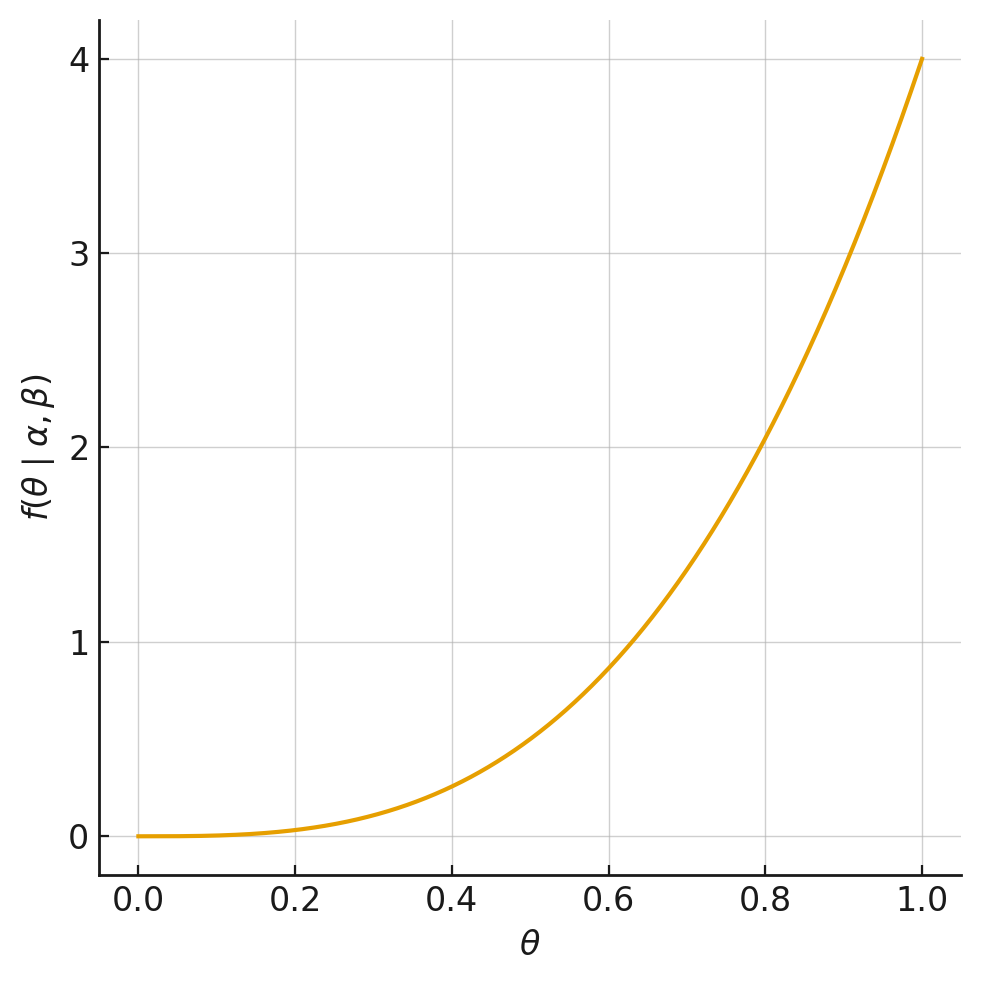
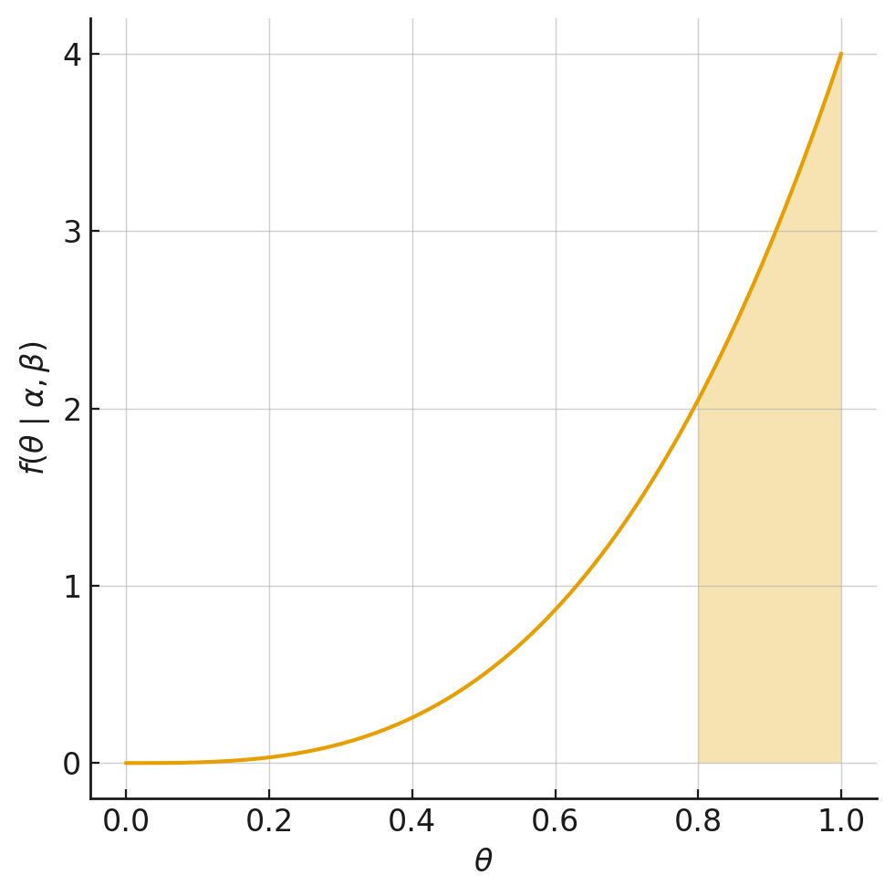

---
editor_options:
  markdown:
    wrap: 72
---

# Modelos Probabilísticos {#cap-probabilisticos data-en="Probabilistic Models"}

::: {.rmdnote}

**Para qué sirve esta unidad.** En marketing, resulta frecuente
enfrentar situaciones en las que la información disponible sobre el
comportamiento individual de los clientes es limitada o agregada:
¿cuánto tiempo permanecerá un suscriptor?, ¿cuántas veces visitará un
portal web?, ¿responderá o no a una campaña promocional? Los modelos
probabilísticos permiten abordar estas preguntas asumiendo que las
decisiones de los agentes provienen de un proceso estocástico, lo cual
posibilita describir, predecir y gestionar el comportamiento de los
clientes sin requerir grandes volúmenes de datos individuales.

**Habilidades previas requeridas.** Variable aleatoria y distribuciones
de probabilidad básicas (Bernoulli, Binomial, Poisson, Exponencial),
cálculo integral elemental, noción de función de verosimilitud y
estimación por máxima verosimilitud, conceptos de valor esperado y
varianza.

**Qué debería poder hacer el estudiante al terminar.**

-   Identificar cuándo un fenómeno de marketing corresponde a un
    problema de duración, conteo o elección binaria.
-   Formular la distribución individual y la distribución de
    heterogeneidad adecuadas para cada problema.
-   Derivar la distribución agregada mediante integración (mezcla).
-   Construir funciones de log-verosimilitud para estimar los parámetros
    de los modelos propuestos.
-   Calcular esperanzas condicionales (actualización bayesiana) para
    personalizar predicciones a nivel individual.
-   Incorporar heterogeneidad observable mediante regresiones sobre los
    parámetros del modelo.
-   Evaluar y comparar modelos mediante criterios de información (AIC,
    BIC) y log-verosimilitud.

**Conexión con ejercicios.** A lo largo del capítulo se intercalan
ejercicios guiados (E1--E7) que permiten verificar la comprensión de
cada concepto a medida que se avanza. Al final del capítulo se incluyen
problemas aplicados (P1--P9) con soluciones completas.

:::

::: {.rmdnote}

**Purpose of this unit.** In marketing, it is common to face situations
where the available information on individual customer behavior is
limited or aggregated: how long will a subscriber stay?, how many times
will they visit a web portal?, will they respond to a promotional
campaign? Probabilistic models address these questions by assuming that
agent decisions arise from a stochastic process, which makes it
possible to describe, predict, and manage customer behavior without
requiring large volumes of individual-level data.

**Required prior skills.** Random variables and basic probability
distributions (Bernoulli, Binomial, Poisson, Exponential), elementary
integral calculus, notion of the likelihood function and maximum
likelihood estimation, concepts of expected value and variance.

**What the student should be able to do upon completion.**

-   Identify when a marketing phenomenon corresponds to a duration,
    count, or binary choice problem.
-   Formulate the appropriate individual distribution and heterogeneity
    distribution for each problem.
-   Derive the aggregate distribution through integration (mixing).
-   Construct log-likelihood functions to estimate the parameters of the
    proposed models.
-   Compute conditional expectations (Bayesian updating) to personalize
    predictions at the individual level.
-   Incorporate observable heterogeneity through regressions on model
    parameters.
-   Evaluate and compare models using information criteria (AIC, BIC)
    and log-likelihood.

**Connection with exercises.** Throughout the chapter, guided exercises
(E1--E7) are interspersed to verify comprehension of each concept as
the material progresses. At the end of the chapter, applied problems
(P1--P9) with complete solutions are included.

:::

## Definiciones clave {#prob-definiciones data-en="Key Definitions"}

::: {.lang-es}

Antes de introducir la notación formal, conviene precisar los conceptos
centrales que se emplearán a lo largo de la unidad:

:::

::: {.lang-en}

Before introducing the formal notation, it is useful to clarify the key
concepts that will be used throughout this unit:

:::

::: {.rmdnote}

**Definiciones clave**

-   *Modelo probabilístico*: representación de un fenómeno en la que el
    comportamiento de los agentes se describe mediante distribuciones de
    probabilidad, en contraste con el enfoque estructural que supone
    maximización racional de utilidad.
-   *Comportamiento individual*: conducta observable de un agente
    (abandonar, comprar, responder), caracterizada por una distribución
    con parámetro latente $\theta$.
-   *Heterogeneidad no observable*: variación en los parámetros latentes
    entre individuos de la población, representada por una distribución
    de mezcla $g(\theta)$.
-   *Distribución agregada*: distribución resultante de integrar el
    comportamiento individual sobre la distribución de heterogeneidad;
    es la que se confronta con los datos observados.
-   *Función de supervivencia* $S(t)$: probabilidad de que un evento no
    haya ocurrido hasta el instante $t$.
-   *Tasa de riesgo* (*hazard rate*) $h(t)$: probabilidad instantánea
    de que el evento ocurra en $t$, condicionada a que no ha ocurrido
    hasta ese momento.
-   *Esperanza condicional*: valor esperado del parámetro latente de un
    individuo, actualizado a la luz de su comportamiento observado
    (actualización bayesiana).
-   *Customer Lifetime Value* (CLV): valor presente neto de los flujos
    futuros esperados de un cliente, considerando su probabilidad de
    permanencia [@fader2005rfm; @fader2010].

:::

::: {.rmdnote}

**Key definitions**

-   *Probabilistic model*: a representation of a phenomenon in which
    agent behavior is described by probability distributions, in
    contrast with the structural approach that assumes rational utility
    maximization.
-   *Individual behavior*: observable conduct of an agent (churning,
    purchasing, responding), characterized by a distribution with
    latent parameter $\theta$.
-   *Unobservable heterogeneity*: variation in the latent parameters
    across individuals in the population, represented by a mixture
    distribution $g(\theta)$.
-   *Aggregate distribution*: the distribution resulting from
    integrating individual behavior over the heterogeneity
    distribution; it is the one confronted with observed data.
-   *Survival function* $S(t)$: probability that an event has not
    occurred by time $t$.
-   *Hazard rate* $h(t)$: instantaneous probability that the event
    occurs at $t$, conditional on it not having occurred up to that
    point.
-   *Conditional expectation*: expected value of an individual's latent
    parameter, updated in light of their observed behavior (Bayesian
    updating).
-   *Customer Lifetime Value* (CLV): net present value of the expected
    future cash flows of a customer, considering their probability of
    retention [@fader2005rfm; @fader2010].

:::

## Enfoque y metodología {#prob-metodologia data-en="Approach and Methodology"}

::: {.lang-es}

En el contexto de marketing, interesa estudiar el comportamiento de las
personas para realizar acciones estratégicas. Es posible distinguir dos
enfoques según los supuestos sobre el comportamiento de los agentes:

-   *Enfoque estructural*: supone que los agentes se comportan de
    manera racional, tomando decisiones que maximizan su utilidad.
    Resulta apropiado cuando se dispone de grandes volúmenes de datos
    individuales.
-   *Modelos probabilísticos*: suponen que las decisiones de los agentes
    pueden describirse como realizaciones de procesos aleatorios.
    Resultan adecuados cuando la información disponible es reducida o
    agregada.

:::

::: {.lang-en}

In the marketing context, understanding consumer behavior is essential
for making strategic decisions. Two approaches can be distinguished
based on the assumptions about agent behavior:

-   *Structural approach*: assumes that agents behave rationally, making
    decisions that maximize their utility. It is appropriate when large
    volumes of individual-level data are available.
-   *Probabilistic models*: assume that agent decisions can be described
    as realizations of random processes. They are suitable when the
    available information is limited or aggregated.

:::

::: {.lang-es}

La metodología de modelamiento probabilístico [@schmittlein1987;
@fader2005] sigue una secuencia de siete pasos:

1.  Determinar el problema de decisión a estudiar y la información
    requerida.
2.  Identificar el comportamiento observable de interés a nivel
    individual.
3.  Seleccionar la distribución de probabilidad que caracterice el
    comportamiento individual. Los parámetros de esta distribución se
    interpretan como *características latentes* a nivel individual.
4.  Escoger la distribución que describa cómo las características
    latentes están distribuidas en la población (*distribución de
    mezcla* o *heterogénea*), típicamente denotada $g(\theta)$.
5.  Derivar la *distribución agregada* del comportamiento de interés:

:::

::: {.lang-en}

The probabilistic modeling methodology [@schmittlein1987; @fader2005]
follows a sequence of seven steps:

1.  Determine the decision problem to study and the required
    information.
2.  Identify the observable behavior of interest at the individual
    level.
3.  Select the probability distribution that characterizes individual
    behavior. The parameters of this distribution are interpreted as
    *latent characteristics* at the individual level.
4.  Choose the distribution that describes how the latent
    characteristics are distributed across the population (*mixture
    distribution* or *heterogeneity distribution*), typically denoted
    $g(\theta)$.
5.  Derive the *aggregate distribution* of the behavior of interest:

:::

\[f(x) = \int f(x \mid \theta)\, g(\theta)\, d\theta
\quad \text{(caso continuo)}
\tag{2.1}\]
\[p(x) = \sum_{i} f(x \mid \theta)\, \Pr(\theta = \theta_i)
\quad \text{(caso discreto)}
\tag{2.2}\]

::: {.lang-es}

6.  Estimar los parámetros del modelo mediante el ajuste de la
    distribución agregada a los datos observados (máxima
    verosimilitud).
7.  Usar los resultados para tomar decisiones sobre el problema de
    marketing en cuestión.

:::

::: {.lang-en}

6.  Estimate the model parameters by fitting the aggregate distribution
    to the observed data (maximum likelihood).
7.  Use the results to make decisions about the marketing problem at
    hand.

:::

::: {.rmdnote}

**Ejemplo 1 (Motivación).** Un cliente realizó 2 compras el año
pasado. ¿Esto implica que mantendrá ese patrón de consumo? ¿Existe
alguna posibilidad de que incremente o disminuya su nivel de compra?
¿Cuál es el proceso subyacente? Los modelos probabilísticos permiten
responder estas preguntas asumiendo que el número de compras proviene
de una distribución (por ejemplo, Poisson) cuyo parámetro varía entre
individuos.

:::

::: {.rmdnote}

**Example 1 (Motivation).** A customer made 2 purchases last year.
Does this imply that the same purchasing pattern will continue? Is
there any chance that the customer will increase or decrease the
purchase level? What is the underlying process? Probabilistic models
address these questions by assuming that the number of purchases comes
from a distribution (for example, Poisson) whose parameter varies
across individuals.

:::

::: {.lang-es}

El enfoque probabilístico permite abordar tres tipos fundamentales de
problemas en marketing:

-   *Duración*: ¿cuándo ocurre un evento? Situaciones ligadas a la
    permanencia de un cliente en una compañía, al tiempo de adopción de
    un producto innovador, entre otras.
-   *Conteo*: ¿cuántas veces ocurre un evento? Situaciones ligadas al
    número de visitas a un portal web, la cantidad de productos
    comprados, el número de exposiciones publicitarias.
-   *Elección binaria*: ¿ocurre o no el evento? Situaciones asociadas
    a la decisión de responder a una campaña publicitaria, de comprar o
    no un producto, de cambiar o no de proveedor.

Comportamientos más complejos pueden describirse mediante combinaciones
de estos modelos básicos.

:::

::: {.lang-en}

The probabilistic approach allows addressing three fundamental types of
problems in marketing:

-   *Duration*: when does an event occur? Situations related to customer
    retention in a company, time to adoption of an innovative product,
    among others.
-   *Count*: how many times does an event occur? Situations related to
    the number of visits to a web portal, the quantity of products
    purchased, the number of advertising exposures.
-   *Binary choice*: does the event occur or not? Situations associated
    with the decision to respond to an advertising campaign, to buy or
    not buy a product, to switch providers or not.

More complex behaviors can be described through combinations of these
basic models.

:::

## Modelos de duración {#prob-duracion data-en="Duration Models"}

::: {.lang-es}

En años recientes, las mejoras en las tecnologías de información han
generado como resultado un aumento en la disponibilidad de data acerca
de los individuos en determinadas situaciones de consumo. Esta tendencia
se relaciona íntimamente con el creciente deseo de los gerentes de
marketing respecto a utilizar esta data disponible para aprender de
manera exhaustiva sobre el comportamiento de los clientes. Muchos
analistas tratan de describir y predecir el comportamiento de los
consumidores usando variables observables, como lo son variables
transaccionales (monto gastado, tienda donde se adquirió un determinado
producto, fecha de la compra, etc.), como así también variables que
caracterizan a los individuos (edad, nivel socio-económico, estado
civil, etc.). A partir de esta información es posible aplicar modelos de
regresión lineal o árboles de decisión, con el objetivo de poder
proyectar comportamientos, o bien rebatir hipótesis que previamente se
tenían respecto a un escenario determinado.

En este capítulo, se considera un enfoque distinto al anterior, en el
cual las decisiones de los individuos se desprenden de un comportamiento
**aleatorio**, en que las decisiones no dependen únicamente de variables
descriptivas del modelo, sino que también provienen del resultado de un
proceso estocástico no observable que opera intrínsecamente en los
individuos. Es decir, la asunción que el comportamiento se desprende de
una distribución de probabilidades que puede variar dependiendo del
modelo a estimar y de la complejidad del mismo. Alternativamente, se
puede considerar el enfoque racionalista que contempla a los individios
que siempre actúan racionalmente, lo que, de acuerdo a la experiencia
empírica, no se cumple siempre.

**Ejemplo 1**: Supongamos que un cliente hizo 2 compras el año pasado de
nuestro producto. ¿Esto implica inmediatamente que el consumidor
mantendrá ese patrón y este año volverá a ese nivel de consumo? ¿O
existe alguna posibilidad de que el cliente incremente o disminuya su
consumo? ¿Cuál es el proceso que hay detrás?

En lo que sigue, se considera 3 tipos de modelos de duración a estimar:

1.  **Modelos de duración en tiempo discreto.**

2.  **Modelos de duración en tiempo continuo sin dependencia en la
    duración.**

3.  **Modelos de duración en tiempo continuo con dependencia en la
    duración.**

:::

::: {.lang-en}

In recent years, improvements in information technologies have led to
an increase in the availability of data about individuals in specific
consumption situations. This trend is closely related to marketing
managers' growing desire to use this available data to learn
exhaustively about customer behavior. Many analysts attempt to describe
and predict consumer behavior using observable variables, such as
transactional variables (amount spent, store where a given product was
acquired, purchase date, etc.), as well as variables that characterize
individuals (age, socioeconomic level, marital status, etc.). Based on
this information, linear regression models or decision trees can be
applied in order to project behaviors or challenge previously held
hypotheses about a given scenario.

In this chapter, a different approach is considered, one in which the
decisions of individuals arise from **random** behavior, where
decisions do not depend solely on descriptive variables of the model,
but also come from the result of an unobservable stochastic process
that operates intrinsically within individuals. That is, the assumption
is that behavior arises from a probability distribution that can vary
depending on the model to be estimated and its complexity.
Alternatively, one may consider the rationalist approach, which assumes
individuals always act rationally, something that, according to
empirical experience, does not always hold.

**Example 1**: Suppose that a customer made 2 purchases of our product
last year. Does this immediately imply that the consumer will maintain
that pattern and return to that same level of consumption this year? Or
is there some possibility that the customer increases or decreases
their consumption? What process lies behind this?

In what follows, 3 types of duration models are considered:

1.  **Discrete-time duration models.**

2.  **Continuous-time duration models without duration dependence.**

3.  **Continuous-time duration models with duration dependence.**

:::

### Modelos de duración en tiempo discreto {#prob-duracion-discreta data-en="Discrete-Time Duration Models"}

::: {.lang-es}

Como ejemplo, se tiene el siguiente escenario: a través de una propuesta
de valor atractiva, una empresa consigue un cliente. ¿Durante cuántos
periodos estará afiliado a la compañía?

Se considera que cada periodo se puede cuantificar en términos discretos
(días, semanas, meses, años). Algunos ejemplos a considerar:

-   Un usuario descarga una aplicación para su teléfono inteligente.
    ¿Por cuántos meses la utilizará?
-   Adquirimos un cliente en un banco. ¿Durante cuántos años permanecerá
    como cliente?
-   Un cliente se suscribe a un plan telefónico o de internet. ¿Por
    cuántos periodos se mantendrá suscrito?

:::

::: {.lang-en}

As an example, consider the following scenario: through an attractive
value proposition, a company acquires a customer. For how many periods
will the customer remain affiliated with the company?

Each period is considered to be quantifiable in discrete terms (days,
weeks, months, years). Some examples to consider:

-   A user downloads a smartphone application. For how many months will
    they use it?
-   A customer is acquired by a bank. For how many years will they
    remain a customer?
-   A customer subscribes to a phone or internet plan. For how many
    periods will the subscription last?

:::

#### Modelo Geométrico Desplazado {.unnumbered}

::: {.lang-es}

Como ejemplo, se asume que se tiene una cartera de clientes que van
abandonando la relación comercial para **nunca más retomarla** en
cualquier periodo definido. Al final de cada periodo, un cliente decide
de manera aleatoria si continúa afiliado. De acuerdo a un proceso de
Bernoulli, hay una probabilidad $\theta$ de cancelar la relación
comercial con la empresa y con el complemento $1-\theta$ decide su
permanencia.

Para cada individuo, se asume que la probabilidad con la que decide no
cambia en el tiempo. Como primer acercamiento, se asume que dicha
probabilidad es igual e idénticamente distribuida (iid). Sea T la
variable aleatoria relativa a la duración de la relación comercial entre
el cliente y la compañía, es decir la variable que describe el instante
en el cual esta relación se acaba. De acuerdo a la descripción anterior,
la variable aleatoria T sigue una distribución Geométrica Desplazada
(sG) con parámetro $\theta$, es decir, el comportamiento de los
individuos puede ser descrito formalmente de acuerdo a la siguiente
relación:

1.  Probabilidad de que un individuo cualquiera abandone la relación
    comercial exactamente en el periodo t:

:::

::: {.lang-en}

Consider a customer portfolio where customers leave the business
relationship *never to return* in any given period. At the end of each
period, a customer randomly decides whether to continue the
relationship. According to a Bernoulli process, there is a probability
$\theta$ of canceling the business relationship and, with probability
$1-\theta$, of staying.

For each individual, the churn probability is assumed to be constant
over time. As a first approximation, this probability is assumed to be
the same for all individuals (homogeneous case). Let $T$ be the random
variable describing the duration of the business relationship. Then $T$
follows a *Shifted Geometric* (sG) distribution with parameter
$\theta$:

1.  Probability that an individual leaves the business relationship
    exactly in period $t$:

:::

\[P(T=t \mid \theta) = \theta(1 - \theta)^{t-1}
\tag{2.3}\]

::: {.lang-es}

2.  Probabilidad de que un individuo cualquiera abandone la relación
    comercial en un periodo posterior al periodo t:

:::

::: {.lang-en}

2.  Probability that an individual leaves the business relationship in
    a period after period $t$:

:::

\[P(T > t \mid \theta) = (1 - \theta)^{t}
\tag{2.4}\]

::: {.lang-es}

No es muy difícil aplicar un modelamiento a partir de lo anterior para
intentar dilucidar de qué forma se debería comportar un determinado
grupo de individuos a partir de la data transaccional que se tiene.

:::

::: {.lang-en}

It is not too difficult to apply modeling based on the above in order
to clarify how a given group of individuals should behave based on the
transactional data available.

:::

::: {.rmdnote}

**Ejemplo 2 (Modelo Geométrico Desplazado).** Se considera una cohorte
inicial de 1.000 clientes (indexado por el año 0). Se asume que, año
a año, un determinado número de clientes se retira del negocio de
acuerdo a un proceso de Bernoulli con probabilidad $\theta$ de abandono.
La data histórica se presenta a continuación:

| Año | # de Clientes | % de Permanencia | % de Retención |
|:---:|:-------------:|:----------------:|:--------------:|
|  0  |     1.000     |      100%        |       --       |
|  1  |      631      |       63%        |      63%       |
|  2  |      468      |       47%        |      74%       |
|  3  |      382      |       38%        |      82%       |
|  4  |      326      |       33%        |      85%       |
|  5  |      289      |       29%        |      89%       |
|  6  |      262      |       26%        |      91%       |
|  7  |      241      |       24%        |      92%       |

El porcentaje de retención corresponde al porcentaje de clientes que se
mantuvo en la relación comercial respecto al período anterior.

:::

::: {.rmdnote}

**Example 2 (Shifted Geometric Model).** Consider an initial cohort of
1,000 customers (indexed at year 0). It is assumed that, year after
year, a certain number of customers leave the business according to a
Bernoulli process with churn probability $\theta$. The historical data
are presented below:

| Year | # Customers | % Remaining | % Retention |
|:----:|:-----------:|:-----------:|:-----------:|
|  0   |    1,000    |    100%     |     --      |
|  1   |     631     |     63%     |    63%      |
|  2   |     468     |     47%     |    74%      |
|  3   |     382     |     38%     |    82%      |
|  4   |     326     |     33%     |    85%      |
|  5   |     289     |     29%     |    89%      |
|  6   |     262     |     26%     |    91%      |
|  7   |     241     |     24%     |    92%      |

The retention percentage is the proportion of customers who remained in
the business relationship relative to the previous period.

:::

::: {.lang-es}

Sin embargo, aún no se desconoce el valor de $\theta$ (es un parámetro
poblacional). Dicho valor se estima mediante el método de máxima
verosimilitud, que busca encontrar el valor del parámetro óptimo de
acuerdo a los datos observados y asumiendo independencia entre las
muestras:

-   Densidad de probabilidades conjunta:

:::

::: {.lang-en}

The value of $\theta$ is still unknown (it is a population parameter).
This value is estimated through the maximum likelihood method, which
seeks to find the optimal parameter value according to the observed
data and assuming independence across samples:

-   Joint probability density:

:::

\[f(x_1,x_2,\ldots,x_n\mid\theta) = f(x_1\mid\theta) \cdot f(x_2\mid\theta) \cdot \ldots \cdot f(x_n\mid\theta)
\tag{2.4a}\]

::: {.lang-es}

-   Función de verosimilitud:

:::

::: {.lang-en}

-   Likelihood function:

:::

\[
\begin{aligned}
L(\theta)
&= \left\{\prod_{t=1}^{\tau} P(T=t \mid \theta)^{n_t}\right\}
P(T>\tau \mid \theta)^{n_\tau} \\
&= \left\{\prod_{t=1}^{\tau}
\big[\theta(1-\theta)^{t-1}\big]^{n_t}\right\}
\big[(1-\theta)^{\tau}\big]^{n_\tau}
\end{aligned}
\tag{2.5}
\]

::: {.lang-es}

Notar que $n_\tau$ es el número de clientes activos después del máximo
tiempo observable $\tau$, $n_t$ es el número de abandonos (si hay 369
abandonos, se multiplica 369 veces), y $x_i$ el año. A partir de esto y
de la data disponible, las contribuciones a la verosimilitud son las
siguientes (asumiendo como modelo de comportamiento la distribución
geométrica desplazada)

Table: (\#tab:prob-duracion-contribuciones) Contribuciones a la verosimilitud en el modelo geométrico desplazado.

| Año | \# de Clientes | \# de Abandonos | Pr |
|------------------|------------------|------------------|------------------|
| 0 | 1000 | \- | \- |
| 1 | 631 | 369 | $P(T=1\|\theta) = \theta^{369}$ |
| 2 | 468 | 163 | $P(T=2\|\theta) = ((1 - \theta)^{(2-1)} \cdot \theta)^{163}$ |
| 3 | 382 | 86 | $P(T=3\|\theta) = ((1 - \theta)^{(3-1)} \cdot \theta)^{86}$ |
| 4 | 326 | 56 | $P(T=4\|\theta) = ((1 - \theta)^{(4-1)} \cdot \theta)^{56}$ |
| 5 | 289 | 37 | $P(T=5\|\theta) = ((1 - \theta)^{(5-1)} \cdot \theta)^{37}$ |
| 6 | 262 | 27 | $P(T=6\|\theta) = ((1 - \theta)^{(6-1)} \cdot \theta)^{27}$ |
| 7 | 241 | 21 | $P(T=7\|\theta) = ((1 - \theta)^{(7-1)} \cdot \theta)^{21}$ |
| \>7 | \- | \- | $P(T>7\|\theta) = ((1-\theta)^7)^{241}$ |

Dado que maximizar un producto es complicado, se aplica logaritmo a lo
anterior, de modo de construir la función de log verosimilitud:

-   Función de log verosimilitud:

:::

::: {.lang-en}

Note that $n_\tau$ is the number of customers still active after the
maximum observable time $\tau$, $n_t$ is the number of churns (if there
are 369 churns, the term is multiplied 369 times), and $x_i$ denotes
the year. Based on this and the available data, the contributions to
the likelihood are the following (assuming the shifted geometric
distribution as the behavioral model):

Table: (\#tab:prob-duracion-contribuciones-en) Contributions to the likelihood in the shifted geometric model.

| Year | \# Customers | \# Churns | Pr |
|------------------|------------------|------------------|------------------|
| 0 | 1000 | \- | \- |
| 1 | 631 | 369 | $P(T=1\|\theta) = \theta^{369}$ |
| 2 | 468 | 163 | $P(T=2\|\theta) = ((1 - \theta)^{(2-1)} \cdot \theta)^{163}$ |
| 3 | 382 | 86 | $P(T=3\|\theta) = ((1 - \theta)^{(3-1)} \cdot \theta)^{86}$ |
| 4 | 326 | 56 | $P(T=4\|\theta) = ((1 - \theta)^{(4-1)} \cdot \theta)^{56}$ |
| 5 | 289 | 37 | $P(T=5\|\theta) = ((1 - \theta)^{(5-1)} \cdot \theta)^{37}$ |
| 6 | 262 | 27 | $P(T=6\|\theta) = ((1 - \theta)^{(6-1)} \cdot \theta)^{27}$ |
| 7 | 241 | 21 | $P(T=7\|\theta) = ((1 - \theta)^{(7-1)} \cdot \theta)^{21}$ |
| \>7 | \- | \- | $P(T>7\|\theta) = ((1-\theta)^7)^{241}$ |

Since maximizing a product is complicated, the logarithm is applied to
construct the log-likelihood function:

-   Log-likelihood function:

:::

\[
\begin{aligned}
\hat{\ell}(\theta)  &= \sum_{t=1}^{\tau} n_t \,\ln P(T=t \mid \theta)\;+\; n_{\tau}\,\ln P(T>\tau \mid \theta) \\
&= \sum_{t=1}^{\tau} n_t \big[\ln \theta + (t-1)\ln(1-\theta)\big]\;+\;n_{\tau}\,\tau\ln(1-\theta)
\end{aligned}
\tag{2.6}\]

::: {.lang-es}

Con lo anterior, es sencillo maximizar la función de log verosimilitud
para un $\theta$ desconocido utilizando un paquete estadístico como R,
con lo que se tiene:

:::

::: {.lang-en}

With the above, it is straightforward to maximize the log-likelihood
function for an unknown $\theta$ using a statistical package such as R,
obtaining:

:::

\[
\begin{aligned}
\hat{\theta} &= 0, 226027 \\
\hat{l} &= -1794,62
\end{aligned}
\tag{2.7}\]

::: {.lang-es}

El modelo presentado, si bien permite tomar medidas de gestión a partir
de un modelo sencillo, es poco realista, pues se asume que la población
posee igual probabilidad de abandono.

Una manera de incluir mayor complejidad al modelo y hacerlo más robusto,
se asume que la población no es homogénea, sino que existen segmentos de
individuos quienes al ser agrupados, presentan un comportamiento similar
(heterogéneo). La forma más sencilla de modelar esto es asumiendo que la
población presenta 2 patrones de comportamiento o 2 segmentos. Para un
segmento de individuos, la decisión de abandonar o permanecer se
identifica a partir de un parámetro $\theta_1$ (del mismo modo que en el
caso anterior) y, para el otro segmento, la decisión se determina a
partir de un parámetro $\theta_2$ distinto de $\theta_1$.

Formalmente, las relaciones que describen de mejor manera esto son las
siguientes:

:::

::: {.lang-en}

The model presented, while allowing management actions based on a
simple model, is unrealistic because it assumes the population has the
same churn probability.

One way to incorporate greater complexity and make the model more
robust is to assume that the population is not homogeneous, but rather
that there exist segments of individuals who, when grouped, exhibit
similar behavior (heterogeneous overall). The simplest way to model
this is to assume that the population displays 2 patterns of behavior
or 2 segments. For one segment of individuals, the decision to leave or
stay is identified through parameter $\theta_1$ (just as in the
previous case) and, for the other segment, the decision is determined
through a parameter $\theta_2$ different from $\theta_1$.

Formally, the relationships that best describe this are the following:

:::

\[
P(T=t|\theta_1, \theta_2, \pi)= \theta_1 (1-\theta_1)^{t-1} \pi + \theta_2(1-\theta_2)^{t-1}(1-\pi)
\tag{2.8}\]
\[
P(T>t|\theta_1, \theta_2, \pi)= (1-\theta_1)^{t} \pi + (1-\theta_2)^{t}(1-\pi)
\tag{2.9}\]

::: {.lang-es}

En el modelo anterior, $\pi$ representa el porcentaje de la población
que pertenece al segmento 1, de tal forma que su complemento $1-\pi$
representa el porcentaje de la población que pertenece al segmento 2.
Cabe mencionar que se puede expandir a más segmentos, siempre que
sepamos su proporción $\pi$.

:::

::: {.lang-en}

In the previous model, $\pi$ represents the percentage of the
population that belongs to segment 1, so that its complement $1-\pi$
represents the percentage of the population that belongs to segment 2.
It is worth noting that this can be extended to more segments, as long
as their proportion $\pi$ is known.

:::

::: {.rmdnote}

**Ejercicio guiado E1: Tasa de respuesta.**

Una compañía de venta de ropa por catálogo busca decidir a qué segmento
enviar los catálogos de la próxima colección. Para ello analiza la tasa
de respuesta de una muestra de clientes de cada segmento (el ratio
entre número de clientes que compra y número de catálogos enviados). Al
mirar el primer segmento observa que de los 18 clientes a quienes se
les envió el catálogo, ninguno compró y, por tanto, decide no enviar
catálogos a ningún cliente de ese segmento. Esta compañía:

(a) Muy probablemente esté subestimando la tasa de respuesta de ese
    segmento.
(b) Debiera redefinir los criterios de segmentación para hacer grupos
    más grandes y accionables.
(c) Ha definido una política que da cuenta de su aversión al riesgo.
(d) Debiera usar un modelo de duración en tiempo continuo con
    dependencia en la duración.
(e) Debiera incorporar variables explicativas en su modelo predictivo.

**Solución**

Respuesta correcta: **(a)**.

Con una muestra de solo 18 observaciones y cero respuestas, la
estimación empírica $\hat{p} = 0/18 = 0$ resulta poco confiable. La
probabilidad real de respuesta del segmento es muy probablemente mayor
que cero; la observación de ninguna compra en una muestra tan pequeña
no implica que la tasa de respuesta sea nula. Un enfoque bayesiano (por
ejemplo, con un prior $\text{Beta}(\alpha, \beta)$) produciría una
estimación positiva incluso con cero éxitos observados.

:::

::: {.rmdnote}

**Guided exercise E1: Response rate.**

A catalog clothing company wants to decide which segment to send next
season's catalogs to. To this end, it analyzes the response rate of a
sample of customers from each segment (the ratio between the number of
customers who purchase and the number of catalogs sent). Looking at the
first segment, the company observes that none of the 18 customers who
received the catalog made a purchase, and therefore decides not to send
catalogs to any customer in that segment. This company:

(a) Is very likely underestimating the response rate of that segment.
(b) Should redefine the segmentation criteria to create larger and more
    actionable groups.
(c) Has defined a policy that reflects its risk aversion.
(d) Should use a continuous-time duration model with duration
    dependence.
(e) Should incorporate explanatory variables in its predictive model.

**Solution**

Correct answer: **(a)**.

With a sample of only 18 observations and zero responses, the empirical
estimate $\hat{p} = 0/18 = 0$ is unreliable. The true response
probability of the segment is very likely greater than zero; observing
no purchases in such a small sample does not imply that the response
rate is zero. A Bayesian approach (for example, with a
$\text{Beta}(\alpha, \beta)$ prior) would yield a positive estimate
even with zero observed successes.

:::

#### Modelo Beta-Geométrico Desplazado {.unnumbered}

::: {.lang-es}

Los modelos anteriores funcionan bien cuando la población se comporta de
manera distinta entre clases latentes, y similar al interior de cada
clase latente. Sin embargo, puede ser mucho más realista e interesante
asumir que existe una heterogeneidad continua en la población, es decir,
que existe un número infinito de segmentos (o al menos tendiente a
infinito) de manera de capturar todas las preferencias individuales de
cada miembro de la población considerada.

Para estos propósitos, ya no asumiremos que la probabilidad de abandono
$\theta$ sigue una distribución discreta de Bernoulli (éxito-fracaso),
sino que asumiremos que el parámetro proviene de una distribución
continua $\text{Beta}$ de parámetros $\alpha$ y $\beta$.

Por tanto, es posible calcular las probabilidades antes presentadas en
forma análoga, aplicando el enfoque antes mencionado (probabilidades
totales):

1.  Probabilidad de que un individuo cualquiera abandone la relación
    comercial exactamente en el periodo t:

    $$P(T=t|\alpha,\beta) = \int_0^1 P(T=t|\theta)B(\theta|\alpha,\beta)d\theta$$

    Donde:

:::

::: {.lang-en}

The previous models work well when the population behaves differently
across latent classes, and similarly within each latent class. However,
it can be much more realistic and interesting to assume that there is
continuous heterogeneity in the population, that is, that there exists
an infinite number of segments (or at least tending to infinity) in
order to capture all individual preferences of each member of the
population considered.

For these purposes, we will no longer assume that the churn
probability $\theta$ follows a discrete Bernoulli distribution
(success-failure), but rather that the parameter comes from a
continuous $\text{Beta}$ distribution with parameters $\alpha$ and
$\beta$.

Therefore, it is possible to calculate the probabilities presented
earlier in an analogous way, applying the previously mentioned
approach (total probabilities):

1.  Probability that any individual leaves the business relationship
    exactly in period t:

    $$P(T=t|\alpha,\beta) = \int_0^1 P(T=t|\theta)B(\theta|\alpha,\beta)d\theta$$

    Where:

:::

\[
B(\theta|\alpha,\beta) = \frac{\theta^{\alpha-1}(1-\theta)^{\beta-1}}{B(\alpha,\beta)}
\qquad
B(\alpha,\beta) = \frac{\Gamma(\alpha)\Gamma(\beta)}{\Gamma(\alpha + \beta)}
\tag{2.10}\]

::: {.lang-es}

2.  Probabilidad de que un individuo cualquiera abandone la relación
    comercial en un periodo posterior al periodo t:

    $$P(T>t|\alpha,\beta) = \int_0^1 (T>t|\theta)B(\theta|\alpha,\beta)d\theta$$

    Al desarrollar la primera integral antes mencionada, y
    reconociendo las relaciones de la distribución *Beta*, se tiene
    que:

:::

::: {.lang-en}

2.  Probability that any individual leaves the business relationship in
    a period after period t:

    $$P(T>t|\alpha,\beta) = \int_0^1 (T>t|\theta)B(\theta|\alpha,\beta)d\theta$$

    Developing the first integral mentioned above, and recognizing the
    relationships of the *Beta* distribution, we obtain:

:::

\[
\begin{aligned} P(T = t \mid \alpha, \beta) &= \int_0^1 \left( \theta(1-\theta)^{t-1} \right) \left( \frac{\theta^{\alpha-1}(1-\theta)^{\beta-1}}{B(\alpha, \beta)} \right) d\theta \\ &= \frac{1}{B(\alpha, \beta)} \int_0^1 (\theta \cdot \theta^{\alpha-1}) \cdot ((1-\theta)^{t-1} \cdot (1-\theta)^{\beta-1}) d\theta \\ &= \frac{1}{B(\alpha, \beta)} \int_0^1 \theta^{\alpha} (1-\theta)^{t+\beta-2} d\theta \\ &= \frac{B(\alpha+1, t+\beta-1)}{B(\alpha, \beta)} \end{aligned}
\tag{2.11}\]

::: {.lang-es}

Notar que se usa indistintamente el $B(\alpha,\beta)$ para hacer alusión
tanto a la **función** como a la **distribución Beta**. Bajo ninguna
circunstancia dichos objetos son iguales.

El desarrollo de la segunda integral es:

:::

::: {.lang-en}

Note that $B(\alpha,\beta)$ is used interchangeably to refer both to
the **Beta function** and to the **Beta distribution**. Under no
circumstances are these objects equal.

The development of the second integral is:

:::

\[
\begin{aligned}
P(T > t \mid \alpha, \beta) &= \int_0^1 (1-\theta)^{t} \left( \frac{\theta^{\alpha-1}(1-\theta)^{\beta-1}}{B(\alpha, \beta)} \right) d\theta \\
&= \frac{1}{B(\alpha, \beta)} \int_0^1 \theta^{\alpha-1} \cdot ((1-\theta)^{t} \cdot (1-\theta)^{\beta-1}) d\theta \\
&= \frac{1}{B(\alpha, \beta)} \int_0^1 \theta^{\alpha-1} (1-\theta)^{t+\beta-1} d\theta \\
&= \frac{B(\alpha, t+\beta)}{B(\alpha, \beta)}
\end{aligned}
\tag{2.12}\]

::: {.rmdwarning}

**Notación importante.** Se utiliza $B(\alpha, \beta)$ indistintamente
para referirse tanto a la *función Beta* como a la *distribución Beta*.
Bajo ninguna circunstancia estos objetos son iguales: la función Beta
es una constante de normalización, mientras que la distribución Beta es
una función de densidad de probabilidad.

:::

::: {.rmdwarning}

**Important notation.** $B(\alpha, \beta)$ is used interchangeably to
refer to both the *Beta function* and the *Beta distribution*. Under no
circumstances are these objects the same: the Beta function is a
normalization constant, while the Beta distribution is a probability
density function.

:::

::: {.rmdnote}

**Ejemplo 3 (Recursividad en el modelo Beta-Geométrico).** Usando la
misma cohorte del Ejemplo 2, pero asumiendo heterogeneidad continua,
es posible identificar una recursividad en la fórmula de abandono:

*Caso base* ($t=1$):
\[P(T=1 \mid \alpha, \beta)
= \frac{B(\alpha+1, \beta)}{B(\alpha, \beta)}
= \frac{\alpha}{\alpha + \beta}\]
*Paso recursivo* ($t > 1$):
\[\frac{P(T=t \mid \alpha, \beta)}{P(T=t-1 \mid \alpha, \beta)}
= \frac{\beta + t - 2}{\alpha + \beta + t - 1}\]
Al estimar el modelo Beta-Geométrico Desplazado con los datos del
Ejemplo 2, se obtiene:
\[\hat{\alpha} = 0{,}7041 \qquad
\hat{\beta} = 1{,}1820 \qquad
\hat{\ell} = -1680{,}27
\tag{2.13}\]
La diferencia en log-verosimilitud respecto al modelo homogéneo
($\hat{\ell} = -1794{,}62$) es notable. Si bien esto sugiere una
mejora, la comparación rigurosa debe realizarse mediante criterios como
AIC o BIC, que penalizan por el número de parámetros.

:::

::: {.rmdnote}

**Example 3 (Recursion in the Beta-Geometric model).** Using the same
cohort from Example 2, but assuming continuous heterogeneity, a
recursion in the churn formula can be identified:

*Base case* ($t=1$):
\[P(T=1 \mid \alpha, \beta)
= \frac{B(\alpha+1, \beta)}{B(\alpha, \beta)}
= \frac{\alpha}{\alpha + \beta}\]
*Recursive step* ($t > 1$):
\[\frac{P(T=t \mid \alpha, \beta)}{P(T=t-1 \mid \alpha, \beta)}
= \frac{\beta + t - 2}{\alpha + \beta + t - 1}\]
Estimating the Shifted Beta-Geometric model with the data from
Example 2 yields:
\[\hat{\alpha} = 0.7041 \qquad
\hat{\beta} = 1.1820 \qquad
\hat{\ell} = -1680.27
\tag{2.13}\]
The difference in log-likelihood relative to the homogeneous model
($\hat{\ell} = -1794.62$) is notable. Although this suggests an
improvement, a rigorous comparison should be performed using criteria
such as AIC or BIC, which penalize for the number of parameters.

:::

### Modelos de duración en tiempo continuo sin dependencia en la duración {#prob-duracion-continua data-en="Continuous-Time Duration Models Without Duration Dependence"}

::: {.lang-es}

Para algunos modelos, medir el tiempo como si fueran períodos discretos
puede ser un buena aproximación de acuerdo a los objetivos del análisis
que se desea llevar a cabo.

En otros casos, puede ser en cambio más útil considerar el tiempo como
una variable continua, debido a que podría interesar medir la ocurrencia
de un suceso de manera más exacta. Algunos casos relativos a este
enfoque son:

-   Tiempos de respuesta a una campaña promocional de marketing directo.
-   Tiempo entre visitas a nuestro website.
-   Tiempos entre llamadas en un *call center*.
-   Tiempos de operación en la industria de servicios.

Al igual que en el caso de los modelos en tiempo discreto, lo que
interesa estudiar es poder implementar un modelo que tenga una forma
funcional flexible para ser trabajada y modificada fácilmente, que logre
ajustar a la data histórica que se tiene y proyectar el comportamiento
futuro de los clientes, es decir, que sea un buen modelo predictivo para
tomar acciones en función de aquello.

:::

::: {.lang-en}

For some models, measuring time as if it were discrete periods can be a
good approximation depending on the objectives of the analysis to be
carried out.

In other cases, however, it may be more useful to consider time as a
continuous variable, because it may be of interest to measure the
occurrence of an event more precisely. Some cases related to this
approach are:

-   Response times to a direct marketing promotional campaign.
-   Time between visits to our website.
-   Time between calls in a *call center*.
-   Operation times in the services industry.

As in the case of discrete-time models, the goal is to implement a
model with a flexible functional form that can be easily worked with
and modified, that manages to fit the historical data available and
project future customer behavior, that is, that it be a good
predictive model for taking actions based on it.

:::

#### Modelo Exponencial {.unnumbered}

::: {.lang-es}

Se puede medir el tiempo que pasa desde que se lanza un producto hasta
que el consumidor decide adquirirlo. Existen muchos factores externos
que determinan esta decisión: exposición a publicidad, número de visitas
a la tienda, llamadas recibidas por call center, entre otras. Nuevamente
se asume que el comportamiento es aleatorio, es decir, que los
consumidores deciden el momento en el cuál van a consumir a partir de
una distribución de probabilidades.

Esto puede verse con una distribución exponencial, con la variable
aleatoria $t$ definida como el tiempo en que un cliente va a consumir el
producto por primera vez. Se asume que esta variable está
exponencialmente distribuida con una tasa $\lambda$. De esta forma, se
tiene que el comportamiento de los consumidores puede verse como:

1.  Probabilidad de que ocurra en $t$ o antes:

:::

::: {.lang-en}

One can measure the time that passes from the launch of a product until
the consumer decides to acquire it. There are many external factors
that determine this decision: exposure to advertising, number of visits
to the store, calls received by the call center, among others. Again,
behavior is assumed to be random, that is, consumers decide the moment
at which they will consume based on a probability distribution.

This can be seen through an exponential distribution, with the random
variable $t$ defined as the time at which a customer will consume the
product for the first time. This variable is assumed to be
exponentially distributed with rate $\lambda$. In this way, consumer
behavior can be seen as:

1.  Probability that it occurs at or before $t$:

:::

\[P(T \leq t) = 1 - e^{-\lambda t}
\tag{2.14}\]
\[P(T > t) = e^{-\lambda t}
\tag{2.15}\]

::: {.lang-es}

2.  Probabilidad de que ocurra después de $t$:

:::

::: {.lang-en}

2.  Probability that it occurs after $t$:

:::

\[
L(\theta) = \prod_{i \in A} f(t_i | \theta) \prod_{i \notin A} (1 - P(T \leq t))
= \prod_{i \in A} (\theta e^{-\theta t_i}) \prod_{i \notin A} (e^{-\theta \tau_i})
\tag{2.16}\]

::: {.lang-es}

donde $f(t_i \mid \theta)$ es la función de densidad, es decir, la
derivada de la función de probabilidad acumulada $P(T \leq t)$. El
índice $i$ corresponde a cada cliente y $A$ es el conjunto de clientes
que adquiere un producto o servicio. El parámetro $\tau$, al igual que
en el modelo de duración discreta, corresponde al tiempo máximo
observado.

Ahora bien, esto inmediatamente deja en evidencia una limitante a este
modelo: para un $t$ muy grande, todos los consumidores van a tener un
caso de éxito (Recordar que $\text{lim } e^{-t} = 0$), lo cual no es una
situación del todo realista. Es necesario, en consecuencia, imponer que
existe una fracción de clientes dentro de la muestra considerada que
nunca probará el producto (caso de éxito) y, así, es posible solucionar
la limitante encontrada (2 clases latentes).

1.  Segmento que prueba: Tamaño $\pi$:

:::

::: {.lang-en}

Here, $f(t_i \mid \theta)$ is the density function, that is, the
derivative of the cumulative probability function $P(T \leq t)$. The
index $i$ corresponds to each customer and $A$ is the set of customers
who acquire a product or service. The parameter $\tau$, as in the
discrete duration model, corresponds to the maximum observed time.

Now, this immediately reveals a limitation of the model: for very large
$t$, all consumers will eventually experience the event (recall that
$\text{lim } e^{-t} = 0$), which is not entirely realistic. It is
therefore necessary to impose that there exists a fraction of customers
within the sample that will never try the product (success case), and
thus it is possible to solve the limitation found (2 latent classes).

1.  Segment that tries: Size $\pi$:

:::

\[
\begin{array}{c}
\lambda = \theta\\
\Rightarrow P(T \leq t) = 1 - e^{-\theta t}
\end{array}
\tag{2.17}\]

::: {.lang-es}

2.  Segmento que no prueba: Tamaño ($1-\pi$):

:::

::: {.lang-en}

2.  Segment that does not try: Size ($1-\pi$):

:::

\[
\begin{array}{c}
\lambda = 0\\
\Rightarrow P(T \leq t) = 0
\end{array}
\tag{2.17a}\]

::: {.lang-es}

Luego, la probabilidad total será:

:::

::: {.lang-en}

Then, total probability will be:

:::

\[
\begin{array}{c}
P(T \leq t) = P(T \leq t | \text{Prueba}) P(\text{Prueba}) + P(T \leq t | \text{No Prueba}) P(\text{No Prueba}) \\
= 1 - e^{-\theta t}\pi
\end{array}
\tag{2.17b}\]

::: {.rstudio-tip}

**Implementación práctica.** Aunque el modelo describe probabilidades
en tiempo continuo, los datos suelen presentarse en intervalos discretos.
La log-verosimilitud se construye calculando la probabilidad de que el
evento ocurra dentro de cada intervalo temporal:
$P(t_0 \leq T \leq t_1) = F(t_1) - F(t_0)$.

:::

::: {.rstudio-tip}

**Practical implementation.** Although the model describes probabilities
in continuous time, data are usually presented in discrete intervals.
The log-likelihood is constructed by computing the probability that the
event occurs within each time interval:
$P(t_0 \leq T \leq t_1) = F(t_1) - F(t_0)$.

:::

::: {.lang-es}

Es importante notar que si bien el modelo describe probabilidades en
tiempo continuo, la data aún se presenta y obtiene en tiempo discreto.
Incorporando esto, es posible construir la función de log verosimilitud
calculando las probabilidades de adopción del producto entre los límites
del intervalo temporal definido por el periodo de medición, es decir:

:::

::: {.lang-en}

It is important to note that although the model describes probabilities
in continuous time, the data are still presented and obtained in
discrete time. Incorporating this, it is possible to construct the
log-likelihood function by calculating the probabilities of product
adoption between the limits of the time interval defined by the
measurement period, that is:

:::

\[
P(t_0 \leq T \leq t_1) = F(t_1) - F(t_0)
\tag{2.18}\]

::: {.lang-es}

Cconsiderando n periodos discretos para el cálculo, la log-verosimilitud es:

:::

::: {.lang-en}

Considering n discrete periods for the calculation, the log-likelihood is:

:::

\[
LL(\pi,\theta|\text{data}) = N_1 ln[P(1\leq T \leq 2)] + ... + (N_{panel} - \sum_{i=1}^{n}N_i)ln[P(T>n)]
\tag{2.18a}\]

::: {.lang-es}

Adicionalmente, es de interés calcular los valores predichos por el
modelo, de modo de realizar predicciones futuras. $F(t)$ representa la
probabilidad que un cliente escogido aleatoriamente pruebe el producto
en $t$, tal que $t=0$ corresponde al instante de lanzamiento del
producto. La estimación del futuro se puede hacer a través de la
esperanza:

:::

::: {.lang-en}

Additionally, it is of interest to calculate the values predicted by
the model, so as to make future predictions. $F(t)$ represents the
probability that a randomly chosen customer tries the product at $t$,
such that $t=0$ corresponds to the moment the product is launched.
Future estimation can be done through the expectation:

:::

\[
\mathbb{E}[T(t)] = N_{\text{panel }} \cdot \hat{F}(t)
\tag{2.18b}\]

::: {.lang-es}

Antes de avanzar, es importante aclarar la distinción de un modelo *sin
dependencia en la duración*. Esto se puede explicar con la propiedad
fundamental de la distribución exponencial:

**Propiedad fundamental:** La distribución exponencial no tiene memoria,
es decir, poseer información de que un elemento ha sobrevivido un tiempo
’s’ hasta este momento no modifica la probabilidad de que sobreviva un
periodo $t$ más. Es decir la probabilidad de que ocurra un suceso no
depende del tiempo en que aún no ha ocurrido. Se puede demostrar
matemáticamente:

:::

::: {.lang-en}

Before moving on, it is important to clarify the distinction of a model
*without duration dependence*. This can be explained with the
fundamental property of the exponential distribution:

**Fundamental property:** The exponential distribution has no memory,
that is, having information that an element has survived for a time
’s’ up to this moment does not modify the probability that it survives
an additional period $t$. In other words, the probability that an event
occurs does not depend on the time during which it has not yet
occurred. This can be shown mathematically:

:::

\[
P(T > s + t|T>s) = \frac{P(T> s+t)}{P(T> s)} = \frac{1-P(T \leq s+t)}{1-P(T \leq s)}= \frac{e^{-\lambda(s+t)}}{e^{-\lambda s}} = e^{-\lambda t}
\tag{2.18c}\]
#### Modelo Gamma-Exponencial {.unnumbered}

::: {.lang-es}

Análogamente al caso de duración discreta, hay casos en que el
comportamiento de la población heterogéneo. Esto busca complejizar la
suposición que antes se hizo al considerar un grupo de clientes que
nunca consume. Por tanto, el modelo con heterogeneidad no observada
ahora considerará que la tasa de prueba $\lambda$ se distribuye *Gamma*
en la población:

:::

::: {.lang-en}

Analogously to the discrete-duration case, there are cases in which the
behavior of the population is heterogeneous. This seeks to make more
complex the assumption made before when considering a group of
customers who never consume. Therefore, the model with unobservable
heterogeneity will now consider that the trial rate $\lambda$ is
distributed *Gamma* in the population:

:::

\[g(\lambda) = \frac{\alpha^r \lambda^{r-1} e^{-\alpha \lambda}}
{\Gamma(r)}
\tag{2.19}\]

::: {.lang-es}

Donde $r$ es un parámetro de forma mide la morfología. Con $r=1$ se
reduce a una exponencial y, a medida que crece, su la forma se vuelve
más simétrica y similar a una normal. Por otro lado, $\alpha$ es un
parámetro de escala que estira la distribución a medida que crece, o la
comprime en la medida que decrece.

Al incorporar la heterogeneidad mencionada, la probabilidad que un
cliente adquiera un producto antes de un tiempo $t$ es la siguiente:

:::

::: {.lang-en}

Where $r$ is a shape parameter that measures morphology. With $r=1$ it
reduces to an exponential and, as it grows, its shape becomes more
symmetric and similar to a normal. On the other hand, $\alpha$ is a
scale parameter that stretches the distribution as it grows, or
compresses it as it decreases.

By incorporating the mentioned heterogeneity, the probability that a
customer acquires a product before time $t$ is the following:

:::

\[
\begin{aligned} P(T\leq t) &= \int_{0}^{\infty} P(T \leq t|\lambda) g(\lambda)d \lambda \\ &= \int_{0}^{\infty} (1 - e^{-\lambda t}) \left( \frac{\alpha^r}{\Gamma(r)} \lambda^{r-1} e^{-\alpha \lambda} \right) d\lambda \\ &= \int_{0}^{\infty} \frac{\alpha^r}{\Gamma(r)} \lambda^{r-1} e^{-\alpha \lambda} d\lambda - \int_{0}^{\infty} e^{-\lambda t} \frac{\alpha^r}{\Gamma(r)} \lambda^{r-1} e^{-\alpha \lambda} d\lambda \\ &= 1 - \frac{\alpha^r}{\Gamma(r)} \int_{0}^{\infty} \frac{\lambda^{r-1} e^{-\lambda(\alpha+t)} \Gamma(r) (\alpha + t)^r}{\Gamma(r) (\alpha + t)^r} d\lambda \\ &= 1 - \frac{\alpha^r}{\Gamma(r)} \frac{\Gamma(r)}{(\alpha+t)^r} \\ &= 1 - \left(\frac{\alpha}{\alpha + t}\right)^r \end{aligned}
\tag{2.20}\]

::: {.lang-es}

Donde en el cuarto paso se agregó un 1 en forma de
$\frac{\Gamma(r) (\alpha + t)^r}{\Gamma(r) (\alpha + t)^r}$ para obtener
una función de acumulación de dominio completo para la distribución
gamma (lo que al integrarlo da 1).

:::

::: {.lang-en}

Where in the fourth step a 1 was added in the form
$\frac{\Gamma(r) (\alpha + t)^r}{\Gamma(r) (\alpha + t)^r}$ in order
to obtain a full-domain cumulative function for the gamma distribution
(which, when integrated, gives 1).

:::

::: {.rmdnote}

**Ejercicio guiado E3: Distribución Gamma y heterogeneidad.**

¿Cuál de los siguientes factores motivan la utilización de una
distribución Gamma para modelar la heterogeneidad de las tasas de
adopción en un modelo de duración en tiempo continuo? (Es posible
elegir más de un factor.)

i.   Consistencia con el dominio de la probabilidad de abandono en cada
     período.
ii.  Para generar una fórmula recursiva de fácil implementación.
iii. Flexibilidad para acomodar distintas formas de la distribución.
iv.  Para generar una fórmula cerrada que pueda ser calculada de manera
     computacionalmente eficiente.

**Solución**

Respuestas correctas: **iii** y **iv**.

La distribución Gamma se emplea como distribución de mezcla
principalmente por dos razones: (iii) su flexibilidad para representar
distintas formas de distribución (sesgadas, simétricas) según los
valores de sus parámetros, y (iv) porque al combinarla con la
distribución exponencial produce una fórmula cerrada
($1 - (\alpha/(\alpha + t))^r$), lo que resulta computacionalmente
eficiente. La opción (i) no aplica porque la Gamma modela tasas
$\lambda \in (0, \infty)$, no probabilidades en $[0,1]$. La opción
(ii) describe una propiedad del modelo Beta-Geométrico, no del
Gamma-Exponencial.

:::

::: {.rmdnote}

**Guided exercise E3: Gamma distribution and heterogeneity.**

Which of the following factors motivate the use of a Gamma distribution
to model heterogeneity in adoption rates in a continuous-time duration
model? (More than one factor may apply.)

i.   Consistency with the domain of the per-period churn probability.
ii.  To generate a recursive formula that is easy to implement.
iii. Flexibility to accommodate different distributional shapes.
iv.  To produce a closed-form expression that can be computed
     efficiently.

**Solution**

Correct answers: **iii** and **iv**.

The Gamma distribution is used as a mixture distribution primarily for
two reasons: (iii) its flexibility to represent different distributional
shapes (skewed, symmetric) depending on the parameter values, and (iv)
because combining it with the exponential distribution produces a
closed-form expression ($1 - (\alpha/(\alpha + t))^r$), which is
computationally efficient. Option (i) does not apply because the Gamma
models rates $\lambda \in (0, \infty)$, not probabilities in $[0,1]$.
Option (ii) describes a property of the Beta-Geometric model, not the
Gamma-Exponential.

:::

### Modelos de duración en tiempo continuo con dependencia en la duración {#prob-duracion-hazard data-en="Continuous-Time Duration Models With Duration Dependence"}

::: {.lang-es}

Otra de las grandes limitantes del modelo *Exponencial* es que posee
pérdida de memoria. En algunas aplicacioens se requiere incorporar esta
distinción, es decir, la probabilidad de que un evento ocurra dado que
hasta este momento no ha ocurrido. Esto último se conoce como *tasa de
riesgo* o *hazard rate*:

:::

::: {.lang-en}

Another of the major limitations of the *Exponential* model is that it
has memory loss. In some applications it is necessary to incorporate
this distinction, that is, the probability that an event occurs given
that it has not occurred up to this moment. This is known as the
*hazard rate*:

:::

\[
h(t) = \frac{f(t)}{1 - F(t)}
\tag{2.21}\]

::: {.lang-es}

Donde

:::

::: {.lang-en}

Where

:::

\[
\begin{aligned}
f(t) &= \frac{d}{dt} F(t) \\
&= -c\lambda t^{c-1} e^{-\lambda t^c}
\end{aligned}
\tag{2.22}\]

::: {.rmdnote}

**Ejemplo 4 (Interpretación de tasas de riesgo).** Distintos fenómenos
exhiben patrones de riesgo cualitativamente diferentes:

-   *Respuesta a un correo electrónico*: tasa de riesgo decreciente.
    Si una persona no ha respondido, cada vez es menos probable que lo
    haga, pues los correos antiguos tienden a ser ignorados.
-   *Llegada de un autobús*: tasa de riesgo creciente. A medida que
    más tiempo pasa sin que llegue, la espera remanente debería ser
    menor.
-   *Divorcio*: tasa de riesgo con forma de campana. Es poco probable
    al inicio y al final del matrimonio, con mayor riesgo en los años
    intermedios.
-   *Falla de un disco duro*: tasa de riesgo en forma de bañera
    (alta al inicio, baja en la mitad de la vida útil, alta al final).

:::

::: {.rmdnote}

**Example 4 (Hazard rate interpretation).** Different phenomena exhibit
qualitatively different hazard patterns:

-   *Response to an email*: decreasing hazard rate. If a person has not
    responded, it becomes less likely that they will, since older emails
    tend to be ignored.
-   *Bus arrival*: increasing hazard rate. As more time passes without
    arrival, the remaining wait should be shorter.
-   *Divorce*: bell-shaped hazard rate. It is unlikely at the beginning
    and end of a marriage, with higher risk in the intermediate years.
-   *Hard drive failure*: bathtub-shaped hazard rate (high at the
    beginning, low in the middle of the useful life, high at the end).

:::

::: {.lang-es}

A partir de la tasa de riesgo, se puede definir unívocamente la
distribución de una variable aleatoria no negativa a través de la
siguiente integral:

:::

::: {.lang-en}

From the hazard rate, the distribution of a non-negative random
variable can be uniquely defined through the following integral:

:::

\[
F(t) = 1 - exp \left( -\int_{0}^{t} h(u)du \right)
\tag{2.22a}\]

::: {.lang-es}

Este concepto será útil para definir los modelos de duración en tiempo
continuo en que la duración sí es un factor relevante

:::

::: {.lang-en}

This concept will be useful for defining continuous-time duration models
in which duration is indeed a relevant factor.

:::

#### Modelo Weibull {.unnumbered}

::: {.lang-es}

A pesar de las generalizaciones de las funciones de tasas de riesgo para
generar modelos de tiempo de ocurrencia, el foco será puesto en la
distribución Weibull, debido a que es fácil de trabajar y entrega una
fórmula cerrada muy similar a la de la distribución exponencial. Se
tiene que, para la misma variable aleatoria $T$ que se definió en la
sección anterior, la probabilidad de ocurrencia de que un cliente pruebe
nuestro producto en un tiempo inferior a t será:

:::

::: {.lang-en}

Despite the generalizations of hazard-rate functions to generate models
of time to occurrence, the focus will be placed on the Weibull
distribution, because it is easy to work with and provides a closed
form very similar to that of the exponential distribution. For the same
random variable $T$ defined in the previous section, the probability of
occurrence that a customer tries our product in a time less than t is:

:::

\[
F(t) = P(T \leq t) = 1 - e^{-\lambda t ^c}
\tag{2.23}\]

::: {.lang-es}

Y la tasa de riesgo asociada a esta distribución:

:::

::: {.lang-en}

And the hazard rate associated with this distribution:

:::

\[
h(t) = c \lambda t ^{c-1}
\tag{2.24}\]

::: {.lang-es}

El primer parámetro $\lambda$ que compone la fórmula es un parámetro de
escala, mientras que el parámetro c es el parámetro de forma. Es
importante notar que para $c=1$, la distribución se convierte en la
distribución exponencial, por lo que se puede decir que la distribución
Weibull es una generalización de la exponencial. Notar que para $c=1$,
la tasa de riesgo es constante, lo que es consistente con la propiedad
de pérdida de memoria de la distribución exponencial.

:::

::: {.lang-en}

The first parameter $\lambda$ that makes up the formula is a scale
parameter, while parameter c is the shape parameter. It is important to
note that for $c=1$, the distribution becomes the exponential
distribution, so it can be said that the Weibull distribution is a
generalization of the exponential. Note that for $c=1$, the hazard
rate is constant, which is consistent with the memory-loss property of
the exponential distribution.

:::

\[
P(T > s + t|T>s) = \frac{P(T> s+t)}{P(T> s)} = \frac{1-P(T \leq s+t)}{1-P(T \leq s)}= \frac{e^{-\lambda(s+t)^c}}{e^{-\lambda s^c}}
\tag{2.25}\]

::: {.rmdnote}

**Ejercicio guiado E2: Distribución Weibull.**

En relación a la distribución Weibull:

a.  Es un caso particular de la Poisson.
b.  Es una generalización de la Poisson.
c.  Solo tiene un parámetro $c$.
d.  Es muy flexible y permite incluso generar distribuciones bimodales.
e.  Ninguna de las anteriores.

**Solución**

Respuesta correcta: **(e)** (Ninguna de las anteriores).

La distribución Weibull no guarda relación de caso particular ni de
generalización con la distribución de Poisson; son distribuciones de
naturaleza distinta (la Weibull modela tiempos, la Poisson modela
conteos). Posee dos parámetros ($\lambda$ y $c$), no uno solo. Si bien
es flexible, no genera distribuciones bimodales; la Weibull es una
generalización de la *exponencial*.

:::

::: {.rmdnote}

**Guided exercise E2: Weibull distribution.**

Regarding the Weibull distribution:

a.  It is a special case of the Poisson.
b.  It is a generalization of the Poisson.
c.  It has only one parameter $c$.
d.  It is very flexible and can even generate bimodal distributions.
e.  None of the above.

**Solution**

Correct answer: **(e)** (None of the above).

The Weibull distribution bears no special-case or generalization
relationship to the Poisson distribution; they are distributions of
different nature (the Weibull models times, the Poisson models counts).
It has two parameters ($\lambda$ and $c$), not just one. Although it is
flexible, it does not generate bimodal distributions; the Weibull is a
generalization of the *exponential*.

:::

#### Modelo Gamma-Weibull {.unnumbered}

::: {.lang-es}

Una de las propiedades interesantes de la distribución Weibull, es que
es sencillo introducir heterogeneidad sobre los parámetros y, de esa
forma, capturar los distintos posibles comportamientos de la población.

Al igual que en el modelo Gamma-Exponencial, asumiremos que el parámetro
de escala $\alpha$ está distribuido $\text{Gamma}(\alpha,r)$ en la
población. La probabilidad de ocurrencia del consumo de los clientes se
puede modelar a través de la

:::

::: {.lang-en}

One of the interesting properties of the Weibull distribution is that
it is easy to introduce heterogeneity over the parameters and, in this
way, capture the different possible behaviors of the population.

As in the Gamma-Exponential model, we will assume that the scale
parameter $\alpha$ is distributed $\text{Gamma}(\alpha,r)$ in the
population. The probability of occurrence of customer consumption can
be modeled through

:::

\[
\begin{aligned} P(T \leq t \mid \alpha,r, c) &= \int_{0}^{\infty} \frac{(1 - e^{-\lambda t^c}) \alpha^r \lambda^{r-1}e^{-\alpha \lambda}}{\Gamma(r)} d\lambda \\ &= \int_{0}^{\infty} \frac{\alpha^r \lambda^{r-1}e^{-\alpha \lambda}}{\Gamma(r)} d\lambda - \int_{0}^{\infty} \frac{e^{-\lambda t^c} \alpha^r \lambda^{r-1}e^{-\alpha \lambda}}{\Gamma(r)} d\lambda \\ &= 1 - \frac{\alpha^r}{\Gamma(r)} \int_{0}^{\infty} \lambda^{r-1}e^{-\lambda(\alpha + t^c)} d\lambda \\ &= 1 - \frac{\alpha^r}{\Gamma(r)} \frac{\Gamma(r)}{(\alpha + t^c)^r} \\ &= 1 - \left(\frac{\alpha}{\alpha + t^c}\right)^r \end{aligned}
\tag{2.26}\]

::: {.lang-es}

Para $c = 1$, se recupera el modelo Gamma-Exponencial.

:::

::: {.lang-en}

For $c = 1$, the Gamma-Exponential model is recovered.

:::

::: {.rmdnote}

**Ejercicio guiado E4: Modelos de duración.**

¿Cuáles de los siguientes modelos NO describen la duración de la
relación de los clientes con una firma?

a.  Beta-Geométrica Desplazada.
b.  Beta-Geométrica NBD.
c.  Gamma-Weibull.
d.  Binomial Negativa.
e.  Ninguna de las anteriores.

**Solución**

Respuesta correcta: **(d)**.

La distribución Binomial Negativa (NBD) es un modelo de *conteo*, no
de duración. Describe el número de veces que ocurre un evento (por
ejemplo, número de compras), no el tiempo hasta que ocurre. Los modelos
(a), (b) y (c) sí describen duraciones.

:::

::: {.rmdnote}

**Guided exercise E4: Duration models.**

Which of the following models do NOT describe the duration of the
customer relationship with a firm?

a.  Shifted Beta-Geometric.
b.  Beta-Geometric NBD.
c.  Gamma-Weibull.
d.  Negative Binomial.
e.  None of the above.

**Solution**

Correct answer: **(d)**.

The Negative Binomial Distribution (NBD) is a *count* model, not a
duration model. It describes the number of times an event occurs (for
example, number of purchases), not the time until an event occurs.
Models (a), (b), and (c) do describe durations.

:::

::: {.rmdnote}

**Ejercicio guiado E7: Tiempo discreto en modelos de duración.**

*"En la práctica, siempre es posible discretizar el tiempo y, por lo
tanto, no hay motivos para usar modelos de duración en tiempo
continuo."* Discuta la veracidad de esta afirmación.

**Solución**

La afirmación es **incorrecta** por al menos dos razones:

-   Para eventos con gran variabilidad en los tiempos de ocurrencia, un
    modelo de tiempo discreto podría requerir un número muy grande de
    períodos para describir apropiadamente el comportamiento, lo que
    resulta poco parsimonioso.
-   Si el comportamiento tiene *dependencia en la duración*, dichas
    dependencias se incorporan de manera natural en modelos de tiempo
    continuo mediante funciones de riesgo (*hazard*) dependientes del
    tiempo (por ejemplo, la distribución Weibull), lo cual puede ser
    más complejo de representar en tiempo discreto.

:::

::: {.rmdnote}

**Guided exercise E7: Discrete time in duration models.**

*"In practice, it is always possible to discretize time and, therefore,
there is no reason to use continuous-time duration models."* Discuss the
validity of this statement.

**Solution**

The statement is **incorrect** for at least two reasons:

-   For events with high variability in occurrence times, a discrete-time
    model could require a very large number of periods to adequately
    describe the behavior, which is not parsimonious.
-   If the behavior exhibits *duration dependence*, such dependencies
    are naturally incorporated in continuous-time models through
    time-dependent hazard functions (for example, the Weibull
    distribution), which can be more complex to represent in discrete
    time.

:::

## Modelos de conteo {#prob-conteo data-en="Count Models"}

::: {.lang-es}

Permiten modelar cuántas veces los consumidores incurrirán en un
comportamiento determinado en un período de tiempo (ejemplo: problema de
exposición publicitaria).

Algunas medidas de efectividad son:

-   **Alcance:** Proporción de la población expuesta al evento al menos
    una vez durante el período: $1 − P(X_t = 0)$.

-   **Frecuencia promedio:** número promedio de exposiciones en el
    período entre aquellos que han experimentado el evento (por ejemplo,
    ver la valla publicitaria). $$\frac{\mathbb{E}(X_t)}{1-P(X_t =0)}$$

-   **Puntos de rating brutos (GRPs):** número promedio de exposiciones
    por cada 100 personas.

$$100 \cdot \mathbb{E}(X_t)$$

El fenómeno que se quiere estudiar es el número de veces que cada
individuo ve la valla publicitaria. Para ello, se define el modelo
individual *Poisson*.

:::

::: {.lang-en}

They model how many times consumers incur in a given behavior over a
period of time (for example, the advertising exposure problem).

Some effectiveness measures are:

-   **Reach:** Proportion of the population exposed to the event at
    least once during the period: $1 - P(X_t = 0)$.

-   **Average frequency:** average number of exposures in the period
    among those who have experienced the event (for example, seeing the
    billboard). $$\frac{\mathbb{E}(X_t)}{1-P(X_t =0)}$$

-   **Gross rating points (GRPs):** average number of exposures per 100
    people.

$$100 \cdot \mathbb{E}(X_t)$$

The phenomenon of interest is the number of times each individual sees
the billboard. For this, the individual *Poisson* model is defined.

:::

#### Modelo Poisson {.unnumbered}

::: {.lang-es}

lo cual corresponde a la probabilidad de que el número de exposiciones
sea $m$ en un intervalo de largo $t$.

:::

::: {.lang-en}

which corresponds to the probability that the number of exposures is $m$
in an interval of length $t$.

:::

\[P(N_t = m \mid \lambda)
= \frac{(\lambda t)^m e^{-\lambda t}}{m!}
\tag{2.27}\]

::: {.lang-es}

Su verosimilitud corresponde a:

:::

::: {.lang-en}

Its likelihood is:

:::

\[L(\lambda) = \prod_m P(N_t = m \mid \lambda)^{n_m}
= \prod_m \left( \frac{(\lambda t)^m e^{-\lambda t}}{m!} \right)^{n_m}
\tag{2.27a}\]

::: {.lang-es}

Su log-verosimilitud es:

Computacionalmente, suele ser más conveniente trabajar con la
log-verosimilitud en vez de la verosimilitud. Esto porque la
multiplicación de probabilidades genera muy rápidamente valores que
computacionalmente son indistinguibles de cero. Recuérdese que el valor
de los valores óptimos son invariantes a transformaciones monótonas
como la del logaritmo.

:::

::: {.lang-en}

Its log-likelihood is:

Computationally, it is usually more convenient to work with the
log-likelihood instead of the likelihood. This is because multiplying
probabilities very quickly generates values that are computationally
indistinguishable from zero. Recall that the values of the optima are
invariant to monotone transformations such as the logarithm.

:::

\[LL(\lambda) = \sum_m n_m \ln\left(
\frac{(\lambda t)^m e^{-\lambda t}}{m!}\right)
\tag{2.28}\]

::: {.lang-es}

Donde $m$ corresponde al número de ocurrencias de un suceso (cuántas
personas han visto un determinado número de anuncios), $n_m$ es el
número de casos en donde hubieron $m$ ocurrencias de un suceso (cuántas
veces un usuario ha visto un anuncio) y no se utiliza cuando las
observaciones están desagregadas (datos en los cuales cada fila del
conjunto de datos corresponde a una observación única y específica).
Cuando el tiempo es unitario, el modelo se simplifica a $t = 1$.

Al igual que en los modelos anteriores, es posible incluir
heterogeneidad asumiendo que el parámetro $\lambda$ no es el mismo para
todos. Para el caso en donde existe una mezcla finita y hay dos
segmentos, las tasas de eventos de la población pueden ser $\lambda_1$ o
$\lambda_2$, con una probabilidad $\pi$ de pertenecer al primer
segmento. El modelo de probabilidad queda representado por:

:::

::: {.lang-en}

Here, $m$ denotes the number of occurrences of an event (how many people
have seen a given number of ads), $n_m$ is the number of cases in which
there were $m$ occurrences of an event (how many times a user has seen
an ad), and this notation is not used when the observations are
disaggregated (data in which each row corresponds to a unique and
specific observation). When time is unitary, the model simplifies to
$t = 1$.

As in the previous models, heterogeneity can be included by assuming
that parameter $\lambda$ is not the same for all individuals. In the
case of a finite mixture with two segments, population event rates may
be $\lambda_1$ or $\lambda_2$, with probability $\pi$ of belonging to
the first segment. The probability model is:

:::

\[P(N_t = m \mid \lambda_1, \lambda_2, \pi)
= \frac{(\lambda_1 t)^m e^{-\lambda_1 t}}{m!}\,\pi
+ \frac{(\lambda_2 t)^m e^{-\lambda_2 t}}{m!}\,(1-\pi)
\tag{2.29}\]

#### Modelo Gamma-Poisson (NBD) {.unnumbered}

::: {.lang-es}

Para los modelos de heterogeneidad continua, $\lambda$ distribuye de
acuerdo a una determinada distribución. Suponiendo que dicha
distribución es *Gamma*.

:::

::: {.lang-en}

For continuous-heterogeneity models, $\lambda$ follows a given
distribution. Suppose that this distribution is *Gamma*.

:::

\[
g(\lambda|\alpha, r) = \frac{\alpha^r \lambda^{r-1}e^{-\alpha \lambda}}{\Gamma(r)}
\tag{2.29a}\]

::: {.lang-es}

Usando el modelo individual en (2.27) y la distribución en (2.29a), se
puede estimar la probabilidad de un número de exposiciones, conocido
como modelo **Gamma Poisson (NBD):**

:::

::: {.lang-en}

Using the individual model in (2.27) and the distribution in (2.29a),
the probability of a number of exposures can be estimated. This is known
as the **Gamma Poisson (NBD)** model:

:::

\[
\begin{aligned}
P(N_t = m \mid r, \alpha) &= \int_{0}^{\infty} P(N_t = m|\lambda) g(\lambda)d\lambda \\
&= \int_{0}^{\infty} \frac{(\lambda t)^m e^{-\lambda t}}{m!} \cdot \frac{\alpha^r \lambda^{r-1}e^{-\alpha \lambda}}{\Gamma(r)}d\lambda \\
&= \frac{t^m \alpha^r}{m! \Gamma(r)} \int_{0}^{\infty} \lambda^m \lambda^{r-1} e^{-\lambda t} e^{-\alpha \lambda} d\lambda \\
&= \frac{t^m \alpha^r}{m! \Gamma(r)} \int_{0}^{\infty} \lambda^{(r+m)-1} e^{-\lambda(\alpha+t)} d\lambda \\
&= \frac{t^m \alpha^r}{m! \Gamma(r)} \cdot \frac{\Gamma(r+m)}{(\alpha+t)^{r+m}} \\
&= \frac{\alpha^r}{(\alpha+t)^r} \cdot \frac{t^m}{(\alpha+t)^m} \cdot \frac{\Gamma(r+m)}{\Gamma(r)m!} \\
&= \left( \frac{\alpha}{\alpha+t}\right)^r \left( \frac{t}{\alpha + t}\right)^m \frac{\Gamma(r+m)}{\Gamma(r)m!}
\end{aligned}
\tag{2.30}\]

::: {.rmdnote}

**Ejercicio guiado E5: Modelo NBD.**

Un modelo NBD describe la demanda de botellas de oporto en los últimos
6 meses. Si con este modelo se estima la demanda del próximo mes:

a.  Es necesario hacer un modelo de regresión que considere la dinámica
    del problema.
b.  El cálculo no se puede hacer directamente; sin embargo, es posible
    recalibrar el modelo considerando un horizonte de un mes.
c.  El histograma del número de botellas consumidas por cliente se
    moverá a la izquierda.
d.  La probabilidad de comprar $x$ botellas resulta ser simplemente
    $1/6$ veces las probabilidades calculadas para el primer semestre.
e.  Ninguna de las anteriores.

**Solución**

Respuesta correcta: **(c)**.

Al reducir el horizonte temporal de 6 meses a 1 mes, el parámetro $t$
en la fórmula NBD disminuye. Esto produce que la distribución se
desplace hacia la izquierda (menores conteos), ya que cada individuo
tiene menos tiempo para acumular compras. La relación entre
probabilidades no es simplemente lineal (opción d incorrecta), y el
modelo NBD permite directamente cambiar el horizonte temporal
(opción b incorrecta).

:::

::: {.rmdnote}

**Guided exercise E5: NBD model.**

An NBD model describes the demand for bottles of port wine over the
last 6 months. If this model is used to estimate next month's demand:

a.  A regression model that accounts for the dynamics of the problem is
    needed.
b.  The calculation cannot be done directly; however, it is possible to
    recalibrate the model considering a one-month horizon.
c.  The histogram of the number of bottles consumed per customer will
    shift to the left.
d.  The probability of buying $x$ bottles is simply $1/6$ times the
    probabilities calculated for the first semester.
e.  None of the above.

**Solution**

Correct answer: **(c)**.

By reducing the time horizon from 6 months to 1 month, the parameter
$t$ in the NBD formula decreases. This causes the distribution to
shift to the left (lower counts), since each individual has less time
to accumulate purchases. The relationship between probabilities is not
simply linear (option d is incorrect), and the NBD model directly
allows changing the time horizon (option b is incorrect).

:::

::: {.rmdnote}

**Ejercicio guiado E6: Modelos de conteo.**

Un analista propone el uso de modelos de conteo para describir la
intensidad de la participación de los usuarios de una red social. Los
parámetros han sido estimados usando datos de 4 días de actividad. El
modelo ajusta extremadamente bien. Sin embargo, al usar las
estimaciones para pronosticar la actividad del quinto día, el modelo no
ajusta bien. Se debiera concluir que:

a.  Se debe agregar la data para considerar la actividad agregada en
    todo el horizonte.
b.  Probablemente el comportamiento de los usuarios en el quinto día
    esté afectado por factores que no están presentes en los primeros
    cuatro días.
c.  Es necesario calcular esperanzas condicionales.
d.  Los supuestos de comportamiento son errados y se debe desechar el
    modelo.
e.  Todas las anteriores.

**Solución**

Respuesta correcta: **(b)**.

La explicación más plausible es que existan factores específicos del
quinto día (por ejemplo, un evento especial, un día de la semana
diferente, o un cambio estacional) que no están presentes en los datos
de entrenamiento. Esto no implica que el modelo deba desecharse, sino
que conviene investigar qué factores cambiaron. Las opciones (a), (c)
y (d) no abordan directamente el problema de predicción fuera de
muestra.

:::

::: {.rmdnote}

**Guided exercise E6: Count models.**

An analyst proposes the use of count models to describe the intensity
of user participation on a social network. The parameters have been
estimated using 4 days of activity data. The model fits extremely well.
However, when using the estimates to forecast the fifth day's activity,
the model does not fit well. One should conclude that:

a.  The data should be aggregated to consider the total activity over
    the entire horizon.
b.  The behavior of users on the fifth day is probably affected by
    factors not present in the first four days.
c.  Conditional expectations need to be calculated.
d.  The behavioral assumptions are wrong and the model should be
    discarded.
e.  All of the above.

**Solution**

Correct answer: **(b)**.

The most plausible explanation is that there are factors specific to the
fifth day (for example, a special event, a different day of the week,
or a seasonal change) that are not present in the training data. This
does not imply that the model should be discarded, but rather that
investigating what factors changed is warranted. Options (a), (c), and
(d) do not directly address the out-of-sample prediction problem.

:::

## Modelos de elección binaria {#prob-eleccion data-en="Binary Choice Models"}

::: {.lang-es}

Permiten modelar la probabilidad de que los individuos elijan un
determinado comportamiento, dado que tienen varias opciones para elegir.
Es aplicable en una situación de compras en un supermercado, exposición
a varios anuncios, las variadas formas de uso de un producto, etc.

:::

::: {.lang-en}

They model the probability that individuals choose a given behavior,
given that they have several options to choose from. This is applicable
to shopping situations in a supermarket, exposure to several ads, or the
different ways a product can be used, among others.

:::

#### Modelo Binomial {.unnumbered}

::: {.lang-es}

Consideremos como variable de interés la probabilidad de que un
individuo perteneciente a un segmento responda positivamente a una
campaña de marketing. En el enfoque tradicional, se realiza una
segmentación de clientes en grupos homogéneos, se envía mensajes a
muestras aleatorias de cada segmento y se implementa un campaña en
segmentos con tasa de respuesta (TR) sobre cierto corte, por ejemplo,
$TR > \frac{\text{Costo de envío}}{\text{Margen unitario}}$.

Sin embargo, es posible incorporar un enfoque de modelos probabilísticos
para abordar el problema. Si se considera la probabilidad de responder
de manera positiva que tiene un segmento $s$, en particular $p_s$, es
posible interpretar de manera sencilla la cantidad de respuestas
obtenidas. Recordando que la suma de experimentos de $\text{Bernoulli}$
corresponde a una variable aleatoria Binomial, es posible interpretar
$X_s$ como la cantidad de respuestas obtenidas de un total de $m_s$
enviadas. Luego:

:::

::: {.lang-en}

Consider as the variable of interest the probability that an individual
belonging to a segment responds positively to a marketing campaign. In
the traditional approach, customers are segmented into homogeneous
groups, messages are sent to random samples from each segment, and a
campaign is implemented in segments whose response rate (RR) is above a
threshold, for example,
$RR > \frac{\text{Sending Cost}}{\text{Unit Margin}}$.

However, it is possible to incorporate a probabilistic-model approach to
address the problem. If one considers the probability of responding
positively in segment $s$, namely $p_s$, then the number of responses
can be interpreted easily. Since the sum of $\text{Bernoulli}$
experiments is a Binomial random variable, $X_s$ can be interpreted as
the number of responses obtained out of a total of $m_s$ messages sent.
Then:

:::

\[P(X_s = x_s \mid m_s, p_s)
= \binom{m_s}{x_s} p_s^{x_s}(1 - p_s)^{m_s - x_s}
\tag{2.31}\]

::: {.lang-es}

donde $m_s$ es la población del segmento $s$ y $p_s$ es la probabilidad
de respuesta del segmento $s$.

Se tiene que la verosimilitud es expresada como:

:::

::: {.lang-en}

where $m_s$ is the population of segment $s$ and $p_s$ is the response
probability of segment $s$.

The likelihood can be written as:

:::

\[
\begin{aligned}
L(\theta) &= \prod_{s=1}^{S} P(X_s = x_s | m_s, \theta) \\
&= \prod_{s=1}^{S} \binom{m_s}{x_s} \theta^{x_s} (1-\theta)^{m_s - x_s}
\end{aligned}
\tag{2.31a}\]

::: {.lang-es}

Mientras que su log verosimilitud es:

:::

::: {.lang-en}

Whereas its log-likelihood is:

:::

\[
\begin{aligned}
LL(\theta) &= \sum_{s=1}^{S} \ln \left( P(X_s = x_s | m_s, \theta) \right) \\
&= \sum_{s=1}^{S} \ln \left( \binom{m_s}{x_s} \theta^{x_s} (1-\theta)^{m_s - x_s} \right) \\
&= \sum_{s=1}^{S} \left[ \ln\binom{m_s}{x_s} + \ln(\theta^{x_s}) + \ln((1-\theta)^{m_s - x_s}) \right] \\
&= \sum_{s=1}^{S} \left[ \ln\binom{m_s}{x_s} + x_s \ln(\theta) + (m_s - x_s) \ln(1-\theta) \right]
\end{aligned}
\tag{2.32}\]

::: {.lang-es}

Con respecto a la heterogeneidad, en el caso de una mezcla finita en
donde la probabilidad de éxito en cada uno de los intentos es distinta
de acuerdo a dos segmentos identificables, la probabilidad adopta el
valor de $\theta_1$ y $\theta_2$, donde $\pi$ corresponde a la
probabilidad de pertencer al primer segmento. El modelo de probabilidad
queda representado por:

:::

::: {.lang-en}

With respect to heterogeneity, in the case of a finite mixture where the
success probability in each attempt differs according to two
identifiable segments, the probability takes value $\theta_1$ or
$\theta_2$, where $\pi$ corresponds to the probability of belonging to
the first segment. The probability model is:

:::

\[
P(X_s = x_s \mid m_s, \theta_1, \theta_2, \pi) = \binom{m_s}{x_s}
\left[ \theta_1^{x_s}(1-\theta_1)^{m_s-x_s}\pi + \theta_2^{x_s}(1-\theta_2)^{m_s-x_s}(1-\pi) \right]
\tag{2.33}\]

#### Modelo Beta-Binomial {.unnumbered}

::: {.lang-es}

En el caso de mezcla infinita, la heterogeneidad no observable se extrae
aprovechando la distribución $B(\alpha,\beta)$:

:::

::: {.lang-en}

In the case of infinite mixture, unobservable heterogeneity is obtained
using the $B(\alpha,\beta)$ distribution:

:::

\[
\begin{aligned}
P(X_s = x_s \mid \alpha, \beta) &= \int_{0}^{1} P(X_s = x_s|m_s,\theta_s) g(\theta_s|\alpha,\beta)d\theta_s \\
&= \int_{0}^{1} \binom{m_s}{x_s} \theta_s^{x_s}(1-\theta_s)^{m_s-x_s} \frac{\theta_s^{\alpha-1}(1-\theta_s)^{\beta -1}}{B(\alpha,\beta)}d\theta_s \\
&= \frac{\binom{m_s}{x_s}}{B(\alpha,\beta)} \int_{0}^{1} \theta_s^{x_s+\alpha-1}(1-\theta_s)^{m_s-x_s+\beta-1} d\theta_s \\
&= \binom{m_s}{x_s} \frac{B(\alpha + x_s, \beta + m_s - x_s)}{B(\alpha,\beta)}
\end{aligned}
\tag{2.34}\]

## Heterogeneidad observable {#prob-het-observable data-en="Observable Heterogeneity"}

::: {.lang-es}

Se ha expuesto modelos que intentan explicar y predecir el tiempo en que
los individuos realizarán una determinada acción (e.g: proponer la
probabilidad de fuga de un cliente), considerando que el comportamiento
de los agentes se debe netamente a factores aleatorios.

En esta sección se incorporará heterogeneidad observable a un modelo de
duración en tiempo continuo sin dependencia en la duración. Entendemos
por heterogeneidad observable, aquellos factores observables (que están
en los datos) intrínsecos a los individuos que los hacen distintos,
tales como sexo, edad, nivel socioeconómico, género, entre otras.

:::

::: {.lang-en}

Up to this point, the models presented assume that agent behavior is
due exclusively to unobservable random factors. This section
incorporates *observable heterogeneity*, that is, factors present in the
data (gender, age, socioeconomic level, among others) that
differentiate individuals.

:::

### Modelos de duración en tiempo discreto con heterogeneidad observable {data-en="Discrete-Time Duration Models with Observable Heterogeneity"}

::: {.lang-es}

Sea $T_i$ la variable aleatoria que describe el instante en que el
individuo $i$ termina su relación comercial. Se modelará dicha variable
con una distribución Geométrica Desplazada de parámetro $\theta_i$, que
es la probabilidad de abandono para el individuo $i$.

\[
\mathbb{P}(T_i=t_i|\theta_i) = \theta_i(1-\theta_i)^{t_i-1}
\]

Dado que se cuenta con información a nivel individual, es posible
estimar un parámetro de abandono para cada persona.

Sea $\mathbf{x}_i$ el vector que contiene las variables explicativas del
individuo $i$. Se modela la probabilidad de abandono $\theta_i$
utilizando una transformación logística para asegurar que el resultado
se mantenga entre 0 y 1:

:::

::: {.lang-en}

Let $T_i$ be the random variable describing the time at which
individual $i$ ends the business relationship, modeled with a Shifted
Geometric distribution with parameter $\theta_i$. The churn probability
is modeled using a logistic transformation:

:::

\[\theta_i = \frac{\exp(\beta_0 + \boldsymbol{\beta}'\mathbf{x}_i)}
{1 + \exp(\beta_0 + \boldsymbol{\beta}'\mathbf{x}_i)}
= \frac{1}{1 + \exp(-(\beta_0 + \boldsymbol{\beta}'\mathbf{x}_i))}
\tag{2.35}\]

::: {.lang-es}

donde $\boldsymbol{\beta}$ corresponde al vector de coeficientes
asociados a las variables explicativas. La inclusión de esta función
permite capturar el efecto de las covariables sin restringir el signo de
los coeficientes.

En el caso donde la probabilidad de abandono depende de las
características de cada individuo (heterogeneidad observable), la
probabilidad de que el individuo $i$ abandone en el tiempo $t_i$ es:

:::

::: {.lang-en}

where $\boldsymbol{\beta}$ is the vector of coefficients associated with
the explanatory variables. Including this function allows capturing the
effect of the covariates without restricting the sign of the
coefficients.

When the churn probability depends on each individual's
characteristics (observable heterogeneity), the probability that
individual $i$ churns at time $t_i$ is:

:::

\[
\begin{aligned}
\mathbb{P}(T_i = t_i|\beta_0, \boldsymbol{\beta}) &= \theta_i (1 - \theta_i)^{t_i-1} \\
\text{donde } \theta_i &= \frac{1}{1 + \exp(-(\beta_0 + \boldsymbol{\beta}'\mathbf{x}_i))}
\end{aligned}
\]

::: {.lang-es}

Con lo cual, para un panel de $N$ individuos, donde algunos abandonan en
el período $t_i$ y otros permanecen activos (censurados a la derecha),
la log-verosimilitud del problema resulta:

:::

::: {.lang-en}

Thus, for a panel of $N$ individuals, where some churn in period $t_i$
and others remain active (right-censored), the log-likelihood of the
problem is:

:::

\[LL(\beta_0, \boldsymbol{\beta})
= \sum_{i \in \text{abandono}}
\big[\ln(\theta_i) + (t_i - 1)\ln(1 - \theta_i)\big]
+ \sum_{i \in \text{activos}} t_i\ln(1 - \theta_i)
\tag{2.36}\]

::: {.lang-es}

Para introducir heterogeneidad no observable en el modelo y así mezclar
ambos efectos, es análogo al desarrollo de la integral del Modelo
Beta-Geométrico desplazado. Se modelan los parámetros $\alpha_i$ y
$\beta_i$ de la distribución Beta de la siguiente forma para asegurar
que sean positivos:

:::

::: {.lang-en}

To introduce unobservable heterogeneity into the model and thus mix both
effects, the derivation is analogous to the integral in the Shifted
Beta-Geometric model. The parameters $\alpha_i$ and $\beta_i$ of the
Beta distribution are modeled as follows to ensure positivity:

:::

\[\alpha_i = \exp(\mathbf{a}'\mathbf{x}_i), \quad
\beta_i = \exp(\mathbf{b}'\mathbf{x}_i)
\tag{2.37}\]

::: {.lang-es}

La obtención de la expresión de probabilidad con heterogeneidad mixta es
análoga a la obtención de la probabilidad con heterogeneidad no
observable, salvo que la interpretación de los coeficientes $\alpha_i$ y
$\beta_i$ son distintas.

Finalmente, la función de log-verosimilitud para el modelo mixto
resulta, con $\theta_{params} = (a, b)$:

:::

::: {.lang-en}

The expression for the probability with mixed heterogeneity is obtained
analogously to the probability with unobservable heterogeneity, except
that the interpretation of coefficients $\alpha_i$ and $\beta_i$ is
different.

Finally, the log-likelihood function for the mixed model is, with
$\theta_{params} = (a, b)$:

:::

\[LL(\theta_{params})
= \sum_{i \in \text{abandono}}
\ln\!\left(\frac{B(\alpha_i + 1,\, t_i + \beta_i - 1)}
{B(\alpha_i, \beta_i)}\right)
+ \sum_{i \in \text{activos}}
\ln\!\left(\frac{B(\alpha_i,\, \beta_i + t_i)}
{B(\alpha_i, \beta_i)}\right)
\tag{2.38}\]

### Modelos de duración en tiempo continuo con heterogeneidad observable {data-en="Continuous-Time Duration Models with Observable Heterogeneity"}

::: {.lang-es}

Sea $T_i$ la variable aleatoria que describe el instante en que el
individuo $i$ realiza una determinada acción. Se modelará dicha variable
aleatoria con una distribución exponencial de parámetro $\lambda_i$:

\[
\mathbb{P}(T_i<t_i|\lambda_i) = 1-e^{-\lambda_it_i}
\]

Cabe destacar que, dada la naturaleza de los datos, el comportamiento
descrito se realizará de manera desagregada (dependencia de $i$ en el
parámetro), es decir, dado que existe información individual para cada
individuo, es posible estimar el parámetro de cada uno de éstos (no así
en los casos agregados vistos anteriormente).

Sea $\mathbf{x}_i$ el vector que contiene las variables explicativas
pertinentes del individuo $i$. Se modela la tasa de llegada de $i$ de la
siguiente manera:

:::

::: {.lang-en}

Let $T_i$ be modeled with an exponential distribution with parameter
$\lambda_i$. Observable heterogeneity is incorporated through:

:::

\[\lambda_i = \exp(\beta_0 + \boldsymbol{\beta}'\mathbf{x}_i)
= \lambda_0\exp(\boldsymbol{\beta}'\mathbf{x}_i)
\tag{2.39}\]

::: {.lang-es}

Donde $\boldsymbol{\beta}$ corresponde al vector de coeficientes
asociados a las variables explicativas en cuestión.

La inclusión de la exponencial se debe a que, por razones de
convergencia e interpretación, la tasa de respuesta individual debe ser
positiva. De esta forma, se puede capturar el efecto marginal de las
variables demográficas sin restricción de signos. Así, el modelo no
tendrá problemas si hay valores de $\beta$ negativos.

En el caso con tasa homogénea (la misma para toda la población), la
probabilidad que un individuo $i$ realice un evento determinado antes
del tiempo $t_i$, incluyendo su información observable, es:

:::

::: {.lang-en}

where $\boldsymbol{\beta}$ is the vector of coefficients associated with
the explanatory variables in question.

The inclusion of the exponential form is due to the fact that, for
convergence and interpretive reasons, the individual response rate must
be positive. In this way, the marginal effect of demographic variables
can be captured without sign restrictions. Thus, the model will not
have problems if some values of $\beta$ are negative.

In the case of a homogeneous rate (the same for the whole population),
the probability that individual $i$ performs a given event before time
$t_i$, including observable information, is:

:::

\[
\begin{aligned}
\mathbb{P}(T_i < t_i|\boldsymbol{\beta},\lambda_0) &= 1 - e^{-\lambda_it_i}\\
&= 1 - e^{-\lambda_0 \exp(\boldsymbol{\beta}'\mathbf{x}_i)t_i}
\end{aligned}
\]

::: {.lang-es}

Con lo cual (considerando instantes de tiempo $t_i^-$ y $t_i^+$ para
discretizar el tiempo, un panel de $N$ individuos y un vector de
parámetros $\theta = (\beta,\lambda_0)$), la log verosimilitud del
problema resulta:

:::

::: {.lang-en}

Thus (considering times $t_i^-$ and $t_i^+$ to discretize time, a panel
of $N$ individuals, and a vector of parameters
$\theta = (\beta,\lambda_0)$), the log-likelihood of the problem is:

:::

\[LL(\boldsymbol{\theta})
= \sum_{i=1}^{N} \ln\!\left(
e^{-\lambda_0\exp(\boldsymbol{\beta}'\mathbf{x}_i)t_i^-}
- e^{-\lambda_0\exp(\boldsymbol{\beta}'\mathbf{x}_i)t_i^+}
\right)
\tag{2.40}\]

::: {.lang-es}

Para incorporar adicionalmente heterogeneidad no observable, se asume
que $\lambda_0$ se dejará distribuyendo de manera continua en la
población según una ley $\Gamma(\alpha,r)$ pues, de esta forma, es
posible mezclar tanto la heterogeneidad no observable, como la
observable. El desarrollo de la integral es análogo al caso con
heterogeneidad no observable, con la diferencia de que se multiplica la
constante $\exp(\beta' \mathbf{x}_i)$ a la variable del tiempo $t$ .

Finalmente, la función de log verosimilitud resulta, con
$\theta = (\beta,\alpha,r)$:

:::

::: {.lang-en}

To additionally incorporate unobservable heterogeneity, parameter
$\lambda_0$ is allowed to vary continuously in the population according
to a $\Gamma(\alpha,r)$ law, since in this way both unobservable and
observable heterogeneity can be mixed. The derivation of the integral is
analogous to the case with unobservable heterogeneity, with the
difference that constant $\exp(\beta' \mathbf{x}_i)$ multiplies the time
variable $t$.

Finally, the log-likelihood function is, with
$\theta = (\beta,\alpha,r)$:

:::

\[LL(\boldsymbol{\theta})
= \sum_{i=1}^{N} \ln\!\left(
\left(\frac{\alpha}
{\alpha + \exp(\boldsymbol{\beta}'\mathbf{x}_i)t_i^-}\right)^r
- \left(\frac{\alpha}
{\alpha + \exp(\boldsymbol{\beta}'\mathbf{x}_i)t_i^+}\right)^r
\right)
\tag{2.41}\]

### Modelos de duración en tiempo continuo con dependencia de la duración y heterogeneidad observable {data-en="Continuous-Time Duration Models with Duration Dependence and Observable Heterogeneity"}

::: {.lang-es}

Cuando el tiempo en que ocurre un determinado suceso posee dependencia
en la duración, el procedimiento es análogo que en el caso sin dicha
dependencia, pero considerando que $T_i$ distribuye según una ley
Weibull.

:::

::: {.lang-en}

When the time at which a given event occurs has duration dependence, the
procedure is analogous to the case without such dependence, but
considering that $T_i$ follows a Weibull law.

:::

\[P(T_i < t_i \mid \lambda_i, c)
= 1 - e^{-\lambda_i(t_i)^c}
\tag{2.42}\]

::: {.lang-es}

En el caso con tasa homogénea (la misma para toda la población), la
probabilidad que un individuo $i$ realice un evento determinado antes
del tiempo $t_i$, incluyendo su información observable, es:

:::

::: {.lang-en}

In the case of a homogeneous rate (the same for the whole population),
the probability that individual $i$ performs a given event before time
$t_i$, including observable information, is:

:::

\[
\begin{aligned}
\mathbb{P}(T_i < t_i|\boldsymbol{\beta},\lambda_0,c) &= 1 - e^{-\lambda_i t_i}\\
&= 1 - e^{-\lambda_0 \exp(\boldsymbol{\beta}'\mathbf{x}_i) (t_i)^c}
\end{aligned}
\]

::: {.lang-es}

Por lo que, la función de log verosimilitud toma la siguiente forma:

:::

::: {.lang-en}

Therefore, the log-likelihood function takes the following form:

:::

\[
\begin{aligned}
LL(\theta) &= \sum_{i=1}^{N} \ln(\mathbb{P}(t_i^- < T_i < t_i^+|\boldsymbol{\beta},\lambda_0,c)) \\
&= \sum_{i=1}^{N} \ln((\mathbb{P}(T_i < t_i^+|\boldsymbol{\beta},\lambda_0,c)) - \mathbb{P}(T_i < t_i^-|\boldsymbol{\beta},\lambda_0,c)) \\
&=  \sum_{i=1}^{N} \ln \left((1 - e^{-\lambda_0 \exp(\boldsymbol{\beta}'\mathbf{x}_i)(t_i^+)^c}) - (1 - e^{-\lambda_0 \exp(\boldsymbol{\beta}'\mathbf{x}_i)(t_i^-)^c}) \right)\\
&= \sum_{i=1}^{N} \ln (e^{-\lambda_0 \exp(\boldsymbol{\beta}'\mathbf{x}_i)(t_i^-)^c} - e^{-\lambda_0 \exp(\boldsymbol{\beta}'\mathbf{x}_i)(t_i^+)^c})
\end{aligned}
\]

::: {.lang-es}

De manera análoga al caso anterior, se puede introducir adicionalmente
heterogeneidad no observable mediante el parámetro $\lambda_0$ según una
distribución $\Gamma(\alpha,r)$. Dando como conocido este resultado, la
log-verosimilitud queda descrita como:

:::

::: {.lang-en}

Analogously to the previous case, additional unobservable heterogeneity
can be introduced through parameter $\lambda_0$ according to a
$\Gamma(\alpha,r)$ distribution. Taking this result as given, the
log-likelihood is described as:

:::

\[
\begin{aligned}
LL(\theta) &= \sum_{i=1}^{N} \ln(\mathbb{P}(t_i^- < T_i < t_i^+|\boldsymbol{\beta},\lambda_0,r,c)) \\
&= \sum_{i=1}^{N} \ln \left( \left(\frac{\alpha}{\alpha + \exp(\boldsymbol{\beta}'\mathbf{x}_i)(t_i^-)^c}\right)^r - \left(\frac{\alpha}{\alpha + \exp(\boldsymbol{\beta}'\mathbf{x}_i)(t_i^+)^c}\right)^r \right)
\end{aligned}
\]

### Modelos de conteo con heterogeneidad observable {data-en="Count Models with Observable Heterogeneity"}

::: {.lang-es}

Sea $Y_i$ el número de veces que el individuo $i$ incurre en un
comportamiento durante un período, modelada con distribución Poisson de
parámetro $\lambda_i = \exp(\beta_0 + \boldsymbol{\beta}'\mathbf{x}_i)$.
La log-verosimilitud es:

:::

::: {.lang-en}

Let $Y_i$ be the number of times individual $i$ engages in a behavior
during a period, modeled with a Poisson distribution with parameter
$\lambda_i = \exp(\beta_0 + \boldsymbol{\beta}'\mathbf{x}_i)$. The
log-likelihood is:

:::

\[LL(\beta_0, \boldsymbol{\beta})
= \sum_{i=1}^{N}
\big[y_i(\beta_0 + \boldsymbol{\beta}'\mathbf{x}_i)
- \exp(\beta_0 + \boldsymbol{\beta}'\mathbf{x}_i)
- \ln(y_i!)\big]
\tag{2.43}\]

::: {.lang-es}

Para incorporar heterogeneidad no observable (modelo de *Regresión
Binomial Negativa*), se asume $\lambda_0 \sim \text{Gamma}(r, \alpha)$:

:::

::: {.lang-en}

To incorporate unobservable heterogeneity (*Negative Binomial
Regression* model), $\lambda_0 \sim \text{Gamma}(r, \alpha)$ is
assumed:

:::

\[P(Y_i = y_i \mid r, \alpha, \boldsymbol{\beta})
= \frac{\Gamma(r + y_i)}{\Gamma(r)\,y_i!}
\left(\frac{\alpha}
{\alpha + \exp(\boldsymbol{\beta}'\mathbf{x}_i)}\right)^r
\left(\frac{\exp(\boldsymbol{\beta}'\mathbf{x}_i)}
{\alpha + \exp(\boldsymbol{\beta}'\mathbf{x}_i)}\right)^{y_i}
\tag{2.44}\]

### Modelos de elección binaria con heterogeneidad observable {data-en="Binary Choice Models with Observable Heterogeneity"}

::: {.lang-es}

Sea $X_i$ el número de éxitos en $m_i$ intentos, con probabilidad
$\theta_i$ modelada mediante transformación logística. La
log-verosimilitud con heterogeneidad observable es:

:::

::: {.lang-en}

Let $X_i$ be the number of successes in $m_i$ trials, with probability
$\theta_i$ modeled via logistic transformation. The log-likelihood with
observable heterogeneity is:

:::

\[LL(\beta_0, \boldsymbol{\beta})
= \sum_{i=1}^{N}
\left[\ln\binom{m_i}{x_i}
+ x_i\ln(\theta_i) + (m_i - x_i)\ln(1 - \theta_i)\right]
\tag{2.45}\]

::: {.lang-es}

Para el modelo mixto (*Regresión Beta-Binomial*), con
$\alpha_i = \exp(\mathbf{a}'\mathbf{x}_i)$ y
$\beta_i = \exp(\mathbf{b}'\mathbf{x}_i)$:

:::

::: {.lang-en}

For the mixed model (*Beta-Binomial Regression*), with
$\alpha_i = \exp(\mathbf{a}'\mathbf{x}_i)$ and
$\beta_i = \exp(\mathbf{b}'\mathbf{x}_i)$:

:::

\[P(X_i = x_i \mid \mathbf{a}, \mathbf{b})
= \binom{m_i}{x_i}
\frac{B(\alpha_i + x_i,\, \beta_i + m_i - x_i)}
{B(\alpha_i, \beta_i)}
\tag{2.46}\]

## Esperanzas condicionales {#prob-esperanzas data-en="Conditional Expectations"}

::: {.lang-es}

Primero, es fundamental establecer el valor esperado de las
distribuciones que se usaron para modelar la heterogeneidad no
observable. A continuación, se muestra el desarrollo para obtener la
esperanza de las distribuciones Gamma y Beta.

:::

::: {.lang-en}

First, it is essential to establish the expected value of the
distributions used to model unobservable heterogeneity. The derivation
of the expectations of the Gamma and Beta distributions is shown below.

:::

### Esperanzas de las distribuciones de mezcla {data-en="Expectations of Mixture Distributions"}

::: {.lang-es}

-   **Esperanza de la distribución Gamma**

    Para la distribución Gamma, con parámetro de forma $r$ y de tasa
    $\alpha$, que se utiliza para modelar tasas de ocurrencia (ej.
    $\lambda$), su función de densidad de probabilidad es:
    $$g(\lambda|r,\alpha) = \frac{\alpha^r}{\Gamma(r)} \lambda^{r-1} e^{-\alpha\lambda}$$
    La esperanza de una variable aleatoria $\lambda$ que sigue esta
    distribución es: $$
    \mathbb{E}[\lambda] = \frac{r}{\alpha}
    $$Este resultado se obtiene a partir de la definición de valor
    esperado para una variable continua: $$
    \begin{aligned}
    \mathbb{E}[\lambda] &= \int_{0}^{\infty} \lambda \cdot g(\lambda|r,\alpha) d\lambda \\
    &= \int_{0}^{\infty} \lambda \cdot \frac{\alpha^r}{\Gamma(r)} \lambda^{r-1} e^{-\alpha\lambda} d\lambda \\
    &= \frac{\alpha^r}{\Gamma(r)} \int_{0}^{\infty} \lambda^{r} e^{-\alpha\lambda} d\lambda \\
    &= \frac{\alpha^r}{\Gamma(r)} \int_{0}^{\infty} \lambda^{(r+1)-1} e^{-\alpha\lambda} d\lambda \\
    \end{aligned}
    $$ Reconociendo que la integral
    $\int_{0}^{\infty} x^{k-1}e^{-\theta x}dx = \frac{\Gamma(k)}{\theta^k}$,
    con $k=r+1$ y $\theta=\alpha$: $$
    \begin{aligned}
    \mathbb{E}[\lambda] &= \frac{\alpha^r}{\Gamma(r)} \left[ \frac{\Gamma(r+1)}{\alpha^{r+1}} \right] \\
    &= \frac{\alpha^r}{\Gamma(r)} \cdot \frac{r\Gamma(r)}{\alpha^r \cdot \alpha} \\
    &= \frac{r}{\alpha}
    \end{aligned}
    $$

-   **Esperanza de la distribución Beta**

    Para la distribución Beta con parámetros $\alpha$ y $\beta$ que se
    utilizan para modelar probabilidades (ej. $\theta$), su función de
    densidad de probabilidad es:
    $$g(\theta|\alpha,\beta) = \frac{\theta^{\alpha-1}(1-\theta)^{\beta-1}}{B(\alpha,\beta)}$$
    El desarrollo para obtener esta esperanza es el siguiente: $$
    \begin{aligned}
    \mathbb{E}[\theta] &= \int_{0}^{1} \theta \cdot g(\theta|\alpha,\beta) d\theta \\
    &= \int_{0}^{1} \theta \cdot \frac{\theta^{\alpha-1}(1-\theta)^{\beta-1}}{B(\alpha,\beta)} d\theta \\
    &= \frac{1}{B(\alpha,\beta)} \int_{0}^{1} \theta^{\alpha}(1-\theta)^{\beta-1} d\theta \\
    &= \frac{1}{B(\alpha,\beta)} \int_{0}^{1} \theta^{(\alpha+1)-1}(1-\theta)^{\beta-1} d\theta \\
    \end{aligned}
    $$ Reconociendo que la integral
    $\int_{0}^{1} x^{a-1}(1-x)^{b-1}dx = B(a,b)$, con $a=\alpha+1$ y
    $b=\beta$: $$
    \begin{aligned}
    \mathbb{E}[\theta] &= \frac{1}{B(\alpha,\beta)} \left[ B(\alpha+1, \beta) \right] \\
    &= \frac{\Gamma(\alpha+\beta)}{\Gamma(\alpha)\Gamma(\beta)} \cdot \frac{\Gamma(\alpha+1)\Gamma(\beta)}{\Gamma(\alpha+1+\beta)} \\
    &= \frac{\Gamma(\alpha+\beta)}{\Gamma(\alpha)} \cdot \frac{\alpha\Gamma(\alpha)}{(\alpha+\beta)\Gamma(\alpha+\beta)} \\
    &= \frac{\alpha}{\alpha+\beta}
    \end{aligned}
    $$

:::

::: {.lang-en}

-   **Expectation of the Gamma distribution**

    For the Gamma distribution, with shape parameter $r$ and rate
    $\alpha$, used to model occurrence rates (e.g. $\lambda$), its
    probability density function is:
    $$g(\lambda|r,\alpha) = \frac{\alpha^r}{\Gamma(r)} \lambda^{r-1} e^{-\alpha\lambda}$$
    The expectation of a random variable $\lambda$ that follows this
    distribution is:
    $$\mathbb{E}[\lambda] = \frac{r}{\alpha}$$

-   **Expectation of the Beta distribution**

    For the Beta distribution with parameters $\alpha$ and $\beta$,
    which are used to model probabilities (e.g. $\theta$), its
    probability density function is:
    $$g(\theta|\alpha,\beta) = \frac{\theta^{\alpha-1}(1-\theta)^{\beta-1}}{B(\alpha,\beta)}$$
    Its expectation is:
    $$\mathbb{E}[\theta] = \frac{\alpha}{\alpha+\beta}$$

:::

### Modelo de tiempo discreto (Beta-Geométrico) {data-en="Discrete-Time Model (Beta-Geometric)"}

::: {.lang-es}

Para el modelo de duración en tiempo discreto, una pregunta válida es
cuál es la probabilidad de abandono esperada para un cliente
determinado, dado su historial con la empresa. Intuitivamente, esta
probabilidad debería estar entre la tasa de abandono promedio de la
población y el comportamiento observado de ese cliente.

Recordando que la distribución del parámetro $\theta$ (la probabilidad
de abandono), condicionada a los datos observados de un cliente, se
obtiene por el Teorema de Bayes:

:::

::: {.lang-en}

For the discrete-time duration model, a valid question is what the
expected churn probability is for a given customer, conditional on the
customer's history with the firm. Intuitively, this probability should
lie between the population-average churn rate and the customer's
observed behavior.

Recalling that the distribution of parameter $\theta$ (the churn
probability), conditional on a customer's observed data, is obtained
through Bayes' theorem:

:::

\[
\begin{aligned}
g(\theta|\text{datos}) &= \frac{\mathbb{P}(\text{datos}|\theta)g(\theta)}{\int \mathbb{P}(\text{datos}|\theta)g(\theta)d\theta}
\end{aligned}
\tag{2.47}
\]

::: {.lang-es}

donde $g(\theta)$ es la distribución a priori del parámetro (Beta) y
$\mathbb{P}(\text{datos}|\theta)$ es la verosimilitud del comportamiento
observado (Geométrica). Para el modelo Beta-Geométrico, la distribución
posterior de $\theta$ también es una distribución Beta con parámetros
actualizados.

Para el Modelo de Tiempo Discreto (Beta), la esperanza condicional
$E[\theta|t]$ representa la probabilidad de abandono esperada para un
cliente, la cual se actualiza y ajusta en función de su tiempo de
permanencia observado $t$.

El cálculo de esta esperanza se basa en el Teorema de Bayes, que
actualiza el conocimiento previo sobre el parámetro $\theta$ a la luz de
los datos observados:

\[
g(\theta|\text{datos}) = \frac{\mathbb{P}(\text{datos}|\theta) \cdot g(\theta)}{\int \mathbb{P}(\text{datos} \mid \theta) \cdot g(\theta) d\theta}
\]

El proceso para derivar la esperanza condicional se descompone de la
siguiente manera:

-   **Distribución a Priori**: Se asume que la heterogeneidad en la
    probabilidad de abandono $\theta$ en la población sigue una
    distribución **Beta**:
    $$ g(\theta|\alpha, \beta) \sim \text{Beta}(\alpha, \beta) $$

-   **Función de Verosimilitud**: El comportamiento de abandono
    individual se modela con una distribución Geométrica Desplazada, que
    indica la probabilidad de que el evento ocurra exactamente en el
    período $t$: $$ \mathbb{P}(T=t|\theta) = \theta(1-\theta)^{t-1} $$

Con respecto a la Ley de Probabilidades Totales, ya se ha calculado en
anterioridad para el Modelo Beta Geométrico-Desplazado. A continuación,
se muestra el desarrollo:

:::

::: {.lang-en}

where $g(\theta)$ is the prior distribution of the parameter (Beta), and
$\mathbb{P}(\text{datos}|\theta)$ is the likelihood of the observed
behavior (Geometric). For the Beta-Geometric model, the posterior
distribution of $\theta$ is also a Beta distribution with updated
parameters.

For the discrete-time Beta model, the conditional expectation
$E[\theta|t]$ represents the expected churn probability for a customer,
updated as a function of the observed duration $t$.

:::

\[
\begin{aligned}
g(\theta|T=t) &= \frac{\mathbb{P}(T=t|\theta) \cdot g(\theta|\alpha, \beta)}{\int_0^1 \mathbb{P}(T=t|\theta) \cdot g(\theta|\alpha, \beta) d\theta} \\
&= \frac{ \left( \theta(1-\theta)^{t-1} \right) \left( \frac{\theta^{\alpha-1}(1-\theta)^{\beta-1}}{B(\alpha, \beta)} \right) }{ \frac{B(\alpha+1, \beta+t-1)}{B(\alpha, \beta)} } \\
&= \frac{\theta^{\alpha}(1-\theta)^{\beta+t-2}}{B(\alpha+1, \beta+t-1)}
\end{aligned}
\]

::: {.lang-es}

La expresión resultante es la función de densidad de una distribución
Beta, con los parámetros actualizados.
\[
g(\theta|T=t) \sim \text{Beta}(\alpha+1, \beta+t-1)
\]

De esta distribución posterior se deduce la Esperanza Condicional, que
es simplemente la media de dicha distribución:

:::

::: {.lang-en}

The resulting expression is the density of a Beta distribution with
updated parameters. From this posterior distribution, the conditional
expectation follows directly as its mean:

:::

\[\mathbb{E}(\theta \mid T = t) = \frac{\alpha + 1}{\alpha + \beta + t}
\tag{2.48}\]

::: {.lang-es}

Esta expresión representa la probabilidad de abandono esperada y
actualizada para un cliente que ha permanecido exactamente $t$ períodos.
El resultado combina la información previa sobre la población (contenida
en $\alpha$ y $\beta$) con la observación específica del cliente (su
duración $t$).

De forma análoga, para un cliente que sigue activo después de $t$
períodos (observación censurada):

-   **Función de Verosimilitud**: La probabilidad de que el evento aún
    no haya ocurrido es la función de supervivencia:
    $$ \mathbb{P}(T>t|\theta) = (1-\theta)^{t} $$

Obteniendo la distribución posterior:

:::

::: {.lang-en}

Analogously, for a customer who remains active after $t$ periods
(censored observation), the likelihood is based on the survival
function. The posterior distribution becomes:

:::

\[
\begin{aligned}
g(\theta|T > t) &= \frac{\mathbb{P}(T > t|\theta) \cdot g(\theta|\alpha, \beta)}{\int_0^1 \mathbb{P}(T > t|\theta) \cdot g(\theta|\alpha, \beta) d\theta} \\
&= \frac{ \left( (1-\theta)^{t} \right) \left( \frac{\theta^{\alpha-1}(1-\theta)^{\beta-1}}{B(\alpha, \beta)} \right) }{ \frac{B(\alpha, \beta+t)}{B(\alpha, \beta)} } \\
&= \frac{\theta^{\alpha-1}(1-\theta)^{\beta+t-1}}{B(\alpha, \beta+t)}
\end{aligned}
\]

::: {.lang-es}

La expresión resultante es la función de densidad de otra distribución
Beta, con los parámetros actualizados.
\[
g(\theta|T>t) \sim \text{Beta}(\alpha, \beta+t)
\]

De esta distribución posterior se deduce la Esperanza Condicional, que
es simplemente la media de dicha distribución:

:::

::: {.lang-en}

The resulting expression is the density of another Beta distribution
with updated parameters. Its mean yields the conditional expectation:

:::

\[\mathbb{E}(\theta \mid T > t) = \frac{\alpha}{\alpha + \beta + t}
\tag{2.49}\]

::: {.rmdnote}

**Ejemplo 5 (Regla de decisión con esperanza condicional).** Es posible
definir una regla de retención dirigiendo una campaña a los clientes
activos después de $t$ períodos cuya probabilidad de abandono esperada
supere cierto umbral:
\[\mathbb{E}(\theta \mid T > t)
= \frac{\alpha}{\alpha + \beta + t}
> \frac{\text{Costo de retención}}{\text{Valor del cliente}}\]

:::

::: {.rmdnote}

**Example 5 (Decision rule with conditional expectation).** A retention
rule can be defined by directing a campaign to customers who are active
after $t$ periods and whose expected churn probability exceeds a
certain threshold:
\[\mathbb{E}(\theta \mid T > t)
= \frac{\alpha}{\alpha + \beta + t}
> \frac{\text{Retention cost}}{\text{Customer value}}\]

:::

### Modelo de tiempo continuo (Gamma-Exponencial) {data-en="Continuous-Time Model (Gamma-Exponential)"}

::: {.lang-es}

Para el modelo de duración en tiempo continuo, una pregunta válida es
cuál es la tasa de eventos esperada para un cliente determinado, dado su
historial. Intuitivamente, esta tasa debería estar entre la tasa
promedio de la población y el comportamiento observado de ese cliente.

Recordando que la distribución del parámetro $\lambda$ (la tasa de
eventos), condicionada a los datos observados de un cliente, se obtiene
por el Teorema de Bayes:

:::

::: {.lang-en}

For the continuous-time duration model, a valid question is what the
expected event rate is for a given customer, conditional on the
customer's history. Intuitively, this rate should lie between the
population-average rate and the customer's observed behavior.

Recalling that the distribution of parameter $\lambda$ (the event rate),
conditional on a customer's observed data, is obtained by Bayes'
theorem:

:::

\[
\begin{aligned}
g(\lambda|\text{datos}) &= \frac{\mathbb{P}(\text{datos}|\lambda)g(\lambda)}{\int \mathbb{P}(\text{datos}|\lambda)g(\lambda)d\lambda}
\end{aligned}
\]

::: {.lang-es}

La esperanza condicional $E[\lambda|t]$ representa la tasa de ocurrencia
esperada para un cliente, la cual se actualiza y ajusta en función del
tiempo transcurrido $t$.

El proceso para derivar la esperanza condicional se descompone de la
siguiente manera:

-   **Distribución a Priori**: Se asume que la heterogeneidad en la tasa
    de eventos $\lambda$ en la población sigue una distribución
    **Gamma**: $$ g(\lambda|r, \alpha) \sim \text{Gamma}(r, \alpha) $$

-   **Función de Verosimilitud**: El comportamiento del tiempo hasta el
    evento se modela con una distribución Exponencial, que indica la
    probabilidad (densidad) de que el evento ocurra exactamente en el
    instante $t$:
    $$ \mathbb{P}(T=t|\lambda) = f(t|\lambda) = \lambda e^{-\lambda t} $$

Con respecto a la Ley de Probabilidades Totales, el denominador de la
expresión de Bayes corresponde a la probabilidad en heterogeneidad no
observada del modelo Gamma-Exponencial. A continuación, se muestra el
desarrollo de la distribución posterior:

:::

::: {.lang-en}

The conditional expectation $E[\lambda|t]$ represents the expected
event rate for a customer, updated as a function of elapsed time $t$.

:::

\[
\begin{aligned}
g(\lambda|T=t) &= \frac{\mathbb{P}(T=t|\lambda) \cdot g(\lambda|r, \alpha)}{\int_0^\infty \mathbb{P}(T=t|\lambda) \cdot g(\lambda|r, \alpha) d\lambda} \\
&= \frac{ \left( \lambda t e^{-\lambda t} \right) \left( \frac{\alpha^r \lambda^{r-1} e^{-\alpha\lambda}}{\Gamma(r)} \right) }{\left(\frac{rt}{\alpha + t} \right) \left(\frac{1}{\alpha + t} \right)^r} \\
&= \frac{(\alpha+t)^{r+1}}{\Gamma(r+1)}\lambda^{r}e^{-\lambda(\alpha+t)}
\end{aligned}
\]

::: {.lang-es}

La expresión resultante es la función de densidad de una distribución
Gamma, con los parámetros actualizados.
\[
g(\lambda|T=t) \sim \text{Gamma}(r+1, \alpha+t)
\]

De esta distribución posterior se deduce la Esperanza Condicional, que
es simplemente la media de dicha distribución:

:::

::: {.lang-en}

The resulting expression is the density of a Gamma distribution with
updated parameters. Its mean yields the conditional expectation:

:::

\[\mathbb{E}(\lambda \mid T = t) = \frac{r + 1}{\alpha + t}
\tag{2.50}\]

### Modelo de conteo (Gamma-Poisson) {data-en="Count Model (Gamma-Poisson)"}

::: {.lang-es}

Para el modelo de conteo, una pregunta válida es cuál es la tasa de
eventos esperada para un cliente determinado, dado su historial de
eventos en un período de tiempo $t$.

Recordando que la distribución del parámetro $\lambda$ (la tasa de
eventos), condicionada a los datos observados de un cliente, se obtiene
por el Teorema de Bayes:

:::

::: {.lang-en}

For the count model, a valid question is what the expected event rate is
for a given customer, given the customer's history of events over a
period of time $t$.

Recalling that the distribution of parameter $\lambda$ (the event rate),
conditional on the observed data of a customer, is obtained through
Bayes' theorem:

:::

\[
\begin{aligned}
g(\lambda|\text{datos}) = \frac{\mathbb{P}(\text{datos}|\lambda)g(\lambda)}{\int \mathbb{P}(\text{datos}|\lambda)g(\lambda)d\lambda}
\end{aligned}
\]

::: {.lang-es}

El proceso para derivar la esperanza condicional se descompone de la
siguiente manera:

-   **Distribución a Priori**: Se asume que la heterogeneidad en la tasa
    de eventos $\lambda$ en la población sigue una distribución
    **Gamma**: $$ g(\lambda|r, \alpha) \sim \text{Gamma}(r, \alpha) $$

-   **Función de Verosimilitud**: El comportamiento de conteo de eventos
    se modela con una distribución **Poisson**, que indica la
    probabilidad de que ocurran exactamente $y$ eventos en un período de
    duración $t$:
    $$ \mathbb{P}(Y_t=y|\lambda,t) = \frac{(\lambda t)^y e^{-\lambda t}}{y!} $$

Con respecto a la Ley de Probabilidades Totales, el denominador de la
expresión de Bayes corresponde a la probabilidad en heterogeneidad no
observada del modelo Gamma-Poisson (NBD). A continuación, se muestra el
desarrollo de la distribución posterior:

:::

::: {.lang-en}

The process for deriving the conditional expectation can be broken down
as follows:

-   **Prior distribution**: heterogeneity in the event rate $\lambda$
    in the population is assumed to follow a **Gamma** distribution.

-   **Likelihood function**: event counts are modeled with a
    **Poisson** distribution.

:::

\[
\begin{aligned}
g(\lambda|Y_t=y) &= \frac{\mathbb{P}(Y_t=y|\lambda, t) \cdot g(\lambda|r, \alpha)}{\int_0^\infty \mathbb{P}(Y_t=y|\lambda, t) \cdot g(\lambda|r, \alpha) d\lambda} \\
&= \frac{ \left( \frac{(\lambda t)^y e^{-\lambda t}}{y!} \right) \left( \frac{\alpha^r \lambda^{r-1} e^{-\alpha\lambda}}{\Gamma(r)} \right) }{ \frac{\Gamma(r+y)}{\Gamma(r)y!} \left(\frac{\alpha}{\alpha+t}\right)^r \left(\frac{t}{\alpha+t}\right)^{y} } \\
&= \frac{(\alpha+t)^{r+y}}{\Gamma(r+y)}\lambda^{r+y-1}e^{-\lambda(\alpha+t)}
\end{aligned}
\]

::: {.lang-es}

La expresión resultante es la función de densidad de una distribución
Gamma, con los parámetros actualizados.
\[
g(\lambda|Y_t=y) \sim \text{Gamma}(r+y, \alpha+t)
\]

De esta distribución posterior se deduce la Esperanza Condicional, que
es simplemente la media de dicha distribución:

:::

::: {.lang-en}

The resulting expression is the density of a Gamma distribution with
updated parameters. Its mean yields the conditional expectation:

:::

\[\mathbb{E}(\lambda \mid Y_t = y) = \frac{r + y}{\alpha + t}
\tag{2.51}\]

### Modelo de elección binaria (Beta-Binomial) {data-en="Binary Choice Model (Beta-Binomial)"}

::: {.lang-es}

Recordando que la distribución del parámetro $\theta$ (la probabilidad
de éxito), condicionada a los datos observados, se obtiene por el
Teorema de Bayes:

:::

::: {.lang-en}

Recalling that the distribution of parameter $\theta$ (the probability
of success), conditional on the observed data, is obtained through
Bayes' theorem:

:::

\[
\begin{aligned}
g(\theta|\text{datos}) &= \frac{\mathbb{P}(\text{datos}|\theta)g(\theta)}{\int \mathbb{P}(\text{datos}|\theta)g(\theta)d\theta}
\end{aligned}
\]

::: {.lang-es}

El proceso para derivar la esperanza condicional se descompone de la
siguiente manera:

-   **Distribución a Priori**: Se asume que la heterogeneidad en la
    probabilidad de éxito $\theta$ en la población sigue una
    distribución **Beta**:
    $$ g(\theta|\alpha, \beta) \sim \text{Beta}(\alpha, \beta) $$

-   **Función de Verosimilitud**: El comportamiento de elección se
    modela con una distribución Binomial, que indica la probabilidad de
    obtener exactamente $x$ éxitos en $m$ intentos:
    $$ \mathbb{P}(X=x|m, \theta) = \binom{m}{x} \theta^x (1-\theta)^{m-x} $$

Con respecto a la Ley de Probabilidades Totales, el denominador de la
expresión de Bayes corresponde a la probabilidad en heterogeneidad no
observada del modelo Beta-Binomial. A continuación, se muestra el
desarrollo de la distribución posterior:

:::

::: {.lang-en}

The process for deriving the conditional expectation can be broken down
as follows:

-   **Prior distribution**: heterogeneity in success probability
    $\theta$ follows a **Beta** distribution.

-   **Likelihood function**: the choice process is modeled with a
    Binomial distribution.

:::

\[
\begin{aligned}
g(\theta|X=x) &= \frac{\mathbb{P}(X=x|m, \theta) \cdot g(\theta|\alpha, \beta)}{\int_0^1 \mathbb{P}(X=x|m, \theta) \cdot g(\theta|\alpha, \beta) d\theta} \\
&= \frac{ \left( \binom{m}{x} \theta^x (1-\theta)^{m-x} \right) \left( \frac{\theta^{\alpha-1}(1-\theta)^{\beta-1}}{B(\alpha, \beta)} \right) }{ \binom{m}{x} \frac{B(\alpha+x, \beta+m-x)}{B(\alpha, \beta)} } \\
&= \frac{\theta^{\alpha+x-1}(1-\theta)^{\beta+m-x-1}}{B(\alpha+x, \beta+m-x)}
\end{aligned}
\]

::: {.lang-es}

La expresión resultante es la función de densidad de una distribución
Beta, con los parámetros actualizados.
\[
g(\theta|X=x) \sim \text{Beta}(\alpha+x, \beta+m-x)
\]

De esta distribución posterior se deduce la Esperanza Condicional, que
es simplemente la media de dicha distribución:

:::

::: {.lang-en}

The resulting expression is the density of a Beta distribution with
updated parameters. Its mean yields the conditional expectation:

:::

\[\mathbb{E}(\theta \mid X = x) = \frac{\alpha + x}{\alpha + \beta + m}
\tag{2.52}\]

::: {.lang-es}

En el modelo de elección en donde la $P(X_s = x_s)$ quedaba definida en
(2.31). Una pregunta válida que se puede hacer es cuál es la tasa de
respuesta de un segmento $s$ determinado. Intuitivamente debería estar
entre la tasa de respuesta esperada de la población y la observada, es
decir,

:::

::: {.lang-en}

In the choice model where $P(X_s = x_s)$ was defined in (2.31), a valid
question is what the response rate is for a given segment $s$.
Intuitively, it should lie between the population-expected response rate
and the observed one:

:::

\[\mathbb{E}(\theta_s \mid m_s, x_s)
= \gamma\,\frac{\alpha}{\alpha + \beta}
+ (1 - \gamma)\,\frac{x_s}{m_s},
\qquad
\gamma = \frac{\alpha + \beta}{\alpha + \beta + m_s}
\tag{2.53}\]

::: {.lang-es}

Esta última igualdad se encuentra al hacer el reemplazo
$\gamma = \frac{\alpha + \beta}{\alpha + \beta + m_s}$, la cual coincide
con la expresión de Bayes. Se podría replantear la regla de decisión y
enviar catálogos a los segmentos $s$ tales que

:::

::: {.lang-en}

This last equality is obtained by making the replacement
$\gamma = \frac{\alpha + \beta}{\alpha + \beta + m_s}$. The decision
rule may then be reformulated by sending catalogs to segments $s$ such
that:

:::

::: {.rmdnote}

**Ejemplo 6 (Regla de decisión para campañas).** Es posible definir
una regla de envío de catálogos al segmento $s$ cuando:
\[\mathbb{E}(\theta_s \mid x_s)
= \frac{\alpha + x_s}{\alpha + \beta + m_s}
> \frac{\text{Costo de envío}}{\text{Margen unitario}}\]
Esta regla mejora la decisión ingenua basada únicamente en la tasa
observada $x_s / m_s$, ya que incorpora información previa sobre la
distribución poblacional de las tasas de respuesta.

:::

::: {.rmdnote}

**Example 6 (Decision rule for campaigns).** A catalog-sending rule
for segment $s$ can be defined as:
\[\mathbb{E}(\theta_s \mid x_s)
= \frac{\alpha + x_s}{\alpha + \beta + m_s}
> \frac{\text{Mailing cost}}{\text{Unit margin}}\]
This rule improves upon the naive decision based solely on the observed
rate $x_s / m_s$, since it incorporates prior information about the
population distribution of response rates.

:::

## Customer Lifetime Value: caso contractual {#prob-clv data-en="Customer Lifetime Value: Contractual Setting"}

::: {.lang-es}

*Database Marketing* posee dos elementos esenciales, tiempo de
permanencia con la firma e intensidad de compra mientras el cliente está
en la firma. Para el caso determinista se define Life Time Value (CLV)
como

:::

::: {.lang-en}

*Database Marketing* has two essential elements:
*tenure* with the firm and the *purchase intensity* while the customer
is with the firm. For the deterministic case, Life Time Value (CLV) is
defined as:

:::

\[CLV = \sum_{t=0}^{T} m \cdot \frac{r^t}{(1+d)^t}
\tag{2.54}\]

::: {.lang-es}

donde $m$ es el flujo neto por período (si el cliente está activo); $r$
es la tasa de retención; $d$ es la tasa de descuento; y $T$ es el
horizonte de evaluación.

Para el caso estocástico, sean $\mathbb{E}(v(t))$ valor esperado de los
flujos del cliente en el instante $t$ (asumiendo que está activo);
$S(t)$ la probabilidad que el cliente siga activo en el instante $t$; y
$d(t)$ el factor de descuento que refleja el valor presente del dinero
recibido en el instante $t$. El cálculo de CLV es:

:::

::: {.lang-en}

where $m$ is the net cash flow per period (if the customer is active);
$r$ is the retention rate; $d$ is the discount rate; and $T$ is the
evaluation horizon.

For the stochastic case, let $\mathbb{E}(v(t))$ denote the expected
value of customer cash flows at time $t$ (assuming the customer is
active); $S(t)$ the probability that the customer remains active at
time $t$; and $d(t)$ the discount factor reflecting the present value
of money received at time $t$. CLV is then computed as:

:::

\[\mathbb{E}(CLV) = \int_0^{\infty}
\mathbb{E}(v(t))\,S(t)\,d(t)\,dt
\tag{2.55}\]

::: {.lang-es}

Esta definición es inútil a menos que se operacionalice
$\mathbb{E}(v(t))$, $S(t)$ y $d(t)$ para la situación particular.

Es importante distinguir entre situaciones contractuales y no
contractuales:

-   **Contractual:** Observamos cuando un cliente deja de estar activo.
    Ejemplo: suscripción a una revista, plan VTR, etc.

-   **No Contractual:** No observamos cuando un cliente deja de estarlo.

El desafío de lo mercados contractuales: ¿Cómo diferenciamos aquellos
clientes que han terminado su relación con la firma, de aquellos que
simplemente están en un largo período de inactividad?

También se debe distinguir según la oportunidad de hacer la
transacción:

-   *Discreta*: la acción puede realizarse en un número discreto de
    ocasiones.
-   *Continua*: la acción puede realizarse en cualquier momento.
    Ejemplo, transacción con una tarjeta de crédito.

:::

::: {.lang-en}

where $\mathbb{E}(v(t))$ is the expected value of the customer's cash
flows at time $t$ (assuming the customer is active), $S(t)$ is the
probability that the customer remains active at $t$, and $d(t)$ is the
discount factor.

This definition is useless unless $\mathbb{E}(v(t))$, $S(t)$, and
$d(t)$ are operationalized for the particular setting.

It is important to distinguish between contractual and
non-contractual settings:

-   **Contractual:** We observe when a customer ceases to be active.
    Example: a magazine subscription, a cable plan, etc.

-   **Non-contractual:** We do not observe when a customer ceases to be
    active.

The challenge of contractual markets is: how do we distinguish those
customers who have ended their relationship with the firm from those
who are simply going through a long period of inactivity?

One must also distinguish according to the opportunity to make the
transaction:

-   *Discrete*: the action can be taken at a discrete number of
    occasions.
-   *Continuous*: the action can be taken at any time. For example, a
    credit-card transaction.

:::

### Modelo contractual a tiempo discreto {data-en="Discrete-Time Contractual Model"}

::: {.lang-es}

*En el mercado de las revistas, típicamente el 30 % renueva al final de
su primera suscripción, pero ese número salta al 50 % para la segunda
renovación y hasta el 75 % para subscriptores de mayor antigüedad
(Fielding, Michael (2005), "Get Circulation Going: DM Redesign
Increases Renewal Rates for Magazines", Marketing News, September 1,
9-10).*

Al evaluar las tasas de retención de una base de clientes, es necesario
considerar las diferencias entre las cohortes y proyectar los
comportamientos más allá de los que observamos.

Explicaciones alternativas (y complementarias) para el incremento de las
tasas de retención: Dinámicas a nivel individual (incremento de lealtad)
y un cambio en la mezcla de la composición de la población.

**Ejemplo 7 (Rol de la heterogeneidad en CLV).** Considérese una
cohorte de 10.000 clientes con gasto promedio de \$100 por período,
compuesta por dos segmentos:

-   *Segmento 1* (1/3 de los clientes): tasa de retención constante
    de 0,9.
-   *Segmento 2* (2/3 de los clientes): tasa de retención constante
    de 0,5.

:::

::: {.lang-en}

*In magazine markets, typically 30% renew at the end of their first
subscription, but that number jumps to 50% for the second renewal and
as high as 75% for longer-tenure subscribers (Fielding, Michael (2005),
"Get Circulation Going: DM Redesign Increases Renewal Rates for
Magazines", Marketing News, September 1, 9-10).*

When evaluating the retention rates of a customer base, it is necessary
to account for differences across cohorts and to project behaviors
beyond those directly observed.

Alternative (and complementary) explanations for increasing retention
rates are: individual-level dynamics (greater loyalty) and changes in
the composition of the population.

**Example 7 (Role of heterogeneity in CLV).** Consider a cohort of
10,000 customers with an average spend of \$100 per period, composed
of two segments:

-   *Segment 1* (1/3 of customers): constant retention rate of 0.9.
-   *Segment 2* (2/3 of customers): constant retention rate of 0.5.

:::

Table: (\#tab:prob-p1-retencion) Rol de la heterogeneidad.

|     | # Clientes activos |       |       | Tasa de retención |       |           |
|-----|:------------------:|:-----:|:-----:|:-----------------:|:-----:|:---------:|
| Año |      Seg-1         | Seg-2 | Total |      Seg-1        | Seg-2 |   Total   |
|  1  |      3.333         | 6.667 | 10.000|                   |       |           |
|  2  |      3.000         | 3.334 | 6.334 |       0,9         |  0,5  |   0,633   |
|  3  |      2.700         | 1.667 | 4.367 |       0,9         |  0,5  |   0,689   |
|  4  |      2.430         |  834  | 3.264 |       0,9         |  0,5  |   0,747   |
|  5  |      2.187         |  417  | 2.604 |       0,9         |  0,5  |   0,798   |

::: {.lang-es}

En el Cuadro 1.1 la tasa de retención agregada (en rojo en la tabla) es
decreciente aún cuando a nivel individual las retenciones son constantes
en el tiempo.

:::

::: {.lang-en}

In Table 1.1, the aggregate retention rate (highlighted in red in the
table) is decreasing even though individual-level retention rates are
constant over time.

:::

::: {.lang-es}

El valor residual de un cliente activo del cohorte, si pertenece al
segmento 1 es:

:::

::: {.lang-en}

The residual value of an active cohort customer, if they belong to
segment 1, is:

:::

\[\mathbb{E}(RLV_1) = \sum_{t=1}^{\infty}
\$100 \cdot \frac{0{,}9^t}{(1 + 0{,}1)^{t-1}} = \$495\]

::: {.lang-es}

Para el segmento 2:

:::

::: {.lang-en}

For segment 2:

:::

\[\mathbb{E}(RLV_2) = \sum_{t=1}^{\infty}
\$100 \cdot \frac{0{,}5^t}{(1 + 0{,}1)^{t-1}} = \$92\]

::: {.lang-es}

Aplicando la regla de Bayes, condicional en estar activo tras 4
renovaciones:

:::

::: {.lang-en}

Applying Bayes' rule, conditional on being active after 4 renewals:

:::

\[P(\text{seg-1} \mid \text{renovar 4 veces})
= \frac{0{,}9^4 \cdot 0{,}333}{0{,}9^4 \cdot 0{,}333
+ 0{,}5^4 \cdot 0{,}667} = 0{,}84\]

::: {.lang-es}

Luego, el *Lifetime Value Residual* viene dado por:

:::

::: {.lang-en}

Then, the *Residual Lifetime Value* is given by:

:::

\[\mathbb{E}(RLV) = 0{,}84 \cdot \$495 + (0{,}84) \cdot \$92 = \$493{,}08\]

::: {.lang-es}

En mercados contractuales, ¿cuánto se pierde si no no se considera la
heterogeneidad?. En este ejemplo, si se toma en cuenta la tasa de
retención agregada, el valor de la base de clientes es \$4.945.049. En
cambio, si se distingue por segmentos, este valor asciende a
\$7.940.992.

En estudios con bases de datos reales muestran que el error en el CLV se
eleva hasta el 50%. El impacto sobre el CLV de aumentar las tasas de
retención es hasta un 50%. Para calcular CLV hay que hacerlo condicional
en la duración.

:::

::: {.lang-en}

In contractual markets, how much is lost if heterogeneity is ignored?
In this example, if the aggregate retention rate is used, the value of
the customer base is \$4,945,049. In contrast, if one distinguishes by
segments, this value rises to \$7,940,992.

Studies with real customer databases show that the error in CLV can
reach up to 50%. The impact on CLV of increasing retention rates is up
to 50%. To calculate CLV, it must be done conditional on duration.

:::

::: {.rmdwarning}

**Impacto de ignorar la heterogeneidad.** En mercados contractuales,
si se utiliza la tasa de retención agregada, el valor de la base de
clientes se subestima significativamente. Estudios con bases de datos
reales muestran que el error en el CLV puede elevarse hasta un 50%
cuando no se distingue por segmentos.

:::

::: {.rmdwarning}

**Impact of ignoring heterogeneity.** In contractual markets, if the
aggregate retention rate is used, the value of the customer base is
significantly underestimated. Studies with real databases show that the
error in CLV can reach up to 50% when segmentation is not taken into
account.

:::

::: {.lang-es}

Se postulan los siguientes supuestos para el caso discreto:

1.  La tasa de retención a nivel individual es $1- \theta$:

    \[
    S(t|\theta) = (1-\theta)^t, \quad t=1,2,3,...
    \tag{2.56}\]

2.  La heterogeneidad en $\theta$ es capturada por una distribución
    $\text{Beta}$:

    \[
    f(\theta|\alpha,\beta) = \frac{\theta^{\alpha -1}(1-\theta)^{\beta -1}}{B(\alpha,\beta)}
    \tag{2.56a}\]

La probabilidad de que el cliente siga activo en $t$:

:::

::: {.lang-en}

The following assumptions are postulated for the discrete case:

1.  The individual-level retention rate is $1-\theta$.
2.  Heterogeneity in $\theta$ is captured by a $\text{Beta}$
    distribution.

The probability that the customer remains active at $t$ is:

:::

\[S(t \mid \alpha, \beta)
= \frac{B(\alpha, \beta + t)}{B(\alpha, \beta)}
\tag{2.56b}\]

::: {.lang-es}

Considerando a un cliente que ha estado activo por $n$ períodos:

:::

::: {.lang-en}

Considering a customer who has been active for $n$ periods:

:::

\[
\begin{aligned}
\mathbb{E}(\text{RLV}(d \mid \text{activo en } n \text{ períodos}))
&= \sum_{t=n+1}^{\infty} \mathbb{E}(v(t)) \cdot \frac{S(t|t>n)}{(1+d)^{t-n}}\\
&= \bar{v} \sum_{t=n+1}^{\infty} \frac{S(t|t>n)}{(1+d)^{t-n}}, \quad \text{Asumiendo flujos constantes}
\end{aligned}
\tag{2.57}\]

::: {.lang-es}

DERL es el valor esperado residual del cliente (condicional en la
antigüedad). Para el caso de la distribución geométrica desplazada:

:::

::: {.lang-en}

DERL is the customer's discounted expected residual lifetime
(conditional on tenure). For the shifted geometric distribution:

:::

\[
\begin{aligned}
\text{DERL}(d \mid \text{activo en } n \text{ períodos})
&= \sum_{t=n}^{\infty} \frac{S(t)}{S(n-1)} \cdot \left(\frac{a}{a+d}\right)^{t-n}\\
&= \frac{(1-\theta)(1+d)}{d+\theta}
\end{aligned}
\tag{2.57a}\]

::: {.lang-es}

Cuando la tasa de abandono $\theta$ no es observable, hay que encontrar
la distribución de esta variable en la población. Para ello se usa la
regla de Bayes para calcular la distribución posterior condicional en la
antigüedad.

:::

::: {.lang-en}

When churn rate $\theta$ is not observable, its distribution in the
population must be found. Bayes' rule is then used to compute the
posterior distribution conditional on tenure.

:::

\[
\begin{aligned}
\text{DERL}(d \mid \alpha, \beta, \text{activo en } n)
&= \int_0^1 \frac{(1-\theta)(1+d)}{d+\theta} \cdot \frac{S(n-1|\theta)f(\theta|\alpha,\beta)}{S(n-1|\alpha, \beta)} d\theta \\
&= \left(\frac{\beta + n - 1}{\alpha + \beta + n - 1}\right) \\
&\quad \cdot {}_2F_1\!\left(1, \beta + n;\, \alpha + \beta + n;\,
\frac{1}{1+d}\right)
\end{aligned}
\tag{2.58}
\]

::: {.lang-es}

donde ${}_2F_1$ es la *función hipergeométrica de Gauss*.

:::

::: {.lang-en}

where ${}_2F_1$ is the *Gauss hypergeometric function*.

:::

### Modelo contractual a tiempo continuo {data-en="Continuous-Time Contractual Model"}

::: {.lang-es}

Algunos supuestos son:

1.  La duración de la relación de un cliente con la firma está
    caracterizada por una distribución exponencial, con densidad y
    función de sobrevivencia dadas por:

    \[
    f(t\mid\lambda) = \lambda e^{-\lambda t}
    \tag{2.59}\]

    \[
    S(t\mid\lambda) = e^{-\lambda t}
    \tag{2.60}\]

2.  La heterogeneidad en $\lambda$ es capturada por una distribución
    $\text{Gamma}$:

    \[
    g(\lambda\mid r,\alpha) =
    \frac{\alpha^r\lambda^{r-1}e^{-\alpha\lambda}}{\Gamma(r)}
    \tag{2.61}\]

:::

::: {.lang-en}

Some assumptions are:

1.  The duration of a customer's relationship with the firm is
    characterized by an exponential distribution, with density and
    survival function given by:

    \[
    f(t\mid\lambda) = \lambda e^{-\lambda t}
    \tag{2.59}\]

    \[
    S(t\mid\lambda) = e^{-\lambda t}
    \tag{2.60}\]

2.  Heterogeneity in $\lambda$ is captured by a $\text{Gamma}$
    distribution:

    \[
    g(\lambda\mid r,\alpha) =
    \frac{\alpha^r\lambda^{r-1}e^{-\alpha\lambda}}{\Gamma(r)}
    \tag{2.61}\]

:::

::: {.lang-es}

Entonces, la probabilidad de seguir activo en $t$ es:

:::

::: {.lang-en}

Then, the probability of remaining active at $t$ is:

:::

\[
S(t\mid r,\alpha) = \int_0^{\infty} S(t\mid\lambda)g(\lambda\mid r,\alpha)\,d\lambda
= \left(\frac{\alpha}{\alpha+t}\right)^r
\tag{2.62}\]

::: {.lang-es}

El valor esperado de $\text{Residual Lifetime Value}$ es:

:::

::: {.lang-en}

The expected value of the $\text{Residual Lifetime Value}$ is:

:::

\[
\begin{aligned}
\mathbb{E}(\text{RLV}(\delta\mid\text{activo en }s))
&= \int_s^{\infty} \mathbb{E}(v(t))S(t\mid t>s)\delta(t)\,dt \\
&= \bar{v}\cdot \text{DERL}(\delta\mid r,\alpha,\text{activo en }s)
\end{aligned}
\tag{2.63}
\]

::: {.lang-es}

donde

:::

::: {.lang-en}

where

:::

\[
\text{DERL}(\delta\mid r,\alpha,\text{activo en }s)
= (\alpha+s)^r\delta \Psi(r;r;(\alpha+s)\delta)
\tag{2.64}\]

::: {.lang-es}

$\Psi$ es la *función hiper geométrica confluyente del segundo tipo*.

:::

::: {.lang-en}

$\Psi$ is the *confluent hypergeometric function of the second type*.

:::

## Resumen {#prob-sumario data-en="Summary"}

::: {.rmdwarning}

**Conceptos clave.**

-   Los modelos probabilísticos describen el comportamiento de los
    agentes mediante distribuciones de probabilidad, asumiendo que las
    decisiones provienen de procesos estocásticos.
-   Se distinguen tres tipos de modelos básicos: *duración* (¿cuándo?),
    *conteo* (¿cuántos?) y *elección binaria* (¿cuál?).
-   La *heterogeneidad no observable* se captura mediante distribuciones
    de mezcla (Beta para probabilidades, Gamma para tasas).
-   La *heterogeneidad observable* se incorpora mediante regresiones
    sobre los parámetros del modelo.
-   Las *esperanzas condicionales* (actualización bayesiana) permiten
    personalizar predicciones a nivel individual.

**Decisiones de modelamiento.**

-   *Distribución individual*: Geométrica/Exponencial/Weibull para
    duración, Poisson para conteo, Binomial para elección.
-   *Distribución de mezcla*: Beta para $\theta \in [0,1]$, Gamma para
    $\lambda \in (0, \infty)$.
-   *Dependencia en la duración*: parámetro $c$ de la Weibull ($c=1$
    implica falta de memoria).

**Métricas relevantes.**

-   Log-verosimilitud, AIC y BIC para comparación de modelos.
-   Alcance, frecuencia promedio y GRPs en modelos de conteo.
-   CLV para valoración de clientes.

**Errores comunes en esta unidad.**

-   Confundir la *función Beta* $B(\alpha, \beta)$ con la
    *distribución Beta*.
-   Olvidar la contribución de los individuos censurados (activos al
    final del período) en la verosimilitud.
-   Asumir homogeneidad cuando la tasa de retención agregada varía en
    el tiempo (efecto de composición).
-   Usar la tasa observada $x/m$ en lugar de la esperanza condicional
    para decisiones individuales.
-   Extrapolar modelos sin dependencia en la duración a fenómenos donde
    el tiempo transcurrido sí es relevante.

:::

::: {.rmdwarning}

**Key concepts.**

-   Probabilistic models describe agent behavior through probability
    distributions, assuming that decisions arise from stochastic
    processes.
-   Three types of basic models are distinguished: *duration* (when?),
    *count* (how many?), and *binary choice* (which?).
-   *Unobservable heterogeneity* is captured through mixture
    distributions (Beta for probabilities, Gamma for rates).
-   *Observable heterogeneity* is incorporated through regressions on
    the model parameters.
-   *Conditional expectations* (Bayesian updating) allow personalizing
    predictions at the individual level.

**Modeling decisions.**

-   *Individual distribution*: Geometric/Exponential/Weibull for
    duration, Poisson for count, Binomial for choice.
-   *Mixture distribution*: Beta for $\theta \in [0,1]$, Gamma for
    $\lambda \in (0, \infty)$.
-   *Duration dependence*: Weibull parameter $c$ ($c=1$ implies
    memorylessness).

**Relevant metrics.**

-   Log-likelihood, AIC, and BIC for model comparison.
-   Reach, average frequency, and GRPs in count models.
-   CLV for customer valuation.

**Common mistakes in this unit.**

-   Confusing the *Beta function* $B(\alpha, \beta)$ with the *Beta
    distribution*.
-   Forgetting the contribution of censored individuals (active at the
    end of the period) in the likelihood.
-   Assuming homogeneity when the aggregate retention rate varies over
    time (composition effect).
-   Using the observed rate $x/m$ instead of the conditional expectation
    for individual decisions.
-   Extrapolating models without duration dependence to phenomena where
    elapsed time is relevant.

:::

::: {.lang-es}

**Referencias principales:** @schmittlein1987, @fader2005, @fader2010,
@fader2005rfm, @wooldridge2019.

:::

::: {.lang-en}

**Main references:** @schmittlein1987, @fader2005, @fader2010,
@fader2005rfm, @wooldridge2019.

:::

## Problemas {#prob-problemas data-en="Problems"}

### Problema 1: VTV Seguros de Salud {.unnumbered}

::: {.lang-es}

VTV es una empresa aseguradora, en la que una de sus principales líneas
de negocio consiste en la provisión de cobertura de segunda línea para
clientes corporativos. En simple, VTV ofrece un seguro de salud que se
gatilla cuando ocurre un gasto médico, pero que se activa después de
que operen las coberturas obligatorias de Fonasa o Isapre. El servicio
se vende a empresas de distintos rubros para que sirvan como beneficio
complementario para sus trabajadores.

Recientemente, VTV ha lanzado un nuevo servicio llamado *TuBienestar*.
Este servicio ofrece que los empleados de las empresas clientes de VTV
puedan acceder a una batería de exámenes preventivos que aspiran a
detectar tempranamente problemas de consideración y así reducir los
gastos en salud a largo plazo. A continuación, usaremos modelos
probabilísticos para tener una primera aproximación del valor del
programa *TuBienestar*. Para eso, haremos uso de la base histórica de
gastos que contiene la valorización de todos los eventos de salud,
incluyendo consultas médicas, hospitalizaciones, exámenes y compra de
medicamentos. Aunque existe información más detallada de cada evento,
nos concentraremos en $n_{ijkt}$, correspondiente al número de eventos
de salud en el periodo t del beneficiario i, que pertenece al grupo j de
la empresa k. Notar que en esta base, los eventos están agrupados por
periodos trimestrales y los beneficiarios de cada empresa están
separados por segmento, ya que distintos tipos de empleados podrían
acceder a distintos beneficios.

1.  Actualmente, VTV describe el número de eventos de cada
    beneficiario usando un modelo de Poisson. En este modelo, como los
    eventos de salud no son tan frecuentes, una gran proporción de los
    beneficiarios no registra eventos en un trimestre dado y, por tanto,
    el caso de cero eventos merece un tratamiento especial. Para modelar
    los eventos de gasto, se considera que, si hay un evento, el número
    de eventos se distribuye Poisson, pero que la probabilidad de no
    observar ningún evento es mayor que la de un modelo de Poisson
    tradicional. Escriba la log-verosimilitud de este modelo de conteo
    con ceros inflados. ***Hint:** Le puede resultar útil conceptualizar
    el modelo pensando que con probabilidad* $\pi$ *no hay ningún evento
    y que con probabilidad* $1-\pi$ *el proceso sigue distribución de
    Poisson standard.*

2.  Suponga ahora que, en vez de describir el número de eventos de cada
    beneficiario, nos concentramos en el número de beneficiarios que
    registra al menos un evento dentro de cada segmento-compañía. Así,
    como alternativa al modelo existente, se postula describir la
    ocurrencia de eventos de salud como un modelo de elección binaria.
    a.  Suponiendo que puede haber segmentos con mayor
        propensión a registrar eventos, escriba la log-verosimilitud de
        un modelo binomial con dos clases latentes.
    b.  Suponga que ha estimado el modelo y los estimadores
        máximos verosímiles vienen dados por
        $(\theta_1, \theta_2, \pi) = (0.1, 0.6, 0.5)$. Considere un
        segmento con 824 beneficiarios que, transcurrido un trimestre,
        evidencia 17 eventos de salud. Escriba una expresión para la
        probabilidad que este segmento corresponda a la clase de mayor
        propensión a registrar eventos.

Para las descripciones anteriores considere que $n_{jkt}$ es el número
total de beneficiarios que tuvieron algún gasto de salud en el trimestre
t dentro del segmento j de la empresa k y que $m_{jkt}$ es el número
total de beneficiarios dentro de ese segmento, empresa y trimestre.

3.  Como último enfoque, se estiman tres versiones de modelos
    beta-binomiales. En los modelos que se incluye heterogeneidad
    observable, se consideran variables asociadas tanto a
    características del segmento como a variables estacionales y de
    tendencia.

:::

::: {.lang-en}

VTV is an insurance company whose main business lines include the
provision of second-layer coverage for corporate clients. In simple
terms, VTV offers a health insurance product that is triggered when a
medical expense occurs, but only after the mandatory coverage of Fonasa
or Isapre has been applied. The service is sold to firms from different
industries as a complementary benefit for their employees.

Recently, VTV launched a new service called *TuBienestar*. This service
allows employees of VTV's client companies to access a battery of
preventive exams intended to detect serious problems early and thus
reduce long-term health expenditures. We will use probabilistic models
to obtain a first approximation of the value of the *TuBienestar*
program. To do so, we rely on the historical health expenditure
database, which contains the valuation of all health events, including
medical consultations, hospitalizations, tests, and medication
purchases. Although more detailed information is available for each
event, we will focus on $n_{ijkt}$, corresponding to the number of
health events in period $t$ for beneficiary $i$, who belongs to group
$j$ of company $k$. Note that in this database, events are grouped by
quarterly periods and beneficiaries within each company are separated by
segment, since different types of employees may have access to
different benefits.

1.  VTV describes the number of events per beneficiary using a
    Poisson model. In this setting, because health events are not very
    frequent, a large proportion of beneficiaries record no events in a
    given quarter and therefore the zero-event case deserves special
    treatment. To model expenditure events, assume that when there is an
    event, the number of events follows a Poisson distribution, but that
    the probability of observing no event is higher than under a
    traditional Poisson model. Write the log-likelihood of this
    zero-inflated count model. ***Hint:** It may be useful to think of
    the model as one in which with probability* $\pi$ *there is no
    event at all, and with probability* $1-\pi$ *the process follows a
    standard Poisson distribution.*

2.  Suppose now that, instead of describing the number of events for
    each beneficiary, we focus on the number of beneficiaries who
    register at least one event within each segment-company. As an
    alternative to the existing model, the occurrence of health events
    is described as a binary choice model.
    a.  Assuming that some segments may have a higher propensity to
        register events, write the log-likelihood of a binomial model
        with two latent classes.
    b.  Suppose the estimated maximum likelihood estimators are
        $(\theta_1, \theta_2, \pi) = (0.1,\, 0.6,\, 0.5)$. Consider a
        segment with 824 beneficiaries that, after one quarter, shows
        17 health events. Write an expression for the probability that
        this segment belongs to the class with the higher propensity to
        register events.

For the previous descriptions, let $n_{jkt}$ be the total number of
beneficiaries who had at least one health expenditure in quarter $t$
within segment $j$ of company $k$, and let $m_{jkt}$ be the total
number of beneficiaries within that segment, company, and quarter.

3.  As a final approach, three versions of beta-binomial models are
    estimated. In the models with observable heterogeneity, variables
    associated with segment characteristics as well as seasonal and
    trend variables are included.

:::

::: {.lang-es}

Table: (\#tab:prob-p2-betabin) Estimadores máximo verosímiles de dos modelos beta-binomiales con variables explicativas.

| Variable            | Modelo 1     | Modelo 2     | Modelo 3     |
|---------------------|--------------|--------------|--------------|
| $\alpha$            | 0,127 \*\*   | 0,151 \*\*   | 0,149 \*     |
| $\beta$             | 3,503 \*\*\* | 3,729 \*\*\* | 3,852 \*\*\* |
| Sector:Minería      |              | 1,234 \*\*\* | 1,108 \*\*\* |
| Sector:Construcción |              | 2,122 \*\*\* | 1,432 \*\*   |
| Sector:Salud        |              | 1,784 \*\*\* | 1,665 \*\*\* |
| Tamaño-Mediana      |              | 0,145        | -0,004       |
| Tamaño-Grande       |              | 0,372 \*     | 0,401 \*     |
| AntiguedadContrato  |              | 0,188 \*\*   | 0,193 \*\*   |
| TuBienestar         |              |              | -0,089 \*\*  |
| Invierno            |              | 2,921 \*\*\* | 2,955 \*\*\* |
| Verano              |              | -0,539 \*    | -0,564 \*    |
| Tendencia           |              | 0,278 \*\*   | 0,305 \*\*   |
| **N. Obs**          | 34.825       | 34.825       | 34.825       |
| **LL**              | -51.771,8    | -45.282,1    | -41.321,9    |
| **AIC**             | 107.543,6    | 90.580,2     | 82.665,8     |

:::

::: {.lang-en}

Table: (\#tab:prob-p2-betabin) Maximum likelihood estimates of two beta-binomial models with explanatory variables.

| Variable            | Model 1      | Model 2      | Model 3      |
|---------------------|--------------|--------------|--------------|
| $\alpha$            | 0.127 \*\*   | 0.151 \*\*   | 0.149 \*     |
| $\beta$             | 3.503 \*\*\* | 3.729 \*\*\* | 3.852 \*\*\* |
| Sector:Mining       |              | 1.234 \*\*\* | 1.108 \*\*\* |
| Sector:Construction |              | 2.122 \*\*\* | 1.432 \*\*   |
| Sector:Health       |              | 1.784 \*\*\* | 1.665 \*\*\* |
| Size-Medium         |              | 0.145        | -0.004       |
| Size-Large          |              | 0.372 \*     | 0.401 \*     |
| ContractTenure      |              | 0.188 \*\*   | 0.193 \*\*   |
| TuBienestar         |              |              | -0.089 \*\*  |
| Winter              |              | 2.921 \*\*\* | 2.955 \*\*\* |
| Summer              |              | -0.539 \*    | -0.564 \*    |
| Trend               |              | 0.278 \*\*   | 0.305 \*\*   |
| **N. Obs**          | 34,825       | 34,825       | 34,825       |
| **LL**              | -51,771.8    | -45,282.1    | -41,321.9    |
| **AIC**             | 107,543.6    | 90,580.2     | 82,665.8     |

:::

**Solución**

::: {.lang-es}

1.  Siguiendo la indicación, la probabilidad de los eventos viene dada
    por:

    $$
    \Pr(N_{ijkt} = n \mid \lambda, \pi) =
    \begin{cases}
    \pi + (1 - \pi)e^{-\lambda} & n = 0 \\
    (1 - \pi)\dfrac{e^{-\lambda}\lambda^n}{n!} & n > 0
    \end{cases}
    $$

    Entonces, la función log-verosimilitud viene dada por:

    $$
    LL = \sum_{i} \sum_{j} \sum_{k} \sum_{t}
    \left[
        1_{n_{ijkt}=0} \ln\left( \pi + (1 - \pi)e^{-\lambda} \right) +
        1_{n_{ijkt}>0} \ln\left( (1 - \pi) \dfrac{e^{-\lambda}\lambda^n}{n!} \right)
    \right]
    $$

2.  Sean $\theta_1$ y $\theta_2$ las probabilidades de registrar un
    evento de las clases 1 y 2 respectivamente.

    a.  La probabilidad de observar exactamente $n$ eventos en el
        segmento de clientes $j$ de la empresa $k$ en el trimestre $t$
        viene dada por:

        $$
        \Pr(n_{jkt} = n \mid \theta_1, \theta_2, \pi)
        = \pi \binom{m}{n_{jkt}} \theta_1^{n_{jkt}} (1 - \theta_1)^{m - n_{jkt}}
        + (1 - \pi) \binom{m}{n_{jkt}} \theta_2^{n_{jkt}} (1 - \theta_2)^{m - n_{jkt}}
        $$

        Entonces, la log-verosimilitud viene dada por:

        $$
        LL \;=\; \sum_{j}\sum_{k}\sum_{t}
        \ln\!\Big( \Pr(n_{jkt} \mid \theta_1,\theta_2,\pi) \Big)
        $$

    b.  Aplicamos la fórmula de Bayes directamente:

        $$
        \Pr(\lambda = \lambda_2 \mid n_{jkt}=17)=
        \frac{\Pr(n_{jkt}=17 \mid \lambda_2)\,\Pr(\lambda_2)}
        {\Pr(n_{jkt}=17 \mid \lambda_1)\,\Pr(\lambda_1)
        + \Pr(n_{jkt}=17 \mid \lambda_2)\,\Pr(\lambda_2)}
        $$

        Donde:

        $$
        \Pr(n_{jkt}=17 \mid \lambda=\lambda_1) =
        \binom{824}{17}\,(0.1)^{17}\,(1-0.1)^{824-17},
        $$
        $$
        \Pr(n_{jkt}=17 \mid \lambda=\lambda_2) =
        \binom{824}{17}\,(0.6)^{17}\,(1-0.6)^{824-17},
        $$
        $$
        \Pr(\lambda=\lambda_1)=\Pr(\lambda=\lambda_2)=\tfrac{1}{2}.
        $$

3.  La parte a) requiere mirar los resultados de la tabla. La parte b)
    puede contestarse independientemente.

    a.  El AIC del modelo 2 es mayor que el AIC del modelo 3 que solo
        agrega la variable *TuBienestar*, y por tanto, la variable
        tiene valor explicativo. Se puede argumentar también que el
        coeficiente mismo de la variable es significativo y por tanto
        ayuda a explicar.

        Respecto al impacto en la salud, como el coeficiente es
        significativo y negativo, diríamos que aquellos que participan
        del programa tienen una menor probabilidad de generar eventos y,
        por tanto, el programa sería beneficioso. Sería deseable
        discutir que este efecto no es necesariamente causal, pero no lo
        consideraremos necesario.

    b.  Recordar que la esperanza de una $\text{Beta}(\alpha,\beta)$
        viene dada por $\frac{\alpha}{\alpha+\beta}$. Por lo tanto, lo
        que necesitamos testear es que
        $\alpha=0.16(\alpha+\beta)$, que es una restricción lineal que
        puede testearse usando un test de ratios de verosimilitud.

:::

::: {.lang-en}

1.  Following the hint, the event probabilities are given by:

    $$
    \Pr(N_{ijkt} = n \mid \lambda, \pi) =
    \begin{cases}
    \pi + (1 - \pi)e^{-\lambda} & n = 0 \\
    (1 - \pi)\dfrac{e^{-\lambda}\lambda^n}{n!} & n > 0
    \end{cases}
    $$

    Then, the log-likelihood function is:

    $$
    LL = \sum_{i} \sum_{j} \sum_{k} \sum_{t}
    \left[
        1_{n_{ijkt}=0} \ln\left( \pi + (1 - \pi)e^{-\lambda} \right) +
        1_{n_{ijkt}>0} \ln\left( (1 - \pi) \dfrac{e^{-\lambda}\lambda^n}{n!} \right)
    \right]
    $$

2.  Let $\theta_1$ and $\theta_2$ be the probabilities of registering
    an event for classes 1 and 2, respectively.

    a.  The probability of observing exactly $n$ events in customer
        segment $j$ of company $k$ in quarter $t$ is given by:

        $$
        \Pr(n_{jkt} = n \mid \theta_1, \theta_2, \pi)
        = \pi \binom{m}{n_{jkt}} \theta_1^{n_{jkt}} (1 - \theta_1)^{m - n_{jkt}}
        + (1 - \pi) \binom{m}{n_{jkt}} \theta_2^{n_{jkt}} (1 - \theta_2)^{m - n_{jkt}}
        $$

        Then, the log-likelihood is given by:

        $$
        LL \;=\; \sum_{j}\sum_{k}\sum_{t}
        \ln\!\Big( \Pr(n_{jkt} \mid \theta_1,\theta_2,\pi) \Big)
        $$

    b.  We apply Bayes' rule directly:

        $$
        \Pr(\lambda = \lambda_2 \mid n_{jkt}=17)=
        \frac{\Pr(n_{jkt}=17 \mid \lambda_2)\,\Pr(\lambda_2)}
        {\Pr(n_{jkt}=17 \mid \lambda_1)\,\Pr(\lambda_1)
        + \Pr(n_{jkt}=17 \mid \lambda_2)\,\Pr(\lambda_2)}
        $$

        Where:

        $$
        \Pr(n_{jkt}=17 \mid \lambda=\lambda_1) =
        \binom{824}{17}\,(0.1)^{17}\,(1-0.1)^{824-17},
        $$
        $$
        \Pr(n_{jkt}=17 \mid \lambda=\lambda_2) =
        \binom{824}{17}\,(0.6)^{17}\,(1-0.6)^{824-17},
        $$
        $$
        \Pr(\lambda=\lambda_1)=\Pr(\lambda=\lambda_2)=\tfrac{1}{2}.
        $$

3.  Part (a) requires looking at the table results. Part (b) can be
    answered independently.

    a.  The AIC of Model 2 is larger than the AIC of Model 3, which only
        adds the *TuBienestar* variable, and therefore the variable has
        explanatory value. It can also be argued that the coefficient of
        the variable itself is significant and therefore helps explain
        the behavior.

        Regarding the impact on health, since the coefficient is
        significant and negative, one would conclude that those who
        participate in the program have a lower probability of
        generating events and, therefore, that the program would be
        beneficial. It would be desirable to discuss that this effect is
        not necessarily causal, but we will not treat that as necessary
        here.

    b.  Recall that the expectation of a $\text{Beta}(\alpha,\beta)$ is
        given by $\frac{\alpha}{\alpha+\beta}$. Therefore, what must be
        tested is whether $\alpha=0.16(\alpha+\beta)$, which is a
        linear restriction that can be tested using a likelihood ratio
        test.

:::

### Problema 2: Vectorix Marketing B2B {.unnumbered}

::: {.lang-es}

En el contexto del marketing B2B (Business to Business) para servicios
profesionales, las empresas han comenzado a incorporar el marketing de
contenidos (Content Marketing, CM) como parte integral de sus
estrategias comerciales. Estas iniciativas buscan, principalmente,
generar oportunidades de venta (leads) y fidelizar clientes existentes,
mediante la entrega de información de valor. El marketing de contenidos
puede adoptar múltiples formas, tanto en entornos presenciales como
digitales. Las actividades presenciales incluyen eventos cara a cara,
como seminarios, conferencias o talleres; mientras que las digitales
abarcan webinars, seminarios virtuales y la distribución de contenido a
através de plataformas digitales, como los sitios web corporativos.

En los mercados B2B, donde un número reducido de cuentas clave suele
concentrar una parte importante de las ventas, la gestión del marketing
de contenidos debe articularse cuidadosamente con los procesos
tradicionales de vents. Es habitual que estas organizaciones estructuren
el proceso de ventas en dos grandes etapas: generación de leads y
conversión de leads. Un lead representa una oportunidad de negocio que
se manifiesta a través de señales tempranas de interés por parte de una
cuenta clave, como una consulta por correo electrónico, una llamada
comercial, la solicitud de una cotización o la descarga de un folleto
técnico. Un lead se considera convertido cuando se concreta la venta y
se formalizan los compromisos de pago.

Un desafío relevante para la gestión analítica del marketing de
contenidos consiste en identificar qué tipos de actividaeds
-presenciales o digitales- generan un mayor número de leads, cuáles de
ellas contribuyen de forma más efectiva a su conversión. Asimismo, se
plantea la hipótesis de que el nivel de particiapción (engagement) de
los empleados de las cuentas clave podría desempeñar un rol mediador en
estos procesos.

En este contexto, Vectorix, una empresa B2B que ofrece servicios
profesionales, busca comprender cuáles componentes de su estrategia de
marketing de contenidos resultan más efectivos. La empresa sospecha que
la participación digital (por ejemplo, en webinars o mediante el consumo
de contenido online) tiene un impacto positivo en la generación y
conversión de leads. Sin embargo, la efectividad relavita de las
actividades presenciales frente a las digitales sigue siendo una
incógnita.

Con base a sus registros históricos de actividades de marketing y
resultados comerciales, Vectorix se propone desarrollar un análisis
cuantitativo que le permita evaluar la efectividad comparada de las
distintas acciones de marketing de contenido. El objetivo final es
orientar la asignación presupuestaria para los próximos dos trimestres,
priorizando aquellas tácticas que maximicen tanto la generación como la
conversión de oportunidades comerciales.

Los registros históricos se han condesando en una única base de datos
que contiene las siguientes columnas:

-   Idaccount: identificador de la cuenta clave.

-   Zone: área geográfica en que se encuentra la sede central de la
    cuenta clave.

-   Industry: industria a la que pertenece la cuenta.

-   Tenure: Número de años transcurridos desde que la empresa comenzó su
    relación con la cuenta.

-   Year: año fiscal.

-   Leads: Número de oportunidades generadas por la cuenta durante el
    año fiscal correspondiente.

-   ConvertedLeads: Número de oportunidades cerradas para la cuenta
    durante el año fiscal correspondiente.

-   NEventOffline: Número de eventos presenciales en los que partició la
    cuenta clave durante el año fiscal.

-   NeventOnline: Número de eventos digitales en los que partició la
    cuenta clave durante el año fiscal.

-   NEmployeeAccess: Número de empleados de la cuenta que ha tenido al
    menos algún acceso o consumo de contenido digital durante el año
    fiscal.

-   NAccessMean: Número promedio de accesos y consumos de contenido
    digital para los empleados de la cuenta que interactúan durante el
    año fiscal.

1.  Proponga un modelo de conteo (debe definir la variable dependiente
    utilizando la base de datos disponible, junto a sus índices) para
    describir el número de oportunidades ganadas mediante un modelo que
    integre heterogeneidad observable. Escriba la log-verosimilitud del
    modelo anterior y especifique cuántos parámetros deben estimarse. Si
    necesita, suponga conocida la cardinalidad de todos los índices del
    modelo y que hay un año de desfase, por lo que debe considerar el
    $t$ anterior. Para la construcción del modelo considere:

    a.  La industria y la zona a la que pertenecen cada cuenta incide en
        la posibilidad de generar y convertir más o menos oportunidades.
    b.  El tiempo de relación afecta las oportunidades ganadas. El
        primer año de relación, en general, hay un numero grande de
        oportunidades, el que cae marcadamente el segundo año para
        repuntar y mantenerse relativamente estable a partir del tercer
        año.
    c.  Se espera que la participación en eventos presenciales y
        digitales tienen un efecto en conversión de oportunidades, pero
        se hipotetiza que estos dos canales son sustitutos entre sí.
        Considere que los datos tienen un año de desfase, por lo que
        debe considerar el período anterior.
    d.  El número total de interacciones de los empleados debiera
        aumentar las oportunidades convertidas, pero el efecto adicional
        de cada nueva interacción tiende a ser menor a medida que el
        número de interacción crece.
    e.  Los procesos de conversión son relativamente lentos, por lo que
        las oportunidades convertidas dependen principalmente de la
        actividad del año anterior y no del año en curso. Considere que
        los datos tienen un año de desfase, por lo que debe considerar
        el período anterior.

2.  Usando los mismos supuestos del modelo anterior, construya un modelo
    de elección binaria con heterogeneidad observable para describir el
    número de oportunidades ganadas. Escriba la log-verosimilitud y
    especifique cuántos parámetros más deben estimarse con respecto al
    modelo anterior. ¿Qué ventajas puede tener un modelo de elección
    binario por sobre no de conteo (aplicado a este problema)?
    ***Hint:** Si le resulta conveniente en su notación, puede asumir
    que la tasa del modelo de conteo que captura todas las componentes
    relevantes del problema se denota* $\lambda_{it}(x_{it})$*, con*
    $x_{it}$ *un conjunto de variables observables de la cuenta* $i$ *en
    el año* $t$*.*

3.  Considerando que, quizás, la heterogeneidad observable no es
    suficiente para capturar toda la variabilidad del fenómeno, se
    consideró extender el modelo para incluir heterogeneidad no
    observable. Aunque en este nuevo modelo el conjunto de variables
    explicativas es algo distinto al del modelo sin heterogeneidad no
    observable, el ajuste en términos de la log-verosimilitud es
    bastante mejor, como indica la \@ref(tab:loglike).

    | Modelo                  | Log-Likelihood |
    |-------------------------|----------------|
    | Regresión Binomial      | -10.145,0      |
    | Regresión Beta-Binomial | -9.855,4       |

    Table: (\#tab:loglike) Log-verosimilitud modelos alternativos.

    En relación al modelo binomial, ¿cuántos parámetros debiera tener el
    modelo de regresión beta-binomial para que sea preferido en términos
    de AIC?

:::

::: {.lang-en}

In the context of B2B (Business to Business) marketing for professional
services, firms have begun to incorporate content marketing (Content
Marketing, CM) as an integral part of their commercial strategies.
These initiatives seek, primarily, to generate sales opportunities
(leads) and build loyalty among existing clients through the delivery of
valuable information. Content marketing can adopt multiple forms, both
in face-to-face and digital environments. Face-to-face activities
include in-person events such as seminars, conferences, or workshops,
while digital activities include webinars, virtual seminars, and the
distribution of content through digital platforms such as corporate
websites.

In B2B markets, where a reduced number of key accounts usually
concentrates an important share of sales, content marketing management
must be carefully articulated with traditional sales processes. It is
common for these organizations to structure the sales process into two
broad stages: lead generation and lead conversion. A lead represents a
business opportunity that manifests through early signals of interest
from a key account, such as an email inquiry, a commercial call, a
quotation request, or the download of a technical brochure. A lead is
considered converted when the sale is completed and payment commitments
are formalized.

A relevant challenge for the analytical management of content marketing
is to identify which types of activities, in-person or digital,
generate a larger number of leads and which contribute more effectively
to their conversion. Likewise, the hypothesis is raised that the level
of participation (engagement) of employees in key accounts could play a
mediating role in these processes.

In this context, Vectorix, a B2B company that offers professional
services, seeks to understand which components of its content marketing
strategy are most effective. The company suspects that digital
participation (for example, in webinars or through the consumption of
online content) has a positive impact on lead generation and conversion.
However, the relative effectiveness of in-person activities versus
digital ones remains unknown.

Based on its historical records of marketing activities and commercial
results, Vectorix aims to develop a quantitative analysis that allows it
to evaluate the comparative effectiveness of different content marketing
actions. The ultimate goal is to guide budget allocation for the next
two quarters, prioritizing those tactics that maximize both the
generation and conversion of commercial opportunities.

The historical records have been condensed into a single database
containing the following columns:

-   Idaccount: identifier of the key account.

-   Zone: geographic area where the account's headquarters is located.

-   Industry: industry to which the account belongs.

-   Tenure: number of years since the company began its relationship
    with the account.

-   Year: fiscal year.

-   Leads: number of opportunities generated by the account during the
    corresponding fiscal year.

-   ConvertedLeads: number of opportunities closed for the account
    during the corresponding fiscal year.

-   NEventOffline: number of in-person events in which the key account
    participated during the fiscal year.

-   NeventOnline: number of digital events in which the key account
    participated during the fiscal year.

-   NEmployeeAccess: number of employees in the account who had at least
    some access to or consumption of digital content during the fiscal
    year.

-   NAccessMean: average number of accesses and digital-content
    consumptions for the employees of the account who interacted during
    the fiscal year.

1.  Propose a count model (you must define the dependent variable using
    the available database, together with its indices) to describe the
    number of won opportunities through a model that integrates
    observable heterogeneity. Write the log-likelihood of the model and
    specify how many parameters must be estimated. If needed, assume the
    cardinality of all model indices is known and that there is a
    one-year lag, so you must consider the previous $t$. For the
    construction of the model, consider:

    a.  The industry and zone to which each account belongs affect the
        possibility of generating and converting more or fewer
        opportunities.
    b.  The relationship length affects won opportunities. In general,
        the first year of the relationship has a large number of
        opportunities, which drops sharply in the second year and then
        rebounds and remains relatively stable from the third year on.
    c.  Participation in in-person and digital events is expected to
        affect opportunity conversion, but the hypothesis is that these
        two channels are substitutes. Assume the data have a one-year
        lag, so the previous period must be considered.
    d.  The total number of employee interactions should increase
        converted opportunities, but the additional effect of each new
        interaction tends to become smaller as the number of
        interactions grows.
    e.  Conversion processes are relatively slow, so converted
        opportunities depend mainly on the previous year's activity and
        not on the current year. Assume the data have a one-year lag, so
        the previous period must be considered.

2.  Using the same assumptions as in the previous model, construct a
    binary choice model with observable heterogeneity to describe the
    number of won opportunities. Write the log-likelihood and specify
    how many additional parameters must be estimated relative to the
    previous model. What advantages can a binary choice model have over
    a count model for this problem? ***Hint:** If it is convenient in
    your notation, you may assume that the count-model rate capturing
    all relevant components of the problem is denoted*
    $\lambda_{it}(x_{it})$*, with* $x_{it}$ *a set of observable
    variables for account* $i$ *in year* $t$*.*

3.  Considering that observable heterogeneity may perhaps not be
    sufficient to capture all the variability of the phenomenon, the
    model was extended to include unobservable heterogeneity. Although
    in this new model the set of explanatory variables differs somewhat
    from the model without unobservable heterogeneity, the fit in terms
    of log-likelihood is substantially better, as indicated in
    Table \@ref(tab:loglike).

    | Model                    | Log-Likelihood |
    |--------------------------|----------------|
    | Binomial Regression      | -10,145.0      |
    | Beta-Binomial Regression | -9,855.4       |

    Table: (\#tab:loglike) Alternative-model log-likelihoods.

    Relative to the binomial model, how many parameters could the
    beta-binomial regression model have and still be preferred in terms
    of AIC?

:::

**Solución**

::: {.lang-es}

1.  De acuerdo a las solicitudes:

    a.  Necesitamos incluir dummies para zonas ($\text{Zone}_{ih_1}$) y
        para industrias ($\text{Industry}_{ih_2}$), donde $h_1$
        corresponde a una zona existente de la base de datos, al igual
        que $h_2$, que corresponde a una industria existente.

    b.  Se pueden generar dos variables para los niveles de antigüedad
        (porque una de las tres debe ser la de referencia). Se genera
        $\text{Tenure2}_{it}$, que es equivalente a
        $\text{Tenure}_{it}\mathbf{1}\begin{cases} 1 & \text{si } t = 2 \\ 0 & \text{en otro caso} \end{cases}$
        y $\text{Tenure3}_{it}$, equivalente a
        $\text{Tenure}_{it}\mathbf{1}\begin{cases} 1 & \text{si } t \geq 3 \\ 0 & \text{en otro caso} \end{cases}$.

    c.  Hay que incluir el número de eventos físicos, digitales y su
        interacción.

    d.  El número total de interacciones es la multiplicación del número
        de empleados por el promedio de interacciones por usuario. Dado
        los rendimientos decrecientes, se debe transformar la variable a
        logaritmo.

        $$
        \begin{aligned}
        \lambda_{it} &= \big(\sum_{h_1} \alpha_{h_1} \text{Zone}_{ih_1}\big) + \big(\sum_{h_2} \alpha_{h_2} \text{Industry}_{ih_2}\big) + \beta_1 Tenure2_{it} + \beta_2 Tenure3_{it} \\
        &+ \beta_3 NEventOnline_{it-1} + \beta_4 NEventOffline_{it-1} \\
        &+ \beta_5 NEventOnline_{it-1} NEventOffline_{it-1} \\
        &+ \beta_6 ln\big(NEmployeeAccess_{it-1} NAccessMean_{it-1}\big)
        \end{aligned}
        $$

        Este modelo tiene $Z+I+6$ parámetros a estimar, donde
        $Z = \sum_{h_1}$ e $I = \sum_{h_2}$.

        La log-verosimilitud resulta de aplicar una distribución de
        Poisson:

        $$
        LL = \sum_{i}\sum_{t} n_{it} \ln\left(\frac{(\lambda_{it}t)^{x_{it}}e^{\lambda_{it}t}}{x_{it}!}\right)
        $$

        Donde $x_{it}$ es el número de oportunidades convertidas por la
        cuenta $i$ en el año $t$ y $n_{it}$ es el número de individuos
        que tuvieron esas $x_{it}$ oportunidades convertidas. Acá la
        heterogeneidad observada fue incluida en la regresión de Poisson
        descrita.

:::

::: {.lang-en}

1.  According to the requirements:

    a.  We need to include dummies for zones ($\text{Zone}_{ih_1}$) and
        industries ($\text{Industry}_{ih_2}$), where $h_1$ corresponds
        to an existing zone in the database and $h_2$ to an existing
        industry.

    b.  Two variables can be generated for tenure levels (because one of
        the three must be the reference). Define
        $\text{Tenure2}_{it}$ as
        $\text{Tenure}_{it}\mathbf{1}\begin{cases} 1 & \text{if } t = 2 \\ 0 & \text{otherwise} \end{cases}$
        and $\text{Tenure3}_{it}$ as
        $\text{Tenure}_{it}\mathbf{1}\begin{cases} 1 & \text{if } t \geq 3 \\ 0 & \text{otherwise} \end{cases}$.

    c.  The number of in-person and digital events, as well as their
        interaction, must be included.

    d.  The total number of interactions is the product of the number of
        employees and the average number of interactions per user. Given
        diminishing returns, the variable should be transformed using a
        logarithm.

        $$
        \begin{aligned}
        \lambda_{it} &= \big(\sum_{h_1} \alpha_{h_1} \text{Zone}_{ih_1}\big) + \big(\sum_{h_2} \alpha_{h_2} \text{Industry}_{ih_2}\big) + \beta_1 Tenure2_{it} + \beta_2 Tenure3_{it} \\
        &+ \beta_3 NEventOnline_{it-1} + \beta_4 NEventOffline_{it-1} \\
        &+ \beta_5 NEventOnline_{it-1} NEventOffline_{it-1} \\
        &+ \beta_6 ln\big(NEmployeeAccess_{it-1} NAccessMean_{it-1}\big)
        \end{aligned}
        $$

        This model has $Z+I+6$ parameters to estimate, where
        $Z = \sum_{h_1}$ and $I = \sum_{h_2}$.

        The log-likelihood results from applying a Poisson distribution:

        $$
        LL = \sum_{i}\sum_{t} n_{it} \ln\left(\frac{(\lambda_{it}t)^{x_{it}}e^{\lambda_{it}t}}{x_{it}!}\right)
        $$

        Here, $x_{it}$ is the number of converted opportunities for
        account $i$ in year $t$, and $n_{it}$ is the number of
        individuals who had those $x_{it}$ converted opportunities.
        Observable heterogeneity was included in the Poisson regression
        described above.

:::

::: {.lang-es}

2.  El modelo es idéntico al anterior, pero en vez de describir la
    verosimilitud como un modelo de Poisson, ahora es un modelo
    binomial. Entonces:

    $$
    LL = \sum_{i}\sum_{t} \binom{m_{it}}{n_{it}} p_{it}^{n_{it}}(1-p_{it})^{m_{it}-n_{it}}
    $$

    Aquí, $m_{it}$ es el número de *leads* generados por la cuenta en el
    año y la probabilidad de conversión heterogenea viene dada por

    $$
    p_{it} = \frac{e^{\lambda_{it}(x_{it})}}{1+e^{\lambda_{it}(x_{it})}}
    $$

    El cual tiene el mismo número de parámetros que el caso anterior.

:::

::: {.lang-en}

2.  The model is identical to the previous one, but instead of
    describing the likelihood as a Poisson model, it is now a binomial
    model. Thus:

    $$
    LL = \sum_{i}\sum_{t} \binom{m_{it}}{n_{it}} p_{it}^{n_{it}}(1-p_{it})^{m_{it}-n_{it}}
    $$

    Here, $m_{it}$ is the number of *leads* generated by the account in
    the year, and the heterogeneous conversion probability is given by

    $$
    p_{it} = \frac{e^{\lambda_{it}(x_{it})}}{1+e^{\lambda_{it}(x_{it})}}
    $$

    This has the same number of parameters as in the previous case.

:::

::: {.lang-es}

3.  Para preferir el modelo beta binomial, el AIC debiera ser menor que
    el de la regresión binomial. Entonces:

    $$
    (AIC_B = 2k_B - 2LL_B) > (2k_{BB} - 2LL_{BB} = AIC_{BB})
    $$

    Despejando y reemplazando los valores, $k_{BB} - k_{B} < 290$ (es
    decir, el modelo de regresión beta-binomial podría tener hasta 290
    parámetros más y seguiría siendo más preferido que el modelo de
    regresión de Poisson.

:::

::: {.lang-en}

3.  For the beta-binomial model to be preferred, its AIC should be lower
    than that of the binomial regression. Therefore:

    $$
    (AIC_B = 2k_B - 2LL_B) > (2k_{BB} - 2LL_{BB} = AIC_{BB})
    $$

    Solving and substituting the values, $k_{BB} - k_{B} < 290$ (that
    is, the beta-binomial regression model could have up to 290 more
    parameters and would still be preferred over the Poisson regression
    model.

:::

### Problema 3: Harcor y El Club del Almacenero {.unnumbered}

::: {.lang-es}

Harcor es una importante firma latinoamericana que se concentra en la
producción y venta de caramelos y snacks. Aunque la compañía tiene una
estrategia multicanal, gran parte de sus ventas se concentra en el canal
tradicional de almacenes y kioscos. Este segmento es muy atomizado con
decenas de puntos de venta en el país y con una gran heterogeneidad
entre los almaceneros. Mientras algunos almacenes tienen un desarrollo
bien establecido con tiendas bien organizadas y sistemas automáticos de
registros de venta, otros operan en espacios informales y con malas
prácticas de gestión.

Para incentivar las ventas en el canal tradicional, Harcor ha creado un
programa de capacitación que ha denominado *El Club del Almacenero*, que
junto con proveer soporte en infraestructura de góndolas y estanterías
con las marcas de Harcor, ofrece también un plan de capacitación con las
mejores prácticas del comercio minorista, incluyendo temas de
publicidad, administración de inventarios, control de costos y
planificación de surtido. El plan de capacitación está inicialmente
pensado en 4 niveles de módulos, desde el más básico hasta al más
avanzado, de modo que para acceder a un nivel debe haberse completado el
nivel anterior.

Aunque el nivel de satisfacción de los participantes del programa de
capacitación es alto, el porcentaje de almaceneros que participa y
completa el programa ha sido más bien bajo en los primeros dos años de
operación por lo que Harcor está considerando hacer algunos ajustes al
programa. Para que los ajustes sean realizados basados en evidencia, el
equipo de analítica comercial se ha propuesto analizar los datos de
participación en las ediciones pasadas del programa. Para eso, a partir
de los registros históricos se ha generado una tabla, que, junto con un
conjunto de variables demográficas de los almaceneros, se registra
$x_{ikt}$ que toma el valor 1 si el almacenero $i$ participó en el nivel
$k$ en el programa de capacitación realizado en el año $t$.

1.  Suponga que el número de niveles de los cuales participa un
    almacenero queda descrito por un modelo beta geométrico desplazado
    de parámetros $\alpha$ y $\beta$.

    a.  (1 punto) Calcule una expresión para la probabilidad que un
        almacenero termine el programa de capacitación. Notar que la
        expresión debe poder calcularse a partir de los datos observados
        $x_{ikt}$ y los parámetros $\alpha$ y $\beta$.
    b.  (1 punto) Escriba la log-verosimilitud del problema. Al igual
        que en el caso anterior, exprese la log-verosimilitud en
        términos de $x_{ikt}$, $\alpha$ y $\beta$.

2.  Suponga que se estima el modelo usando el método de la máxima
    verosimilitud resultando los valores de la Tabla:

    Table: (\#tab:prob-p3-resumen) Resumen de ventas para cada función.

    | Variable | Coeficiente |
    |---------:|------------:|
    | $\alpha$ |       0.999 |
    |  $\beta$ |       4.001 |
    |        N |       1,245 |
    |       LL |      -2.583 |

    a.  La Figura reporta la distribución beta evaluada en los
        estimadores máximos verosímiles de la Tabla. Por inspección de
        la figura, provea una aproximación numérica a la probabilidad de
        que un cliente no avance al siguiente nivel sea mayor que 0.8
        (usando áreas de triángulos y rectángulos).

        {width="60%" fig-align="center"}

    b.  Calcule el intervalo de confianza al 95% del segundo parámetro
        $\beta$. Considere que el inverso del hessiano de la
        log-verosimilitud, evaluada en el estimador máximo verosímil,
        viene dado por $\Sigma^{-1}$:

        $$
        \Sigma^{-1} \;=\;
        \begin{bmatrix}
        0.16 & 0.04 \\
        0.04 & 0.36
        \end{bmatrix}.
        $$

3.  Suponga ahora que se rediseña el programa de modo que los contenidos
    de un módulo son independientes de los otros y, por tanto, un
    almacenero puede atender cualquier módulo sin necesidad de haber
    completado los anteriores. Suponga que ya se han desarrollado tres
    módulos y falta uno por realizar. Escriba la verosimilitud de
    observar que un almacenero atiende a los tres módulos y otro atiende
    solo a uno, suponiendo que la asistencia se describe por un modelo
    beta-binomial.

4.  Si los estimadores máximos verosímiles de la beta binomial son
    $\alpha = 3.543$ y $\beta = 1.231$, escriba una expresión para el
    valor esperado de la probabilidad que un almacenero atienda al
    último módulo, si ya atendió a los tres primeros.

:::

::: {.lang-en}

Harcor is a major Latin American firm focused on the production and sale
of candy and snacks. Although the company follows a multichannel
strategy, a large share of its sales is concentrated in the traditional
channel of corner stores and kiosks. This segment is highly atomized,
with dozens of points of sale in the country and considerable
heterogeneity across shopkeepers. While some stores are well developed,
with organized shops and automated sales-record systems, others operate
in informal settings and with poor management practices.

To encourage sales in the traditional channel, Harcor created a
training program called *El Club del Almacenero*. In addition to
providing infrastructure support through branded shelves and display
furniture, it also offers a training plan on best practices in retail,
including topics such as advertising, inventory management, cost
control, and assortment planning. The training plan is initially
designed in 4 module levels, from the most basic to the most advanced,
so that access to a given level requires completion of the previous one.

Although satisfaction among participants in the training program is
high, the percentage of shopkeepers who enroll in and complete the
program has been rather low in the first two years of operation, so
Harcor is considering making some adjustments. In order for the changes
to be evidence-based, the commercial analytics team set out to analyze
participation data from past editions of the program. To do so, from the
historical records a table was generated and, together with a set of
demographic variables for shopkeepers, the variable $x_{ikt}$ is
recorded, which takes the value 1 if shopkeeper $i$ participated in
level $k$ in the training program carried out in year $t$.

1.  Suppose the number of levels in which a shopkeeper participates is
    described by a shifted beta-geometric model with parameters
    $\alpha$ and $\beta$.

    a.  Calculate an expression for the probability that a shopkeeper
        completes the training program. Note that the expression must be
        computable from the observed data $x_{ikt}$ and the parameters
        $\alpha$ and $\beta$.
    b.  Write the log-likelihood of the problem. As in the previous
        case, express the log-likelihood in terms of $x_{ikt}$,
        $\alpha$, and $\beta$.

2.  Suppose the model is estimated by maximum likelihood, yielding the
    values in the table:

    Table: (\#tab:prob-p3-resumen) Sales summary for each function.

    | Variable | Coefficient |
    |---------:|------------:|
    | $\alpha$ |       0.999 |
    |  $\beta$ |       4.001 |
    |        N |       1,245 |
    |       LL |      -2.583 |

    a.  The figure reports the beta distribution evaluated at the
        maximum-likelihood estimators in the table. By inspection of the
        figure, provide a numerical approximation to the probability
        that a customer does not advance to the next level with
        probability greater than 0.8 (using areas of triangles and
        rectangles).

        {width="60%" fig-align="center"}

    b.  Calculate the 95% confidence interval for the second parameter
        $\beta$. Assume that the inverse of the Hessian of the
        log-likelihood, evaluated at the maximum-likelihood estimator,
        is given by $\Sigma^{-1}$:

        $$
        \Sigma^{-1} \;=\;
        \begin{bmatrix}
        0.16 & 0.04 \\
        0.04 & 0.36
        \end{bmatrix}.
        $$

3.  Suppose now that the program is redesigned so that the content of
    one module is independent of the others and, therefore, a
    shopkeeper can attend any module without having completed the
    previous ones. Suppose that three modules have already been
    developed and one remains to be delivered. Write the likelihood of
    observing that one shopkeeper attends all three modules and another
    attends only one, assuming attendance is described by a
    beta-binomial model.

4.  If the maximum-likelihood estimators of the beta-binomial are
    $\alpha = 3.543$ and $\beta = 1.231$, write an expression for the
    expected value of the probability that a shopkeeper attends the last
    module if they already attended the first three.

:::

**Solución**

::: {.lang-es}

1.  Sea $D_{it}$ el número de niveles cursado por el almacenero $i$ en
    el año de ejecución $t$ y sea $s_{ikt}$ una variable binaria que
    toma el valor 1 si el almacenero cumple el curso
    $\,s_{ikt}=\begin{cases} \mathbb{1} & \text{si} \, \sum_h x_{iht} = 4 \\ 0 & \text{en otro caso} \end{cases}$.

    a.  La expresión es directa:

        $$
        \Pr(D_{it}=k\mid \alpha,\beta)=\frac{B(\alpha+1,\ \beta+k-1)}{B(\alpha,\beta)}
        $$

    b.  Usando las definiciones de arriba, la log-verosimilitud:

        $$
        LL=\sum_{t}\sum_{i}\sum_{k} s_{ikt}\,\log\!\Big(\mathbb{P}(D_{it}=4\mid \alpha,\beta)\Big)
        =\sum_{t}\sum_{i}\sum_{k} s_{ikt}\,\log\!\left(\frac{B(\alpha+1,\ \beta+k-1)}{B(\alpha,\beta)}\right)
        $$

        O bien, se puede absorber la suma para cada individuo $i$ si
        $n_{kt}=\sum_i s_{ikt}$, correspondiente al número de
        almaceneros que cursaron $k$ niveles. En dicho caso:

        $$
        LL=\sum_{t}\sum_{k} n_{kt}\,\log\!\Big(\mathbb{P}(D_{it}=k\mid \alpha,\beta)\Big)
        =\sum_{t}\sum_{k} n_{kt}\,\log\!\left(\frac{B(\alpha+1,\ \beta+k-1)}{B(\alpha,\beta)}\right)
        $$

2.  Para el primer caso:

    a.  La probabilidad $p$ corresponde al área bajo la curva, que puede
        aproximarse como

        $$
        p \approx 0.2\cdot 2 + 0.2\cdot 2/2 = 0.6.
        $$

        {fig-align="center" width="60%"}

    b.  Usando el inverso del hessiano, el ientervalo de confianza
        viene dado por $4.001 \pm 1.96 \sqrt{0.36}$, donde el
        coeficiente $\beta$ corresponde la componente
        $\Sigma_{22}^{-1}$.

3.  Solo tenemos que multiplicar la probabilidad de los dos eventos:

    $$
    \begin{aligned}
    L(\theta) &= \mathbb{P}(D_{it} = 3 \mid \alpha, \beta) \mathbb{P}(D_{it} = 3 \mid \alpha, \beta) \\
    &= \binom{3}{3} \frac{\mathbb{B}(\alpha + 3, \beta)}{\mathbb{B}(\alpha, \beta)} \, \binom{3}{1} \frac{\mathbb{B}(\alpha + 1, \beta + 2)}{\mathbb{B}(\alpha, \beta)}
    \end{aligned}
    $$

4.  La probabilidad solicitada es simplemente la esperanza condicional
    del parámetro. En este caso, la distribución condicional de observar
    tres visitas positivas en tres módulos es
    $\mathbb{B}(\alpha + 3, \beta)$. La esperanza condicional de la
    probabilidad viene dada por

    $$\frac{\alpha + 3}{\alpha + \beta + 3} = 0.842$$

:::

::: {.lang-en}

1.  Let $D_{it}$ be the number of levels completed by shopkeeper $i$ in
    execution year $t$, and let $s_{ikt}$ be a binary variable that
    takes the value 1 if the shopkeeper completes the course
    $\,s_{ikt}=\begin{cases} \mathbb{1} & \text{if } \sum_h x_{iht} = 4 \\ 0 & \text{otherwise} \end{cases}$.

    a.  The expression is direct:

        $$
        \Pr(D_{it}=k\mid \alpha,\beta)=\frac{B(\alpha+1,\ \beta+k-1)}{B(\alpha,\beta)}
        $$

    b.  Using the above definitions, the log-likelihood is:

        $$
        LL=\sum_{t}\sum_{i}\sum_{k} s_{ikt}\,\log\!\Big(\mathbb{P}(D_{it}=4\mid \alpha,\beta)\Big)
        =\sum_{t}\sum_{i}\sum_{k} s_{ikt}\,\log\!\left(\frac{B(\alpha+1,\ \beta+k-1)}{B(\alpha,\beta)}\right)
        $$

        Alternatively, the sum can be absorbed for each individual $i$
        if $n_{kt}=\sum_i s_{ikt}$, corresponding to the number of
        shopkeepers who completed $k$ levels. In that case:

        $$
        LL=\sum_{t}\sum_{k} n_{kt}\,\log\!\Big(\mathbb{P}(D_{it}=k\mid \alpha,\beta)\Big)
        =\sum_{t}\sum_{k} n_{kt}\,\log\!\left(\frac{B(\alpha+1,\ \beta+k-1)}{B(\alpha,\beta)}\right)
        $$

2.  For the first case:

    a.  The probability $p$ corresponds to the area under the curve,
        which can be approximated as

        $$
        p \approx 0.2\cdot 2 + 0.2\cdot 2/2 = 0.6.
        $$

        {fig-align="center" width="60%"}

    b.  Using the inverse Hessian, the confidence interval is given by
        $4.001 \pm 1.96 \sqrt{0.36}$, where the coefficient $\beta$
        corresponds to component $\Sigma_{22}^{-1}$.

3.  We only need to multiply the probability of the two events:

    $$
    \begin{aligned}
    L(\theta) &= \mathbb{P}(D_{it} = 3 \mid \alpha, \beta) \mathbb{P}(D_{it} = 3 \mid \alpha, \beta) \\
    &= \binom{3}{3} \frac{\mathbb{B}(\alpha + 3, \beta)}{\mathbb{B}(\alpha, \beta)} \, \binom{3}{1} \frac{\mathbb{B}(\alpha + 1, \beta + 2)}{\mathbb{B}(\alpha, \beta)}
    \end{aligned}
    $$

4.  The requested probability is simply the conditional expectation of
    the parameter. In this case, the conditional distribution of
    observing three positive visits in three modules is
    $\mathbb{B}(\alpha + 3, \beta)$. The conditional expectation of the
    probability is given by

    $$\frac{\alpha + 3}{\alpha + \beta + 3} = 0.842$$

:::

### Problema 4: Discrepancias de precios en supermercados {.unnumbered}

::: {.lang-es}

En 1972, la *National Association of Food Chains* (NAFC) impulsó el uso
de códigos de barras para administrar los precios en las góndolas de los
supermercados en Estados Unidos. Desde aquel entonces, ha existido una
continua preocupación respecto a la precisión de estos mecanismos para
mantener información precisa respecto de los precios. Uno de los
problemas potenciales más relevantes del sistema es que los precios
cargados en el sistema podrían no estar bien coordinados con la
información de precios desplegada a los clientes en los flejes de las
góndolas. En simple, como la información de precios se realiza
manualmente, es posible que se generen diferencias entre lo que se
despliega de cara al cliente al momento de la elección, con lo que
efectivamente se cobra en caja.

Motivados por este problema, se ha decidido investigar la situación
actual de la precisión con que se despliegan los precios en la industria
supermercadista chilena. Más allá de la existencia de discrepancias, nos
interesa investigar la duración de estos eventos en que el precio
informado difiere del precio efectivamente cobrado. Para investigar
estas preguntas, se ha construido una base de datos que contiene
alrededor de 75.000 observaciones de precios realizadas durante 28 días
en una sala de supermercado de la Región Metropolitana, que considera
tanto el precio registrado en el sistema de cajas como el precio
exhibido en góndola. Mientras que los precios de cajas se obtienen
directamente de los sistemas transaccionales de la compañía, los precios
en góndola resultan de una inspección visual en sala, por un equipo de
revisores entrenados para ese propósito. La medición visual se hace
sobre una lista predefinida de productos sobre los que se registra el
precio exhibido.

Habiendo realizado la medición, se identifica que más de un 10% de los
precios registrados tiene asociada alguna discrepancia, es decir, que el
precio cobrado en caja no coincide con el precio exhibido en el fleje de
la góndola. Notar que las discrepancias pueden ser favorables para el
cliente o favorables para el supermercado. Por convención, llamaremos
discrepancias de tipo I a aquellas que favorecen al cliente y de tipo II
a las que favorecen al supermercado. Para entender con más detalle este
fenómeno de discrepancias, se ha seleccionado una base con todos los
registros con precios discrepantes. En esta base, cada fila se compone
de las siguientes variables:

-   **Id**: Identificador de un evento de discrepancia de precios.
-   **Day**: Día de la semana que se registra la discrepancia (con lunes
    = 1 y domingo = 7).
-   **Type**: Variable categórica con el tipo de discrepancia (Tipo I o
    Tipo II).
-   **Section**: Categoría del supermercado a la que pertenece el
    producto que presenta un diferencial (Abarrotes, Limpieza, Bebidas,
    Galletas y Cocktail).
-   **Duration**: Número de días que dura la discrepancia de precios
    entre el fleje y el sistema transaccional.
-   **Tag_price**: Precio que aparece en el fleje.
-   **Real_price**: Precio cobrado en caja.
-   **diff**: Diferencia entre precio fleje y precio real.

Para ilustrar la estructura de la base, las primeras entradas se
presentan en la Tabla \@ref(tab:prob-p4-muestra):

:::

::: {.lang-en}

In 1972, the *National Association of Food Chains* (NAFC) promoted the
use of barcodes to manage shelf prices in supermarkets in the United
States. Since then, there has been ongoing concern about the accuracy
of these mechanisms in maintaining correct price information. One of the
most relevant potential problems of the system is that the prices loaded
in the system may not be well coordinated with the price information
displayed to customers on shelf tags. Put simply, because price
information is updated manually, discrepancies may arise between the
price displayed to customers at the time of choice and the price
actually charged at checkout.

Motivated by this issue, a study was undertaken to investigate the
current accuracy with which prices are displayed in the Chilean
supermarket industry. Beyond the mere existence of discrepancies, the
interest lies in studying the duration of these events in which the
displayed price differs from the price actually charged. To investigate
these questions, a database was constructed containing around 75,000
price observations made over 28 days in a supermarket branch in the
Metropolitan Region, considering both the price recorded in the checkout
system and the shelf-displayed price. While checkout prices are
obtained directly from the firm's transactional systems, shelf prices
result from a visual inspection in the store by a team of reviewers
trained for that purpose. The visual measurement is taken on a
predefined list of products for which the displayed price is recorded.

After carrying out the measurement, it was found that more than 10% of
the recorded prices are associated with some discrepancy, that is, the
price charged at checkout does not match the price shown on the shelf
tag. Note that discrepancies may favor either the customer or the
supermarket. By convention, type I discrepancies will refer to those
that favor the customer and type II discrepancies to those that favor
the supermarket. To better understand this discrepancy phenomenon, a
dataset containing all records with discrepant prices was selected. In
this dataset, each row consists of the following variables:

-   **Id**: Identifier of a price-discrepancy event.
-   **Day**: Day of the week on which the discrepancy is recorded (with
    Monday = 1 and Sunday = 7).
-   **Type**: Categorical variable with the type of discrepancy (Type I
    or Type II).
-   **Section**: Supermarket category to which the product belongs
    (Groceries, Cleaning, Beverages, Cookies, and Cocktail).
-   **Duration**: Number of days the price discrepancy lasts between the
    shelf tag and the transactional system.
-   **Tag_price**: Price shown on the shelf tag.
-   **Real_price**: Price charged at checkout.
-   **diff**: Difference between shelf-tag price and actual price.

To illustrate the structure of the dataset, the first entries are shown
in Table \@ref(tab:prob-p4-muestra):

:::

::: {.lang-es}

Table: (\#tab:prob-p4-muestra) Muestra de los primeros 6 registros de la base de discrepancias.

|  Id | Day | Type | Section   | Duration | Tag\_price | Real\_price |  diff |
|----:|----:|:----:|:----------|---------:|----------:|-----------:|------:|
|   1 |   1 |  I   | limpieza  |        1 |      1668 |       1467 |   201 |
|   2 |   1 |  II  | abarrotes |        7 |      1162 |       9183 | -8021 |
|   3 |   2 |  I   | bebidas   |        1 |      7517 |       6616 |   901 |
|   4 |   1 |  I   | bebidas   |        1 |      1319 |       1160 |   158 |
|   5 |   5 |  I   | galletas  |        3 |      1411 |       1241 |   169 |
|   6 |   3 |  II  | galletas  |        2 |      1411 |       1641 |  -231 |

:::

::: {.lang-en}

Table: (\#tab:prob-p4-muestra) Sample of supermarket price discrepancies.

|  Id | Day | Type | Section   | Duration | Tag\_price | Real\_price |  diff |
|----:|----:|:----:|:----------|---------:|-----------:|------------:|------:|
|   1 |   1 |  I   | cleaning  |        1 |      1,668 |       1,467 |   201 |
|   2 |   1 |  II  | groceries |        7 |      1,162 |       9,183 | -8,021|
|   3 |   2 |  I   | beverages |        1 |      7,517 |       6,616 |   901 |
|   4 |   1 |  I   | beverages |        1 |      1,319 |       1,160 |   158 |
|   5 |   5 |  I   | cookies   |        3 |      1,411 |       1,241 |   169 |
|   6 |   3 |  II  | cookies   |        2 |      1,411 |       1,641 |  -231 |

:::

::: {.lang-es}

1.  Describa un modelo de duración probabilístico que permita describir
    cuántos días se mantienen las discrepancias y escriba la
    log-verosimilitud correspondiente. Defina cuidadosamente las
    variables de la función, especificando qué es parámetro y qué es
    dato. Para los datos, indique cómo se obtienen de los datos
    ilustrados en la Tabla \@ref(tab:prob-p4-muestra).

2.  Suponga que complementario a los modelos de duración, se estiman dos
    modelos de regresión lineal para describir la duración de las
    discrepancias como variable dependiente. Los resultados de estos dos
    modelos se reportan en la Tabla \@ref(tab:prob-p4-regresion).

    Más allá de la varianza explicada por cada modelo, ¿qué modelo le
    parece más adecuado? Provea al menos dos razones por las cuales
    prefiere el modelo elegido.

:::

::: {.lang-en}

1.  Describe a probabilistic duration model that can be used to explain
    how many days discrepancies remain active, and write the
    corresponding log-likelihood. Carefully define the variables in the
    function, specifying what is a parameter and what is data. For the
    data, indicate how they are obtained from the values illustrated in
    Table \@ref(tab:prob-p4-muestra).

2.  Suppose that, in addition to the duration models, two linear
    regression models are estimated to describe discrepancy duration as
    the dependent variable. The results of these two models are reported
    in Table \@ref(tab:prob-p4-regresion).

    Beyond the explained variance of each model, which model seems more
    appropriate? Provide at least two reasons for preferring the chosen
    model.

:::

::: {.lang-es}

Table: (\#tab:prob-p4-regresion) Resultados de dos modelos de regresión lineal para la duración de la discrepancia.

| Variable         |  Coef. M1 | p-valor M1 |  Coef. M2 | p-valor M2 |
|:-----------------|----------:|:----------:|----------:|:----------:|
| intercepto       |      3.55 |   0.0901   |    -1.353 |   0.1607   |
| diff             |   -0.0002 |   0.7830   |         – |     –      |
| log(Tag\_price)  |   -0.2688 |   0.3661   |         – |     –      |
| log(diff)        |         – |     –      |     0.563 |   0.0019   |
| type.I           |      1.51 |   0.0210   |     2.168 |   0.0000   |
| type.I:diff      |    0.0046 |   0.1165   |         – |     –      |
| day.1            |         – |     –      |    -1.013 |   0.0061   |
| section.limpieza |         – |     –      |     4.394 |   0.0000   |
| section.cocktail |         – |     –      |    -1.329 |   0.0221   |
| **R²**           | **0,096** |            | **0,136** |            |
| **Adj. R²**      | **0,086** |            | **0,120** |            |

:::

::: {.lang-en}

Table: (\#tab:prob-p4-regresion) Linear regression results for price discrepancies.

| Variable         |  Coef. M1 | p-value M1 |  Coef. M2 | p-value M2 |
|:-----------------|----------:|:----------:|----------:|:----------:|
| intercept        |      3.55 |   0.0901   |    -1.353 |   0.1607   |
| diff             |   -0.0002 |   0.7830   |         – |     –      |
| log(Tag\_price)  |   -0.2688 |   0.3661   |         – |     –      |
| log(diff)        |         – |     –      |     0.563 |   0.0019   |
| type.I           |      1.51 |   0.0210   |     2.168 |   0.0000   |
| type.I:diff      |    0.0046 |   0.1165   |         – |     –      |
| day.1            |         – |     –      |    -1.013 |   0.0061   |
| section.cleaning |         – |     –      |     4.394 |   0.0000   |
| section.cocktail |         – |     –      |    -1.329 |   0.0221   |
| **R²**           | **0.096** |            | **0.136** |            |
| **Adj. R²**      | **0.086** |            | **0.120** |            |

:::

::: {.lang-es}

3.  Suponga que ahora se estiman tres modelos para describir la duración
    de discrepancias tipo I (aquellas que favorecen al cliente): un
    modelo geométrico desplazado sin heterogeneidad, un modelo
    beta-geométrico desplazado y un modelo de regresión geométrico
    desplazado en que el parámetro del modelo se asume dependiendo de la
    magnitud de la discrepancia ($\text{Diff}$) y si corresponde a la
    categoría de limpieza. Para garantizar que el parámetro $\theta$
    esté en el rango $[0,1]$ para incluir variables explicativas se
    aplica la transformación

    $$
    \theta_i \;=\; \frac{\exp(\beta\cdot x_i)}{1+\exp(\beta\cdot x_i)}.
    $$

    Los estimadores máximo-verosímiles se muestran a continuación.
    Elija dos de los modelos y, para cada uno, calcule la probabilidad
    de que una discrepancia para un producto de limpieza, cuya
    diferencia de precios es 201, dure más de 3 días (deje la expresión
    simbólica; no es necesario valor numérico).

:::

::: {.lang-en}

3.  Suppose three models are now estimated to describe the duration of
    type I discrepancies (those that favor the customer): a shifted
    geometric model without heterogeneity, a shifted beta-geometric
    model, and a shifted geometric regression model in which the model
    parameter depends on the magnitude of the discrepancy
    ($\text{Diff}$) and on whether it belongs to the cleaning category.
    To ensure that parameter $\theta$ stays in the range $[0,1]$ when
    explanatory variables are included, the following transformation is
    applied

    $$
    \theta_i \;=\; \frac{\exp(\beta\cdot x_i)}{1+\exp(\beta\cdot x_i)}.
    $$

    The maximum-likelihood estimators are shown below. Choose two of the
    models and, for each one, calculate the probability that a
    discrepancy for a cleaning product, whose price difference is 201,
    lasts more than 3 days (leave the symbolic expression; a numerical
    value is not required).

:::

::: {.lang-es}

Table: (\#tab:prob-p4-duracion) Estimadores y criterios de información de tres modelos de duración.

| Parámetros | Geométrico desplazado | Beta geométrico | Regresión geométrica |
|:-----------|----------:|-----------:|------------:|
| $\theta_0$ |       0.33 |          – |        0.46 |
| $\alpha$   |          – |       2.08 |           – |
| $\beta$    |          – |       2.62 |           – |
| Diff       |          – |          – |       -0.43 |
| limpieza   |          – |          – |       -0.87 |
| **LL**     |       -788 |       -761 |        -566 |
| **AIC**    |       1278 |       1526 |        1142 |

:::

::: {.lang-en}

Table: (\#tab:prob-p4-duracion) Estimated parameters of duration models.

| Parameters | Geometric | Beta-Geometric | Geometric Regression |
|:-----------|----------:|-----------:|------------:|
| $\theta_0$ |       0.33 |          – |        0.46 |
| $\alpha$   |          – |       2.08 |           – |
| $\beta$    |          – |       2.62 |           – |
| Diff       |          – |          – |       -0.43 |
| cleaning   |          – |          – |       -0.87 |
| **LL**     |       -788 |       -761 |        -566 |
| **AIC**    |      1,278 |      1,526 |       1,142 |

:::

**Solución**

::: {.lang-es}

1.  Dado que la duración la observamos en días, parece más natural
    considerar un modelo de duración en tiempo discreto (la muestra de
    datos también sugiere que el proceso podría ser bastante discreto).
    Sea:

    -   $\theta$ = Probabilidad de que un producto deje de estar en
        discrepancia en un día dado.
    -   $T_i$ = la duración de la discrepancia de la observación $i$.
    -   $\tau$ = el máximo período de observación (28 días).
    -   $n_t$ = el número de casos en que observamos que la discrepancia
        dura $t$ días.

    Entonces, la log-verosimilitud viene dada por:

    $$
    LL \;=\; n_{\tau}\,\ln\!\big((1-\theta)^{\tau}\big)\;+\;\sum_{t=1}^{\tau-1} n_t\,\ln\!\big((1-\theta)^{t-1}\,\theta\big)
    $$

    Acá, $\theta$ es el único parámetro del modelo. Los datos son $n_t$
    y $n_{\tau}$ y se obtienen directamente a través de un conteo
    condicional en los valores de la columna Duration.

:::

::: {.lang-en}

1.  Since duration is observed in days, it seems more natural to
    consider a discrete-time duration model (the sample of data also
    suggests that the process may be fairly discrete). Let:

    -   $\theta$ = Probability that a product stops being in discrepancy
        on a given day.
    -   $T_i$ = duration of the discrepancy for observation $i$.
    -   $\tau$ = maximum observation period (28 days).
    -   $n_t$ = number of cases in which the discrepancy lasts $t$ days.

    Then, the log-likelihood is given by:

    $$
    LL \;=\; n_{\tau}\,\ln\!\big((1-\theta)^{\tau}\big)\;+\;\sum_{t=1}^{\tau-1} n_t\,\ln\!\big((1-\theta)^{t-1}\,\theta\big)
    $$

    Here, $\theta$ is the only parameter of the model. The data are
    $n_t$ and $n_{\tau}$, obtained directly through a conditional count
    of the values in the Duration column.

:::

::: {.lang-es}

2.  Hay varias consideraciones que sugieren que el **Modelo 2** podría
    ser preferible.

    -   `diff` no es significativo en modelo 1, pero `log(diff)` sí lo
        es en modelo 2.
    -   El p-valor del tipo es menor en el modelo 2.
    -   La interacción que agrega el modelo 1 (`type.I × diff`) no es
        significativa.
    -   Las variables adicionales del modelo 2 sí son significativas.

:::

::: {.lang-en}

2.  There are several considerations suggesting that **Model 2** may be
    preferable.

    -   `diff` is not significant in Model 1, but `log(diff)` is in
        Model 2.
    -   The p-value of the type coefficient is lower in Model 2.
    -   The interaction added by Model 1 (`type.I × diff`) is not
        significant.
    -   The additional variables in Model 2 are significant.

:::

::: {.lang-es}

3.  Las expresiones se derivan directamente de las definiciones y vienen
    dadas por:

    -   **Geométrica:** $\Pr(T>3\mid \theta_0)=(1-0.33)^3$.

    -   **Beta-Geométrica:**

        $$
        \Pr(T>3\mid \alpha,\beta)\;=\;\frac{B(2.08,\;2.62+3)}{B(2.08,\;2.62)}.
        $$

    -   **Regresión Geométrica:**

        $$
        \Pr(T>3\mid \theta_0,\theta_{\text{Diff}},\theta_{\text{lim}})\;=\;\left(\frac{1}{1+\exp(0.46+0.43\cdot 201+0.87)}\right)^{3}.
        $$

:::

::: {.lang-en}

3.  The expressions follow directly from the definitions and are given
    by:

    -   **Geometric:** $\Pr(T>3\mid \theta_0)=(1-0.33)^3$.

    -   **Beta-Geometric:**

        $$
        \Pr(T>3\mid \alpha,\beta)\;=\;\frac{B(2.08,\;2.62+3)}{B(2.08,\;2.62)}.
        $$

    -   **Geometric Regression:**

        $$
        \Pr(T>3\mid \theta_0,\theta_{\text{Diff}},\theta_{\text{lim}})\;=\;\left(\frac{1}{1+\exp(0.46+0.43\cdot 201+0.87)}\right)^{3}.
        $$

:::

### Problema 5: NotComida — Panel de compras {.unnumbered}

::: {.lang-es}

Se acerca el verano (sí, hay que usar la imaginación) y tu última
práctica profesional. Como has sido una estudiante excepcional, pudiste
elegir con cuidado dónde realizarla y después de descartar varias
ofertas, decidiste aceptar la oferta de NotComida, una startup chilena
exitosa que basa su propuesta de valor en el diseño y manufactura de
productos alimenticios basados en plantas que funcionan como sucedáneos
cercanos a otros productos de origen animal, como la leche, el helado o
las hamburguesas. Cada vez que te piensas en lo que viene, se te escapa
un suspiro de satisfacción. Piensas en lo terrible que sería para ti
trabajar en una compañía que no esté alineada con tus ideales. A fin de
cuentas, entraste a estudiar ingeniería para cambiar el mundo. Para ti
este es solo el primer paso.

Todavía quedan dos semanas para que empiece la práctica, pero ya estás
ansiosa, por lo que recibes con entusiasmo y sorpresa un correo
electrónico de Kiara, quien será tu supervisora directa durante tu
estadía en la compañía. *"¡Hola! Esperando que estés muy bien, te
escribo para contarte los próximos desafíos en los que vamos a estar
trabajando en el equipo en los próximos seis meses. Por supuesto que no
es necesario que hagas absolutamente nada, pero como queremos que te
sientas integrada te vamos a ir copiando en las* *comunicaciones
internas del equipo".* Antes de cerrar el mensaje, te das el tiempo de
darle un vistazo rápido al diccionario de datos que viene adjunto:

:::

::: {.lang-en}

Summer is approaching (yes, use your imagination) and so is your final
professional internship. Since you have been an exceptional student, you
were able to carefully choose where to do it and, after discarding
several offers, you decided to accept an offer from NotComida, a
successful Chilean startup whose value proposition is based on the
design and manufacture of plant-based food products that serve as close
substitutes for products of animal origin, such as milk, ice cream, or
hamburgers. Every time you think about what is coming, a sigh of
satisfaction escapes you. You think about how terrible it would be for
you to work at a company that is not aligned with your ideals. After
all, you chose to study engineering to change the world. For you, this
is only the first step.

There are still two weeks left before the internship begins, but you are
already anxious, so you receive with enthusiasm and surprise an email
from Kiara, who will be your direct supervisor during your stay at the
company. *"Hi! Hoping you're very well, I'm writing to tell you about
the upcoming challenges we will be working on in the team over the next
six months. Of course, it is not necessary for you to do absolutely
anything, but since we want you to feel integrated, we will start
copying you on the team's* *internal communications."* Before closing
the message, you take the time to quickly look over the attached data
dictionary:

:::

::: {.lang-es}

Table: (\#tab:prob-p5-variables) Variables del panel de compras de NotComida.

| Variable     | Descripción                                             |   Media |
|:-------------|:--------------------------------------------------------|--------:|
| IdCliente    | Identificador de cliente                                |      -- |
| Mes          | Mes                                                     |      -- |
| Año          | Año                                                     |      -- |
| Categoría    | Categoría de producto                                   |      -- |
| Tienda       | Identificador de la tienda                              |      -- |
| Edad         | Edad del panelista                                      |    31,3 |
| Mujer        | 1 si la panelista se identifica como mujer              |    0,51 |
| Ingreso      | Ingreso mensual [millones CLP]                          |    0,56 |
| Zona Oriente | 1 si vive en la zona oriente                            |    0,11 |
| NCompras     | Número de compras en esa categoría y mes                |    2,34 |

:::

::: {.lang-en}

Table: (\#tab:prob-p5-variables) NotComida purchase panel variables.

| Variable     | Description                                             |    Mean |
|:-------------|:--------------------------------------------------------|--------:|
| IdCliente    | Customer identifier                                     |      -- |
| Mes          | Month                                                   |      -- |
| Año          | Year                                                    |      -- |
| Categoría    | Product category                                        |      -- |
| Tienda       | Store identifier                                        |      -- |
| Edad         | Panelist's age                                          |    31.3 |
| Mujer        | 1 if the panelist identifies as female                  |    0.51 |
| Ingreso      | Monthly income [millions CLP]                           |    0.56 |
| Zona Oriente | 1 if lives in the eastern zone                          |    0.11 |
| NCompras     | Number of purchases in that category and month          |    2.34 |

:::

::: {.lang-es}

Tienes súper claro que, de verdad, no tienes que hacer nada. Sin
embargo, te dan unas ganas enormes de empezar ya a pensar en cómo puedes
contribuir. El equipo se ha embarcado en una serie de proyectos para
entender el comportamiento de compra de los clientes y tú sabes que
tienes las herramientas para hacer una contribución. Aunque no estás tan
segura de en qué subproyecto te quieres involucrar, ya has delineado un
plan bastante claro de lo que te gustaría hacer. Considerando que la
fuente de datos principal es un panel de compras con el número de
unidades y montos comprados por cliente, se te ocurre que tu primer
modelo puede estar basado en un modelo de conteo.

1.  Proponga un modelo de regresión de Poisson en que la tasa de compra
    depende de cada individuo, categoría, tienda y semana. Escriba la
    log-verosimilitud del problema considerando que $n_{icst}$ es el
    número de unidades compradas por el cliente $i$ en la categoría $c$
    en la tienda $s$ el mes $t$. Para esto considere que:

    a.  Existe un efecto fijo por categoría y uno por tienda.
    b.  El género induce diferencias relevantes en las ventas y el
        efecto del género es distinto para la zona oriente de la
        capital.
    c.  Existe una tendencia creciente en las ventas. Como el
        crecimiento es relativamente pequeño, puede modelarse con un
        efecto fijo a nivel de año.
    d.  Aunque en el consumo es relativamente constante a lo largo del
        año, hay dos categorías que presentan una estacionalidad
        relevante. Mientras los helados tienen un patrón marcadamente
        diferente en los meses de diciembre, enero y febrero, las
        hamburguesas declinan sus ventas en el mes de septiembre.

2.  La investigación exploratoria de los datos sugiere que,
    restringiendo el análisis a la categoría $c=$ Hamburguesas, podría
    haber dos clases latentes. Un segmento de alto consumo y otro de
    consumo más bien ocasional. Para acomodar esta regularidad se
    propone un modelo sencillo en que la tasa de compra de un cliente
    $i$, independiente del mes, viene dado por:

    $$
    \log(\lambda_i) \;=\; \beta_{0i} + \beta_1 \text{MUJER}_i
    $$Donde $\beta_{0i}$ toma el valor $-1$ con probabilidad $0.4$ y el
    valor $0.5$ con probabilidad $0.6$. ¿Cuál es la probabilidad de que
    un cliente hombre, con MM\$1 de ingreso que no compra en un mes
    ($n_i=1$) pertenezca al segmento 1? Deje computada la probabilidad.

3.  Después de revisar los resultados de los modelos anteriores, te
    preguntas si dado el bajo número de compras registrados cada mes,
    quizás podría existir un modelo alternativo que pudiera complementar
    los aprendizajes anteriores. Rápidamente se te ocurre que quizás
    puedes definir una variable $y_{icst}$ que toma el valor 1 si el
    cliente $i$ compra en la categoría $c$ en la tienda $s$ el mes $t$
    (sí o no). Con esto, te resulta evidente que puedes estimar un
    modelo de elección discreta que describa la decisión de comprar o no
    de los clientes de la base.

    a.  Considerando los datos de la Tabla \@ref(tab:prob-p5-historial),
        que describen todas las compras observadas por el cliente
        321045, escriba la log-verosimilitud del historial de compra de
        este cliente.

:::

::: {.lang-en}

You are perfectly clear that, truly, you do not have to do anything.
However, you are eager to start thinking already about how you might
contribute. The team has embarked on a series of projects to understand
customer purchasing behavior, and you know you have the tools to make a
contribution. Although you are not entirely sure which subproject you
want to get involved in, you have already outlined a fairly clear plan
of what you would like to do. Considering that the main data source is a
purchase panel with the number of units and monetary amounts purchased
by customer, it occurs to you that your first model could be based on a
count model.

1.  Propose a Poisson regression model in which the purchase rate
    depends on each individual, category, store, and week. Write the
    log-likelihood of the problem considering that $n_{icst}$ is the
    number of units purchased by customer $i$ in category $c$ at store
    $s$ in month $t$. For this, consider that:

    a.  There is a fixed effect by category and another by store.
    b.  Gender induces relevant differences in sales and the gender
        effect is different for the eastern zone of the capital.
    c.  There is an increasing sales trend. Since the growth is
        relatively small, it can be modeled with a fixed effect at the
        year level.
    d.  Although consumption is relatively constant throughout the year,
        two categories present relevant seasonality. While ice cream has
        a markedly different pattern in December, January, and February,
        hamburgers decline in sales in September.

2.  The exploratory analysis of the data suggests that, restricting the
    analysis to category $c=$ Hamburgers, there may be two latent
    classes. One high-consumption segment and another with rather
    occasional consumption. To accommodate this regularity, a simple
    model is proposed in which the purchase rate of a customer $i$,
    independently of the month, is given by:

    $$
    \log(\lambda_i) \;=\; \beta_{0i} + \beta_1 \text{MUJER}_i
    $$Where $\beta_{0i}$ takes the value $-1$ with probability $0.4$
    and the value $0.5$ with probability $0.6$. What is the probability
    that a male customer, with MM\$1 of income who does not purchase in
    a month ($n_i=1$), belongs to segment 1? Leave the probability in
    computed form.

3.  After reviewing the results of the previous models, you wonder
    whether, given the low number of purchases recorded each month,
    there might exist an alternative model that could complement the
    previous learnings. It quickly occurs to you that perhaps you can
    define a variable $y_{icst}$ that takes value 1 if customer $i$
    buys in category $c$ at store $s$ in month $t$ (yes or no). With
    this, it becomes evident that you can estimate a discrete-choice
    model that describes customers' decision to purchase or not in the
    dataset.

    a.  Considering the data in Table \@ref(tab:prob-p5-historial),
        which describe all purchases observed for customer 321045, write
        the log-likelihood of this customer's purchase history.

:::

::: {.lang-es}

Table: (\#tab:prob-p5-historial) Historial resumido de compras del cliente 321045.

| IdCliente | Mes | Año | Tienda | Categoría | Edad | Mujer | Ingresos | Zona Oriente | Ncompras |
|:------:|:------:|:------:|:------:|:-------|:------:|:------:|:------:|:------:|:------:|
| 321045 | Julio | 2021 | S816 | Hamburguesa | 26 | 0 | 1.3 | 0 | 1 |
| 321045 | Septiembre | 2021 | S816 | Hamburguesa | 26 | 0 | 1.3 | 0 | 0 |

:::

::: {.lang-en}

Table: (\#tab:prob-p5-historial) Summary purchase history for customer 321045.

| IdCliente | Month | Year | Store | Category | Age | Female | Income | Eastern Zone | NPurchases |
|:------:|:------:|:------:|:------:|:-------|:------:|:------:|:------:|:------:|:------:|
| 321045 | July | 2021 | S816 | Hamburger | 26 | 0 | 1.3 | 0 | 1 |
| 321045 | September | 2021 | S816 | Hamburger | 26 | 0 | 1.3 | 0 | 0 |

:::

**Solución**

::: {.lang-es}

1.  En un modelo de regresión de Poisson, la distribución ya viene dada
    y solo tenemos que especificar la tasa del proceso. Sea
    $\lambda_{icst}$ la tasa de compras del cliente $i$ en la categoría
    $c$ en la tienda $s$ el mes $t$. Además, definamos:

-   $\delta_{ta} = 1$ si el mes $t$ pertenece al año $a$.
-   $\Delta^1_{ct} = 1$ si $c = \text{Helado}$ y
    $t \in \{\text{dic, ene, feb}\}$.
-   $\Delta^2_{ct} = 1$ si $c = \text{Hamburguesa}$ y
    $t = \text{septiembre}$.

    Entonces, la tasa de compra puede escribirse como

    $$
    \lambda_{icst}
    = \alpha_c + \alpha_s
    + \beta_1\,\text{MUJER}_i
    + \beta_2\,\text{MUJER}_i\cdot \text{ZORIENTE}_s
    + \sum_a \gamma_a\,\delta_{ta}
    + \theta_1\,\Delta^{1}_{ct}
    + \theta_2\,\Delta^{2}_{ct}.
    $$

    Tanto $\Delta^{1}_{ct}=1$ como $\Delta^{2}_{ct}=1$ pueden ser
    obtenidos usando una interacción entre Categoría, Tiempo y una
    indicatriz, que indique $\mathbb{1}$ cuando $t$ pertenece al mes
    indicado, y $0$ en caso contrario.

    Con esto, la **log-verosimilitud** viene dada por:

    $$
    LL
    = \sum_{i,c,s,t}\ln\big(\Pr(N_{icst}=n_{icst})\big)
    = \sum_{i,c,s,t}\ln\!\left(\frac{\lambda_{icst}^{\,n_{icst}}\,e^{-\lambda_{icst}}}{n_{icst}!}\right).
    $$

:::

::: {.lang-en}

1.  In a Poisson regression model, the distribution is already given and
    we only need to specify the process rate. Let $\lambda_{icst}$ be
    the purchase rate of customer $i$ in category $c$ at store $s$ in
    month $t$. Additionally, define:

-   $\delta_{ta} = 1$ if month $t$ belongs to year $a$.
-   $\Delta^1_{ct} = 1$ if $c = \text{Ice cream}$ and
    $t \in \{\text{Dec, Jan, Feb}\}$.
-   $\Delta^2_{ct} = 1$ if $c = \text{Hamburger}$ and
    $t = \text{September}$.

    Then, the purchase rate can be written as

    $$
    \lambda_{icst}
    = \alpha_c + \alpha_s
    + \beta_1\,\text{MUJER}_i
    + \beta_2\,\text{MUJER}_i\cdot \text{ZORIENTE}_s
    + \sum_a \gamma_a\,\delta_{ta}
    + \theta_1\,\Delta^{1}_{ct}
    + \theta_2\,\Delta^{2}_{ct}.
    $$

    Both $\Delta^{1}_{ct}=1$ and $\Delta^{2}_{ct}=1$ can be obtained
    using an interaction between Category, Time, and an indicator that
    takes value $\mathbb{1}$ when $t$ belongs to the indicated month,
    and 0 otherwise.

    With this, the **log-likelihood** is given by:

    $$
    LL
    = \sum_{i,c,s,t}\ln\big(\Pr(N_{icst}=n_{icst})\big)
    = \sum_{i,c,s,t}\ln\!\left(\frac{\lambda_{icst}^{\,n_{icst}}\,e^{-\lambda_{icst}}}{n_{icst}!}\right).
    $$

:::

::: {.lang-es}

2.  Las tasas de compra de los dos segmentos vienen dadas por:

    $$
    log(\lambda_{i1}) = -1 + \beta_1 \text{MUJER}_i = -1 + 0 \implies \lambda_{i1} = e^{-1}
    $$

    $$
    log(\lambda_{i2}) = 0.5 + \beta_1 \text{MUJER}_i = 0.5 + 0 \implies \lambda_{i1} = e^{-0.5}
    $$

    Por tanto, la probabilidad de comprar una vez en cada segmento es:

    $$
    \mathbb{P}(n_i = 1 \mid s_1) = \lambda_{i1} e^{-\lambda_{i1}} = e^{-1}e^{-e^{-1}} 
    $$

    $$
    \mathbb{P}(n_i = 0 \mid s_2) = \lambda_{i2} e^{-\lambda_{i2}} = e^{-0.5}e^{-e^{-0.5}}
    $$

    Aplicando Teorema de Bayes:

    $$
    \mathbb{P}(s_1 \mid n_i = 1) = \frac{\mathbb{P}(n_i = 0 \mid s_1)\mathbb{P}(s_1)}{\mathbb{P}(s_1 \mid n_i = 0) \mathbb{P}(s_1) + \mathbb{P}(s_2 \mid n_i = 0) \mathbb{P}(s_2)}
    $$

    Donde $\mathbb{P}(s_1) \;=\; 0.4$ y $\mathbb{P}(s_2)  \;=\; 0.6$.

:::

::: {.lang-en}

2.  The purchase rates of the two segments are given by:

    $$
    log(\lambda_{i1}) = -1 + \beta_1 \text{MUJER}_i = -1 + 0 \implies \lambda_{i1} = e^{-1}
    $$

    $$
    log(\lambda_{i2}) = 0.5 + \beta_1 \text{MUJER}_i = 0.5 + 0 \implies \lambda_{i1} = e^{-0.5}
    $$

    Therefore, the probability of purchasing once in each segment is:

    $$
    \mathbb{P}(n_i = 1 \mid s_1) = \lambda_{i1} e^{-\lambda_{i1}} = e^{-1}e^{-e^{-1}} 
    $$

    $$
    \mathbb{P}(n_i = 0 \mid s_2) = \lambda_{i2} e^{-\lambda_{i2}} = e^{-0.5}e^{-e^{-0.5}}
    $$

    Applying Bayes' theorem:

    $$
    \mathbb{P}(s_1 \mid n_i = 1) = \frac{\mathbb{P}(n_i = 0 \mid s_1)\mathbb{P}(s_1)}{\mathbb{P}(s_1 \mid n_i = 0) \mathbb{P}(s_1) + \mathbb{P}(s_2 \mid n_i = 0) \mathbb{P}(s_2)}
    $$

    Where $\mathbb{P}(s_1) \;=\; 0.4$ and $\mathbb{P}(s_2)  \;=\; 0.6$.

:::

::: {.lang-es}

3.  La utilidad que deriva el cliente $i$ por comprar en la categoría
    $c$ en la tienda $s$ en el mes $t$ viene dado por:

    $$
    u_{icst} = \alpha_c + \alpha_c + (\beta_1 \text{MUJER}_i = 0) + (\beta_2 \text{MUJER}_i \text{ZORIENTE}_s = 0) + \sum_{a} \gamma_a \delta_{ta} + (\theta_1 \Delta_{ct}^1 = 0)+ \theta_2 \Delta_{ct}^2 
    $$

    Donde $\text{MUJER}_i \;=\; 0$ porque el registro es de un hombre, y
    $\theta_1 \Delta_{ct}^1 = 0$ porque aplica para helado y en los
    meses de verano, no septiembre y hamburguesa. Con esto, la log
    verosimilitud es:

    $$
    LL(\hat{\theta}) = \sum_{icst} y_{icst} ln\left(\frac{e^{u_{icst}}}{1+e^{u_{icst}}}\right) + (1-y_{icst})ln\left(\frac{1}{1+e^{u_{icst}}}\right)
    $$

:::

::: {.lang-en}

3.  The utility derived by customer $i$ from purchasing in category $c$
    at store $s$ in month $t$ is given by:

    $$
    u_{icst} = \alpha_c + \alpha_c + (\beta_1 \text{MUJER}_i = 0) + (\beta_2 \text{MUJER}_i \text{ZORIENTE}_s = 0) + \sum_{a} \gamma_a \delta_{ta} + (\theta_1 \Delta_{ct}^1 = 0)+ \theta_2 \Delta_{ct}^2 
    $$

    Where $\text{MUJER}_i \;=\; 0$ because the record corresponds to a
    man, and $\theta_1 \Delta_{ct}^1 = 0$ because it applies to ice
    cream in summer months, not to hamburgers in September. With this,
    the log-likelihood is:

    $$
    LL(\hat{\theta}) = \sum_{icst} y_{icst} ln\left(\frac{e^{u_{icst}}}{1+e^{u_{icst}}}\right) + (1-y_{icst})ln\left(\frac{1}{1+e^{u_{icst}}}\right)
    $$

:::

### Problema 6: Creadores de contenido {.unnumbered}

::: {.lang-es}

En los últimos 20 años, hemos visto un crecimiento explosivo en el uso
de redes sociales, con más de 4.4 billones de usuarios a nivel mundial y
con un promedio de más de 8 cuentas por usuario en las distintas
plataformas que han surgido en los últimos años. En este ecosistema, hay
un creciente interés por convertirse en *creador de contenido*, que les
permita generar audiencia que pueda eventualmente ser monetizada.
Cualquier persona con un dispositivo móvil puede crear contenido que
potencialmente puede volverse viral y captar niveles importantes de
atención de los usuarios. Ya sea tocando la guitarra y cantando, jugando
videojuegos o mostrando la ejecución de sofisticadas recetas de cocina,
muchos creadores buscan alcanzar altos niveles de visitas y generar
interacciones significativas con sus audiencias.

Considerando que existen un alto potencial comercial en la industria de
generación de contenido, se ha propuesto investigar en profundidad
cuáles son los factores que inciden en el nivel de interacciones entre
creadores y usuarios. Para estos efectos, se ha aliado con un nuevo
portal en que creadores de contenido pueden subir su material, el que es
exhibido a los usuarios de la plataforma usando un algoritmo interno que
personaliza el contenido de acuerdo con la probabilidad de generar
interacciones. Aunque hay varios niveles de interacción con el contenido
(ver, comentar, compartir), la plataforma considera que el número de *me
gusta* es la principal métrica para capturar el éxito relativo de una
publicación.

El portal tiene un módulo de analítica de datos que permite recolectar
algunas métricas claves de cada uno de los contenidos publicados en su
primer año de operación para todos los creadores registrados en el
portal. Entre los datos disponibles se encuentran las llaves para
identificar cada contenido y algunas características como la categoría
del contenido (información, humor o noticia), el número de caracteres,
el número de imágenes y la duración del video, si existiese.
Adicionalmente, y gracias a una alianza con una herramienta de
inteligencia artificial, se cuenta con el puntaje de cada contenido en
tres dimensiones distintos: producción, contenido y novedad.

Table: (\#tab:prob-p6-base) Descripción base de contenidos en la plataforma de creadores.

| Variable | Descripción | Media |
|:------------------|:---------------------------------|:-----------------:|
| IdCC | Identificador de cliente | \- |
| IdPost | Identificador del contenido | \- |
| DatePost | Fecha de publicación del contenido | \- |
| Category | Categoría de producto {Information, Humour, News} | \- |
| Nchar | Número de caracteres en el texto del contenido publicado | 84.4 |
| Npic | Número de fotos en el contenido publicado | 0.4 |
| Tvid | Duración [seg] de los videos que acompañan el contenido | 18.5 |
| AIproduction | AI score en la calidad de la producción [0,1] | 0.5 |
| AIcontent | AI score en la calidad del contenido [0,1] | 0.3 |
| AInovelty | AI score en la novedad del contenido [0,1] | 0.2 |
| Nlikes | Número de *me gusta* que ha recibido la publicación | 12.5 |

1.  Modele el número de *me gusta* que recibe una publicación como un
    proceso de conteo con heterogeneidad observable. Para este modelo:

    a.  Justifique la inclusión de al menos dos variables explicativas
        indicando cuál es el signo esperado del coeficiente
        correspondiente.
    b.  Escriba la log-verosimilitud del problema. Indique cuáles son
        los parámetros para estimar y explicite cuántos parámetros tiene
        su modelo.
    c.  Suponiendo que ha estimado el modelo y los parámetros proveen
        una buena descripción de la distribución del número de *me
        gusta* que recibirá un post. Usando dichos estimadores, escriba
        una expresión para la probabilidad de que un cliente reciba al
        menos un *me gusta*.

2.  Una de las limitaciones del modelo anterior es que el uso del
    algoritmo interno de la plataforma implica una distribución muy
    heterogénea de exposiciones. Esto es, algunas publicaciones son
    desplegadas miles de veces, mientras que otras reciben muy poca
    exposición. Para hacer frente a este problema, se propone usar un
    modelo de elección.

    a.  Describa el proceso como un proceso de elección binaria con
        heterogeneidad no observable y escriba la log-verosimilitud del
        problema. Para eso, suponga que la base de datos también
        contiene una variable $Ndisp$ que, para cada post, indica el
        número de veces que fue expuesto.
    b.  Si al estimar el modelo, se encuentra que $\alpha=1$ y $\beta=2$
        son los estimadores máximo-verosímiles. En promedio, ¿con qué
        probabilidad a un cliente le gusta una publicación en la
        plataforma?
    c.  Considere una publicación que ha sido desplegada 100 veces y ha
        recibido 10 *me gusta*. Considerando los valores de
        $(\alpha,\beta)=(1,2)$, de la parte anterior, ¿cuántos *me
        gusta* esperaría observar luego de mostrar el contenido 200
        veces?

:::

::: {.lang-en}

Over the last 20 years, social media use has grown explosively, with
more than 4.4 billion users worldwide and an average of more than 8
accounts per user across the many platforms that have emerged in recent
years. In this ecosystem, there is growing interest in becoming a
*content creator*, allowing individuals to build an audience that may
eventually be monetized. Anyone with a mobile device can create content
that may potentially go viral and capture substantial user attention.
Whether by playing guitar and singing, gaming, or showing the execution
of sophisticated cooking recipes, many creators seek to achieve high
view counts and generate meaningful interactions with their audiences.

Given the strong commercial potential in the content-generation
industry, a study has been proposed to investigate in depth which
factors affect the level of interaction between creators and users. For
this purpose, the study partnered with a new portal where content
creators can upload their material, which is then shown to users by an
internal algorithm that personalizes content according to the
probability of generating interactions. Although there are several
levels of interaction with content (viewing, commenting, sharing), the
platform considers the number of *likes* to be the main metric for
capturing the relative success of a post.

The portal includes a data analytics module that can collect some key
metrics for each post published during its first year of operation for
all creators registered on the platform. Available data include keys to
identify each post and some characteristics such as the category of the
content (information, humor, or news), the number of characters, the
number of images, and the duration of the video, if any. Additionally,
thanks to a partnership with an artificial intelligence tool, the
platform has a score for each post in three different dimensions:
production, content, and novelty.

Table: (\#tab:prob-p6-base) Baseline description of content on the creator platform.

| Variable | Description | Mean |
|:------------------|:---------------------------------|:-----------------:|
| IdCC | Customer identifier | \- |
| IdPost | Content identifier | \- |
| DatePost | Content publication date | \- |
| Category | Product category {Information, Humour, News} | \- |
| Nchar | Number of characters in the posted text | 84.4 |
| Npic | Number of photos in the post | 0.4 |
| Tvid | Duration [sec] of any video attached to the post | 18.5 |
| AIproduction | AI score for production quality [0,1] | 0.5 |
| AIcontent | AI score for content quality [0,1] | 0.3 |
| AInovelty | AI score for novelty [0,1] | 0.2 |
| Nlikes | Number of *likes* received by the post | 12.5 |

1.  Model the number of *likes* received by a post as a count process
    with observable heterogeneity. For this model:

    a.  Justify the inclusion of at least two explanatory variables,
        indicating the expected sign of the corresponding coefficient.
    b.  Write the log-likelihood of the problem. Indicate which
        parameters must be estimated and explicitly state how many
        parameters the model has.
    c.  Assuming the model has been estimated and the parameters provide
        a good description of the distribution of the number of *likes*
        a post will receive, write an expression for the probability
        that a client receives at least one *like*.

2.  One limitation of the previous model is that the platform's internal
    algorithm implies a highly heterogeneous distribution of exposures.
    That is, some posts are displayed thousands of times, whereas others
    receive very little exposure. To address this problem, it is
    proposed to use a choice model.

    a.  Describe the process as a binary choice process with
        unobservable heterogeneity and write the log-likelihood of the
        problem. To do so, assume the database also contains a variable
        $Ndisp$ that, for each post, indicates the number of times it
        was exposed.
    b.  If, when estimating the model, $\alpha=1$ and $\beta=2$ are
        obtained as the maximum-likelihood estimators, on average, with
        what probability does a client like a post on the platform?
    c.  Consider a post that has been displayed 100 times and has
        received 10 *likes*. Given the values $(\alpha,\beta)=(1,2)$
        from the previous part, how many *likes* would you expect to
        observe after showing the content 200 times?

:::

**Solución**

::: {.lang-es}

1.  Se tiene:

    a.  Cualquiera de las variables listadas puede justificarse de
        manera más o menos directa:

        -   **Efecto fijo por creador:** hay creadores más populares que
            otros.

        -   **Efecto fijo por fecha:** hay fechas en que los usuarios
            son más activos.

        -   **Dummies por categoría:** hay categorías que pueden generar
            más *me gusta*.

        -   **Nchar:** textos más largos o más cortos pueden ser más
            atractivos.

        -   **Npic:** agregar más fotos puede ser más atractivo.

        -   **Tvid:** videos más largos o más cortos pueden ser
            preferidos.

        -   **AIproduction:** material mejor producido puede generar más
            *me gusta*.

        -   **AIcontent:** contenido de mejor calidad puede generar más
            *me gusta*.

        -   **AInovelty:** material más novedoso puede generar más *me
            gusta*.

    b.  Aunque cualquier combinación de las variables arriba descritas
        es admisible, para efectos ilustrativos consideraremos un modelo
        en que la tasa de *me gusta* del contenido $i$ viene dada por:

        $$
           \lambda_i \;=\; \lambda_0 \cdot \exp\!\big(\beta_1\,\text{Nchar}_i + \beta_2\,\text{Npic}_i + \beta_3\,\text{Tvid}_i\big).
        $$

        Con esto, la log-verosimilitud viene dada por:

        $$
           LL \;=\; \sum_i \ln\!\left(\frac{\lambda_i^{\,\text{Nlikes}_i}\,e^{-\lambda_i}}{\text{Nlikes}_i!}\right).
        $$

    c.  La probabilidad de recibir al menos un *me gusta* viene dada
        por:

        $$
           \Pr(\text{Nlikes}_i > 0 \mid \lambda_0,\boldsymbol{\beta})
           \;=\; 1 - \Pr(\text{Nlikes}_i = 0 \mid \lambda_0,\boldsymbol{\beta})
           \;=\; 1 - e^{-\lambda_i}.
        $$

2.  El modelo es una beta-binomial estándar. Recordar que la esperanza
    de una $\text{Beta}(\alpha,\beta)$ es $\alpha/(\alpha+\beta)$.

    a.  La log-verosimilitud de una beta-binomial:

        $$
        LL \;=\; \sum_i \ln\!\left(
        \binom{\text{NDisp}_i}{\text{Nlikes}_i}\;
        \frac{B\!\big(\alpha + \text{Nlikes}_i,\; \beta + \text{NDisp}_i - \text{Nlikes}_i\big)}{B(\alpha,\beta)}
        \right).
        $$

    b.  $$
        \mathbb{E}(\theta \mid \alpha,\beta) \;=\; \frac{\alpha}{\alpha+\beta} \;=\; \frac{1}{3}.
        $$

    c.  Se tiene que despejar la esperanza condicional

        $$
        \mathbb{E}\!\left(\theta_i \mid \alpha,\beta,\text{NDisp}_i,\text{Nlikes}_i\right) =\frac{\alpha+\text{Nlikes}_i}{\alpha+\beta+\text{NDisp}_i} =\frac{11}{103}.
        $$

        Entonces, el número esperado de *me gusta* al mostrar el
        contenido 200 veces es:

        $$
        200 \times \frac{11}{103} \approx 21.36.
        $$

        Notar que $\frac{11}{103}$ es el número esperado de likes de una
        persona, dada su verosimilitud (información previa) por su
        comportamiento esperado (distribución beta). Por eso, para 200
        personas simplemente se multiplica.

:::

::: {.lang-en}

1.  We have:

    a.  Any of the listed variables can be justified more or less
        directly:

        -   **Creator fixed effect:** some creators are more popular
            than others.

        -   **Date fixed effect:** there are dates on which users are
            more active.

        -   **Category dummies:** there are categories that may
            generate more *likes*.

        -   **Nchar:** longer or shorter texts may be more attractive.

        -   **Npic:** adding more photos may be more attractive.

        -   **Tvid:** longer or shorter videos may be preferred.

        -   **AIproduction:** better-produced material may generate more
            *likes*.

        -   **AIcontent:** higher-quality content may generate more
            *likes*.

        -   **AInovelty:** more novel material may generate more
            *likes*.

    b.  Although any combination of the variables described above is
        admissible, for illustrative purposes we will consider a model
        in which the *like* rate of content $i$ is given by:

        $$
           \lambda_i \;=\; \lambda_0 \cdot \exp\!\big(\beta_1\,\text{Nchar}_i + \beta_2\,\text{Npic}_i + \beta_3\,\text{Tvid}_i\big).
        $$

        With this, the log-likelihood is given by:

        $$
           LL \;=\; \sum_i \ln\!\left(\frac{\lambda_i^{\,\text{Nlikes}_i}\,e^{-\lambda_i}}{\text{Nlikes}_i!}\right).
        $$

    c.  The probability of receiving at least one *like* is given by:

        $$
           \Pr(\text{Nlikes}_i > 0 \mid \lambda_0,\boldsymbol{\beta})
           \;=\; 1 - \Pr(\text{Nlikes}_i = 0 \mid \lambda_0,\boldsymbol{\beta})
           \;=\; 1 - e^{-\lambda_i}.
        $$

2.  The model is a standard beta-binomial. Recall that the expectation
    of a $\text{Beta}(\alpha,\beta)$ is $\alpha/(\alpha+\beta)$.

    a.  The log-likelihood of a beta-binomial is:

        $$
        LL \;=\; \sum_i \ln\!\left(
        \binom{\text{NDisp}_i}{\text{Nlikes}_i}\;
        \frac{B\!\big(\alpha + \text{Nlikes}_i,\; \beta + \text{NDisp}_i - \text{Nlikes}_i\big)}{B(\alpha,\beta)}
        \right).
        $$

    b.  $$
        \mathbb{E}(\theta \mid \alpha,\beta) \;=\; \frac{\alpha}{\alpha+\beta} \;=\; \frac{1}{3}.
        $$

    c.  The conditional expectation must be obtained:

        $$
        \mathbb{E}\!\left(\theta_i \mid \alpha,\beta,\text{NDisp}_i,\text{Nlikes}_i\right) =\frac{\alpha+\text{Nlikes}_i}{\alpha+\beta+\text{NDisp}_i} =\frac{11}{103}.
        $$

        Then, the expected number of *likes* when showing the content
        200 times is:

        $$
        200 \times \frac{11}{103} \approx 21.36.
        $$

        Note that $\frac{11}{103}$ is the expected number of likes for
        one person, given its likelihood (prior information) and its
        expected behavior (beta distribution). Therefore, for 200 people
        one simply multiplies.

:::

### Problema 7: Hippi — Parkas para alta montaña {.unnumbered}

::: {.lang-es}

Hippi es una empresa nacional dedicada a la fabricación de productos
para alta montaña. La empresa cuenta con una base de datos que registra
la compras que sus clientes en cada temporada y busca estudiar el numero
de parkas que los clientes comprarán en la temporada. Para esto, se ha
formulado un modelo probabilístico donde el comportamiento de los
clientes se describe como:

-   Cada cliente compra un numero de parkas X que sigue una distribución
    geométrica. Esto es, condicional en el parámetro p de cada cliente,
    la función de probabilidad esta dada por:

    $$
    Pr(X = x|p) = p(1-p)^x
    $$

-   Los clientes son heterogéneos en su parámetro p el que esta
    distribuido en la población de acuerdo a una distribución Beta:

    $$g(p|\alpha,\beta) = \frac{1}{B(\alpha,\beta)} p^{\alpha - 1}(1-p)^{\beta-1}$$

    Se puede mostrar que la distribución del número de compras para un
    cliente en la población, y su respectiva esperanza están dadas por:

    $$Pr(X=x) = \frac{B(\alpha + 1, \beta + x)}{B(\alpha,\beta)} \qquad \mathbb{E}(X) = \frac{\alpha}{\beta - 1}$$

    Siguiendo la convención adoptada en el curso, llamamos a este
    modelo Beta-Geométrico.

:::

::: {.lang-en}

Hippi is a domestic firm dedicated to the manufacture of high-mountain
products. The firm has a database that records its customers' purchases
in each season and seeks to study the number of parkas customers will
buy during the season. For this, a probabilistic model has been
formulated in which customer behavior is described as follows:

-   Each customer buys a number of parkas $X$ that follows a geometric
    distribution. That is, conditional on parameter $p$ for each
    customer, the probability function is given by:

    $$
    Pr(X = x|p) = p(1-p)^x
    $$

-   Customers are heterogeneous in their parameter $p$, which is
    distributed in the population according to a Beta distribution:

    $$g(p|\alpha,\beta) = \frac{1}{B(\alpha,\beta)} p^{\alpha - 1}(1-p)^{\beta-1}$$

    It can be shown that the distribution of the number of purchases
    for a customer in the population, and its corresponding
    expectation, are given by:

    $$Pr(X=x) = \frac{B(\alpha + 1, \beta + x)}{B(\alpha,\beta)} \qquad \mathbb{E}(X) = \frac{\alpha}{\beta - 1}$$

    Following the convention adopted in the course, this model is
    called Beta-Geometric.

:::

::: {.lang-es}

1.  Muestre que la penetración de mercado (fracción de clientes que
    compró al menos una unidad) puede expresarse como
    $\frac{\beta}{\alpha+\beta}$.

2.  Para ello considere que la penetración de mercado es del 60 % y que
    el numero promedio de parkas que compra un cliente (incluyendo
    aquellos que no compraron) es igual a 2.5. Estime los parámetros del
    modelo. *Hint: Realice un sistema de ecuaciones.*

3.  Extienda el modelo para incluir un segmento de clientes que nunca
    compra. Para este segmento de clientes, $Pr(X = 0) = 1$. Sea $\pi$
    la proporción de estos clientes en la población, y $(1-\pi)$ el
    segmento de clientes que se comporta de acuerdo al modelo
    Beta-Geométrico descrito anteriormente. Suponga que conoce $x_i$, el
    numero de compras hechas por cada cliente i en la base de datos
    (i = 1, ..., n). Deduzca la función de verosimilitud que utilizaría
    para estimar el modelo.

:::

::: {.lang-en}

1.  Show that the market penetration (fraction of customers who bought
    at least one unit) can be expressed as
    $\frac{\beta}{\alpha+\beta}$.

2.  For this, consider that market penetration is 60% and that the
    average number of parkas purchased by a customer (including those
    who did not purchase) is equal to 2.5. Estimate the parameters of
    the model. *Hint: Solve a system of equations.*

3.  Extend the model to include a segment of customers who never buy
    from the company. For this customer segment, $Pr(X = 0) = 1$. Let
    $\pi$ be the proportion of these customers in the population, and
    $(1-\pi)$ the segment of customers that behaves according to the
    Beta-Geometric model described above. Suppose you observe $x_i$, the
    number of purchases made by each customer $i$ in the database
    ($i = 1, ..., n$). Derive the likelihood function that would be used
    to estimate the model.

:::

**Solución**

::: {.lang-es}

1.  Despejando $p_0$:

    $$
    \begin{aligned} p_0 &= 1 - \Pr(X=0) \\ &= 1 - \frac{B(\alpha,\beta+1)}{B(\alpha,\beta)} \\ &= 1 - \frac{\Gamma(\alpha)\Gamma(\beta+1)}{\Gamma(\alpha+\beta+1)} \frac{\Gamma(\alpha+\beta)}{\Gamma(\alpha)\Gamma(\beta)} \\ &= 1 - \frac{\beta\,\Gamma(\beta)}{(\alpha+\beta)\,\Gamma(\beta)} \\ &= \frac{\alpha}{\alpha+\beta}. \end{aligned}
    $$

:::

::: {.lang-en}

1.  Solving for $p_0$:

    $$
    \begin{aligned} p_0 &= 1 - \Pr(X=0) \\ &= 1 - \frac{B(\alpha,\beta+1)}{B(\alpha,\beta)} \\ &= 1 - \frac{\Gamma(\alpha)\Gamma(\beta+1)}{\Gamma(\alpha+\beta+1)} \frac{\Gamma(\alpha+\beta)}{\Gamma(\alpha)\Gamma(\beta)} \\ &= 1 - \frac{\beta\,\Gamma(\beta)}{(\alpha+\beta)\,\Gamma(\beta)} \\ &= \frac{\alpha}{\alpha+\beta}. \end{aligned}
    $$

:::

::: {.lang-es}

2.  A partir de la penetración de compra se despeja $\alpha$:

    $$
    0.6=\frac{\beta}{\alpha+\beta}\quad\Rightarrow\quad\beta=0.6(\alpha+\beta)\ \Rightarrow\ 0.4\beta=0.6\alpha\ \Rightarrow\ \alpha=\tfrac{2}{3}\beta
    $$

    Despejando $\beta$ utilizando el número promedio de parkas comprado
    por un cliente:

    $$
    2.5=\frac{\alpha}{\beta-1} \quad\Rightarrow\quad2.5=\frac{\tfrac{2}{3}\beta}{\beta-1} \Rightarrow\ \tfrac{2}{3}\beta=2.5(\beta-1) \Rightarrow\ \beta=\tfrac{15}{11}
    $$

    Entonces, sustituyendo:

    $$
    \alpha=\tfrac{2}{3}\beta=\tfrac{2}{3}\cdot\tfrac{15}{11}=\tfrac{10}{11}
    $$

:::

::: {.lang-en}

2.  Starting from purchase penetration, one can solve for $\alpha$:

    $$
    0.6=\frac{\beta}{\alpha+\beta}\quad\Rightarrow\quad\beta=0.6(\alpha+\beta)\ \Rightarrow\ 0.4\beta=0.6\alpha\ \Rightarrow\ \alpha=\tfrac{2}{3}\beta
    $$

    Solving for $\beta$ using the average number of parkas purchased by
    a customer:

    $$
    2.5=\frac{\alpha}{\beta-1} \quad\Rightarrow\quad2.5=\frac{\tfrac{2}{3}\beta}{\beta-1} \Rightarrow\ \tfrac{2}{3}\beta=2.5(\beta-1) \Rightarrow\ \beta=\tfrac{15}{11}
    $$

    Then, substituting:

    $$
    \alpha=\tfrac{2}{3}\beta=\tfrac{2}{3}\cdot\tfrac{15}{11}=\tfrac{10}{11}
    $$

:::

::: {.lang-es}

3.  Sea $n_x$ el número de clientes que compra x parkas. Entonces, la
    verosimilitud puede escribirse como:

    $$
    L(\alpha,\beta,\pi |x) = \prod_{x=0}^{\infty} \mathbb{P}(X=x|\alpha,\beta,\pi)^{n_x}
    $$

    Donde,

    $$
    \begin{aligned}Pr(X=x \mid \alpha,\beta,\pi) &= \pi \, Pr(X=x \mid \text{no adopta}) + (1 - \pi)\, Pr(X=x \mid \text{puede adoptar}) \\[6pt]&= \begin{cases}\pi + (1-\pi)\dfrac{B(\alpha+1,\beta)}{B(\alpha,\beta)}, & x=0 \\[10pt](1-\pi)\dfrac{B(\alpha+1,\beta+x)}{B(\alpha,\beta)}, & x>0\end{cases}\end{aligned}
    $$

:::

::: {.lang-en}

3.  Let $n_x$ be the number of customers who buy $x$ parkas. Then, the
    likelihood can be written as:

    $$
    L(\alpha,\beta,\pi |x) = \prod_{x=0}^{\infty} \mathbb{P}(X=x|\alpha,\beta,\pi)^{n_x}
    $$

    Where,

    $$
    \begin{aligned}Pr(X=x \mid \alpha,\beta,\pi) &= \pi \, Pr(X=x \mid \text{non-adopter}) + (1 - \pi)\, Pr(X=x \mid \text{potential adopter}) \\[6pt]&= \begin{cases}\pi + (1-\pi)\dfrac{B(\alpha+1,\beta)}{B(\alpha,\beta)}, & x=0 \\[10pt](1-\pi)\dfrac{B(\alpha+1,\beta+x)}{B(\alpha,\beta)}, & x>0\end{cases}\end{aligned}
    $$

:::

### Problema 8: Pokémon Go {.unnumbered}

::: {.lang-es}

Para revitalizar el interés de los usuarios, Pokémon Go está pensando
introducir 7 nuevos personajes Pokémon en las comunas de Melipilla,
Talagante, Pirque, Colina, Alhue, Paine, Lampa y Buin. Para estudiar el
impacto en el atractivo del juego, los desarrolladores han estado
realizando pruebas para ver el interés de los jugadores en estos nuevos
personajes. Las pruebas se han desarrollado sobre una muestra de
jugadores de acuerdo a los números desplegados en la siguietne tabla:

:::

::: {.lang-en}

To revitalize user interest, Pokémon Go is thinking about introducing 7
new Pokémon characters in the municipalities of Melipilla, Talagante,
Pirque, Colina, Alhue, Paine, Lampa, and Buin. To study the impact on
the attractiveness of the game, the developers have been running tests
to measure player interest in these new characters. The tests have been
conducted on a sample of players according to the numbers displayed in
the following table:

:::

::: {.lang-es}

Table: (\#tab:prob-p8-mostrados) Número de veces que un determinado pokemón fue mostrado a un jugador.

| Pokémon    | Melipilla | Talagante | Pirque | Colina | Alhué | Paine | Lampa | Buin | Total |
|:-----------|----------:|----------:|-------:|-------:|------:|------:|------:|-----:|------:|
| Wigglytuff |         5 |       834 |    504 |    117 |   763 |   424 |   387 |  683 | 3.717 |
| Slowbrow   |        24 |       975 |      8 |    342 |   715 |   362 |   788 |  793 | 4.007 |
| Lickitung  |       101 |       651 |    200 |    993 |   562 |   614 |   691 |  595 | 4.407 |
| Chansley   |       198 |       517 |    960 |    788 |   441 |   844 |   836 |  438 | 5.022 |
| Tangela    |        79 |       990 |    756 |    868 |   210 |   944 |   509 |  233 | 4.589 |
| Ditto      |        69 |       587 |     96 |    365 |   182 |   634 |   373 |  419 | 2.725 |
| Phanpy     |       138 |       969 |    971 |    890 |   586 |   764 |   585 |  361 | 5.264 |

:::

::: {.lang-en}

Table: (\#tab:prob-p8-mostrados) Number of times each pokémon was shown per municipality.

| Pokémon    | Melipilla | Talagante | Pirque | Colina | Alhué | Paine | Lampa | Buin | Total |
|:-----------|----------:|----------:|-------:|-------:|------:|------:|------:|-----:|------:|
| Wigglytuff |         5 |       834 |    504 |    117 |   763 |   424 |   387 |  683 | 3.717 |
| Slowbrow   |        24 |       975 |      8 |    342 |   715 |   362 |   788 |  793 | 4.007 |
| Lickitung  |       101 |       651 |    200 |    993 |   562 |   614 |   691 |  595 | 4.407 |
| Chansley   |       198 |       517 |    960 |    788 |   441 |   844 |   836 |  438 | 5.022 |
| Tangela    |        79 |       990 |    756 |    868 |   210 |   944 |   509 |  233 | 4.589 |
| Ditto      |        69 |       587 |     96 |    365 |   182 |   634 |   373 |  419 | 2.725 |
| Phanpy     |       138 |       969 |    971 |    890 |   586 |   764 |   585 |  361 | 5.264 |

:::

::: {.lang-es}

Existe dos parámetros relevantes para entender el grado de interacción
entre jugadores y personajes. El primer parámetro corresponde a $q_{k}$
que corresponde a la probabilidad de atrapar a un personaje, condicional
de que un jugador intente atraparlo. Aunque esta probabilidad es
relevante para saber en qué medida los usuarios aumentan su mazo, el
parámetro es ajustado internamente en la plataforma y, por tanto, no hay
incertidumbre desde el punto de vista de los usuarios. El segundo
parámetro que denominamos como $p_k$, mide la probabilidad que un
usuario intente atrapar un personaje $k$ si este le aparece disponible
en la aplicación móvil. Desde el punto de vista de la jugabilidad es
importante disponibilizar personajes que los usuarios quieran atrapar.
Para entender el comportamiento de esta intención de atrapar personajes,
la tabla siguiente despliega el número de intentos para los personajes y
comunas que forman parte del estudio piloto:

:::

::: {.lang-en}

There are two relevant parameters for understanding the degree of
interaction between players and characters. The first parameter is
$q_{k}$, which corresponds to the probability of catching a character,
conditional on a player attempting to catch it. Although this
probability is relevant for knowing the extent to which users expand
their roster, the parameter is internally adjusted on the platform and,
therefore, there is no uncertainty from the users' point of view. The
second parameter, denoted $p_k$, measures the probability that a user
attempts to catch character $k$ if it appears available in the mobile
application. From a gameplay perspective, it is important to make
available characters that users want to catch. To understand the
behavior of this intention to catch characters, the following table
displays the number of attempts for the characters and municipalities
that are part of the pilot study:

:::

::: {.lang-es}

Table: (\#tab:prob-p8-capturas) Número de veces que un jugador intentó atrapar a un determinado pokemón.

| Pokémon    | Melipilla | Talagante | Pirque | Colina | Alhué | Paine | Lampa | Buin | Total |
|:-----------|----------:|----------:|-------:|-------:|------:|------:|------:|-----:|------:|
| Wigglytuff |         0 |       218 |     98 |     39 |    31 |    63 |    26 |   43 |   518 |
| Slowbrow   |         8 |       186 |      4 |    110 |   393 |    79 |   240 |  113 | 1.133 |
| Lickitung  |         8 |        47 |     13 |     98 |   183 |   180 |   219 |   60 |   808 |
| Chansley   |        49 |        31 |    274 |     24 |    48 |    91 |   205 |   42 |   764 |
| Tangela    |        14 |       294 |     71 |     35 |    59 |   304 |   116 |    2 |   895 |
| Ditto      |        14 |       180 |     14 |    110 |    33 |    84 |     0 |   10 |   445 |
| Phanpy     |         4 |        19 |     66 |    189 |     9 |    37 |    92 |   33 |   449 |

1.  Usando el método de los momentos, estime un modelo binomial sin
    heterogeneidad para la probabilidad de que un usuario intente
    atrapar a wigglytuff. ***Hint:** Con usar el método de los
    momentos, se refiere a que el primer momento de una distribución es
    el valor esperado, donde el valor esperado ed una distribución
    binomial es* $np$*.*

2.  Escriba un modelo Beta-Binomial que incorpore heterogeneidad para
    cada pokémon $k$ y comuna $c$.

3.  Escriba la log-verosimilitud del modelo anterior.

:::

::: {.lang-en}

Table: (\#tab:prob-p8-capturas) Number of times a player attempted to catch a given pokémon.

| Pokémon    | Melipilla | Talagante | Pirque | Colina | Alhué | Paine | Lampa | Buin | Total |
|:-----------|----------:|----------:|-------:|-------:|------:|------:|------:|-----:|------:|
| Wigglytuff |         0 |       218 |     98 |     39 |    31 |    63 |    26 |   43 |   518 |
| Slowbrow   |         8 |       186 |      4 |    110 |   393 |    79 |   240 |  113 | 1,133 |
| Lickitung  |         8 |        47 |     13 |     98 |   183 |   180 |   219 |   60 |   808 |
| Chansley   |        49 |        31 |    274 |     24 |    48 |    91 |   205 |   42 |   764 |
| Tangela    |        14 |       294 |     71 |     35 |    59 |   304 |   116 |    2 |   895 |
| Ditto      |        14 |       180 |     14 |    110 |    33 |    84 |     0 |   10 |   445 |
| Phanpy     |         4 |        19 |     66 |    189 |     9 |    37 |    92 |   33 |   449 |

1.  Using the method of moments, estimate a binomial model without
    heterogeneity for the probability that a user attempts to catch
    Wigglytuff. *Hint: Using the method of moments means that the first
    moment of a distribution is the expected value, where the expected
    value of a binomial distribution is* $np$*.*

2.  Write a Beta-Binomial model that incorporates heterogeneity for
    each pokémon $k$ and municipality $c$.

3.  Write the log-likelihood of the previous model.

:::

**Solución**

::: {.lang-es}

1.  Definimos una variable aleatoria que signifique lo buscado

    $$
    X_{w} := \text{\# de usuarios que intentan atrapar a wigglytuf}
    $$

    Tenemos un número de experimentos Bernoulli (\# de personas a las
    que se les muestra wigglytuf) y un número de "éxitos" entre estos
    experimentos (\# de personas que intentan atrapar a wigglytuf cuando
    se les muestra) que ocurren con alguna probabilidad desconocidad
    $p_w$ fija, ya que nos piden el caso homogéneo (único valor). Por lo
    tanto, tenemos que la probabilidad que queremos caracterizar sería
    de la forma:

    $$
    P(X_w = x_w) =  \binom{n_w}{x_w} p_{w}^{x_w} (1-p_w)^{n_w - x_w}
    $$

    Donde $n_w$ es la cantidad de personas a las que se les mostró el
    pokemón (dato en la primera Tabla). Esdecir,
    $X_w \thicksim Bin(n_w,p_w)$. Sabemos que el primer momento de una
    distribución es su media y que la media de una binomial es
    $n_w p_W$. Por otro lado, estimamos el valor de la media con algún
    promedio muestras (con muestras del mismo tamaño) de número de
    personas que intentaron atrapar a wigglytuf, pero en este caso este
    número es único, por lo que usamos este valor (total de personas que
    intentaron atrapar a wigglytuf de la última tabla) que, en este
    caso, es 518. Por lo tanto, podemos obtener la probabilidad $p_w$
    con la igualdad del primer momento:

    $$
    518 = n_w p_w \\
    518 = 3717 p_w \\
    p_w \approx 0,1393
    $$

    Esto tiene mucho sentido, ya que estamos obteniendo la probabilidad
    de manera empírica con la fracción de personas que intentaron
    atraparlo y el número de personas a las que se les mostró.

:::

::: {.lang-en}

1.  We define a random variable that captures what we are looking for:

    $$
    X_{w} := \text{\# of users who attempt to catch Wigglytuff}
    $$

    We have a number of Bernoulli experiments (\# of people to whom
    Wigglytuff is shown) and a number of "successes" among these
    experiments (\# of people who attempt to catch Wigglytuff when it is
    shown to them) that occur with some unknown fixed probability $p_w$,
    since we are asked for the homogeneous case (a single value).
    Therefore, the probability we want to characterize is of the form:

    $$
    P(X_w = x_w) =  \binom{n_w}{x_w} p_{w}^{x_w} (1-p_w)^{n_w - x_w}
    $$

    Where $n_w$ is the number of people to whom the pokémon was shown
    (data from the first table). That is, $X_w \thicksim Bin(n_w,p_w)$.
    We know that the first moment of a distribution is its mean and that
    the mean of a binomial is $n_w p_W$. On the other hand, we estimate
    the value of the mean with some sample average (with samples of the
    same size) of the number of people who attempted to catch
    Wigglytuff, but in this case that number is unique, so we use this
    value (total number of people who attempted to catch Wigglytuff from
    the last table), which in this case is 518. Therefore, we can
    obtain probability $p_w$ through equality of the first moment:

    $$
    518 = n_w p_w \\
    518 = 3717 p_w \\
    p_w \approx 0.1393
    $$

    This makes a lot of sense, since we are obtaining the probability
    empirically from the fraction of people who attempted to catch it
    and the number of people to whom it was shown.

:::

::: {.lang-es}

2.  Como debemos considerar heterogeneidad, ahora el parámetro de la
    distribución que nos intersa, $p_k$, no lo asumimos como único, sino
    que sigue una distribución de probabilidad. Como el parámetro es una
    probabilidad ($p_k \in [0,1]$), utilizamos la distribución a priori
    $Beta(\alpha_k,\beta_k)$, con $\alpha_k$ y $\beta_k$ parámetros a
    estimar ($p_k \thicksim Beta(\alpha_k , \beta_k)$, por eso el sub
    $k$, ya que cada pokemón tiene un probabilidad $p_k$ asociada y no
    tienen porqué seguir la misma distribución). Luego, tenemos que cada
    comuna nos va a estar aportando en realidad datos sobre la
    heterogeneidad existente para cada pokemón (sería el equivalente a
    tener distintas observaciones para distintos individuos). Así, la
    probabilidad quedaría, para cada pokemón y comuna, con la v.a.
    anterior, pero segmentando por comuna:

    $$
    P(X_{k,c} = x_{k,c}) = \int_0^1 P(X_{k,c} = x_{k,c} | p_k)Beta(p_k|\alpha_k, \beta_k) dp_k \\
    = \int_0^1 \left( \binom{n_{k,c}}{x_{k,c}} p_{k}^{x_{k,c}} (1-p_{k})^{n_{k,c} - x_{k,c}}\right)   \left(\frac{p_k^{\alpha_k -1} (1-p_k)^{\beta_k -1}}{B(\alpha_k,\beta_k)} \right) dp_k\\
    =\binom{n_{k,c}}{x_{k,c}} \frac{B(\alpha_k + x_{k,c},\beta_k + n_{k,c}- x_{k,c})}{B(\alpha_k,\beta_k)}
    $$

:::

::: {.lang-en}

2.  Since we must consider heterogeneity, the parameter of the
    distribution of interest, $p_k$, is no longer assumed to be unique,
    but rather follows a probability distribution. Since the parameter
    is a probability ($p_k \in [0,1]$), we use the prior distribution
    $Beta(\alpha_k,\beta_k)$, with $\alpha_k$ and $\beta_k$ parameters
    to be estimated ($p_k \thicksim Beta(\alpha_k , \beta_k)$; hence
    the subscript $k$, because each pokémon has an associated
    probability $p_k$ and they do not necessarily follow the same
    distribution). Then, each municipality contributes data about the
    existing heterogeneity for each pokémon (it would be equivalent to
    having different observations for different individuals). Thus, for
    each pokémon and municipality, the probability would be based on the
    previous random variable, but segmented by municipality:

    $$
    P(X_{k,c} = x_{k,c}) = \int_0^1 P(X_{k,c} = x_{k,c} | p_k)Beta(p_k|\alpha_k, \beta_k) dp_k \\
    = \int_0^1 \left( \binom{n_{k,c}}{x_{k,c}} p_{k}^{x_{k,c}} (1-p_{k})^{n_{k,c} - x_{k,c}}\right)   \left(\frac{p_k^{\alpha_k -1} (1-p_k)^{\beta_k -1}}{B(\alpha_k,\beta_k)} \right) dp_k\\
    =\binom{n_{k,c}}{x_{k,c}} \frac{B(\alpha_k + x_{k,c},\beta_k + n_{k,c}- x_{k,c})}{B(\alpha_k,\beta_k)}
    $$

:::

::: {.lang-es}

3.  Nos interesa analizar cada personaje por separado, por lo tanto
    vamos a tener una expresión de la log-verosimilitud del parámetro
    $p_k$ para cada pokemón. Luego, la muestra que tenemos de la v.a. en
    cuestión para cada pokemón $k$ es de la forma
    $\{ x_{k,1},x_{k,2},...,x_{k,7} \}$, donde el segundo índice es para
    cada una de las comunas. Sigue que la log-verosimilitud es el
    logaritmo de la función de verosimilitud con esta muestra para cada
    pokemón:

    $$
    \begin{aligned}
    \ell (p_k |  x_{k,1}, ...,  x_{k,8}) &= \ln (\mathcal{L}(p_k |  x_{k,1}, ...,  x_{k,8})) \\
    &= \ln(P(X_{k,1}=x_{k,1}, ...,X_{k,8}=x_{k,8} |p_k)) \\
    &= \ln \left( \prod_{c=1}^8 P(X_{x,c} = x_{x,c}|p_k) \right) \\
    &= \sum_{c=1}^8 \ln(P(X_{k,c}=x_{k,c}|p_k)) \\
    &= \sum_{c=1}^8 \ln \left( \binom{n_{k,c}}{x_{k,c}}\frac{B(\alpha_k + x_{k,c},\beta_k + n_{k,c}- x_{k,c})}{B(\alpha_k,\beta_k)} \right)
    \end{aligned}
    $$

    Esta es la expresión pedida de la log-verosimilitud para cada
    pokemón k. En el tercer paso asumimos indepndencia de las v.a. entre
    columnas y en el último paso reemplazamos por la expresión
    encontrada en la parte anterior.

:::

::: {.lang-en}

3.  We are interested in analyzing each character separately, so we
    will have one expression for the log-likelihood of parameter $p_k$
    for each pokémon. Then, the sample we have of the relevant random
    variable for each pokémon $k$ is of the form
    $\{ x_{k,1},x_{k,2},...,x_{k,7} \}$, where the second index refers
    to each municipality. It follows that the log-likelihood is the
    logarithm of the likelihood function for this sample for each
    pokémon:

    $$
    \begin{aligned}
    \ell (p_k |  x_{k,1}, ...,  x_{k,8}) &= \ln (\mathcal{L}(p_k |  x_{k,1}, ...,  x_{k,8})) \\
    &= \ln(P(X_{k,1}=x_{k,1}, ...,X_{k,8}=x_{k,8} |p_k)) \\
    &= \ln \left( \prod_{c=1}^8 P(X_{x,c} = x_{x,c}|p_k) \right) \\
    &= \sum_{c=1}^8 \ln(P(X_{k,c}=x_{k,c}|p_k)) \\
    &= \sum_{c=1}^8 \ln \left( \binom{n_{k,c}}{x_{k,c}}\frac{B(\alpha_k + x_{k,c},\beta_k + n_{k,c}- x_{k,c})}{B(\alpha_k,\beta_k)} \right)
    \end{aligned}
    $$

    This is the requested expression for the log-likelihood for each
    pokémon $k$. In the third step, independence of the random
    variables across columns is assumed, and in the last step the
    expression found in the previous part is substituted.

:::

### Problema 9: Aplicación móvil con promociones georreferenciadas {.unnumbered}

::: {.lang-es}

Inmersos en la era digital, los consumidores están cada vez conectados
en distintos dispositivos los cuales pueden ser usados como canales
durante el proceso de compra. En este contexto, algunas empresas han
decidido lanzar aplicaciones móviles que funcionan en base a información
georreferenciada de los dispositivos de sus clientes, y que permiten
enviarles promociones personalizadas cuando identifica que este se
encuentra cercano a un punto de venta.

La aplicación que más éxito ha tenido en el mercado, quiere evaluar la
efectividad de las campañas que envían a sus usuarios, y así poder
ofrecer un mejor servicio a las empresas que lo contratan. Para esto,
cuenta con información de los $m_{i}$ mensajes promocionales que envía
al cliente $i$, y el número $x_{i}$ de esos que son efectivamente
utilizados por el cliente.

1.  Plantee un modelo de elección para determinar la probabilidad de
    respuesta de cada cliente, en cada ocasión de compra. En particular,

    a.  Escriba la log-verosimilitud del problema.
    b.  Sea $N$ el número de clientes. Si se observa el comportamiento
        por $T$ períodos y en promedio se envían $M$ promociones por
        cliente, ¿cuántos parámetros deben estimarse?

<!-- -->

2.  Considere que se cuenta con información demográfica de los usuarios
    de la aplicación móvil, como edad, Ingreso y frecuencia de uso de la
    app. Reformule el modelo anterior incorporando variables
    explicativas considerando además que existe un segmento de clientes
    que realiza pocos canjes y otro que realiza muchos (es decir, un
    segmento canjeador *C* y otro no-canjeador *N*). ***Hint**: Recuerde
    que si* $x\in\mathbb{R}$*, entonces*
    $\frac{exp(x)}{1+exp(x)}\in(0,1)$.

3.  Suponga que se ha estimado el modelo anterior y se encuentra que los
    segmento canjeadores y no-canjeadores tienen el mismo tamaño y que
    los parámetros asociados a las variables explicativas son tales que
    para un usuario $i$ con un vector de variables explicativas $z_{i}$,
    $\beta'_{C}x_{i}=ln(2)$ y $\beta'_{N}x_{i}=ln(1/2)$. Si al usuario
    le han enviado dos promociones y ha canjeado las dos, ¿cuál es la
    probabilidad que este usuario pertenezca al segmento de canjeadores?

4.  Suponga ahora que del total de $m_{i}$ mensajes que recibe un
    usuario este lee $n_{i}$ de ellos. De los $n_{i}$ mensajes que
    efectivamente lee, decide canjear $x_{i}$ de ellos. Modele el
    comportamiento anteriormente descrito como un modelo integrado
    elección-elección. Plantee explícitamente la probabilidad de canje y
    la log-verosimilitud del problema.

:::

::: {.lang-en}

Immersed in the digital era, consumers are increasingly connected
through different devices that can be used as channels during the
purchase process. In this context, some firms have decided to launch
mobile applications based on georeferenced information from their
customers' devices, allowing them to send personalized promotions when
the customer is identified as being near a point of sale.

The application that has been most successful in the market wants to
evaluate the effectiveness of the campaigns it sends to its users, and
thus provide better service to the firms that hire it. For this, it has
information on the $m_{i}$ promotional messages it sends to customer
$i$, and the number $x_{i}$ of those that are effectively used by the
customer.

1.  Propose a choice model to determine the response probability of each
    customer on each purchase occasion. In particular,

    a.  Write the log-likelihood of the problem.
    b.  Let $N$ be the number of customers. If behavior is observed for
        $T$ periods and, on average, $M$ promotions are sent per
        customer, how many parameters must be estimated?

2.  Suppose demographic information is available on the users of the
    mobile application, such as age, income, and frequency of app use.
    Reformulate the previous model by incorporating explanatory
    variables and considering that there exists a segment of customers
    who redeem few promotions and another that redeems many (that is, a
    redeemer segment *C* and a non-redeemer segment *N*). *Hint:
    Recall that if* $x\in\mathbb{R}$*, then*
    $\frac{exp(x)}{1+exp(x)}\in(0,1)$.

3.  Suppose the previous model has been estimated and it is found that
    redeemer and non-redeemer segments have the same size and that the
    parameters associated with the explanatory variables are such that,
    for a user $i$ with vector of explanatory variables $z_{i}$,
    $\beta'_{C}x_{i}=ln(2)$ and $\beta'_{N}x_{i}=ln(1/2)$. If the user
    has been sent two promotions and redeemed both, what is the
    probability that this user belongs to the redeemer segment?

4.  Suppose now that, out of the total $m_{i}$ messages received by a
    user, they read $n_{i}$ of them. Of the $n_{i}$ messages that are
    effectively read, the user decides to redeem $x_{i}$ of them. Model
    the previously described behavior as an integrated choice-choice
    model. Explicitly state the redemption probability and the
    log-likelihood of the problem.

:::

**Solución**

::: {.lang-es}

1.  Por partes:

    1.  Sea $X_i$ el número de veces que la persona $i$ hace efectivo un
        cupón. La probabilidad de respuesta es

        $$
        \mathbb{P}(X_i=x_i \mid p_i) = \binom{m_i}{x_i}\, p_i^{\,x_i} (1-p_i)^{\,m_i-x_i}
        $$

        donde la log-verosimilitud viene dada por

        $$
        LL(p) = \sum_i \ln\!\Big(\binom{m_i}{x_i}\, p_i^{\,x_i} (1-p_i)^{\,m_i-x_i}\Big)
        $$

    2.  Se deben estimar $N$ parámetros, uno para cada cliente (lo que
        sugiere introducir heterogeneidad).

:::

::: {.lang-en}

1.  By parts:

    1.  Let $X_i$ be the number of times person $i$ redeems a coupon.
        The response probability is

        $$
        \mathbb{P}(X_i=x_i \mid p_i) = \binom{m_i}{x_i}\, p_i^{\,x_i} (1-p_i)^{\,m_i-x_i}
        $$

        where the log-likelihood is given by

        $$
        LL(p) = \sum_i \ln\!\Big(\binom{m_i}{x_i}\, p_i^{\,x_i} (1-p_i)^{\,m_i-x_i}\Big)
        $$

    2.  $N$ parameters must be estimated, one for each customer (which
        suggests introducing heterogeneity).

:::

::: {.lang-es}

2.  Modelo de elección con dos segmentos. Sea $p_{iC}$ la probabilidad
    de canje si $i$ pertenece al segmento canjeador y $p_{iN}$ si
    pertenece al segmento no canjeador. Sea $\pi$ la fracción de
    clientes canjeadores. Entonces

    $$\mathbb{P}(X_i=x_i \mid \beta,\pi) = \pi \binom{m_i}{x_i} p_{iC}^{\,x_i}(1-p_{iC})^{\,m_i-x_i} + (1-\pi) \binom{m_i}{x_i} p_{iN}^{\,x_i}(1-p_{iN})^{\,m_i-x_i}$$

    donde

    $$p_{iC} = \frac{\exp(\beta_C' z_i)}{1+\exp(\beta_C' z_i)}, \qquad p_{iN} = \frac{\exp(\beta_N' z_i)}{1+\exp(\beta_N' z_i)}$$

    y la log-verosimilitud es

    $$LL = \sum_i \ln\!\Big( \pi \binom{m_i}{x_i} p_{iC}^{\,x_i}(1-p_{iC})^{\,m_i-x_i} + (1-\pi) \binom{m_i}{x_i} p_{iN}^{\,x_i}(1-p_{iN})^{\,m_i-x_i} \Big)$$

:::

::: {.lang-en}

2.  Choice model with two segments. Let $p_{iC}$ be the probability of
    redemption if $i$ belongs to the redeemer segment and $p_{iN}$ if
    they belong to the non-redeemer segment. Let $\pi$ be the fraction
    of redeemer customers. Then

    $$\mathbb{P}(X_i=x_i \mid \beta,\pi) = \pi \binom{m_i}{x_i} p_{iC}^{\,x_i}(1-p_{iC})^{\,m_i-x_i} + (1-\pi) \binom{m_i}{x_i} p_{iN}^{\,x_i}(1-p_{iN})^{\,m_i-x_i}$$

    where

    $$p_{iC} = \frac{\exp(\beta_C' z_i)}{1+\exp(\beta_C' z_i)}, \qquad p_{iN} = \frac{\exp(\beta_N' z_i)}{1+\exp(\beta_N' z_i)}$$

    and the log-likelihood is

    $$LL = \sum_i \ln\!\Big( \pi \binom{m_i}{x_i} p_{iC}^{\,x_i}(1-p_{iC})^{\,m_i-x_i} + (1-\pi) \binom{m_i}{x_i} p_{iN}^{\,x_i}(1-p_{iN})^{\,m_i-x_i} \Big)$$

:::

::: {.lang-es}

3.  Probabilidad posterior de pertenecer al segmento canjeador dado
    $X_i=2$ (usando probabilidades condicionales):

    $$
    \mathbb{P}(C \mid X_i=2) = \frac{\mathbb{P}(X_i=2 \mid C)\,\mathbb{P}(C)} {\mathbb{P}(X_i=2 \mid C)\,\mathbb{P}(C) + \mathbb{P}(X_i=2 \mid N)\,\mathbb{P}(N)}
    $$

    donde, para $m_i=2$,

    $$
    \mathbb{P}(X_i=2 \mid C) = \binom{2}{2} \left[\frac{\exp(\beta_C' z_i)}{1+\exp(\beta_C' z_i)}\right]^2 \left[\frac{1}{1+\exp(\beta_C' z_i)}\right]^{2-2} = \frac{4}{9}
    $$

    $$
    \mathbb{P}(X_i=2 \mid N) = \binom{2}{2} \left[\frac{\exp(\beta_N' z_i)}{1+\exp(\beta_N' z_i)}\right]^2 \left[\frac{1}{1+\exp(\beta_N' z_i)}\right]^{2-2} = \frac{1}{9}
    $$

    y, tomando $\mathbb{P}(C)=\mathbb{P}(N)=\tfrac12$,

    $$
    \mathbb{P}(C \mid X_i=2) = \frac{\frac{4}{9}\cdot \frac12}{\frac{4}{9}\cdot \frac12 + \frac{1}{9}\cdot \frac12} = \frac{4}{5}
    $$

:::

::: {.lang-en}

3.  Posterior probability of belonging to the redeemer segment given
    $X_i=2$ (using conditional probabilities):

    $$
    \mathbb{P}(C \mid X_i=2) = \frac{\mathbb{P}(X_i=2 \mid C)\,\mathbb{P}(C)} {\mathbb{P}(X_i=2 \mid C)\,\mathbb{P}(C) + \mathbb{P}(X_i=2 \mid N)\,\mathbb{P}(N)}
    $$

    where, for $m_i=2$,

    $$
    \mathbb{P}(X_i=2 \mid C) = \binom{2}{2} \left[\frac{\exp(\beta_C' z_i)}{1+\exp(\beta_C' z_i)}\right]^2 \left[\frac{1}{1+\exp(\beta_C' z_i)}\right]^{2-2} = \frac{4}{9}
    $$

    $$
    \mathbb{P}(X_i=2 \mid N) = \binom{2}{2} \left[\frac{\exp(\beta_N' z_i)}{1+\exp(\beta_N' z_i)}\right]^2 \left[\frac{1}{1+\exp(\beta_N' z_i)}\right]^{2-2} = \frac{1}{9}
    $$

    and, taking $\mathbb{P}(C)=\mathbb{P}(N)=\tfrac12$,

    $$
    \mathbb{P}(C \mid X_i=2) = \frac{\frac{4}{9}\cdot \frac12}{\frac{4}{9}\cdot \frac12 + \frac{1}{9}\cdot \frac12} = \frac{4}{5}
    $$

:::

::: {.lang-es}

4.  Lectura y canje con dos etapas. La probabilidad de leer un mensaje
    es:

    $$
    \begin{aligned}
    \mathbb{P}(X_i=x_i \mid p_{\text{canjear}}, p_{\text{leer}})
    &= \sum_{n_i=x_i}^{m_i}
    \mathbb{P}(X_i=x_i \mid p_{\text{canjear}}, n_i)\,
    \mathbb{P}(N_i=n_i \mid p_{\text{leer}}) \\
    &= \sum_{n_i=x_i}^{m_i}
    \binom{n_i}{x_i}\, p_{\text{canjear}}^{\,x_i}(1-p_{\text{canjear}})^{\,n_i-x_i}\,
    \binom{m_i}{n_i}\, p_{\text{leer}}^{\,n_i}(1-p_{\text{leer}})^{\,m_i-n_i}
    \end{aligned}
    $$

    $$
        LL      = \sum_i \ln\!\big(\mathbb{P}(X_i=x_i \mid p_{\text{canjear}}, p_{\text{leer}})\big)
    $$

:::

::: {.lang-en}

4.  Reading and redemption with two stages. The probability of reading a
    message is:

    $$
    \begin{aligned}
    \mathbb{P}(X_i=x_i \mid p_{\text{canjear}}, p_{\text{leer}})
    &= \sum_{n_i=x_i}^{m_i}
    \mathbb{P}(X_i=x_i \mid p_{\text{canjear}}, n_i)\,
    \mathbb{P}(N_i=n_i \mid p_{\text{leer}}) \\
    &= \sum_{n_i=x_i}^{m_i}
    \binom{n_i}{x_i}\, p_{\text{canjear}}^{\,x_i}(1-p_{\text{canjear}})^{\,n_i-x_i}\,
    \binom{m_i}{n_i}\, p_{\text{leer}}^{\,n_i}(1-p_{\text{leer}})^{\,m_i-n_i}
    \end{aligned}
    $$

    and the log-likelihood is described as:

    $$
        LL      = \sum_i \ln\!\big(\mathbb{P}(X_i=x_i \mid p_{\text{canjear}}, p_{\text{leer}})\big)
    $$

:::

