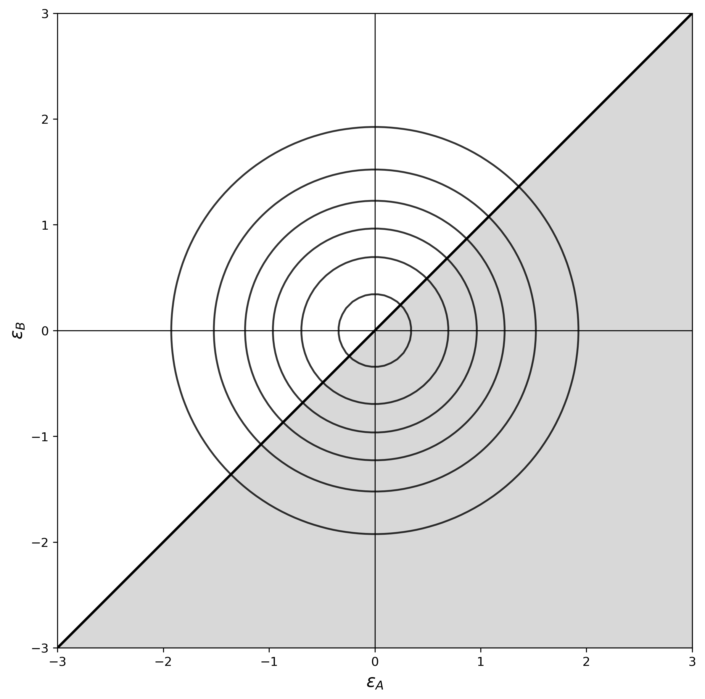
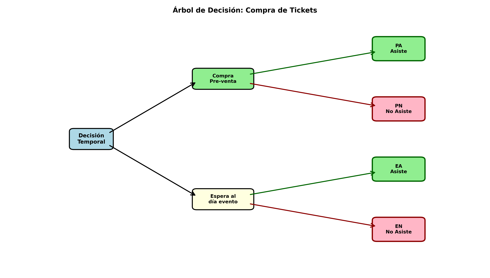

---
editor_options:
  markdown:
    wrap: 72
---

# Modelos Estructurales {#cap-estructurales data-en="Structural Models"}

<div class="lang-es">

::: {.rmdnote}

*Para qué sirve esta unidad.* En marketing, resulta frecuente
necesitar modelos que vayan más allá de la simple descripción de
correlaciones entre variables observables. Los modelos estructurales
derivan relaciones estimables a partir de supuestos explícitos sobre
el comportamiento de los agentes ---típicamente, maximización de
utilidad--- lo que permite interpretar los parámetros en términos de
valoraciones, elasticidades y disposición a pagar, así como evaluar
contrafactuales que apoyen el diseño de estrategias comerciales.

*Habilidades previas requeridas.* Probabilidad y distribuciones
(normal, valor extremo), estimación por máxima verosimilitud (MLE),
regresión lineal y logística, álgebra matricial básica.

*Qué debería poder hacer el estudiante al terminar.*

-   Formular modelos de utilidad aleatoria para problemas de
    elección discreta en marketing.
-   Derivar las probabilidades de elección para los modelos logit,
    probit, nested logit y mixed logit.
-   Estimar modelos de elección discreta mediante MLE y máxima
    verosimilitud simulada (SMLE).
-   Evaluar la calidad de los modelos con $\rho$ de McFadden, AIC,
    BIC y test de razón de verosimilitud.
-   Calcular elasticidades propias y cruzadas, así como la
    disposición a pagar (WTP) por atributos.
-   Incorporar dinámica limitada ---persistencia de elección y
    precios de referencia--- en modelos de panel.

*Conexión con ejercicios.* Al final del capítulo se incluyen
problemas teóricos (P1--P6) con soluciones y problemas aplicados
(PA1) que permiten consolidar los conceptos presentados.

:::

</div>

<div class="lang-en">

::: {.rmdnote}

*Purpose of this unit.* In marketing, models that go beyond
describing correlations among observable variables are frequently
needed. Structural models derive estimable relationships from
explicit assumptions about agents' behavior ---typically, utility
maximization--- which allows interpreting parameters in terms of
valuations, elasticities, and willingness to pay, as well as
evaluating counterfactuals that support the design of commercial
strategies.

*Required background.* Probability and distributions (normal,
extreme value), maximum likelihood estimation (MLE), linear and
logistic regression, basic matrix algebra.

*What the student should be able to do upon completion.*

-   Formulate random utility models for discrete choice problems
    in marketing.
-   Derive the choice probabilities for the logit, probit, nested
    logit, and mixed logit models.
-   Estimate discrete choice models via MLE and simulated maximum
    likelihood (SMLE).
-   Assess model quality using McFadden's $\rho$, AIC, BIC, and
    the likelihood ratio test.
-   Compute own and cross elasticities as well as willingness to
    pay (WTP) for attributes.
-   Incorporate limited dynamics ---choice persistence and
    reference prices--- in panel models.

*Connection with exercises.* The end of the chapter includes
theoretical problems (P1--P6) with solutions and applied problems
(PA1) that allow consolidating the concepts presented.

:::

</div>

## Introducción a modelos estructurales {#estr-intro data-en="Introduction to Structural Models"}

### Modelos estructurales versus forma reducida {data-en="Structural vs. Reduced-Form Models"}

::: {.lang-es}

En esencia, un modelo econométrico estructural es aquel que deriva
relaciones estimables estadísticamente a partir de supuestos bien
definidos de comportamiento de los agentes que deciden respecto a las
cantidades observables. En contraposición a los modelos estructurales
están los modelos de forma reducida donde los modelos simplemente
describen la variabilidad de alguna medida de interés en base a un
conjunto de variables observables exógenas.

:::

::: {.lang-en}

In essence, a structural econometric model is one that derives
statistically estimable relationships from well-defined assumptions
about the behavior of agents deciding over observable quantities. In
contrast, reduced-form models simply describe the variability of some
outcome of interest based on a set of exogenous observable variables.

:::

::: {.lang-es}

La disciplina económica suele llamar modelos estructurales a los
resultantes de asumir que los consumidores maximizan una utilidad
subyacente y que las firmas maximizan su rentabilidad esperada. Desde
el marketing, se considera también en la definición aquellos que
postulan hipótesis alternativas de comportamiento incluyendo así una
variedad de teorías de comportamiento que nutren la disciplina tales
como teoría de prospectos [@kahneman1979], contabilidad mental, elección sobre
conjuntos de consideración, etc. Como se discutirá más adelante, no
existe un modelo estructural puro y la línea que los separa de los
modelos de forma reducida es ciertamente difusa.

Se incluirá en la discusión de modelos estructurales a cualquiera que
considere alguna historia de comportamiento que permita añadir
interpretabilidad a los parámetros del modelo.

:::

::: {.lang-en}

Economics often refers to as structural those models that result from
assuming that consumers maximize an underlying utility and that firms
maximize expected profitability. In marketing, the definition also
includes models that posit alternative behavioral hypotheses, thereby
incorporating theories such as prospect theory [@kahneman1979], mental accounting,
choice over consideration sets, and others. As will be discussed later,
there is no purely structural model, and the line separating structural
from reduced-form models is certainly blurred.

The discussion will therefore include any model that incorporates some
behavioral story that adds interpretability to the model parameters.

:::

### Ejemplos motivadores {#estr-ejemplos data-en="Motivating Examples"}

::: {.lang-es}

*Ejemplo 1:* Supóngase que un analista busca estudiar cómo el precio
en la región $i$ $(p_i)$ se ve afectado por la presencia o no de
competencia. Si además de los precios se observa la cantidad de
clientes en la región $(POP_i)$, el ingreso per cápita en la región
$(INC_i)$ y una indicatriz $CMP_i$ que toma el valor 1 si en la región
correspondiente presenta competencia (0 en caso contrario).

Entonces, un modelo de forma reducida sencillo para estudiar el
problema viene dado por:

:::

::: {.lang-en}

*Example 1.* Suppose an analyst wants to study how price in region
$i$ $(p_i)$ is affected by the presence or absence of competition. In
addition to prices, the analyst observes the number of customers in the
region $(POP_i)$, per-capita income in the region $(INC_i)$, and an
indicator $CMP_i$ that takes value 1 if the corresponding region has
competition (0 otherwise).

Then, a simple reduced-form model for studying the problem is:

:::

\[p_i = \beta_0+ \beta_1POP_i + \beta_2INC_i + \beta_3CMP_i + \varepsilon_i\]

::: {.lang-es}

Bajo este enfoque, se pueden usar técnicas de regresión tradicionales
para estimar $\beta_3$ que en principio indicaría el impacto de la
competencia en el nivel de precios. Sin embargo, la presencia de
competencia en un determinado mercado depende también del nivel de
precios. Si los precios en una región son altos, la rentabilidad
esperada por entrar también es alta motivando a potenciales
competidores a participar. En consecuencia, un modelo como el
planteado podría subestimar el efecto de la competencia.

Un modelo estructural buscaría derivar relaciones estimables a partir
de supuestos básicos del comportamiento de la firma. Por ejemplo, se
podría asumir que cada firma decide conjuntamente la entrada/salida de
un mercado y los precios a cobrar de modo de maximizar la rentabilidad
esperada.

:::

::: {.lang-en}

Under this approach, traditional regression techniques may be used to
estimate $\beta_3$, which would in principle indicate the impact of
competition on price levels. However, the presence of competition in a
market also depends on price levels. If prices in a region are high,
expected profitability from entering is also high, which encourages
potential competitors to participate. Consequently, a model like this
could underestimate the effect of competition.

A structural model would instead derive estimable relationships from
basic assumptions about firm behavior. For example, one might assume
that each firm jointly decides market entry/exit and prices so as to
maximize expected profitability.

:::

::: {.lang-es}

*Ejemplo 2:* Supóngase que se busca describir la productividad de los
miembros de la fuerza de venta medida como número de unidades vendidas
$q$.

:::

::: {.lang-en}

*Example 2.* Suppose one wants to describe the productivity of sales
force members measured as number of units sold $q$.

:::

\[q=f(X,\beta)+\varepsilon\]

::: {.lang-es}

La especificación del término de error $\varepsilon$ puede por sí solo
permitir dar una interpretación estructural a los estimadores. Si
simplemente se asume un error normalmente distribuido, entonces
corresponderá simplemente a un ruido blanco y la regresión simplemente
indicará a través de los parámetros $\beta$ cómo las variables $X$ en
promedio afectan las ventas $q$. Por el contrario, si se asume que el
término $\varepsilon$ considera además del ruido una componente no
observable positiva asociada a la brecha de productividad de los
miembros menos eficientes de la fuerza de venta, entonces la regresión
describirá la frontera eficiente de ventas. Esto puede hacerse por
ejemplo especificando que $\varepsilon = \epsilon - \xi$ donde
$\epsilon$ está normalmente distribuida centrada en cero, pero $\xi$
proviene de una normal truncada en los números positivos (este enfoque
se le suele llamar de regresión estocástica de frontera).

:::

::: {.lang-en}

The specification of the error term $\varepsilon$ alone can provide a
structural interpretation to the estimators. If one simply assumes a
normally distributed error, it corresponds to white noise and the
regression merely indicates through parameters $\beta$ how variables
$X$ affect sales $q$ on average. By contrast, if one assumes that
$\varepsilon$ contains, in addition to noise, a positive unobservable
component associated with the productivity gap of the less efficient
members of the sales force, then the regression describes the
efficient sales frontier. This can be done, for example, by specifying
that $\varepsilon = \epsilon - \xi$, where $\epsilon$ is normally
distributed around zero but $\xi$ comes from a normal distribution
truncated on the positive numbers (this approach is often called
stochastic frontier regression).

:::

::: {.lang-es}

*Ejemplo 3.* Al describir la participación de mercado de distintas
marcas, un enfoque de regresión flexible podría predecir
participaciones fuera del rango $[0,1]$. Si en cambio se adopta el
axioma de elección de Luce [@luce1959] ---la probabilidad de elección
depende del ratio entre la atracción de la alternativa y el atractivo
total del conjunto--- las participaciones quedan restringidas al rango
admisible.

:::

::: {.lang-en}

*Example 3.* When describing the market shares of different
brands, a flexible regression approach might predict shares outside
the $[0,1]$ range. If instead one adopts Luce's choice axiom
[@luce1959] ---the choice probability depends on the ratio between the
attraction of the alternative and the total attractiveness of the
set--- shares are constrained to the admissible range.

:::

::: {.lang-es}

*Ejemplo 4.* La teoría económica predice que la demanda decrece
con el precio. En situaciones con datos limitados, un modelo
flexible puede estimar una relación positiva. La estructura
permite restringir la búsqueda a modelos consistentes con la
premisa teórica.

:::

::: {.lang-en}

*Example 4.* Economic theory predicts that demand decreases with
price. With limited data, a flexible model may estimate a positive
relationship. Structure allows restricting the search to models
consistent with the theoretical premise.

:::

::: {.lang-es}

*Ejemplo 5.* Un retailer que vende a través de tienda física y
sitio web evalúa reasignar el surtido entre canales. El análisis de
ventas históricas por canal no permite predecir qué ocurriría al
mover productos. Es necesario estimar primitivas de comportamiento
---preferencias intrínsecas por canal y patrones de sustitución---
que solo un modelo estructural puede proveer.

:::

::: {.lang-en}

*Example 5.* A retailer selling through both a physical store and
a website considers reallocating assortment across channels.
Analyzing historical sales by channel does not allow predicting what
would happen if products were moved. One needs to estimate
behavioral primitives ---intrinsic channel preferences and
substitution patterns--- that only a structural model can provide.

:::

::: {.lang-es}

*Ejemplo 6.* En industrias con alta rotación de productos (moda,
tecnología), los parámetros estables de la demanda ---elasticidad al
precio, factores estacionales, sustitución entre atributos---
perduran más allá de un producto específico. El enfoque estructural
apunta precisamente a estimar estos parámetros invariantes.

:::

::: {.lang-en}

*Example 6.* In industries with high product turnover (fashion,
technology), stable demand parameters ---price elasticity, seasonal
factors, attribute substitution--- persist beyond any specific
product. The structural approach aims precisely at estimating these
invariant parameters.

:::

### Ventajas de los modelos estructurales {#estr-ventajas data-en="Advantages of Structural Models"}

::: {.lang-es}

El gran desafío de la aplicación de modelos econométricos a problemas
comerciales es enriquecer el conocimiento respecto a cómo se comportan
los agentes relevantes del negocio, para así tomar decisiones más
consistentes y más rentables. Desde este punto de vista, se apunta a
modelos que describan la lógica que determina el comportamiento de los
clientes y firmas más allá de simples correlaciones estadísticas entre
las variables observables. En general, son varias las ventajas de usar
modelos estructurales por sobre modelos de forma reducida:

1.  *La capacidad de contar una mejor historia del comportamiento de
    los agentes*. Esto se expresa por la capacidad de interpretación
    directa de los parámetros del modelo. Mientras los parámetros
    asociados a enfoques de regresión tradicionales típicamente indican
    la magnitud en que en promedio varía alguna magnitud de interés
    ante variaciones de otra, los parámetros de un modelo estructural
    indican entre otros la valoración relativa de un atributo en la
    función de utilidad, los precios de referencia de un producto o la
    aversión al riesgo de un tomador de decisión. La provisión de una
    historia de comportamiento más completa no se deriva exclusivamente
    de la interpretación directa de los parámetros del modelo sino que
    también de la capacidad de derivar métricas complementarias tales
    como elasticidades y excedentes de consumidores. Más aún, se puede
    proyectar el comportamiento para calcular probabilidades y
    frecuencias de compra, participaciones de mercado, etc.

2.  La generación de estimaciones consistentes con las expectativas de
    los analistas. Frecuentemente, al analizar los datos se quiere
    dejar la mayor libertad posible al modelo *para dejar que la data
    hable*. Este enfoque puede tener valor y ser recomendable en
    estudios exploratorios, pero para tomar decisiones se necesitan
    estimaciones robustas y usar tanta información como sea posible.
    Las teorías usadas para derivar modelos econométricos estructurales
    suelen estar soportadas tanto por estudios experimentales como por
    amplia evidencia empírica en múltiples dominios. Por lo tanto, al
    incorporar teoría se está implícitamente usando información que ha
    demostrado consistentemente su validez.

3.  *Evaluación de impacto de modificación de políticas*. Una de las
    herramientas fundamentales de la función comercial es la generación
    de planes comerciales que buscan proponer un diseño del conjunto
    producto, plaza, precio y promoción que genere el mayor valor para
    el cliente y la captura del mayor excedente por parte de la firma.
    El rol de los modelos econométricos es estudiar el impacto que
    tendrían distintas estrategias en el comportamiento del consumidor.
    En esencia, un plan de marketing propone un cambio en las reglas
    del juego que han generado la data que se observa y por tanto se
    necesita apuntar a estimar los elementos más básicos del
    comportamiento que se mantendrán invariantes ante modificación de
    productos, precios, canales de distribución, etc. En este grupo se
    tienen valoraciones por atributos de productos, costo de
    transporte, aversión al riesgo, entre otros, que no pueden ser
    estimados a menos que se derive el modelo a partir de teorías
    individuales de comportamiento. En otras palabras, la derivación de
    modelos de demanda a partir de teorías de comportamiento permite
    evaluar contrafactuales que apoyan el diseño de propuestas de valor
    efectivas.

4.  *Testear aplicabilidad de teoría*. Al usar un enfoque estructural,
    se fuerza a pensar detalladamente respecto al problema y explicitar
    cada uno de los supuestos de comportamiento. Las especificaciones
    alternativas de modelos de forma reducida simplemente corresponden
    a formas funcionales diferentes y por tanto no son informativas
    respecto a la lógica en que deciden los agentes. Por otra parte,
    dos modelos estructurales diferentes provienen de supuestos de
    comportamiento diferentes y por tanto cuando uno de ellos ajusta
    mejor a la data indica que hay una teoría de comportamiento que es
    más plausible que la otra en el dominio de aplicación del modelo.
    Así, los modelos estructurales no solo se nutren de teoría sino
    que también ayudan a su desarrollo.

:::

::: {.lang-en}

The great challenge in applying econometric models to commercial
problems is to enrich our knowledge of how the relevant agents in the
business behave, so as to make decisions that are more consistent and
more profitable. From this perspective, the goal is to build models
that describe the logic determining the behavior of customers and firms
beyond simple statistical correlations among observable variables. In
general, there are several advantages to using structural models over
reduced-form ones:

1.  *The ability to tell a better behavioral story.* This is reflected
    in the direct interpretability of model parameters. While
    parameters in traditional regression approaches typically indicate
    how much some quantity of interest changes on average when another
    varies, the parameters of a structural model may indicate, among
    other things, the relative valuation of an attribute in the utility
    function, reference prices for a product, or the risk aversion of a
    decision maker. A richer behavioral story comes not only from the
    direct interpretation of the parameters, but also from the ability
    to derive complementary metrics such as elasticities and consumer
    surplus. Moreover, one can project behavior to compute purchase
    probabilities and frequencies, market shares, and so on.

2.  The generation of estimates that are consistent with analysts'
    expectations. Analysts often want to leave the model as much
    freedom as possible *to let the data speak*. This approach may be
    valuable and appropriate in exploratory studies, but decision
    making requires robust estimates and the use of as much
    information as possible. The theories used to derive structural
    econometric models are usually supported both by experimental
    studies and by broad empirical evidence across many domains.
    Therefore, incorporating theory implicitly uses information that
    has consistently proved valid.

3.  *Evaluation of the impact of policy changes.* One of the central
    tools of the commercial function is the design of marketing plans
    that propose a product-place-price-promotion mix generating the
    highest value for the customer and the greatest surplus capture for
    the firm. The role of econometric models is to study the impact
    that different strategies would have on consumer behavior. In
    essence, a marketing plan proposes a change in the rules of the
    game that generated the observed data, so the goal is to estimate
    the most basic elements of behavior that will remain invariant to
    changes in products, prices, distribution channels, and so on.
    This includes attribute valuations, transport costs, risk aversion,
    among others, which cannot be estimated unless the model is derived
    from individual behavioral theories. In other words, deriving
    demand models from behavioral theories makes it possible to
    evaluate counterfactuals that support the design of effective value
    propositions.

4.  *Testing the applicability of theory.* A structural approach forces
    one to think carefully about the problem and to make explicit each
    behavioral assumption. Alternative reduced-form specifications are
    simply different functional forms and therefore are not informative
    about the logic by which agents decide. By contrast, two different
    structural models arise from different behavioral assumptions, so
    when one fits the data better it indicates that one behavioral
    theory is more plausible than another in the application domain.
    Thus, structural models do not merely draw from theory; they also
    help develop it.

:::

<div class="lang-es">

::: {.rmdnote}

Las ventajas antes descritas no implican que siempre deban preferirse
modelos estructurales por sobre los de forma reducida. Como se ha
descrito, los modelos de forma reducida suelen proveer suficiente
flexibilidad para dejar que sea la data la que hable, lo que puede ser
particularmente útil en análisis exploratorios del caso bajo estudio.
Además, muchas veces la inclusión de más estructura en el modelo
implica rutinas de estimación más sofisticadas siendo con frecuencia
altamente intensivas computacionalmente.

Es importante destacar que no existe un modelo puramente estructural.
Todo modelo requiere en algún momento suponer alguna forma funcional
flexible sin fundamento teórico sólido. Por ejemplo, se puede asumir
que los consumidores al elegir un producto están maximizando una
utilidad subyacente, pero ¿cómo describir dicha función de utilidad?
¿Qué variables explicativas usar y cuál forma funcional escoger?
Ciertamente la especificidad de las teorías disponibles no alcanza a
responder a estas preguntas y se debe por lo tanto escoger en base a la
intuición y empíricamente entre aquellas que generen mejor ajuste y/o
capacidad de pronóstico. De esta forma, un buen modelo debe balancear
adecuadamente el uso de la teoría con la simpleza y flexibilidad del
modelo.

Para ser convincente, un modelo estructural debe al menos (i) entregar
suficiente flexibilidad para aprender de la data, (ii) derivar las
ecuaciones de comportamiento de supuestos razonables respecto de los
agentes involucrados y (iii) incorporar explícitamente en la
descripción la naturaleza no experimental de la data.

*Observación:* En la discusión se ha hecho la distinción entre
modelos probabilísticos y modelos estructurales. Aunque los modelos
probabilísticos proveen una historia de comportamiento de los agentes,
los supuestos básicos usados para derivarlos no se sustentan en ninguna
teoría de comportamiento. Por ejemplo, en modelos de duración en tiempo
discreto se suele suponer que los clientes dejan de estar activos con
cierta probabilidad. Más que una teoría de comportamiento esto es
simplemente una descripción probabilística de un fenómeno. En
determinadas situaciones, especialmente en casos en que no se dispone
de una descripción rica del ambiente en que los agentes toman sus
decisiones, se conforma con esta descripción agregada del
comportamiento. El enfoque estructural sobre el que se ahondará en esta
parte resulta particularmente útil cuando se tiene suficiente
información para investigar las motivaciones profundas de las
elecciones. Al definir un modelo estructural, tanto las teorías de
comportamiento como la descripción probabilística del sistema son
fuentes válidas de estructura. Sin embargo, se considerará como modelo
econométrico estructural a aquellos que se nutren de ambas fuentes.

:::

</div>

<div class="lang-en">

::: {.rmdnote}

The advantages described above do not imply that structural models
should always be preferred over reduced-form ones. As discussed,
reduced-form models often provide enough flexibility to let the data
speak, which can be particularly useful in exploratory analyses of the
case under study. In addition, incorporating more structure into the
model often implies more sophisticated estimation routines and is
frequently highly computationally intensive.

It is important to emphasize that there is no purely structural model.
Every model requires, at some point, assuming a flexible functional
form without solid theoretical grounding. For example, one may assume
that consumers maximize an underlying utility when choosing a product,
but how should that utility function be described? Which explanatory
variables should be used, and which functional form should be chosen?
Available theories are typically not specific enough to answer these
questions, so one must choose based on intuition and empirical
performance among those specifications delivering better fit and/or
forecasting ability. In this way, a good model must properly balance
theory, simplicity, and flexibility.

To be convincing, a structural model must at least (i) provide
sufficient flexibility to learn from the data, (ii) derive behavioral
equations from reasonable assumptions about the agents involved, and
(iii) explicitly incorporate the non-experimental nature of the data.

*Remark:* The discussion has distinguished between probabilistic and
structural models. Although probabilistic models provide a behavioral
story, the basic assumptions used to derive them are not grounded in a
behavioral theory. For example, in discrete-time duration models it is
common to assume that customers become inactive with some probability.
More than a behavioral theory, this is simply a probabilistic
description of a phenomenon. In some situations, especially when a rich
description of the environment in which agents make decisions is not
available, this aggregate description of behavior may be sufficient.
The structural approach developed in this chapter is particularly useful
when there is enough information to investigate the deeper motivations
behind choices. When defining a structural model, both behavioral
theories and the probabilistic description of the system are valid
sources of structure. However, we will regard as structural
econometric models those drawing on both sources.

:::

</div>

### Modelos estructurales en marketing {#estr-marketing data-en="Structural Models in Marketing"}

::: {.lang-es}

El desarrollo de modelos estructurales se ha gestado en varias áreas
del conocimiento tales como economía, transportes, logística,
finanzas y marketing. Entre estas áreas, la del marketing se ha
constituido en un terreno particularmente fértil para el desarrollo y
adopción del enfoque estructural. Se identifican al menos cuatro
motivos por los cuales la adición de estructura en los modelos
econométricos es particularmente útil para el análisis de problemas
comerciales:

1.  *Disponibilidad de datos*. Gran parte de los datos que registran
    las compañías dan cuenta de las interacciones entre clientes y
    firma como son ocasiones de compra, visitas a sitios web
    corporativos o llamadas a los centros de llamadas. De esta forma,
    un conjunto importante de los datos disponibles dentro de las
    organizaciones son informativos respecto a procesos claves de la
    función comercial. Así, los requerimientos de datos impuestos por
    los modelos estructurales están inmediatamente satisfechos por
    procesos operacionales.

2.  *Atractivo de la evaluación de la intervención de sistemas*. En
    la función comercial, casi por definición se busca perturbar los
    sistemas para mejorar la oferta de valor cambiando precios,
    proponiendo nuevos diseños de productos, redefiniendo la cadena
    logística, etc. De esta forma se necesita disponer de modelos que
    describan la reacción de los consumidores ante dichos cambios del
    ambiente competitivo lo que, de acuerdo a la crítica de Lucas
    [@lucas1976], solo puede hacerse con un modelo estructural.

3.  *Importancia de heterogeneidad*. En marketing se busca hacer
    inferencia desagregada a nivel de cliente o segmento para poder
    diseñar versiones especializadas del marketing mix que sean
    atractivas para segmentos específicos de clientes. Como los
    modelos estructurales requieren especificar los supuestos de
    comportamiento a nivel individual, la generación de estimaciones
    desagregadas suele derivarse directamente.

4.  *Pragmatismo en la aceptación de teorías*. Como se ha argumentado,
    una de las ventajas de los modelos estructurales es que permiten
    testear si una determinada teoría de comportamiento aplica a una
    situación. A diferencia de otras disciplinas, en marketing hay una
    tradición de revisión continua de las fuerzas que moldean el
    comportamiento de las personas y por tanto el enfoque de modelos
    estructurales entrega una herramienta alternativa a la
    verificación experimental de nuevas teorías.

:::

::: {.lang-en}

The development of structural models has taken place across several
areas of knowledge such as economics, transportation, logistics,
finance, and marketing. Among these areas, marketing has become a
particularly fertile ground for the development and adoption of the
structural approach. At least four reasons explain why adding
structure to econometric models is particularly useful for the
analysis of commercial problems:

1.  *Data availability*. A large share of the data recorded by firms
    documents interactions between customers and the firm, such as
    purchase occasions, visits to corporate websites, or calls to call
    centers. Thus, an important part of the data available inside
    organizations is informative about key commercial processes. The
    data requirements imposed by structural models are therefore often
    immediately satisfied by operational processes.

2.  *Appeal of evaluating system interventions*. In the commercial
    function, almost by definition, one seeks to perturb systems to
    improve the value proposition by changing prices, proposing new
    product designs, redefining the logistics chain, and so on. This
    requires models that describe consumers' reactions to such changes
    in the competitive environment, which, according to Lucas's
    critique [@lucas1976], can only be done with a structural model.

3.  *Importance of heterogeneity*. In marketing, one seeks
    disaggregated inference at the customer or segment level in order
    to design specialized versions of the marketing mix that are
    attractive to specific customer segments. Since structural models
    require specifying behavioral assumptions at the individual level,
    the generation of disaggregated estimates often follows directly.

4.  *Pragmatism in accepting theories*. As argued above, one of the
    advantages of structural models is that they allow researchers to
    test whether a particular behavioral theory applies in a given
    situation. Unlike other disciplines, marketing has a tradition of
    continually revisiting the forces that shape human behavior, so
    the structural approach provides an alternative to the
    experimental verification of new theories.

:::

### Taxonomía de modelos estructurales {#estr-taxonomia data-en="Taxonomy of Structural Models"}

::: {.lang-es}

Metodológicamente, es útil generar una clasificación de los tipos de
modelos estructurales existentes en la literatura. Como se ha
consignado, uno de los costos de la inclusión de teoría en modelos
econométricos es la mayor complejidad en las rutinas de estimación. Es
esta complejidad la que dificulta la generación de un mecanismo único
que permita estimar modelos generales y por tanto se ve forzado a usar
metodologías específicas dependiendo de la naturaleza del problema. En
la discusión se basará la clasificación en la evaluación de cuatro
factores.

1.  *Nivel de agregación de los datos*. Se ha propuesto que un modelo
    estructural debe basarse en una descripción detallada de los
    supuestos de los tomadores de decisión a nivel individual. Por lo
    tanto, la disponibilidad de datos a nivel individual como la
    decisión de compra de cada uno de los individuos de un panel de
    consumidores habilita para, imponiendo las restricciones de
    identificación necesarias, estimar los parámetros de
    comportamiento de manera más o menos directa. Sin embargo, en
    ciertas situaciones solo se dispone de información agregada, como
    participaciones de mercado o datos agregados de venta. En estos
    casos, la identificación de parámetros de comportamiento requiere
    además de una descripción del mecanismo mediante el cual se
    agregan las decisiones individuales. Este mecanismo típicamente
    considera la especificación de un modelo de heterogeneidad
    describiendo como se distribuyen los parámetros entre los clientes
    la que se integra sobre la población para generar las métricas
    agregadas. Esto es precisamente lo propuesto por el método BLP de
    Berry, Levinsohn y Pakes [@berry1995], que describe un método que,
    basado en un modelo logit, permite estimar ofertas y demandas de un
    modelo oligopólico con información agregada. Por simplicidad, en
    esta versión se concentrará en modelos estimables directamente
    sobre datos desagregados a nivel individual.

2.  *Temporalidad de las decisiones*. Dependiendo de la amplitud
    temporal considerada por los agentes al evaluar las alternativas
    de decisión, se distingue entre problemas estáticos y dinámicos.
    Básicamente, si se considera que las acciones que se observan
    resultan de una evaluación completa del horizonte, entonces se
    habla de problemas dinámicos. En caso contrario, se dice que el
    problema es estático. La distinción es importante desde un punto
    de vista metodológico. Si el tomador de decisiones basa sus
    decisiones exclusivamente mirando el pasado, entonces estas
    decisiones pueden caracterizarse directamente mediante condiciones
    de optimidad sencillas. Por el contrario, si el tomador de
    decisión además evalúa las repercusiones (inciertas) que sus
    acciones de hoy podrían tener en su bienestar futuro, entonces se
    necesita caracterizar las políticas óptimas a través de ecuaciones
    de Bellman que incorporen explícitamente la naturaleza
    multiperiodo del problema. En este caso, para encontrar la
    política óptima del problema se requiere usar técnicas como
    programación dinámica estocástica o control óptimo, aumentando de
    manera importante la complejidad computacional de la estimación.

3.  *Naturaleza de las variables de decisión*. Si las variables sobre
    las que deciden los agentes son continuas (gasto, montos de
    inversión, unidades compradas, etc.), se habla de un modelo de
    decisión continuo. Si las variables sobre las que deciden los
    agentes son discretas (si visita o no visita la tienda, si elige
    la marca A o marca B, etc.), se habla de un modelo de decisión
    discreto. La distinción es relevante en cuanto las soluciones de
    un problema de decisión continua pueden caracterizarse
    directamente mediante condiciones de Karush-Kuhn-Tucker, mientras
    que las soluciones de un problema de decisión discreta requieren
    una enumeración del valor de las alternativas.

4.  *Identidad de los agentes*. Los modelos estructurales pueden
    usarse para estudiar tanto el comportamiento de los clientes como
    de las otras firmas en el mercado. El área que estudia el
    comportamiento de las firmas ha tenido un gran desarrollo en los
    últimos años y se conoce como organización industrial empírica. En
    esta versión, se concentrará la discusión en el estudio de los
    clientes por dos motivos principales: la disponibilidad de datos
    de comportamiento de cliente y la simpleza de las nociones de
    equilibrio requeridas para describir a los clientes. Mientras cada
    cliente suele tener poco poder de mercado por si mismo, las
    acciones de marketing de las firmas competidoras típicamente
    pueden modificar de manera importante las condiciones del mercado.
    Así, la descripción de las decisiones de las firmas conlleva
    desafíos metodológicos importantes como la inclusión de nociones
    sofisticadas de equilibrio para internalizar que las decisiones de
    las firmas resultan tanto de mirar las respuestas esperadas de los
    clientes como las reacciones estratégicas de los competidores.

Metodológicamente es útil también distinguir los métodos de estimación
de los modelos. La literatura reconoce dos grandes enfoques para
estimar modelos estructurales como los aquí presentados: método de los
momentos generalizados (GMM) y método de la máxima verosimilitud. Dada
su eficiencia estadística (en el sentido que usa toda la información
disponible), en esta primera versión se usará solo el método de la
máxima verosimilitud. En lo que sigue se enfocará la discusión al
estudio del comportamiento de clientes, en problemas estáticos (o con
dinámica limitada a la incorporación del pasado) y con datos
desagregados. Partiremos describiendo brevemente modelos de decisión
continuos para luego iniciar una discusión más extensa en modelos de
decisión discreta que tienen una tradición más larga en marketing.

:::

::: {.lang-en}

Methodologically, it is useful to generate a classification of the
types of structural models found in the literature. As noted above,
one of the costs of including theory in econometric models is the
greater complexity of estimation routines. This complexity makes it
difficult to generate a single mechanism capable of estimating general
models, and therefore one is forced to use specific methodologies
depending on the nature of the problem. The classification below is
based on four factors.

1.  *Level of data aggregation*. A structural model should be based on
    a detailed description of the assumptions made about decision
    makers at the individual level. Therefore, the availability of
    individual-level data, such as purchase decisions in a consumer
    panel, makes it possible, subject to the necessary identification
    restrictions, to estimate behavioral parameters more or less
    directly. However, in some situations only aggregate information
    is available, such as market shares or aggregate sales data. In
    those cases, identifying behavioral parameters requires a
    description of the mechanism by which individual decisions are
    aggregated. This mechanism typically involves specifying a model
    of heterogeneity that describes how parameters are distributed
    across customers and integrating over the population to generate
    aggregate metrics. This is precisely what the BLP method of Berry,
    Levinsohn, and Pakes [@berry1995] does, using a logit-based
    framework to estimate supply and demand in oligopolies with
    aggregate information. For simplicity, this version concentrates on
    models estimable directly on disaggregated individual-level data.

2.  *Temporality of decisions*. Depending on the temporal horizon that
    agents consider when evaluating decision alternatives, one
    distinguishes between static and dynamic problems. Roughly
    speaking, if observed actions result from a full evaluation of the
    horizon, the problem is dynamic; otherwise it is static. This
    distinction matters methodologically. If the decision maker bases
    decisions only on the past, then those decisions can be
    characterized directly through simple optimality conditions. By
    contrast, if the decision maker also evaluates the uncertain
    effects that today's actions may have on future well-being, then
    optimal policies must be characterized through Bellman equations
    that explicitly incorporate the multiperiod nature of the
    problem. In that case, solving for the optimal policy requires
    techniques such as stochastic dynamic programming or optimal
    control, substantially increasing computational complexity.

3.  *Nature of decision variables*. If the variables over which agents
    decide are continuous (expenditure, investment amounts, units
    purchased, etc.), one speaks of a continuous decision model. If
    they are discrete (whether to visit a store, whether to choose
    brand A or brand B, etc.), one speaks of a discrete decision
    model. The distinction is relevant because the solutions to a
    continuous decision problem can be characterized directly by
    Karush-Kuhn-Tucker conditions, whereas the solutions to a discrete
    decision problem require enumeration of the value of the
    alternatives.

4.  *Identity of the agents*. Structural models can be used to study
    both customer behavior and the behavior of other firms in the
    market. The area that studies firm behavior has developed strongly
    in recent years and is known as empirical industrial organization.
    In this version, the discussion focuses on customers for two main
    reasons: the availability of customer-behavior data and the
    relative simplicity of the equilibrium concepts required to
    describe customers. While each customer typically has little
    market power on their own, the marketing actions of competing
    firms can substantially alter market conditions. Thus, describing
    firms' decisions entails important methodological challenges, such
    as incorporating sophisticated equilibrium notions to internalize
    that firms' decisions reflect both expected customer responses and
    strategic reactions from competitors.

Methodologically, it is also useful to distinguish the estimation
methods used for these models. The literature recognizes two major
approaches for estimating structural models such as those presented
here: the generalized method of moments (GMM) and maximum likelihood.
Given its statistical efficiency (in the sense that it uses all
available information), this first version will use only maximum
likelihood. The discussion that follows focuses on customer behavior,
in static problems (or with dynamics limited to the incorporation of
the past), and with disaggregated data. We begin by briefly describing
continuous-decision models and then move to a more extensive discussion
of discrete-choice models, which have a longer tradition in marketing.

:::

## Modelo logit {#estr-logit data-en="Logit Model"}

### Modelos de elección discreta {#estr-eleccion-discreta data-en="Discrete Choice Models"}

::: {.lang-es}

Un modelo de elección discreta consiste básicamente en situaciones en
que la naturaleza de las variables de decisión a las que se enfrenta el
tomador de decisión son discretas. Para ilustrar la intuición de la
diferencia con respecto a modelos de decisión continua, es útil pensar
que mientras estos últimos buscan describir decisiones de "el cuánto",
los modelos de elección discreta se concentran en "el cuál". La
distinción además relevante desde un punto de vista metodológico. A
diferencia de los modelos de elección continua en que la optimidad de
la elección queda bien descrita por condiciones de primer orden, al
enfrentar decisiones discretas caracterizaremos la optimidad por
enumeración. Ejemplos típicos en que la decisión a evaluar es de
naturaleza discreta incluye la elección de una marca por sobre otra en
la góndola de un supermercado, la decisión de visitar o no a una
tienda, la elección del color de una prenda de vestir, de un canal de
venta y la elección de las firmas respecto a entrar o no entrar a un
mercado.

:::

::: {.lang-en}

A discrete choice model consists essentially of situations in which the
nature of the decision variables faced by the decision maker is
discrete. To build intuition relative to continuous decision models, it
is useful to think that while the latter seek to describe decisions
about "how much", discrete choice models focus on "which one". The
distinction is also relevant from a methodological standpoint. Unlike
continuous-choice models, in which optimality is well described by
first-order conditions, with discrete decisions optimality will be
characterized by enumeration. Typical examples include choosing one
brand over another on a supermarket shelf, deciding whether or not to
visit a store, choosing the color of a garment or a sales channel, and
firms' decisions about whether or not to enter a market.

:::

::: {.lang-es}

Para que un problema de elección discreta esté bien definido, se
necesita, además de variables de decisión discretas, que el conjunto de
alternativas presente las siguientes tres características:

1.  *Exhaustivas*: El conjunto sobre el que los tomadores de decisión
    eligen deben incluir todas las alternativas posibles. En otras
    palabras, cualquiera sea la decisión observada, debe estar
    incluida en el conjunto de elección. Esta condición es poco
    restrictiva ya que siempre es posible incluir en el set de
    alternativas la posibilidad “ninguna de las anteriores” o similar
    que por definición incluya toda las otras posibilidades no
    consideradas en conjunto. Sin embargo, esta estrategia debe usarse
    con precaución. Por ejemplo, al estudiar la elección de marca en
    una categoría en que se observa que los clientes no siempre
    compran alguna de las marcas disponibles, se podría incluir la
    alternativa de no compra en el conjunto de elección. Si la
    proporción de no compras es alta en la muestra, la inclusión de la
    alternativa de no compra podría limitar la habilidad del modelo de
    aprender respecto a cómo los clientes eligen entre marcas. En este
    caso, podría convenir concentrarse en la elección de la marca
    condicional en haber hecho una compra en la categoría.

2.  *Mutuamente excluyentes:* El conjunto de decisión debe definirse de
    modo que en cada ocasión el tomador de decisión seleccione solo
    una de las alternativas disponibles. Esto es, la elección de una
    alternativa implica necesariamente la no elección de cualquiera de
    las alternativas restantes. Aunque aparentemente restrictiva, la
    definición de conjunto de elección puede acomodarse para generar
    conjuntos mutuamente excluyentes. Por ejemplo, considérese un
    modelo para describir la elección de los clientes entre la *tienda
    física tradicional* o la *tienda virtual*. Si simplemente se
    permite una alternativa de elección por cada canal, entonces se
    excluye la posibilidad de que un mismo cliente esté en más de un
    canal al mismo tiempo. Para incorporar esta posibilidad, se debe
    redefinir las alternativas agregando la opción de *tienda
    tradicional y virtual*.

3.  *Finito:* El conjunto de decisión debe contener un conjunto finito
    de alternativas. Esta condición es importante por dos motivos
    técnicos. Primero, un conjunto finito facilita la evaluación de la
    optimidad de las decisiones y, segundo, facilita la definición de
    probabilidades de elección. Existen situaciones en que la decisión
    teóricamente permite infinitas posibilidades, pero que en la
    práctica se concentran en un número reducido de alternativas y,
    por tanto, quedan bien representadas por un modelo de elección
    discreta. Por ejemplo, se puede usar el número de cajas de cereal
    compradas por los clientes en cada visita al supermercado. Aunque
    teóricamente los clientes siempre podrían comprar una unidad
    adicional, el problema queda bien descrito considerando sólo las
    alternativas de 0, 1, 2, 3 o más de 3 cajas.

:::

::: {.lang-en}

For a discrete choice problem to be well defined, in addition to
discrete decision variables, the choice set must satisfy the following
three characteristics:

1.  *Exhaustive*: The set over which decision makers choose must
    include all possible alternatives. In other words, whatever
    decision is observed must be included in the choice set. This
    condition is not very restrictive because one can always include a
    “none of the above” option or similar, which by definition covers
    all other possibilities not explicitly considered. However, this
    strategy must be used with caution. For example, when studying
    brand choice in a category where customers do not always buy one of
    the available brands, one could include a no-purchase option in
    the choice set. If the proportion of no-purchases is high, this
    may limit the model's ability to learn how customers choose among
    brands. In that case, it may be preferable to focus on brand
    choice conditional on having made a purchase in the category.

2.  *Mutually exclusive:* The choice set must be defined so that in
    each occasion the decision maker selects only one of the available
    alternatives. That is, choosing one alternative necessarily
    implies not choosing any of the remaining alternatives. Although
    this may appear restrictive, the choice set can be redefined to
    accommodate mutually exclusive alternatives. For example, consider
    a model describing customer choice between a *traditional physical
    store* and a *virtual store*. If one simply allows one alternative
    per channel, then the possibility that the same customer is in
    more than one channel at the same time is excluded. To incorporate
    this possibility, the alternatives must be redefined by adding the
    option *traditional and virtual store*.

3.  *Finite:* The choice set must contain a finite set of
    alternatives. This condition matters for two technical reasons.
    First, a finite set facilitates evaluating optimality; second, it
    facilitates defining choice probabilities. There are situations in
    which the decision theoretically allows infinitely many
    possibilities but, in practice, concentrates on a reduced number
    of alternatives and is therefore well represented by a discrete
    choice model. For example, one can use the number of cereal boxes
    purchased in each supermarket visit. Although customers could in
    theory always buy one more unit, the problem is well described by
    considering only the alternatives 0, 1, 2, 3, or more than 3
    boxes.

:::

#### Utilidad aleatoria {-}

::: {.lang-es}

Un modelo estructural para describir la probabilidad de elegir cada
alternativa necesita especificar el mecanismo que usan los agentes para
decidir entre las alternativas. Se partirá asumiendo que, en cada
oportunidad de compra $t$, el tomador de decisión $n$ elige la
alternativa $i$ que le reporta mayor utilidad $u_{nit}$. Pese a que el
tomador de decisión necesita conocer la utilidad que deriva de cada una
de las alternativas, desde la perspectiva del analista solo se observan
algunas características del ambiente de decisión y del tomador de
decisión a partir de las cuales se puede intentar aproximar la utilidad
del tomador de decisión a través de una función
$v_{nit}(x_{nit}, \theta)$ donde $x_{nit}$ son las características
observables del problema y $\theta$ el vector de parámetros que se
busca estimar y que describen la relación de dichas características con
la utilidad.

:::

::: {.lang-en}

A structural model that seeks to describe the probability of choosing
each alternative must specify the mechanism that agents use to decide
among the available alternatives. We begin by assuming that, at each
purchase occasion $t$, decision-maker $n$ chooses alternative $i$ if it
delivers the highest utility $u_{nit}$. Even though the decision maker
needs to know the utility derived from each alternative, from the
analyst's perspective only some characteristics of the decision
environment and the decision maker are observed. Based on that
information, one can attempt to approximate utility through a function
$v_{nit}(x_{nit}, \theta)$ where $x_{nit}$ are the observable
characteristics of the problem and $\theta$ is the parameter vector to
be estimated, describing the relationship between those characteristics
and utility.

:::

$$u_{nit} = v_{nit} + \varepsilon_{nit}
(\#eq:estr-utilidad)$$

::: {.lang-es}

*Ejemplo:* Supóngase que se quiere describir la elección del medio de
pago que usan los usuarios de una tienda determinada, la que permite
pagar en efectivo o con alguna tarjeta bancaria. El analista observa 3
variables que intuye pueden ser relevantes en la elección del medio de
pago: el género del cliente ($F_n = 1$ si cliente es de género
femenino), su nivel de ingresos $(I_n)$ y el monto de la transacción
$(M_{nt})$. Son precisamente estas características las que estarían
incluidas en la matriz que se ha llamado $x_{nit}$. A partir de esta
información pueden plantearse múltiples modelos para describir
$v_{nit}$ (se asumirá que $i = 0$ corresponde al caso de pago con
efectivo mientras que $i = 1$ al de pago con tarjeta).

-   *Modelo Lineal Homogéneo:* Aquí, la utilidad para ambas
    alternativas crece linealmente con las variables observables. En
    este caso, los parámetros son los mismos para todos los tomadores
    de decisión y por tanto el vector de parámetros viene dado por
    $\theta = (\alpha_0, \alpha_1, \beta, \gamma, \delta)$

$$v_{nit} = \alpha_i + \beta F_n + \gamma I_n + \delta M_{nt}$$

-   *Modelo lineal heterogéneo:* Aquí, la utilidad para ambas
    alternativas también crece linealmente con las variables
    observables, pero ahora los parámetros varían por alternativa y por
    agente, y por tanto el vector de parámetros viene dado por
    $\theta = ( \{ \alpha_{1n} \} _{n=1}^{N}, \beta_0,\beta_1,\gamma_0,\gamma_1,\{ \delta_n \}_{n=1}^{N} )$

$$v_{nit} = \alpha_{in} + \beta_i F_n + \gamma_i I_n + \delta_n M_{nt}$$

La definición de que los interceptos dependen del cliente $n$
simplemente indica que cada cliente tiene una preferencia intrínseca
por cada medio de pago. Del mismo modo, se está imponiendo que la
influencia que tiene el monto en el atractivo que tiene cada
alternativa depende del cliente. Por ejemplo, mientras para algunos
clientes el monto de la transacción puede jugar un rol importante en la
decisión del medio de pago, para otros este efecto podría no ser
relevante. Por último, la dependencia de la alternativa en los
parámetros asociados a género e ingreso podrían usarse para por ejemplo
situaciones en que el nivel de ingreso afecta el atractivo de un medio
de pago pero no del otro (la intuición para el género es análoga).

Por supuesto, también se pueden postular modelos no lineales u otras
especificaciones de la heterogeneidad. Por ejemplo, que la influencia
del ingreso varíe por medio de pago, pero que el efecto del género sea
constante entre las alternativas. Descubrir la especificación que mejor
describe el problema es precisamente la tarea del analista.

*Observación:* En el ejemplo se ha introducido brevemente el concepto
de heterogeneidad. Sin embargo, para facilitar la exposición de los
temas básicos, en primera instancia se concentrará en modelos sin
heterogeneidad. En marketing, los modelos que incluyen heterogeneidad
en las preferencias son tan importantes que se postergará su discusión
en un capítulo separado.

En la práctica, aún en situaciones en que se observa con detalle el
ambiente de decisión, no se podrá describir con exactitud todos los
factores que gobiernan el comportamiento de los agentes. Por lo tanto,
se definirá $\varepsilon_{nit}$ como el error (aditivo) que se comete
al aproximar $u_{nit}$ a través de $v_{nit}$.

La componente básica para estimar estadísticamente un modelo de elección
discreta es la especificación de la probabilidad de elección de cada
alternativa. Sea $P_{nit}$ la probabilidad de que el agente $n$ escoja
la alternativa $i$ en la oportunidad de compra $t$. El supuesto de
maximización de utilidades implica que $P_{nit}$ puede escribirse como:

:::

::: {.lang-en}

The systematic component is specified as a function
$v_{nit} = v(\mathbf{x}_{nit}, \boldsymbol{\theta})$, where
$\mathbf{x}_{nit}$ denotes the observable characteristics and
$\boldsymbol{\theta}$ the parameter vector to be estimated.

*Example:* Suppose one wants to describe the choice of payment method
used by customers in a given store, which allows payment in cash or
with a bank card. The analyst observes 3 variables that seem likely to
be relevant for the payment decision: the customer's gender
($F_n = 1$ if the customer is female), income level $(I_n)$, and
transaction amount $(M_{nt})$. These are precisely the characteristics
that would be included in the matrix denoted $x_{nit}$. Based on this
information, multiple models can be proposed to describe $v_{nit}$
(assuming that $i = 0$ corresponds to cash payment and $i = 1$ to card
payment).

-   *Homogeneous linear model:* Here, utility for both alternatives
    increases linearly with the observable variables. In this case, the
    parameters are the same for all decision-makers, so the parameter
    vector is given by
    $\theta = (\alpha_0, \alpha_1, \beta, \gamma, \delta)$

$$v_{nit} = \alpha_i + \beta F_n + \gamma I_n + \delta M_{nt}$$

-   *Heterogeneous linear model:* Here, utility for both alternatives
    also increases linearly with the observable variables, but now the
    parameters vary by alternative and by agent, so the parameter
    vector is given by
    $\theta = ( \{ \alpha_{1n} \} _{n=1}^{N}, \beta_0,\beta_1,\gamma_0,\gamma_1,\{ \delta_n \}_{n=1}^{N} )$

$$v_{nit} = \alpha_{in} + \beta_i F_n + \gamma_i I_n + \delta_n M_{nt}$$

Allowing the intercepts to depend on customer $n$ simply indicates that
each customer has an intrinsic preference for each payment method.
Likewise, this specification imposes that the influence of the
transaction amount on the attractiveness of each alternative depends on
the customer. For example, for some customers the transaction amount
may play an important role in the payment-method decision, while for
others this effect may be irrelevant. Finally, allowing the
gender- and income-related parameters to depend on the alternative
could be useful, for instance, in situations where income affects the
attractiveness of one payment method but not the other (the intuition
for gender is analogous).

Of course, nonlinear models or other heterogeneity specifications can
also be proposed. For example, income may vary by payment method while
the effect of gender remains constant across alternatives. Discovering
the specification that best describes the problem is precisely the
analyst's task.

*Remark:* The example has briefly introduced the concept of
heterogeneity. However, to facilitate the exposition of the basic
topics, the initial discussion will focus on models without
heterogeneity. In marketing, models that include heterogeneity in
preferences are so important that their discussion is postponed to a
separate chapter.

In practice, even in situations where the decision environment is
observed in detail, it is not possible to describe exactly all the
factors governing agents' behavior. Therefore, $\varepsilon_{nit}$ is
defined as the (additive) error committed when approximating $u_{nit}$
through $v_{nit}$.

The basic component required to estimate a discrete-choice model
statistically is the specification of the choice probability of each
alternative. Let $P_{nit}$ be the probability that agent $n$ chooses
alternative $i$ at purchase occasion $t$. The utility-maximization
assumption implies that $P_{nit}$ can be written as:

:::

$$\begin{aligned}
P_{nit} &= Pr(u_{nit}>u_{njt},\forall j \neq i)\\
&= Pr(v_{nit} + \varepsilon_{nit} >v_{njt} + \varepsilon_{njt} ,\forall j \neq i)\\
&= \int \mathbf{1} (\varepsilon_{njt} - \varepsilon_{nit} > v_{nit} - v_{njt}) f(\varepsilon_{nt}) d \varepsilon_{nt}
\end{aligned}
(\#eq:estr-probelec)$$

::: {.lang-es}

donde $\mathbf{1}(\cdot)$ toma el valor 1 si se cumple el argumento y
el valor 0 en caso contrario. En esta expresión,
$\varepsilon_{nt} = (\varepsilon_{n1t},\varepsilon_{n2t}, ...,\varepsilon_{nIt})$
es el vector de las componentes aleatorias de la elección del agente
$n$ en la oportunidad $t$, y $f(\cdot)$ la función de densidad que
describe su comportamiento probabilístico. La elección de la
distribución de la componente aleatoria es importante en cuanto impone
restricciones a los patrones de comportamiento que pueden ser capturados
por el modelo. Se concentrará la atención en los casos en que
$\varepsilon_{nit}$ se distribuye valor extremo, que da origen al
modelo *logit*, y normal, que da origen al modelo *probit*.

:::

::: {.lang-en}

where $\mathbf{1}(\cdot)$ takes value 1 when the argument holds and 0
otherwise. In this expression,
$\varepsilon_{nt} = (\varepsilon_{n1t},\varepsilon_{n2t}, ...,\varepsilon_{nIt})$
is the vector of random utility components for agent $n$ at occasion
$t$, and $f(\cdot)$ is the density function describing their
probabilistic behavior. The choice of the error distribution is
important because it imposes restrictions on the behavioral patterns
that the model can capture. The discussion will focus on the cases in
which $\varepsilon_{nit}$ is distributed extreme value, giving rise to
the *logit* model, and normal, giving rise to the *probit* model.

:::

### Derivación de la probabilidad logit {#estr-logit-prob data-en="Logit Choice Probability Derivation"}

::: {.lang-es}

El modelo logit resulta de asumir que cada $\varepsilon_{nit}$ es
independientemente distribuido según una distribución Gumbel (valor
extremo tipo I) [@mcfadden1974]:

:::

::: {.lang-en}

The logit model results from assuming that each $\varepsilon_{nit}$
is independently distributed according to a Gumbel (type I extreme
value) distribution [@mcfadden1974]:

:::

$$F(\varepsilon_{nit}) = e^{-e^{-\varepsilon_{nit}}},
\qquad
f(\varepsilon_{nit}) = e^{-\varepsilon_{nit}}
                        e^{-e^{-\varepsilon_{nit}}}
(\#eq:estr-gumbel)$$

::: {.lang-es}

Bajo este supuesto, se puede demostrar que la probabilidad de elección
en un modelo logit corresponde a una fórmula cerrada sencilla. Para
simplificar la notación, sea $s=\varepsilon_{nit}$.

:::

::: {.lang-en}

Under this assumption, it can be shown that the choice probability in a
logit model takes a simple closed-form expression. To simplify
notation, let $s=\varepsilon_{nit}$.

:::

\[
\begin{aligned}
P_{nit} &= \int_{-\infty}^{\infty} \left(\prod_{j\neq i}    e^{-e^{-(s + v_{nit} - v_{njt})}}\right) e^{-s} e^{-e^{-s}}ds\\
&= \int_{-\infty}^{\infty} \left(\prod_{j}   e^{-e^{-(s + v_{nit} - v_{njt})}}\right) e^{-s}ds\\
&= \int_{-\infty}^{\infty} exp\left(\sum_{j}  e^{-(v_{nit} - v_{njt})}\right) e^{-s}ds
\end{aligned}
\]

::: {.lang-es}

Para resolver la integral, se puede recurrir a un cambio de variables
$t = e^{-s}$ y $dt = e^{-s}ds$. Con esto:

:::

::: {.lang-en}

To solve the integral, one can use the change of variables
$t = e^{-s}$ and $dt = e^{-s}ds$. This yields:

:::

$$\begin{aligned}
P_{nit} &= \int_{\infty}^{0} -e^{t\sum_{j}  e^{-(v_{nit} - v_{njt})}} dt\\
&= \frac{ e^{-(v_{nit} - v_{njt})}}{\sum_{j}  e^{-(v_{nit} - v_{njt})}}\mid^{\infty}_{0}\\
&= \frac{e^{v_{nit}}}{\sum_j e^{v_{njt}}}
\end{aligned}
(\#eq:estr-logitprob)$$

::: {.lang-es}

En algunos libros de texto se justifica esta expresión simplemente como
una regresión logística, esto es, una transformación lineal para
normalizar la utilidad de modo de interpretarla directamente como una
probabilidad de elección en el rango [0,1]. Aunque válido, resulta útil
entender que, en efecto, dicha expresión puede derivarse a partir de
supuestos de maximización de utilidades.

Para ganar algo de intuición respecto a la expresión de la probabilidad
de elección, es útil graficarla con respecto a la utilidad derivada por
cada alternativa. Por ejemplo, supóngase que se tiene una decisión
binaria que, por ejemplo, corresponde a la decisión de comprar o no
comprar un producto. En este caso, la probabilidad de comprar el
producto crece *sigmoidalmente* con la utilidad derivada de la compra.
Esto es, al graficar la probabilidad de compra con respecto a la
utilidad derivada, se obtiene una curva S como muestra la Figura 1. En
la figura, se ha agregado también la curva de la probabilidad de
elección en el caso en que, en vez de asumir que el error se
distribuye valor extremo como demanda el modelo logit, se asume que el
error está normalmente distribuido como tradicionalmente se hace en
otros modelos econométricos.

:::

::: {.lang-en}

In some textbooks, this expression is justified simply as a logistic
regression, that is, as a linear transformation used to normalize
utility so that it can be interpreted directly as a choice probability
in the range [0,1]. Although valid, it is useful to understand that
this expression can in fact be derived from utility-maximization
assumptions.

To build intuition for the choice-probability expression, it is useful
to graph it with respect to the utility derived from each alternative.
For example, suppose one has a binary decision such as whether or not
to buy a product. In this case, the probability of purchase grows
*sigmoidally* with the utility derived from buying. That is, graphing
purchase probability against utility yields an S-shaped curve, as shown
in Figure 1. The figure also includes the choice-probability curve that
arises when, instead of assuming an extreme-value error as required by
the logit model, one assumes a normally distributed error as is
traditional in other econometric models.

:::

```{r probelec, fig.cap="Probabilidad de elección", out.width='50%', fig.align='center'}
knitr::include_graphics(rep("images/probabilidad_eleccion.png"))
```

### Elasticidades {#estr-logit-elasticidades data-en="Elasticities"}

::: {.lang-es}

La disposición de una fórmula cerrada permite calcular métricas de
sustitución de forma directa. Si
$v_{nit} = v(\mathbf{x}_{nit}, \boldsymbol{\theta})$, se obtienen
las siguientes expresiones.

Recuerde que una de las motivaciones para el uso de modelos
estructurales es la posibilidad de analizar contrafactuales, esto es,
ver qué pasaría con el mercado si hay cambio en alguna variable de
control interesante. Por ejemplo que pasa con las participaciones de
mercado si sube el precio de una alternativa, si se aumenta la
frecuencia publicitaria, etc. Las métricas recién presentadas permiten
precisamente hacer dichas evaluaciones de manera directa.

:::

::: {.lang-en}

The availability of a closed-form expression allows computing
substitution metrics directly. If
$v_{nit} = v(\mathbf{x}_{nit}, \boldsymbol{\theta})$, the
following expressions are obtained.

Recall that one of the motivations for using structural models is the
possibility of analyzing counterfactuals, that is, asking what would
happen in the market if some relevant control variable changed. For
example, what happens to market shares if the price of an alternative
increases, or if advertising frequency rises? The metrics presented
here make those evaluations possible in a direct way.

:::

::: {.lang-es}

*Derivada propia* (variación de $P_{nit}$ ante un cambio en un
atributo de la misma alternativa):

:::

::: {.lang-en}

*Own derivative* (change in $P_{nit}$ from a change in an
attribute of the same alternative):

:::

$$\frac{\partial P_{nit}}{\partial x_{nit}}
  = \frac{\partial v_{nit}}{\partial x_{nit}}
    \cdot P_{nit}(1 - P_{nit})
(\#eq:estr-derpropia)$$

::: {.lang-es}

*Derivada cruzada* (variación de $P_{nit}$ ante un cambio en un
atributo de otra alternativa $j$):

:::

::: {.lang-en}

*Cross derivative* (change in $P_{nit}$ from a change in an
attribute of another alternative $j$):

:::

$$\frac{\partial P_{nit}}{\partial x_{njt}}
  = -\frac{\partial v_{njt}}{\partial x_{njt}}
    \cdot P_{nit} \cdot P_{njt}
(\#eq:estr-dercruzada)$$

::: {.lang-es}

Elasticidad de la probabilidad de elegir la alternativa $i$ con
respecto a alguna componente de la utilidad de la misma alternativa.

:::

::: {.lang-en}

Elasticity of the probability of choosing alternative $i$ with respect
to some component of the utility of that same alternative.

:::

$$e_{ix_{nit}} = \frac{\partial P_{nit}}{\partial x_{nit}}
  \cdot \frac{x_{nit}}{P_{nit}}
  = \frac{\partial v_{nit}}{\partial x_{nit}} x_{nit} (1- P_{nit})
(\#eq:estr-elastpropia)$$

::: {.lang-es}

Elasticidad de la probabilidad de elegir la alternativa $i$ con
respecto a alguna componente de la utilidad de otra alternativa.

:::

::: {.lang-en}

Elasticity of the probability of choosing alternative $i$ with respect
to some component of the utility of another alternative.

:::

$$e_{ix_{njt}} = \frac{\partial P_{nit}}{\partial x_{njt}}
  \cdot \frac{x_{njt}}{P_{nit}}
  = \frac{\partial v_{njt}}{\partial x_{njt}} x_{njt} P_{njt}
(\#eq:estr-elastcruzada)$$

::: {.lang-es}

El modelo logit es bastante flexible para acomodar una amplia variedad
de situaciones. En efecto, distintas especificaciones de las funciones
de utilidades de las alternativas permiten describir múltiples
fenómenos asociados a la elección. Sin embargo, es importante reconocer
que los supuestos subyacentes al logit imponen importantes restricciones
a cómo se describe la lógica en que los agentes evalúan las
alternativas y escogen entre ellas.

Para fijar ideas, resulta útil pensar qué restricciones impone asumir
que las componentes no observables de la utilidad son todas
independientes entre ellas. El supuesto de independencia obliga a
imponer que cualquier relación entre las utilidades de dos alternativas
debe necesariamente capturarse a través de variables observables. Del
mismo modo, las utilidades que se derivan por dos alternativas en
ocasiones de elección diferentes solo pueden describirse a través de
elementos que se puedan observar a lo largo del tiempo. Para entender
mejor cómo estas limitaciones se materializan en la formulación del
modelo, se discutirán formalmente tres características del modelo
logit: la existencia de patrones de sustitución proporcional, la
incapacidad de capturar tanto heterogeneidad aleatoria en las
preferencias como componentes dinámicas no observables.

:::

::: {.lang-en}

The logit model is quite flexible in accommodating a wide variety of
situations. Indeed, different specifications of alternative utility
functions allow the model to describe multiple phenomena associated
with choice. However, it is important to recognize that the underlying
logit assumptions impose important restrictions on how the logic by
which agents evaluate and choose among alternatives is described.

To fix ideas, it is useful to think about what restrictions are imposed
by assuming that the unobservable components of utility are all
independent from one another. The independence assumption forces any
relationship between the utilities of two alternatives to be captured
through observable variables. Likewise, utilities derived from two
alternatives in different choice occasions can only be described
through elements that are observable over time. To better understand
how these limitations materialize in model formulation, three
characteristics of the logit model are discussed formally:
proportional substitution patterns, the inability to capture random
heterogeneity in preferences, and the inability to capture unobserved
dynamic components.

:::

### Propiedades del modelo logit {#estr-logit-props data-en="Logit Model Properties"}

#### Patrones de sustitución {-}

::: {.lang-es}

Los patrones de sustitución derivados de un modelo logit son bastante
peculiares y, aunque desde un punto de vista econométrico puede
resultar beneficioso, desde el punto de vista de la investigación de
teorías de comportamiento suele ser considerado como bastante
restrictivo. Se entenderá por patrones de sustitución a la forma en
que cambia la probabilidad de elección de alguna alternativa cuando se
modifica el atractivo de otra alternativa. Para entender la naturaleza
de los patrones de sustitución del modelo logit es útil calcular el
ratio de las probabilidades de elección de dos alternativas cualquiera
$i$ y $j$.

:::

::: {.lang-en}

The substitution patterns derived from a logit model are quite
peculiar and, although from an econometric perspective they may be
beneficial, from the standpoint of researching behavioral theories
they are usually regarded as rather restrictive. Substitution patterns
refer to the way the probability of choosing one alternative changes
when the attractiveness of another alternative changes. To understand
the nature of logit substitution patterns, it is useful to compute the
ratio of the choice probabilities of any two alternatives $i$ and $j$.

:::

$$\frac{P_{ni}}{P_{nj}} = e^{v_{ni} - v_{nj}}
(\#eq:estr-iia)$$

::: {.lang-es}

Este ratio solo depende de las utilidades observables de las dos
alternativas consideradas lo que indica que la probabilidad relativa
de elegir la alternativa $i$ sobre la alternativa $j$ no depende de
que otras alternativas existan ni de los atributos que ellas tengan.
Por ejemplo, si se agrega una alternativa al conjunto de elección, el
ratio de probabilidades de las alternativas existentes se mantendrá
constante independiente de las características de la nueva
alternativa. Se referirá a esta característica como *independencia de
alternativas irrelevantes* o *IIA*.

Para ejemplificar, considérese una botillería que ofrece dos
variedades de vino, uno blanco y otro tinto. Supóngase además que
estas dos alternativas tienen la misma participación de mercado, esto
es la mitad de los clientes de la botillería compra vino blanco y la
otra mitad compra vino tinto. En este caso, las utilidades
sistemáticas debieran ser similares y, por tanto, el ratio de
probabilidades de elección de vino blanco sobre vino tinto debiera
acercarse a 1. Motivado por un mayor margen de los vinos tintos, el
administrador de la botillería decide incorporar una nueva variedad de
vino tinto. Intuitivamente se esperaría que, como la nueva variedad de
vino tinto es un sustituto más cercano al tinto existente, la
participación de mercado de este debiera decrecer más que la de vino
blanco. Sin embargo, la propiedad de IIA impone que este ratio se
mantiene constante. En otras palabras, la introducción de una nueva
alternativa disminuirá la participación de todas la otras
alternativas independiente de las similitudes que tengan. Esta última
observación puede corroborarse calculando la elasticidad de
sustitución $E_{ix_{nj}}$ que determina como cambia la probabilidad de
consumir la alternativa $i$ ante un cambio en un atributo $x_{nj}$ de
la alternativa $j$.

:::

::: {.lang-en}

This ratio depends only on the observable utilities of the two
alternatives being considered, which indicates that the relative
probability of choosing alternative $i$ over alternative $j$ does not
depend on what other alternatives exist or on the attributes they
have. For example, if an alternative is added to the choice set, the
ratio of probabilities of the existing alternatives remains constant
regardless of the new alternative's characteristics. This property is
known as *independence of irrelevant alternatives* or *IIA*.

To illustrate, consider a liquor store that offers two varieties of
wine, one white and one red. Suppose further that these two
alternatives have the same market share, that is, half of the
customers buy white wine and the other half buy red wine. In this
case, the systematic utilities should be similar and, therefore, the
ratio of the choice probabilities of white wine over red wine should
be close to 1. Motivated by a higher margin on red wines, the store
manager decides to introduce a new variety of red wine. Intuitively,
one would expect that, because the new red wine is a closer substitute
to the existing red, the market share of that red should decline more
than that of white wine. However, the IIA property implies that this
ratio remains constant. In other words, the introduction of a new
alternative decreases the market share of all the other alternatives
regardless of how similar they are. This can be verified by computing
the substitution elasticity $E_{ix_{nj}}$, which determines how the
probability of consuming alternative $i$ changes when an attribute
$x_{nj}$ of alternative $j$ changes.

:::

\[E_{ix_{nj}} = -\frac{\partial v_{nj}}{\partial x_{nj}}x_{nj} P_{nj},
\forall i \neq j\]

::: {.lang-es}

Esta expresión no depende de $i$, por lo que es constante para todas
las alternativas de elección. Luego, si ocurre una mejora en los
atributos de una alternativa, la probabilidad de elección de las demás
disminuye en el mismo porcentaje independiente de la similitud entre
alternativas. Se referirá a esta característica como *patrones de
sustitución proporcionales*.

Una ventaja de los patrones de sustitución del modelo logit es que
permite que los parámetros del modelo sean estimados consistentemente
en base a un subconjunto de las alternativas. Esto es particularmente
útil en ambientes de decisión de marketing donde típicamente se
encuentran centenas de productos que potencialmente pueden constituir
alternativas de elección en una situación de compra. De esta forma,
para estimar un modelo logit se pueden seleccionar conjuntos
reducidos de alternativas que capturan los elementos esenciales de la
elección e ignorar qué pasa con todas las otras alternativas.

:::

::: {.lang-en}

This expression does not depend on $i$, so it is constant across all
choice alternatives. Therefore, if the attributes of one alternative
improve, the choice probabilities of all the others decrease by the
same percentage regardless of similarity between alternatives. This
feature is referred to as *proportional substitution patterns*.

An advantage of the substitution patterns of the logit model is that
they allow the parameters of the model to be estimated consistently
based on a subset of the available alternatives. This is particularly
useful in marketing decision environments, where one often encounters
hundreds of products that could potentially form the choice set in a
purchase situation. Thus, to estimate a logit model one can select
reduced choice sets that capture the essential elements of choice and
ignore what happens with all the other alternatives.

:::

#### Incapacidad de capturar heterogeneidad aleatoria {-}

::: {.lang-es}

La investigación de las diferencias entre las preferencias de los
distintos clientes es un tema fundamental para el desarrollo de planes
comerciales exitosos. Tradicionalmente se distinguen dos tipos de
heterogeneidad de acuerdo a la capacidad de observación del analista.
En un principio, se tiene el estudio de heterogeneidad observable que
indica cómo las preferencias de los tomadores de decisiones varían de
acuerdo a sus características medibles. Este tipo de heterogeneidad
permite, por ejemplo, estudiar diferencias en las preferencias entre
hombres y mujeres, por edad o por niveles de ingreso. Sin embargo, una
proporción importante de las diferencias de las preferencias no es
atribuible a características observables como las recién descritas.
Otro ejemplo es que dos hermanos del mismo género, de edades
similares, viviendo en el mismo hogar, pueden tener preferencias
completamente diferentes respecto a sabores de yogur.

El resultado fundamental en esta sección indica que un modelo logit
permite estudiar variaciones de preferencias asociadas a componentes
observables, pero no a componentes no observables. Para ilustrar este
resultado, supóngase un tomador de decisión caracterizado por la
siguiente función de utilidad:

\[u_{nit} = \alpha_i + \beta_np_{it} + \varepsilon_{nit}\]

Es decir, la utilidad de cada alternativa tiene una componente base
que es constante entre los tomadores de decisión y una penalización
por precio $p_{it}$ al que se enfrenta el tomador de decisión. Al
indexar $\beta_n$ por agente se está explícitamente permitiendo que
algunos tomadores de decisión sean más sensibles al precio que otros.
Supóngase que se postula que el coeficiente de precio viene dado por
la siguiente ecuación de regresión.

\[\beta_n = \lambda_0 + \lambda_1I_n + \mu_n\]

Donde $\lambda_0$ captura la sensibilidad base al precio, $I_n$ el
nivel de ingreso del agente $n$ y $\lambda_1$ el coeficiente que
indica cómo dichos niveles de ingresos afectan la sensibilidad al
precio. Por último, $\mu_n$ es un valor aleatorio que captura todas
las otras componentes que modifican la sensibilidad al precio más allá
del nivel base y los ingresos.

\[
\begin{aligned}
u_{nit} &= \alpha_i + (\lambda_0 + \lambda_1 I_n + \mu_n)p_{it} + \varepsilon_{nit}\\
&= \alpha_i + \lambda_0 p_{it} + \lambda_1p_{it}I_n + \xi_{nit}
\end{aligned}
\]

Donde $\xi_{nit} = \mu_np_{it} + \varepsilon_{nit}$. De esta expresión
debiera ser claro que la inclusión de heterogeneidad observable puede
ser capturada bajo un enfoque logit. En efecto, los parámetros
$\alpha_i$, $\lambda_0$ y $\lambda_1$ dan cuenta respectivamente del
nivel de utilidad base por alternativa, de la penalización por precio
y de como dicha penalización se ve modificada por el nivel de
ingresos. Lamentablemente, la variación aleatoria $\mu_n$ no puede ser
incluida, ya que su inclusión necesariamente implica que las
componentes errores $\xi_{nit}$ no están idénticamente distribuidas.
En efecto, se puede mostrar que
$\mathbb{V}ar(\xi_{nit}, \xi_{njt}) = \mathbb{Var}(\mu_n)p^2_{it}$ que
evidentemente varía entre alternativas. Más aún, también se puede
mostrar que
$\mathbb{Cov}(\xi_{nit}, \xi_{njt}) = \mathbb{Var}(\mu_n)p_{it}p_{jt}
\neq 0$, violando también el supuesto de independencia.

Es importante notar que la incapacidad de capturar aleatoriedad aplica
también a componentes dinámicas. Esto es, al observar compras
repetidas en el tiempo, el modelo logit no permite capturar que hay
componentes no observables que varíen en el tiempo. Por ejemplo, no se
puede incorporar que, debido a factores externos no observables, en
algunos períodos algunas alternativas son más atractivas para todos
los agentes decidiendo en dichos períodos. Al igual que en el ejemplo
anterior, incluir estas variaciones viola los supuestos de
distribuciones independientes e idénticamente distribuidas para las
componentes no observables.

:::

::: {.lang-en}

Studying differences in preferences across customers is a fundamental
issue in the design of successful marketing plans. Traditionally, two
types of heterogeneity are distinguished depending on the analyst's
ability to observe them. First, there is observable heterogeneity,
which describes how decision makers' preferences vary according to
their measurable characteristics. This allows, for example, studying
preference differences between men and women, across ages, or across
income levels. However, an important proportion of preference
differences is not attributable to observable characteristics such as
those just described. Another example is that two siblings of the same
gender, of similar age, and living in the same household may have
completely different preferences for yogurt flavors.

The key result in this section is that a logit model allows one to
study preference variation associated with observable components, but
not with unobservable ones. To illustrate this result, suppose a
decision maker is characterized by the following utility function:

\[u_{nit} = \alpha_i + \beta_np_{it} + \varepsilon_{nit}\]

That is, the utility of each alternative has a base component that is
constant across decision makers and a price penalty $p_{it}$ faced by
the decision maker. By indexing $\beta_n$ by agent, one is explicitly
allowing some decision makers to be more price sensitive than others.
Suppose that the price coefficient is postulated to follow the
following regression equation:

\[\beta_n = \lambda_0 + \lambda_1I_n + \mu_n\]

Here, $\lambda_0$ captures baseline price sensitivity, $I_n$ is the
income level of agent $n$, and $\lambda_1$ indicates how income
affects price sensitivity. Finally, $\mu_n$ is a random value
capturing all the other components that modify price sensitivity
beyond the base level and income.

\[
\begin{aligned}
u_{nit} &= \alpha_i + (\lambda_0 + \lambda_1 I_n + \mu_n)p_{it} + \varepsilon_{nit}\\
&= \alpha_i + \lambda_0 p_{it} + \lambda_1p_{it}I_n + \xi_{nit}
\end{aligned}
\]

where $\xi_{nit} = \mu_np_{it} + \varepsilon_{nit}$. From this
expression, it should be clear that observable heterogeneity can be
captured under a logit approach. Indeed, the parameters $\alpha_i$,
$\lambda_0$, and $\lambda_1$ account respectively for the baseline
utility level by alternative, the price penalty, and how that penalty
is modified by income. Unfortunately, the random variation $\mu_n$
cannot be included, because its inclusion necessarily implies that the
error components $\xi_{nit}$ are not identically distributed. In fact,
one can show that
$\mathbb{V}ar(\xi_{nit}, \xi_{njt}) = \mathbb{Var}(\mu_n)p^2_{it}$,
which clearly varies across alternatives. Moreover, one can also show
that
$\mathbb{Cov}(\xi_{nit}, \xi_{njt}) = \mathbb{Var}(\mu_n)p_{it}p_{jt}
\neq 0$, thus violating the independence assumption as well.

It is important to note that this inability to capture randomness also
applies to dynamic components. That is, when repeated purchases are
observed over time, the logit model does not allow one to capture
unobservable components that vary over time. For example, one cannot
incorporate the possibility that, due to unobservable external
factors, some alternatives are more attractive for all agents in some
periods. As in the previous example, including these variations
violates the assumption that the unobservable components are
independent and identically distributed.

:::

### Estimación {#estr-logit-estimacion data-en="Estimation"}

::: {.lang-es}

La log-verosimilitud del modelo logit se construye directamente a
partir de la probabilidad de elección. Sea $y_{nit} = 1$ si el
agente $n$ elige la alternativa $i$ en la oportunidad $t$:

:::

::: {.lang-en}

The log-likelihood of the logit model is constructed directly from
the choice probabilities. Let $y_{nit} = 1$ if agent $n$ chooses
alternative $i$ at occasion $t$:

:::

$$LL(\boldsymbol{\theta})
  = \sum_n \sum_t \sum_i y_{nit}
    \ln\left(
      \frac{e^{v_{nit}(\mathbf{x}_{nit},\boldsymbol{\theta})}}
           {\sum_j e^{v_{njt}(\mathbf{x}_{njt},
                      \boldsymbol{\theta})}}
    \right)
(\#eq:estr-loglik)$$

::: {.lang-es}

Esta función es cóncava y puede maximizarse con rutinas estándar
de optimización convexa.
Computacionalmente, suele ser más conveniente trabajar con la
log-verosimilitud en vez de la verosimilitud. Esto porque la
multiplicación de probabilidades genera muy rápidamente valores que
computacionalmente son indistinguibles de cero. Recuérdese que el valor
de los valores óptimos son invariantes a transformaciones monótonas
como la del logaritmo.

Si la utilidad es lineal, $v_{nit} = \mathbf{x}'_{nit}\boldsymbol{\theta}$,
el gradiente adopta una forma particularmente sencilla:

:::

::: {.lang-en}

This function is concave and can be maximized using standard convex
optimization routines.
Computationally, it is usually more convenient to work with the
log-likelihood instead of the likelihood. This is because multiplying
probabilities very quickly generates values that are computationally
indistinguishable from zero. Recall that the optimal values are
invariant to monotone transformations such as the logarithm.

If utility is linear, $v_{nit} = \mathbf{x}'_{nit}\boldsymbol{\theta}$,
the gradient takes a particularly simple form:

:::

$$\frac{\partial LL}{\partial \boldsymbol{\theta}}
  = \sum_n \sum_t \sum_i
    \left(y_{nit}
      - \frac{e^{\mathbf{x}'_{nit}\boldsymbol{\theta}}}
             {\sum_j e^{\mathbf{x}'_{njt}\boldsymbol{\theta}}}
    \right) \mathbf{x}_{nit}
(\#eq:estr-gradiente)$$

::: {.lang-es}

Del mismo modo, se pueden calcular segundas derivadas que resultan
útiles para el cálculo de errores estándares de los parámetros.

:::

::: {.lang-en}

Likewise, second derivatives can be computed, which are useful for
calculating standard errors of the parameters.

:::

<div class="lang-es">

::: {.rmdnote}

*Ejercicio guiado.* Supóngase que se está interesado en estudiar el efecto del ingreso
de los hogares en la elasticidad precio en las compras de una
categoría. Explique por qué resulta informativo analizar el
coeficiente $\delta$ que acompaña a
$\text{Precio} \times \text{Ingreso}$ en la función de utilidad.

<details>
<summary>Ver solución</summary>

El efecto del ingreso en la elasticidad precio depende directamente
del parámetro $\gamma_1$ de la siguiente ecuación:
\[\gamma_{\text{precio}} = \gamma_0  + \gamma_1\,\text{Ingreso}\]
Al reemplazar en la función de utilidad se obtiene:
\[u_{nit} = \beta_0  + \gamma_0\,\text{Precio}
  + \gamma_1\,\text{Ingreso} \times \text{Precio}\]
El coeficiente $\gamma_1$ (o $\delta$ en la notación del
enunciado) captura directamente cómo varía la sensibilidad al
precio con el nivel de ingreso. Si $\gamma_1 > 0$, los hogares
de mayores ingresos son menos sensibles al precio (la penalización
total por precio se reduce); si $\gamma_1 < 0$, la sensibilidad
aumenta con el ingreso.

</details>

:::

</div>

<div class="lang-en">

::: {.rmdnote}

*Guided exercise.* Suppose one is interested in studying the effect of household
income on price elasticity in purchases of a category. Explain why
it is informative to analyze the coefficient $\delta$ accompanying
$\text{Price} \times \text{Income}$ in the utility function.

<details>
<summary>Ver solución</summary>

The effect of income on price elasticity depends directly on the
parameter $\gamma_1$ of the following equation:
\[\gamma_{\text{price}} = \gamma_0  + \gamma_1\,\text{Income}\]
Substituting into the utility function yields:
\[u_{nit} = \beta_0  + \gamma_0\,\text{Price}
  + \gamma_1\,\text{Income} \times \text{Price}\]
The coefficient $\gamma_1$ (or $\delta$ in the problem statement
notation) directly captures how price sensitivity varies with
income level. If $\gamma_1 > 0$, higher-income households are less
price sensitive (the total price penalty is reduced); if
$\gamma_1 < 0$, sensitivity increases with income.

</details>

:::

</div>


<div class="lang-es">

::: {.rmdnote}

*Ejercicio guiado.* ¿Cómo se calcula el Akaike Information Criterion (AIC) para un
modelo cuya verosimilitud $f(\mathbf{X}|\boldsymbol{\theta})$ es
maximizada en un único valor
$\hat{\boldsymbol{\theta}}
= (\hat{\theta}_1, \hat{\theta}_2)$?

<details>
<summary>Ver solución</summary>

Se aplica la definición directamente. Como
$\hat{\boldsymbol{\theta}}$ tiene $k = 2$ componentes:
\[AIC = -2\ln(f(\mathbf{X}|\hat{\boldsymbol{\theta}})) + 2k    = -2\ln(f(\mathbf{X}|\hat{\boldsymbol{\theta}})) + 4\]

</details>

:::

</div>

<div class="lang-en">

::: {.rmdnote}

*Guided exercise.* How is the Akaike Information Criterion (AIC) computed for a model
whose likelihood $f(\mathbf{X}|\boldsymbol{\theta})$ is maximized
at a single value
$\hat{\boldsymbol{\theta}}
= (\hat{\theta}_1, \hat{\theta}_2)$?

<details>
<summary>Ver solución</summary>

The definition is applied directly. Since
$\hat{\boldsymbol{\theta}}$ has $k = 2$ components:
\[AIC = -2\ln(f(\mathbf{X}|\hat{\boldsymbol{\theta}})) + 2k    = -2\ln(f(\mathbf{X}|\hat{\boldsymbol{\theta}})) + 4\]

</details>

:::

</div>

## Modelos de panel: persistencia y precios de referencia {#estr-panel data-en="Panel Models: Persistence and Reference Prices"}

::: {.lang-es}

Hasta ahora se han discutido modelos de elección discreta asumiendo
implícitamente que cada observación de elección es independiente de las
demás. Sin embargo, cuando se dispone de datos de panel (observaciones
repetidas del mismo individuo a lo largo del tiempo), es razonable
esperar que las elecciones de un individuo en diferentes períodos estén
relacionadas. En contextos de marketing, esta dependencia temporal
puede manifestarse de diversas formas, siendo dos de las más
relevantes la *persistencia de elección* (o lealtad) y la formación
de *precios de referencia* [@guadagni1983].

:::

::: {.lang-en}

With panel data, it is natural to incorporate temporal dependence.
Two phenomena are particularly relevant in marketing: choice
persistence (loyalty) and reference price formation.

:::

### Persistencia de elección (lealtad) {#estr-lealtad data-en="Choice Persistence (Loyalty)"}

::: {.lang-es}

Uno de los fenómenos más documentados en el comportamiento de compra es
la tendencia de los consumidores a repetir sus elecciones previas, lo
que comúnmente se denomina lealtad de marca o inercia en el
comportamiento. Esta persistencia puede originarse en múltiples
factores:

- *Costos de cambio:* Tanto físicos (esfuerzo de probar algo nuevo)
  como psicológicos (aversión al riesgo)
- *Aprendizaje:* Experiencias positivas pasadas reducen la
  incertidumbre sobre el producto
- *Satisfacción acumulada:* La utilidad experimentada en compras
  previas afecta la percepción actual
- *Hábito:* Rutinas de compra que simplifican el proceso de decisión

Para capturar esta persistencia en un modelo logit, se introduce una
variable de *lealtad latente* $z_{nit}$ que representa la propensión
no observable del individuo $n$ a elegir la alternativa $i$ en el
período $t$, basada en su historia de elecciones previas.

*Modelamiento de la Persistencia:*

La utilidad del individuo $n$ por la alternativa $i$ en el período $t$
se especifica como:

:::

::: {.lang-en}

The tendency of consumers to repeat previous choices may stem from
switching costs, learning, cumulative satisfaction, or habit. To
capture this phenomenon, a latent loyalty variable $z_{nit}$ is
introduced, measuring individual $n$'s propensity to choose
alternative $i$ at period $t$ based on past choices. Utility is
specified as:

:::

$$u_{nit} = \alpha_i + \beta x_{it} + \gamma z_{nit}
         + \varepsilon_{nit}
(\#eq:estr-utilpersist)$$

::: {.lang-es}

donde:

- $\alpha_i$ es la constante alternativa-específica
- $x_{it}$ son las covariables observables (precio, promoción, etc.)
- $\beta$ es el vector de coeficientes asociados a las variables
  observables
- $z_{nit}$ es la *lealtad latente* (no observable)
- $\gamma$ mide el efecto de la persistencia en la elección
- $\varepsilon_{nit}$ es el término de error i.i.d. valor extremo
  tipo I

*Construcción de la Variable de Lealtad:*

La variable de lealtad $z_{nit}$ se construye como un promedio
ponderado exponencialmente de las elecciones pasadas del individuo. Sea
$y_{nit}$ una variable indicadora que toma valor 1 si el individuo $n$
eligió la alternativa $i$ en el período $t$ y 0 en caso contrario.
Entonces:

:::

::: {.lang-en}

The loyalty variable is constructed recursively. Let $y_{nit} = 1$
if the individual chose alternative $i$ at $t$:

:::

$$z_{nit} = \lambda z_{nit-1} + (1 - \lambda) y_{nit-1}
(\#eq:estr-lealtad)$$

::: {.lang-es}

donde $0 \leq \lambda \leq 1$ es un *parámetro de decaimiento* que
determina qué tan rápido se desvanece el efecto de las elecciones
pasadas. Con $\lambda = 0$ solo importa la elección inmediatamente
anterior ($z_{nit} = y_{nit-1}$) y con $\lambda = 1$, todas las
elecciones pasadas tienen el mismo peso (memoria perfecta).

Expandiendo recursivamente la ecuación \@ref(eq:estr-lealtad):

:::

::: {.lang-en}

where $0 \leq \lambda \leq 1$ is the decay parameter. With
$\lambda = 0$, only the immediately preceding choice matters; with
$\lambda \to 1$, all past choices carry equal weight. Expanding
recursively:

:::

$$\begin{aligned}
z_{nit} &= \lambda z_{nit-1} + (1-\lambda) y_{nit-1}\\
&= \lambda[\lambda z_{nit-2} + (1-\lambda)y_{nit-2}] + (1-\lambda)y_{nit-1}\\
&= \lambda^2 z_{nit-2} + \lambda(1-\lambda)y_{nit-2} + (1-\lambda)y_{nit-1}\\
&= \lambda^2[\lambda z_{nit-3} + (1-\lambda)y_{nit-3}] + \lambda(1-\lambda)y_{nit-2} + (1-\lambda)y_{nit-1}\\
&= \lambda^3 z_{nit-3} + \lambda^2(1-\lambda)y_{nit-3} + \lambda(1-\lambda)y_{nit-2} + (1-\lambda)y_{nit-1}\\
&= \vdots\\
&= (1-\lambda)y_{nit-1} + \lambda(1-\lambda)y_{nit-2} + \lambda^2(1-\lambda)y_{nit-3} + \cdots + \lambda^{t-2}(1-\lambda)y_{ni1}\\
&= (1-\lambda)\sum_{s=1}^{t-1} \lambda^{t-1-s} y_{nis}
\end{aligned}
(\#eq:estr-lealtad-exp)$$

::: {.lang-es}

Esta expresión muestra que $z_{nit}$ es un promedio ponderado de todas
las elecciones pasadas, donde las elecciones más recientes reciben
mayor peso exponencialmente decreciente.

*Inicialización:*

Para el primer período observado, se requiere una condición inicial.
Las opciones comunes son:

- $z_{ni1} = 0$ para todas las alternativas
- $z_{ni1} = 1/J$ donde $J$ es el número de alternativas
  (distribución uniforme)
- $z_{ni1}$ basado en participación de mercado agregada

*Estimación:*

El parámetro $\lambda$ puede ser:

1. *Fijado a priori:* Por ejemplo, $\lambda = 0$ para considerar
   solo la elección inmediata anterior
2. *Estimado como parte del modelo:* Se incluye $\lambda$ como
   parámetro adicional a estimar, buscando en una grilla de valores
   $(0, 0.1, 0.2, ..., 0.9)$ o mediante búsqueda numérica
3. *Específico por alternativa:* $\lambda_i$ diferente para cada
   alternativa, permitiendo que algunas marcas generen más lealtad que
   otras

*Interpretación de $\gamma$:*

El coeficiente $\gamma$ mide la magnitud del efecto de la persistencia:

- *$\gamma > 0$:* Existe persistencia positiva, es decir, los
  consumidores tienden a repetir elecciones previas
- *$\gamma = 0$:* No hay efecto de persistencia, por lo que las
  elecciones son independientes en el tiempo
- *$\gamma < 0$:* Hay búsqueda de variedad, es decir, los
  consumidores tienden a cambiar de alternativa

En la mayoría de contextos de marketing, se espera $\gamma > 0$,
aunque en categorías donde la variedad es valorada (helados,
restaurantes) podría observarse $\gamma < 0$.

:::

::: {.lang-en}

This expression shows that $z_{nit}$ is an exponentially weighted
average of past choices, with higher weight on more recent ones. The
coefficient $\gamma$ measures the effect magnitude: $\gamma > 0$
indicates positive persistence; $\gamma < 0$, variety-seeking.

:::

::: {.lang-es}

*Inicialización.* Para el primer período se requiere una
condición inicial: $z_{ni1} = 0$, $z_{ni1} = 1/J$ (donde $J$ es
el número de alternativas) o $z_{ni1}$ basado en participación de
mercado agregada.

:::

::: {.lang-en}

*Initialization.* For the first period an initial condition is
required: $z_{ni1} = 0$, $z_{ni1} = 1/J$ (where $J$ is the number
of alternatives), or $z_{ni1}$ based on aggregate market share.

:::

::: {.lang-es}

*Ejemplo Numérico:*

Supóngase un mercado de yogur con 3 marcas (A, B, C) y un consumidor
que en los últimos 5 períodos eligió: A, A, B, A, ? (período actual).
Con $\lambda = 0.5$:

:::

::: {.lang-en}

*Numerical example.* Consider a yogurt market with 3 brands
(A, B, C) and a consumer who chose in the last 4 periods:
A, A, B, A. With $\lambda = 0.5$:

:::

Para la marca A:

$$\begin{aligned}
z_{A,t} &= (1-0.5)[1 \cdot 0.5^0 + 0 \cdot 0.5^1 + 1 \cdot 0.5^2 + 1 \cdot 0.5^3]\\
&= 0.5[1 + 0 + 0.25 + 0.125] = 0.6875
\end{aligned}$$

Para la marca B: $z_{B,t} = 0.5[0 + 1 \cdot 0.5^1 + 0 + 0] = 0.25$

Para la marca C: $z_{C,t} = 0$

::: {.lang-es}

Si $\gamma = 2$, entonces la marca A recibe un incremento de utilidad
de $2 \times 0.6875 = 1.375$ debido a la lealtad acumulada.

:::

::: {.lang-en}

If $\gamma = 2$, brand A receives a utility increment of
$2 \times 0.6875 = 1.375$ due to accumulated loyalty.

:::

### Precios de referencia {#estr-refprice data-en="Reference Prices"}

::: {.lang-es}

Otro aspecto fundamental del comportamiento de compra con datos de
panel es la formación de *precios de referencia* (reference prices).
Los consumidores no evalúan los precios en términos absolutos, sino
que los comparan con un precio de referencia interno formado a partir
de precios observados en el pasado. Esta noción está bien
fundamentada tanto en teoría económica (teoría de prospectos
[@kahneman1979]) como en evidencia empírica de marketing.

*Modelamiento de Precios de Referencia:*

La utilidad se especifica incorporando tanto el efecto del precio
actual como de la desviación respecto al precio de referencia:

:::

::: {.lang-en}

Consumers do not evaluate prices in absolute terms but compare them
to an internal reference price formed from previously observed
prices. This notion is supported by prospect theory [@kahneman1979] and extensive
empirical evidence in marketing. Utility incorporates both the
effect of the current price and its deviation from the reference
price:

:::

$$u_{nit} = \alpha_i + \beta_1 P_{nit}
         - \beta_2(P_{nit} - RP_{nit})
         + \delta x_{nit}
         + \varepsilon_{nit}
(\#eq:estr-utilrefprice)$$

::: {.lang-es}

donde:

- $P_{nit}$ es el precio actual de la alternativa $i$ para el
  individuo $n$ en período $t$
- $RP_{nit}$ es el *precio de referencia* (no observable) de la
  alternativa $i$
- $\beta_1$ captura el efecto del precio absoluto
- $\beta_2$ captura el efecto de pérdida/ganancia respecto al precio de
  referencia
- $x_{nit}$ son otras covariables

*Interpretación de Coeficientes:*

- *Precio absoluto ($\beta_1$):* Se espera $\beta_1 < 0$, mayor
  precio reduce utilidad
- *Desviación de precio de referencia ($\beta_2$):* Se espera
  $\beta_2 > 0$
  - Si $P_{nit} > RP_{nit}$ (precio mayor que referencia): efecto
    negativo adicional, "pérdida percibida"
  - Si $P_{nit} < RP_{nit}$ (precio menor que referencia): efecto
    positivo adicional, "ganancia percibida"

La especificación captura que los consumidores son *más sensibles a
desviaciones del precio de referencia* que al nivel de precio
absoluto, consistente con teoría de prospectos [@kahneman1979] que postula mayor
sensibilidad a pérdidas que a ganancias.

*Construcción del Precio de Referencia:*

Similar a la lealtad, el precio de referencia se construye como
promedio ponderado exponencialmente de precios pasados:

:::

::: {.lang-en}

where $RP_{nit}$ is the reference price, constructed analogously to
the loyalty variable:

:::

$$RP_{nit} = \lambda RP_{nit-1} + (1-\lambda) P_{nit-1}
(\#eq:estr-refprice)$$

::: {.lang-es}

donde $\lambda$ es el parámetro de persistencia del precio de
referencia.

:::

::: {.lang-en}

One expects $\beta_1 < 0$ (higher price reduces utility) and
$\beta_2 > 0$ (the deviation from the reference price generates
additional utility when the price is low and disutility when it is
high).

:::

#### Especificación asimétrica {-}

::: {.lang-es}

La teoría de prospectos [@kahneman1979] sugiere que las pérdidas (precios mayores que
referencia) pesan más que las ganancias (precios menores). Esto motiva
especificaciones asimétricas:

:::

::: {.lang-en}

Prospect theory [@kahneman1979] suggests that losses loom larger than gains. This
motivates an asymmetric specification:

:::

$$u_{nit} = \alpha_i + \beta_1 P_{nit}
  - \beta_2^{+}\max(P_{nit} - RP_{nit}, 0)
  - \beta_2^{-}\max(RP_{nit} - P_{nit}, 0)
  + \boldsymbol{\delta}'\mathbf{x}_{nit}
  + \varepsilon_{nit}
(\#eq:estr-asimetrica)$$

::: {.lang-es}

donde $\beta_2^{+}$ captura el efecto de precios superiores a la
referencia (pérdida) y $\beta_2^{-}$ el efecto de precios inferiores
(ganancia). Típicamente se encuentra
$\beta_2^{+} > \beta_2^{-}$, confirmando aversión a pérdidas.

:::

::: {.lang-en}

where $\beta_2^{+}$ captures the loss effect (price above
reference) and $\beta_2^{-}$ the gain effect (price below
reference). Typically $\beta_2^{+} > \beta_2^{-}$, confirming loss
aversion.

:::

::: {.lang-es}

*Ejemplo Numérico:*

Considérese un producto con la siguiente historia de precios: \$10,
\$12, \$9, \$11, ?.
Con $\lambda = 0.6$:

:::

::: {.lang-en}

*Numerical example.* Product with price history: \$10,
\$12, \$9, \$11. With $\lambda = 0.6$:

:::

$$\begin{aligned}
RP_t &= 0.6 \cdot RP_{t-1} + 0.4 \cdot P_{t-1}\\
RP_2 &= 0.4 \cdot 10 = 4.0\\
RP_3 &= 0.6 \cdot 4.0 + 0.4 \cdot 12 = 7.2\\
RP_4 &= 0.6 \cdot 7.2 + 0.4 \cdot 9 = 7.92\\
RP_5 &= 0.6 \cdot 7.92 + 0.4 \cdot 11 = 9.152
\end{aligned}$$

::: {.lang-es}

Si en el período 5 el precio es \$13 y se tiene $\beta_1 = -0.5$ y
$\beta_2 = 0.8$:

$$u_5 = \alpha + (-0.5)(13) - 0.8(13 - 9.152) + ... = \alpha - 6.5 - 3.08 + ... $$

El precio \$13 genera:

- Efecto directo: $-0.5 \times 13 = -6.5$
- Efecto de pérdida percibida: $-0.8 \times 3.848 = -3.08$
- *Efecto total:* $-9.58$ (más negativo que solo el efecto directo)

:::

::: {.lang-en}

If in period 5 the price is \$13 and $\beta_1 = -0.5$,
$\beta_2 = 0.8$, the direct price effect is
$-0.5 \times 13 = -6.5$ and the perceived loss effect is
$-0.8 \times (13 - 9.152) = -3.08$, for a total effect of
$-9.58$.

:::

### Modelo combinado {#estr-combinado data-en="Combined Model"}

::: {.lang-es}

En la práctica, ambos fenómenos suelen coexistir. Un modelo integrado
especificaría:

:::

::: {.lang-en}

In practice, both phenomena often coexist. An integrated model
specifies:

:::

$$u_{nit} = \alpha_i + \beta_1 P_{nit}
  - \beta_2(P_{nit} - RP_{nit})
  + \gamma\, z_{nit}
  + \boldsymbol{\delta}'\mathbf{x}_{nit}
  + \varepsilon_{nit}
(\#eq:estr-utilfull)$$

::: {.lang-es}

donde tanto $z_{nit}$ como $RP_{nit}$ se construyen recursivamente
usando los datos históricos del individuo:

$$\begin{aligned}
z_{nit} &= \lambda_z z_{nit-1} + (1-\lambda_z) y_{nit-1}\\
RP_{nit} &= \lambda_p RP_{nit-1} + (1-\lambda_p) P_{nit-1}
\end{aligned}$$

:::

::: {.lang-en}

where $z_{nit}$ and $RP_{nit}$ are constructed recursively, each
with its own decay parameter ($\lambda_z$ and $\lambda_p$,
respectively).

:::


<div class="lang-es">

::: {.rmdnote}

*Ejercicio guiado.* Describa cómo incluir que los consumidores eligen usando precios
de referencia en un modelo logit.

<details>
<summary>Ver solución</summary>

Se define la componente determinística de la utilidad como:
\[v_{nit} = \beta_0 + \beta_1(P_{nit} - RP_{nit})\]
donde $P_{nit}$ es el precio de la alternativa $i$ al que se
enfrenta el cliente $n$ en la ocasión de compra $t$ y $RP_{nit}$
es el precio de referencia, típicamente definido como:
\[RP_{nit} = \lambda\, RP_{ni,t-1}           + (1 - \lambda)\, P_{ni,t-1}\]
Con esta especificación, la probabilidad de elección se calcula
usando la fórmula estándar del modelo logit. Es posible agregar
una especificación asimétrica separando las desviaciones positivas
(pérdidas) y negativas (ganancias) con coeficientes distintos.

</details>

:::

</div>

<div class="lang-en">

::: {.rmdnote}

*Guided exercise.* Describe how to incorporate consumer reference-price behavior into a
logit model.

<details>
<summary>Ver solución</summary>

The deterministic utility component is defined as:
\[v_{nit} = \beta_0 + \beta_1(P_{nit} - RP_{nit})\]
where $P_{nit}$ is the price of alternative $i$ faced by customer
$n$ at purchase occasion $t$ and $RP_{nit}$ is the reference
price, typically defined as:
\[RP_{nit} = \lambda\, RP_{ni,t-1}           + (1 - \lambda)\, P_{ni,t-1}\]
With this specification, the choice probability is computed using
the standard logit formula. It is possible to add an asymmetric
specification separating positive deviations (losses) and negative
deviations (gains) with different coefficients.

</details>

:::

</div>

## Modelo probit {#estr-probit data-en="Probit Model"}

### Definición {#estr-probit-def data-en="Definition"}

::: {.lang-es}

Al introducir modelos de elección discreta, se postuló que los
tomadores de decisiones disponían de una función de utilidad
subyacente que se descomponía en una componente determinística y otra
aleatoria. Más aún, se discutió que el modelo que describe la
probabilidad de elegir cada una de las alternativas quedaba
directamente determinado por la distribución que se asumiera para la
componente aleatoria de la utilidad. Aunque una especificación de
errores normales centrados en cero tiene una larga tradición en
modelos econométricos, por simplicidad se optó por iniciar la
discusión con modelos *logit* derivados de asumir que la componente
aleatoria de la utilidad se distribuía valor extremo tipo I. En este
capítulo se volverá al caso de componentes aleatorias normales que dan
origen al modelo probit. Formalmente, un modelo *probit* resulta de
los siguientes supuestos de comportamiento [@ben-akiva1985]:

:::

::: {.lang-en}

The probit model results from assuming that the random component of
utility follows a multivariate normal distribution centered at zero
[@ben-akiva1985]:

:::

$$u_{ni} = v_{ni} + \varepsilon_{ni},
\qquad
\boldsymbol{\varepsilon}_n \sim N(\mathbf{0}, \boldsymbol{\Sigma})
(\#eq:estr-probit)$$

::: {.lang-es}

La normalidad de los errores provee bastante flexibilidad para
acomodar una amplia variedad de estructuras de las preferencias. Como
se verá en la discusión que sigue, un modelo con errores normales
permite acomodar factores sistemáticos no observables en la utilidad.
Una de las pocas limitaciones de un modelo probit viene de la
normalidad de dichos factores. Por ejemplo, si se quiere incorporar el
efecto que tiene el precio en la utilidad como una componente
aleatoria, entonces las colas de la distribución normal implicarán una
probabilidad positiva de que algunos clientes aumenten la utilidad de
una alternativa si aumenta el precio de esta. Formalmente, el supuesto
de la normalidad de la componente aleatoria de la utilidad implica que
su función de densidad viene dada por:

:::

::: {.lang-en}

The density function of the error vector is:

:::

$$\phi(\boldsymbol{\varepsilon}_n)
  = \frac{1}{(2\pi)^{I/2}|\boldsymbol{\Sigma}|^{1/2}}
    \exp\!\left(
      -\tfrac{1}{2}\boldsymbol{\varepsilon}_n'
       \boldsymbol{\Sigma}^{-1}
       \boldsymbol{\varepsilon}_n
    \right)
(\#eq:estr-densidad)$$

::: {.lang-es}

Esta expresión no es más que la versión multivariada de la bien
conocida densidad de la distribución $N(0, \sigma^2)$. La matriz
$\Sigma$ corresponde a la matriz varianza-covarianza de los errores.
Por tratarse de una distribución normal, la matriz $\Sigma$ es
simétrica y de dimensión $I \times I$, donde $I$ es el número de
alternativas disponibles para el tomador de decisión. Por ejemplo, si
hay tres alternativas disponibles, la matriz $\Sigma$ tomaría la
siguiente forma:

$$\Sigma = \begin{bmatrix}
\sigma_{11} & \sigma_{12} & \sigma_{13}\\
\cdot & \sigma_{22} & \sigma_{23}\\
\cdot & \cdot & \sigma_{33}
\end{bmatrix}
(\#eq:estr-probit-matrix)$$

Los coeficientes en la diagonal dan cuenta de la variabilidad de la
componente aleatoria de la utilidad. Así, por ejemplo, si
$\sigma_{ii}$ tiene un valor alto indica que hay una fracción
importante de la utilidad de la alternativa $i$ que no es capturada
por el modelo de la componente sistemática. Los coeficientes fuera de
la diagonal dan cuenta de la correlación de las componentes no
observables de cada una de las alternativas. De este modo, si
$\sigma_{ij}$ tiene un valor positivo alto indica que existe un
elemento no observable importante que afecta simultáneamente las
alternativas $i$ y $j$.

Como se vio en el desarrollo del modelo *logit*, una componente
fundamental para estimar un modelo de elección discreta es la
derivación de una expresión para la probabilidad de que cada agente
elija cada alternativa en cada ocasión. Para el modelo probit, la
probabilidad de que el individuo $n$ elija la alternativa $i$ viene
dada por:

$$\begin{aligned}
P_{ni} &= Pr (v_{ni} + \varepsilon_{ni} > v_{nj} + \varepsilon_{nj}), \forall j \neq i \\
&= \int \mathbb{1}_{[v_{ni} + \varepsilon_{ni} > v_{nj} + \varepsilon_{nj}]}\phi(\varepsilon_n)d\varepsilon_n, \forall j \neq i
\end{aligned}
(\#eq:estr-probit-int)$$

Intuitivamente, simplemente se calcula el volumen bajo la densidad
$\phi(\varepsilon_n)$ en la región en que los errores son tales que la
alternativa $i$ es aquella que reporta mayor utilidad al individuo
$n$.

:::

::: {.lang-en}

The covariance matrix $\boldsymbol{\Sigma}$ is symmetric of
dimension $I \times I$. The diagonal elements $\sigma_{ii}$ capture
the variability of the unobservable utility component of each
alternative; the off-diagonal elements $\sigma_{ij}$ capture the
correlation between unobservable components of different
alternatives.

:::

### Estimación por simulación (SMLE) {#estr-probit-est data-en="Simulation-Based Estimation (SMLE)"}

::: {.lang-es}

A diferencia del logit, la integral que define la probabilidad de
elección en el probit no tiene primitiva analítica. La probabilidad
de que el individuo $n$ elija la alternativa $i$ es:

:::

::: {.lang-en}

Unlike the logit, the integral defining the choice probability in
the probit model has no analytical closed form. The probability
that individual $n$ chooses alternative $i$ is:

:::

$$P_{ni} = \int \mathbf{1}[v_{ni} + \varepsilon_{ni}
         > v_{nj} + \varepsilon_{nj},\;
         \forall j \neq i]\,
         \phi(\boldsymbol{\varepsilon}_n)\,
         d\boldsymbol{\varepsilon}_n
(\#eq:estr-probitprob)$$

::: {.lang-es}

Se aproxima mediante simulación Monte Carlo. Para cada individuo
$n$ se generan $R$ vectores de errores
$\{\boldsymbol{\varepsilon}_n^{(r)}\}_{r=1}^R$ desde
$N(\mathbf{0}, \boldsymbol{\Sigma})$ y se calcula:

:::

::: {.lang-en}

It is approximated via Monte Carlo simulation. For each individual
$n$, $R$ error vectors
$\{\boldsymbol{\varepsilon}_n^{(r)}\}_{r=1}^R$ are drawn from
$N(\mathbf{0}, \boldsymbol{\Sigma})$ and one computes:

:::

$$\hat{P}_{ni}(\boldsymbol{\theta})
  = \frac{1}{R}\sum_{r=1}^R
    \mathbf{1}\!\left[
      v_{ni} + \varepsilon_{ni}^{(r)}
      > v_{nj} + \varepsilon_{nj}^{(r)},\;
      \forall j \neq i
    \right]
(\#eq:estr-simprob)$$

::: {.lang-es}

La log-verosimilitud simulada se construye como
$\sum_n \sum_i y_{ni}\ln\hat{P}_{ni}$ y se maximiza numéricamente.
A medida que $R \to \infty$, el estimador SMLE converge al MLE
verdadero.

:::

::: {.lang-en}

The simulated log-likelihood is constructed as
$\sum_n \sum_i y_{ni}\ln\hat{P}_{ni}$ and maximized numerically.
As $R \to \infty$, the SMLE estimator converges to the true MLE.

:::

### Patrones de sustitución {#estr-probit-sustitucion data-en="Substitution Patterns"}

::: {.lang-es}

Una de las grandes ventajas de un modelo *probit* es su flexibilidad
para capturar una amplia variedad de patrones de comportamiento. En
efecto, un modelo *probit* no impone restricciones en los patrones de
sustitución más allá de la simetría propia de la distribución normal,
lo que posibilita al analista explorar el esquema que mejor se ajusta
a los datos. En este sentido, es útil compararlo con el modelo
*logit* que, aunque provee una fórmula analítica cerrada para la
probabilidad de cada elección, impone la propiedad de sustitución
proporcional (o de independencia de alternativas irrelevantes). El
modelo probit no tiene esta propiedad y, por tanto, el aumento de la
probabilidad de elección de una alternativa puede tener impactos
diferentes en las probabilidades de elección de las alternativas
remanentes. Esto permitiría, por ejemplo, identificar pares de
alternativas que son mejores sustitutos (complementos) más allá de las
comunalidades que podrían existir en las componentes determinísticas
de su utilidad.

A continuación se discutirá cómo el modelo probit puede ser usado para
representar algunas situaciones de elección discreta.

:::

::: {.lang-en}

A major advantage of the probit model is its flexibility in
capturing substitution patterns free from the IIA restriction. By
allowing correlations among the unobservable components of different
alternatives, an increase in the probability of one alternative can
have differentiated impacts on the others. This enables
identification of pairs of alternatives that are better substitutes
(or complements) beyond similarities in their observable components.

:::

### Variación aleatoria en preferencias {#estr-probit-random data-en="Random Taste Variation"}

::: {.lang-es}

Una de las componentes más importantes en el diseño de un plan
comercial exitoso es la identificación de cómo las preferencias de los
potenciales clientes se distribuyen en la población. Identificando
estas variaciones, se pueden encontrar las propuestas de valor que
resulten más atractivas para cada grupo de clientes. En un modelo
probit, se puede asumir que los parámetros que definen la componente
determinística son heterogéneos en la población sin perder los
supuestos básicos que definen el modelo. Por simplicidad, supóngase
que la componente determinística de la utilidad es lineal:

:::

::: {.lang-en}

The probit model accommodates random preference heterogeneity
without violating its basic assumptions. If utility is linear,
$u_{ni} = \boldsymbol{\beta}_n'\mathbf{x}_{ni}
+ \varepsilon_{ni}$, and one assumes
$\boldsymbol{\beta}_n \sim N(\mathbf{b}, \sigma_\beta^2)$, the
model is equivalent to:

:::

$$u_{ni} = \mathbf{b}'\mathbf{x}_{ni} + \eta_{ni},
\qquad
\boldsymbol{\eta}_n \sim N(\mathbf{0},
  \hat{\boldsymbol{\Sigma}})
(\#eq:estr-probit-het)$$

::: {.lang-es}

Las componentes de la matriz de varianza-covarianza resultante
$\hat{\Sigma}$ pueden trazarse directamente a las componentes de la
matriz $\Sigma$ original como lo indica el siguiente ejemplo:

*Ejemplo:* Considérese un modelo de elección con dos alternativas y
un modelo lineal con una única variable para describir la componente
sistemática de la utilidad. En este caso, las utilidades por cada
alternativa vienen dadas por:

\[
\begin{aligned}
u_{n1} &= \beta_n x_{n1} + \varepsilon_{n1}\\
u_{n2} &= \beta_n x_{n2} + \varepsilon_{n2}
\end{aligned}
\]

donde $\varepsilon_{n1}$ y $\varepsilon_{n2}$ son términos
independientes e idénticamente distribuidos con varianza
$\sigma_\varepsilon$. Si se asume que el parámetro $\beta_n$ se
distribuye normal con media $b$ y varianza $\sigma_\beta$, entonces se
puede reescribir las utilidades como:

\[
\begin{aligned}
u_{n1} &= b x_{n1} + \eta_{n1}\\
u_{n2} &= b x_{n2} + \eta_{n2}
\end{aligned}
\]

donde $\eta_{n1}$ y $\eta_{n2}$ están normalmente distribuidas. Cada
una tiene esperanza cero:
$\mathbb{E}(\eta_{ni}) = \mathbb{E}(\beta_nx_{ni} + \varepsilon_{ni}) = 0$,
varianza igual a
$\mathbb{V}ar(\eta_{ni}) = \mathbb{V}ar(\beta_n x_{ni} + \varepsilon_{ni}) = x^2_{ni}\sigma_\beta + \sigma_\varepsilon$
y covarianzas
$\mathbb{C}ov(\eta_{n1}, \eta_{n2}) = x_{n1}x_{n2}\sigma_\beta$. Así,
la matriz de covarianza viene dada por:

\[
\begin{aligned}
\Sigma &=
\begin{bmatrix}
x^2_{n1}\sigma_\beta + \sigma_\varepsilon & x_{n1}x_{n2}\sigma_\beta\\
x_{n1}x_{n2}\sigma_\beta & x^2_{n2}\sigma_\beta + \sigma_\varepsilon
\end{bmatrix} \\
&=
\sigma_\beta
\begin{bmatrix}
x^2_{n1} & x_{n1}x_{n2}\\
x_{n1}x_{n2} & x^2_{n2}
\end{bmatrix}
+
\sigma_{\varepsilon}
\begin{bmatrix}
1 & 0\\
0 & 1
\end{bmatrix}
\end{aligned}
\]

El siguiente paso es estimar. Recordando que el comportamiento no es
afectado por transformaciones multiplicativas de la utilidad, es
necesario escalar esta matriz. Lo recomendable es fijar
$\sigma_\varepsilon = 1$, obteniendo así:

\[
\Sigma=
\sigma_\beta
\begin{bmatrix}
x^2_{n1} & x_{n1}x_{n2}\\
x_{n1}x_{n2} & x^2_{n2}
\end{bmatrix}
+
\begin{bmatrix}
1 & 0\\
0 & 1
\end{bmatrix}
\]

:::

::: {.lang-en}

The components of the resulting variance-covariance matrix
$\hat{\Sigma}$ can be traced directly back to the components of the
original matrix $\Sigma$, as shown in the following example:

*Example:* Consider a choice model with two alternatives and a linear
specification with a single variable describing the systematic
component of utility. In that case, the utilities for each alternative
are given by:

\[
\begin{aligned}
u_{n1} &= \beta_n x_{n1} + \varepsilon_{n1}\\
u_{n2} &= \beta_n x_{n2} + \varepsilon_{n2}
\end{aligned}
\]

where $\varepsilon_{n1}$ and $\varepsilon_{n2}$ are independent and
identically distributed terms with variance $\sigma_\varepsilon$. If
one assumes that the parameter $\beta_n$ is normally distributed with
mean $b$ and variance $\sigma_\beta$, the utilities can be rewritten
as:

\[
\begin{aligned}
u_{n1} &= b x_{n1} + \eta_{n1}\\
u_{n2} &= b x_{n2} + \eta_{n2}
\end{aligned}
\]

where $\eta_{n1}$ and $\eta_{n2}$ are normally distributed. Each has
zero mean,
$\mathbb{E}(\eta_{ni}) = \mathbb{E}(\beta_nx_{ni} + \varepsilon_{ni}) = 0$,
variance
$\mathbb{V}ar(\eta_{ni}) = \mathbb{V}ar(\beta_n x_{ni} + \varepsilon_{ni}) = x^2_{ni}\sigma_\beta + \sigma_\varepsilon$,
and covariance
$\mathbb{C}ov(\eta_{n1}, \eta_{n2}) = x_{n1}x_{n2}\sigma_\beta$. Thus,
the covariance matrix is:

\[
\begin{aligned}
\Sigma &=
\begin{bmatrix}
x^2_{n1}\sigma_\beta + \sigma_\varepsilon & x_{n1}x_{n2}\sigma_\beta\\
x_{n1}x_{n2}\sigma_\beta & x^2_{n2}\sigma_\beta + \sigma_\varepsilon
\end{bmatrix} \\
&=
\sigma_\beta
\begin{bmatrix}
x^2_{n1} & x_{n1}x_{n2}\\
x_{n1}x_{n2} & x^2_{n2}
\end{bmatrix}
+
\sigma_{\varepsilon}
\begin{bmatrix}
1 & 0\\
0 & 1
\end{bmatrix}
\end{aligned}
\]

The next step is estimation. Since behavior is unaffected by
multiplicative transformations of utility, it is necessary to scale
this matrix. A standard recommendation is to fix
$\sigma_\varepsilon = 1$, yielding:

\[
\Sigma=
\sigma_\beta
\begin{bmatrix}
x^2_{n1} & x_{n1}x_{n2}\\
x_{n1}x_{n2} & x^2_{n2}
\end{bmatrix}
+
\begin{bmatrix}
1 & 0\\
0 & 1
\end{bmatrix}
\]

:::

### Dependencia temporal {#estr-probit-temporal data-en="Temporal Dependence"}

::: {.lang-es}

Se ha discutido que bajo un modelo *probit* se pueden estudiar
relaciones no observables entre las alternativas de elección. En las
bases disponibles para la función comercial, las observaciones suelen
estar indexadas temporalmente generando estructuras de panel que
permiten estudiar aspectos interesantes de los agentes. A continuación
se discute cómo usar un modelo *probit* para explorar no solo la
relación entre las utilidades de alternativas, sino que también, el
comportamiento de las utilidades de las alternativas en el tiempo.

Al igual que en la sección anterior, se busca encontrar patrones
temporales en las componentes no observables de la utilidad, ya que las
variaciones en la componente observable pueden ser fácilmente
estudiadas incluyendo variables observables que describan la evolución
temporal del sistema. Por ejemplo, si se cree que la utilidad de una de
las alternativas es creciente en el tiempo, basta incluir el tiempo $t$
entre las variables independientes en la descripción de la utilidad de
la alternativa. En general, se debería esperar que las utilidades estén
correlacionadas tanto en el tiempo como entre las alternativas, ya que
los factores que no son observados por el analista suelen ser
persistentes en el tiempo. Eventualmente un modelo *probit* también
podría ayudar a identificar shocks en que hay variaciones instantáneas
(o de unos pocos períodos) en las utilidades de varias de las
alternativas.

Supóngase que se observa un panel de $N$ clientes que deciden respecto
de $I$ alternativas en $T$ períodos y que la utilidad del producto que
el agente $n$ deriva sobre la alternativa $i$ en el período $t$ viene
dada por:

$$u_{ni} = v_{nit} + \varepsilon_{nit},
\qquad
[\varepsilon_{n11},...,\varepsilon_{nI1},\varepsilon_{n12},...,\varepsilon_{nI2},...,\varepsilon_{n1T},...,\varepsilon_{nIT}] \sim N(0,\Sigma)
(\#eq:estr-probit-panel)$$

La matriz de covarianza $\Sigma$ tiene dimensión $IT \times IT$ (como
se verá, no todas las componentes son identificables y se deberá
imponer ciertas restricciones). Para paneles típicos, $T$ es grande y
genera matrices de varianza-covarianza muy grandes. Por ejemplo, si se
tienen datos semanales de compras de 5 marcas por un período de 2
años, se enfrentará una matriz de varianza (sin normalizar) con
5 × 104 = 520 filas y 520 columnas, lo que generaría no solo un modelo
difícil de estimar numéricamente sino que, también, difícil de
interpretar. Así, para usar un modelo *probit* con dependencia en el
tiempo, típicamente se agregará estructura al modelo. Por ejemplo, se
puede restringir el análisis a grupos de períodos que podría ser el
caso de las decisiones antes y después de una intervención en el
sistema (e.g., antes y después del lanzamiento de una campaña
publicitaria).

*Ejemplo:* Supóngase un caso de elección binaria. El error está
compuesto por una componente sistemática específica del tomador de
decisión y otra que es variable en el tiempo.

$$\varepsilon_{nt} = \eta_n + \mu_{nt}
(\#eq:estr-errorbinario)$$

Si se asume que $\eta_n$ está distribuida $N(0, \sigma)$ y $\mu_{nt}$
en $N(0, 1)$, entonces la varianza y covarianza son

$$\mathbb{V}ar(\varepsilon_{nt}) = \mathbb{V}ar(\eta_n+ \mu_{nt}) = \sigma + 1
(\#eq:estr-varbinaria)$$

$$\mathbb{C}ov(\varepsilon_{nt},\varepsilon_{ns}) = \mathbb{E}((\eta_n+ \mu_{nt}) (\eta_n+ \mu_{ns})) = \sigma
(\#eq:estr-covbinaria)$$

La matriz $\Sigma$, por lo tanto, es

$$\Sigma = \begin{bmatrix}
\sigma +1 & \sigma & ... & \sigma\\
\sigma & \sigma+1 & ... & \sigma\\
\vdots & \vdots & \ddots & \vdots\\
\sigma & \sigma & \dots & \sigma +1
\end{bmatrix}
(\#eq:estr-matrizsum)$$

:::

::: {.lang-en}

With panel data, the probit model allows exploring temporal
dependence in unobservable components. Under a panel specification,
utility may be written as
$u_{ni} = v_{nit} + \varepsilon_{nit}$, with the full vector of errors
across alternatives and periods following a multivariate normal
distribution. The resulting covariance matrix has dimension
$IT \times IT$, so for long panels it is generally necessary to impose
structure in order to keep the model interpretable and estimable.

As a simple binary-choice example, suppose the error is decomposed as
$\varepsilon_{nt} = \eta_n + \mu_{nt}$, where
$\eta_n \sim N(0,\sigma)$ and $\mu_{nt} \sim N(0,1)$. Then the
variance is $\sigma + 1$, the covariance across periods is $\sigma$,
and the implied covariance matrix has compound symmetry, capturing
temporal persistence in unobservable factors.

:::

### Identificación {#estr-probit-identificacion data-en="Identification"}

::: {.lang-es}

Para estimar un modelo *probit*, junto con los parámetros de la
componente sistemática de la utilidad, se necesita estimar los
coeficientes de la matriz $\Sigma$. Por tratarse de una distribución
normal, la matriz $\Sigma$ es simétrica, ya que sus varianzas
generadas son conmutativas. Por tanto, se deben estimar
$\frac{I(I+1)}{2}$ de sus componentes. Sin embargo, dicho problema no
es identificable y se necesita imponer restricciones adicionales
eliminando uan componente. La intuición detrás de esta falta de
identificación resulta de asumir que las utilidades subyacentes que
maximizan los individuos son monótonas y homotéticas. En otras
palabras, se puede agregar un valor constante a las utilidades de cada
una de las alternativas o escalarlas en cualquier proporción y la
identidad de la alternativa de mayor utilidad no cambia. En general,
si se tienen $I$ alternativas, solo se pueden identificar
$\frac{I(I+1)}{2} - 1$ parámetros. A continuación se discutirán dos
enfoques para generar restricciones que hagan el problema
identificable.

:::

::: {.lang-en}

To estimate a *probit* model, one must estimate not only the
parameters of the systematic utility component but also the
coefficients of the matrix $\Sigma$. Since $\Sigma$ is symmetric, it
contains $\frac{I(I+1)}{2}$ components. However, the problem is not
fully identified because adding a constant to utilities or scaling
them multiplicatively does not change the identity of the
highest-utility alternative. In general, with $I$ alternatives only
$\frac{I(I+1)}{2} - 1$ matrix parameters can be identified. Two
approaches are typically used to achieve identification.

:::

#### Normalización de las funciones de utilidad {-}

::: {.lang-es}

Motivados en las propiedades de la función de utilidad, este enfoque
consiste en imponer directamente restricciones de escala y locación.
Este enfoque es completamente general y permite además garantizar
identificación con un procedimiento estándar que puede incluso
automatizarse. Formalmente el proceso consiste en imponer dos
restricciones:

1. FIJAR LOCACIÓN: Como el valor absoluto de las utilidades es
   irrelevante, se puede fijar arbitrariamente el punto de referencia
   sobre el cual se interpretarán las utilidades. De esta forma, se
   tomará la utilidad de una de las alternativas como referencia y se
   redefinirán las utilidades como las diferencias con respecto a la
   alternativa de referencia.

2. FIJAR ESCALA: Como la escala de las utilidades es irrelevante, se
   puede fijarla asignando un valor arbitrario a cualquiera de las
   componentes de la matriz de varianza covarianza. Típicamente se
   impondrá que la primera componente de la diagonal tome el valor 1.

*Ejemplo:* Considérese la normalización de una matriz $\Sigma$
resultante de un problema de elección discreto de 4 alternativas.

$$\Sigma = \begin{bmatrix}
\sigma_{11} & \sigma_{12} & \sigma_{13} & \sigma_{13}\\
\cdot & \sigma_{22} & \sigma_{23} & \sigma_{24}\\
\cdot & \cdot & \sigma_{33} & \sigma_{34}\\
\cdot & \cdot & \cdot & \sigma_{44}
\end{bmatrix}
(\#eq:estr-matrixcuatro)$$

El primer paso en la normalización es considerar diferencias de
utilidades con respecto a una alternativa de referencia, la que por
simplicidad se escogerá como la primera de la lista. Al fijar esta
utilidad y tomar las diferencias, se ha reducido la dimensión del
vector de errores, resultando en una matriz de varianza-covarianza
$\hat{\Sigma} = \{\hat{\sigma}_{ij}\}^3_{i,j=1}$ cuyas componentes
vienen dadas por:

$$\begin{aligned}
\hat{\sigma}_{22} &= \sigma_{22} + \sigma_{11} - 2\sigma_{12}\\
\hat{\sigma}_{33} &= \sigma_{33} + \sigma_{11} - 2\sigma_{13}\\
\hat{\sigma}_{44} &= \sigma_{44} + \sigma_{11} - 2\sigma_{14}\\
\hat{\sigma}_{23} &= \sigma_{23} + \sigma_{11} - \sigma_{12} - \sigma_{13}\\
\hat{\sigma}_{24} &= \sigma_{24} + \sigma_{11} - \sigma_{12} - \sigma_{14}\\
\hat{\sigma}_{34} &= \sigma_{34} + \sigma_{11} - \sigma_{13} - \sigma_{14}
\end{aligned}$$

El segundo paso en la normalización es fijar en 1 (o cualquier otro
real positivo) una de las componentes de la diagonal de la matriz de
varianza covarianza para precisar la escala de la función de utilidad.
Por simplicidad se escoge la primera componente de la diagonal. Para
hacerla 1 basta con dividir toda la matriz por dicha componente,
resultando en una matriz de varianza-covarianza
$\hat{\Sigma} = \{\hat{\sigma}_{ij}\}^3_{i,j=1}$ cuyas componentes
vienen dadas por:

$$\begin{aligned}
\hat{\sigma}_{33} &= \frac{\sigma_{33} + \sigma_{11} - 2\sigma_{13}}{\sigma_{22} + \sigma_{11} - 2\sigma_{12}}\\
\hat{\sigma}_{44} &= \frac{\sigma_{44} + \sigma_{11} - 2\sigma_{14}}{\sigma_{22} + \sigma_{11} - 2\sigma_{12}}\\
\hat{\sigma}_{23} &= \frac{\sigma_{23} + \sigma_{11} - \sigma_{12} - \sigma_{13}}{\sigma_{22} + \sigma_{11} - 2\sigma_{12}}\\
\hat{\sigma}_{24} &= \frac{\sigma_{24} + \sigma_{11} - \sigma_{12} - \sigma_{14}}{\sigma_{22} + \sigma_{11} - 2\sigma_{12}}\\
\hat{\sigma}_{34} &= \frac{\sigma_{34} + \sigma_{11} - \sigma_{13} - \sigma_{14}}{\sigma_{22} + \sigma_{11} - 2\sigma_{12}}
\end{aligned}$$

La matriz resultante $\hat{\Sigma}$ es identificable. En ella es
importante trazar sus componentes originales de la matriz sigma porque
ayudan a darle interpretación a los resultados obtenidos en la
estimación.

:::

::: {.lang-en}

This approach imposes location and scale restrictions directly.

1. *Fix location.* One alternative is taken as the reference and the
   others are rewritten as utility differences relative to it.
2. *Fix scale.* One diagonal component of the resulting covariance
   matrix is fixed, typically to 1.

For example, with four alternatives, normalization first reduces the
dimension of the covariance matrix by taking utility differences with
respect to a reference alternative, and then divides all components by
one diagonal element to pin down scale. The resulting matrix becomes
identifiable, although the transformed coefficients are less directly
interpretable than the original structural parameters.

:::

#### Restricciones estructurales {-}

::: {.lang-es}

Aunque completamente general, la normalización descrita en la sección
anterior, muchas veces puede ser algo inconveniente en cuanto los
parámetros estimados no tienen interpretación directa. Un enfoque que
permite interpretar directamente los parámetros se obtiene al imponer
estructura sobre la matriz de varianza-covarianza a partir de
supuestos de comportamiento. Por ejemplo, se puede imponer que las
componentes aleatorias de algunos pares de alternativas no están
correlacionadas o que algún grupo de alternativas tiene la misma
variabilidad de la componente no observable. El cuadro 4.1 ejemplifica
algunas de las estructuras de varianza-covarianza comúnmente usadas en
la literatura.

Otros modelos usados en la literatura y que están implementados en
aplicaciones comerciales incluyen estructuras de bandas, Huynh-Feldt,
autoregresivo heterogéneo y simetría compuesta. Como en otros aspectos
de la modelación, la elección de la estructura a elegir para la matriz
de varianza-covarianza dependerá de las hipótesis de comportamiento
que se tengan a la mano y la dificultad numérica de estimar el modelo
resultante.

:::

::: {.lang-en}

Although fully general, the normalization strategy can be inconvenient
because the estimated parameters are not always directly interpretable.
An alternative is to impose structure on the variance-covariance
matrix using behavioral assumptions. For example, one may assume that
some pairs of alternatives have uncorrelated random components or that
certain groups of alternatives share the same amount of unobservable
variability.

Other structures commonly used in the literature and in commercial
applications include banded structures, Huynh-Feldt, heterogeneous
autoregressive, and compound symmetry matrices. As in other aspects of
modeling, the appropriate choice depends on the available behavioral
hypotheses and on the numerical difficulty of estimating the resulting
model.

:::

## Nested logit {#estr-nested data-en="Nested Logit"}

### Motivación {#estr-nested-intro data-en="Motivation"}

::: {.lang-es}

Como se ha discutido previamente, una de las limitaciones fundamentales
del modelo logit estándar es la propiedad de independencia de
alternativas irrelevantes (IIA), que implica patrones de sustitución
proporcionales entre todas las alternativas. Esta restricción puede
resultar poco realista en muchas situaciones prácticas de marketing
donde algunas alternativas son sustitutos más cercanos entre sí que con
otras. El modelo *Nested Logit* (o Logit Anidado) surge como una
extensión del modelo logit estándar que permite relajar parcialmente la
restricción de IIA al permitir que las alternativas se agrupen en
conjuntos (o "nidos") donde la correlación entre alternativas dentro
del mismo nido puede diferir de la correlación entre alternativas de
nidos diferentes [@train2009].

La idea fundamental del nested logit es reconocer que en muchos
problemas de elección existe una estructura jerárquica natural. Los
tomadores de decisión primero eligen entre categorías generales de
alternativas (los nidos) y luego, dentro de la categoría seleccionada,
eligen una alternativa específica. Esta estructura refleja de manera
más realista muchos procesos de decisión en marketing.

:::

::: {.lang-en}

The nested logit model relaxes the IIA assumption by grouping
alternatives into nests. Alternatives within the same nest can be
correlated, while those in different nests remain independent.

:::

::: {.lang-es}

Por ejemplo, se tiene el problema de elección de medio de transporte en
una ciudad que ofrece las siguientes alternativas: auto particular,
auto compartido (carpool), bus y tren. Intuitivamente, se esperaría que
auto particular y auto compartido sean sustitutos más cercanos entre sí
(ambos involucran viajar en auto) que cualquiera de ellos con respecto
al bus o tren. Del mismo modo, bus y tren (ambos transporte público)
serían sustitutos más cercanos entre sí. Un modelo logit estándar
impondría que un incremento en el costo del bus afecta igualmente la
probabilidad de elegir auto particular, auto compartido y tren, lo cual
parece poco razonable. El nested logit permite capturar que el
incremento en el costo del bus afectará más la probabilidad de elegir
tren (mismo nido de transporte público) que la de elegir auto
particular.

:::

::: {.lang-en}

*Example.* In the choice of transportation mode with alternatives
private car, shared car, bus, and train, one would expect private
and shared car to be closer substitutes for each other than either
is to public transit. A standard logit model would impose that an
increase in bus cost equally affects all alternatives; the nested
logit allows the effect to be larger on train (same public transit
nest).

:::

### Estructura del modelo {#estr-nested-estructura data-en="Model Structure"}

::: {.lang-es}

El modelo nested logit requiere una partición del conjunto de $J$
alternativas en $K$ subconjuntos exhaustivos y mutuamente excluyentes
llamados *nidos*. Sea $B_k$ el conjunto de alternativas en el nido
$k$, donde $k = 1, 2, ..., K$. La partición debe satisfacer:

1. $\bigcup_{k=1}^K B_k = \{1, 2, ..., J\}$ (exhaustividad)
2. $B_k \cap B_m = \emptyset$ para $k \neq m$ (exclusividad mutua)

Es importante destacar que la definición de los nidos debe basarse en
consideraciones teóricas sobre qué alternativas son sustitutos más
cercanos, no en criterios puramente estadísticos. La teoría económica,
el conocimiento del mercado y la intuición sobre el comportamiento del
consumidor deben guiar esta partición.

:::

::: {.lang-en}

The model requires a partition of the $J$ alternatives into $K$
exhaustive and mutually exclusive nests:
$\bigcup_{k=1}^K B_k = \{1, \ldots, J\}$ and
$B_k \cap B_m = \varnothing$ for $k \neq m$. The nest definitions
must be guided by theoretical considerations about which
alternatives are closer substitutes.

:::

::: {.lang-es}

En el modelo nested logit, la utilidad que el individuo $n$ deriva de
la alternativa $i$ en el nido $B_k$ se especifica como:

$$u_{ni} = v_{ni} + \varepsilon_{ni}
(\#eq:estr-nestedutil)$$

donde $v_{ni}$ es la componente sistemática (observable) de la utilidad
y $\varepsilon_{ni}$ es la componente aleatoria. Si bien es común en la
literatura descomponer el error $\varepsilon_{ni}$ en dos componentes
---una idiosincrática a la alternativa y otra común a todas las
alternativas del nido--- esta descomposición no es necesaria para
derivar el modelo. Como muestra Train (2009), la estructura de
correlación del nested logit puede motivarse directamente asumiendo que
el vector completo de errores sigue una distribución de valor extremo
generalizada (GEV), sin necesidad de imponer una estructura aditiva
específica en los términos de error. Esta formulación más general
permite capturar la correlación intra-nido a través de los parámetros
de la distribución GEV.

La característica distintiva del nested logit es la estructura de
correlación de los errores. A diferencia del logit estándar donde todos
los $\varepsilon_{ni}$ son independientes, en el nested logit se
permite que los errores de alternativas dentro del mismo nido estén
correlacionados, mientras que los errores entre alternativas de
diferentes nidos permanecen independientes.

Formalmente, se asume que el vector de errores
$\boldsymbol{\varepsilon}_n$ tiene una distribución de valor extremo
generalizada (GEV) con función de distribución:

:::

::: {.lang-en}

It is assumed that the error vector
$\boldsymbol{\varepsilon}_n$ follows a generalized extreme value
(GEV) distribution with distribution function:

:::

$$F(\varepsilon_{n1}, \ldots, \varepsilon_{nJ})
  = \exp\!\left[
    -\sum_{k=1}^K
      \left(\sum_{i \in B_k}
        e^{-\varepsilon_{ni}/\lambda_k}
      \right)^{\!\lambda_k}
  \right]
(\#eq:estr-gev)$$

::: {.lang-es}

donde $\lambda_k$ es un parámetro que gobierna el grado de correlación
entre alternativas en el nido $k$, con $0 < \lambda_k \leq 1$:

- *$\lambda_k = 1$:* Las alternativas en el nido $k$ no están
  correlacionadas (caso del logit estándar)
- *$\lambda_k < 1$:* Las alternativas en el nido $k$ están
  positivamente correlacionadas; cuanto menor sea $\lambda_k$, mayor es
  la correlación
- *$\lambda_k \to 0$:* Correlación perfecta entre alternativas del
  nido $k$

La correlación entre dos alternativas $i$ y $j$ en el mismo nido $k$
viene dada por:

$$\text{Corr}(\varepsilon_{ni}, \varepsilon_{nj}) = 1 - \lambda_k^2, \quad \text{para } i, j \in B_k
(\#eq:estr-corrwithin)$$

Mientras que alternativas en nidos diferentes tienen correlación cero:

$$\text{Corr}(\varepsilon_{ni}, \varepsilon_{nj}) = 0, \quad \text{para } i \in B_k, j \in B_m, k \neq m
(\#eq:estr-corrbetween)$$

:::

::: {.lang-en}

where $\lambda_k \in (0, 1]$ governs the within-nest correlation
for nest $k$: with $\lambda_k = 1$ there is no correlation
(standard logit); as $\lambda_k \to 0$, the correlation approaches
1. The correlation between two alternatives in the same nest is
$1 - \lambda_k^2$; between alternatives in different nests it is
zero.

:::

### Probabilidades de elección {#estr-nested-prob data-en="Choice Probabilities"}

::: {.lang-es}

Una de las ventajas computacionales del modelo nested logit es que, a
pesar de permitir correlación entre errores, aún se pueden derivar
fórmulas cerradas para las probabilidades de elección.

#### Estructura jerárquica de decisión {-}

El nested logit puede interpretarse como un proceso de decisión
secuencial en dos etapas:

1. *Etapa 1 (elección de nido):* El individuo elige qué nido $B_k$
   le proporciona mayor utilidad esperada
2. *Etapa 2 (elección dentro del nido):* Dado el nido seleccionado,
   el individuo elige la alternativa específica dentro de ese nido

:::

::: {.lang-en}

Despite the correlation among errors, the nested logit admits
closed-form expressions. The probability decomposes into two stages:
nest choice and within-nest choice.

:::

::: {.lang-es}

#### Probabilidad condicional (Etapa 2) {-}

La probabilidad de que el individuo $n$ elija la alternativa $i$ dado
que ha elegido el nido $B_k$ viene dada por:

:::

::: {.lang-en}

*Conditional probability* (alternative $i$ given nest $B_k$):

:::

$$P_{ni|B_k} = \frac{\exp(v_{ni}/\lambda_k)}{\sum_{j \in B_k} \exp(v_{nj}/\lambda_k)}
(\#eq:estr-condprob)$$

::: {.lang-es}

Esta expresión tiene la forma de un modelo logit estándar, escalando
las utilidades con $\lambda_k$.

#### Valor inclusivo (Inclusive Value) {-}

Un concepto fundamental en el nested logit es el *valor inclusivo* (o
*log-suma*) del nido $B_k$, definido como:

:::

::: {.lang-en}

*Inclusive value* of nest $B_k$:

:::

$$IV_k = \ln\left(\sum_{j \in B_k} \exp(v_{nj}/\lambda_k)\right)
(\#eq:estr-iv)$$

::: {.lang-es}

El valor inclusivo $IV_k$ representa la utilidad esperada (antes de
conocer los shocks aleatorios $\varepsilon_{nj}$) que el individuo
obtiene del nido $k$. Es una medida del atractivo agregado de todas las
alternativas en el nido, ajustada por el grado de correlación entre
ellas.

*Interpretación Económica:* El valor inclusivo captura el "valor de
la opción" que proporciona tener múltiples alternativas similares
disponibles. Un valor inclusivo alto indica que el nido contiene
alternativas atractivas para el individuo.

#### Probabilidad marginal de elegir el nido (Etapa 1) {-}

La probabilidad de elegir el nido $B_k$ viene dada por:

$$P_{nB_k} = \frac{\exp(\lambda_k \cdot IV_k)}{\sum_{m=1}^K \exp(\lambda_m \cdot IV_m)}
(\#eq:estr-nestprob-nl)$$

El valor $m$ corresponde al índice que suma las utilidades de todos las
opciones del nido $k$. Esta probabilidad tiene también forma logit,
donde la "utilidad" del nido es el valor inclusivo escalado por
$\lambda_k$.

#### Probabilidad no condicional (Probabilidad total) {-}

Finalmente, la probabilidad de que el individuo $n$ elija la
alternativa $i$ en el nido $B_k$ se obtiene multiplicando las
probabilidades de las dos etapas:

$$P_{ni} = P_{ni|B_k} \cdot P_{nB_k} = \frac{\exp(v_{ni}/\lambda_k)}{\sum_{j \in B_k} \exp(v_{nj}/\lambda_k)} \cdot \frac{\exp(\lambda_k \cdot IV_k)}{\sum_{m=1}^K \exp(\lambda_m \cdot IV_m)}
(\#eq:estr-totalprob-nl)$$

Para reescribir esta expresión de forma más compacta, se procede de la
siguiente manera. Recordando que
$IV_k = \ln\left[\sum_{j \in B_k} \exp(v_{nj}/\lambda_k)\right]$, se
tiene que:

$$\exp(\lambda_k \cdot IV_k) = \exp\left(\lambda_k \cdot \ln\left[\sum_{j \in B_k} \exp(v_{nj}/\lambda_k)\right]\right) = \left[\sum_{j \in B_k} \exp(v_{nj}/\lambda_k)\right]^{\lambda_k}$$

Sustituyendo esta expresión en el numerador de la probabilidad total:

$$\begin{aligned}
P_{ni} &= \frac{\exp(v_{ni}/\lambda_k)}{\sum_{j \in B_k} \exp(v_{nj}/\lambda_k)} \cdot \frac{\left[\sum_{j \in B_k} \exp(v_{nj}/\lambda_k)\right]^{\lambda_k}}{\sum_{m=1}^K \left[\sum_{j \in B_m} \exp(v_{nj}/\lambda_m)\right]^{\lambda_m}}\\
&= \frac{\exp(v_{ni}/\lambda_k) \cdot \left[\sum_{j \in B_k} \exp(v_{nj}/\lambda_k)\right]^{\lambda_k}}{\left[\sum_{j \in B_k} \exp(v_{nj}/\lambda_k)\right] \cdot \sum_{m=1}^K \left[\sum_{j \in B_m} \exp(v_{nj}/\lambda_m)\right]^{\lambda_m}}\\
&= \frac{\exp(v_{ni}/\lambda_k) \cdot \left[\sum_{j \in B_k} \exp(v_{nj}/\lambda_k)\right]^{\lambda_k - 1}}{\sum_{m=1}^K \left[\sum_{j \in B_m} \exp(v_{nj}/\lambda_m)\right]^{\lambda_m}}
\end{aligned}$$

Esto conduce a la forma compacta:

:::

::: {.lang-en}

Substituting this expression into the numerator of the total
probability leads to the compact form:

:::

$$P_{ni} = \frac{\exp(v_{ni}/\lambda_k) \cdot [\sum_{j \in B_k} \exp(v_{nj}/\lambda_k)]^{\lambda_k - 1}}{\sum_{m=1}^K [\sum_{j \in B_m} \exp(v_{nj}/\lambda_m)]^{\lambda_m}}
(\#eq:estr-totalprobcompact)$$

### Relajación parcial de IIA {#estr-nested-iia data-en="Partial Relaxation of IIA"}

::: {.lang-es}

Una propiedad importante del nested logit es que la restricción de IIA
se mantiene *dentro de cada nido* pero no *entre nidos*.
Específicamente:

*Dentro del mismo nido:* Para dos alternativas $i$ y $j$ en el mismo
nido $B_k$:

$$\frac{P_{ni}}{P_{nj}} = \frac{\exp(v_{ni}/\lambda_k)}{\exp(v_{nj}/\lambda_k)} = \exp\left(\frac{v_{ni} - v_{nj}}{\lambda_k}\right)
(\#eq:estr-ratiowithin)$$

Este ratio es independiente de otras alternativas, manteniendo IIA
dentro del nido.

*Entre diferentes nidos:* Para alternativas en nidos diferentes, el
ratio de probabilidades sí depende de las características de otras
alternativas a través de los valores inclusivos, permitiendo patrones
de sustitución más realistas.

:::

::: {.lang-en}

The IIA property holds *within* each nest ---the ratio
$P_{ni}/P_{nj}$ for $i, j \in B_k$ does not depend on other
alternatives--- but does not hold *across* nests, where the ratio
depends on the inclusive values. This allows more realistic
substitution patterns.

:::

### Elasticidades {#estr-nested-elast data-en="Elasticities"}

::: {.lang-es}

Las elasticidades propias y cruzadas en un modelo nested logit revelan
cómo los patrones de sustitución difieren entre alternativas del mismo
nido versus alternativas de nidos diferentes.

*Elasticidad propia:* La elasticidad de $P_{ni}$ respecto a un
atributo $x_{ni}$ de la misma alternativa es:

$$\eta_{ii} = \frac{\partial P_{ni}}{\partial x_{ni}} \cdot \frac{x_{ni}}{P_{ni}} = \frac{\beta}{\lambda_k} x_{ni} \left(1 - P_{ni} - \lambda_k P_{ni|B_k}(1 - P_{ni|B_k})\right)
(\#eq:estr-elastown)$$

donde $\beta$ es el coeficiente asociado a $x_{ni}$ en $v_{ni}$.

*Elasticidad cruzada dentro del nido:* Para alternativas $i$ y $j$
en el mismo nido $B_k$:

$$\eta_{ij} = \frac{\partial P_{ni}}{\partial x_{nj}} \cdot \frac{x_{nj}}{P_{ni}} = \frac{\beta}{\lambda_k} x_{nj} P_{nj|B_k}(1 + \lambda_k(1 - P_{nj|B_k}))
(\#eq:estr-elastwithin)$$

*Elasticidad cruzada entre nidos:* Para alternativas $i \in B_k$ y
$j \in B_m$ con $k \neq m$:

$$\eta_{ij} = -\beta x_{nj} P_{nj}
(\#eq:estr-elastbetween)$$

Nótese que $\eta_{ij}$ (dentro del nido) depende de $\lambda_k$ y es
típicamente mayor en magnitud que la elasticidad cruzada entre nidos,
reflejando que alternativas dentro del mismo nido son mejores
sustitutos.

:::

::: {.lang-en}

The within-nest cross-elasticity depends on $\lambda_k$ and is
typically larger in magnitude than the across-nest elasticity,
reflecting that alternatives within the same nest are better
substitutes.

:::

### Estimación {#estr-nested-estimacion data-en="Estimation"}

::: {.lang-es}

La estimación del modelo nested logit se realiza mediante *máxima
verosimilitud*. Dada una muestra de $N$ individuos donde cada
individuo $n$ elige una alternativa $i_n$ de su conjunto de elección,
la función de log-verosimilitud viene dada por:

:::

::: {.lang-en}

Nested logit is estimated by maximum likelihood from the choice
probabilities defined above.

:::

$$LL(\theta, \lambda) = \sum_{n=1}^N \ln P_{ni_n}(\theta, \lambda)
(\#eq:estr-nestedll)$$

::: {.lang-es}

donde $\theta$ representa todos los parámetros de las utilidades
sistemáticas y $\lambda = (\lambda_1, ..., \lambda_K)$ son los
parámetros de disimilitud de cada nido.

*Procedimiento de Estimación:*

1. Especificar la partición en nidos $\{B_1, ..., B_K\}$
2. Especificar las funciones de utilidad $v_{ni}$ para cada alternativa
3. Calcular valores inclusivos $IV_k$ para cada nido
4. Calcular probabilidades $P_{ni}$ usando la ecuación
   \@ref(eq:estr-totalprob-nl)
5. Maximizar la log-verosimilitud \@ref(eq:estr-nestedll) con
   restricciones $0 < \lambda_k \leq 1$

*Test de Especificación:*

Un test natural es evaluar si $\lambda_k = 1$ para todos los nidos, lo
que equivaldría al modelo logit estándar. Se puede usar un *test de
razón de verosimilitud* comparando:

- Modelo restringido: Logit estándar (todos los $\lambda_k = 1$)
- Modelo no restringido: Nested logit con $\lambda_k$ estimados

El estadístico $LR = 2(LL_{nested} - LL_{logit})$ se distribuye
asintóticamente como $\chi^2$ con $K$ grados de libertad bajo la
hipótesis nula de que el logit estándar es adecuado.

:::

::: {.lang-en}

where $\theta$ collects the systematic utility parameters and
$\lambda = (\lambda_1, ..., \lambda_K)$ contains the dissimilarity
parameters. A standard specification test evaluates whether
$\lambda_k = 1$ for all nests, in which case the model collapses to the
standard logit.

:::

### Ejemplo: elección de vivienda {#estr-nested-ejemplo data-en="Example: Housing Choice"}

::: {.lang-es}

En una situación de elección de tipo de vivienda en una ciudad hay
cuatro alternativas: departamento pequeño (DP), departamento grande
(DG), casa pequeña (CP) y casa grande (CG).

*Estructura de Nidos:* Se propone una estructura con dos nidos:

-   Nido 1 (Departamentos): $B_1 = \{DP, DG\}$
-   Nido 2 (Casas): $B_2 = \{CP, CG\}$

*Especificación de Utilidad:*

$$\begin{aligned}
v_{n,DP} &= \alpha_{DP} + \beta_1 \cdot precio_{DP} + \beta_2 \cdot distancia_{DP}\\
v_{n,DG} &= \alpha_{DG} + \beta_1 \cdot precio_{DG} + \beta_2 \cdot distancia_{DG}\\
v_{n,CP} &= \alpha_{CP} + \beta_1 \cdot precio_{CP} + \beta_2 \cdot distancia_{CP}\\
v_{n,CG} &= \alpha_{CG} + \beta_1 \cdot precio_{CG} + \beta_2 \cdot distancia_{CG}
\end{aligned}$$

donde $\alpha_i$ son constantes alternativa-específicas, $\beta_1 < 0$
captura el efecto del precio y $\beta_2 < 0$ el efecto de la distancia
al centro.

*Resultados Hipotéticos:*

Supóngase que la estimación arroja $\lambda_1 = 0.6$ y
$\lambda_2 = 0.7$. Esto implica:

- *Correlación en Nido 1 (Departamentos):* $1 - (0.6)^2 = 0.64$
- *Correlación en Nido 2 (Casas):* $1 - (0.7)^2 = 0.51$

Los departamentos presentan mayor correlación en sus componentes no
observables que las casas, sugiriendo que hay factores no modelados
(quizás preferencias por estilo de vida urbano, servicios comunes en
edificios, etc.) que afectan similarmente la atractiva de ambos tipos
de departamentos.

*Implicaciones para Sustitución:*

Si el precio del departamento grande aumenta, este incremento afectará
más la probabilidad de elegir el departamento pequeño (mismo nido) que
la probabilidad de elegir cualquiera de las casas. Formalmente, la
elasticidad cruzada $\eta_{DP,DG}$ será mayor en magnitud que
$\eta_{DP,CP}$ o $\eta_{DP,CG}$.

:::

::: {.lang-en}

Consider a housing-type choice setting in a city with four
alternatives: small apartment (SA), large apartment (LA), small house
(SH), and large house (LH).

*Nest structure:* Two nests are proposed:

-   Nest 1 (Apartments): $B_1 = \{SA, LA\}$
-   Nest 2 (Houses): $B_2 = \{SH, LH\}$

With utilities
$v_{n,i} = \alpha_i + \beta_1\,\text{price}_i + \beta_2\,\text{distance}_i$
and estimated parameters $\lambda_1 = 0.6$, $\lambda_2 = 0.7$, the
correlation between apartments would be $1 - 0.6^2 = 0.64$ and between
houses $1 - 0.7^2 = 0.51$. Apartments exhibit higher correlation in
their unobservable components, suggesting unmodeled factors
(preferences for urban lifestyle, shared amenities) that similarly
affect both types. If the price of LA increases, this increment will
affect the probability of choosing SA (same nest) more than that of
either house.

:::

### Extensión a múltiples niveles {#estr-nested-multi data-en="Multi-Level Extension"}

::: {.lang-es}

El modelo nested logit puede extenderse a *estructuras jerárquicas de
múltiples niveles*, donde los nidos pueden a su vez contener
sub-nidos. Por ejemplo, en el contexto de elección de vehículos, se
podría tener:

- *Nivel 1:* Tipo de combustión (gasolina vs. eléctrico)
- *Nivel 2:* Tamaño del vehículo (pequeño, mediano, grande)
- *Nivel 3:* Marca específica

En este caso, la decisión se modela como una secuencia de elecciones
desde el nivel más alto (combustión) hasta el más específico (marca),
con parámetros de disimilitud en cada nivel capturando la correlación
entre alternativas dentro de cada sub-nido.

La probabilidad de elección en un nested logit de tres niveles sigue
una estructura análoga:

:::

::: {.lang-en}

The nested logit model can be extended to multi-level hierarchical
structures. For example, in vehicle choice one may consider fuel type,
vehicle size, and brand as successive levels of decision. The choice
probability is then the product of conditional probabilities at each
level, each with its own dissimilarity parameter:

:::

$$P_{ni} = P_{ni|\text{nido}_3}
         \cdot P_{\text{nido}_3|\text{nido}_2}
         \cdot P_{\text{nido}_2}
(\#eq:estr-threelevel)$$

## Mixed logit {#estr-mixed data-en="Mixed Logit"}

### Motivación {#estr-mixed-intro data-en="Motivation"}

::: {.lang-es}

Como se ha discutido anteriormente, el modelo logit estándar, aunque computacionalmente conveniente gracias a su forma cerrada, presenta limitaciones importantes que pueden restringir su aplicabilidad en contextos reales de marketing. El modelo *mixed logit* (también conocido como *random parameters logit* o *error components logit*) surgió como una generalización flexible del modelo logit estándar que permite superar las limitaciones de *logit*. La idea fundamental es permitir que los parámetros de la función de utilidad varíen aleatoriamente en la población, capturando así heterogeneidad no observable en las preferencias [@train2009; @nevo2000].

*Intuición del modelo:* Supóngase que se está modelando la elección de medio de transporte (auto, bus, tren) y se sabe que la sensibilidad al tiempo de viaje varía sustancialmente entre individuos. Mientras que el logit estándar asumiría un único coeficiente de tiempo de viaje para toda la población, el mixed logit permite que este coeficiente siga una distribución en la población (por ejemplo, normal con cierta media y varianza), reflejando que algunos individuos son muy sensibles al tiempo mientras otros lo son menos.

:::

::: {.lang-en}

The mixed logit model allows utility parameters to vary randomly
across individuals, capturing unobserved preference heterogeneity.
It can approximate any random utility model arbitrarily well.

:::

### Especificación {#estr-mixed-spec data-en="Specification"}

::: {.lang-es}

En un modelo mixed logit, la utilidad que el individuo $n$ deriva de la alternativa $i$ en la ocasión de elección $t$ viene dada por:

:::

::: {.lang-en}

The utility of individual $n$ for alternative $i$ at occasion $t$
is:

:::

$$u_{nit} = \boldsymbol{\beta}_n'\mathbf{x}_{nit}
          + \varepsilon_{nit}
(\#eq:estr-mixedutil)$$

::: {.lang-es}

donde:

- $\mathbf{x}_{nit}$ es un vector de atributos observables de la alternativa $i$ para el individuo $n$ en el período $t$.
- $\boldsymbol{\beta}_n$ es un vector de coeficientes *aleatorios* que varía entre individuos.
- $\varepsilon_{nit}$ es un término de error i.i.d. valor extremo tipo I (como en el logit estándar).

La característica clave es que $\boldsymbol{\beta}_n$ no es un parámetro fijo, sino una *variable aleatoria* que sigue una distribución de probabilidad $f(\boldsymbol{\beta} | \boldsymbol{\theta})$, donde $\boldsymbol{\theta}$ son los parámetros que describen esta distribución (típicamente media y varianza-covarianza).

*Especificación común:* Se suele asumir que $\boldsymbol{\beta}_n \sim N(\mathbf{b}, \boldsymbol{\Sigma}_\beta)$, donde $\mathbf{b}$ es el vector de medias poblacionales y $\boldsymbol{\Sigma}_\beta$ es la matriz de varianzas-covarianzas.

:::

::: {.lang-en}

where $\boldsymbol{\beta}_n$ is a vector of random coefficients
following a distribution
$f(\boldsymbol{\beta}|\boldsymbol{\theta})$, with
$\boldsymbol{\theta}$ the parameters of that distribution
(typically mean and variance-covariance). The error
$\varepsilon_{nit}$ is i.i.d. type I extreme value.

:::

::: {.lang-es}

Condicional en $\boldsymbol{\beta}_n$, la probabilidad de elección
es un logit estándar:

:::

::: {.lang-en}

Conditional on $\boldsymbol{\beta}_n$, the choice probability is a
standard logit:

:::

$$L_{nit}(\boldsymbol{\beta}_n)
  = \frac{\exp(\boldsymbol{\beta}_n'\mathbf{x}_{nit})}
         {\sum_{j=1}^J
           \exp(\boldsymbol{\beta}_n'\mathbf{x}_{njt})}
(\#eq:estr-condlogit)$$

::: {.lang-es}

Sin embargo, como $\boldsymbol{\beta}_n$ no es observable, la probabilidad *no condicional* de elección se obtiene integrando sobre la distribución de $\boldsymbol{\beta}$:

:::

::: {.lang-en}

The *unconditional* probability is obtained by integrating over
the distribution of $\boldsymbol{\beta}$:

:::

$$P_{nit} = \int
  \frac{\exp(\boldsymbol{\beta}'\mathbf{x}_{nit})}
       {\sum_j \exp(\boldsymbol{\beta}'\mathbf{x}_{njt})}\,
  f(\boldsymbol{\beta}|\boldsymbol{\theta})\,
  d\boldsymbol{\beta}
(\#eq:estr-mixedprob)$$

::: {.lang-es}

Esta integral *no tiene solución cerrada* en general, lo que distingue fundamentalmente al mixed logit del logit estándar y requiere métodos de simulación para su estimación.

:::

::: {.lang-en}

This integral generally has no closed-form solution, which
fundamentally distinguishes the mixed logit from the standard logit.

:::

### Estimación por máxima verosimilitud simulada {#estr-mixed-est data-en="Simulated Maximum Likelihood Estimation"}

::: {.lang-es}

La idea básica es aproximar la integral usando simulación de Monte Carlo:

1.  *Extraer valores aleatorios:* Para cada individuo $n$, se extraen $R$ valores de $\boldsymbol{\beta}$ de la distribución especificada $f(\boldsymbol{\beta}|\boldsymbol{\theta})$: $\boldsymbol{\beta}^{(1)}, \boldsymbol{\beta}^{(2)}, \ldots, \boldsymbol{\beta}^{(R)}$.

2.  *Calcular logit condicional:* Para cada extracción $r$, se calcula la probabilidad logit condicional.

3.  *Promediar:* La probabilidad simulada es el promedio sobre las $R$ extracciones:

:::

::: {.lang-en}

The simulated probability is computed by drawing $R$ values of
$\boldsymbol{\beta}$ from the specified distribution and averaging
the conditional logit probabilities:

:::

$$\tilde{P}_{nit} = \frac{1}{R}\sum_{r=1}^R
  L_{nit}(\boldsymbol{\beta}^{(r)})
(\#eq:estr-simprob-mixed)$$

::: {.lang-es}

La probabilidad simulada $\tilde{P}_{nit}$ es un *estimador insesgado* de la verdadera probabilidad $P_{nit}$ y por la ley de los grandes números, $\tilde{P}_{nit} \to P_{nit}$ cuando $R \to \infty$.

La log-verosimilitud simulada viene dada por:

:::

::: {.lang-en}

The simulated log-likelihood is:

:::

$$SLL(\boldsymbol{\theta})
  = \sum_n \sum_t \sum_i
    y_{nit}\,\ln(\tilde{P}_{nit})
(\#eq:estr-simll)$$

::: {.lang-es}

El estimador de máxima verosimilitud simulada (MSLE) maximiza
$SLL(\boldsymbol{\theta})$:

$$\hat{\boldsymbol{\theta}}_{MSL}
= \arg\max_{\boldsymbol{\theta}} SLL(\boldsymbol{\theta})$$

Este método de aproximación posee propiedades asintóticas. En particular, si $R$ crece más rápido que $\sqrt{N}$, el MSLE es consistente, asintóticamente normal y asintóticamente eficiente. En la práctica, con un valor $R = 200$ suele ser computacionalmente liviano y suficiente [@train2009].

:::

::: {.lang-en}

The simulated maximum likelihood estimator (MSLE) maximizes
$SLL(\boldsymbol{\theta})$. If $R$ grows faster than $\sqrt{N}$,
the estimator is consistent, asymptotically normal, and efficient.
In practice, $R = 200$ is typically sufficient [@train2009].

:::

### Elección de distribución {#estr-mixed-dist data-en="Distribution Choice"}

::: {.lang-es}

La elección de $f(\boldsymbol{\beta}|\boldsymbol{\theta})$ debe
basarse tanto en consideraciones teóricas como prácticas. Las distribuciones más comunes son:

1.  *Normal:* $\beta_k \sim N(b_k, \sigma_k^2)$. Permite valores positivos y negativos. Apropiada cuando no hay restricciones de signo.

2.  *Log-normal:* $\ln(\beta_k) \sim N(b_k, \sigma_k^2)$. Garantiza $\beta_k > 0$. Útil para coeficientes de tiempo o costo.

3.  *Normal truncada.* Normal restringida a un rango. Útil cuando la teoría sugiere un signo pero se desea flexibilidad.

4.  *Uniforme:*
    $\beta_k \sim U[a_k, b_k]$. Útil cuando se conocen límites
    naturales; menos común en aplicaciones de marketing.

Es posible especificar correlaciones entre coeficientes aleatorios
usando distribuciones multivariadas:
$\boldsymbol{\beta}_n \sim N(\mathbf{b},
\boldsymbol{\Sigma}_\beta)$.

:::

::: {.lang-en}

The choice of $f(\boldsymbol{\beta}|\boldsymbol{\theta})$ should be
guided by theoretical and practical considerations. The most common
distributions are:

1.  *Normal:*
    $\beta_k \sim N(b_k, \sigma_k^2)$. Allows both positive and
    negative values. Appropriate when there are no sign restrictions.

2.  *Log-normal:*
    $\ln(\beta_k) \sim N(b_k, \sigma_k^2)$. Ensures
    $\beta_k > 0$. Useful for time or cost coefficients.

3.  *Truncated normal.* Normal restricted to a range. Useful when
    theory suggests a sign but flexibility is desired.

4.  *Uniform:*
    $\beta_k \sim U[a_k, b_k]$. Useful when natural bounds are
    known; less common in marketing applications.

Correlations among random coefficients can be specified using
multivariate distributions:
$\boldsymbol{\beta}_n \sim N(\mathbf{b},
\boldsymbol{\Sigma}_\beta)$.

:::

<div class="lang-es">

::: {.rmdnote}

*Ejercicio guiado.* Explique una situación en la que un modelo mixed logit (o de
heterogeneidad continua) podría preferirse en comparación a un
modelo logit con clases latentes.

<details>
<summary>Ver solución</summary>

El mixed logit resulta preferible cuando la distribución de un
parámetro en la población no se describe bien mediante un número
reducido de puntos masa. Por ejemplo, si se espera que la
distribución de la sensibilidad al precio tenga colas pesadas
(una proporción significativa de la población se aleja de la
media), se requerirían demasiadas clases latentes para aproximar
adecuadamente la heterogeneidad. En tal caso, una distribución
continua (por ejemplo, normal o log-normal) permite capturar
la forma completa de la distribución con solo dos parámetros
(media y varianza).

</details>

:::

</div>

<div class="lang-en">

::: {.rmdnote}

*Guided exercise.* Describe a situation in which a mixed logit (or continuous
heterogeneity) model might be preferred over a latent-class logit
model.

<details>
<summary>Ver solución</summary>

The mixed logit is preferable when the population distribution of a
parameter is not well described by a small number of mass points.
For example, if the distribution of price sensitivity is expected to
have heavy tails (a significant proportion of the population far
from the mean), too many latent classes would be needed to
adequately approximate the heterogeneity. In such cases, a
continuous distribution (e.g., normal or log-normal) captures the
full shape of the distribution with only two parameters (mean and
variance).

</details>

:::

</div>


<div class="lang-es">

::: {.rmdnote}

*Ejercicio guiado.* Supóngase que la componente determinística de la utilidad de los
consumidores que pertenecen al segmento $i$ puede calcularse como
$v(\boldsymbol{\theta}_i)$. ¿Cuál es la probabilidad de elección
en un modelo logit binario si se asume que en la población solo
existen dos clases caracterizadas por los conjuntos de parámetros
$\boldsymbol{\theta}_1$ y $\boldsymbol{\theta}_2$, y además se
normaliza la utilidad de no elegir a 0?

<details>
<summary>Ver solución</summary>

Sea $\pi$ la probabilidad de que un cliente pertenezca al
segmento 1. La probabilidad de elección viene dada por:
\[P_{ni} = \pi  \frac{\exp(v(\boldsymbol{\theta}_1))}
       {1 + \exp(v(\boldsymbol{\theta}_1))}
+ (1 - \pi)
  \frac{\exp(v(\boldsymbol{\theta}_2))}
       {1 + \exp(v(\boldsymbol{\theta}_2))}\]
La utilidad de no elegir se ha normalizado a 0, por lo que el
denominador del logit binario es
$1 + \exp(v(\boldsymbol{\theta}_m))$ para cada clase $m$.

</details>

:::

</div>

<div class="lang-en">

::: {.rmdnote}

*Guided exercise.* Suppose that the deterministic utility component for consumers
belonging to segment $i$ can be computed as
$v(\boldsymbol{\theta}_i)$. What is the choice probability in a
binary logit model if the population contains only two classes
characterized by parameter sets $\boldsymbol{\theta}_1$ and
$\boldsymbol{\theta}_2$, and the utility of not choosing is
normalized to 0?

<details>
<summary>Ver solución</summary>

Let $\pi$ be the probability that a customer belongs to segment 1.
The choice probability is given by:
\[P_{ni} = \pi  \frac{\exp(v(\boldsymbol{\theta}_1))}
       {1 + \exp(v(\boldsymbol{\theta}_1))}
+ (1 - \pi)
  \frac{\exp(v(\boldsymbol{\theta}_2))}
       {1 + \exp(v(\boldsymbol{\theta}_2))}\]
The utility of not choosing has been normalized to 0, so the
denominator of the binary logit is
$1 + \exp(v(\boldsymbol{\theta}_m))$ for each class $m$.

</details>

:::

</div>


<div class="lang-es">

::: {.rmdnote}

*Ejercicio guiado.* Supóngase que se dispone de una muestra de tamaño $R$ de los
parámetros que definen la utilidad de elección en un modelo logit.
Describa cómo estimar la probabilidad de que un consumidor $n$
elija la alternativa $i$.

<details>
<summary>Ver solución</summary>

Dicha probabilidad puede estimarse como:
\[\hat{P}_{ni} = \frac{1}{R}\sum_{r=1}^R  \frac{\exp(v_i(\boldsymbol{\theta}^{(r)}))}
       {\sum_k \exp(v_k(\boldsymbol{\theta}^{(r)}))}\]
donde $v_i(\boldsymbol{\theta})$ es la componente determinística
de la utilidad que el tomador de decisión deriva al elegir la
alternativa $i$, evaluada en la $r$-ésima muestra de parámetros
$\boldsymbol{\theta}^{(r)}$.

</details>

:::

</div>

<div class="lang-en">

::: {.rmdnote}

*Guided exercise.* Suppose a sample of size $R$ of the parameters defining choice
utility in a logit model is available. Describe how to estimate the
probability that consumer $n$ chooses alternative $i$.

<details>
<summary>Ver solución</summary>

That probability can be estimated as:
\[\hat{P}_{ni} = \frac{1}{R}\sum_{r=1}^R  \frac{\exp(v_i(\boldsymbol{\theta}^{(r)}))}
       {\sum_k \exp(v_k(\boldsymbol{\theta}^{(r)}))}\]
where $v_i(\boldsymbol{\theta})$ is the deterministic component of
the utility that the decision-maker derives from choosing
alternative $i$, evaluated at the $r$-th parameter draw
$\boldsymbol{\theta}^{(r)}$.

</details>

:::

</div>

### Propiedades {#estr-mixed-props data-en="Properties"}

#### Aproximación universal {-}

::: {.lang-es}

Cualquier modelo de utilidad aleatoria puede ser aproximado arbitrariamente bien por un modelo mixed logit, siempre que se especifique apropiadamente la distribución de los coeficientes aleatorios [@mcfaddentrain2000]. Esto significa que el mixed logit puede aproximar patrones de sustitución arbitrarios, incluyendo aquellos del modelo probit multinomial, eliminando las restricciones del IIA cuando sea necesario.

:::

::: {.lang-en}

Any random utility model can be approximated arbitrarily well by a
mixed logit, provided the distribution of random coefficients is
appropriately specified as in McFadden and Train
[@mcfaddentrain2000]. This implies
that the mixed logit can reproduce arbitrary substitution patterns,
including those of the multinomial probit.

:::

#### Patrones de sustitución flexibles {-}

::: {.lang-es}

A diferencia del logit estándar, el mixed logit permite patrones de sustitución no proporcionales. La elasticidad cruzada entre alternativas depende de:

- Sus características específicas.
- La correlación entre sus utilidades inducida por los coeficientes aleatorios.
- La distribución de preferencias en la población.

*Ejemplo:* Si dos alternativas comparten muchos atributos que tienen coeficientes aleatorios correlacionados, serán sustitutos más cercanos que alternativas con atributos diferentes.

:::

::: {.lang-en}

Unlike the standard logit, the mixed logit allows non-proportional
substitution. The cross-elasticity between alternatives depends on
their specific characteristics, the correlation induced by random
coefficients, and the distribution of preferences in the
population. Two alternatives sharing attributes with correlated
random coefficients will be closer substitutes.

:::

#### Correlación temporal {-}

::: {.lang-es}

Con datos de panel, $\boldsymbol{\beta}_n$ es constante para el
individuo $n$ a lo largo de sus decisiones, lo que induce
correlación temporal de forma natural. La probabilidad condicional
de la secuencia completa de elecciones del individuo $n$ es:

:::

::: {.lang-en}

With panel data, $\boldsymbol{\beta}_n$ is constant for individual
$n$ across decisions, which naturally induces temporal correlation.
The conditional probability of individual $n$'s full choice sequence
is:

:::

$$L_n(\boldsymbol{\beta}_n)
  = \prod_{t=1}^T \prod_{i=1}^J
    L_{nit}(\boldsymbol{\beta}_n)^{y_{nit}}
(\#eq:estr-seqprob)$$

::: {.lang-es}

Si se observa al individuo $n$ en $T$ ocasiones y se define $y_{nit} = 1$ si elige alternativa $i$ en ocasión $t$ y $0$ en caso contrario, la probabilidad no condicional es:

:::

::: {.lang-en}

and the unconditional probability:

:::

$$P_n = \int L_n(\boldsymbol{\beta})\,
      f(\boldsymbol{\beta}|\boldsymbol{\theta})\,
      d\boldsymbol{\beta}
(\#eq:estr-panelprob)$$

::: {.lang-es}

Esta estructura captura naturalmente que las elecciones del mismo individuo están correlacionadas debido a sus preferencias subyacentes $\boldsymbol{\beta}_n$.

:::

::: {.lang-en}

This structure naturally captures that the same individual's choices
are correlated because they share the underlying preferences
$\boldsymbol{\beta}_n$.

:::

### Disposición a pagar (WTP) {#estr-mixed-wtp data-en="Willingness to Pay (WTP)"}

::: {.lang-es}

Un beneficio importante del mixed logit es que permite derivar la distribución de la *disposición a pagar* (DAP) por diferentes atributos.

Si la utilidad es lineal, la DAP por una unidad adicional del atributo es:

:::

::: {.lang-en}

If utility is linear with random price and attribute coefficients,
the willingness to pay (WTP) for an additional unit of the
attribute is:

:::

$$DAP_n = -\frac{\beta_{n,\text{atributo}}}
              {\beta_{n,\text{precio}}}
(\#eq:estr-wtp)$$

::: {.lang-es}

Como ambos $\beta_{n,\text{atributo}}$ y $\beta_{n,\text{precio}}$ son aleatorios, la DAP también tiene una distribución en la población. El mixed logit permite:

1.  Estimar la *distribución de la DAP* en la población.
2.  Calcular estadísticos como la DAP media, mediana y percentiles.
3.  Identificar segmentos con alta y baja DAP.

Si ambos coeficientes son normales, la DAP sigue una distribución de Cauchy (que puede tener momentos no definidos). Esto ha llevado a usar especificaciones alternativas como log-normal para el coeficiente de precio [@rossi2005].

:::

::: {.lang-en}

Since both coefficients are random, the WTP has a distribution in
the population. The mixed logit allows estimating the full
distribution, computing the mean, median, and percentiles, and
identifying segments with high or low WTP. If both coefficients are
normal, the WTP follows a Cauchy distribution (with potentially
undefined moments), which motivates using log-normal distributions
for the price coefficient [@rossi2005].

:::

### Inferencia individual: medias posteriores {#estr-mixed-bayes data-en="Individual Inference: Posterior Means"}

::: {.lang-es}

Una aplicación valiosa del mixed logit es la posibilidad de hacer *inferencia individual* sobre los parámetros $\boldsymbol{\beta}_n$ de cada persona, incluso cuando estos no son directamente observables.

Usando el *teorema de Bayes*, se puede calcular la distribución *posterior* de $\boldsymbol{\beta}_n$ dado el historial de elecciones del individuo $n$:

:::

::: {.lang-en}

A valuable application of the mixed logit is inference about the
parameters $\boldsymbol{\beta}_n$ of each individual. Using Bayes'
theorem, the posterior distribution of
$\boldsymbol{\beta}_n$ given the choice history $\mathbf{y}_n$ is:

:::

$$h(\boldsymbol{\beta}_n|\mathbf{y}_n, \boldsymbol{\theta})
  = \frac{L_n(\boldsymbol{\beta}_n)\,
          f(\boldsymbol{\beta}_n|\boldsymbol{\theta})}
         {\int L_n(\boldsymbol{\beta})\,
          f(\boldsymbol{\beta}|\boldsymbol{\theta})\,
          d\boldsymbol{\beta}}
(\#eq:estr-posterior)$$

::: {.lang-es}

La *media condicional* (o posterior) es:

$$\bar{\boldsymbol{\beta}}_n
= E[\boldsymbol{\beta}_n \mid \mathbf{y}_n, \boldsymbol{\theta}]
= \int \boldsymbol{\beta}\cdot
  h(\boldsymbol{\beta}\mid \mathbf{y}_n, \boldsymbol{\theta})\,
  d\boldsymbol{\beta}
(\#eq:estr-condmean-teorica)$$

Esta integral también se aproxima por simulación:

:::

::: {.lang-en}

The conditional (posterior) mean is approximated by simulation:

:::

$$\tilde{\bar{\boldsymbol{\beta}}}_n
  = \frac{\sum_{r=1}^R
      \boldsymbol{\beta}^{(r)}
      L_n(\boldsymbol{\beta}^{(r)})}
         {\sum_{r=1}^R
      L_n(\boldsymbol{\beta}^{(r)})}
(\#eq:estr-condmean)$$

::: {.lang-es}

Estas medias posteriores tienen aplicaciones directas en
personalización (recomendaciones individualizadas), segmentación
(agrupación por $\bar{\boldsymbol{\beta}}_n$ similares) y
targeting (identificación de individuos con alta probabilidad de
respuesta).

:::

::: {.lang-en}

These posterior means have direct applications in personalization
(individualized recommendations), segmentation (grouping by similar
$\bar{\boldsymbol{\beta}}_n$), and targeting (identifying
individuals with high response probability).

:::

### Ejemplo: elección de yogur {#estr-mixed-ejemplo data-en="Example: Yogurt Choice"}

::: {.lang-es}

Sea el caso de la elección de una marca de yogur (3 marcas: A, B, C) con datos de panel en el tiempo. Las variables que se disponen son:

- $\text{precio}_{nit}$: precio de marca $i$ para individuo $n$ en ocasión $t$.
- $\text{display}_{nit}$: indicadora de *display* especial.
- $\text{marca}_i$: indicadoras de marca (efectos fijos de marca).

La especificación del modelo corresponde a:

:::

::: {.lang-en}

Consider the choice among 3 yogurt brands (A, B, C) with panel
data. Price, a special display indicator, and brand dummies are
available. The specification is:

:::

$$\begin{aligned}
u_{nit} &= \alpha_i
  + \beta_{n,\text{precio}}\cdot\text{precio}_{nit}
  + \beta_{\text{display}}\cdot\text{display}_{nit}
  + \varepsilon_{nit} \\
\beta_{n,\text{precio}} &\sim
  N(b_{\text{precio}}, \sigma_{\text{precio}}^2)
\end{aligned}
(\#eq:estr-yogur)$$

::: {.lang-es}

En un caso hipotético, donde se estima que $b_{\text{precio}} = -2.5$ y $\sigma_{\text{precio}} = 1.0$:

- El consumidor promedio tiene sensibilidad al precio de $-2.5$.
- Hay heterogeneidad sustancial: aprox. 68\% de consumidores (equivalente a una desviación estándar) tienen sensibilidad entre $-3.5$ y $-1.5$.
- Aproximadamente 1\% de consumidores, calculado con la distribución normal acumulada para $b_{\text{precio}} = -2.5$, podrían tener sensibilidad positiva, ya que prefieren productos caros.

El DAP por un *display* se calcula como:

$$DAP_{\text{display}}
= -\frac{\beta_{\text{display}}}{\beta_{n,\text{precio}}}$$

Si $\beta_{\text{display}} = 0.5$, la DAP media sería aproximadamente $0.5/2.5 = 0.20$ dólares.

:::

::: {.lang-en}

If estimation yields $b_{\text{price}} = -2.5$ and
$\sigma_{\text{price}} = 1.0$: the average consumer has a price
sensitivity of $-2.5$; approximately 68\% of consumers have
sensitivity between $-3.5$ and $-1.5$; approximately 1\% might have
positive sensitivity (preference for expensive products). If
$\beta_{\text{display}} = 0.5$, the average WTP for a display is
approximately $0.5/2.5 = 0.20$ monetary units.

:::

### Logit con clases latentes {#estr-clases-latentes data-en="Latent Class Logit"}

::: {.lang-es}

Una alternativa al mixed logit consiste en asumir que la población
está compuesta por un número finito de segmentos, cada uno con
parámetros homogéneos. La utilidad del individuo $n$ para la
alternativa $i$ en la clase $m$ es
$u_{ni|m} = \boldsymbol{\beta}_m'\mathbf{x}_{ni}
+ \varepsilon_{ni}$, y la probabilidad de elección resulta:

:::

::: {.lang-en}

An alternative to the mixed logit assumes that the population
consists of a finite number of segments, each with homogeneous
parameters. The utility of individual $n$ for alternative $i$ in
class $m$ is
$u_{ni|m} = \boldsymbol{\beta}_m'\mathbf{x}_{ni}
+ \varepsilon_{ni}$, and the choice probability is:

:::

$$P_{ni} = \sum_{m=1}^M s_m
  \frac{\exp(\boldsymbol{\beta}_m'\mathbf{x}_{ni})}
       {\sum_j \exp(\boldsymbol{\beta}_m'\mathbf{x}_{nj})}
(\#eq:estr-latentclass)$$

::: {.lang-es}

donde $s_m \geq 0$ es la proporción de la población en la clase
$m$, con $\sum_m s_m = 1$. Los parámetros
$\{\boldsymbol{\beta}_m, s_m\}_{m=1}^M$ se estiman maximizando la
log-verosimilitud directamente. Este enfoque es preferible cuando
la heterogeneidad se concentra en un número reducido de segmentos
bien diferenciados; el mixed logit resulta más adecuado cuando la
distribución de preferencias es suave y continua.

:::

::: {.lang-en}

where $s_m \geq 0$ is the population proportion in class $m$, with
$\sum_m s_m = 1$. The parameters
$\{\boldsymbol{\beta}_m, s_m\}_{m=1}^M$ are estimated by directly
maximizing the log-likelihood. This approach is preferable when
heterogeneity is concentrated in a small number of well-
differentiated segments; the mixed logit is more suitable when the
preference distribution is smooth and continuous.

:::

## Modelos Tobit {#estr-tobit data-en="Tobit Models"}

::: {.lang-es}

Los modelos Tobit son útiles cuando la variable dependiente observada
está restringida por una regla de observación que impide ver el
resultado latente en todo su soporte. En marketing esto ocurre, por
ejemplo, cuando el gasto observado está truncado en cero, cuando el
monto de descuento solo se observa para quienes usan un cupón o cuando
el número de millas disponibles solo es relevante para quienes activan
un programa de lealtad. La formulación original se debe a
@tobin1958, mientras que la extensión más utilizada para selección
muestral corresponde a @heckman1979; una exposición didáctica y moderna
puede encontrarse en @wooldridge2019 y @greene2018.

:::

::: {.lang-en}

Tobit models are useful when the observed dependent variable is
restricted by an observation rule that prevents us from seeing the
latent outcome over its full support. In marketing, this occurs for
example when observed spending is cornered at zero, when a discount
amount is observed only for those who redeem a coupon, or when the
number of available loyalty points is relevant only for those who
activate a loyalty program. The original formulation is due to
@tobin1958, while the extension most commonly used for sample
selection is due to @heckman1979; a modern and pedagogical treatment
can be found in @wooldridge2019 and @greene2018.

:::

### Tobit tipo I {#estr-tobit1 data-en="Type I Tobit"}

::: {.lang-es}

El *Tobit tipo I* parte de una variable latente continua:

:::

::: {.lang-en}

The *Type I Tobit* starts from a continuous latent variable:

:::

$$y_i^* = \mathbf{x}_i'\boldsymbol{\beta} + \varepsilon_i,\qquad
\varepsilon_i \sim N(0,\sigma^2)
(\#eq:estr-tobit1-latente)$$

::: {.lang-es}

y una regla de observación censurada:

:::

::: {.lang-en}

and a censored observation rule:

:::

$$y_i =
\begin{cases}
y_i^* & \text{si } y_i^* > 0, \\
0 & \text{si } y_i^* \le 0.
\end{cases}
(\#eq:estr-tobit1-observado)$$

::: {.lang-es}

Este modelo supone que la misma ecuación determina simultáneamente la
incidencia y la intensidad del resultado. Por eso es apropiado cuando
los ceros se interpretan como *soluciones de esquina*: muchos agentes
eligen exactamente cero, pero si participaran marginalmente el mismo
mecanismo que genera el monto positivo seguiría siendo válido. Un caso
clásico es el gasto en una categoría no esencial durante un período
dado.

La contribución a la verosimilitud difiere según si la observación está
censurada o no. Si $y_i = 0$, la probabilidad observada es:

:::

::: {.lang-en}

This model assumes that the same equation jointly determines both the
incidence and the intensity of the outcome. For that reason, it is
appropriate when zeros are interpreted as *corner solutions*: many
agents optimally choose exactly zero, but if they were to participate
marginally, the same mechanism that generates the positive amount would
still apply. A classical example is spending in a non-essential
category during a given period.

The likelihood contribution differs depending on whether the
observation is censored or not. If $y_i = 0$, the observed probability
is:

:::

$$\Pr(y_i = 0 \mid \mathbf{x}_i)
= \Pr(y_i^* \le 0 \mid \mathbf{x}_i)
= \Phi\!\left(-\frac{\mathbf{x}_i'\boldsymbol{\beta}}{\sigma}\right)
(\#eq:estr-tobit1-censura)$$

::: {.lang-es}

Si $y_i > 0$, la contribución corresponde a la densidad normal evaluada
en el valor observado:

:::

::: {.lang-en}

If $y_i > 0$, the contribution corresponds to the normal density
evaluated at the observed value:

:::

$$f(y_i \mid \mathbf{x}_i, y_i>0)
= \frac{1}{\sigma}
\phi\!\left(\frac{y_i - \mathbf{x}_i'\boldsymbol{\beta}}{\sigma}\right)
(\#eq:estr-tobit1-densidad)$$

::: {.lang-es}

Con esto, la log-verosimilitud muestral se escribe como:

:::

::: {.lang-en}

Thus, the sample log-likelihood is:

:::

$$\ell(\boldsymbol{\beta},\sigma)
= \sum_{i:y_i=0}
\ln \Phi\!\left(-\frac{\mathbf{x}_i'\boldsymbol{\beta}}{\sigma}\right)
+ \sum_{i:y_i>0}
\left[
-\ln \sigma
+ \ln \phi\!\left(\frac{y_i - \mathbf{x}_i'\boldsymbol{\beta}}{\sigma}\right)
\right]
(\#eq:estr-tobit1-ll)$$

::: {.lang-es}

Una diferencia importante con OLS es que los coeficientes
$\boldsymbol{\beta}$ no son directamente efectos marginales sobre
$y_i$. En cambio, afectan simultáneamente:

- la probabilidad de observar un resultado positivo;
- el valor esperado del resultado latente;
- y el valor esperado del resultado observado.

En particular, el valor esperado observado satisface:

:::

::: {.lang-en}

An important difference relative to OLS is that the coefficients
$\boldsymbol{\beta}$ are not directly marginal effects on $y_i$.
Instead, they simultaneously affect:

- the probability of observing a positive outcome;
- the expected value of the latent outcome;
- and the expected value of the observed outcome.

In particular, the observed conditional mean satisfies:

:::

$$E[y_i \mid \mathbf{x}_i]
= \Phi(z_i)\,\mathbf{x}_i'\boldsymbol{\beta}
+ \sigma \phi(z_i),
\qquad
z_i = \frac{\mathbf{x}_i'\boldsymbol{\beta}}{\sigma}
(\#eq:estr-tobit1-esperanza)$$

::: {.lang-es}

y por tanto, para una covariable continua $x_{ik}$:

:::

::: {.lang-en}

and therefore, for a continuous covariate $x_{ik}$:

:::

$$\frac{\partial E[y_i \mid \mathbf{x}_i]}{\partial x_{ik}}
= \Phi(z_i)\,\beta_k
(\#eq:estr-tobit1-marginal)$$

::: {.lang-es}

Esta expresión muestra que el efecto marginal sobre la variable
observada es menor en magnitud que el efecto sobre el resultado
latente, porque se encuentra atenuado por la probabilidad de no estar
censurado. En términos gerenciales, esto implica que una variable como
precio, ingreso o intensidad promocional puede afectar simultáneamente
la decisión de participar y el nivel consumido.

El principal riesgo de usar un Tobit tipo I es imponer una restricción
demasiado fuerte: que la misma combinación lineal explique tanto el
salto desde cero a positivo como la intensidad condicional. Si en la
práctica estas dos decisiones obedecen a mecanismos distintos, entonces
conviene separar explícitamente selección e intensidad.

:::

::: {.lang-en}

This expression shows that the marginal effect on the observed
variable is smaller in magnitude than the effect on the latent
outcome, because it is attenuated by the probability of not being
censored. In managerial terms, this means that a variable such as
price, income, or promotional intensity may simultaneously affect the
decision to participate and the conditional level consumed.

The main risk of using a Type I Tobit is that it imposes a strong
restriction: the same linear index must explain both the jump from
zero to positive values and the conditional intensity. If in practice
these two decisions obey different mechanisms, then it is better to
separate selection and intensity explicitly.

:::

### Tobit tipo II {#estr-tobit2 data-en="Type II Tobit"}

::: {.lang-es}

El *Tobit tipo II* surge precisamente cuando la decisión de observar el
resultado y el nivel del resultado obedecen a procesos distintos. Este
es el caso clásico de *selección muestral*: el monto de descuento se
observa solo si el cliente usa el cupón; las millas disponibles son
relevantes solo si el individuo activa el programa; el gasto
condicional se observa solo si la compra ocurre.

La formulación separa una ecuación de selección y una ecuación de
resultado:

:::

::: {.lang-en}

The *Type II Tobit* arises precisely when the decision that makes the
outcome observable and the level of the outcome are generated by
different processes. This is the classical case of *sample selection*:
the discount amount is observed only if the customer redeems the
coupon; available miles are relevant only if the individual activates
the program; conditional expenditure is observed only if purchase
occurs.

The formulation separates a selection equation and an outcome
equation:

:::

$$s_i^* = \mathbf{z}_i'\boldsymbol{\gamma} + u_i,\qquad
s_i = \mathbb{1}[s_i^*>0]
(\#eq:estr-tobit2-seleccion)$$

$$y_i^* = \mathbf{x}_i'\boldsymbol{\beta} + \varepsilon_i,\qquad
y_i = y_i^* \text{ solo si } s_i=1
(\#eq:estr-tobit2-resultado)$$

::: {.lang-es}

donde típicamente se asume que:

:::

::: {.lang-en}

where it is typically assumed that:

:::

$$\left(\begin{array}{c}
u_i \\
\varepsilon_i
\end{array}\right)
\sim
N\!\left(
\left(\begin{array}{c}
0 \\
0
\end{array}\right),
\left(\begin{array}{cc}
1 & \rho \sigma_{\varepsilon} \\
\rho \sigma_{\varepsilon} & \sigma_{\varepsilon}^2
\end{array}\right)
\right)
(\#eq:estr-tobit2-errores)$$

::: {.lang-es}

La correlación $\rho$ es el parámetro crucial: si $\rho \ne 0$, entonces
las observaciones para las cuales $y_i$ es visible no constituyen una
submuestra aleatoria. En consecuencia, estimar por OLS la ecuación de
resultado solo con los casos observados genera sesgo de selección.

El resultado central de @heckman1979 muestra que:

:::

::: {.lang-en}

The correlation parameter $\rho$ is crucial: if $\rho \ne 0$, then the
observations for which $y_i$ is visible do not form a random
subsample. Consequently, estimating the outcome equation by OLS using
only the observed cases generates selection bias.

The central result of @heckman1979 shows that:

:::

$$E[y_i \mid \mathbf{x}_i,\mathbf{z}_i,s_i=1]
= \mathbf{x}_i'\boldsymbol{\beta}
+ \rho \sigma_{\varepsilon}\lambda(\mathbf{z}_i'\boldsymbol{\gamma}),
(\#eq:estr-tobit2-esperanza)$$

::: {.lang-es}

donde

:::

::: {.lang-en}

where

:::

$$\lambda(\mathbf{z}_i'\boldsymbol{\gamma})
= \frac{\phi(\mathbf{z}_i'\boldsymbol{\gamma})}
        {\Phi(\mathbf{z}_i'\boldsymbol{\gamma})}
(\#eq:estr-tobit2-imr)$$

::: {.lang-es}

es la *razón de Mills inversa*. Esta expresión muestra que la esperanza
condicional del resultado observado incluye un término adicional que
resume la no aleatoriedad del proceso de observación. Si dicho término
se omite, los coeficientes de la ecuación de resultado absorben parte
de ese sesgo.

En la práctica existen dos estrategias principales de estimación:

1. *Máxima verosimilitud conjunta*, que estima simultáneamente
   $\boldsymbol{\beta}$, $\boldsymbol{\gamma}$, $\sigma_{\varepsilon}$
   y $\rho$.
2. *Procedimiento en dos etapas de Heckman*, que primero estima la
   selección mediante probit y luego incorpora la razón de Mills
   inversa en la ecuación de resultado.

La máxima verosimilitud es más eficiente si la normalidad conjunta está
bien especificada. El estimador en dos etapas es más transparente y
pedagógico, por lo que suele ser especialmente útil al introducir el
modelo y al interpretar el origen del sesgo de selección.

Desde un punto de vista gerencial, el Tobit tipo II permite distinguir
dos preguntas diferentes: qué factores explican la activación o uso de
un mecanismo y qué factores explican la magnitud del resultado
condicional una vez que la activación ocurre. En problemas de cupones,
retención o lealtad, esta separación es normalmente más realista que la
restricción del Tobit tipo I.

:::

::: {.lang-en}

is the *inverse Mills ratio*. This expression shows that the
conditional expectation of the observed outcome includes an additional
term summarizing the non-randomness of the observation process. If
that term is omitted, the coefficients of the outcome equation absorb
part of the selection bias.

In practice there are two main estimation strategies:

1. *Joint maximum likelihood*, which estimates
   $\boldsymbol{\beta}$, $\boldsymbol{\gamma}$, $\sigma_{\varepsilon}$,
   and $\rho$ simultaneously.
2. *Heckman's two-step procedure*, which first estimates the selection
   equation using probit and then incorporates the inverse Mills ratio
   into the outcome equation.

Maximum likelihood is more efficient if joint normality is correctly
specified. The two-step estimator is more transparent and pedagogical,
which is why it is especially useful when introducing the model and
when interpreting the source of selection bias.

From a managerial point of view, the Type II Tobit allows one to
distinguish two different questions: which factors explain the
activation or use of a mechanism, and which factors explain the
magnitude of the conditional outcome once activation occurs. In coupon,
retention, or loyalty problems, this separation is usually more
realistic than the restriction imposed by the Type I Tobit.

:::


## Resumen {#estr-sumario data-en="Summary"}

<div class="lang-es">

::: {.rmdwarning}

*Conceptos clave.*

-   Un *modelo estructural* deriva relaciones estimables a partir
    de supuestos de comportamiento, permitiendo interpretación de
    parámetros y evaluación de contrafactuales.
-   La *utilidad aleatoria* se descompone en componente sistemática
    $v_{nit}$ y aleatoria $\varepsilon_{nit}$; la distribución de
    esta última determina el modelo (logit, probit, nested, mixed).
-   El *logit* provee fórmula cerrada y estimación eficiente, pero
    impone IIA y sustitución proporcional.
-   El *probit* admite correlación entre alternativas y
    heterogeneidad aleatoria, pero requiere simulación.
-   El *nested logit* relaja parcialmente IIA agrupando
    alternativas en nidos con correlación intra-grupo.
-   El *mixed logit* permite heterogeneidad continua en
    preferencias y aproxima cualquier modelo de utilidad aleatoria.
-   Las *clases latentes* proveen heterogeneidad discreta; resultan
    preferibles cuando la población se segmenta en grupos bien
    diferenciados.
-   Los *modelos Tobit* permiten tratar resultados limitados:
    censura en *Tobit I* y selección muestral en *Tobit II*.

*Decisiones de modelamiento.*

-   Especificación de $v_{nit}$: variables a incluir, forma
    funcional, heterogeneidad observable.
-   Distribución de errores: Gumbel (logit), normal (probit), GEV
    (nested logit).
-   Tratamiento de heterogeneidad: observable (interacciones),
    aleatoria (mixed logit), discreta (clases latentes).
-   Incorporación de dinámica: lealtad ($z_{nit}$), precios de
    referencia ($RP_{nit}$).
-   Regla de observación del resultado: censura, truncamiento o
    selección, según la naturaleza del dato observado.

*Métricas de evaluación.*

-   Bondad de ajuste: $\rho$ de McFadden, AIC, BIC.
-   Capacidad de pronóstico: MAE, MAPE (con muestra de prueba).
-   Test de hipótesis: razón de verosimilitud, estadístico $t$.
-   Métricas derivadas: elasticidades propias y cruzadas, DAP.

*Errores frecuentes:*

-   Aplicar el modelo logit en contextos donde la propiedad de IIA
    es claramente inapropiada (alternativas con alto grado de
    similitud).
-   Olvidar las restricciones de identificación del probit al
    estimar la matriz $\boldsymbol{\Sigma}$ (es necesario fijar
    locación y escala).
-   Confundir heterogeneidad observable (capturada por
    interacciones con covariables) con heterogeneidad aleatoria
    (requiere mixed logit o probit con errores correlacionados).
-   Utilizar un número insuficiente de simulaciones $R$ en la
    estimación por SMLE, lo que puede generar sesgo en los
    estimadores.
-   Interpretar $\rho$ de McFadden como proporción de variabilidad
    explicada, análogamente al $R^2$ de una regresión lineal.
-   No verificar que $0 < \lambda_k \leq 1$ en el nested logit; un
    valor fuera de rango indica problemas de especificación.
-   Omitir la condición inicial de $z_{ni1}$ y $RP_{ni1}$ al
    implementar modelos de panel con persistencia o precios de
    referencia.
-   Usar *Tobit I* cuando la decisión de participar y la magnitud
    condicional del resultado obedecen a mecanismos distintos; en
    ese caso conviene un enfoque tipo Heckman o *Tobit II*.

:::

</div>

<div class="lang-en">

::: {.rmdwarning}

*Key concepts.*

-   A *structural model* derives estimable relationships from behavioral assumptions, allowing parameter interpretation and counterfactual evaluation.
-   *Random utility* is decomposed into a systematic component $v_{nit}$ and a random component $\varepsilon_{nit}$; the distribution of the latter determines the model (logit, probit, nested, mixed).
-   The *logit* provides a closed-form formula and efficient estimation, but imposes IIA and proportional substitution.
-   The *probit* allows correlation between alternatives and random heterogeneity, but requires simulation.
-   The *nested logit* partially relaxes IIA by grouping alternatives into nests with intra-group correlation.
-   The *mixed logit* allows continuous preference heterogeneity and can approximate any random utility model.
-   *Latent classes* provide discrete heterogeneity; they are preferable when the population segments into well-differentiated groups.
-   *Tobit models* handle limited outcomes: censoring in *Type I*
    Tobit and sample selection in *Type II* Tobit.

*Modeling decisions.*

-   Specification of $v_{nit}$: variables to include, functional form, observable heterogeneity.
-   Error distribution: Gumbel (logit), normal (probit), GEV (nested logit).
-   Heterogeneity treatment: observable (interactions), random (mixed logit), discrete (latent classes).
-   Dynamics incorporation: loyalty ($z_{nit}$), reference prices ($RP_{nit}$).
-   Observation rule for the outcome: censoring, truncation, or
    selection, depending on the nature of the observed data.

*Evaluation metrics.*

-   Goodness of fit: McFadden's $\rho$, AIC, BIC.
-   Forecasting ability: MAE, MAPE (with test sample).
-   Hypothesis testing: likelihood ratio, $t$-statistic.
-   Derived metrics: own and cross elasticities, WTP.

*Common mistakes:*

-   Applying the logit model in settings where the IIA property is
    clearly inappropriate (alternatives with a high degree of
    similarity).
-   Forgetting the identification restrictions of the probit model
    when estimating the matrix $\boldsymbol{\Sigma}$ (location and
    scale must be fixed).
-   Confusing observable heterogeneity (captured by interactions
    with covariates) with random heterogeneity (which requires
    mixed logit or probit with correlated errors).
-   Using an insufficient number of simulation draws $R$ in SMLE
    estimation, which can introduce bias in the estimators.
-   Interpreting McFadden's $\rho$ as the proportion of explained
    variability, analogously to $R^2$ in linear regression.
-   Failing to verify that $0 < \lambda_k \leq 1$ in the nested
    logit; a value outside this range indicates specification
    problems.
-   Omitting the initial condition for $z_{ni1}$ and $RP_{ni1}$
    when implementing panel models with persistence or reference
    prices.
-   Using *Type I Tobit* when participation and conditional
    intensity are governed by different mechanisms; in that case a
    Heckman-type or *Type II Tobit* approach is preferable.

:::

</div>

::: {.lang-es}

*Referencias principales:* @mcfadden1974, @train2009,
@ben-akiva1985, @berry1995, @guadagni1983, @nevo2000, @rossi2005,
@tobin1958, @heckman1979, @wooldridge2019.

:::

::: {.lang-en}

*Main references:* @mcfadden1974, @train2009,
@ben-akiva1985, @berry1995, @guadagni1983, @nevo2000, @rossi2005,
@tobin1958, @heckman1979, @wooldridge2019.

:::


## Problemas {#estr-aplicados data-en="Problems"}

### Problema 1: STUD-IA {-}

::: {.lang-es}

STUD-IA es una compañía que ofrece cursos de lenguaje y matemáticas con
una propuesta de valor centrada en la posibilidad de usar inteligencia
artificial para adaptar los contenidos al estilo de aprendizaje de cada
estudiante. Para incentivar que los estudiantes se mantengan activos en
la plataforma, STUD-IA ha introducido un programa de lealtad que entrega
stickers virtuales a los usuarios por cada curso que completan. Los
stickers pueden descargarse y coleccionarse y para este año ha
considerado cuatro colecciones de stickers: Dragon Ball, superhéroes,
Snoopy y memes de Internet. Entre muchos beneficios, una de las
ventajas del plan premium es que se acumula el doble de stickers por
cada participación.

La compañía está interesada en describir el comportamiento de sus
usuarios, por lo que propone usar modelos de elección discreta o de
clasificación para describir el estado de sus suscriptores en un
trimestre dado. En particular, se busca estudiar cómo el número de
stickers recibidos en un semestre afecta las suscripciones del
trimestre siguiente. Para eso, STUD-IA ha armado una base de datos que
registra el estado de cada cliente en cada trimestre, el que puede tomar
tres niveles: suscrito en el plan premium (premium), suscrito en el plan
normal (normal) y no suscrito (inactivo), como indica la Tabla
\@ref(tab:estr-p1-studia).

Table: (\#tab:estr-p1-studia) Muestra de la base de datos de STUD-IA

| Idcust | gender | nsnoopy | nsuperhero | ndragon | nmeme | trimestre | precio | preciop | status |
|--------|--------|---------|------------|---------|-------|-----------|--------|---------|--------|
| c001 | Male | 0 | 0 | 0 | 0 | Q12024 | 15000 | 20000 | Inactivo |
| c001 | Male | 0 | 0 | 0 | 0 | Q22024 | 15000 | 20000 | Inactivo |
| c001 | Male | 0 | 0 | 0 | 0 | Q32024 | 15000 | 20000 | Inactivo |
| c001 | Male | 0 | 2 | 1 | 0 | Q42024 | 15000 | 20000 | Normal |
| c001 | Male | 2 | 0 | 1 | 1 | Q12025 | 18000 | 22000 | Normal |
| c001 | Male | 0 | 1 | 0 | 0 | Q22025 | 18000 | 22000 | Normal |
| c001 | Male | 0 | 0 | 3 | 0 | Q32025 | 18000 | 22000 | Normal |
| c002 | Female | 0 | 4 | 0 | 2 | Q12024 | 15000 | 20000 | Premium |
| c002 | Female | 6 | 0 | 4 | 0 | Q22024 | 15000 | 20000 | Premium |

:::

::: {.lang-en}

STUD-IA is a company that offers language and mathematics courses with
a value proposition centered on the possibility of using artificial
intelligence to adapt content to each student's learning style. To
encourage students to remain active on the platform, STUD-IA has
introduced a loyalty program that gives users virtual stickers for each
course they complete. Stickers can be downloaded and collected, and for
this year the company has considered four sticker collections: Dragon
Ball, superheroes, Snoopy, and Internet memes. Among many benefits, one
advantage of the premium plan is that users accumulate twice as many
stickers for each participation.

The company is interested in describing the behavior of its users, so it
proposes using discrete-choice or classification models to describe the
status of its subscribers in a given quarter. In particular, the goal is
to study how the number of stickers received in one semester affects
subscriptions in the following quarter. To do this, STUD-IA has built a
database that records each customer's status in each quarter, which can
take three levels: subscribed to the premium plan (premium), subscribed
to the normal plan (normal), and unsubscribed (inactive), as shown in
Table \@ref(tab:estr-p1-studia).

Table: (\#tab:estr-p1-studia) Sample of the STUD-IA database

| Idcust | gender | nsnoopy | nsuperhero | ndragon | nmeme | quarter | price | pricep | status |
|--------|--------|---------|------------|---------|-------|---------|-------|--------|--------|
| c001 | Male | 0 | 0 | 0 | 0 | Q12024 | 15000 | 20000 | Inactive |
| c001 | Male | 0 | 0 | 0 | 0 | Q22024 | 15000 | 20000 | Inactive |
| c001 | Male | 0 | 0 | 0 | 0 | Q32024 | 15000 | 20000 | Inactive |
| c001 | Male | 0 | 2 | 1 | 0 | Q42024 | 15000 | 20000 | Normal |
| c001 | Male | 2 | 0 | 1 | 1 | Q12025 | 18000 | 22000 | Normal |
| c001 | Male | 0 | 1 | 0 | 0 | Q22025 | 18000 | 22000 | Normal |
| c001 | Male | 0 | 0 | 3 | 0 | Q32025 | 18000 | 22000 | Normal |
| c002 | Female | 0 | 4 | 0 | 2 | Q12024 | 15000 | 20000 | Premium |
| c002 | Female | 6 | 0 | 4 | 0 | Q22024 | 15000 | 20000 | Premium |

:::

::: {.lang-es}

1. Proponga un modelo de utilidad que, además del
   precio de los planes y un intercepto por cada alternativa,
   considere:

   a) Recibir el primer sticker tiene un impacto muy relevante en el
   comportamiento. En otras palabras, aquellos que han recibido algún
   sticker en general tienen un comportamiento distinto de aquellos que
   no han recibido ningún sticker

   b) La acumulación de stickers tiene retornos decrecientes. Es decir,
   recibir el n-ésimo sticker retorna una menor utilidad que el
   (n+1)-ésimo sticker.

   c) Las preferencias de los distintos tipos de stickers podrían
   diferir por género. Por ejemplo, a las mujeres les podrían gustar más
   los stickers de Dragon Ball, mientras que a los hombres les podrían
   gustar más los stickers de Snoopy.

   d) A los usuarios del programa les gusta la variedad, es decir
   prefieren tener un sticker de memes y otro de superhéroes, que
   recibir dos de superhéroes.

   Para cada una de las variables usadas en su modelo, explique como las
   calcularía a partir de la base de datos disponible.

:::

::: {.lang-en}

1. Propose a utility model that, in addition to the
   price of the plans and an intercept for each alternative,
   considers:

   a) Receiving the first sticker has a highly relevant impact on
   behavior. In other words, those who have received at least one
   sticker generally behave differently from those who have not received
   any sticker.

   b) Sticker accumulation has diminishing returns. That is, receiving
   the n-th sticker yields lower utility than receiving the (n+1)-th
   sticker.

   c) Preferences for the different types of stickers could differ by
   gender. For example, women might like Dragon Ball stickers more,
   while men might like Snoopy stickers more.

   d) Users of the program like variety, that is, they prefer having one
   meme sticker and one superhero sticker over receiving two superhero
   stickers.

   For each of the variables used in your model, explain how you would
   compute it from the available database.

:::

::: {.lang-es}

2. ¿Cómo incluiría en el modelo que el intercepto de
   inactivo es menor que el del plan normal y está a su vez menor que el
   del plan premium?

:::

::: {.lang-en}

2. How would you incorporate into the model that the
   inactive intercept is lower than the normal plan intercept and that
   this in turn is lower than the premium plan intercept?

:::

::: {.lang-es}

3. En el contexto del efecto de los stickers en el comportamiento de
   suscripción discuta:

   a) ¿Se podría justificar la imposición de que un
   elemento de la matriz de varianza-covarianza de un modelo probit sea
   cero?

   b) ¿Cómo podría incluir que hay aversión a la
   pérdida en la acumulación de stickers?

:::

::: {.lang-en}

3. In the context of the effect of stickers on subscription behavior,
   discuss:

   a) Could the imposition that one element of the
   variance-covariance matrix of a probit model be zero be justified?

   b) How could loss aversion in sticker accumulation
   be incorporated?

:::

::: {.lang-es}

4. Suponga que se desea introducir heterogeneidad no
   observable solo en el coeficiente de precio. Escriba la
   verosimilitud del modelo con dos clases latentes. Indique cómo se
   obtiene la probabilidad de que un cliente pertenezca al segmento 1.

:::

::: {.lang-en}

4. Suppose one wishes to introduce unobservable
   heterogeneity only in the price coefficient. Write the likelihood of
   the model with two latent classes. Indicate how the probability that
   a customer belongs to segment 1 is obtained.

:::

::: {.lang-es}

5. Disconforme con la solución de clases latentes, se
   postula correr un modelo logit heterogéneo a través del siguiente
   código computacional, cuyos resultados se despliegan en la Tabla
   \@ref(tab:estr-p1-mixedlogit).

   ```r
   stickers <- mlogit(subs ~ price + nsnoopy + ndragon + nsuperhero + nmemes, 
                      data=datastickers, rpar=c(price='n'))
   ```

   Table: (\#tab:estr-p1-mixedlogit) Resultados de la estimación del modelo logit heterogéneo.

   | Parámetro | Estimador |
   |-----------|-----------|
   | Mixed Logit Normal | 3,452 *** |
   | Premium | 5,435 *** |
   | Price | -2,121* |
   | Nsnoopy | 0,934** |
   | Ndragon | 0,321* |
   | Nsuperhero | 0,821** |
   | Nmemes | 0,192* |
   | Sd(price) | 2,456*** |
   | Num Obs | 18.435 |
   | AIC | 34.216 |
   | RMSE | 0,341 |
   | McFadden R2 | 0,0182 |

   ¿Qué puede concluir respecto al efecto del precio en el
   comportamiento de suscripción?

:::

::: {.lang-en}

5. Dissatisfied with the latent-class solution, a
   heterogeneous logit model is proposed through the following
   computational code, whose results are displayed in Table
   \@ref(tab:estr-p1-mixedlogit).

   ```r
   stickers <- mlogit(subs ~ price + nsnoopy + ndragon + nsuperhero + nmemes, 
                      data=datastickers, rpar=c(price='n'))
   ```

   Table: (\#tab:estr-p1-mixedlogit) Results of the heterogeneous logit model estimation.

   | Parameter | Estimate |
   |-----------|----------|
   | Mixed Logit Normal | 3.452 *** |
   | Premium | 5.435 *** |
   | Price | -2.121* |
   | Nsnoopy | 0.934** |
   | Ndragon | 0.321* |
   | Nsuperhero | 0.821** |
   | Nmemes | 0.192* |
   | Sd(price) | 2.456*** |
   | Num Obs | 18,435 |
   | AIC | 34,216 |
   | RMSE | 0.341 |
   | McFadden R2 | 0.0182 |

   What can be concluded regarding the effect of price on subscription
   behavior?

:::

::: {.lang-es}

*Bonus*

1. En un enfoque de Support Vector Machines (SVM),
   buscamos un hiperplano separador entre las etiquetas de clase, en el
   que imponemos que todos los puntos queden bien clasificados. En la
   práctica, es posible que no exista un hiperplano que separe
   perfectamente a todos los casos. ¿Qué hace un algoritmo de SVM en una
   situación como esta?

   a) No puede usarse y se necesita aplicar un enfoque diferente de
   estimación.

   b) Eliminar iterativamente los puntos que no pueden separarse hasta
   alcanzar una solución factible.

   c) Se aplica una transformación del espacio de variables
   predictoras.

   d) Se rota el plano separador para aumentar el soporte de los
   vectores.

   e) Ninguna de las anteriores.

2. ¿En qué sentido un modelo logit anidado podría
   ayudar a aliviar las dificultades derivadas de la paradoja de los
   buses azules y rojos?

   a) Hace que un problema que es difícil de identificar ahora sea
   identificable.

   b) Genera parámetros distintos para el segmento de clientes que usa
   cada tipo de transporte.

   c) Rompe con la autocorrelación temporal de las decisiones.

   d) Permite que haya distintos grados de sustitución entre
   alternativas dentro y fuera de un nido.

   e) Ninguna de las anteriores.

:::

::: {.lang-en}

*Bonus*

1. In a Support Vector Machines (SVM) approach, we seek
   a separating hyperplane between the class labels, imposing that all
   points be correctly classified. In practice, a hyperplane may not
   exist that perfectly separates all cases. What does an SVM algorithm
   do in such a situation?

   a) It cannot be used and a different estimation approach is needed.

   b) Iteratively eliminate points that cannot be separated until a
   feasible solution is reached.

   c) A transformation of the predictor-variable space is applied.

   d) The separating plane is rotated to increase the support of the
   vectors.

   e) None of the above.

2. In what sense could a nested logit model help
   alleviate the difficulties derived from the red bus/blue bus paradox?

   a) It makes a problem that was previously difficult to identify now
   identifiable.

   b) It generates different parameters for the segment of customers
   using each type of transport.

   c) It breaks the temporal autocorrelation of decisions.

   d) It allows different degrees of substitution among alternatives
   inside and outside a nest.

   e) None of the above.

:::

<details>
<summary>Ver solución</summary>

::: {.lang-es}

1. Argumentamos cada uno de los puntos de forma independiente y luego
   escribimos la función de utilidad completa.

   a) Creamos una variable binaria $Primero_{nt}$ que toma el valor 1 si
   el usuario $n$ ha recibido al menos un sticker en el trimestre $t$.
   Con esto, agregamos el término $\theta Primero_{nt-1}$.

   b) Los retornos decrecientes se pueden incorporar agregando una
   función logaritmo. Así, podemos agregar el término
   $\sum_h \gamma_h \ln(n_{nh,t-1})$ donde $n_{nh,t-1}$ es el número de
   sticker del tipo $h$ que recibe el usuario en el trimestre anterior.

   c) Para diferenciar las preferencias por género agregamos una
   variable al coeficiente que multiplica los logaritmos de cantidad
   $\sum_h (\gamma_h^0 + \gamma_h^F Female_n) \ln(n_{nh,t-1})$.

   d) Finalmente, para considerar variedad necesitamos incluir las
   interacciones. Aunque hay más de una forma funcional posible, una
   forma razonable de hacerlo es incluir los términos
   $\sum_h \sum_{h' \neq h} \mu_h \ln(n_{nh,t-1} \cdot n_{nh',t-1})$.

   Con esto, la función de utilidad que deriva el usuario $n$ respecto a
   la alternativa de suscripción $i$ en el trimestre $t$, puede
   expresarse como:

   \begin{align*}
      u_{nit} &= \alpha_i + \beta \cdot Precio_{nit} + \delta \cdot Primero_{nt-1} \\
              &\quad + \sum_h (\gamma_h^0 + \gamma_h^F Female_n) \cdot \ln(n_{nh,t-1}) \\
              &\quad + \sum_h \sum_{h' \neq h} \mu_h \cdot \ln(n_{nh,t-1} \cdot n_{nh',t-1})
   \end{align*}

   En esta expresión todas las variables están directamente disponibles
   en la base de datos, excepto $Primero_{nt}$ que puede calcularse
   calculando la suma de todos los stickers recibidos hasta ese periodo
   y asignando un 1 si la suma es estrictamente mayor que 0.

2. Imponemos directamente que $\alpha_{inactivo} = 0$,
   $\alpha_{normal} = \exp(\tilde{\alpha}_{normal})$ y que
   $\alpha_{premium} = \exp(\tilde{\alpha}_{normal}) + \exp(\tilde{\alpha}_{premium})$.

3. Contestamos directamente.

   a) Como hay tres alternativas y tenemos que fijar una (por ejemplo
   inactivo), entonces la matriz de varianza-covarianza solo tiene dos
   elementos identificables. Los elementos de la diagonal evidentemente
   no pueden imponerse nulos por lo que el único candidato sería imponer
   que $\sigma_{normal,premium} = 0$. Esta restricción es muy difícil de
   justificar porque implicaría que no hay nada no observable que haga
   que al aumentar las suscripciones normales, haga que también
   aumenten las suscripciones premium.

   b) Primero habría que construir un punto de referencia para el número
   de stickers a recibir. Por ejemplo, el número recibido el trimestre
   anterior, el promedio histórico de stickers recibidos cada trimestre
   o una combinación de ambos. Con la referencia podemos recodificar el
   número de stickers en $ngain_{nh,t}$ y en $nloss_{nh,t}$ dependiendo
   de si el número de stickers recibidos está por encima o por debajo de
   la referencia. Con esto en los modelos anteriores podemos reemplazar
   el término $\ln(n_{nh,t-1})$ por
   $\ln(ngain_{nh,t-1} + \lambda \cdot nloss_{nh,t-1})$.

4. Podemos usar la fórmula de verosimilitud de clases latentes de forma
   directa:

   $$LL(\theta_1, \theta_2, \pi) = \sum_n \sum_i \sum_t y_{nit} \ln\left[\pi \frac{\exp(u_{nit}(\theta_1))}{\sum_j \exp(u_{njt}(\theta_1))} + (1-\pi) \frac{\exp(u_{nit}(\theta_2))}{\sum_j \exp(u_{njt}(\theta_2))}\right]$$

   Donde $\theta_1 = \{\alpha_i, \beta_{clase1}, \delta, \gamma_h^0, \gamma_h^F, \mu_h\}$ y $\theta_2 = \{\alpha_i, \beta_{clase2}, \delta, \gamma_h^0, \gamma_h^F, \mu_h\}$ son el vector de parámetros de la utilidad de las dos clases y $\pi$ es la probabilidad de pertenecer a la clase 1. Notar que $\pi$ debe ser normalizado a $\pi = \frac{\exp(\lambda)}{1 + \exp(\lambda)}$. Esta última fórmula nos permite calcular la probabilidad de pertenecer a la clase 1.

5. La clave para responder esta pregunta es entender que los resultados
   nos indican tanto el promedio de la elasticidad de precio (con su
   respectiva precisión) como la dispersión de la heterogeneidad. En
   simple, los resultados nos indican que:

   a) El valor modal de elasticidad al precio es significativamente
   negativo con un valor de -2,121.

   b) El valor es bastante heterogéneo con una desviación estándar de
   2,456. Por ejemplo, debiéramos esperar que haya un 2.5% de los
   usuarios que tienen elasticidades de
   $2.121 + 1.96 \times 2.456 = 2.693$ o más positivas.

*Bonus:* P1-c, P2-d.

:::

::: {.lang-en}

1. We discuss each point independently and then write the complete
   utility function.

   a) We create a binary variable $Primero_{nt}$ that takes value 1 if
   user $n$ has received at least one sticker in quarter $t$. This adds
   the term $\theta Primero_{nt-1}$.

   b) Diminishing returns can be incorporated by adding a logarithmic
   function. Thus, we can add the term
   $\sum_h \gamma_h \ln(n_{nh,t-1})$, where $n_{nh,t-1}$ is the number
   of stickers of type $h$ received by the user in the previous
   quarter.

   c) To differentiate preferences by gender, we add a variable to the
   coefficient multiplying the logarithms of quantities:
   $\sum_h (\gamma_h^0 + \gamma_h^F Female_n) \ln(n_{nh,t-1})$.

   d) Finally, to account for variety we need to include interactions.
   Although more than one functional form is possible, a reasonable way
   to do so is to include the terms
   $\sum_h \sum_{h' \neq h} \mu_h \ln(n_{nh,t-1} \cdot n_{nh',t-1})$.

   With this, the utility function derived by user $n$ with respect to
   subscription alternative $i$ in quarter $t$ can be expressed as:

   \begin{align*}
      u_{nit} &= \alpha_i + \beta \cdot Precio_{nit} + \delta \cdot Primero_{nt-1} \\
              &\quad + \sum_h (\gamma_h^0 + \gamma_h^F Female_n) \cdot \ln(n_{nh,t-1}) \\
              &\quad + \sum_h \sum_{h' \neq h} \mu_h \cdot \ln(n_{nh,t-1} \cdot n_{nh',t-1})
   \end{align*}

   In this expression, all variables are directly available in the
   database except $Primero_{nt}$, which can be computed by summing all
   stickers received up to that period and assigning a 1 if the sum is
   strictly greater than 0.

2. We directly impose $\alpha_{inactivo} = 0$,
   $\alpha_{normal} = \exp(\tilde{\alpha}_{normal})$, and
   $\alpha_{premium} = \exp(\tilde{\alpha}_{normal}) + \exp(\tilde{\alpha}_{premium})$.

3. We answer directly.

   a) Since there are three alternatives and one must be fixed (for
   example inactive), the variance-covariance matrix only has two
   identifiable elements. The diagonal elements obviously cannot be
   imposed equal to zero, so the only candidate would be to impose
   $\sigma_{normal,premium} = 0$. This restriction is very difficult to
   justify because it would imply that there is nothing unobservable
   that, when normal subscriptions increase, also makes premium
   subscriptions increase.

   b) First, one would need to construct a reference point for the
   number of stickers to be received. For example, the number received
   in the previous quarter, the historical average number of stickers
   received each quarter, or a combination of both. With the reference,
   the number of stickers can be recoded into $ngain_{nh,t}$ and
   $nloss_{nh,t}$ depending on whether the number of stickers received
   is above or below the reference. Then, in the models above, the term
   $\ln(n_{nh,t-1})$ can be replaced by
   $\ln(ngain_{nh,t-1} + \lambda \cdot nloss_{nh,t-1})$.

4. We can use the latent-class likelihood formula directly:

   $$LL(\theta_1, \theta_2, \pi) = \sum_n \sum_i \sum_t y_{nit} \ln\left[\pi \frac{\exp(u_{nit}(\theta_1))}{\sum_j \exp(u_{njt}(\theta_1))} + (1-\pi) \frac{\exp(u_{nit}(\theta_2))}{\sum_j \exp(u_{njt}(\theta_2))}\right]$$

   Where $\theta_1 = \{\alpha_i, \beta_{class1}, \delta, \gamma_h^0, \gamma_h^F, \mu_h\}$ and $\theta_2 = \{\alpha_i, \beta_{class2}, \delta, \gamma_h^0, \gamma_h^F, \mu_h\}$ are the vectors of utility parameters for the two classes and $\pi$ is the probability of belonging to class 1. Note that $\pi$ must be normalized as $\pi = \frac{\exp(\lambda)}{1 + \exp(\lambda)}$. This last formula allows computing the probability of belonging to class 1.

5. The key to answering this question is to understand that the results
   tell us both the average price elasticity (with its corresponding
   precision) and the dispersion of heterogeneity. Put simply, the
   results indicate that:

   a) The modal value of price elasticity is significantly negative,
   with a value of -2.121.

   b) The value is quite heterogeneous, with a standard deviation of
   2.456. For example, we should expect that 2.5% of users have
   elasticities of $2.121 + 1.96 \times 2.456 = 2.693$ or more
   positive.

*Bonus:* P1-c, P2-d.

:::

</details>

### Problema 2: Categoría aceites {- data-en="Problem 2: Cooking Oil Category"}

::: {.lang-es}

Un administrador de la categoría aceites de una sala del centro de Santiago de una importante retailer nacional, se dispone a analizar datos de panel que reportan $y_{ijt}$ que toma el valor 1 si el hogar $i$ compra la marca-tamaño $j$ en la semana $t$ y 0 en caso contrario ($i = 1, \ldots, N$, $j = 1, \ldots, J$, $t = 1, \ldots, T$). Junto con las elecciones semanales de cada hogar, el panel provee $PRICE_{jt}$ correspondiente al precio por centímetro cúbico de la alternativa $j$ en la semana $t$ y $COUPON_{ijt}$ que toma el valor 1 si el cliente $i$ dispone de un cupón de descuento para la alternativa $j$ en la semana $t$ (aunque el valor de descuento de los cupones varía entre alternativas y de semana a semana, los valores típicamente rondan el 10% del precio de lista).

Después de una reunión de trabajo con administradores de categoría en otras salas se ha acordado que un buen punto de partida es usar un modelo estructural en que la componente determinística de la utilidad de compra viene dada por:

\[v_{ijt} = \alpha_{ij} + \beta_{i1} PRICE_{jt} + \beta_{i2} COUPON_{ijt}\]

Sin embargo, hasta el momento no hay demasiada claridad respecto a cómo introducir heterogeneidad en el modelo, por lo que se barajan varias alternativas.

:::

::: {.lang-en}

A category manager for cooking oils at a store in central Santiago belonging to a major national retailer is preparing to analyze panel data reporting $y_{ijt}$, which takes the value 1 if household $i$ purchases brand-size $j$ in week $t$ and 0 otherwise ($i = 1, \ldots, N$, $j = 1, \ldots, J$, $t = 1, \ldots, T$). Along with the weekly choices of each household, the panel provides $PRICE_{jt}$ corresponding to the price per cubic centimeter of alternative $j$ in week $t$ and $COUPON_{ijt}$ which takes the value 1 if customer $i$ has a discount coupon for alternative $j$ in week $t$ (although the discount value of coupons varies across alternatives and from week to week, typical values are around 10% of the list price).

After a working meeting with category managers from other stores, it has been agreed that a good starting point is to use a structural model where the deterministic component of purchase utility is given by:

\[v_{ijt} = \alpha_{ij} + \beta_{i1} PRICE_{jt} + \beta_{i2} COUPON_{ijt}\]

However, there is not yet much clarity regarding how to introduce heterogeneity into the model, so several alternatives are being considered.

:::

::: {.lang-es}

a) Escriba la log-verosimilitud de un modelo logit con dos clases latentes. La expresión debe quedar expresada directamente en función de los parámetros que ingresarán como variables de decisión en la maximización irrestricta de la log-verosimilitud.

b) Escriba una (aproximación a) la log-verosimilitud de un modelo logit mezclado. Al igual que en el caso anterior, la expresión debe quedar expresada directamente en función de los parámetros que ingresarán como variables de decisión en la maximización irrestricta de la log-verosimilitud. Para ello puede asumir que dispone de una función que le permite samplear desde cualquier distribución de probabilidad generando una muestra de tamaño $R$ del vector de parámetros $\alpha_{ij}$, $\beta_1$ y $\beta_2$.

:::

::: {.lang-en}

a) Write the log-likelihood of a logit model with two latent classes. The expression must be stated directly in terms of the parameters that will enter as decision variables in the unrestricted maximization of the log-likelihood.

b) Write an (approximation to the) log-likelihood of a mixed logit model. As before, the expression must be stated directly in terms of the parameters that will enter as decision variables in the unrestricted maximization of the log-likelihood. You may assume the availability of a function that allows sampling from any probability distribution, generating a sample of size $R$ of the parameter vector $\alpha_{ij}$, $\beta_1$, and $\beta_2$.

:::

<details>
<summary>Ver solución</summary>

::: {.lang-es}

a) La función de log-verosimilitud viene dada por:

   \[
   LL = \sum_i \sum_j \sum_t y_{ijt} \ln\left[\frac{\exp(\lambda)}{1 + \exp(\lambda)} \frac{\exp(v_{ijt}^1)}{\sum_k \exp(v_{ikt}^1)} + \frac{1}{1 + \exp(\lambda)} \frac{\exp(v_{ijt}^2)}{\sum_k \exp(v_{ikt}^2)}\right]
   \]

   donde $v_{ijt}^1$ y $v_{ijt}^2$ son las componentes sistemáticas de
   la utilidad de los clientes pertenecientes a las clases 1 y 2
   respectivamente y vienen dadas por:

   \[
   v_{ijt}^1 = \alpha_{ij}^1 + \beta_{i1}^1 PRICE_{jt} + \beta_{i2}^1 COUPON_{ijt}
   \]

   \[
   v_{ijt}^2 = \alpha_{ij}^2 + \beta_{i1}^2 PRICE_{jt} + \beta_{i2}^2 COUPON_{ijt}
   \]

   Los parámetros $\alpha_{ij}^1$, $\beta_{i1}^1$ y $\beta_{i2}^1$
   corresponden a los parámetros caracterizando a la clase 1 y
   $\alpha_{ij}^2$, $\beta_{i1}^2$ y $\beta_{i2}^2$ los que
   caracterizan a la clase 2. El parámetro $\lambda$ determina el
   tamaño relativo de cada clase y la transformación logística sobre
   $\lambda$ garantiza que las proporciones estén en el rango [0,1] y
   sumen 1.

b) La (aproximación de la) función de log-verosimilitud viene dada por:

   \[
   LL = \sum_i \sum_j \sum_t y_{ijt} \ln\left(\frac{1}{R} \sum_r \frac{\exp(v_{ijt}^r)}{\sum_k \exp(v_{ikt}^r)}\right)
   \]

   donde $v_{ijt}^r$ son las componentes sistemáticas de la utilidad de
   los clientes si los parámetros toman los valores $\alpha_{ij}^r$,
   $\beta_1^r$ y $\beta_2^r$.

:::

::: {.lang-en}

a) The log-likelihood function is given by:

   \[
   LL = \sum_i \sum_j \sum_t y_{ijt} \ln\left[\frac{\exp(\lambda)}{1 + \exp(\lambda)} \frac{\exp(v_{ijt}^1)}{\sum_k \exp(v_{ikt}^1)} + \frac{1}{1 + \exp(\lambda)} \frac{\exp(v_{ijt}^2)}{\sum_k \exp(v_{ikt}^2)}\right]
   \]

   where $v_{ijt}^1$ and $v_{ijt}^2$ are the systematic utility
   components for customers belonging to classes 1 and 2,
   respectively, and are given by:

   \[
   v_{ijt}^1 = \alpha_{ij}^1 + \beta_{i1}^1 PRICE_{jt} + \beta_{i2}^1 COUPON_{ijt}
   \]

   \[
   v_{ijt}^2 = \alpha_{ij}^2 + \beta_{i1}^2 PRICE_{jt} + \beta_{i2}^2 COUPON_{ijt}
   \]

   The parameters $\alpha_{ij}^1$, $\beta_{i1}^1$, and $\beta_{i2}^1$
   correspond to the parameters characterizing class 1, while
   $\alpha_{ij}^2$, $\beta_{i1}^2$, and $\beta_{i2}^2$ characterize
   class 2. The parameter $\lambda$ determines the relative size of
   each class, and the logistic transformation on $\lambda$ ensures
   that the proportions lie in the range [0,1] and sum to 1.

b) The (approximation of the) log-likelihood function is given by:

   \[
   LL = \sum_i \sum_j \sum_t y_{ijt} \ln\left(\frac{1}{R} \sum_r \frac{\exp(v_{ijt}^r)}{\sum_k \exp(v_{ikt}^r)}\right)
   \]

   where $v_{ijt}^r$ are the systematic utility components when
   parameters take the values $\alpha_{ij}^r$, $\beta_1^r$, and
   $\beta_2^r$.

:::

</details>

### Problema 3: Margarina y modelo probit {- data-en="Problem 3: Margarine and Probit Model"}

::: {.lang-es}

1. Suponga que un analista propone usar un modelo logit para estudiar
   el comportamiento de compra de 5 marcas de margarina las que pueden
   ofrecerse en formato pan o pote.

   a) Escriba la función de utilidad si los clientes tienen
   preferencias dependientes exclusivamente de precio y formato.

   b) Escriba la función de utilidad si los clientes tienen
   preferencias dependientes de precio, marca y formato.

   c) Escriba la función de utilidad si se quiere evaluar cuánto
   influye la interacción entre el nivel de ingreso $ING_n$ y el precio
   en la utilidad del cliente $n$.

:::

::: {.lang-en}

1. Suppose an analyst proposes using a logit model to study the
   purchasing behavior of 5 margarine brands that can be offered in
   stick or tub format.

   a) Write the utility function if customers have preferences
   depending exclusively on price and format.

   b) Write the utility function if customers have preferences
   depending on price, brand, and format.

   c) Write the utility function if one wants to evaluate how much the
   interaction between income level $ING_n$ and price influences the
   utility of customer $n$.

:::

::: {.lang-es}

2. Considere un agente que se enfrenta a la elección entre dos
   alternativas $A$ y $B$ de modo que las componentes determinísticas de
   su utilidad vienen dadas por $v_A = v_B = 1$. Usted como analista ha
   decidido modelar la elección usando un modelo probit con una matriz
   de varianza-covarianza completamente general, es decir sobre la cual
   no se ha impuesto ninguna restricción más allá de la simetría.
   Calcule explícitamente:

   \[\begin{aligned}
   P_A &= \int_{-\infty}^{\infty} \int_{-\infty}^{\infty} \mathbb{1}(v_A + \varepsilon_A > v_B + \varepsilon_B) \\
   &\quad \cdot \phi(\varepsilon_A, \varepsilon_B)\, d\varepsilon_A\, d\varepsilon_B
   \end{aligned}\]

   Justifique su respuesta e interprete el resultado.

:::

::: {.lang-en}

2. Consider an agent facing a choice between two alternatives $A$ and
   $B$ such that the deterministic components of utility are
   $v_A = v_B = 1$. As the analyst, you have decided to model the choice
   using a probit model with a fully general variance-covariance
   matrix, that is, one on which no restriction beyond symmetry has
   been imposed. Explicitly compute:

   \[\begin{aligned}
   P_A &= \int_{-\infty}^{\infty} \int_{-\infty}^{\infty} \mathbb{1}(v_A + \varepsilon_A > v_B + \varepsilon_B) \\
   &\quad \cdot \phi(\varepsilon_A, \varepsilon_B)\, d\varepsilon_A\, d\varepsilon_B
   \end{aligned}\]

   Justify your answer and interpret the result.

:::

::: {.lang-es}

3. Considere un cliente comprando por tres periodos en una categoría con dos marcas $A$ y $B$ como lo indica la siguiente tabla:

   Table: (\#tab:estr-p3-eleccion) Elecciones de marca por periodo.

   | Periodo | Marca A | Marca B |
   |---------|---------|---------|
   | 1       | 0       | 1       |
   | 2       | 0       | 1       |
   | 3       | 1       | 0       |

   Calcule una medida de lealtad para cada marca y periodo usando un modelo de suavización exponencial con parámetro de factor de alisamiento $\lambda$. Para ello inicialice las medidas de lealtad en $\frac{1}{2}$ para el periodo 0 en ambas marcas.

:::

::: {.lang-en}

3. Consider a customer buying over three periods in a category with two brands $A$ and $B$ as indicated in the following table:

   Table: (\#tab:estr-p3-eleccion) Brand choices by period.

   | Period | Brand A | Brand B |
   |--------|---------|---------|
   | 1      | 0       | 1       |
   | 2      | 0       | 1       |
   | 3      | 1       | 0       |

   Compute a loyalty measure for each brand and period using an exponential smoothing model with smoothing parameter $\lambda$. Initialize the loyalty measures at $\frac{1}{2}$ for period 0 for both brands.

:::

::: {.lang-es}

4. Para analizar el comportamiento de compra de los clientes en un
   mercado de alimentos enlatados, una importante empresa consultora ha
   implementado una rutina de maximización de verosimilitud para estimar
   los parámetros de un modelo logit que se aplica sobre una base de 324
   clientes que hacen 3615 compras en la categoría. En la rutina
   propuesta, los parámetros máximo verosímiles se obtienen usando el
   comando `mymle = optim(par=0.01*rep(1,3), fn=loglikel, hessian=TRUE, method="BFGS")`.

   ```r
   > mymle$par
   [1] 0.124 0.486 -2.351
   > mymle$value
   [1] 1344.35
   ```

   ¿Cuál es el BIC del modelo estimado por la empresa consultora?

:::

::: {.lang-en}

4. To analyze the purchasing behavior of customers in a canned food
   market, a major consulting firm has implemented a maximum likelihood
   estimation routine to estimate the parameters of a logit model
   applied to a database of 324 customers making 3615 purchases in the
   category. In the proposed routine, the maximum likelihood parameters
   are obtained using the command
   `mymle = optim(par=0.01*rep(1,3), fn=loglikel, hessian=TRUE, method="BFGS")`.

   ```r
   > mymle$par
   [1] 0.124 0.486 -2.351
   > mymle$value
   [1] 1344.35
   ```

   What is the BIC of the model estimated by the consulting firm?

:::

<details>
<summary>Ver solución</summary>

::: {.lang-es}

1. 
   a) La utilidad que experimenta un cliente $n$ respecto a la marca $i$ en la ocasión de compra $t$ viene dada por:

      \[u_{nit} = \beta_{PRECIO}\, PRECIO_{it} + \beta_{PAN}\, PAN_i + \varepsilon_{nit}\]

      donde $PAN_i$ toma el valor 1 si la alternativa $i$ corresponde al formato pan, $PRECIO_{it}$ es el precio de la alternativa $i$ en la oportunidad de compra $t$ y $\varepsilon_{nit}$ independientes e idénticamente distribuidas valor extremo tipo I. Notar que por motivos de identificación, este modelo hemos fijado en cero la utilidad intrínseca de la alternativa pote.

   b) Hay al menos dos formas de modelar este problema:

      - La utilidad que experimenta un cliente $n$ respecto a la marca $i$ en la ocasión de compra $t$ viene dada por:

         \[u_{nit} = \beta_{PRECIO}\, PRECIO_{it} + \beta_{PAN}\, PAN_i + \sum_{j=1}^{4} \alpha_j M_{ij} + \varepsilon_{nit}\]

         donde $PAN_i$ toma el valor 1 si la alternativa $i$ corresponde al formato pan, $M_{ij}$ toma el valor 1 si la alternativa $i$ es de la marca $j$, $PRECIO_{it}$ es el precio de la alternativa $i$ en la oportunidad de compra $t$ y $\varepsilon_{nit}$ independientes e idénticamente distribuidas valor extremo tipo I. Notar que por motivos de identificación, este modelo hemos fijado en cero la utilidad intrínseca de la alternativa pote y de la última marca (Es por esto que la sumatoria llega hasta 4 y no hasta 5).

      - La utilidad que experimenta un cliente $n$ respecto a la marca $i$ en la ocasión de compra $t$ viene dada por:

         \[u_{nit} = \beta_{PRECIO}\, PRECIO_{it} + \sum_{j=1}^{N-1} \alpha_j MF_{ij} + \varepsilon_{nit}\]

         donde $MF_{ij}$ toma el valor 1 si la alternativa $i$ corresponde a la marca-formato $j$, $PRECIO_{it}$ es el precio de la alternativa $i$ en la oportunidad de compra $t$ y $\varepsilon_{nit}$ independientes e idénticamente distribuidas valor extremo tipo I. Si todas las marcas están disponibles en todos los formatos, entonces tenemos $N = 2 \times 5$ marca-formatos, de los cuales solo podemos identificar $N-1$ interceptos.

   c) Asumiendo que la utilidad que experimenta un cliente $n$ respecto a la marca $i$ en la ocasión de compra $t$ depende exclusivamente del precio (si dependiera de otros factores simplemente tendríamos que agregar los términos correspondientes), la función de utilidad puede expresarse como:

      \[u_{nit} = \beta_{0p} + \beta_{1p}\, ING_n + \beta_{2p}\, PRECIO_{it} + \beta_{3p}\, ING_n + PRECIO_{it} + \varepsilon_{nit}\]

      donde $PRECIO_{it}$ es el precio de la alternativa $i$ en la oportunidad de compra $t$ y $\varepsilon_{nit}$ independientes e idénticamente distribuidas valor extremo tipo I.

2. $P_A$ no es más que la probabilidad de elegir la alternativa $A$. La clave para calcular su valor viene de observar que $v_A = v_B$. Si las dos alternativas tienen el mismo valor de la componente sistemática, entonces el cálculo de $P_A$ corresponde a la probabilidad de que una componente sea mayor que la otra en una distribución normal bivariada centrada en 0, la que evidentemente toma el valor $\frac{1}{2}$.

   ```{r probit-bivariado, echo=FALSE, fig.cap="Plot de variables transformadas logarítmicamente.", out.width="50%", fig.align='center'}
   
   ```

   La interpretación es sencilla. Estamos describiendo una situación de un tomador de decisión que, a excepción de una perturbación normal centrada en cero. Dada la simetría de la normal las perturbaciones son igualmente probables de inclinar la balanza en favor de la alternativa $A$ como de la alternativa $B$ y por tanto la probabilidad final que el tomador de decisión elija la alternativa $A$ es simplemente $\frac{1}{2}$.

3. Podemos calcular las medidas de lealtad con que el cliente se enfrenta a las siguientes 3 ocasiones de compra:

   Table: (\#tab:estr-p3-lealtad) Medidas de lealtad por periodo.

   | Periodo | Marca A | Marca B |
   |---------|---------|---------|
   | 2       | $(1-\lambda)/2$ | $\lambda + (1-\lambda)/2$ |
   | 3       | $(1-\lambda)^2/2$ | $\lambda(1-\lambda) + (1-\lambda)^2/2$ |
   | 4       | $\lambda + (1-\lambda)^3/2$ | $(1-\lambda)\lambda + (1-\lambda)^2 + (1-\lambda)^3/2$ |

4. Por definición:

   \[BIC = -2LL(\hat{\theta}) + k \ln(n)\]

   donde $LL(\hat{\theta})$ es la log verosimilitud evaluada en el estimador máximo verosímil, $k$ el número de parámetros en el modelo y $n$ el número de observaciones sobre la que se calcula la verosimilitud. Entonces:

   \[BIC = -2(-1344.35) + 3 \ln(3615) = 2713.279\]

:::

::: {.lang-en}

1.
   a) The utility experienced by customer $n$ for brand $i$ on purchase occasion $t$ is given by:

      \[u_{nit} = \beta_{PRECIO}\, PRECIO_{it} + \beta_{PAN}\, PAN_i + \varepsilon_{nit}\]

      where $PAN_i$ takes the value 1 if alternative $i$ corresponds to the stick format, $PRECIO_{it}$ is the price of alternative $i$ on purchase occasion $t$, and $\varepsilon_{nit}$ are independent and identically distributed type I extreme value. Note that, for identification reasons, this model sets the intrinsic utility of the tub alternative to zero.

   b) There are at least two ways to model this problem:

      - The utility experienced by customer $n$ for brand $i$ on purchase occasion $t$ is given by:

         \[u_{nit} = \beta_{PRECIO}\, PRECIO_{it} + \beta_{PAN}\, PAN_i + \sum_{j=1}^{4} \alpha_j M_{ij} + \varepsilon_{nit}\]

         where $PAN_i$ takes the value 1 if alternative $i$ corresponds to the stick format, $M_{ij}$ takes the value 1 if alternative $i$ is of brand $j$, $PRECIO_{it}$ is the price of alternative $i$ on purchase occasion $t$, and $\varepsilon_{nit}$ are independent and identically distributed type I extreme value. Note that, for identification reasons, this model sets the intrinsic utility of the tub alternative and of the last brand to zero (this is why the summation goes up to 4 rather than 5).

      - The utility experienced by customer $n$ for brand $i$ on purchase occasion $t$ is given by:

         \[u_{nit} = \beta_{PRECIO}\, PRECIO_{it} + \sum_{j=1}^{N-1} \alpha_j MF_{ij} + \varepsilon_{nit}\]

         where $MF_{ij}$ takes the value 1 if alternative $i$ corresponds to brand-format $j$, $PRECIO_{it}$ is the price of alternative $i$ on purchase occasion $t$, and $\varepsilon_{nit}$ are independent and identically distributed type I extreme value. If all brands are available in all formats, then we have $N = 2 \times 5$ brand-formats, of which only $N-1$ intercepts can be identified.

   c) Assuming that the utility experienced by customer $n$ for brand $i$ on purchase occasion $t$ depends exclusively on price (if it depended on other factors, one would simply add the corresponding terms), the utility function can be expressed as:

      \[u_{nit} = \beta_{0p} + \beta_{1p}\, ING_n + \beta_{2p}\, PRECIO_{it} + \beta_{3p}\, ING_n + PRECIO_{it} + \varepsilon_{nit}\]

      where $PRECIO_{it}$ is the price of alternative $i$ on purchase occasion $t$ and $\varepsilon_{nit}$ are independent and identically distributed type I extreme value.

2. $P_A$ is simply the probability of choosing alternative $A$. The key to computing its value is to observe that $v_A = v_B$. If the two alternatives have the same systematic component value, then the calculation of $P_A$ corresponds to the probability that one component is greater than the other in a bivariate normal distribution centered at 0, which evidently equals $\frac{1}{2}$.

   ```{r probit-bivariado-en, echo=FALSE, fig.cap="Plot of logarithmically transformed variables.", out.width="50%", fig.align='center'}
   
   ```

   The interpretation is simple. We are describing a situation of a decision-maker who, except for a zero-centered normal perturbation. Given the symmetry of the normal distribution, the perturbations are equally likely to tilt the balance in favor of alternative $A$ as of alternative $B$, and therefore the final probability that the decision-maker chooses alternative $A$ is simply $\frac{1}{2}$.

3. We can compute the loyalty measures facing the customer in the next 3 purchase occasions:

   Table: (\#tab:estr-p3-lealtad) Loyalty measures by period.

   | Period | Brand A | Brand B |
   |--------|---------|---------|
   | 2      | $(1-\lambda)/2$ | $\lambda + (1-\lambda)/2$ |
   | 3      | $(1-\lambda)^2/2$ | $\lambda(1-\lambda) + (1-\lambda)^2/2$ |
   | 4      | $\lambda + (1-\lambda)^3/2$ | $(1-\lambda)\lambda + (1-\lambda)^2 + (1-\lambda)^3/2$ |

4. By definition:

   \[BIC = -2LL(\hat{\theta}) + k \ln(n)\]

   where $LL(\hat{\theta})$ is the log-likelihood evaluated at the maximum likelihood estimator, $k$ is the number of parameters in the model, and $n$ is the number of observations on which the likelihood is computed. Therefore:

   \[BIC = -2(-1344.35) + 3 \ln(3615) = 2713.279\]

:::

</details>

### Problema 4: Telefonía móvil en redes sociales {- data-en="Problem 4: Mobile Telephony on Social Media"}

::: {.lang-es}

Una compañía de telefonía móvil de reciente ingreso al país ha
iniciado una fuerte campaña en algunas redes sociales y busca estudiar
el perfil de los clientes que han evaluado favorablemente la campaña.
Para eso se ha construido una base de datos de 5243 usuarios de
facebook que vieron al menos uno de los elementos considerados en la
campaña (video, afiche, álbum de fotos, etc.). Junto con información
de los usuarios considerados en la muestra, la base de datos contiene
una variable $y_n$ que toma el valor 1 si el usuario $n$ le dio un
"me gusta" a alguno de las componentes de la campaña. La siguiente
tabla contiene una breve descripción de la información disponible en la
base.

Table: (\#tab:estr-p4-variables) Descripción de variables de la base de datos.

| Variable | Descripción | Promedio |
|----------|-------------|----------|
| $y_n$ | 1 si a usuario $n$ le gusta alguna componente de la campaña | 0.093 |
| $Hombre_n$ | 1 si usuario $n$ es hombre | 0.421 |
| $Twitter_n$ | 1 si usuario $n$ es usuario de Twitter | 0.134 |
| $Edad_n$ | Edad usuario $n$ | 23.18 |

:::

::: {.lang-en}

A recently arrived mobile phone company in the country has launched an
aggressive campaign on some social networks and seeks to study the
profile of customers who have favorably evaluated the campaign. To do
so, a database of 5243 Facebook users who saw at least one of the
elements considered in the campaign (video, poster, photo album, etc.)
has been constructed. Along with information on the users considered in
the sample, the database contains a variable $y_n$ that takes the
value 1 if user $n$ gave a "like" to any of the campaign components.
The following table contains a brief description of the information
available in the database.

Table: (\#tab:estr-p4-variables) Database variable descriptions.

| Variable | Description | Mean |
|----------|-------------|------|
| $y_n$ | 1 if user $n$ likes any campaign component | 0.093 |
| $Hombre_n$ | 1 if user $n$ is male | 0.421 |
| $Twitter_n$ | 1 if user $n$ is a Twitter user | 0.134 |
| $Edad_n$ | Age of user $n$ | 23.18 |

:::

::: {.lang-es}

a) Suponga que para perfilar a los clientes se propone un modelo logit en que el usuario $n$ deriva una utilidad $u_n$ por darle un "me gusta" a alguna de las componentes de la campaña y 0 si no. Escriba la log-verosimilitud del problema asumiendo que la componente determinística de la utilidad depende linealmente de $x_n = (Hombre_n, Twitter_n, Edad_n, Edad_n^2)$.

:::

::: {.lang-en}

a) Suppose that to profile customers a logit model is proposed in which user $n$ derives a utility $u_n$ from giving a "like" to any campaign component and 0 otherwise. Write the log-likelihood of the problem assuming that the deterministic utility component depends linearly on $x_n = (Hombre_n, Twitter_n, Edad_n, Edad_n^2)$.

:::

::: {.lang-es}

Suponga que analistas dentro de la compañía han codificado la
verosimilitud anterior en R en una función `loglikel` que recibe como
primer argumento el intercepto de la función de utilidad y los cuatro
siguientes los otros parámetros de la utilidad en el orden antes
planteado. Para encontrar los estimadores máximo verosímiles se ha
ejecutado el siguiente comando:

```r
mymle = optim(par=0.01*rep(1,5), fn=loglikel, hessian=TRUE, method="BFGS")
```

Al terminar la rutina, los analistas quieren hacer inferencia sobre los
parámetros para lo que ejecutan el siguiente comandos en la consola
generando los resultados correspondientes:

```r
> cbind(mymle$par, sqrt(diag(solve(mymle$hessian))))
     [,1]      [,2]
[1,] -0.9623  0.2069
[2,]  3.4340  0.0518
[3,]  0.0047  0.0522
[4,]  0.0365  0.0043
[5,] -0.0048  0.0025
```

:::

::: {.lang-en}

Suppose that analysts within the company have coded the previous
likelihood in R in a function `loglikel` that receives as its first
argument the intercept of the utility function and the next four
arguments the remaining utility parameters in the order stated above.
To find the maximum likelihood estimators, the following command has
been executed:

```r
mymle = optim(par=0.01*rep(1,5), fn=loglikel, hessian=TRUE, method="BFGS")
```

At the end of the routine, the analysts want to make inference on the
parameters, for which they execute the following command in the console,
generating the corresponding results:

```r
> cbind(mymle$par, sqrt(diag(solve(mymle$hessian))))
     [,1]      [,2]
[1,] -0.9623  0.2069
[2,]  3.4340  0.0518
[3,]  0.0047  0.0522
[4,]  0.0365  0.0043
[5,] -0.0048  0.0025
```

:::

::: {.lang-es}

b) ¿Cuál es la probabilidad que una mujer de 20 años que no es usuaria
de twitter le de un "me gusta" a la campaña?

c) ¿Cómo varía la probabilidad de elección anterior si la mujer sí es
usuaria de twitter? Describa que implicancias podría tener su resultado
en la elaboración de próximas campañas.

:::

::: {.lang-en}

b) What is the probability that a 20-year-old woman who is not a
Twitter user gives a "like" to the campaign?

c) How does the previous choice probability change if the woman is a
Twitter user? Describe what implications your result could have for the
design of future campaigns.

:::

<details>
<summary>Ver solución</summary>

::: {.lang-es}

a) La componente determinística de la utilidad viene dada por:

   \[
   v_n = \beta_0 + \beta_1\, Hombre_n + \beta_2\, Twitter_n + \beta_3\, Edad_n + \beta_4\, Edad_n^2
   \]

   Luego, la log-verosimilitud puede escribirse como:

   \[
   LL = \sum_n y_n \ln\frac{\exp(v_n)}{1 + \exp(v_n)} + (1-y_n) \ln\frac{1}{1 + \exp(v_n)}
   \]

b) Para esta mujer, la componente sistemática de la utilidad viene dada
   por:

   \[
   v_n = -0.9623 + 3.4340 \times 0 + 0.0047 \times 0 + 0.0365 \times 20 - 0.0048 \times 400 = -2.1523
   \]

   Entonces:

   \[
   Pr(y_n = 1) = \frac{\exp(v_n)}{1 + \exp(v_n)} = 0.10412
   \]

c) Si fuere usuaria de twitter, basta modificar la componente
   determinística de la utilidad $v_n \to v_n + 0.047 = -2.1476$ y
   recalcular la probabilidad:

   \[
   Pr(y_n = 1) = \frac{\exp(v_n)}{1 + \exp(v_n)} = 0.10456
   \]

   Como el cambio de probabilidad es muy bajo, podemos concluir que ser
   usuario de twitter no es muy relevante para explicar si una persona
   le dará un "me gusta" a alguna componente de la campaña (notar que
   esto se puede inferir directamente de los estimadores máximo
   verosímiles). Para los próximos elementos de la campaña,
   probablemente convenga concentrarse en el género y edad de los
   usuarios.

:::

::: {.lang-en}

a) The deterministic component of utility is given by:

   \[
   v_n = \beta_0 + \beta_1\, Hombre_n + \beta_2\, Twitter_n + \beta_3\, Edad_n + \beta_4\, Edad_n^2
   \]

   Then, the log-likelihood can be written as:

   \[
   LL = \sum_n y_n \ln\frac{\exp(v_n)}{1 + \exp(v_n)} + (1-y_n) \ln\frac{1}{1 + \exp(v_n)}
   \]

b) For this woman, the systematic component of utility is given by:

   \[
   v_n = -0.9623 + 3.4340 \times 0 + 0.0047 \times 0 + 0.0365 \times 20 - 0.0048 \times 400 = -2.1523
   \]

   Therefore:

   \[
   Pr(y_n = 1) = \frac{\exp(v_n)}{1 + \exp(v_n)} = 0.10412
   \]

c) If she were a Twitter user, it is enough to modify the
   deterministic component of utility $v_n \to v_n + 0.047 = -2.1476$
   and recalculate the probability:

   \[
   Pr(y_n = 1) = \frac{\exp(v_n)}{1 + \exp(v_n)} = 0.10456
   \]

   Since the probability change is very small, we can conclude that
   being a Twitter user is not very relevant for explaining whether a
   person will give a "like" to any campaign component (note that this
   can be inferred directly from the maximum likelihood estimators). For
   future campaign elements, it would probably be best to focus on
   users' gender and age.

:::

</details>

### Problema 5: Multitienda y tarjeta de crédito {- data-en="Problem 5: Department Store and Credit Card"}

::: {.lang-es}

En el departamento de estudios de una importante multitienda buscan
analizar simultáneamente los montos de compra en la tienda y el uso de
la tarjeta de crédito de la casa comercial. Para eso la empresa ha
recopilado, para cada cliente $n$, una serie de variables que
caracterizan su relación con la firma en el último año, como describe la
siguiente tabla.

Table: (\#tab:estr-p5-variables) Descripción de variables de la base de datos.

| Variable | Descripción | Promedio |
|----------|-------------|----------|
| $y_n$ | Monto total gastado por cliente $n$ con la tienda | 124.045 |
| $w_n$ | 1 si cliente $n$ tiene la tarjeta de crédito de la tienda | 0.64 |
| $Mujer_n$ | 1 si cliente $n$ es mujer | 0.462 |
| $Edad_n$ | Edad cliente $n$ | 36.21 |

Como primera aproximación, los analistas del departamento de estudio han
propuesto describir el gasto en tienda usando el siguiente modelo:

\[y_n = \begin{cases}
\beta_0 + \beta_1\, Mujer_n + \beta_2\, Edad_n + \varepsilon_{1n}, & \text{si } w_n = 1 \\
\beta'_0 + \beta'_1\, Mujer_n + \beta'_2\, Edad_n + \varepsilon_{2n}, & \text{si } w_n = 0
\end{cases}\]

Y para la decisión de adquisición de tarjeta:

\[u_n = \begin{cases}
\gamma_0 + \gamma_1\, Mujer_n + \gamma_2\, Edad_n + \varepsilon_{3n}, & \text{adquiere tarjeta} \\
\varepsilon_{4n}, & \text{no adquiere}
\end{cases}\]

:::

::: {.lang-en}

The research department of a major department store seeks to
simultaneously analyze store purchase amounts and the use of the
store's credit card. To do so, the firm has collected, for each
customer $n$, a series of variables characterizing the customer's
relationship with the firm in the last year, as described in the
following table.

Table: (\#tab:estr-p5-variables) Database variable descriptions.

| Variable | Description | Mean |
|----------|-------------|------|
| $y_n$ | Total amount spent by customer $n$ at the store | 124.045 |
| $w_n$ | 1 if customer $n$ has the store credit card | 0.64 |
| $Mujer_n$ | 1 if customer $n$ is female | 0.462 |
| $Edad_n$ | Age of customer $n$ | 36.21 |

As a first approximation, analysts in the research department have
proposed describing in-store spending using the following model:

\[y_n = \begin{cases}
\beta_0 + \beta_1\, Mujer_n + \beta_2\, Edad_n + \varepsilon_{1n}, & \text{if } w_n = 1 \\
\beta'_0 + \beta'_1\, Mujer_n + \beta'_2\, Edad_n + \varepsilon_{2n}, & \text{if } w_n = 0
\end{cases}\]

And for the card acquisition decision:

\[u_n = \begin{cases}
\gamma_0 + \gamma_1\, Mujer_n + \gamma_2\, Edad_n + \varepsilon_{3n}, & \text{acquires card} \\
\varepsilon_{4n}, & \text{does not acquire}
\end{cases}\]

:::

::: {.lang-es}

1. Suponga que $\varepsilon_{3n}$ y $\varepsilon_{4n}$ son
independientes y están idénticamente distribuidos valor extremo tipo 1.
Calcule una expresión para la probabilidad que el cliente $n$ elija
adquirir la tarjeta de la tienda.

2. Suponga que $\varepsilon_{1n}$ y $\varepsilon_{2n}$ son independientes y están normalmente distribuidos con media 0 y varianzas $\sigma_1$ y $\sigma_2$. Calcule una expresión para la verosimilitud de observar un gasto $y_n$ condicional en que el cliente tiene tarjeta y otra para el gasto en que el cliente no tiene tarjeta.

3. Suponga que $\varepsilon_{1n}$ y $\varepsilon_{2n}$ son independientes de $\varepsilon_{3n}$ y $\varepsilon_{4n}$. Escriba la log-verosimilitud de observar simultáneamente $\{y_n\}_{n=1}^N$ y $\{w_n\}_{n=1}^N$.

4. La empresa está especialmente interesada en identificar si hay
alguna diferencia en los patrones de gasto entre aquellos clientes que
tienen tarjeta con respecto a aquellos que no tienen. Para ello se
estima el modelo antes planteado obteniendo una log-verosimilitud
$LL_0 = -2.332,57$ y luego otro en que se impone
$\beta_0 = \beta'_0$, $\beta_1 = \beta'_1$,
$\beta_2 = \beta'_2$ con una log-verosimilitud
$LL_1 = -2.418,42$. Basado en el test de ratios de verosimilitud,
determine si la tenencia de tarjeta afecta los patrones de gasto en
tienda.

   Table: (\#tab:estr-p5-chicuadrado) Valores críticos de la distribución chi-cuadrado al 5%.

   | $\nu$ | 1 | 2 | 3 | 4 | 5 | 6 | 7 | 8 |
   |-------|---|---|---|---|---|---|---|---|
   | $\chi^2_\nu$ | 3.84 | 5.99 | 7.81 | 9.49 | 11.07 | 12.59 | 14.07 | 15.51 |

   La tabla indica los valores de $\chi^2_\nu$ tales que
   $Pr(\chi^2_\nu \leq \chi^2_\nu) = 0.95$.

5. Si las componentes $\varepsilon_{1n}$, $\varepsilon_{2n}$, $\varepsilon_{3n}$, $\varepsilon_{4n}$ son todas independientes, discuta brevemente si hay algún beneficio de estudiar simultáneamente los comportamientos de gasto y tenencia de tarjeta.

:::

::: {.lang-en}

1. Suppose that $\varepsilon_{3n}$ and $\varepsilon_{4n}$ are
independent and identically distributed type I extreme value. Compute
an expression for the probability that customer $n$ chooses to acquire
the store credit card.

2. Suppose that $\varepsilon_{1n}$ and $\varepsilon_{2n}$ are independent and normally distributed with mean 0 and variances $\sigma_1$ and $\sigma_2$. Derive an expression for the likelihood of observing expenditure $y_n$ conditional on the customer having a card, and another for expenditure when the customer does not have a card.

3. Suppose that $\varepsilon_{1n}$ and $\varepsilon_{2n}$ are independent of $\varepsilon_{3n}$ and $\varepsilon_{4n}$. Write the log-likelihood of simultaneously observing $\{y_n\}_{n=1}^N$ and $\{w_n\}_{n=1}^N$.

4. The company is especially interested in identifying whether there
is any difference in spending patterns between customers who have the
card and those who do not. To do so, the model proposed above is
estimated, obtaining a log-likelihood of $LL_0 = -2{,}332.57$, and
then another model is estimated imposing
$\beta_0 = \beta'_0$, $\beta_1 = \beta'_1$,
$\beta_2 = \beta'_2$, with a log-likelihood of
$LL_1 = -2{,}418.42$. Based on the likelihood-ratio test, determine
whether card ownership affects spending patterns in the store.

   Table: (\#tab:estr-p5-chicuadrado) Chi-square critical values at 5%.

   | $\nu$ | 1 | 2 | 3 | 4 | 5 | 6 | 7 | 8 |
   |-------|---|---|---|---|---|---|---|---|
   | $\chi^2_\nu$ | 3.84 | 5.99 | 7.81 | 9.49 | 11.07 | 12.59 | 14.07 | 15.51 |

   The table reports the values of $\chi^2_\nu$ such that
   $Pr(\chi^2_\nu \leq \chi^2_\nu) = 0.95$.

5. If the components $\varepsilon_{1n}$, $\varepsilon_{2n}$,
$\varepsilon_{3n}$, $\varepsilon_{4n}$ are all independent, briefly
discuss whether there is any benefit to simultaneously studying
spending behavior and card ownership.

:::

<details>
<summary>Ver solución</summary>

::: {.lang-es}

1. Si $\varepsilon_{3n}$ y $\varepsilon_{4n}$ son independientes y
distribuidos valor extremo, entonces la probabilidad que el cliente
elija adquirir la tarjeta viene dada directamente por la fórmula del
logit, donde la utilidad de no adquisición se ha normalizado en 0:
\[P_n = \frac{\exp(\gamma_0 + \gamma_1\, Mujer_n + \gamma_2\, Edad_n)}{1 + \exp(\gamma_0 + \gamma_1\, Mujer_n + \gamma_2\, Edad_n)}\]

2. Dada la distribución de los errores, los montos gastados para ambos
casos estarán normalmente distribuidos. Entonces, las verosimilitudes
condicionales vienen dadas por:
\[L(y_n|w_n = 1) = \frac{1}{\sqrt{2\pi\sigma_1^2}} \exp\left(-\frac{(y_n - (\beta_0 + \beta_1\, Mujer_n + \beta_2\, Edad_n))^2}{2\sigma_1^2}\right)\]
\[L(y_n|w_n = 0) = \frac{1}{\sqrt{2\pi\sigma_2^2}} \exp\left(-\frac{(y_n - (\beta'_0 + \beta'_1\, Mujer_n + \beta'_2\, Edad_n))^2}{2\sigma_2^2}\right)\]

3. La respuesta se deriva directamente de la definición de
verosimilitud y la fórmula de probabilidades totales:
\[LL = \sum_n \ln\bigl(P_n\, L(y_n|w_n = 1) + (1-P_n)\, L(y_n|w_n = 0)\bigr)\]

4. La restricción propuesta implicaría que los patrones de gastos entre
clientes con y sin tarjeta serán equivalentes. Para testear esta
hipótesis se puede usar el test de ratios de verosimilitud
directamente:
\[LR = 2(LL_0 - LL_1) = 2(-2332.57 - (-2418.42)) = 171.7\]
De acuerdo al número de restricciones, el $LR$ se distribuye
$\chi^2_{k=3}$. Por tanto, como el estadístico es mayor que el valor
crítico $\chi^2_{0.05,3} = 7.81$, rechazamos la hipótesis nula que el
comportamiento de gasto es igual en los casos de clientes con y sin
tarjeta.

5. El enfoque de modelación es útil principalmente para estudiar la
interacción entre las decisiones de apertura de tarjeta y gasto. Si
asumimos que los errores son independientes entonces podríamos enfrentar
el problema simplemente como dos problemas separados. La respuesta
esperada es que no hay beneficio en términos de la captura del fenómeno
de comportamiento. Argumentar en favor de un modelo integrado en virtud
de su escalabilidad y posibilidad de comparar con modelos más complejos
son también respuestas correctas.

:::

::: {.lang-en}

1. If $\varepsilon_{3n}$ and $\varepsilon_{4n}$ are independent and
extreme value distributed, then the probability that the customer
chooses to acquire the card is given directly by the logit formula,
where the utility of not acquiring has been normalized to 0:
\[P_n = \frac{\exp(\gamma_0 + \gamma_1\, Mujer_n + \gamma_2\, Edad_n)}{1 + \exp(\gamma_0 + \gamma_1\, Mujer_n + \gamma_2\, Edad_n)}\]

2. Given the error distribution, the amounts spent in both cases will
be normally distributed. Then the conditional likelihoods are given by:
\[L(y_n|w_n = 1) = \frac{1}{\sqrt{2\pi\sigma_1^2}} \exp\left(-\frac{(y_n - (\beta_0 + \beta_1\, Mujer_n + \beta_2\, Edad_n))^2}{2\sigma_1^2}\right)\]
\[L(y_n|w_n = 0) = \frac{1}{\sqrt{2\pi\sigma_2^2}} \exp\left(-\frac{(y_n - (\beta'_0 + \beta'_1\, Mujer_n + \beta'_2\, Edad_n))^2}{2\sigma_2^2}\right)\]

3. The answer is derived directly from the definition of likelihood and
the law of total probability:
\[LL = \sum_n \ln\bigl(P_n\, L(y_n|w_n = 1) + (1-P_n)\, L(y_n|w_n = 0)\bigr)\]

4. The proposed restriction would imply that spending patterns between
customers with and without a card are equivalent. To test this
hypothesis, the likelihood-ratio test can be used directly:
\[LR = 2(LL_0 - LL_1) = 2(-2332.57 - (-2418.42)) = 171.7\]
According to the number of restrictions, $LR$ follows a
$\chi^2_{k=3}$ distribution. Therefore, since the statistic is larger
than the critical value $\chi^2_{0.05,3} = 7.81$, we reject the null
hypothesis that spending behavior is the same for customers with and
without a card.

5. The modeling approach is useful mainly to study the interaction
between the decisions to open a card and to spend. If we assume that
the errors are independent, then we could treat the problem simply as
two separate problems. The expected answer is that there is no benefit
in terms of capturing the behavioral phenomenon. Arguing in favor of an
integrated model by virtue of its scalability and the possibility of
comparing it with more complex models are also correct answers.

:::

</details>

### Problema 6: Preventa de tickets {- data-en="Problem 6: Ticket Pre-sales"}

::: {.lang-es}

Con el avenimiento de los espectáculos masivos, las productoras que
organizan los eventos han puesto en práctica múltiples tácticas de
discriminación de precios. A continuación nos enfocaremos en el estudio
del comportamiento de clientes respecto a las ventas anticipadas de
tickets o *pre-venta*, donde los clientes pueden comprar
anticipadamente a un precio $p_1$ menor que $p_2$ el precio de las
entradas el día del evento. Para ello, nos enfocaremos exclusivamente
en los clientes interesados en comprar tickets, cuyo comportamiento se
describirá usando un modelo logit anidado. En este modelo, los clientes
primero deciden si comprar anticipadamente o si esperan al día del
evento. En el día del evento, los clientes deciden si asistir o no,
generando cuatro escenarios, tal como se aprecia en la siguiente
figura.

```{r echo=FALSE, fig.align='center', out.width='90%'}

```

Para completar el modelo, se han propuesto las siguientes
especificaciones para las componentes sistemática de la utilidad:

\[v_{PA} = \alpha_1 - \beta p_1\]
\[v_{PN} = \alpha_2 - \beta p_1\]
\[v_{EA} = \alpha_3 - \beta p_2\]
\[v_{EN} = 0\]

:::

::: {.lang-en}

With the advent of massive entertainment events, the producers who
organize these events have implemented multiple price discrimination
tactics. We now focus on the study of customer behavior regarding
advance ticket sales or *pre-sale*, where customers can buy in advance
at a price $p_1$ lower than $p_2$ the price of tickets on the day of
the event. To do so, we focus exclusively on customers interested in
buying tickets, whose behavior will be described using a nested logit
model. In this model, customers first decide whether to buy in advance
or wait until the day of the event. On the day of the event, customers
decide whether to attend or not, generating four scenarios, as shown in
the following figure.

```{r echo=FALSE, fig.align='center', out.width='90%'}

```

To complete the model, the following specifications have been proposed
for the systematic components of utility:

\[v_{PA} = \alpha_1 - \beta p_1\]
\[v_{PN} = \alpha_2 - \beta p_1\]
\[v_{EA} = \alpha_3 - \beta p_2\]
\[v_{EN} = 0\]

:::

::: {.lang-es}

1. Escriba una expresión para $P_{EA}$, es decir, la probabilidad que un cliente espere sin comprar en la pre-venta y que luego decida asistir al evento.

:::

::: {.lang-en}

1. Write an expression for $P_{EA}$, that is, the probability that a customer waits without buying in the pre-sale and then decides to attend the event.

:::


::: {.lang-es}

2. Suponga que observa el comportamiento de $N$ clientes, para cada
uno de los cuales se observa $y_{ni}$, que toma valor 1 si el cliente
decide la alternativa $i \in \{PA, PN, EA, EN\}$ y 0 en caso
contrario. Escriba una expresión para la log-verosimilitud
$LL(\theta = (\alpha_1, \alpha_2, \alpha_3, \beta, \lambda))$. Para
eso asuma conocidas las expresiones de $P_i(\theta)$ $\forall i \in I$.

:::

::: {.lang-en}

2. Suppose you observe the behavior of $N$ customers, for each of whom
$y_{ni}$ is observed, taking the value 1 if the customer chooses
alternative $i \in \{PA, PN, EA, EN\}$ and 0 otherwise. Write an
expression for the log-likelihood
$LL(\theta = (\alpha_1, \alpha_2, \alpha_3, \beta, \lambda))$. For
this, assume that the expressions for $P_i(\theta)$ are known for all
$i \in I$.

:::


::: {.lang-es}

3. Como analista, le interesa investigar las restricciones de comportamiento $\alpha_1 = \alpha_3$ y $\alpha_2 = 0$. Explique qué interpretación podrían tener dichas hipótesis y cómo podrían testearse.

:::

::: {.lang-en}

3. As an analyst, you are interested in investigating the behavioral restrictions $\alpha_1 = \alpha_3$ and $\alpha_2 = 0$. Explain what interpretation these hypotheses might have and how they could be tested.

:::


<details>
<summary>Ver solución</summary>

::: {.lang-es}

1. Partimos por calcular la probabilidad condicional de asistir al
evento condicional en que esperó. Esta probabilidad viene dada
directamente por la fórmula del logit:

   \[
   P_{A|E} = \frac{\exp(\alpha_3 - \beta p_2)}{\exp(\alpha_3 - \beta p_2) + 1}
   \]

   Luego calculamos la probabilidad de esperar no comprando en la
   preventa:

   \[
   P_E = \frac{\exp(\lambda\, IV_E)}{\exp(\lambda\, IV_P) + \exp(\lambda\, IV_E)}
   \]

   donde $IV_P$ y $IV_E$ son los valores inclusivos de comprar y no
   comprar en la preventa respectivamente:

   \[
   IV_P = \ln(\exp(\alpha_1 - \beta p_1) + \exp(\alpha_2 - \beta p_1))
   \]
   \[
   IV_E = \ln(\exp(\alpha_3 - \beta p_2) + 1)
   \]

   Finalmente, la probabilidad total viene dada por la multiplicación
   de las dos probabilidades anteriores:

   $$P_{EA} = P_{A|E} \cdot P_E$$

2. Aplicamos directamente la definición de la verosimilitud:

   \[
   LL(\theta) = \sum_n \sum_{i \in I} y_{ni} \ln(P_i(\theta))
   \]

3. Imponer que $\alpha_1 = \alpha_3$ implicaría que la utilidad
intrínseca que los clientes derivan por asistir al evento es la misma
independiente de si compraron en la preventa o no. Del mismo modo,
imponer que $\alpha_2 = 0$ implicaría que no hay una pérdida de
utilidad por comprar los boletos y no asistir más allá del precio
pagado. Para testear cada hipótesis, usamos test de ratios de
verosimilitud, lo que implica (i) el cálculo de la log-verosimilitud de
los modelos con ($LL_A$) y sin ($LL_B$) restricciones, (ii) el cálculo
del estadístico $LR = 2(LL_A - LL_B)$ y (iii) la comparación de dicho
estadístico contra el valor crítico una $\chi^2_1$ con un grado de
libertad.

:::

::: {.lang-en}

1. We begin by calculating the conditional probability of attending the
event given that the customer waited. This probability is given
directly by the logit formula:

   \[
   P_{A|E} = \frac{\exp(\alpha_3 - \beta p_2)}{\exp(\alpha_3 - \beta p_2) + 1}
   \]

   Then we calculate the probability of waiting without buying in the
   pre-sale:

   \[
   P_E = \frac{\exp(\lambda\, IV_E)}{\exp(\lambda\, IV_P) + \exp(\lambda\, IV_E)}
   \]

   where $IV_P$ and $IV_E$ are the inclusive values of buying and not
   buying in the pre-sale, respectively:

   \[
   IV_P = \ln(\exp(\alpha_1 - \beta p_1) + \exp(\alpha_2 - \beta p_1))
   \]
   \[
   IV_E = \ln(\exp(\alpha_3 - \beta p_2) + 1)
   \]

   Finally, the total probability is given by multiplying the two
   previous probabilities:

   $$P_{EA} = P_{A|E} \cdot P_E$$

2. We apply the definition of likelihood directly:

   \[
   LL(\theta) = \sum_n \sum_{i \in I} y_{ni} \ln(P_i(\theta))
   \]

3. Imposing $\alpha_1 = \alpha_3$ would imply that the intrinsic
utility customers derive from attending the event is the same
regardless of whether they purchased in the pre-sale or not. Likewise,
imposing $\alpha_2 = 0$ would imply that there is no utility loss from
buying tickets and not attending beyond the price paid. To test each
hypothesis, we use likelihood ratio tests, which implies (i)
calculating the log-likelihood of the models with ($LL_A$) and without
($LL_B$) restrictions, (ii) calculating the statistic
$LR = 2(LL_A - LL_B)$, and (iii) comparing that statistic against the
critical value of a $\chi^2_1$ with one degree of freedom.

:::

</details>

### Problema 7: Gasto publicitario {- data-en="Problem 7: Advertising Expenditure"}

::: {.lang-es}

Una empresa busca estudiar el impacto del gasto publicitario en su
producto estrella, donde tiene una posición monopólica en un mercado de
tamaño conocido. Para ello ha reunido las series de precios ($p_t$),
ventas ($q_t$) y gasto publicitario ($ADV_t$) para las últimas 205
semanas y ha propuesto un modelo de elección binaria basado en la
siguiente función de utilidad:

\[u_t = \alpha + \beta \ln(p_t) + \gamma ADV_t + \nu_t + \varepsilon_t\]

donde $\nu_t$ están normalmente distribuidos con media 0 y $\varepsilon_t$ están distribuidos valor extremo.

:::

::: {.lang-en}

A company seeks to study the impact of advertising expenditure on its
flagship product, where it holds a monopolistic position in a market of
known size. To do so, it has gathered price ($p_t$), sales ($q_t$),
and advertising expenditure ($ADV_t$) series for the last 205 weeks and
has proposed a binary choice model based on the following utility
function:

\[u_t = \alpha + \beta \ln(p_t) + \gamma ADV_t + \nu_t + \varepsilon_t\]

where $\nu_t$ are normally distributed with mean 0 and $\varepsilon_t$ are extreme value distributed.

:::

::: {.lang-es}

1. Muestre que si $s_t$ es la participación de mercado del producto, los parámetros $\alpha$, $\beta$ y $\gamma$ pueden estimarse usando un enfoque de mínimos cuadrados ordinarios sobre la siguiente ecuación:

   \[
   \ln(s_t) - \ln(1-s_t) = \alpha + \beta \ln(p_t) + \gamma\, ADV_t
   \]

:::

::: {.lang-en}

1. Show that if $s_t$ is the product's market share, the parameters $\alpha$, $\beta$, and $\gamma$ can be estimated using an ordinary least squares approach on the following equation:

   \[
   \ln(s_t) - \ln(1-s_t) = \alpha + \beta \ln(p_t) + \gamma\, ADV_t
   \]

:::

::: {.lang-es}

2. Usando un enfoque de regresión se ha estimado el modelo, obteniendo los siguientes resultados:

   Table: (\#tab:estr-p7-mle) Estimadores del modelo de gasto publicitario.

   | Parámetro | MLE | s.e |
   |-----------|-----|-----|
   | $\alpha$ | -1.76 | 0.27 |
   | $\beta$ | -1.23 | 0.02 |
   | $\gamma$ | 0.31 | 0.09 |

   Si se mantiene el precio constante en 1 y el gasto publicitario sube de 10 a 20, ¿cuántos puntos porcentuales aumenta la demanda por el producto?

:::

::: {.lang-en}

2. Using a regression approach, the model has been estimated, yielding the following results:

   Table: (\#tab:estr-p7-mle) Advertising expenditure model estimates.

   | Parameter | MLE | s.e |
   |-----------|-----|-----|
   | $\alpha$ | -1.76 | 0.27 |
   | $\beta$ | -1.23 | 0.02 |
   | $\gamma$ | 0.31 | 0.09 |

   If the price is held constant at 1 and advertising expenditure increases from 10 to 20, by how many percentage points does demand for the product increase?

:::


<details>
<summary>Ver solución</summary>

::: {.lang-es}

1. Aplicando la definición del modelo logit:

   \[
   s_t = \frac{\exp(\alpha + \beta \ln(p_t) + \gamma\, ADV_t + \nu_t)}{1 + \exp(\alpha + \beta \ln(p_t) + \gamma\, ADV_t + \nu_t)}
   \]
   \[
   1 - s_t = \frac{1}{1 + \exp(\alpha + \beta \ln(p_t) + \gamma\, ADV_t + \nu_t)}
   \]

   Como los denominadores son iguales:

   \[
   \frac{s_t}{1-s_t} = \exp(\alpha + \beta \ln(p_t) + \gamma\, ADV_t + \nu_t)
   \]

   Aplicando logaritmo y reordenando términos:

   \[
   \ln(s_t) - \ln(1-s_t) = \alpha + \beta \ln(p_t) + \gamma\, ADV_t + \nu_t
   \]

   Como $\nu_t$ está normalmente distribuido, se satisfacen las condiciones para aplicar mínimos cuadrados ordinarios.

2. Se evalúa directamente:

   \[
   s_t(ADV_t = 10) = \frac{\exp(-1.76 - 1.23 \ln(1) + 0.31 \times 10)}{1 + \exp(-1.76 - 1.23 \ln(1) + 0.31 \times 10)} = 0.792
   \]
   \[
   s_t(ADV_t = 20) = \frac{\exp(-1.76 - 1.23 \ln(1) + 0.31 \times 20)}{1 + \exp(-1.76 - 1.23 \ln(1) + 0.31 \times 20)} = 0.988
   \]

   Por lo tanto hay un incremento de $\Delta = 19.6$ puntos porcentuales.

:::

::: {.lang-en}

1. Applying the logit model definition:

   \[
   s_t = \frac{\exp(\alpha + \beta \ln(p_t) + \gamma\, ADV_t + \nu_t)}{1 + \exp(\alpha + \beta \ln(p_t) + \gamma\, ADV_t + \nu_t)}
   \]
   \[
   1 - s_t = \frac{1}{1 + \exp(\alpha + \beta \ln(p_t) + \gamma\, ADV_t + \nu_t)}
   \]

   Since the denominators are equal:

   \[
   \frac{s_t}{1-s_t} = \exp(\alpha + \beta \ln(p_t) + \gamma\, ADV_t + \nu_t)
   \]

   Taking logarithms and rearranging terms:

   \[
   \ln(s_t) - \ln(1-s_t) = \alpha + \beta \ln(p_t) + \gamma\, ADV_t + \nu_t
   \]

   Since $\nu_t$ is normally distributed, the conditions for applying ordinary least squares are satisfied.

2. Direct evaluation:

   \[
   s_t(ADV_t = 10) = \frac{\exp(-1.76 - 1.23 \ln(1) + 0.31 \times 10)}{1 + \exp(-1.76 - 1.23 \ln(1) + 0.31 \times 10)} = 0.792
   \]
   \[
   s_t(ADV_t = 20) = \frac{\exp(-1.76 - 1.23 \ln(1) + 0.31 \times 20)}{1 + \exp(-1.76 - 1.23 \ln(1) + 0.31 \times 20)} = 0.988
   \]

   Therefore, there is an increase of $\Delta = 19.6$ percentage points.

:::

</details>

### Problema 8: Pizza a Pieza {- data-en="Problem 8: Pizza a Pieza"}

::: {.lang-es}

Pizza a Pieza es un servicio de pizzas a domicilio que lleva varios
años operando en el sector sur de la capital. Los administradores de la
tienda quieren estudiar el comportamiento de compra de sus clientes.
Para eso, se proponen calibrar modelos de elección discreta usando una
base de clientes registrados en la compañía y que hayan comprado al
menos una vez en los últimos 6 meses. La base de datos está compuesta
por 763 clientes de los que se conoce su número telefónico, la edad y
género del jefe de hogar y si han comprado en cada semana $t$ durante
los últimos 6 meses de operación ($y_{nt} = 1$ si el cliente $n$
compró en la semana $t$). Además, para cada semana se conoce el precio
de lista de las pizzas (que por políticas de la empresa es el mismo
independiente de la variedad de la pizza) y si se repartieron volantes
con publicidad.

:::

::: {.lang-en}

Pizza a Pieza is a home delivery pizza service that has been operating
for several years in the southern sector of the capital. The store
managers want to study the purchasing behavior of their customers. To
do so, they propose calibrating discrete choice models using a database
of customers registered with the company who have purchased at least
once in the last 6 months. The database is composed of 763 customers
for whom their telephone number, the age and gender of the head of
household, and whether they purchased in each week $t$ during the last
6 months of operation are known ($y_{nt} = 1$ if customer $n$
purchased in week $t$). In addition, for each week the list price of
the pizzas is known (which, by company policy, is the same regardless
of the pizza variety) and whether advertising flyers were distributed.

:::

::: {.lang-es}

1. Suponga que la utilidad que un cliente $n$ deriva por comprar en un
semana $t$ puede describirse como
$u_{nt} = \beta_0' x_{nt} + \varepsilon_{nt}$. Si
$\{\varepsilon_{nt}\}$ con $n = 1, \ldots, N$ y $t = 1, \ldots, T$
están independiente e idénticamente distribuidos valor extremo tipo I,
escriba la log-verosimilitud de un modelo que describa las compras de
la base de clientes.

:::

::: {.lang-en}

1. Suppose that the utility customer $n$ derives from purchasing in a
week $t$ can be described as
$u_{nt} = \beta_0' x_{nt} + \varepsilon_{nt}$. If
$\{\varepsilon_{nt}\}$ with $n = 1, \ldots, N$ and $t = 1, \ldots, T$
are independently and identically distributed type I extreme value,
write the log-likelihood of a model describing purchases in the
customer database.

:::


::: {.lang-es}

2. Al revisar la data, los analistas se dan cuenta que en los últimos 6
meses de operación, los precios de las pizzas ha sido exactamente los
mismos. ¿Es posible estimar la sensibilidad al precio de la demanda con
datos de esta naturaleza? Si no fuera posible, describa qué otra
información podría recolectarse para hacer la estimación.

:::

::: {.lang-en}

2. Upon reviewing the data, the analysts realize that in the last 6
months of operation, pizza prices have been exactly the same. Is it
possible to estimate the price sensitivity of demand with data of this
nature? If not, describe what other information could be collected to
make the estimation.

:::


::: {.lang-es}

3. Un largo debate en el ámbito de la planificación comercial es el rol
que juega la publicidad en afectar el comportamiento del consumidor. El
primer argumento indica que la publicidad afecta directamente la
utilidad de elección. Bajo este argumento un consumidor obtendrá un
mayor beneficio al consumir un producto sobre el que ha sido expuesto a
avisaje comercial con respecto a uno en que no ha sido expuesto. Un
segundo argumento indica que la publicidad no implica una mayor utilidad
en el consumo, pero hace a los consumidores menos sensibles al precio.
Siguiendo los pasos que se indican, proponga un procedimiento para
determinar cuál de estos argumentos describe mejor el comportamiento de
los clientes de Pizza a Pieza.

   (a) Resulta plausible suponer que el efecto de la publicidad se
   manifiesta en el mediano plazo. Esto es, el avisaje publicitario hoy
   no afecta sólo el comportamiento de compra hoy sino que también en
   los próximos días. Proponga una métrica para capturar la intensidad
   acumulada de la publicidad.

   (b) Usando una métrica de intensidad acumulada de publicidad,
   escriba la función de utilidad que ejemplifique la situación en que
   la publicidad afecta directamente la utilidad del consumo.

   (c) Usando una métrica de intensidad acumulada de publicidad,
   escriba la función de utilidad que ejemplifique la situación en que
   la publicidad afecte indirectamente a través de la sensibilidad al
   precio.

   (d) Describa cómo evaluaría cuál de los dos modelos describe mejor
   el comportamiento de compra de los clientes.

:::

::: {.lang-en}

3. A long-standing debate in commercial planning concerns the role that
advertising plays in affecting consumer behavior. The first argument
indicates that advertising directly affects choice utility. Under this
argument, a consumer obtains a greater benefit from consuming a product
to which they have been exposed through advertising than one to which
they have not been exposed. A second argument indicates that
advertising does not imply greater utility in consumption, but rather
makes consumers less price sensitive. Following the steps indicated,
propose a procedure to determine which of these arguments better
describes the behavior of Pizza a Pieza customers.

   (a) It is plausible to suppose that the effect of advertising
   manifests itself in the medium term. That is, advertising today
   affects not only purchasing behavior today but also in the following
   days. Propose a metric to capture the cumulative intensity of
   advertising.

   (b) Using a cumulative advertising intensity metric, write the
   utility function that exemplifies the situation in which advertising
   directly affects utility from consumption.

   (c) Using a cumulative advertising intensity metric, write the
   utility function that exemplifies the situation in which advertising
   indirectly affects behavior through price sensitivity.

   (d) Describe how you would evaluate which of the two models better
   describes customers' purchasing behavior.

:::


::: {.lang-es}

4. Después de explorar la data se ha acordado estimar dos modelos sin
heterogeneidad. El primero (M1) considera solo un intercepto y una
variable de lealtad que permita diferenciar de aquellos clientes que
compran mucho de aquellos que compran menos. El segundo, junto con las
variables anteriores consideran además un coeficiente de precio, otro de
promoción y finalmente el efecto (directo) de la publicidad (M2). Los
estimadores máximo verosímiles de estos dos modelos se encuentran
disponibles en la siguiente tabla:

   Table: (\#tab:estr-p8-modelos) Estimadores máximo verosímiles de estos dos modelos.

   | Parámetros | M1 | M2 |
   |------------|----|----|
   | Intercepto | 5.23 | 5.54 |
   | Lealtad | 3.17 | X |
   | Precio | - | -3.25 |
   | Promoción | - | 4.73 |
   | Publicidad | - | 0.04 |
   | $-2LL$ | 20.17 | Y |
   | BIC | 3145 | Z |

   Discuta si valores de X, Y y Z debieran ser, mayores o menores que
   los estimadores máximo verosímiles del M1.

:::

::: {.lang-en}

4. After exploring the data, it has been agreed to estimate two models
without heterogeneity. The first (M1) considers only an intercept and a
loyalty variable that differentiates customers who buy a lot from those
who buy less. The second, together with the previous variables, also
considers a price coefficient, a promotion coefficient, and finally the
(direct) effect of advertising (M2). The maximum likelihood estimators
of these two models are available in the following table:

   Table: (\#tab:estr-p8-modelos) Maximum likelihood estimators for these two models.

   | Parameters | M1 | M2 |
   |------------|----|----|
   | Intercept | 5.23 | 5.54 |
   | Loyalty | 3.17 | X |
   | Price | - | -3.25 |
   | Promotion | - | 4.73 |
   | Advertising | - | 0.04 |
   | $-2LL$ | 20.17 | Y |
   | BIC | 3145 | Z |

   Discuss whether the values of X, Y, and Z should be greater or
   smaller than the maximum likelihood estimators of M1.

:::


<details>
<summary>Ver solución</summary>

::: {.lang-es}

1. Como la componente aleatoria de la probabilidad se distribuye valor
   extremo tipo I, entonces resulta un modelo logit, cuya log
   verosimilitud viene dada por:

   \[
   LL = \sum_n \sum_t y_{nt} \ln\frac{\exp(\beta_0' x_{nt})}{1 + \exp(\beta_0' x_{nt})} + (1-y_{nt}) \ln\frac{1}{1 + \exp(\beta_0' x_{nt})}
   \]

2. Si no hay variabilidad entonces no podemos saber cuál es el efecto
   del precio. Otras variables que podrían recolectarse son algunas
   actividades promocionales que hagan variar el precio de lista como
   uso de cupones o promociones. También podría saber variabilidad de
   precio de alternativas cercanas como otras pizzerías cercanas o de
   incluso otros restaurantes con cobertura de reparto similar.

3.

   a) Al igual como hemos usado para medir el impacto acumulado de
   algunos comportamientos, para capturar la publicidad podemos usar
   una media móvil. Sea $a_t = 1$ si la firma repartió volantes
   publicitarios en la semana $t$ y $\lambda \in (0,1)$, entonces la
   métrica acumulada de publicidad en $t$ ($ADV_t$) puede definirse
   como:

      \[
      ADV_t = \lambda\, ADV_{t-1} + (1-\lambda)\, a_{t-1}
      \]

   b) Aunque otras formas funcionales son posibles, lo más sencillo es
   imponer que la publicidad acumulada entra aditivamente en la
   función de utilidad:

      \[
      u_{nt} = \beta_0' x_{nt} + \delta\, ADV_t + \varepsilon_{nt}
      \]

      donde $x_{nt}$ incluye cualquier otra variable explicativa que
      quiera usarse para describir la utilidad de elección.

   c) Aunque otras formas funcionales son posibles, lo más sencillo es
   imponer que la publicidad acumulada entra aditivamente en la
   sensibilidad al precio:

      \[
      u_{nt} = \beta_0' w_{nt} + (\beta_1 + \delta\, ADV_t)\, PRICE_{nt} + \varepsilon_{nt}
      \]

      donde $w_{nt}$ incluye cualquier otra variable explicativa que
      quiera usarse para describir la sensibilidad al precio.

   d) Habría que estimar ambos modelos y evaluar cuál de los dos
   ajusta mejor a la data. Para eso se deben comparar métricas como
   pseudo-$R^2$, AIC, BIC y MAPE.

4. Como hay más variables explicativas, $-2LL$ debiera ser menor o
   igual (es decir Y debiera ser menor que 20.17). Como BIC penaliza
   usar más variables, Z puede subir o bajar. Por último, tal como
   vimos en clases, X debiera subir. Esto es porque al no controlar por
   promoción y publicidad, no podremos identificar que a veces clientes
   relativamente leales dejan de comprar por variaciones en la oferta.

:::

::: {.lang-en}

1. Since the random component of probability follows a type I extreme
   value distribution, the result is a logit model, whose
   log-likelihood is given by:

   \[
   LL = \sum_n \sum_t y_{nt} \ln\frac{\exp(\beta_0' x_{nt})}{1 + \exp(\beta_0' x_{nt})} + (1-y_{nt}) \ln\frac{1}{1 + \exp(\beta_0' x_{nt})}
   \]

2. If there is no variability, then we cannot know what the price
   effect is. Other variables that could be collected are promotional
   activities that make the list price vary, such as coupon usage or
   promotions. One could also observe price variability of nearby
   alternatives such as other nearby pizza places or even other
   restaurants with similar delivery coverage.

3.

   a) As we have used to measure the accumulated impact of some
   behaviors, to capture advertising we can use a moving average.
   Let $a_t = 1$ if the firm distributed advertising flyers in week
   $t$ and $\lambda \in (0,1)$. Then the cumulative advertising
   metric at $t$ ($ADV_t$) can be defined as:

      \[
      ADV_t = \lambda\, ADV_{t-1} + (1-\lambda)\, a_{t-1}
      \]

   b) Although other functional forms are possible, the simplest is
   to impose that accumulated advertising enters utility additively:

      \[
      u_{nt} = \beta_0' x_{nt} + \delta\, ADV_t + \varepsilon_{nt}
      \]

      where $x_{nt}$ includes any other explanatory variable that one
      may want to use to describe choice utility.

   c) Although other functional forms are possible, the simplest is
   to impose that accumulated advertising enters additively into
   price sensitivity:

      \[
      u_{nt} = \beta_0' w_{nt} + (\beta_1 + \delta\, ADV_t)\, PRICE_{nt} + \varepsilon_{nt}
      \]

      where $w_{nt}$ includes any other explanatory variable that one
      may want to use to describe price sensitivity.

   d) Both models would need to be estimated and one should evaluate
   which of the two fits the data better. To do so, metrics such as
   pseudo-$R^2$, AIC, BIC, and MAPE should be compared.

4. Since there are more explanatory variables, $-2LL$ should be lower
   than or equal (that is, Y should be lower than 20.17). Since BIC
   penalizes using more variables, Z may rise or fall. Finally, as was
   seen in class, X should rise. This is because if promotion and
   advertising are not controlled for, we will not be able to identify
   that relatively loyal customers sometimes stop buying because of
   changes in the offer.

:::

</details>

### Problema 9: Retail online {- data-en="Problem 9: Online Retail"}

::: {.lang-es}

Un retailer nacional está interesado en determinar el impacto de las
publicaciones en su sitio web en sus ventas online. Esto es, la
evaluación de cómo la promoción de un determinado producto afecta el
volumen de sus ventas. Para esto, se ha propuesto un modelo estructural
en donde la componente determinística de la utilidad de comprar un
producto $i$ de cada cliente $n$ en el día $t$ está dada por (note que
es plausible que un cliente compre más de un producto por día):

$$v_{nit} = \alpha_i + \beta_{PR} Precio_{it} + \beta_S Size_{it} + \beta_{POS} Posicion_{it} + \beta_M Mail_{nt}$$

:::

::: {.lang-en}

A national retailer is interested in determining the impact of the
publications on its website on its online sales. That is, in
evaluating how the promotion of a given product affects the volume of
its sales. To do so, a structural model has been proposed in which the
deterministic component of the utility of buying product $i$ for each
customer $n$ on day $t$ is given by (note that it is plausible that a
customer buys more than one product per day):

$$v_{nit} = \alpha_i + \beta_{PR} Precio_{it} + \beta_S Size_{it} + \beta_{POS} Posicion_{it} + \beta_M Mail_{nt}$$

:::

::: {.lang-es}

1. Plantee un modelo logit para describir el comportamiento de compra de los usuarios. Si hay $I$ productos disponibles y cada día $t$ llegan a la tienda $N_t$ clientes, escriba la log-verosimilitud del modelo.

:::

::: {.lang-en}

1. Formulate a logit model to describe users' purchasing behavior. If
there are $I$ products available and each day $t$ there arrive $N_t$
customers to the store, write the log-likelihood of the model.

:::


::: {.lang-es}

2. Si en vez de plantear un modelo logit, se prefiriera un modelo probit, ¿qué dimensión tendría la matriz de varianzas-covarianzas?

:::

::: {.lang-en}

2. If instead of a logit model a probit model were preferred, what would be the dimension of the variance-covariance matrix?

:::


::: {.lang-es}

3. Para el modelo logit, determine el número esperado de ventas del producto $i$ en un día $t$.

:::

::: {.lang-en}

3. For the logit model, determine the expected number of sales of product $i$ on day $t$.

:::


::: {.lang-es}

4. Escriba la expresión aproximada de la log-verosimilitud de un mixed logit, cuyos parámetros son generados a partir de un sampleo de $R$ valores de una distribución normal.

:::

::: {.lang-en}

4. Write the approximate expression for the log-likelihood of a mixed
logit, whose parameters are generated from a sample of $R$ values from
a normal distribution.

:::


<details>
<summary>Ver solución</summary>

::: {.lang-es}

1. Bajo un modelo logit, la probabilidad que el cliente $n$ elija
compre el producto $i$ en el día $t$ viene dada por:

   \[
   p_{nit} = \frac{\exp(v_{nit})}{1 + \exp(v_{nit})}
   \]

   Luego, si $y_{nit}$ toma el valor 1 si el cliente $n$ compró el
   producto $i$ en $t$, entonces la log verosimilitud viene dada por:

   \[
   LL = \sum_i \sum_t \sum_{n=1}^{N_t} y_{nit} \ln(p_{nit}) + (1-y_{nit}) \ln(1-p_{nit})
   \]

2. La elección es binaria por lo que matriz de varianza covarianza
   tiene dos filas y dos columnas. Se puede argumentar también que por
   temas de identificación hay solo un parámetro identificable.

3. El número esperado es directamente $\sum_{n=1}^{N_t} p_{nit}$.

4. La expresión es idéntica a la anterior, pero ahora no tenemos una
   fórmula cerrada para $p_{nit}$ y debemos aproximarlo:

   \[
   p_{nit} \approx \frac{1}{R} \sum_{r=1}^R \frac{\exp(v_{nit}(\theta^r))}{1 + \exp(v_{nit}(\theta^r))}
   \]

:::

::: {.lang-en}

1. Under a logit model, the probability that customer $n$ chooses to
   buy product $i$ on day $t$ is given by:

   \[
   p_{nit} = \frac{\exp(v_{nit})}{1 + \exp(v_{nit})}
   \]

   Then, if $y_{nit}$ takes the value 1 if customer $n$ bought product
   $i$ on day $t$, the log-likelihood is given by:

   \[
   LL = \sum_i \sum_t \sum_{n=1}^{N_t} y_{nit} \ln(p_{nit}) + (1-y_{nit}) \ln(1-p_{nit})
   \]

2. The choice is binary, so the variance-covariance matrix has two rows
   and two columns. One can also argue that for identification purposes
   there is only one identifiable parameter.

3. The expected number is directly $\sum_{n=1}^{N_t} p_{nit}$.

4. The expression is identical to the previous one, but now we do not
   have a closed-form expression for $p_{nit}$ and must approximate it:

   \[
   p_{nit} \approx \frac{1}{R} \sum_{r=1}^R \frac{\exp(v_{nit}(\theta^r))}{1 + \exp(v_{nit}(\theta^r))}
   \]

:::

</details>

### Problema 10: Copa América {- data-en="Problem 10: Copa América"}

::: {.lang-es}

Con el reciente sorteo de la Copa América Chile 2015 (cómo pasó tan
rápido el tiempo), el comité organizador está interesado en estudiar
cómo los hinchas deciden a qué partido asistir. Como primera
aproximación se busca un modelo que indique si un hincha decide asistir
o no a los partidos que juega su equipo preferido. Suponga que usted
tiene total certeza que su equipo favorito llegará a la final. A
continuación se presenta los datos con los que dispone.

Table: (\#tab:estr-p10-variables) Variables disponibles para el modelo de asistencia.

| Variable | Descripción |
|----------|-------------|
| $DISTANCIA_{ij}$ | Distancia del hincha $i$ para el partido $j$ de su equipo favorito |
| $FASE_{ij}$ | Fase del partido $j$ del equipo favorito del hincha $i$ (eg: semifinal) |
| $RIVAL_{ij}$ | Rival en el partido $j$ del equipo favorito del hincha $i$ |
| $PRECIO_{ij}$ | Precio de la entrada del partido $j$ del equipo favorito del hincha $i$ |

:::

::: {.lang-en}

With the recent Copa América Chile 2015 draw (how quickly time has
passed), the organizing committee is interested in studying how fans
decide which match to attend. As a first approximation, the goal is to
build a model indicating whether a fan decides to attend or not the
matches played by their favorite team. Suppose you are absolutely
certain that your favorite team will reach the final. The data
available are presented below.

Table: (\#tab:estr-p10-variables) Available variables for the attendance model.

| Variable | Description |
|----------|-------------|
| $DISTANCIA_{ij}$ | Distance of fan $i$ for match $j$ of their favorite team |
| $FASE_{ij}$ | Phase of match $j$ of fan $i$'s favorite team (e.g., semifinal) |
| $RIVAL_{ij}$ | Opponent in match $j$ of fan $i$'s favorite team |
| $PRECIO_{ij}$ | Ticket price of match $j$ of fan $i$'s favorite team |

:::

::: {.lang-es}

1. Escriba la utilidad para un modelo de elección discreta que
   considere que (i) cada fase (grupos, cuartos, semi, final) agrega
   más público, (ii) la distancia afecta de manera no lineal (discuta
   qué forma funcional podría ser adecuada) y que (iii) los rivales
   Brasil y Argentina atraen más público que el resto.

2. Los datos que muestra la tabla a continuación son de un espectador
   que podría haber asistido a 2 partidos, pero solo asiste a uno.
   Escriba explícitamente la log-verosimilitud de un modelo logit para
   este hincha.

   Table: (\#tab:estr-p10-hincha) Datos de un espectador.

   | Partido | Compra | Fase | Rival | Precio Entrada | Distancia |
   |---------|--------|------|-------|----------------|-----------|
   | 1 | 0 | Grupos | Colombia | \$5.000 | 5.5 km |
   | 2 | 1 | Cuartos de Final | Brasil | \$7.000 | 474 km |

3. Proponga un modelo de decisión anidado en dos etapas especificando
   las probabilidades que permitan describir el proceso de compra de
   abonos para la fase grupal. En esta modalidad, los hinchas deben
   pagar por anticipado $P_{abono}$ por los tres partidos de la fase de
   grupos. Una vez comprado el abono el hincha debe decidir si asistir
   a uno, dos o a los tres partidos de la etapa de grupos. Por
   simplicidad suponga que las componentes determinísticas de las
   utilidades de asistir a $k$ partidos es $v_k$.

4. Suponga que el gobierno instaura un programa para estudiantes que
   les da un descuento para que pueda asistir a un único partido de la
   fase de grupos. En este programa, los estudiantes pueden elegir de
   entre los tres partidos programados. Suponga que para estudiar este
   comportamiento se estima un modelo probit sobre datos de encuestas a
   potenciales beneficiarios y se encuentra una matriz
   varianza-covarianza (desnormalizada) como sigue. Interprete los
   resultados.

   \[\Sigma = \begin{bmatrix}
   0.198 & 0.533 & 0 \\
   0.533 & 0.360 & 0.258 \\
   0 & 0.258 & 0.852
   \end{bmatrix}\]

:::

::: {.lang-en}

1. Write the utility for a discrete choice model that considers that:
   \((i)\) each phase (groups, quarterfinals, semifinals, final) adds
   more attendance, \((ii)\) distance affects attendance in a nonlinear
   way (discuss what functional form could be appropriate), and
   \((iii)\) the rivals Brazil and Argentina attract more attendance
   than the rest.

2. The data shown in the following table correspond to a spectator who
   could have attended 2 matches, but attends only one. Explicitly
   write the log-likelihood of a logit model for this fan.

   Table: (\#tab:estr-p10-hincha) Data for one spectator.

   | Match | Purchase | Phase | Opponent | Ticket Price | Distance |
   |-------|----------|-------|----------|--------------|----------|
   | 1 | 0 | Groups | Colombia | \$5,000 | 5.5 km |
   | 2 | 1 | Quarterfinals | Brazil | \$7,000 | 474 km |

3. Propose a two-stage nested decision model specifying the
   probabilities that describe the season-ticket purchasing process for
   the group stage. In this setting, fans must pay in advance
   $P_{abono}$ for the three group-stage matches. Once the season
   ticket has been purchased, the fan must decide whether to attend
   one, two, or all three group-stage matches. For simplicity, assume
   that the deterministic components of the utilities of attending $k$
   matches are $v_k$.

4. Suppose the government establishes a program for students that gives
   them a discount so they can attend a single group-stage match. In
   this program, students can choose among the three scheduled matches.
   Suppose that, to study this behavior, a probit model is estimated on
   survey data from potential beneficiaries and the following
   (unnormalized) variance-covariance matrix is found. Interpret the
   results.

   \[\Sigma = \begin{bmatrix}
   0.198 & 0.533 & 0 \\
   0.533 & 0.360 & 0.258 \\
   0 & 0.258 & 0.852
   \end{bmatrix}\]

:::

<details>
<summary>Ver solución</summary>

::: {.lang-es}

1. Un modelo que soporta la situación descrita viene dado por:

   $$v_{ij} = \beta_0 + \beta_1 \delta(cuartos_j) + \beta_2 \delta(semis_j) + \beta_3 \delta(final_j) + \beta_4 distancia_{ij} + \beta_5 distancia_{ij}^2 + \beta_6 \delta(ArgBra_j)$$

   Al respecto, es útil comentar algunos puntos:

   1. En este modelo la asistencia diferenciada por etapa queda
   incluida a través de variables dummies (una etapa debe excluirse
   por identificación). Alternativamente, podría crearse una variable
   $NumEtapa_{ij}$ que tome el valor 1 para grupos, 2 para cuartos, 3
   para semis y 4 para la final e ingresarse directamente en la
   definición de la utilidad. Notar sin embargo que esto asume un
   aumento lineal.

   2. En esta especificación se propone una forma polinomial flexible
   para el efecto de la distancia. Si por ejemplo se asume una forma
   logarítmica se debiera explicar porque se espera que la distancia
   tenga efectos decrecientes.

2. Basta reemplazar la especificación anterior con los datos de la
tabla. Sean:

   $$w_1 = \beta_0 + \beta_4 \times 5.5 + \beta_5 \times 5.5^2$$
   $$w_2 = \beta_0 + \beta_1 + \beta_4 \times 474 + \beta_5 \times 474^2 + \beta_6$$

   Entonces, la contribución a la log-verosimilitud viene dada por:

   $$LL = \ln\left(\frac{1}{1 + e^{w_1}}\right) + \ln\left(\frac{e^{w_2}}{1 + e^{w_2}}\right)$$

3. Las probabilidades de los números de partidos en la segunda etapa
vienen dados directamente por:

   $$p_{1|A} = \frac{e^{v_1}}{e^{v_1} + e^{v_2} + e^{v_3}}$$
   $$p_{2|A} = \frac{e^{v_2}}{e^{v_1} + e^{v_2} + e^{v_3}}$$
   $$p_{3|A} = \frac{e^{v_3}}{e^{v_1} + e^{v_2} + e^{v_3}}$$

   Finalmente, la decisión de si abonarse o no, viene dada por:

   $$p_a = \frac{e^{\lambda IV - Precio_{Abono}}}{1 + e^{\lambda IV - Precio_{Abono}}}$$

   donde el valor inclusivo viene dado por
   $IV = \ln(e^{v_1} + e^{v_2} + e^{v_3})$.

4. Aunque se puede elaborar más, es importante reconocer al menos dos
factores:

   * Los términos de la diagonal son crecientes indicando que la
   utilidad del tercer partido tiene mayor variabilidad que el segundo
   y este más que el primero.

   * El 0 en la esquina superior derecha indica que no hay correlación
   entre las componentes no observables del primer con el tercer
   partido.

:::

::: {.lang-en}

1. A model that supports the described situation is given by:

   $$v_{ij} = \beta_0 + \beta_1 \delta(cuartos_j) + \beta_2 \delta(semis_j) + \beta_3 \delta(final_j) + \beta_4 distancia_{ij} + \beta_5 distancia_{ij}^2 + \beta_6 \delta(ArgBra_j)$$

   In this respect, it is useful to comment on some points:

   1. In this model, differentiated attendance by stage is included
   through dummy variables (one stage must be excluded for
   identification). Alternatively, one could create a variable
   $NumEtapa_{ij}$ taking the value 1 for groups, 2 for quarterfinals,
   3 for semifinals and 4 for the final, and enter it directly in the
   utility definition. Note, however, that this assumes a linear
   increase.

   2. This specification proposes a flexible polynomial form for the
   effect of distance. If, for example, a logarithmic form were
   assumed, one should explain why the distance is expected to have
   decreasing effects.

2. It is enough to replace the previous specification with the data
from the table. Let:

   $$w_1 = \beta_0 + \beta_4 \times 5.5 + \beta_5 \times 5.5^2$$
   $$w_2 = \beta_0 + \beta_1 + \beta_4 \times 474 + \beta_5 \times 474^2 + \beta_6$$

   Then, the contribution to the log-likelihood is given by:

   $$LL = \ln\left(\frac{1}{1 + e^{w_1}}\right) + \ln\left(\frac{e^{w_2}}{1 + e^{w_2}}\right)$$

3. The probabilities of the number of matches in the second stage are
given directly by:

   $$p_{1|A} = \frac{e^{v_1}}{e^{v_1} + e^{v_2} + e^{v_3}}$$
   $$p_{2|A} = \frac{e^{v_2}}{e^{v_1} + e^{v_2} + e^{v_3}}$$
   $$p_{3|A} = \frac{e^{v_3}}{e^{v_1} + e^{v_2} + e^{v_3}}$$

   Finally, the decision of whether to subscribe or not is given by:

   $$p_a = \frac{e^{\lambda IV - Precio_{Abono}}}{1 + e^{\lambda IV - Precio_{Abono}}}$$

   where the inclusive value is given by
   $IV = \ln(e^{v_1} + e^{v_2} + e^{v_3})$.

4. Although more could be elaborated, it is important to recognize at
least two factors:

   * The diagonal terms are increasing, indicating that the utility of
   the third match has greater variability than the second, and the
   second more than the first.

   * The 0 in the upper-right corner indicates that there is no
   correlation between the unobserved components of the first and
   third matches.

:::

</details>

### Problema 11: Agencia de medios {- data-en="Problem 11: Media Agency"}

::: {.lang-es}

En cada periodo $t$, una agencia de medios está encargada de seleccionar
los soportes publicitarios en que se emitirán las campañas de cada uno
de sus $K$ clientes de acuerdo a los requerimientos que ellos indiquen.
Por ejemplo una marca puede indicar que quiere distribuir su presupuesto
para que las piezas publicitarias sean exhibidas solo en TV o en una
mezcla de radio y vallas públicas. Aunque cada cliente puede requerir
presencia en cualquier tipo de medio, el 86% de los clientes elige en
alguno de los siguiente paquetes:

* **Masivo multimedia:** en este paquete la agencia se compromete a
  alcanzar un cierto nivel de GRP para lo cuál puede hacer uso de
  cualquier medio. Los promedios históricos sugieren que un 40% se
  gasta en TV, un 25% en prensa escrita, un 20% en radio y un 10% en
  medios digitales.

* **Nicho multimedia:** en este paquete la agencia se compromete a
  alcanzar un cierto nivel de GRP, pero concentrado en medios
  especializados. Así, dependiendo del rubro, la marca puede elegir
  entre algunas de las variantes temáticas disponible como deportes,
  infantil, outdoors, entre otros.

* **Nicho radio y escrito:** Similar al paquete Nicho multimedia, pero
  restringiendo la parrilla a prensa escrita y a radio. A raíz de esta
  restricción el paquete conlleva un importante descuento en el precio.

* **Solo online:** En este paquete, todo el avisaje se realiza a través
  de medios digitales incluyendo sponsored links, banners y sitios de
  redes sociales. Junto con el bajo costo del paquete, esta propuesta
  permite menor granularidad en la selección de los segmentos objetivos
  y un incipiente módulo de analytics para reportar la efectividad de la
  propuesta.

:::

::: {.lang-en}

In each period $t$, a media agency is responsible for selecting the
advertising media in which the campaigns of each of its $K$ clients
will be aired according to the requirements they specify. For example, a
brand may indicate that it wants to allocate its budget so that the
advertising pieces are shown only on TV or in a mix of radio and
billboards. Although each client may require presence in any type of
medium, 86% of clients choose one of the following packages:

* **Mass multimedia:** in this package the agency commits to reaching a
  certain GRP level, for which it may use any medium. Historical
  averages suggest that 40% is spent on TV, 25% on print media, 20% on
  radio and 10% on digital media.

* **Niche multimedia:** in this package the agency commits to reaching a
  certain GRP level, but concentrated in specialized media. Thus,
  depending on the industry, the brand may choose among some of the
  thematic variants available such as sports, children, outdoors, among
  others.

* **Niche radio and print:** similar to the Niche multimedia package,
  but restricting the media mix to print and radio. As a result of this
  restriction, the package carries a significant price discount.

* **Online only:** in this package, all advertising is carried out
  through digital media including sponsored links, banners, and social
  media sites. Along with the low package cost, this proposal allows
  less granularity in selecting target segments and an incipient
  analytics module to report the proposal's effectiveness.

:::

::: {.lang-es}

1. Escriba la utilidad total (determinista y aleatoria) que cada
   cliente $k$ deriva por la elección de cada alternativa $i$ en cada
   periodo $t$, considerando que:

   * Marcas de distintas industrias tienen distintas valoraciones
   intrínsecas por cada paquete. Por ejemplo, la industria bancaria
   tiene una gran valoración por el paquete Masivo Multimedia, mientras
   que los proveedores de servicios tecnológicos prefieren el Solo
   online.

   * Cada paquete $i$ tiene una fracción de su GRP en el segmento ABC1
   ($F_{ABC1i}$) y la valoración que cada cliente $k$ tiene respecto
   este porcentaje depende tanto de la penetración de la marca
   ($PEN_{kt}$) cómo de su coeficiente de exclusividad ($EX_k$) los que
   son definidos por una consultora externa.

   * Considerando la baja sofisticación técnica de la industria y que
   existen costos relevantes en la evaluación de cada propuesta, en la
   práctica se evidencia una alta inercia en la elección del mix de
   medios (i.e, marcas tienden a elegir lo que han elegido en periodos
   anteriores).

2. Derive una expresión para la probabilidad que cada cliente elija cada
   alternativa. Para eso, considere que el paquete Solo online solo
   estuvo disponible en un set de semanas $\tau$.

3. Escriba la log-verosimilitud del problema si existen dos clases
   latentes. Escriba de modo que todos los parámetros puedan ser
   estimados directamente a través de la maximización irrestricta de la
   log-verosimilitud.

4. Al estimar el modelo anterior con dos clases, el tamaño de la
   primera clase queda determinado por $\lambda = 0$, estimado
   directamente de la maximización de la log-verosimilitud. ¿Qué
   fracción de clientes pertenece a la clase 2?

5. Se propone un modelo mixed logit. Para estimarlo se implementa el
   método de la máxima verosimilitud simulada con tres simulaciones por
   iteración ($R = 3$). La tabla describe los valores de la última
   iteración para el periodo 53 para el cliente 114. ¿Cuál es la
   probabilidad que dicho cliente elija Nicho Multimedia en dicho
   periodo?

   Table: (\#tab:estr-p11-simulacion) Valores de la última iteración para el periodo 53 para el cliente 114.

   | Paquete | R=1 | R=2 | R=3 |
   |---------|-----|-----|-----|
   | Masivo multimedia | 0.3 | 0.3 | 0.4 |
   | Nicho multimedia | 0.2 | 0.3 | 0.3 |
   | Nicho radio y escrito | 0.4 | 0.3 | 0.2 |
   | Solo online | 0.1 | 0.1 | 0.1 |

:::

::: {.lang-en}

1. Write the total utility (deterministic and random) that each client
   $k$ derives from choosing each alternative $i$ in each period $t$,
   considering that:

   * Brands from different industries have different intrinsic
   valuations for each package. For example, the banking industry places
   a high valuation on the Mass Multimedia package, while technology
   service providers prefer the Online only option.

   * Each package $i$ has a fraction of its GRP in the ABC1 segment
   ($F_{ABC1i}$), and the value each client $k$ assigns to this
   percentage depends both on the brand's penetration ($PEN_{kt}$) and
   on its exclusivity coefficient ($EX_k$), which are defined by an
   external consultancy.

   * Considering the low technical sophistication of the industry and
   the fact that there are relevant costs in evaluating each proposal,
   in practice there is high inertia in the choice of media mix (i.e.,
   brands tend to choose what they have chosen in previous periods).

2. Derive an expression for the probability that each client chooses
   each alternative. To do so, consider that the Online only package
   was available only in a set of weeks $\tau$.

3. Write the log-likelihood of the problem if there are two latent
   classes. Write it so that all parameters can be estimated directly
   through unrestricted maximization of the log-likelihood.

4. When estimating the previous model with two classes, the size of the
   first class is determined by $\lambda = 0$, estimated directly from
   the maximization of the log-likelihood. What fraction of clients
   belongs to class 2?

5. A mixed logit model is proposed. To estimate it, the simulated
   maximum likelihood method is implemented with three simulations per
   iteration ($R = 3$). The table describes the values from the last
   iteration for period 53 for client 114. What is the probability that
   this client chooses Niche Multimedia in that period?

   Table: (\#tab:estr-p11-simulacion) Last iteration values for period 53 for client 114.

   | Package | R=1 | R=2 | R=3 |
   |---------|-----|-----|-----|
   | Mass multimedia | 0.3 | 0.3 | 0.4 |
   | Niche multimedia | 0.2 | 0.3 | 0.3 |
   | Niche radio and print | 0.4 | 0.3 | 0.2 |
   | Online only | 0.1 | 0.1 | 0.1 |

:::


<details>
<summary>Ver solución</summary>

::: {.lang-es}

1. Sea $y_{ikt} = 1$ si el cliente $k$ elige el paquete $i$ en la
   semana $t$ y $\delta_{kj} = 1$ si el cliente $k$ pertenece al rubro
   $j$. Entonces, la utilidad total viene dada por
   $u_{ikt} = v_{ikt} + \varepsilon_{ikt}$ donde $\varepsilon_{ikt}$
   distribuye valor extremo tipo I y $v_{ikt}$ viene dada por:

   $$v_{ikt}(\beta) = \sum_j \beta_{ikj} \delta_{kj} + \gamma_{kt} F_{ABC1ikt} + \omega y_{ikt-1}$$
   $$v_{ikt}(\beta) = \sum_j \beta_{ikj} \delta_{kj} + (\gamma_0 + \gamma_1 PEN_{kt} + \gamma_2 EX_k) F_{ABC1ikt} + \omega y_{ikt-1}$$

2. Aplicamos directamente la fórmula del logit, con la única salvedad
   que el conjunto de alternativas difiere en algunos casos:

   $$p_{ikt}(\beta) = \begin{cases}
   0 & t \notin \tau \land i = 4 \\
   \frac{\exp(v_{ikt}(\beta))}{\sum_{j=1}^{3} \exp(v_{jkt}(\beta))} & t \notin \tau \land i < 4 \\
   \frac{\exp(v_{ikt}(\beta))}{\sum_{j=1}^{4} \exp(v_{jkt}(\beta))} & t \in \tau
   \end{cases}$$

3. Escribimos directamente:

   $$LL(\beta_1, \beta_2, \lambda) = \sum_k \sum_i \sum_t y_{ikt} \left[\frac{\exp(\lambda)}{1 + \exp(\lambda)} \ln(p_{ikt}(\beta_1)) + \frac{1}{1 + \exp(\lambda)} \ln(p_{ikt}(\beta_2))\right]$$

4. La probabilidad de pertenecer al segmento 2 viene dada por:

   $$s_2 = \frac{1}{1 + \exp(\lambda)} = \frac{1}{2}$$

5. Simplemente tomamos el promedio de las 3 muestras:

   $$p_{ikt} = \frac{1}{R} \sum_r p_{ikt}^r = \frac{0.2 + 0.3 + 0.3}{3} = 0.2667$$

:::

::: {.lang-en}

1. Let $y_{ikt} = 1$ if client $k$ chooses package $i$ in week $t$ and
   $\delta_{kj} = 1$ if client $k$ belongs to industry $j$. Then total
   utility is given by $u_{ikt} = v_{ikt} + \varepsilon_{ikt}$ where
   $\varepsilon_{ikt}$ follows a type I extreme value distribution and
   $v_{ikt}$ is given by:

   $$v_{ikt}(\beta) = \sum_j \beta_{ikj} \delta_{kj} + \gamma_{kt} F_{ABC1ikt} + \omega y_{ikt-1}$$
   $$v_{ikt}(\beta) = \sum_j \beta_{ikj} \delta_{kj} + (\gamma_0 + \gamma_1 PEN_{kt} + \gamma_2 EX_k) F_{ABC1ikt} + \omega y_{ikt-1}$$

2. We apply the logit formula directly, with the only caveat that the
   set of alternatives differs in some cases:

   $$p_{ikt}(\beta) = \begin{cases}
   0 & t \notin \tau \land i = 4 \\
   \frac{\exp(v_{ikt}(\beta))}{\sum_{j=1}^{3} \exp(v_{jkt}(\beta))} & t \notin \tau \land i < 4 \\
   \frac{\exp(v_{ikt}(\beta))}{\sum_{j=1}^{4} \exp(v_{jkt}(\beta))} & t \in \tau
   \end{cases}$$

3. We write directly:

   $$LL(\beta_1, \beta_2, \lambda) = \sum_k \sum_i \sum_t y_{ikt} \left[\frac{\exp(\lambda)}{1 + \exp(\lambda)} \ln(p_{ikt}(\beta_1)) + \frac{1}{1 + \exp(\lambda)} \ln(p_{ikt}(\beta_2))\right]$$

4. The probability of belonging to segment 2 is given by:

   $$s_2 = \frac{1}{1 + \exp(\lambda)} = \frac{1}{2}$$

5. We simply take the average of the 3 draws:

   $$p_{ikt} = \frac{1}{R} \sum_r p_{ikt}^r = \frac{0.2 + 0.3 + 0.3}{3} = 0.2667$$

:::

</details>

### Problema 12: Cupones de supermercado {- data-en="Problem 12: Supermarket Coupons"}

::: {.lang-es}

Una conocida cadena supermercadista ha lanzado una campaña de descuentos
a través de cupones de descuento para así aumentar el volumen de ventas
totales de la cadena. La campaña consiste en enviar cupones
personalizados a la base de clientes que ha comprado al menos una vez en
los últimos seis meses. Aunque a nivel agregado la campaña parece haber
tenido un efecto positivo en incentivar la demanda, la evaluación de la
campaña requiere una descripción más fina de quién usa los descuentos y
cuál es el descuento efectivo que está recibiendo cada cliente. Para
esto, la compañía ha preparado una base de datos con las transacciones
de todos los clientes que recibieron los cupones la cual tiene las
siguientes variables:

Table: (\#tab:estr-p12-variables) Descripción de la Base de Datos de Supermerca2

| Variable | Descripción |
|----------|-------------|
| customer_id | Identificador de cliente |
| item_id | Identificador de producto |
| selling_price | Precio de venta |
| other_discount | Otros Descuentos (no considerados en el cupón) |
| coupon_discount | Descuentos asociados al cupón |
| age_range | Rango de edad del cliente |
| family_size | Número de integrantes en el grupo familiar |
| category | Categoría del producto |
| brand_type | Tipo de marca del producto (si tiene presencia nacional o solo local) |
| redemption | 1 si canjeó el producto (0 si no) |

Para ayudarle a visualizar el contenido de la base, en la Tabla
\@ref(tab:estr-p12-muestra) se presenta una muestra de los datos para
las variables seleccionadas para realizar este estudio.

Table: (\#tab:estr-p12-muestra) Muestra de datos

| customer_id | item_id | selling_price | other_discount | coupon_discount | age_range | family_size | category | brand_type | redemption |
|-------------|---------|---------------|----------------|-----------------|-----------|-------------|----------|------------|------------|
| 857 | 12424 | 106.50 | 14.25 | 0 | 70+ | 1 | Grocery | Established | 0 |
| 857 | 14930 | 110.07 | 0.00 | 0 | 70+ | 1 | Meat | Established | 0 |
| 857 | 16657 | 89.05 | 35.26 | 0 | 70+ | 1 | Packaged Meat | Established | 0 |
| 67 | 10537 | 32.06 | 0.00 | 0 | 36-45 | 2 | Grocery | Established | 0 |
| 67 | 19560 | 106.86 | 2.85 | 0 | 36-45 | 2 | Grocery | Local | 0 |

La compañía está interesada en ver qué factores inciden en que un
cliente use un cupón de descuento y cuánto es el descuento final que
está siendo descontado para cada cliente. Aunque el cupón de descuento
tiene un monto bien definido, existen interacciones con otras reglas
del negocio que dificultan anticipar cuál es el monto efectivo de los
descuentos. Por ejemplo, existe un número máximo de productos a los que
puede aplicarse el producto y por tanto los clientes pueden elegir sobre
qué producto aplicar el descuento. Además, existen algunas promociones
de algunos productores específicos que no pueden aplicarse
simultáneamente con los descuentos de la cadena supermercadista.

Para estudiar este problema se ha propuesto dos enfoques de solución.
Primero un enfoque independiente en que la probabilidad de canjear un
cupón se describe como un modelo probit y luego el monto del descuento
se describe como un modelo de regresión lineal. El segundo enfoque
combina la decisión de usar el cupón y el monto descontado en un único
modelo tobit en dos etapas. Los resultados de estos modelos se resumen
en la Tabla \@ref(tab:estr-p12-resultados).

```r
# probit
rmodel.glm <- glm(redemption ~ selling_price + age_range + family_size +
                   brand_type + other_discount - 1,
                   family = binomial("probit"), data = coupon.data)

# linear regression
rmodel.ols <- lm(coupon_discount ~ selling_price + age_range + family_size +
                  brand_type + other_discount - 1,
                  data = subset(coupon.data, redemption > 0))

# tobit
rmodel.2s <- selection(redemption ~ selling_price + age_range + family_size +
                        brand_type + other_discount - 1,
                        coupon_discount ~ selling_price + age_range +
                        family_size + brand_type + other_discount - 1,
                        data = coupon.data, method = "2step")
```

Table: (\#tab:estr-p12-resultados) Resultados Modelos Tobits e independientes

| Variable | (1) | (2) | (3) | (4) |
|----------|-----|-----|-----|-----|
|  | redemption | coupon_discount | redemption | coupon_discount |
|  |  |  | selection | outcome |
| selling_price | 0.001*** | 0.129*** | 0.001*** | 0.146*** |
|  | (0.0003) | (0.006) | (0.0003) | (0.017) |
| age_range18-25 | -0.163 | 18.336* | -0.163 | -6.235 |
|  | (0.326) | (10.466) | (0.319) | (24.365) |
| age_range26-35 | -1.292*** | 17.275*** | -1.292*** | -28.486 |
|  | (0.147) | (5.006) | (0.145) | (40.303) |
| age_range36-45 | -0.839*** | 17.677*** | -0.839*** | -19.950 |
|  | (0.103) | (3.382) | (0.100) | (32.956) |
| age_range46-55 | -0.270*** | 17.818*** | -0.270*** | -9.050 |
|  | (0.088) | (2.836) | (0.087) | (23.565) |
| age_range56-70 | -0.266 | 13.177** | -0.266 | -13.858 |
|  | (0.179) | (5.365) | (0.178) | (24.295) |
| age_range70+ | -0.335 | 33.918*** | -0.335 | 5.343 |
|  | (0.211) | (7.429) | (0.211) | (26.055) |
| family_size2 | -0.066 | -3.197 | -0.066 | -4.419 |
|  | (0.098) | (3.380) | (0.097) | (3.905) |
| family_size3 | 0.791*** | -11.326** | 0.791*** | 3.088 |
|  | (0.151) | (4.482) | (0.149) | (13.580) |
| family_size4 | 0.996*** | -7.769* | 0.996*** | 10.370 |
|  | (0.150) | (4.523) | (0.150) | (16.666) |
| family_size5+ | -0.004 | -2.768 | -0.004 | -2.558 |
|  | (0.110) | (3.747) | (0.110) | (4.183) |
| brand_typeLocal | -1.127*** | 31.243*** | -1.127*** | 8.376 |
|  | (0.118) | (5.467) | (0.118) | (20.663) |
| other_discount | 0.005*** | -0.008 | 0.005*** | 0.070 |
|  | (0.001) | (0.025) | (0.001) | (0.074) |
| Observations | 1,492 | 544 | 1,492 | 1,492 |
| R² |  | 0.718 |  |  |
| Adjusted R² |  | 0.711 |  |  |
| Log Likelihood | -820.572 |  |  |  |
| Akaike Inf. Crit. | 1,667.143 |  |  |  |
| rho |  |  | 0.800 | 0.800 |
| Inverse Mills Ratio |  |  | 28.411 (24.596) | 28.411 (24.596) |
| Residual Std. Error |  | 27.784 (df = 531) |  |  |
| F Statistic |  | 103.838*** (df = 13; 531) |  |  |

*Nota: \*p<0.1; \*\*p<0.05; \*\*\*p<0.01*

:::

::: {.lang-en}

A well-known supermarket chain has launched a discount campaign through
discount coupons in order to increase the chain's total sales volume.
The campaign consists of sending personalized coupons to the customer
base that has purchased at least once in the last six months. Although
at the aggregate level the campaign seems to have had a positive effect
in encouraging demand, evaluating the campaign requires a finer
description of who uses the discounts and what the effective discount is
that each customer is receiving. For this, the company has prepared a
database with transactions from all customers who received the coupons,
which contains the following variables:

Table: (\#tab:estr-p12-variables) Description of the Supermerca2 Database

| Variable | Description |
|----------|-------------|
| customer_id | Customer identifier |
| item_id | Product identifier |
| selling_price | Selling price |
| other_discount | Other discounts (not considered in the coupon) |
| coupon_discount | Discounts associated with the coupon |
| age_range | Customer age range |
| family_size | Number of household members |
| category | Product category |
| brand_type | Product brand type (whether it has national presence or only local presence) |
| redemption | 1 if redeemed the product (0 if not) |

To help visualize the content of the database, Table
\@ref(tab:estr-p12-muestra) presents a sample of the data for the
variables selected to conduct this study.

Table: (\#tab:estr-p12-muestra) Sample of data

| customer_id | item_id | selling_price | other_discount | coupon_discount | age_range | family_size | category | brand_type | redemption |
|-------------|---------|---------------|----------------|-----------------|-----------|-------------|----------|------------|------------|
| 857 | 12424 | 106.50 | 14.25 | 0 | 70+ | 1 | Grocery | Established | 0 |
| 857 | 14930 | 110.07 | 0.00 | 0 | 70+ | 1 | Meat | Established | 0 |
| 857 | 16657 | 89.05 | 35.26 | 0 | 70+ | 1 | Packaged Meat | Established | 0 |
| 67 | 10537 | 32.06 | 0.00 | 0 | 36-45 | 2 | Grocery | Established | 0 |
| 67 | 19560 | 106.86 | 2.85 | 0 | 36-45 | 2 | Grocery | Local | 0 |

The company is interested in seeing which factors affect whether a
customer uses a discount coupon and how much the final discount is that
is being applied to each customer. Although the discount coupon has a
well-defined amount, there are interactions with other business rules
that make it difficult to anticipate the effective amount of the
discounts. For example, there is a maximum number of products to which
the discount can be applied and therefore customers can choose on which
product to apply the discount. In addition, there are some promotions
from specific producers that cannot be applied simultaneously with the
supermarket chain's discounts.

To study this problem, two solution approaches have been proposed.
First, an independent approach in which the probability of redeeming a
coupon is described as a probit model and then the amount of the
discount is described as a linear regression model. The second approach
combines the decision to use the coupon and the discounted amount into a
single two-step tobit model. The results of these models are summarized
in Table \@ref(tab:estr-p12-resultados).

```r
# probit
rmodel.glm <- glm(redemption ~ selling_price + age_range + family_size +
                   brand_type + other_discount - 1,
                   family = binomial("probit"), data = coupon.data)

# linear regression
rmodel.ols <- lm(coupon_discount ~ selling_price + age_range + family_size +
                  brand_type + other_discount - 1,
                  data = subset(coupon.data, redemption > 0))

# tobit
rmodel.2s <- selection(redemption ~ selling_price + age_range + family_size +
                        brand_type + other_discount - 1,
                        coupon_discount ~ selling_price + age_range +
                        family_size + brand_type + other_discount - 1,
                        data = coupon.data, method = "2step")
```

Table: (\#tab:estr-p12-resultados) Tobit and independent model results

| Variable | (1) | (2) | (3) | (4) |
|----------|-----|-----|-----|-----|
|  | redemption | coupon_discount | redemption | coupon_discount |
|  |  |  | selection | outcome |
| selling_price | 0.001*** | 0.129*** | 0.001*** | 0.146*** |
|  | (0.0003) | (0.006) | (0.0003) | (0.017) |
| age_range18-25 | -0.163 | 18.336* | -0.163 | -6.235 |
|  | (0.326) | (10.466) | (0.319) | (24.365) |
| age_range26-35 | -1.292*** | 17.275*** | -1.292*** | -28.486 |
|  | (0.147) | (5.006) | (0.145) | (40.303) |
| age_range36-45 | -0.839*** | 17.677*** | -0.839*** | -19.950 |
|  | (0.103) | (3.382) | (0.100) | (32.956) |
| age_range46-55 | -0.270*** | 17.818*** | -0.270*** | -9.050 |
|  | (0.088) | (2.836) | (0.087) | (23.565) |
| age_range56-70 | -0.266 | 13.177** | -0.266 | -13.858 |
|  | (0.179) | (5.365) | (0.178) | (24.295) |
| age_range70+ | -0.335 | 33.918*** | -0.335 | 5.343 |
|  | (0.211) | (7.429) | (0.211) | (26.055) |
| family_size2 | -0.066 | -3.197 | -0.066 | -4.419 |
|  | (0.098) | (3.380) | (0.097) | (3.905) |
| family_size3 | 0.791*** | -11.326** | 0.791*** | 3.088 |
|  | (0.151) | (4.482) | (0.149) | (13.580) |
| family_size4 | 0.996*** | -7.769* | 0.996*** | 10.370 |
|  | (0.150) | (4.523) | (0.150) | (16.666) |
| family_size5+ | -0.004 | -2.768 | -0.004 | -2.558 |
|  | (0.110) | (3.747) | (0.110) | (4.183) |
| brand_typeLocal | -1.127*** | 31.243*** | -1.127*** | 8.376 |
|  | (0.118) | (5.467) | (0.118) | (20.663) |
| other_discount | 0.005*** | -0.008 | 0.005*** | 0.070 |
|  | (0.001) | (0.025) | (0.001) | (0.074) |
| Observations | 1,492 | 544 | 1,492 | 1,492 |
| R² |  | 0.718 |  |  |
| Adjusted R² |  | 0.711 |  |  |
| Log Likelihood | -820.572 |  |  |  |
| Akaike Inf. Crit. | 1,667.143 |  |  |  |
| rho |  |  | 0.800 | 0.800 |
| Inverse Mills Ratio |  |  | 28.411 (24.596) | 28.411 (24.596) |
| Residual Std. Error |  | 27.784 (df = 531) |  |  |
| F Statistic |  | 103.838*** (df = 13; 531) |  |  |

*Note: \*p<0.1; \*\*p<0.05; \*\*\*p<0.01*

:::

::: {.lang-es}

1. Compare columnas (2) y (4) y discuta por qué se observan diferencias
   entre ambos modelos. Concluya cuál es el rol que juega el comprar
   una marca local y la existencia de otros descuentos.

2. Interprete en palabras simples los resultados de $\rho$.

3. Proponga y justifique al menos dos mejoras a los modelos planteados y
   explique qué espera que pase al introducir dicha mejora.

:::

::: {.lang-en}

1. Compare columns (2) and (4) and discuss why differences are
   observed between the two models. Conclude what role purchasing a
   local brand and the existence of other discounts play.

2. Interpret in simple terms the results for $\rho$.

3. Propose and justify at least two improvements to the models
   presented and explain what you expect to happen when introducing
   such improvements.

:::


<details>
<summary>Ver solución</summary>

::: {.lang-es}

1. Se observan diferencias porque en el modelo (4) se incluye un factor
   adicional (Inverse Mills Ratio) que captura la correlación entre
   ambas ecuaciones. En general, los coeficientes de los modelos
   independientes pueden estar sesgados al no capturar que los montos no
   observados no son aleatorios.

   Respecto a las dos variables que se preguntan:

   - El efecto de local en la probabilidad de usar el cupón es negativo,
   pero no significativo en el monto de acuerdo al modelo tobit (que
   corrige por sesgo de selección).

   - El efecto de otros descuentos en la probabilidad de usar el cupón
   es positivo, pero no significativo en el monto de acuerdo al modelo
   tobit (que corrige por sesgo de selección).

2. En el modelo $\rho = 0.8$ y por tanto hay una correlación positiva
   entre los errores asociados al uso del cupón y el monto. Podemos
   suponer que hay un factor no observable que hace que aquellos que
   sean más probables de usar el cupón también obtengan descuentos
   mayores en magnitud.

3. Las mejoras son infinitas, pero algunas para fijar ideas:

   - **Agregar la categoría tanto a la ecuación de incidencia.** Es
   esperable que los clientes usen los cupones en algunas categorías más
   que en otras.

   - **Agregar un efecto fijo de cliente tanto en las ecuaciones de
   incidencia como de monto** (y sacar edad y tamaño del hogar porque no
   sería identificable). Es esperable que algunos individuos sean más
   propensos a usar los cupones y generar descuentos mayores.

   - **Sacar el tipo de marca de la ecuación de monto.** Como ya
   controlamos por el precio, probablemente el tipo de marca no nos
   aporte mucho.

:::

::: {.lang-en}

1. Differences are observed because model (4) includes an additional
   factor (Inverse Mills Ratio) that captures the correlation between
   both equations. In general, the coefficients of the independent
   models may be biased because they do not capture that the unobserved
   amounts are not random.

   Regarding the two variables asked about:

   - The effect of local on the probability of using the coupon is
   negative, but not significant on the amount according to the tobit
   model (which corrects for selection bias).

   - The effect of other discounts on the probability of using the
   coupon is positive, but not significant on the amount according to
   the tobit model (which corrects for selection bias).

2. In the model $\rho = 0.8$ and therefore there is a positive
   correlation between the errors associated with coupon use and the
   amount. We can assume that there is an unobservable factor that makes
   those who are more likely to use the coupon also obtain larger
   discounts in magnitude.

3. The possible improvements are endless, but some to fix ideas are:

   - **Add category to the incidence equation.** It is expected that
   customers use coupons in some categories more than in others.

   - **Add a customer fixed effect both in the incidence and amount
   equations** (and remove age and household size because they would not
   be identifiable). It is expected that some individuals are more
   likely to use coupons and generate larger discounts.

   - **Remove brand type from the amount equation.** Since price is
   already controlled for, brand type probably does not contribute much.

:::

</details>

### Problema 13: ViajesDII {- data-en="Problem 13: ViajesDII Travel Agency"}

::: {.lang-es}

Suponga que tras una sucesión de confusos incidentes, usted termina
siendo el presidente de la lista 1 y gana el centro de estudiantes del
departamento. Una de sus primeras acciones como presidente fue la
creación de "ViajesDII", una iniciativa que ofrece paquetes de viajes a
sus compañeros. Antes de lanzar oficialmente la agencia, desea entender
cómo las características de los destinos podrían influir en las
preferencias de sus compañeros y así poder elegir la oferta de
destinos. Para esto, decide recopilar datos de posibles clientes a
través de una encuesta realizada a toda la comunidad universitaria, la
cual incluye preguntas demográficas, el costo del viaje, la
disponibilidad de actividades recreativas, de tal manera que la utilidad
para un individuo $n$ que elije la opción de viaje $i$ en el día $t$
está dada por:

$$v_{nit} = \beta_i + \beta_{gen} \cdot Genero_n + \beta_{edad} \cdot Edad_n + \beta_{precio} \cdot Precio_{it} + \beta_{act} \cdot Actividades_{it}$$

:::

::: {.lang-en}

Suppose that, after a succession of confusing incidents, you end up
becoming the president of list 1 and win the department student
association. One of your first actions as president is the creation of
"ViajesDII", an initiative that offers travel packages to your
classmates. Before officially launching the agency, you want to
understand how destination characteristics could influence your
classmates' preferences so as to choose the travel offering. To do so,
you decide to collect data from potential customers through a survey
administered to the entire university community, which includes
demographic questions, the cost of the trip, and the availability of
recreational activities, such that the utility for individual $n$
choosing travel option $i$ on day $t$ is given by:

$$v_{nit} = \beta_i + \beta_{gen} \cdot Genero_n + \beta_{edad} \cdot Edad_n + \beta_{precio} \cdot Precio_{it} + \beta_{act} \cdot Actividades_{it}$$

:::

::: {.lang-es}

1. Plantee un modelo logit tal que describa el comportamiento de las
   personas encuestadas en relación a la opción de viaje elegida.
   Suponga que existen $I$ alternativas de viaje y que cada día se
   encuestaron a $N_t$ personas. Escriba la log-verosimilitud del
   modelo.

2. Si se utilizara un modelo probit, ¿qué dimensión tendría la matriz
   de varianza-covarianza? ¿Cómo podría aproximarse la probabilidad de
   elección del destino $i$ para un individuo $n$ en el día $t$?

3. Suponga que la iniciativa ha sido tan exitosa que se definió el
   programa de lealtad "MillasDII", donde los clientes acumulan puntos
   que luego pueden ser canjeados como viajes gratis. Para ello,
   suponga que tiene una base de datos de los clientes por año con la
   siguiente estructura:

   Table: (\#tab:estr-p13-millas) Lista de datos de actividad de clientes.

   | id_cliente | Año | Actividad_Cliente | Canjea_Millas | Millas_disp | Expiró |
   |------------|-----|-------------------|---------------|-------------|--------|
   | 1 | 2026 | 2 | 0 | 0 | 0 |
   | 1 | 2027 | 2 | 0 | 0 | 0 |
   | 2 | 2025 | 3 | 0 | 0 | 0 |
   | 2 | 2026 | 3 | 0 | 0 | 0 |
   | 2 | 2027 | 3 | 1 | 500 | 0 |
   | 3 | 2025 | 1 | 0 | 0 | 0 |

   Usted busca evaluar la incidencia en el uso del programa y si
   efectivamente tiene impacto en la cantidad de viajes vendidos, a
   partir de un modelo Tobit tipo II. Defina el modelo utilizando
   $CanjeaMillas_{nt}$ como función de activación, $MillasDisp_{nt}$
   como variable latente y las demás columnas como variables
   explicativas.

:::

::: {.lang-en}

1. Formulate a logit model that describes the behavior of surveyed
   individuals regarding the chosen travel option. Assume there are $I$
   travel alternatives and that each day $N_t$ individuals were
   surveyed. Write the log-likelihood of the model.

2. If a probit model were used, what would be the dimension of the
   variance-covariance matrix? How could the choice probability for
   destination $i$ for individual $n$ on day $t$ be approximated?

3. Suppose the initiative has been so successful that the loyalty
   program "MillasDII" has been defined, where customers accumulate
   points that can later be redeemed as free trips. To this end,
   suppose you have a customer-by-year database with the following
   structure:

   Table: (\#tab:estr-p13-millas) Customer activity data list.

   | customer_id | Year | Customer_Activity | Redeems_Miles | Miles_avail | Expired |
   |-------------|------|-------------------|---------------|-------------|---------|
   | 1 | 2026 | 2 | 0 | 0 | 0 |
   | 1 | 2027 | 2 | 0 | 0 | 0 |
   | 2 | 2025 | 3 | 0 | 0 | 0 |
   | 2 | 2026 | 3 | 0 | 0 | 0 |
   | 2 | 2027 | 3 | 1 | 500 | 0 |
   | 3 | 2025 | 1 | 0 | 0 | 0 |

   You seek to evaluate the incidence of program usage and whether it
   effectively impacts the number of trips sold, using a Type II Tobit
   model. Define the model using $CanjeaMillas_{nt}$ as the selection
   function, $MillasDisp_{nt}$ as the latent variable, and the
   remaining columns as explanatory variables.

:::


<details>
<summary>Ver solución</summary>

::: {.lang-es}

1. El modelo logit, que en este caso es multiclase, define la
   probabilidad de que el individuo $n$ elija la opción $i$ en el
   periodo $t$ como:

   $$P_{nit} = \frac{\exp(v_{nit})}{\sum_{j \in I} \exp(v_{njt})}$$

   Luego la función Log-verosimilitud está dada por:

   $$LL(\beta) = \sum_{i \in I} \sum_{t \in T} \sum_{n \in N_t} y_{nit} \cdot \ln(P_{nit})$$

   donde $y_{nit} = 1$ si el individuo $n$ eligió la opción $i$ en el
   día $t$ y 0 en caso contrario.

2. La matriz de varianzas-covarianzas debe ser una matriz de igual
   número de filas como de columnas, y por tratarse de que asumimos una
   distribución normal multivariada, la matriz es simétrica, en la cual
   la diagonal representa la varianza del error de cada alternativa y
   los elementos fuera de la diagonal representan la covarianza entre
   alternativas. Por lo que debe tener dimensión $I \times I$.

   El modelo probit se puede aproximar tomando una muestra aleatoria de
   $R$ muestras de la componente estocástica de la utilidad
   $\varepsilon_{nit}$:

   $$P_{nit} \approx \frac{1}{R} \sum_{r=1}^{R} \mathbb{1}[\varepsilon^r_{njt} - \varepsilon^r_{nit} < v_{nit} - v_{njt}, \forall j \neq i]$$

3. Para modelar un Tobit tipo II es necesario definir las dos etapas.
   Sea $g$ el grupo de actividad al que pertenece cada individuo,
   entonces las etapas del Tobit se definen como:

   *Etapa 1 - Ecuación de Selección:* La función de activación (si
   canjea millas o no) se activará solo cuando la utilidad del canje
   sea mayor a 0:

   $$CanjeaMillas_{nt} = \begin{cases}
   1 & \text{si } \sum_g \beta^{Canje}_g \cdot \mathbb{1}[n \in grupo_g] + \gamma^{Canje} \cdot Expiro_{nt} + \varepsilon_{n1} > 0 \\
   0 & \text{en caso contrario}
   \end{cases}$$

   *Etapa 2 - Ecuación de Resultado:* Las millas generarán utilidades
   para los individuos cuando la selección sea positiva:

   $$MillasDisp_{nt} = \begin{cases}
   \sum_g \beta^{Millas}_g \cdot \mathbb{1}[n \in grupo_g] + \gamma^{Millas} \cdot Expiro_{nt} + \varepsilon_{n2} & \text{si } CanjeaMillas_{nt} = 1 \\
   0 & \text{en caso contrario}
   \end{cases}$$

   donde $(\varepsilon_{n1}, \varepsilon_{n2})$ siguen una
   distribución normal bivariada con correlación $\rho$, lo que permite
   capturar la dependencia entre la decisión de canjear y el monto de
   millas disponibles.

:::

::: {.lang-en}

1. The logit model, which in this case is multiclass, defines the
   probability that individual $n$ chooses option $i$ in period $t$ as:

   $$P_{nit} = \frac{\exp(v_{nit})}{\sum_{j \in I} \exp(v_{njt})}$$

   Then the log-likelihood function is given by:

   $$LL(\beta) = \sum_{i \in I} \sum_{t \in T} \sum_{n \in N_t} y_{nit} \cdot \ln(P_{nit})$$

   where $y_{nit} = 1$ if individual $n$ chose option $i$ on day $t$
   and 0 otherwise.

2. The variance-covariance matrix must be a matrix with the same number
   of rows as columns, and because we assume a multivariate normal
   distribution, the matrix is symmetric, with the diagonal
   representing the error variance of each alternative and the
   off-diagonal elements representing the covariance between
   alternatives. Therefore, it must have dimension $I \times I$.

   The probit model can be approximated by drawing a random sample of
   $R$ draws from the stochastic component of utility
   $\varepsilon_{nit}$:

   $$P_{nit} \approx \frac{1}{R} \sum_{r=1}^{R} \mathbb{1}[\varepsilon^r_{njt} - \varepsilon^r_{nit} < v_{nit} - v_{njt}, \forall j \neq i]$$

3. To model a Type II Tobit it is necessary to define the two stages.
   Let $g$ be the activity group to which each individual belongs; then
   the Tobit stages are defined as:

   *Stage 1 - Selection Equation:* The selection function (whether
   miles are redeemed or not) is activated only when the utility of
   redemption is greater than 0:

   $$CanjeaMillas_{nt} = \begin{cases}
   1 & \text{if } \sum_g \beta^{Canje}_g \cdot \mathbb{1}[n \in grupo_g] + \gamma^{Canje} \cdot Expiro_{nt} + \varepsilon_{n1} > 0 \\
   0 & \text{otherwise}
   \end{cases}$$

   *Stage 2 - Outcome Equation:* Miles generate utility for
   individuals when selection is positive:

   $$MillasDisp_{nt} = \begin{cases}
   \sum_g \beta^{Millas}_g \cdot \mathbb{1}[n \in grupo_g] + \gamma^{Millas} \cdot Expiro_{nt} + \varepsilon_{n2} & \text{if } CanjeaMillas_{nt} = 1 \\
   0 & \text{otherwise}
   \end{cases}$$

   where $(\varepsilon_{n1}, \varepsilon_{n2})$ follow a bivariate
   normal distribution with correlation $\rho$, which allows capturing
   the dependence between the decision to redeem and the amount of
   miles available.

:::

</details>
